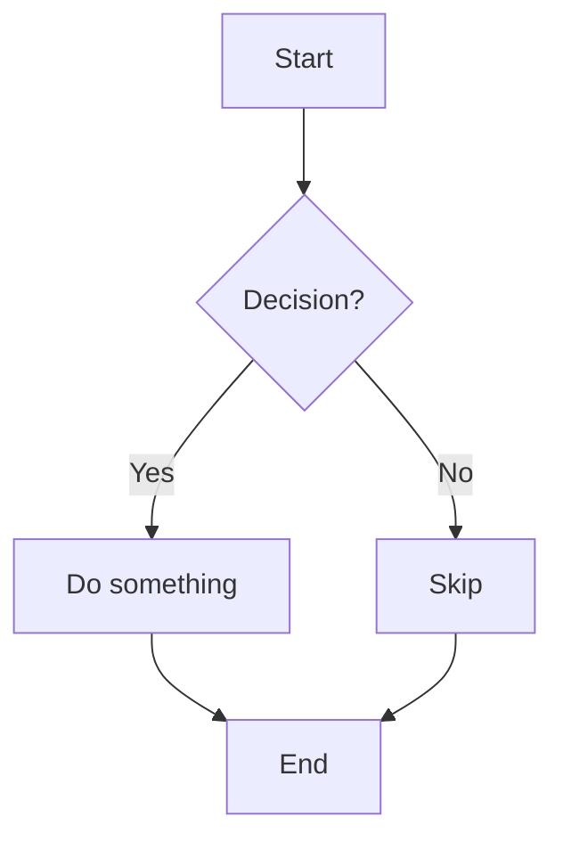
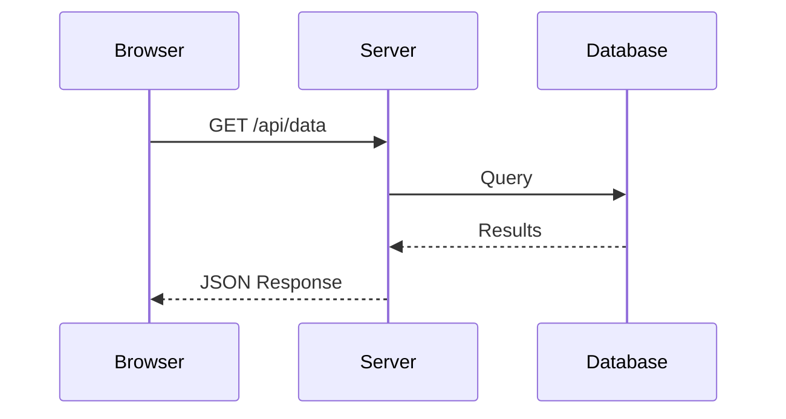
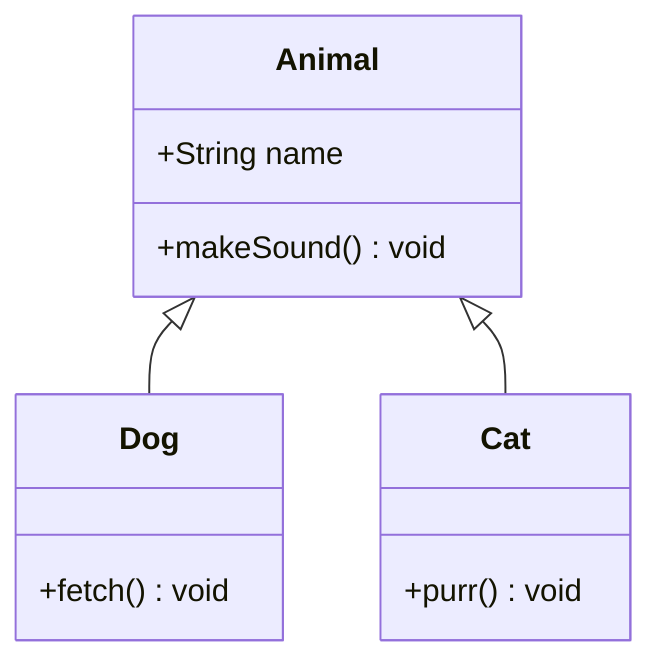
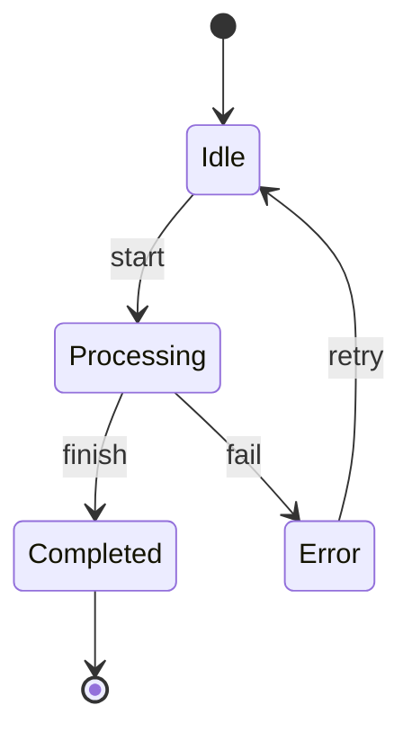
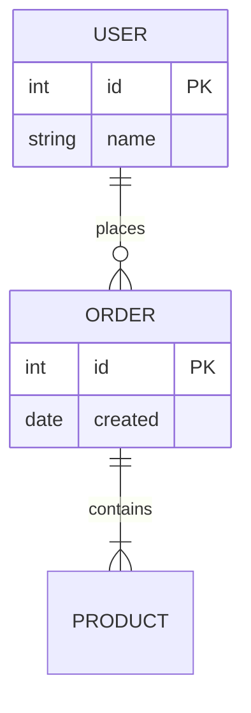
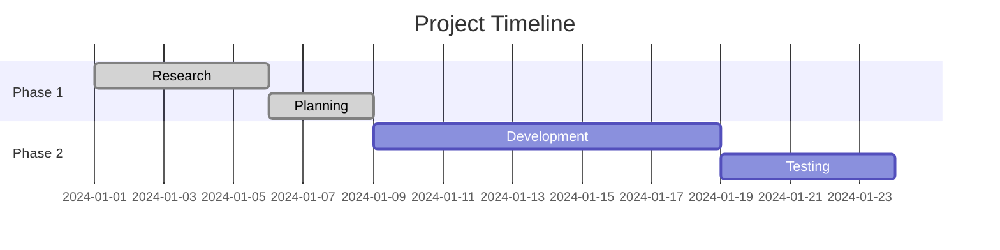
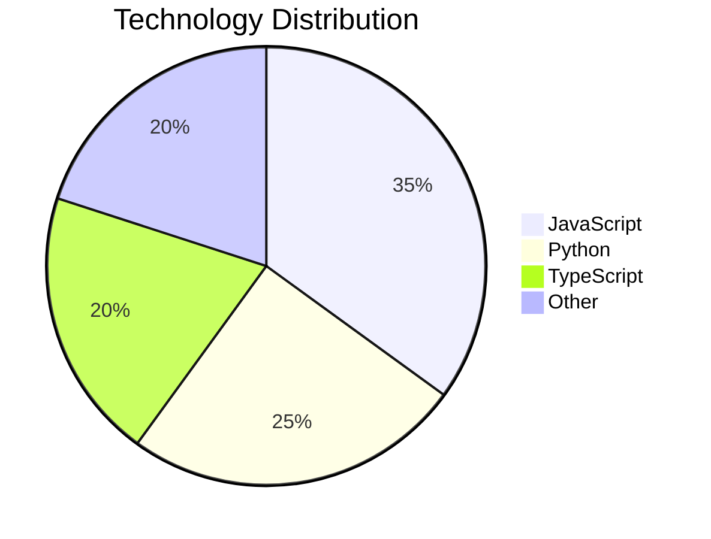
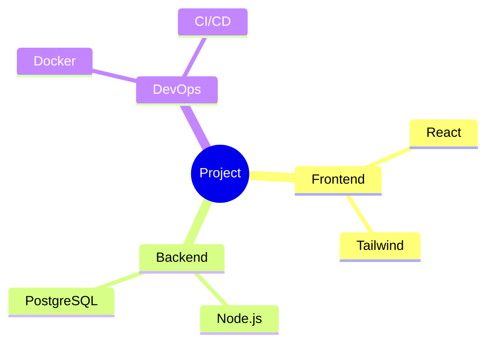
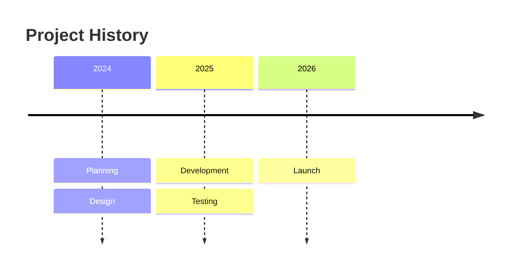

# Mermaid.js Diagram Types Reference

## Flowchart

```mermaid
flowchart TD
    A[Start] --> B{Decision?}
    B -->|Yes| C[Do something]
    B -->|No| D[Skip]
    C --> E[End]
    D --> E
```

## Sequence Diagram

```mermaid
sequenceDiagram
    participant Browser
    participant Server
    participant Database
    
    Browser->>Server: GET /api/data
    Server->>Database: Query
    Database-->>Server: Results
    Server-->>Browser: JSON Response
```

## Class Diagram

```mermaid
classDiagram
    class Animal {
        +String name
        +makeSound() void
    }
    class Dog {
        +fetch() void
    }
    class Cat {
        +purr() void
    }
    Animal <|-- Dog
    Animal <|-- Cat
```

## State Diagram

```mermaid
stateDiagram-v2
    [*] --> Idle
    Idle --> Processing : start
    Processing --> Completed : finish
    Processing --> Error : fail
    Error --> Idle : retry
    Completed --> [*]
```

## ER Diagram

```mermaid
erDiagram
    USER ||--o{ ORDER : places
    ORDER ||--|{ PRODUCT : contains
    USER {
        int id PK
        string name
    }
    ORDER {
        int id PK
        date created
    }
```

## Gantt Chart

```mermaid
gantt
    title Project Timeline
    dateFormat YYYY-MM-DD
    section Phase 1
        Research :done, r1, 2024-01-01, 5d
        Planning :done, p1, after r1, 3d
    section Phase 2
        Development :d1, after p1, 10d
        Testing :t1, after d1, 5d
```

## Pie Chart

```mermaid
pie
    title Technology Distribution
    "JavaScript" : 35
    "Python" : 25
    "TypeScript" : 20
    "Other" : 20
```

## Mindmap

```mermaid
mindmap
  root((Project))
    Frontend
      React
      Tailwind
    Backend
      Node.js
      PostgreSQL
    DevOps
      Docker
      CI/CD
```

## Timeline

```mermaid
timeline
    title Project History
    2024 : Planning
         : Design
    2025 : Development
         : Testing
    2026 : Launch
```
