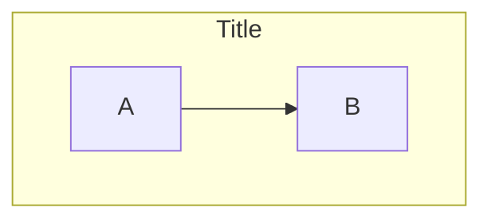

# Mermaid.js Flowchart Reference

## Directions
- `TD`/`TB` — Top-Down
- `LR` — Left-Right
- `BT` — Bottom-Top
- `RL` — Right-Left

## Classic Node Shapes
```
A[Rectangle]       — Standard box
A(Rounded)         — Rounded corners
A([Stadium])       — Pill shape
A{Diamond}         — Decision
A{{Hexagon}}       — Preparation
A((Circle))        — Circle
A[(Cylinder)]      — Database
A[/Parallelogram/] — Input/Output
A[\Trapezoid\]     — Alternative I/O
```

## Expanded Shapes (v11.3.0+)
```
A@{ shape: rect }       — Rectangle (process)
A@{ shape: rounded }    — Rounded rectangle (event)
A@{ shape: circle }     — Circle (start)
A@{ shape: dbl-circ }   — Double circle (stop)
A@{ shape: cyl }        — Cylinder (database)
A@{ shape: diamond }    — Diamond (decision)
A@{ shape: hex }        — Hexagon (prepare)
A@{ shape: lean-r }     — Lean right (I/O)
A@{ shape: lean-l }     — Lean left (I/O)
A@{ shape: datastore }  — Data store
A@{ shape: doc }        — Document
A@{ shape: cloud }      — Cloud
A@{ shape: fork }       — Fork/join
A@{ shape: person }     — Person
A@{ shape: flag }       — Flag
```

## Special Shapes (v11.3.0+)
```
A@{ icon: "fa:lock", label: "Secure" }
A@{ img: "url", w: 60, h: 60 }
```

## Edge Types
```
-->            Solid arrow
---            Solid line (no arrow)
-.->           Dotted arrow
==>            Thick arrow
-- text -->    Labeled arrow
-->|label|     Labeled arrow (alt)
o--o           Circle edge
x--x           Cross edge
<-->           Bidirectional arrow
```

## Minimum Length
Add extra dashes to increase edge length:
```
A---->B     — 2 extra ranks
A====>B     — Thick long edge
A-..->B     — Dotted long edge
```

## Subgraphs


## Collapsible Subgraphs (v11.17.0+)
```
subgraph id@{ view: collapsed }["Title"]
    ...
end
```

## Markdown Strings
```
A["`**Bold** text\nNew line`"]
```

## Interaction
```
click nodeId href "url"
click nodeId call callback()
```

## Edge IDs and Animation (v11.0.0+)
```
e1@--> B
classDef animate animation:fast
class e1 animate
```
