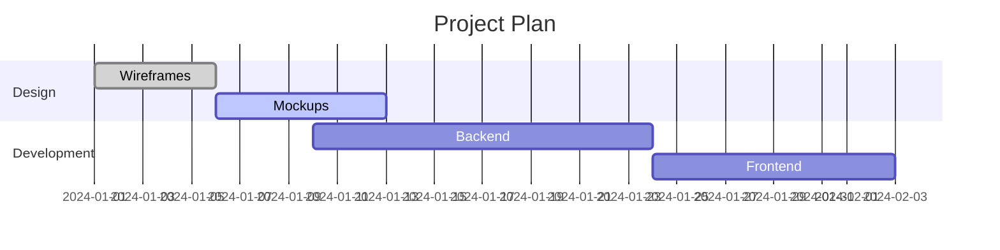

# Mermaid.js Gantt Chart Reference

## Structure


## Task Modifiers
- `:done` — Completed task
- `:active` — Currently active
- `:crit` — Critical path
- `:milestone` — Single point in time

## Duration Units
| Unit | Suffix | Example |
|------|--------|---------|
| Days | `d` | `3d` |
| Weeks | `w` | `2w` |
| Months | `M` | `1M` |
| Hours | `h` | `4h` |
| Minutes | `m` | `30m` |

## Date Formats
```
dateFormat YYYY-MM-DD
dateFormat DD-MM-YYYY
```

## Excludes
```
excludes weekends
excludes 2024-12-25
```

## Axis Format
```
axisFormat %Y-%m-%d
tickInterval 1day
```

## Compact Mode
```yaml
---
displayMode: compact
---
```

## Vertical Markers
```
vert 2024-06-15
```

## Weekend Configuration
```
weekend friday
```

## Task Syntax Variants
```
<taskID>, <startDate>, <endDate>
<taskID>, <startDate>, <length>
<taskID>, after <otherTaskId>, <endDate>
<taskID>, after <otherTaskId>, <length>
<startDate>, <endDate>
<length>
after <otherTaskId>, <length>
```

## Today Marker
```
todayMarker stroke-width:5px,stroke:#0f0,opacity:0.5
todayMarker off
```
