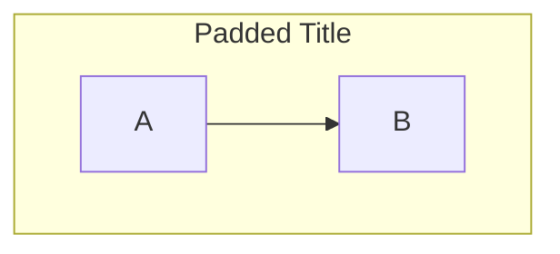
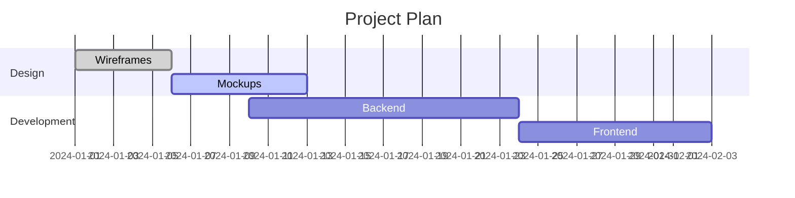

## Activation Context

Activate when the user needs to create, edit, validate, or troubleshoot Mermaid.js diagrams in Markdown files. This skill covers all 25+ Mermaid diagram types with syntax reference, best practices, and common pitfalls.

**Minimum version:** Mermaid.js `>=11.17.0`. Features from v10.3 through v11.17 are documented. If the project uses an older version, some syntax may not render. Always verify the installed version before generating diagrams.

---

## Instructions

When activated, follow these steps:

1. **Identify the diagram need** — Determine which diagram type best fits the user's request using the Supported Diagram Types table below.
2. **Generate the diagram** — Write a valid ````mermaid` code block with correct syntax. Use the syntax sections below as reference.
3. **Validate before output** — Run the validation script to catch common issues:
   ```bash
   OPENCODE_FILE_PATH=<path-to-file> python scripts/validate_mermaid.py
   ```
4. **Apply best practices** — Ensure meaningful labels, appropriate direction (`TD`/`LR`), subgraphs for grouping, and accessible styling.
5. **Troubleshoot broken diagrams** — If a diagram fails to render, check Common Pitfalls below and fix syntax errors.
6. **Reference examples** — See `examples/diagram_types.md` for working examples of each diagram type.

---

## Supported Diagram Types

| Type | Syntax | Use Case |
|------|--------|----------|
| Flowchart | `flowchart TD/LR` | Process flows, decision trees, system architecture |
| Swimlane | `block-beta` or `flowchart` with `subgraph` | Organizational processes, responsibility mapping |
| Sequence | `sequenceDiagram` | API interactions, message flows, temporal order |
| Class | `classDiagram` | OOP relationships, UML diagrams |
| State | `stateDiagram-v2` | Lifecycle management, state machines |
| ER | `erDiagram` | Database schema, entity relationships |
| Gantt | `gantt` | Project timelines, scheduling |
| Pie | `pie` | Proportional data, statistics |
| Mindmap | `mindmap` | Brainstorming, idea hierarchies |
| Timeline | `timeline` | Chronological events |
| Git | `gitGraph` | Version control visualization |
| C4 | `C4Context` | Architecture context diagrams |
| User Journey | `journey` | UX touchpoints, satisfaction |
| Quadrant | `quadrantChart` | Priority/matrix analysis |
| Requirement | `requirementDiagram` | Requirements traceability |
| Sankey | `sankey-beta` | Flow/energy/data transfers |
| XY Chart | `xychart-beta` | Bar/line charts |
| Block | `block-beta` | Block-based layouts |
| Packet | `packet-beta` | Network packet visualization |
| Kanban | `kanban-beta` | Task board visualization |
| Architecture | `architecture-beta` | Cloud/CI/CD architecture |
| Radar | `radar-beta` | Multi-axis comparison |
| Event Modeling | `eventModeling` | Event-sourced workflows |
| Treemap | `treemap-beta` | Hierarchical proportional data |
| Venn | `venn-beta` | Set relationships |
| Ishikawa | `ishikawa-beta` | Root cause analysis |
| Wardley | `wardley-beta` | Strategy mapping |
| Cynefin | `cynefin-beta` | Decision framework |
| TreeView | `treeView-beta` | Hierarchical tree display |
| ZenUML | `zenuml` | Sequence diagrams (ZenUML syntax) |

---

## Flowchart Syntax

### Directions
- `TD` or `TB` — Top-Down (hierarchical)
- `LR` — Left-Right (sequential pipelines)
- `BT` — Bottom-Top
- `RL` — Right-Left

### Node Shapes (Classic)
```
A[Rectangle]       — Standard box
A(Rounded)         — Rounded corners
A([Stadium])       — Pill shape
A{Diamond}         — Decision
A{{Hexagon}}       — Preparation
A((Circle))        — Circle
A[(Cylinder)]      — Database
A[/Parallelogram/] — Input/Output
A[\Trapezoid\]     — Alternative I/O
```

### Node Shapes (v11.3.0+ Expanded)
```
A@{ shape: rect }          — Rectangle (process)
A@{ shape: rounded }       — Rounded rectangle (event)
A@{ shape: circle }        — Circle (start)
A@{ shape: dbl-circ }      — Double circle (stop)
A@{ shape: cyl }           — Cylinder (database)
A@{ shape: diamond }       — Diamond (decision)
A@{ shape: hex }           — Hexagon (prepare)
A@{ shape: lean-r }        — Lean right (I/O)
A@{ shape: lean-l }        — Lean left (I/O)
A@{ shape: datastore }     — Data store
A@{ shape: doc }           — Document
A@{ shape: lock }          — Lock (security)
A@{ shape: cloud }         — Cloud
A@{ shape: fork }          — Fork/join
A@{ shape: frame }         — Frame
A@{ shape: window }        — Window
```

### Special Shapes (v11.3.0+)
```
A@{ icon: "fa:lock", label: "Secure" }   — Icon with label
A@{ img: "url", w: 60, h: 60 }           — Image node
```

### Edge Types
```
-->            Solid arrow
---            Solid line (no arrow)
-.->           Dotted arrow
==>            Thick arrow
-- text -->    Labeled arrow
-->|label|     Labeled arrow (alternative)
o--o           Circle edge
x--x           Cross edge
<-->           Bidirectional arrow
```

### Minimum Length
Add extra dashes/equals/dots to increase edge length:
```
A---->B     — Longer edge (2 extra ranks)
A====>B     — Thick long edge
A-..->B     — Dotted long edge
```

### Subgraphs


### Collapsible Subgraphs (v11.17.0+)
```
subgraph id@{ view: collapsed }["Title"]
    ...
end
```

### Markdown Strings
Use double quotes with backticks for formatted text:
```
A["`**Bold** text\nNew line`"]
```

### Interaction
```
click nodeId href "url"
click nodeId call callback()
```

### Edge IDs and Animation (v11.0.0+)
```
e1@--> B
classDef animate animation:fast
class e1 animate
```

### Frontmatter Configuration
```yaml
---
config:
  layout: elk
  look: handDrawn
  theme: forest
  markdownAutoWrap: false
---
```

### Layout Algorithms
- `dagre` (default) — Classic layout
- `elk` — Advanced layout for complex diagrams

---

## Sequence Diagram Syntax

### Participants
```
participant A as "API Gateway"
actor User
boundary Gateway
control Controller
entity Entity
database DB
queue Queue
```

### Actor Stereotypes (v10.3.0+)
```
participant "Gateway" as GW <<boundary>>
actor "User" as U <<person>>
```

### Message Types
```
A->>B: Message        — Solid arrow (sync call)
A-->>B: Response      — Dashed arrow (response)
A-xB: Failed          — Solid cross (failed)
A--xB: Timeout        — Dashed cross (timeout)
A->B: Request         — Solid open arrow
A-)B: Async           — Solid open arrow (async)
A--)B: Async dashed   — Dashed open arrow
A<<->>B: Bidirectional (v11.0.0+)
A-|\B: Half-arrow top (v11.12.3+)
A-|/B: Half-arrow bottom (v11.12.3+)
```

### Activations
```
A->>+B: Request
B-->>-A: Response
```

### Notes
```
note left of A: Important note
note right of B: Warning
note over A,B: Spans multiple participants
```

### Loops, Alt, Parallel, Critical
```
loop Every minute
    A->>B: Heartbeat
end

alt Success
    B-->>A: OK
else Failure
    B-->>A: Error
end

opt Optional step
    A->>B: Try
end

par Action 1
    A->>B: Do X
and Action 2
    A->>C: Do Y
end

critical Must happen
    A->>B: Execute
option Failure
    A->>C: Rollback
end
```

### Break (Exception)
```
break [Error occurred]
    A->>B: Failed
end
```

### Background Highlighting
```
rect rgb(0, 255, 0)
    A->>B: Green zone
end
```

### Grouping/Box
```
box Aqua Group Description
    A
    B
end
```

### Actor Creation/Destruction (v10.3.0+)
```
create participant B
A --> B: Hello
destroy B
```

### Central Connections (v11.12.3+)
```
A -->() B
```

### Autonumber (v11.15.0+)
```
autonumber 10 5
```

### Comments
```
%% This is a comment
```

### Configuration
```
sequence diagram
  diagramMarginX: 50
  diagramMarginY: 10
  boxTextMargin: 5
  noteMargin: 10
  messageMargin: 35
  mirrorActors: true
```

---

## Class Diagram Syntax

### Relationships
```
A <|-- B        — Inheritance
A *-- B         — Composition
A o-- B         — Aggregation
A --> B         — Association
A ..> B         — Dependency
A <|.. B        — Implementation
A -- B          — Link (Solid)
A .. B          — Link (Dashed)
```

### Members
```
+public
-protected
#private
~package
```

### Classifiers
```
someAbstractMethod()*      — Abstract
someStaticMethod()$        — Static
String someField$          — Static field
```

### Labels
```
class Animal["`**Wild** Animal`"]
```

### Generics
```
class Grid~K,V~
class List~T~
```

### Cardinality
```
[classA] "1" --> "0..*" [ClassB]
```

### Lollipop Interfaces
```
bar ()-- foo
foo --() bar
```

### Namespaces (v11.15.0+)
```
namespace MyNamespace {
    class Foo
}
namespace A.B.C {  // Nested via dot notation
    class Bar
}
```

### Annotations
```
<<Interface>>
<<Abstract>>
<<Service>>
<<Enumeration>>
```

### Notes
```
note "line1\nline2"
note for ClassName "Important note"
```

### Direction
```
classDiagram
    direction LR
```

---

## State Diagram Syntax

### States
```
[*] --> Idle          — Initial state
Idle --> Active       — Transition
Active --> [*]        — Final state
```

### State Descriptions
```
state "In Progress" as IP
state Done : Completed
```

### Composite States
```
state Active {
    [*] --> Running
    Running --> Paused
    Paused --> Running
}
```

### Choice
```
state Check {
    [*] --> Choosing
    Choosing <<choice>>
    Choosing --> A : valid
    Choosing --> B : invalid
}
```

### Forks
```
state Forking {
    [*] --> Fork
    Fork <<fork>>
    Fork --> A
    Fork --> B
    A --> Join
    B --> Join
    Join <<join>>
    Join --> [*]
}
```

### Concurrency
```
state Active {
    [*] --> Running
    --
    [*] --> Monitoring
}
```

### Notes
```
note right of Active: Important state
note left of Idle: Waiting
```

### Direction
```
stateDiagram-v2
    direction LR
```

### Styling
```
classDef active fill:#f00,color:white
class Active active
state Active:::active
```

---

## ER Diagram Syntax

### Entities and Relationships
```
USER ||--o{ ORDER : places
ORDER ||--|{ PRODUCT : contains
```

### Cardinality Markers
```
||--||  — One to one
||--o{  — One to zero/many
||--|{  — One to one/many
}o--o{  — Many to many
```

### Identification
```
--  — Identifying (solid line)
..  — Non-identifying (dashed line)
```

### Entity Attributes
```
USER {
    int id PK
    string name
    string email UK
    date created "Account creation date"
}
```

### Attribute Keys
- `PK` — Primary Key
- `FK` — Foreign Key
- `UK` — Unique Key
- `PK, FK` — Multiple constraints

### Optional Types (v11.16.0+)
```
USER {
    string? nickname
    int age
}
```

### Aliases
```
USER["Customer Table"] ||--o{ ORDER
```

### Subgraphs (v11.17.0+)
```
subgraph Customer Domain
    USER ||--o{ ORDER
end
```

### Direction
```
erDiagram
    direction TB
```

---

## Gantt Chart Syntax

### Structure


### Task Modifiers
- `:done` — Completed task
- `:active` — Currently active
- `:crit` — Critical path
- `:milestone` — Single point in time

### Duration Units
| Unit | Suffix | Example |
|------|--------|---------|
| Days | `d` | `3d` |
| Weeks | `w` | `2w` |
| Months | `M` | `1M` |
| Hours | `h` | `4h` |
| Minutes | `m` | `30m` |

### Excludes
```
excludes weekends
excludes 2024-12-25
```

### Axis Format
```
axisFormat %Y-%m-%d
tickInterval 1day
```

### Compact Mode
```yaml
---
displayMode: compact
---
```

### Vertical Markers (v11.0.0+)
```
vert 2024-06-15
```

### Weekend Configuration
```
weekend friday
```

---

## Pie Chart Syntax
```
pie
    title Technology Distribution
    "JavaScript" : 35
    "Python" : 25
    "TypeScript" : 20
```

---

## Mindmap Syntax

### Shapes
```
mindmap
  root((Root))
    Square[Square]
    Rounded(Rounded)
    Circle((Circle))
    Bang Bang
    Cloud[Cloud]
    Hexagon{{Hexagon}}
    Default[Default]
```

### Icons
```
mindmap
  root((App))
    Backend::icon(fa:server)
    Frontend::icon(fa:desktop)
```

### Classes
```
mindmap
  root((App))
    Critical::urgent
    Normal::default
```

### Markdown Strings
```
mindmap
  root((Project))
    A["`**Bold** text`"]
    B["`*Italic* text`"]
```

---

## Timeline Syntax

### Basic
```
timeline
    title Project History
    2024 : Planning
         : Design
    2025 : Development
         : Testing
    2026 : Launch
```

### Sections
```
timeline
    section Phase 1
        2024 Q1 : Research
        2024 Q2 : Design
    section Phase 2
        2024 Q3 : Development
```

### Direction (v11.14.0+)
```
timeline TD
    2024 : Event 1
```
- `LR` — Left to right (default)
- `TD` — Top to down

---

## GitGraph Syntax

### Basic
```
gitGraph
    commit
    commit
    branch develop
    commit
    checkout main
    merge develop
```

### Commit Attributes
```
commit id: "abc123"
commit type: HIGHLIGHT
commit tag: "v1.0.0"
```

### Commit Types
- `NORMAL` — Default (solid circle)
- `REVERSE` — Reversed (crossed circle)
- `HIGHLIGHT` — Highlighted (filled rectangle)

### Branch Order
```
branch feature order: 1
branch bugfix order: 2
```

### Orientation (v10.3.0+)
```
gitGraph TB    — Top to bottom
gitGraph BT    — Bottom to top
gitGraph LR    — Left to right (default)
```

### Cherry-Pick
```
cherry-pick id: "abc123"
```

### Configuration
```
---
config:
  gitGraph:
    showBranches: true
    showCommitLabel: true
    mainBranchName: main
    parallelCommits: false
---
```

---

## Architecture Diagram Syntax (v11.1.0+)

### Groups
```
group public_api(cloud)[Public API]
group private_api(cloud)[Private API] in public_api
```

### Services
```
service database1(database)[My Database]
service server1(server)[Server] in private_api
```

### Edges
```
db:R --> L:server       — Right to left
db:B --> T:server       — Bottom to top
server{group}:B --> T:db{group}  — Group edge
```

### Junctions
```
junction j1
```

### Align (v11.16.0+)
```
align row db1 db2 db3
align column srv1 srv2
```

### Icons (Default)
`cloud`, `database`, `disk`, `internet`, `server`

### Configuration
```yaml
---
config:
  architecture:
    randomize: false
    idealEdgeLengthMultiplier: 1.5
    seed: 1
---
```

---

## User Journey Syntax
```
journey
    title My working day
    section Go to work
      Make tea: 5: Me
      Go upstairs: 3: Me
      Do work: 1: Me, Cat
    section Go home
      Go downstairs: 5: Me
      Sit down: 5: Me
```

Score: 1 (worst) to 5 (best)

---

## Quadrant Chart Syntax
```
quadrantChart
    title Reach and engagement
    x-axis Low Reach --> High Reach
    y-axis Low Engagement --> High Engagement
    quadrant-1 We should expand
    quadrant-2 Need to promote
    quadrant-3 Re-evaluate
    quadrant-4 May be improved
    Campaign A: [0.3, 0.6]
    Campaign B: [0.45, 0.23]
```

---

## Requirement Diagram Syntax
```
requirementDiagram
    requirement test_req {
        id: 1
        text: the test text
        risk: high
        verifymethod: test
    }
    element test_entity {
        type: simulation
    }
    test_entity - satisfies -> test_req
```

---

## Sankey Diagram Syntax (v11.1.0+)
```
sankey-beta
    Shipments,Stock,25
    Stock,Imports,5
    Stock,Exports,10
```

---

## XY Chart Syntax (v11.3.0+)
```
xychart-beta
    title "Sales Revenue"
    x-axis [Jan, Feb, Mar, Apr, May]
    y-axis "Revenue (in $)" 4000 --> 11000
    bar [5000, 6000, 7500, 8200, 9500]
    line [5000, 6000, 7500, 8200, 9500]
```

---

## Block Diagram Syntax (v11.1.0+)
```
block-beta
    columns 3
    a["A"]:2 b
    block:c
        d e
    end
    f
```

---

## Packet Diagram Syntax (v11.1.0+)
```
packet-beta
    0-15: "Source Port"
    16-31: "Destination Port"
    32-63: "Sequence Number"
```

---

## Kanban Diagram Syntax (v11.3.0+)
```
kanban
    column1[Todo]
        task1[Design]
        task2[Prototype]
    column2[In Progress]
        task3[Coding]
    column3[Done]
```

---

## Radar Chart Syntax (v11.5.0+)
```
radar-beta
    title Performance
    axis Speed, "Battery Life", Price, "Camera Quality"
    "Phone A": [8, 7, 5, 9]
    "Phone B": [6, 9, 8, 7]
```

---

## Event Modeling Syntax (v11.3.0+)
```
eventModeling
    command PlaceOrder
    event OrderPlaced
    view OrderSummary
    command PlaceOrder --> event OrderPlaced
    event OrderPlaced --> view OrderSummary
```

---

## Treemap Syntax (v11.6.0+)
```
treemap-beta
    root
        "A": 10
        "B": 20
        "C":
            "D": 5
            "E": 15
```

---

## Venn Diagram Syntax (v11.6.0+)
```
venn-beta
    A: 10
    B: 15
    C: 8
    A&B: 5
    A&C: 3
    B&C: 4
    A&B&C: 2
```

---

## Ishikawa Diagram Syntax (v11.6.0+)
```
ishikawa-beta
    cause1[Root Cause 1]
    cause2[Root Cause 2]
    cause3[Root Cause 3]
    effect[Problem]
    cause1 --> effect
    cause2 --> effect
    cause3 --> effect
```

---

## Wardley Map Syntax (v11.3.0+)
```
wardley-beta
    visibility [0.1, 0.9]
    evolution [0.1, 0.9]
    component Genesis [0.2, 0.9]
    component Custom [0.4, 0.7]
    component Product [0.6, 0.5]
    component Commodity [0.8, 0.3]
    Genesis --> Custom
    Custom --> Product
    Product --> Commodity
```

---

## Cynefin Framework Syntax (v11.6.0+)
```
cynefin-beta
    complex[Complex]
    complicated[Complicated]
    clear[Clear]
    chaotic[Chaotic]
    disorder[Disorder]
    complex --> clear
    complicated --> clear
```

---

## TreeView Syntax (v11.6.0+)
```
treeView-beta
    root[Root]
        child1[Child 1]
            grandchild1[Grandchild 1]
            grandchild2[Grandchild 2]
        child2[Child 2]
```

---

## ZenUML Syntax
```
zenuml
    title My Sequence
    Client -> Server: Request
    Server -> Database: Query
    Database --> Server: Results
    Server --> Client: Response
```

---

## Best Practices

### 1. Choose the Right Diagram Type
- **Process/Decision** → Flowchart
- **API/Temporal** → Sequence
- **Database** → ER
- **Object Model** → Class
- **Lifecycle** → State
- **Timeline** → Gantt or Timeline
- **Proportions** → Pie
- **Ideas** → Mindmap
- **Strategy** → Wardley
- **Root Cause** → Ishikawa
- **Sets** → Venn

### 2. Keep It Simple
- One concept per diagram
- Split diagrams with >20 nodes
- Use subgraphs for grouping

### 3. Use Meaningful Labels
- Not just A, B, C
- Describe the actual entity/process

### 4. Direction Matters
- `LR` for sequential pipelines
- `TB` for hierarchies
- `TD` for complex layouts

### 5. Style for Accessibility
```mermaid
flowchart TD
    classDef primary fill:#e1f5fe,stroke:#0288d1,stroke-width:2px
    classDef secondary fill:#f3e5f5,stroke:#7b1fa2,stroke-width:2px
    class A primary
    class B secondary
```

### 6. Version Control
- Mermaid diagrams are text-based
- Track changes with Git
- Review diagram diffs like code

---

## Common Pitfalls

1. **The word "end"** — Wrap in quotes: `[end]`, `(end)`, `{end}`, or capitalize: `END`, `End`
2. **Special characters** — Wrap labels in quotes: `A["text (with parens)"]`
3. **Comments** — Use `%%` but avoid `{}` inside comments
4. **First line** — Diagram type keyword must be first non-blank line
5. **ER attributes** — One attribute per line inside `{}`
6. **Node "o" and "x"** — Add space before `o` or `x` as first letter: `A---o B` (not `A---oB`)
7. **Sequence diagram "end"** — Wrap in parentheses, quotes, or brackets

---

## Styling Reference

### Color Palette (Light/Dark Compatible)
```
Blue:   fill:#e3f2fd, stroke:#1976d2
Green:  fill:#e8f5e9, stroke:#388e3c
Orange: fill:#fff3e0, stroke:#f57c00
Purple: fill:#f3e5f5, stroke:#7b1fa2
Red:    fill:#ffebee, stroke:#d32f2f
Yellow: fill:#fffde7, stroke:#fbc02d
```

### Stroke Weights
- `2px` — Standard elements
- `3px` — Emphasized/important
- `1px` — De-emphasized

### Themes
- `default` — Default theme
- `forest` — Green tones
- `dark` — Dark background
- `neutral` — Grayscale
- `base` — Minimal

### Directives
```
%%{init: {'theme': 'dark'}}%%
%%{init: {'themeVariables': {'primaryColor': '#ff0000'}}}%%
```

---

## Diagram Breakers

| Issue | Reason | Solution |
|-------|--------|----------|
| Comments `%%{}%%` | Confuses renderer with directives | Avoid `{}` in comments |
| "end" in flowcharts | Breaks parser | Wrap in quotes or capitalize |
| Nested shapes | Confuses parser | Wrap in quotes |
| "o" or "x" as first letter | Creates circle/cross edge | Add space: `A---o B` |

---

## References

- [Mermaid Live Editor](https://mermaid.live)
- [Official Documentation](https://mermaid.js.org/intro/)
- [Syntax Reference](https://mermaid.js.org/intro/syntax-reference.html)
- [Configuration](https://mermaid.js.org/config/configuration.html)
