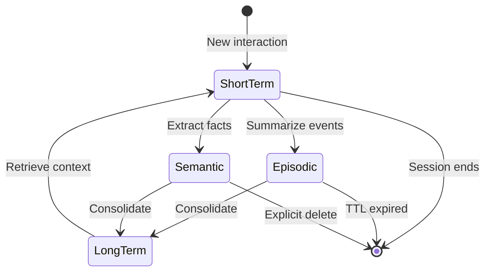
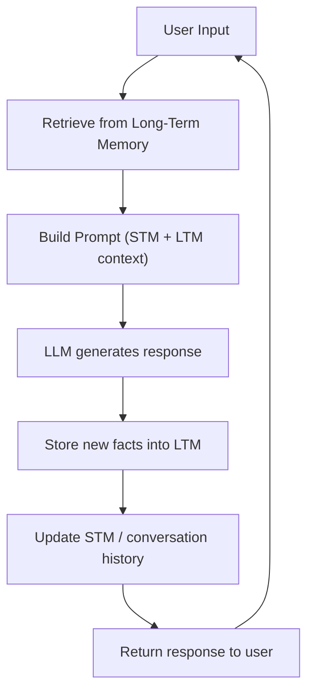
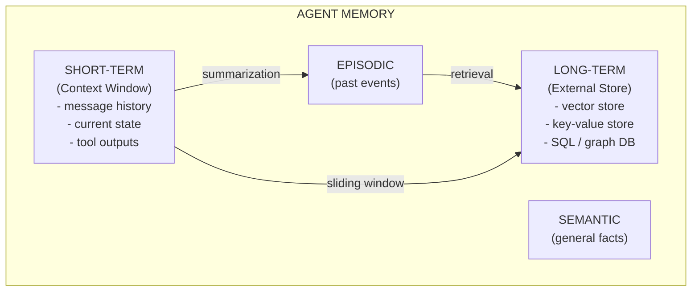

# Foundations of Agent Memory

Memory is what separates a stateless chatbot from a truly intelligent agent. Without memory, every interaction starts from scratch — the agent cannot learn, personalize, or carry context across turns.

---

## Why Agents Need Memory

Modern LLMs are stateless by nature: they process a single context window and forget everything once the response is generated. Agents, however, operate over multiple steps — they call tools, revisit earlier conclusions, and interact with users over long sessions.

Memory enables:

- **Continuity** — the agent remembers what was said earlier in the conversation
- **Personalization** — user preferences persist across sessions
- **Learning** — facts extracted from one interaction inform future ones
- **Coherence** — multi-step reasoning chains stay consistent

[!WARNING]
Without explicit memory, an agent cannot distinguish between "tell me about my last order" and "tell me about your capabilities." The context window alone is insufficient for persistent knowledge.

---

## Short-Term vs Long-Term Memory

Agents, like humans, use multiple memory systems that operate at different timescales.

| Feature | Short-Term Memory | Long-Term Memory |
| :--- | :--- | :--- |
| Duration | Within a single conversation | Across sessions / persistent |
| Storage | In-memory (context window) | External store (DB, vector store) |
| Capacity | Limited (token limit of LLM) | Virtually unlimited |
| Retrieval | Direct (full context) | Query-based / similarity search |
| Forgetting | Automatic (context overflow) | Explicit deletion or TTL |
| Use case | Immediate conversation history | User profile, learned facts |

[!NOTE]
Short-term memory in agents is analogous to human working memory — it holds information temporarily while the agent processes the current task. The key difference is that agent STM is bounded by token limits, not by cognitive capacity.

---

## Episodic vs Semantic Memory

Another key distinction comes from cognitive science:

- **Episodic memory** — stores specific events or past interactions ("the user asked about pricing on Tuesday")
- **Semantic memory** — stores general factual knowledge ("pricing is $10/month for the pro plan")

Episodic memory helps the agent recall what happened. Semantic memory helps the agent know what is true.

[!TIP]
When designing an agent, use episodic memory for debugging and audit trails (what happened when), and semantic memory for user profiles and knowledge bases (what is true). Both are typically stored in the same underlying vector store but tagged with different metadata.

### Memory Type State Diagram



### Comparison Table: All Memory Types

| Memory Type | Scope | Persistence | Retrieval Method | Example |
| :--- | :--- | :--- | :--- | :--- |
| Short-Term | One session | Ephemeral | Direct (in context) | Last 10 messages |
| Long-Term | Cross-session | Persistent | Query / similarity search | User's favorite color |
| Episodic | Specific events | Durable | Time-based recall | "User clicked checkout at 2pm" |
| Semantic | General facts | Durable | Semantic search | "Tax rate is 8.5%" |
| Working | Current task | Volatile | In-memory variables | "Step 3 of 5 in checkout flow" |

---

## Memory in Conversation Loops

A typical agent loop with memory:



The cycle ingests user input, augments it with retrieved memories, generates a reply, and then persists any new information learned.

[!IMPORTANT]
The order of operations matters: retrieval happens *before* generation, not after. If you retrieve facts after generating a response, the agent will hallucinate or give inconsistent answers. Always retrieve context first, then generate.

---

## Memory Encoding Strategies

How information is encoded into memory determines how easily it can be retrieved later. Agents can use several encoding strategies:

| Encoding Strategy | Description | Use Case | Retrieval Efficiency |
| :--- | :--- | :--- | :--- |
| Raw storage | Store verbatim text | Conversation history | Direct (exact match) |
| Semantic encoding | Convert to embeddings | Knowledge retrieval | High (semantic search) |
| Structured encoding | Extract to key-value pairs | Entity facts | High (direct lookup) |
| Temporal encoding | Tag with timestamps | Episodic recall | Moderate (time-range filter) |
| Hierarchical encoding | Organize by topic/section | Document knowledge | High (structural navigation) |

```python
class MemoryEncoder:
    """Demonstrates different memory encoding strategies."""

    @staticmethod
    def raw_encode(message: str, role: str) -> dict:
        """Store message verbatim."""
        return {"type": "raw", "role": role, "content": message}

    @staticmethod
    def structured_encode(text: str) -> dict[str, str]:
        """Extract key-value pairs from structured text."""
        import re
        facts = {}
        pairs = re.findall(r"(\w+)\s*(?:is|:|=)\s*(.+?)(?:\.|,|$)", text)
        for key, value in pairs:
            facts[key.strip()] = value.strip()
        return {"type": "structured", "facts": facts}

    @staticmethod
    def temporal_encode(event: str, timestamp: str) -> dict:
        """Tag memory with temporal context."""
        return {"type": "temporal", "event": event, "when": timestamp}

# Example usage
encoder = MemoryEncoder()
raw = encoder.raw_encode("Hello, I need help", "user")
structured = encoder.structured_encode("Name is Alice, role is engineer")
temporal = encoder.temporal_encode("user_login", "2025-01-15T10:30:00Z")

print(structured["facts"])
# Output: {'Name': 'Alice', 'role': 'engineer'}
```

[!NOTE]
The encoding strategy you choose directly impacts memory retrieval performance. Raw encoding preserves full fidelity but requires more storage and slower search. Structured encoding is compact and fast to query but loses nuanced meaning. Most production systems use a combination — raw for recent context, structured for long-term facts, and semantic embeddings for knowledge retrieval.

---

## Retrieval Cues and Memory Recall

Memory recall in agents is triggered by retrieval cues — signals that indicate which memories are relevant to the current context. Good retrieval cue design is essential for effective memory usage.

```python
class RetrievalCue:
    """Defines how to construct retrieval cues from context."""

    def __init__(self):
        self.cue_components = []

    def add_keywords(self, keywords: list[str]):
        self.cue_components.append(("keywords", keywords))

    def add_entity(self, entity_name: str, entity_type: str):
        self.cue_components.append(("entity", (entity_name, entity_type)))

    def add_time_range(self, start: str, end: str):
        self.cue_components.append(("time_range", (start, end)))

    def add_conversation_context(self, last_n_messages: list[str]):
        self.cue_components.append(("context_messages", last_n_messages))

    def build_query(self) -> dict:
        """Build a structured query from cue components."""
        query = {}
        for cue_type, value in self.cue_components:
            if cue_type == "keywords":
                query["keywords"] = value
            elif cue_type == "entity":
                query["entity_name"], query["entity_type"] = value
            elif cue_type == "time_range":
                query["time_start"], query["time_end"] = value
        return query

# Usage: build a retrieval cue from user message
cue = RetrievalCue()
cue.add_keywords(["return policy", "refund"])
cue.add_entity("customer_123", "user")
query = cue.build_query()
print(query)
# Output: {'keywords': ['return policy', 'refund'],
#          'entity_name': 'customer_123', 'entity_type': 'user'}
```

Types of retrieval cues commonly used in agent systems:
- **Semantic cues**: embedding of the current query or message
- **Entity cues**: named entities mentioned in the conversation
- **Temporal cues**: recency, specific dates or time ranges
- **Contextual cues**: conversation topic, task type, user intent
- **Metadata cues**: source document, author, department, language

---

## Working Memory in Agents

Working memory is the agent's scratchpad — the temporary space where intermediate reasoning steps, tool outputs, and partial results live during a single turn.

```python
class AgentWorkingMemory:
    """A simple working memory for tracking current task state."""

    def __init__(self):
        self.steps = []
        self.tool_outputs = {}
        self.current_goal = None

    def add_step(self, step: str, result: str):
        self.steps.append({"step": step, "result": result})

    def store_tool_output(self, tool_name: str, output: str):
        self.tool_outputs[tool_name] = output

    def get_context(self) -> str:
        lines = [f"Goal: {self.current_goal}"]
        for s in self.steps:
            lines.append(f"  {s['step']}: {s['result']}")
        return "\n".join(lines)

# Usage
wm = AgentWorkingMemory()
wm.current_goal = "Look up order history"
wm.add_step("search_orders", "Found 3 recent orders")
wm.add_step("format_response", "Prepared summary")
print(wm.get_context())
```

Working memory is not persisted — it is cleared between turns or when the task completes.

---

## Forgetting and Context Windows

Every LLM has a fixed context window (4K, 8K, 32K, 128K tokens). When the conversation exceeds this limit, the agent must decide what to forget.

Strategies:

- **Sliding window** — keep the last N messages, drop older ones
- **Summarization** — condense earlier conversation into a summary
- **Selective retention** — keep important facts, drop filler
- **Hybrid** — keep a summary + recent messages + retrieved facts

```python
from collections import deque

class SlidingWindowMemory:
    """Keep only the last N messages in context."""

    def __init__(self, max_messages: int = 10):
        self.messages = deque(maxlen=max_messages)

    def add_message(self, role: str, content: str):
        self.messages.append({"role": role, "content": content})

    def get_context(self) -> list[dict]:
        return list(self.messages)

# Example: sliding window keeps 5 most recent exchanges
sw = SlidingWindowMemory(max_messages=5)
sw.add_message("user", "Hello")
sw.add_message("assistant", "Hi! How can I help?")
sw.add_message("user", "What's the weather?")
sw.add_message("assistant", "It's sunny.")
sw.add_message("user", "Tell me about AI")
sw.add_message("assistant", "AI stands for...")
print(len(sw.get_context()))  # Output: 5 (oldest "Hello" was dropped)
```

[!WARNING]
Choosing what to forget is as important as choosing what to remember. A poor forgetting strategy causes agents to lose critical context or exceed token budgets.

[!TIP]
For production systems, use a hybrid approach: keep a running summary of the entire conversation, plus the last N raw messages, plus any entity facts retrieved from long-term memory. This gives you both precision and recall.

---

## Memory Consolidation Pipeline

Memory consolidation moves information from short-term to long-term storage. Here is a basic consolidation system:

```python
import json
import time
from typing import Any

class MemoryConsolidator:
    """Consolidates short-term memories into long-term storage."""

    def __init__(self, ttl_seconds: int = 3600):
        self.short_term: list[dict] = []
        self.long_term: dict[str, Any] = {}
        self.ttl = ttl_seconds

    def observe(self, event: str, data: dict):
        """Record a short-term memory."""
        self.short_term.append({
            "event": event,
            "data": data,
            "timestamp": time.time(),
        })

    def consolidate(self):
        """Move memories from short-term to long-term."""
        now = time.time()
        still_fresh = []

        for mem in self.short_term:
            age = now - mem["timestamp"]
            if age < self.ttl:
                still_fresh.append(mem)
            else:
                key = mem["event"]
                if key not in self.long_term:
                    self.long_term[key] = []
                self.long_term[key].append(mem["data"])

        self.short_term = still_fresh

    def recall(self, event: str) -> list[dict]:
        """Retrieve consolidated memories for an event."""
        return self.long_term.get(event, [])

# Usage
mc = MemoryConsolidator(ttl_seconds=10)
mc.observe("user_login", {"user_id": 42, "time": "2025-01-15"})
mc.observe("page_view", {"page": "/pricing", "duration_ms": 3000})
time.sleep(1)
mc.consolidate()
print(mc.recall("user_login"))
```

---

## Mermaid Diagram of Agent Memory Architecture



---

## Memory Governance and Access Control

In multi-tenant agent systems, memory must be scoped to the correct user or session. Memory governance ensures that one user's memories never leak into another user's context.

```python
class ScopedMemory:
    """Memory that enforces user-level isolation."""

    def __init__(self):
        self.stores: dict[str, dict] = {}

    def _get_store(self, user_id: str) -> dict:
        if user_id not in self.stores:
            self.stores[user_id] = {
                "short_term": [],
                "long_term": {},
            }
        return self.stores[user_id]

    def add_to_short_term(self, user_id: str, message: dict):
        store = self._get_store(user_id)
        store["short_term"].append(message)
        # Enforce max length per user
        if len(store["short_term"]) > 50:
            store["short_term"].pop(0)

    def store_fact(self, user_id: str, key: str, value: str):
        store = self._get_store(user_id)
        store["long_term"][key] = value

    def get_context(self, user_id: str) -> dict:
        store = self._get_store(user_id)
        return {
            "recent": store["short_term"][-10:],
            "facts": dict(store["long_term"]),
        }

# Usage: each user gets isolated memory
memory = ScopedMemory()
memory.add_to_short_term("alice_42", {"role": "user", "content": "Hi"})
memory.store_fact("alice_42", "name", "Alice")
memory.store_fact("bob_99", "name", "Bob")
print(memory.get_context("alice_42")["facts"])
# Output: {'name': 'Alice'}  — Bob's data is isolated
```

| Governance Aspect | Implementation | Why It Matters |
| :--- | :--- | :--- |
| User isolation | Key memory stores by user_id | Prevents cross-user data leakage |
| Session scoping | TTL-based memory expiration | Automatic cleanup after session ends |
| Data classification | Tag memories as public/private | Compliance with data regulations |
| Audit logging | Log all memory writes and reads | Debugging and compliance tracing |
| Deletion API | Allow users to delete their memories | GDPR/CCPA right-to-delete compliance |

[!IMPORTANT]
Memory governance is critical in production. A single memory leak — where User A's data appears in User B's context — can violate privacy regulations (GDPR, CCPA) and erode user trust. Always implement user-level memory isolation as a foundational requirement, not an afterthought.

---

## Context Window vs. Memory — Key Distinction

[!IMPORTANT]
The context window is NOT memory — it is temporary storage that gets overwritten every turn. True memory requires writing to and reading from an external persistence layer. Never confuse the context window with long-term memory.

| Aspect | Context Window | Memory System |
| :--- | :--- | :--- |
| Lifetime | Single request | Persistent across sessions |
| Capacity | Fixed (4K-128K tokens) | Virtually unlimited |
| Retrieval | Automatic (all content) | Selective (query-based) |
| Cost | Included in inference | Additional storage + retrieval |
| Persistence | Volatile | Durable (DB, file, vector store) |

---

## 5 Practice Questions

```question
{
  "id": "am-01-q1",
  "type": "multiple-choice",
  "question": "Why are LLMs considered stateless?",
  "options": [
    "They cannot generate text",
    "They process each input independently",
    "They only understand one language",
    "They don't use context windows"
  ],
  "correct": 1,
  "explanation": "LLMs are stateless because they process each input independently — they have no built-in mechanism to carry context or memory across interactions."
}
```

```question
{
  "id": "am-01-q2",
  "type": "multiple-choice",
  "question": "Which memory type is best for storing \"the user's name\"?",
  "options": [
    "Episodic",
    "Semantic",
    "Short-Term",
    "Working"
  ],
  "correct": 1,
  "explanation": "Semantic memory stores general factual knowledge, such as a user's name, making it the best choice for this type of persistent information."
}
```

```question
{
  "id": "am-01-q3",
  "type": "multiple-choice",
  "question": "What happens when a conversation exceeds the context window?",
  "options": [
    "The LLM crashes",
    "Older messages are dropped or compressed",
    "The context window auto-expands",
    "The session is terminated"
  ],
  "correct": 1,
  "explanation": "When the context window is exceeded, older messages are dropped or compressed to stay within the token limit."
}
```

```question
{
  "id": "am-01-q4",
  "type": "multiple-choice",
  "question": "Which strategy keeps the most recent messages and discards old ones?",
  "options": [
    "Summarization",
    "Selective retention",
    "Sliding window",
    "Hybrid"
  ],
  "correct": 2,
  "explanation": "A sliding window keeps the last N messages and drops older ones as new messages arrive."
}
```

```question
{
  "id": "am-01-q5",
  "type": "multiple-choice",
  "question": "Episodic memory differs from semantic memory in that episodic memory:",
  "options": [
    "Stores general facts",
    "Stores specific past events",
    "Is always persistent",
    "Never needs retrieval"
  ],
  "correct": 1,
  "explanation": "Episodic memory stores specific past events and experiences, while semantic memory stores general factual knowledge."
}
```

```question
{
  "id": "am-01-q6",
  "type": "multiple-choice",
  "question": "An agent asks \"What is the capital of France?\" and the memory returns \"Paris.\" This is an example of which memory type?",
  "options": [
    "Episodic memory",
    "Semantic memory",
    "Working memory",
    "Procedural memory"
  ],
  "correct": 1,
  "explanation": "The fact that Paris is the capital of France is general knowledge, which is stored in semantic memory."
}
```

```question
{
  "id": "am-01-q7",
  "type": "multiple-choice",
  "question": "In a memory consolidation pipeline, what triggers the move from short-term to long-term storage?",
  "options": [
    "Every user message",
    "Time-based expiration or explicit consolidation event",
    "Only when the agent shuts down",
    "Never — short-term memory never moves to long-term"
  ],
  "correct": 1,
  "explanation": "Consolidation is triggered by time-based TTL or explicit events like session end or reaching a token threshold."
}
```

---

[!SUCCESS]
### Key Takeaways

- Agents need memory to maintain continuity, personalization, learning, and coherence across interactions.
- Short-term memory lives in the context window; long-term memory requires an external store.
- Episodic memory records specific past events; semantic memory stores general factual knowledge.
- Working memory is the agent's scratchpad for current task state and is not persisted.
- Memory is integrated into a conversation loop: retrieve, augment, generate, persist.
- Context windows impose a hard limit; forgetting strategies (sliding window, summarization, selective retention) manage overflow.
- The agent memory architecture combines short-term, long-term, episodic, and semantic stores into a unified system.
- Choosing what to forget is as critical as choosing what to remember.
- Memory consolidation moves data from short-term to long-term storage based on TTL or explicit triggers.
