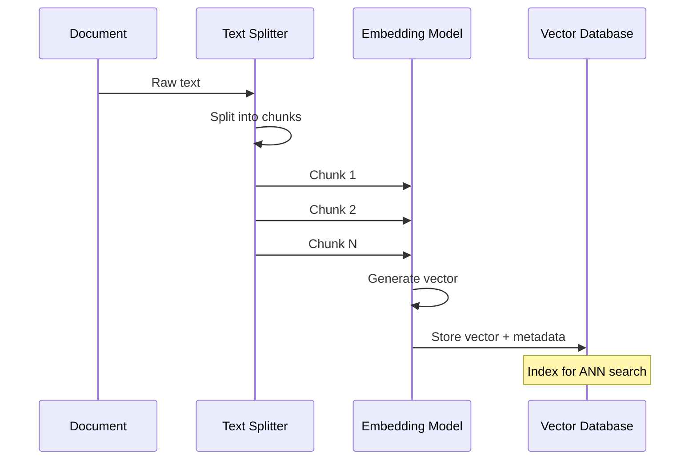
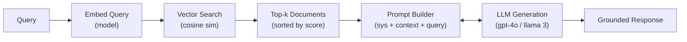

# Vector Stores, Embeddings and RAG Architecture

Retrieval-Augmented Generation (RAG) is the dominant pattern for grounding LLM responses in external knowledge. At its core are **embeddings** — numerical representations of meaning — and **vector databases** that index and search them.

---

## What Are Embeddings?

An embedding is a dense vector (list of floats) that captures the semantic meaning of a piece of text. Texts with similar meaning cluster together in vector space.

```
"The cat sat on the mat"
        |
        v
[0.023, -0.145, 0.312, ..., 0.078]   ← 384-dimensional vector
        |
        v
"A dog slept on the rug"
        |
        v
[0.019, -0.138, 0.305, ..., 0.081]   ← close in vector space
```

Embedding models (e.g., `text-embedding-3-small`, `all-MiniLM-L6-v2`) map text to a fixed-size vector regardless of input length.

[!NOTE]
Embedding models have a maximum input token limit (typically 512 tokens for open-source models, 8192 for OpenAI's `text-embedding-3-large`). Documents longer than this limit must be split into chunks before embedding — this is why chunking is a critical part of any RAG pipeline.

### Common Embedding Models

| Model | Dimensions | Max Tokens | Cost | Best For |
| :--- | :--- | :--- | :--- | :--- |
| `text-embedding-3-small` | 512-1536 | 8192 | $0.02/1K tokens | General purpose, cost-sensitive |
| `text-embedding-3-large` | 256-3072 | 8192 | $0.13/1K tokens | High-accuracy needs |
| `all-MiniLM-L6-v2` | 384 | 512 | Free (local) | Local/offline, prototyping |
| `intfloat/e5-large-v2` | 1024 | 512 | Free (local) | High-quality open-source |
| `BAAI/bge-large-en-v1.5` | 1024 | 512 | Free (local) | English retrieval tasks |

---

## Cosine Similarity

The most common way to compare two embeddings is **cosine similarity**:

```
cosine_similarity(A, B) = (A · B) / (||A|| * ||B||)
```

- Ranges from -1 (opposite meaning) to 1 (identical meaning)
- Values above 0.8 typically indicate strong semantic similarity
- Used by vector databases to rank search results

[!WARNING]
Cosine similarity assumes all dimensions are equally weighted. If your embedding model is biased or poorly trained, similarity scores may not reflect true semantic relevance. Always evaluate retrieval quality on your specific domain.

### Distance Metrics Comparison

| Metric | Range | Use Case | Speed |
| :--- | :--- | :--- | :--- |
| Cosine similarity | [-1, 1] | Semantic text search | Fast |
| Euclidean (L2) | [0, ∞) | Image embeddings, clustering | Fast |
| Dot product | (-∞, ∞) | Normalized vectors, efficiency | Very fast |
| Manhattan (L1) | [0, ∞) | Sparse vectors | Moderate |
| Hamming | [0, dim] | Binary embeddings | Very fast |

---

## Embedding Dimensionality and Performance

The dimensionality of your embeddings has a direct impact on both search accuracy and storage cost. Higher dimensions capture more nuanced meaning but require more storage and slower search.

```python
# OpenAI lets you reduce embedding dimensions via `dimensions` parameter
import openai

# text-embedding-3-large supports dimensions from 256 to 3072
# Smaller dimensions = faster search, less storage, potentially less accuracy
embeddings_256 = openai.embeddings.create(
    input="Your text here",
    model="text-embedding-3-large",
    dimensions=256,  # reduce from default 3072 to 256
)
embeddings_3072 = openai.embeddings.create(
    input="Your text here",
    model="text-embedding-3-large",  # default: 3072 dimensions
)

print(f"Reduced: {len(embeddings_256.data[0].embedding)} dims")
print(f"Full: {len(embeddings_3072.data[0].embedding)} dims")
# Output: Reduced: 256 dims
#         Full: 3072 dims
```

| Dimensions | Storage (1M vectors) | Search Latency | Accuracy Retention | Best For |
| :--- | :--- | :--- | :--- | :--- |
| 256 | ~1 GB | Very fast | ~95% | Cost-sensitive, high-throughput |
| 512 | ~2 GB | Fast | ~98% | General purpose, balanced |
| 1024 | ~4 GB | Moderate | ~99% | High accuracy requirements |
| 1536 | ~6 GB | Slow | ~100% | Maximum accuracy (default for 3-small) |
| 3072 | ~12 GB | Slowest | ~100% | Maximum accuracy (default for 3-large) |

[!TIP]
Always test with reduced dimensions before committing to the full vector size. Many applications retain >95% accuracy at 256-512 dimensions, dramatically reducing storage and speeding up search. OpenAI's `text-embedding-3` models support native dimensionality reduction via the `dimensions` parameter — no post-processing needed.

---

## Embedding Generation Pipeline

The embedding process transforms raw text into searchable vectors:



---

## Document Chunking

Raw documents must be split into chunks before embedding. Chunking strategy directly impacts retrieval quality.

```python
from langchain.text_splitter import RecursiveCharacterTextSplitter

# Load a document
with open("report.md", "r") as f:
    text = f.read()

# Create a recursive text splitter
splitter = RecursiveCharacterTextSplitter(
    chunk_size=500,        # target characters per chunk
    chunk_overlap=50,      # overlap between chunks
    separators=["\n\n", "\n", ".", " "],  # priority order
    length_function=len,
)

chunks = splitter.split_text(text)
print(f"Split into {len(chunks)} chunks")
# Output: Split into 23 chunks
```

Overlap ensures that sentences or ideas split across chunk boundaries are not lost.

### Chunking Strategies Comparison

| Strategy | Split Unit | Preserves Structure | Overlap Support | Best For |
| :--- | :--- | :--- | :--- | :--- |
| RecursiveCharacter | Characters (by separator) | Moderate | Yes | General text, most use cases |
| Token | Tokens (model-aware) | Low | Yes | LLM-context-aligned chunks |
| MarkdownHeader | Markdown headers | High | No | Documentation, wikis |
| RecursiveJson | JSON keys | High | No | Structured JSON data |
| HTMLHeader | HTML tags (h1, h2, etc.) | High | No | Web pages, HTML docs |
| Semantic | Sentence embeddings | High | No | Coherent passage preservation |

```python
from langchain.text_splitter import (
    TokenTextSplitter,
    MarkdownHeaderTextSplitter,
)

# Token-aware splitting (matches LLM tokenizers)
token_splitter = TokenTextSplitter(
    chunk_size=256,      # tokens, not characters
    chunk_overlap=50,
)

# Markdown-aware splitting (preserves header structure)
headers_to_split_on = [
    ("#", "Header 1"),
    ("##", "Header 2"),
]
markdown_splitter = MarkdownHeaderTextSplitter(
    headers_to_split_on=headers_to_split_on,
)

# Semantic chunking using sentence boundaries
from langchain.text_splitter import SentenceTransformersTokenTextSplitter

semantic_splitter = SentenceTransformersTokenTextSplitter(
    chunk_size=256,
    chunk_overlap=0,
    model_name="sentence-transformers/all-mpnet-base-v2",
)
```

---

## Approximate Nearest Neighbor (ANN) Algorithms

Vector databases do not perform exact nearest-neighbor search at scale — that would be too slow for millions of vectors. Instead, they use **Approximate Nearest Neighbor** algorithms that trade a small amount of accuracy for massive speed gains.

| Algorithm | Speed | Accuracy | Memory Use | Supported By |
| :--- | :--- | :--- | :--- | :--- |
| HNSW (Hierarchical Navigable Small World) | Very fast | High | High | Chroma, Qdrant, Weaviate |
| IVF (Inverted File Index) | Fast | Moderate | Moderate | Pinecone, Faiss |
| IVFPQ (IVF + Product Quantization) | Fast | Moderate | Low | Faiss, Qdrant |
| LSH (Locality-Sensitive Hashing) | Fast | Low | Low | Annoy, Spark |
| Flat (Brute force) | Slow | Exact | High | Small datasets (<10K) |

```python
# Most vector DBs let you configure the ANN algorithm
import chromadb
from chromadb.config import Settings

# Chroma uses HNSW by default but allows configuration
client = chromadb.Client(Settings(
    chroma_db_impl="duckdb+parquet",
    persist_directory="./chroma_data",
))

# HNSW parameters that affect search performance:
#   - M: number of connections per node (higher = more accurate, more memory)
#   - ef_construction: build time/quality trade-off
#   - ef_search: search time/quality trade-off
collection = client.create_collection(
    name="tuned_collection",
    metadata={
        "hnsw:space": "cosine",
        "hnsw:M": 16,           # default: 16
        "hnsw:ef_construction": 200,  # default: 200
        "hnsw:ef_search": 100,        # default: 100
    },
)
```

[!NOTE]
For datasets under 10,000 vectors, brute-force exact search is often fast enough and eliminates the accuracy trade-off. For datasets in the millions, HNSW is the current gold standard — it offers the best speed/accuracy balance. IVF with product quantization (IVFPQ) is preferred when memory is constrained.

---

## Vector Databases

Vector databases specialize in storing embedding vectors and performing fast nearest-neighbor search.

| Feature | Chroma | Pinecone | Qdrant | Weaviate |
| :--- | :--- | :--- | :--- | :--- |
| Deployment | Local / embedded | Cloud / serverless | Self-hosted / cloud | Self-hosted / cloud |
| Open Source | Yes | No | Yes | Yes (since 2024) |
| Filtering | Metadata filters | Metadata + namespace | Payload filters | GraphQL + metadata |
| Distance metrics | Cosine, L2, IP | Cosine, L2, IP | Cosine, L2, IP, Dot | Cosine, L2, IP, Dot |
| Free tier | Unlimited local | 1 index, limited | 1GB free cluster | 1GB free (sandbox) |
| LangChain support | Native | Native | Native | Native |
| Scalability | Single-node | Auto-scaling | Horizontal sharding | Horizontal sharding |

[!TIP]
For prototyping and local development, Chroma is the best choice — it runs embedded with zero infrastructure. For production at scale, Pinecone or Qdrant offer managed auto-scaling. Qdrant is preferred if you need self-hosting.

---

## Indexing Pipeline

A production indexing pipeline transforms raw documents into a searchable vector index:

```
Raw Documents (PDF, HTML, MD)
        |
        v
[ Text Extraction ]
        |
        v
[ Chunking (splitter) ]
        |
        v
[ Embedding (model) ]
        |
        v
[ Vector DB Insert ]
        |
        v
[ Metadata Index ]
```

```python
import chromadb
from sentence_transformers import SentenceTransformer

# Initialize embedding model
model = SentenceTransformer("all-MiniLM-L6-v2")

# Initialize Chroma client
client = chromadb.Client()
collection = client.create_collection("my_docs")

# Generate embeddings for chunks
embeddings = model.encode(chunks).tolist()

# Add to vector store with metadata
collection.add(
    documents=chunks,
    embeddings=embeddings,
    metadatas=[{"source": "report.md", "chunk_id": i}
               for i in range(len(chunks))],
    ids=[f"chunk_{i}" for i in range(len(chunks))],
)
```

[!IMPORTANT]
Always store metadata alongside embeddings. Metadata enables filtered search (e.g., "only return results from 2025"), document-level tracing, and incremental updates. Without metadata, you cannot selectively delete or update documents.

---

## Retrieval-Augmented Generation Flow

RAG connects retrieval to generation in a single pipeline.



```python
from openai import OpenAI
import chromadb

client = OpenAI()
chroma_client = chromadb.Client()
collection = chroma_client.get_collection("my_docs")

def rag_answer(query: str, k: int = 3) -> str:
    # 1. Embed the query (using OpenAI embeddings)
    query_emb = client.embeddings.create(
        input=query,
        model="text-embedding-3-small"
    ).data[0].embedding

    # 2. Retrieve top-k chunks
    results = collection.query(
        query_embeddings=[query_emb],
        n_results=k,
    )
    context = "\n\n".join(results["documents"][0])

    # 3. Generate with context
    response = client.chat.completions.create(
        model="gpt-4o-mini",
        messages=[
            {"role": "system",
             "content": "Answer using only the provided context."},
            {"role": "user",
             "content": f"Context:\n{context}\n\nQuestion: {query}"}
        ],
    )
    return response.choices[0].message.content

print(rag_answer("What is the return policy?"))
```

[!WARNING]
A common RAG failure mode is context stuffing — putting too many retrieved chunks into the prompt, which dilutes the signal-to-noise ratio. Retrieve only the top-k most relevant chunks (k=3 to 5 is typical), and consider adding a relevance score threshold to filter out low-quality matches.

---

## Retrieval with Metadata Filters

Real-world RAG systems need to combine semantic search with structured filtering:

```python
def filtered_rag_answer(
    query: str,
    department: str | None = None,
    max_year: int | None = None,
    k: int = 3,
) -> str:
    # Build metadata filter
    where_filter = {}
    if department:
        where_filter["department"] = department
    if max_year:
        where_filter["year"] = {"$lte": max_year}

    # Embed query
    query_emb = client.embeddings.create(
        input=query,
        model="text-embedding-3-small"
    ).data[0].embedding

    # Retrieve with filter
    results = collection.query(
        query_embeddings=[query_emb],
        n_results=k,
        where=where_filter,
    )

    context = "\n\n".join(results["documents"][0])

    response = client.chat.completions.create(
        model="gpt-4o-mini",
        messages=[
            {"role": "system",
             "content": "Answer using only the provided context."},
            {"role": "user",
             "content": f"Context:\n{context}\n\nQuestion: {query}"}
        ],
    )
    return response.choices[0].message.content

# Example: query only engineering documents from 2025
# answer = filtered_rag_answer("API rate limits",
#                              department="engineering",
#                              max_year=2025)
```

[!TIP]
Metadata filters dramatically improve retrieval precision by narrowing the search space. Common filter fields include: source document, date range, document type, department, author, and language. Design your metadata schema before building the ingestion pipeline.

---

## Hybrid Search: Vector + Keyword

Pure vector search can miss exact matches. Hybrid search combines vector similarity with keyword (BM25) ranking:

```python
def hybrid_search(query: str, k: int = 5, alpha: float = 0.5) -> list[str]:
    """
    Hybrid search combining vector and keyword scores.
    alpha=1.0: pure vector search
    alpha=0.0: pure keyword search
    """
    # Vector search scores
    query_emb = client.embeddings.create(
        input=query, model="text-embedding-3-small"
    ).data[0].embedding
    vector_results = collection.query(
        query_embeddings=[query_emb], n_results=k * 2
    )

    # Keyword search (simplified BM25-like scoring)
    query_terms = set(query.lower().split())
    keyword_scores = {}
    for i, doc in enumerate(chunks):
        doc_terms = set(doc.lower().split())
        overlap = query_terms & doc_terms
        if overlap:
            keyword_scores[i] = len(overlap) / (len(doc_terms) ** 0.5)

    # Normalize and combine scores
    # (In production, use a proper hybrid retriever like
    #  LangChain's EnsembleRetriever)
    combined_scores = {}
    # ... normalization and alpha-weighted combination ...

    return sorted(combined_scores, key=combined_scores.get, reverse=True)[:k]
```

---

## 5 Practice Questions

```question
{
  "id": "am-02-q1",
  "type": "multiple-choice",
  "question": "What is an embedding?",
  "options": [
    "A compressed version of the original text",
    "A dense vector representing semantic meaning",
    "A tokenized sentence",
    "A SQL query"
  ],
  "correct": 1,
  "explanation": "An embedding is a dense vector (list of floats) that captures the semantic meaning of a piece of text."
}
```

```question
{
  "id": "am-02-q2",
  "type": "multiple-choice",
  "question": "Which similarity metric is most common in vector search?",
  "options": [
    "Euclidean distance",
    "Manhattan distance",
    "Cosine similarity",
    "Jaccard similarity"
  ],
  "correct": 2,
  "explanation": "Cosine similarity is the most common metric for comparing embeddings, measuring the angle between two vectors."
}
```

```question
{
  "id": "am-02-q3",
  "type": "multiple-choice",
  "question": "Why is document chunking necessary in RAG?",
  "options": [
    "To reduce file size",
    "To fit documents within the embedding model's input limit",
    "To encrypt the content",
    "To convert PDFs to text"
  ],
  "correct": 1,
  "explanation": "Documents must be split into chunks before embedding so that each chunk fits within the embedding model's input token limit."
}
```

```question
{
  "id": "am-02-q4",
  "type": "multiple-choice",
  "question": "Which vector database is open-source and runs locally?",
  "options": [
    "Pinecone",
    "Chroma",
    "Weaviate",
    "Redis"
  ],
  "correct": 1,
  "explanation": "Chroma is an open-source vector database that can run locally or embedded within an application."
}
```

```question
{
  "id": "am-02-q5",
  "type": "multiple-choice",
  "question": "In the RAG flow, what happens before the LLM generates a response?",
  "options": [
    "The query is translated to SQL",
    "Relevant chunks are retrieved from the vector store",
    "The context window is cleared",
    "The response is cached"
  ],
  "correct": 1,
  "explanation": "In the RAG flow, relevant chunks are retrieved from the vector store first, then fed as context to the LLM for generation."
}
```

```question
{
  "id": "am-02-q6",
  "type": "multiple-choice",
  "question": "A support agent keeps retrieving irrelevant HR documents when users ask technical questions. Which fix would most likely help?",
  "options": [
    "Switch to a smaller embedding model",
    "Add a metadata filter for department = 'engineering'",
    "Increase the chunk size to 2000 characters",
    "Remove all document metadata"
  ],
  "correct": 1,
  "explanation": "Adding a metadata filter narrows the search space to only engineering documents, preventing irrelevant HR documents from appearing in results."
}
```

---

[!SUCCESS]
### Key Takeaways

- Embeddings map text to dense vectors that encode semantic meaning.
- Cosine similarity measures the angle between vectors; values near 1 mean high similarity.
- Vector databases (Chroma, Pinecone, Qdrant) specialize in fast nearest-neighbor search over embeddings.
- Document chunking with overlap is essential for high-quality retrieval.
- A RAG pipeline embeds a query, searches a vector store, retrieves top-k chunks, and feeds them as context to an LLM.
- Metadata filtering and chunk overlap improve retrieval precision.
- Hybrid search combines vector and keyword methods for better recall.
- The RAG architecture is model-agnostic and works with any embedding + LLM combination.
