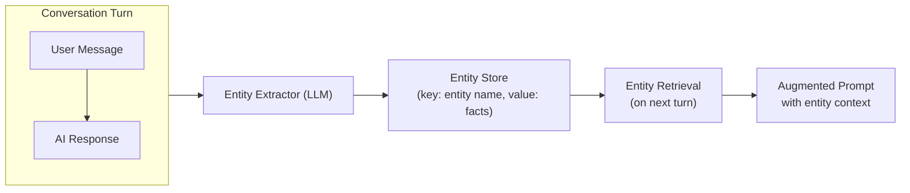
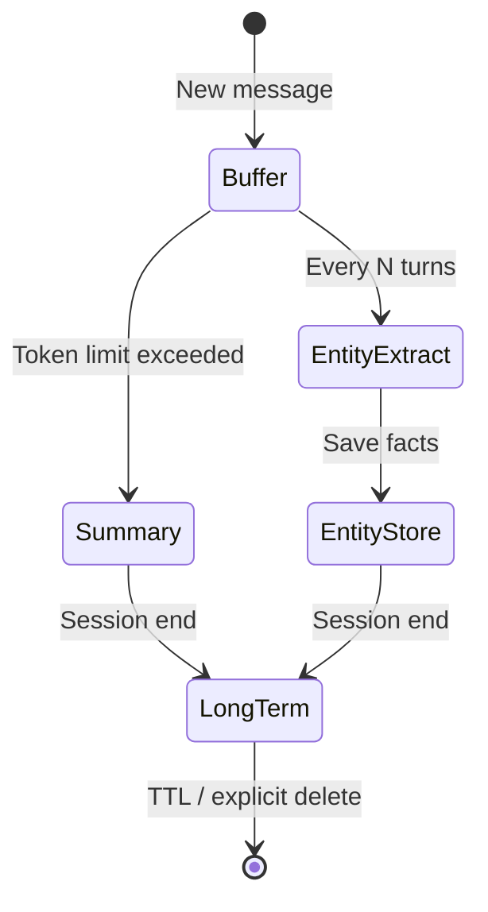
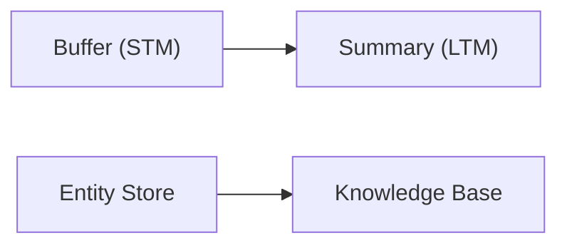

# Memory Stores, Summaries and Entity Extraction

LangChain provides several built-in memory classes that give agents different ways to remember. Choosing the right memory type — or combining them — determines how well your agent recalls and uses past information.

---

## ConversationBufferMemory

The simplest memory: keep a list of all past messages in the conversation.

```python
from langchain.memory import ConversationBufferMemory
from langchain.schema import HumanMessage, AIMessage

# Create a buffer memory
memory = ConversationBufferMemory(
    return_messages=True,  # return list of Message objects
)

# Simulate a conversation
memory.chat_memory.add_user_message("Hi, I'm Alice.")
memory.chat_memory.add_ai_message("Hello Alice! How can I help?")
memory.chat_memory.add_user_message("What's the weather today?")

# Retrieve full history
history = memory.load_memory_variables({})
print(history["history"])
# Output: [HumanMessage(...), AIMessage(...), HumanMessage(...)]
```

[!WARNING]
`ConversationBufferMemory` grows unbounded. For long conversations, it will exceed the LLM context window. Always pair it with a trimming or summarization strategy in production.

[!NOTE]
The buffer memory is purely in-memory. If your server restarts, all history is lost. Use a persistent backing store (Redis, SQL, or file-based) for production deployments that require session continuity.

---

## ConversationSummaryMemory

Instead of storing every message, this memory periodically summarizes older messages into a condensed form.

```python
from langchain.memory import ConversationSummaryMemory
from langchain_openai import ChatOpenAI

llm = ChatOpenAI(model="gpt-4o-mini", temperature=0)

# Summary memory uses an LLM to compress history
memory = ConversationSummaryMemory(
    llm=llm,
    max_token_limit=200,  # trigger summarization above this
    return_messages=True,
)

memory.save_context(
    {"input": "My name is Bob and I work at Acme Corp."},
    {"output": "Nice to meet you Bob."},
)
memory.save_context(
    {"input": "I need help with the API key setup."},
    {"output": "Sure, let me walk you through it."},
)

# The summary will condense the above exchanges
summary = memory.load_memory_variables({})
print(summary["history"])
# Output: "Bob works at Acme Corp. and needs help with API key setup."
```

Trade-off: summaries save tokens but lose detail. A summary of a debugging session might omit the exact error message.

[!TIP]
Choose your `max_token_limit` carefully. A limit that is too low triggers summarization too frequently (increasing LLM costs). A limit that is too high delays summarization, allowing the context to grow excessively. Start with 1000-2000 tokens and tune based on your conversation length distribution.

---

## Entity Extraction Memories

Entity memories track specific entities (people, places, products) mentioned across a conversation and accumulate facts about each one.

```python
from langchain.memory import ConversationEntityMemory
from langchain_openai import ChatOpenAI

llm = ChatOpenAI(model="gpt-4o-mini", temperature=0)

memory = ConversationEntityMemory(llm=llm, return_messages=True)

# First turn — entity "Alice" is introduced
memory.save_context(
    {"input": "Alice is our lead engineer."},
    {"output": "Got it, Alice is the lead engineer."},
)

# Second turn — new fact about "Alice"
memory.save_context(
    {"input": "Alice prefers Python over Java."},
    {"output": "Noted, Alice prefers Python."},
)

# Retrieve stored facts about all entities
vars = memory.load_memory_variables({})
print(vars["entities"])
# Output: {'Alice': 'Alice is the lead engineer. Alice prefers Python over Java.'}
```

Entity memory is powerful for personalization — an agent can greet a returning user by name and recall their preferences without re-asking.

### Entity Extraction Pipeline



[!IMPORTANT]
Entity memory relies on the LLM to correctly identify and extract entities. If the LLM hallucinates entities or misattributes facts, the memory will accumulate errors. Always validate extracted entities when using this memory type in production.

---

## Memory Serialization and Transport

For distributed systems, agent memory must be serialized for transport between services. The serialization format affects speed, compatibility, and human readability.

| Format | Speed | Size | Readability | LangChain Support |
| :--- | :--- | :--- | :--- | :--- |
| JSON | Moderate | Large | High | Native via `messages_to_dict` |
| Pickle | Fast | Medium | None (binary) | Native via `pickle` |
| MessagePack | Fast | Small | Low | Via third-party libraries |
| Protocol Buffers | Very fast | Very small | None | Via custom serializers |
| Arrow | Very fast | Small | None | Via PyArrow for DataFrame memory |

```python
from langchain.schema import messages_from_dict, messages_to_dict
from langchain.schema import HumanMessage, AIMessage

class MemorySerializer:
    """Serialize and deserialize conversation memory."""

    @staticmethod
    def to_json(messages: list) -> str:
        """Serialize messages to JSON string."""
        import json
        msg_dicts = messages_to_dict(messages)
        return json.dumps(msg_dicts, indent=2)

    @staticmethod
    def from_json(json_str: str) -> list:
        """Deserialize JSON string back to messages."""
        import json
        msg_dicts = json.loads(json_str)
        return messages_from_dict(msg_dicts)

    @staticmethod
    def to_compact_json(messages: list) -> str:
        """Serialize to compact (minified) JSON."""
        import json
        msg_dicts = messages_to_dict(messages)
        for m in msg_dicts:
            m.pop("type", None)  # remove redundant type field
        return json.dumps(msg_dicts, separators=(",", ":"))

# Example usage
serializer = MemorySerializer()
msgs = [
    HumanMessage(content="Hello"),
    AIMessage(content="Hi there!"),
]
json_str = serializer.to_json(msgs)
print(json_str[:100])
# Output: [{"type": "human", "data": {"content": "Hello"}},...]
```

[!TIP]
JSON is the safest choice for serialization — it is debuggable, language-agnostic, and supported everywhere. For high-throughput systems, MessagePack reduces payload size by ~30% with similar schema flexibility. Avoid Pickle in production as it can execute arbitrary code during deserialization.

---

## Custom Memory Stores

For production systems, you will often need a custom backing store. Below is a Redis-backed memory that persists across server restarts.

```python
import json
import redis
from langchain.memory import ChatMessageHistory
from langchain.schema import messages_from_dict, messages_to_dict

class RedisChatMessageHistory(ChatMessageHistory):
    """Persist conversation history in Redis."""

    def __init__(self, session_id: str,
                 redis_url: str = "redis://localhost:6379"):
        self.session_id = session_id
        self.redis_client = redis.from_url(redis_url)
        super().__init__()

    @property
    def key(self) -> str:
        return f"chat_history:{self.session_id}"

    def load_messages(self) -> list:
        data = self.redis_client.get(self.key)
        if data:
            return messages_from_dict(json.loads(data))
        return []

    def add_message(self, message) -> None:
        super().add_message(message)
        self._persist()

    def clear(self) -> None:
        self.redis_client.delete(self.key)
        super().clear()

    def _persist(self) -> None:
        serialized = messages_to_dict(self.messages)
        self.redis_client.set(self.key, json.dumps(serialized))
```

### SQLite-Backed Custom Memory

For lightweight persistence without Redis, use SQLite:

```python
import sqlite3
import json
from datetime import datetime

class SQLiteMemory:
    """Persistent memory using SQLite — zero infrastructure needed."""

    def __init__(self, db_path: str = "agent_memory.db"):
        self.conn = sqlite3.connect(db_path)
        self.conn.execute("""
            CREATE TABLE IF NOT EXISTS memory (
                session_id TEXT,
                message_role TEXT,
                content TEXT,
                timestamp TEXT,
                PRIMARY KEY (session_id, timestamp)
            )
        """)
        self.conn.commit()

    def add_message(self, session_id: str, role: str, content: str):
        self.conn.execute(
            "INSERT INTO memory VALUES (?, ?, ?, ?)",
            (session_id, role, content, datetime.utcnow().isoformat()),
        )
        self.conn.commit()

    def get_history(self, session_id: str, limit: int = 50) -> list[dict]:
        cursor = self.conn.execute(
            "SELECT message_role, content FROM memory "
            "WHERE session_id = ? ORDER BY timestamp DESC LIMIT ?",
            (session_id, limit),
        )
        rows = cursor.fetchall()
        return [{"role": r[0], "content": r[1]} for r in reversed(rows)]

    def clear_session(self, session_id: str):
        self.conn.execute(
            "DELETE FROM memory WHERE session_id = ?",
            (session_id,),
        )
        self.conn.commit()
```

[!TIP]
SQLite is an excellent choice for single-process agents and prototyping. For distributed or high-throughput systems, use Redis (fast, in-memory) or PostgreSQL (durable, queryable). Your choice of backing store should match your application's scaling needs.

---

## Hybrid Approaches

The most robust agents combine multiple memory types:

```python
from langchain.memory import (
    ConversationSummaryBufferMemory,
    ConversationEntityMemory,
)
from langchain.memory.combined import CombinedMemory
from langchain_openai import ChatOpenAI

llm = ChatOpenAI(model="gpt-4o-mini", temperature=0)

# Summary memory for conversation compression
summary_memory = ConversationSummaryBufferMemory(
    llm=llm,
    max_token_limit=500,
    memory_key="history",
    return_messages=True,
)

# Entity memory for tracking named entities
entity_memory = ConversationEntityMemory(
    llm=llm,
    memory_key="entities",
    return_messages=True,
)

# Combine them into one memory object
combined = CombinedMemory(
    memories=[summary_memory, entity_memory]
)
```

---

## Comparison Table: Memory Types

| Memory Type | Storage | Token Cost | Detail Level | Best For | Persistence |
| :--- | :--- | :--- | :--- | :--- | :--- |
| ConversationBuffer | In-memory list | High (all messages) | Full fidelity | Short demos, debugging | Volatile |
| ConversationSummary | LLM-generated summary | Low (compressed) | Condensed | Long conversations | Volatile |
| ConversationSummaryBuffer | Buffer + summary trigger | Medium | Adaptive | Production chatbots | Volatile |
| ConversationEntity | Entity → facts dict | Low (per entity) | Focused | Personalization, CRM | Volatile |
| Custom (Redis, SQL) | External DB | Configurable | Configurable | Production systems | Persistent |

---

## Memory Consolidation

Consolidation moves information from short-term to long-term storage. A typical schedule:

1. **On each turn** — append to buffer memory (short-term)
2. **Every N turns** — run entity extraction and update entity store
3. **On summary trigger** — compress buffer into summary memory
4. **On session end** — persist entity facts to a permanent knowledge base





### Automated Consolidation with LangChain

```python
from langchain.memory import ConversationSummaryBufferMemory
from langchain_openai import ChatOpenAI

class AutoConsolidatingMemory:
    """Memory that automatically consolidates when thresholds are hit."""

    def __init__(self, llm, max_tokens: int = 1000):
        self.buffer = ConversationSummaryBufferMemory(
            llm=llm,
            max_token_limit=max_tokens,
            return_messages=True,
        )
        self.entity_store: dict[str, str] = {}
        self.turn_count = 0

    def save_context(self, inputs: dict, outputs: dict):
        self.turn_count += 1
        self.buffer.save_context(inputs, outputs)

        # Extract entities every 3 turns
        if self.turn_count % 3 == 0:
            self._extract_entities(inputs, outputs)

    def _extract_entities(self, inputs: dict, outputs: dict):
        """Simple entity extraction from input text."""
        import re
        combined = f"{inputs.get('input', '')} {outputs.get('output', '')}"
        # Pattern: "X is Y" or "X prefers Y"
        patterns = re.findall(
            r"(\w+) (?:is|prefers|works|likes) (\w+)",
            combined,
        )
        for entity, attr in patterns:
            if entity not in self.entity_store:
                self.entity_store[entity] = []
            self.entity_store[entity].append(attr)

    def load_memory(self) -> dict:
        return {
            "history": self.buffer.load_memory_variables({}),
            "entities": self.entity_store,
        }

# Usage
llm = ChatOpenAI(model="gpt-4o-mini", temperature=0)
memory = AutoConsolidatingMemory(llm=llm, max_tokens=1000)
memory.save_context({"input": "Hi, I'm Charlie"}, {"output": "Hello Charlie"})
memory.save_context({"input": "I like Python"}, {"output": "Great language"})
memory.save_context({"input": "My manager is Dana"}, {"output": "Good to know"})
print(memory.load_memory()["entities"])
# Output: {'Charlie': ['Python'], 'Dana': ['is']}
```

---

## Forgetting Strategies Comparison

Just as important as what to remember is what to forget. Different forgetting strategies suit different use cases:

| Strategy | Mechanism | Token Efficiency | Complexity | Risk |
| :--- | :--- | :--- | :--- | :--- |
| Sliding window | Keep last N messages | High (fixed budget) | Very low | Loses early critical context |
| Time-based TTL | Expire older than T | Medium | Low | Arbitrary cutoff may remove important details |
| Relevance-based | Score by importance | Medium | High | Importance scoring can be wrong |
| Summary compression | Condense old messages | Very high | Medium | Summary loses nuance |
| Entity preservation | Keep entity facts only | Very high | Medium | Non-entity context is lost |
| Hybrid | Summary + recent + entities | High (balanced) | High | Best balance, most complex |

```python
class AdaptiveForgettingStrategy:
    """Dynamically chooses forgetting strategy based on conversation state."""

    def __init__(self, max_tokens: int = 4000):
        self.max_tokens = max_tokens
        self.messages = []
        self.summary = None

    def add_and_prune(self, message: dict) -> list[dict]:
        self.messages.append(message)
        current_tokens = self._estimate_tokens(self.messages)
        if current_tokens <= self.max_tokens:
            return self.messages
        if len(self.messages) < 20:
            return self._sliding_window_prune()
        elif len(self.messages) < 50:
            return self._summarize_and_prune()
        else:
            return self._hybrid_prune()

    def _sliding_window_prune(self):
        cutoff = int(len(self.messages) * 0.25)
        self.messages = self.messages[cutoff:]
        return self.messages

    def _estimate_tokens(self, messages: list) -> int:
        return sum(len(m.get("content", "").split()) * 1.3
                   for m in messages)

    def _summarize_and_prune(self):
        self.summary = "[Summary of earlier conversation]"
        cutoff = int(len(self.messages) * 0.8)
        self.messages = self.messages[cutoff:]
        return self.messages

    def _hybrid_prune(self):
        cutoff = int(len(self.messages) * 0.9)
        self.messages = self.messages[cutoff:]
        return self.messages

forgetting = AdaptiveForgettingStrategy(max_tokens=4000)
conversation = [{"role": "user" if i % 2 == 0 else "assistant",
                 "content": f"Message {i}"} for i in range(30)]
pruned = forgetting.add_and_prune(conversation[0])
```

[!NOTE]
Monitor memory latency and failure rates as part of your agent's health checks. A sudden spike in read latency often indicates the backing store is overloaded or the vector index needs rebuilding. Set alerts for: read failure rate > 1%, average read latency > 100ms, and memory size growing faster than expected.

---

## Comparison Table: Memory Backing Stores

| Store | Type | Persistence | Speed | Use Case |
| :--- | :--- | :--- | :--- | :--- |
| In-memory (Python list) | RAM | None | Fastest | Prototyping, single-turn |
| Redis | Key-value | Configurable (RDB/AOF) | Very fast | Session caching, pub/sub |
| SQLite | Relational | File-based | Fast | Single-process agents |
| PostgreSQL | Relational | Durable | Moderate | Multi-process, complex queries |
| File (JSON/parquet) | Flat file | Durable | Slowest | Archival, debugging |
| Vector store (Chroma) | Vector DB | Durable | Moderate | Semantic search (non-chat) |

---

## 5 Practice Questions

```question
{
  "id": "am-03-q1",
  "type": "multiple-choice",
  "question": "Which memory type stores every message without compression?",
  "options": [
    "ConversationSummaryMemory",
    "ConversationBufferMemory",
    "ConversationEntityMemory",
    "CombinedMemory"
  ],
  "correct": 1,
  "explanation": "ConversationBufferMemory stores every message in full without any compression or summarization."
}
```

```question
{
  "id": "am-03-q2",
  "type": "multiple-choice",
  "question": "What is the main trade-off of ConversationSummaryMemory?",
  "options": [
    "It is slow to load",
    "It loses detail during summarization",
    "It cannot store entities",
    "It requires a database"
  ],
  "correct": 1,
  "explanation": "ConversationSummaryMemory saves tokens by compressing history, but this compression inevitably loses some detail."
}
```

```question
{
  "id": "am-03-q3",
  "type": "multiple-choice",
  "question": "ConversationEntityMemory is best suited for:",
  "options": [
    "Storing raw conversation history",
    "Tracking facts about named entities",
    "Compressing long conversations",
    "Redis persistence"
  ],
  "correct": 1,
  "explanation": "ConversationEntityMemory tracks specific entities (people, places, products) and accumulates facts about each one across turns."
}
```

```question
{
  "id": "am-03-q4",
  "type": "multiple-choice",
  "question": "Why would you use CombinedMemory?",
  "options": [
    "To replace all other memory types",
    "To combine multiple memory strategies in one agent",
    "To speed up the LLM",
    "To reduce token usage to zero"
  ],
  "correct": 1,
  "explanation": "CombinedMemory allows an agent to use multiple memory types (e.g., summary, buffer, and entity memory) simultaneously."
}
```

```question
{
  "id": "am-03-q5",
  "type": "multiple-choice",
  "question": "What does memory consolidation do?",
  "options": [
    "Deletes old memories",
    "Moves information from short-term to long-term storage",
    "Duplicates all memories",
    "Encrypts the memory store"
  ],
  "correct": 1,
  "explanation": "Memory consolidation periodically moves information from short-term storage (buffer) into long-term stores (summary, knowledge base)."
}
```

```question
{
  "id": "am-03-q6",
  "type": "multiple-choice",
  "question": "A chatbot agent needs to remember user preferences across server restarts. Which backing store is the minimum viable choice?",
  "options": [
    "In-memory Python list",
    "SQLite file-based database",
    "A second LLM to regenerate preferences",
    "Environment variables"
  ],
  "correct": 1,
  "explanation": "SQLite provides file-based persistence that survives server restarts with zero infrastructure. In-memory storage would lose all preferences on restart."
}
```

---

[!SUCCESS]
### Key Takeaways

- `ConversationBufferMemory` stores raw history but grows unbounded.
- `ConversationSummaryMemory` uses an LLM to compress history, saving tokens at the cost of detail.
- `ConversationEntityMemory` extracts and tracks facts about named entities across turns.
- Custom memory stores (Redis, SQL, file-based) enable persistence beyond a single session.
- Combined memory allows an agent to use summary, buffer, and entity memory simultaneously.
- Memory consolidation periodically moves short-term data into long-term stores.
- Choose memory types based on the trade-off between token cost, detail retention, and persistence requirements.
- SQLite is the simplest persistent backing store for single-process agents; Redis is better for distributed systems.
