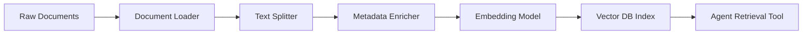
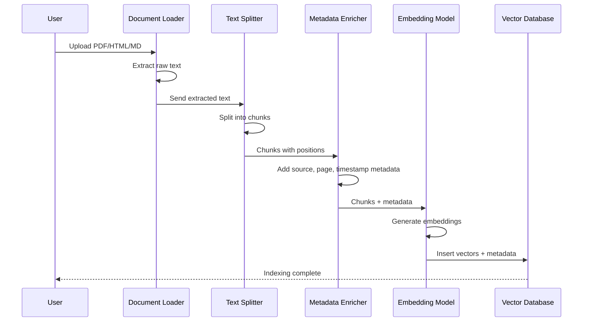

# Knowledge Base Integration and Document Processing

An agent is only as knowledgeable as the documents it can access. Building a robust document ingestion pipeline — from raw files to a searchable knowledge base — is a foundational engineering skill for production agents.

---

## Ingesting Documents (PDF, HTML, Markdown)

Different document formats require different loaders. LangChain provides document loaders for every major format.

```python
from langchain_community.document_loaders import (
    PyPDFLoader,      # PDF files
    BSHTMLLoader,     # HTML pages
    TextLoader,       # Plain text / Markdown
    UnstructuredMarkdownLoader,  # Structured Markdown
)

# Load a PDF
pdf_loader = PyPDFLoader("contract.pdf")
pdf_docs = pdf_loader.load()
print(f"Loaded {len(pdf_docs)} pages from PDF")
# Output: Loaded 12 pages from PDF

# Load an HTML file
html_loader = BSHTMLLoader("page.html")
html_docs = html_loader.load()
print(f"Title: {html_docs[0].metadata.get('title', 'N/A')}")
# Output: Title: Product Documentation

# Load Markdown
md_loader = UnstructuredMarkdownLoader("readme.md")
md_docs = md_loader.load()
print(f"Loaded {len(md_docs)} Markdown documents")
```

[!WARNING]
PDF extraction quality varies wildly. Scanned PDFs require OCR (e.g., `pytesseract` or Azure Document Intelligence). Always inspect extracted text before indexing.

### Document Ingestion Pipeline



---

## Document Validation Pipeline

Before indexing any document, validate that the extracted content is usable. Invalid documents waste storage, corrupt search results, and degrade agent performance.

```python
from typing import Optional

class DocumentValidator:
    """Validates extracted document content before indexing."""

    MIN_CHARS = 20
    MAX_CHARS = 100_000
    MIN_CHAR_RATIO = 0.5  # at least 50% printable characters

    def validate(self, text: str, source: str) -> Optional[str]:
        """Returns error message if invalid, None if valid."""
        if not text or len(text.strip()) < self.MIN_CHARS:
            return f"Text too short ({len(text)} chars)"

        if len(text) > self.MAX_CHARS:
            return f"Text too long ({len(text)} chars)"

        printable = sum(c.isprintable() for c in text)
        ratio = printable / max(len(text), 1)
        if ratio < self.MIN_CHAR_RATIO:
            return f"Low printable char ratio: {ratio:.2f}"

        # Check for binary content that wasn't properly decoded
        null_bytes = text.count("\x00")
        if null_bytes > 10:
            return "Contains binary data (null bytes)"

        return None  # Valid

    def sanitize(self, text: str) -> str:
        """Clean common extraction artifacts."""
        import re
        # Remove multiple consecutive whitespace
        text = re.sub(r"\s+", " ", text)
        # Remove page numbers and header/footer artifacts
        text = re.sub(r"\n\s*\d+\s*\n", "\n", text)
        # Remove control characters except newlines and tabs
        text = re.sub(r"[\x00-\x08\x0b\x0c\x0e-\x1f]", "", text)
        return text.strip()

# Usage in pipeline
validator = DocumentValidator()
raw_text = "This is a valid document with sufficient content   "
clean_text = validator.sanitize(raw_text)
error = validator.validate(clean_text, "doc.txt")
if error:
    print(f"Skipping document: {error}")
else:
    print(f"Document validated: {len(clean_text)} chars")
```

| Validation Check | Purpose | Typical Threshold |
| :--- | :--- | :--- |
| Minimum length | Filter empty or near-empty pages | > 20 characters |
| Maximum length | Prevent OOM on massive files | < 100,000 characters |
| Printable character ratio | Detect binary/garbled extraction | > 50% printable |
| Null byte count | Detect binary content | < 10 null bytes |
| Language detection | Route to correct embedding model | Confidence > 0.7 |
| Duplicate detection (hash) | Prevent re-indexing same content | SHA-256 match |

[!IMPORTANT]
Validation is not optional in production. A single corrupted PDF that produces garbled text can insert thousands of nonsense chunks into your vector index, degrading retrieval quality for every query. Always validate before indexing.

---

## Handling Multimodal Documents

Modern knowledge bases contain more than just text. Images, tables, and code blocks require specialized processing:

```python
class MultimodalDocumentProcessor:
    """Process documents with images, tables, and code blocks."""

    def __init__(self):
        self.processors = {
            "table": self._process_table,
            "image": self._process_image,
            "code": self._process_code,
        }

    def _process_table(self, table_html: str) -> str:
        """Convert HTML table to markdown-like text representation."""
        from bs4 import BeautifulSoup
        soup = BeautifulSoup(table_html, "html.parser")
        rows = []
        for tr in soup.find_all("tr"):
            cells = [td.get_text(strip=True) for td in tr.find_all(["td", "th"])]
            rows.append(" | ".join(cells))
        return "\n".join(rows)

    def _process_image(self, image_path: str, caption: str = "") -> dict:
        """Extract metadata about an image for context."""
        return {
            "type": "image",
            "path": image_path,
            "caption": caption,
            "alt_text": "",  # Should be extracted from HTML alt attribute
        }

    def _process_code(self, code: str, language: str = "") -> str:
        """Preserve code structure with language annotation."""
        header = f"[CODE BLOCK - {language.upper()}]" if language else "[CODE BLOCK]"
        return f"{header}\n{code}\n[END CODE BLOCK]"

    def process(self, document: dict) -> list[str]:
        """Extract all content types from a mixed document."""
        results = []
        for content_type, content in document.items():
            processor = self.processors.get(content_type)
            if processor:
                processed = processor(content)
                if processed:
                    results.append(str(processed))
        return results

# Example: processing a page with a table
processor = MultimodalDocumentProcessor()
table_text = processor._process_table(
    "<table><tr><th>Plan</th><th>Price</th></tr>"
    "<tr><td>Pro</td><td>$10</td></tr></table>"
)
print(table_text)
# Output: Plan | Price
#         Pro | $10
```

[!NOTE]
Tables are particularly challenging for RAG systems. Embedding models may not capture the relational structure of tabular data, and LLMs struggle to parse embedded HTML tables. Always convert tables to structured text (pipe-delimited or key-value pairs) before embedding.

---

## Document Processing: End-to-End Sequence



[!IMPORTANT]
Always validate the output of each pipeline stage before passing to the next. A common failure is that the document loader returns empty or garbled text, which is then embedded and indexed as if it were meaningful. Add validation checks: text length > 0, character ratio, and language detection.

---

## OCR for Scanned Documents

Scanned PDFs contain images of text, not selectable text. OCR extracts the text from images:

```python
# Example: using pytesseract for OCR on scanned PDFs
from pdf2image import convert_from_path
import pytesseract
from langchain.schema import Document

def ocr_pdf(filepath: str) -> list[Document]:
    """Extract text from a scanned PDF using OCR."""
    images = convert_from_path(filepath)
    documents = []

    for page_num, image in enumerate(images, start=1):
        # Run OCR on the page image
        text = pytesseract.image_to_string(image, lang="eng")

        if len(text.strip()) < 20:
            # Skip pages with insufficient text
            continue

        doc = Document(
            page_content=text,
            metadata={
                "source": filepath,
                "page": page_num,
                "ocr_method": "tesseract",
            },
        )
        documents.append(doc)

    return documents

# Usage
# docs = ocr_pdf("scanned_contract.pdf")
# print(f"Extracted {len(docs)} pages via OCR")
```

[!NOTE]
OCR accuracy depends heavily on image quality. For best results, scan at 300 DPI or higher, use black-and-white mode, and ensure the document is flat (not curled or folded). Consider commercial OCR services (Azure Document Intelligence, Google Cloud Vision) for poor-quality scans.

---

## Text Splitting Strategies

The splitter you choose dramatically changes retrieval quality. Below are the most common strategies.

```python
from langchain.text_splitter import (
    RecursiveCharacterTextSplitter,
    TokenTextSplitter,
    MarkdownHeaderTextSplitter,
)

# Strategy 1: Recursive character splitting (general purpose)
recursive_splitter = RecursiveCharacterTextSplitter(
    chunk_size=1000,
    chunk_overlap=200,
    separators=["\n\n", "\n", ". ", " "],
)

# Strategy 2: Token-aware splitting (matches LLM tokenizers)
token_splitter = TokenTextSplitter(
    chunk_size=256,      # tokens, not characters
    chunk_overlap=50,
)

# Strategy 3: Markdown-aware splitting (preserves headers)
headers_to_split_on = [
    ("#", "Header 1"),
    ("##", "Header 2"),
    ("###", "Header 3"),
]
markdown_splitter = MarkdownHeaderTextSplitter(
    headers_to_split_on=headers_to_split_on,
)
```

| Strategy | Unit | Preserves Structure | Overlap | Best For |
| :--- | :--- | :--- | :--- | :--- |
| RecursiveCharacter | Characters | Moderate | Yes | General text |
| Token | Tokens | Low | Yes | LLM-context-aligned chunks |
| MarkdownHeader | Headers | High | No | Docs, wikis |
| RecursiveJson | JSON keys | High | No | Structured JSON data |
| HTMLHeader | HTML tags | High | No | Web pages |
| Semantic | Sentence boundaries | High | No | Coherent passage preservation |

---

## Metadata Extraction

Metadata turns chunks into filterable, traceable units. Every chunk should carry enough context to identify its origin.

```python
from langchain_community.document_loaders import PyPDFLoader
from langchain.text_splitter import RecursiveCharacterTextSplitter

loader = PyPDFLoader("annual-report.pdf")
docs = loader.load()

# Add custom metadata to each page
for i, doc in enumerate(docs):
    doc.metadata.update({
        "page_number": i + 1,
        "source": "annual-report.pdf",
        "year": "2025",
        "doc_type": "financial_report",
    })

# Split and preserve metadata
splitter = RecursiveCharacterTextSplitter(
    chunk_size=500, chunk_overlap=50,
)
chunks = splitter.split_documents(docs)

print(f"Total chunks: {len(chunks)}")
print(f"Sample metadata: {chunks[0].metadata}")
# Output: Total chunks: 47
#         Sample metadata: {'page_number': 1, 'source': 'annual-report.pdf',
#                           'year': '2025', 'doc_type': 'financial_report'}
```

[!TIP]
A well-designed metadata schema is as important as the embedding itself. Common high-value metadata fields: `source` (file path or URL), `page_number`, `section_title`, `author`, `date_published`, `doc_type`, `language`, `content_hash`. These fields enable powerful filtering and make your knowledge base auditable.

```python
def enrich_metadata(doc, source_path: str) -> dict:
    """Automatically extract metadata from document content."""
    import re
    metadata = {
        "source": source_path,
        "ingested_at": datetime.utcnow().isoformat(),
    }

    # Try to extract title from first heading
    lines = doc.page_content.split("\n")
    for line in lines[:10]:
        if line.startswith("# "):
            metadata["title"] = line.strip("# ")
            break

    # Detect language (simplified — use langdetect in production)
    if re.search(r"[¿¡áéíóúñ]", doc.page_content):
        metadata["language"] = "es"
    elif re.search(r"[àèìòùç]", doc.page_content):
        metadata["language"] = "pt"
    elif re.search(r"[äöüß]", doc.page_content):
        metadata["language"] = "de"
    else:
        metadata["language"] = "en"

    # Count tokens (approximate)
    metadata["estimated_tokens"] = len(doc.page_content.split()) * 1.3

    return metadata
```

---

## Incremental Indexing

Real knowledge bases are never static. New documents arrive, old ones are updated, and stale entries must be removed.

```python
import hashlib
from datetime import datetime
import chromadb

client = chromadb.Client()
collection = client.get_or_create_collection("knowledge_base")

def index_document(filepath: str, content: str, metadata: dict) -> None:
    # Generate a content hash for deduplication
    content_hash = hashlib.sha256(content.encode()).hexdigest()

    # Check if this content already exists
    existing = collection.get(ids=[content_hash])
    if existing["ids"]:
        print(f"Skipping duplicate: {filepath}")
        return

    # Add timestamp for incremental sync
    metadata["indexed_at"] = datetime.utcnow().isoformat()
    metadata["content_hash"] = content_hash

    # Split, embed, and index
    chunks = splitter.split_text(content)
    # ... embed and add to collection ...

    print(f"Indexed {filepath} ({len(chunks)} chunks)")
```

[!WARNING]
Content hashes are great for exact duplicate detection, but they fail when a document is updated. A document with even one changed character will have a completely different hash. For update detection, also track file modification timestamps or version numbers.

### Document Classification by Processing Strategy

| Document Type | Loader | Preprocessing | Splitter | Special Handling |
| :--- | :--- | :--- | :--- | :--- |
| Text-based PDF | PyPDFLoader | None | RecursiveCharacter | Selectable text |
| Scanned PDF | PyPDFLoader + OCR | Image-to-text | RecursiveCharacter | OCR quality check |
| HTML page | BSHTMLLoader | Strip tags/nav | HTMLHeader | Footer removal |
| Markdown doc | MarkdownHeader | None | MarkdownHeader | Header preservation |
| JSON data | JSONLoader | Validate JSON | RecursiveJson | Schema validation |
| CSV/Excel | CSVLoader | Parse rows | RecursiveCharacter | Column metadata |
| Code repo | TextLoader | .gitignore filter | Token | Language detection |

---

## Updating Knowledge Bases

Documents change. Your index must reflect those changes without a full rebuild.

```python
def update_document(filepath: str, new_content: str) -> None:
    # Delete all chunks from this source
    collection.delete(where={"source": filepath})

    # Re-index with fresh content
    chunks = splitter.split_text(new_content)
    # ... embed and re-add ...

    print(f"Updated: {filepath}")

def delete_document(filepath: str) -> None:
    collection.delete(where={"source": filepath})
    print(f"Deleted: {filepath}")
```

[!NOTE]
The delete-and-reindex pattern is simple and correct, but it has a window where the document is unavailable. For high-availability systems, use a two-phase approach: index the new version, then atomically swap it with the old version.

```python
def update_document_atomic(filepath: str, new_content: str) -> None:
    """Atomic update: index new version, then remove old version."""
    # Generate a temporary group ID for the new chunks
    import uuid
    new_group_id = str(uuid.uuid4())

    # Index new content with temporary group
    chunks = splitter.split_text(new_content)
    new_ids = []
    for i, chunk in enumerate(chunks):
        chunk_id = f"{new_group_id}:{i}"
        new_ids.append(chunk_id)
        # ... embed and add with chunk_id ...

    # Now atomically remove old and keep new
    collection.delete(where={"source": filepath})
    print(f"Atomically updated: {filepath}")
```

---

## Connecting to Agents

Once the knowledge base is built, connect it to an agent via a retrieval tool.

```python
from langchain.tools import tool
from langchain.agents import create_openai_functions_agent, AgentExecutor
from langchain_openai import ChatOpenAI
import chromadb

client = chromadb.Client()
collection = client.get_collection("knowledge_base")

@tool
def search_knowledge_base(query: str, k: int = 3) -> str:
    """Search the company knowledge base for relevant information."""
    results = collection.query(query_texts=[query], n_results=k)
    return "\n\n".join(results["documents"][0])

# Create an agent with the KB tool
llm = ChatOpenAI(model="gpt-4o-mini", temperature=0)
agent = create_openai_functions_agent(
    llm=llm,
    tools=[search_knowledge_base],
    prompt=...,  # your system prompt here
)
agent_executor = AgentExecutor(agent=agent, tools=[search_knowledge_base])

# Now the agent can answer from the knowledge base
# result = agent_executor.invoke({"input": "What is the vacation policy?"})
```

---

## PII Handling in Document Ingestion

[!WARNING]
Documents may contain personally identifiable information (PII) such as names, emails, phone numbers, and credit card numbers. If your knowledge base is used by agents that serve multiple users, PII leaking across sessions is a privacy and compliance risk.

```python
import re

def sanitize_document(text: str) -> str:
    """Remove common PII patterns from document text."""
    # Email addresses
    text = re.sub(r'\b[\w\.-]+@[\w\.-]+\.\w+\b', '[EMAIL]', text)

    # Phone numbers (US format)
    text = re.sub(r'\b\d{3}[-.]?\d{3}[-.]?\d{4}\b', '[PHONE]', text)

    # Social Security Numbers
    text = re.sub(r'\b\d{3}-\d{2}-\d{4}\b', '[SSN]', text)

    # Credit card numbers (simplified)
    text = re.sub(r'\b(?:\d{4}[-\s]?){3}\d{4}\b', '[CC]', text)

    return text

# Apply before indexing
# cleaned_text = sanitize_document(raw_text)
```

---

## 5 Practice Questions

```question
{
  "id": "am-04-q1",
  "type": "multiple-choice",
  "question": "Which loader should you use for a scanned PDF?",
  "options": [
    "PyPDFLoader alone",
    "PyPDFLoader with OCR (e.g., pytesseract)",
    "TextLoader",
    "BSHTMLLoader"
  ],
  "correct": 1,
  "explanation": "Scanned PDFs require OCR (optical character recognition) because the text is embedded in images rather than selectable text."
}
```

```question
{
  "id": "am-04-q2",
  "type": "multiple-choice",
  "question": "What is the purpose of chunk overlap in text splitting?",
  "options": [
    "Reduce the number of chunks",
    "Preserve context across chunk boundaries",
    "Speed up embedding",
    "Encrypt the document"
  ],
  "correct": 1,
  "explanation": "Chunk overlap ensures that sentences or ideas that would otherwise be split across chunk boundaries are not lost."
}
```

```question
{
  "id": "am-04-q3",
  "type": "multiple-choice",
  "question": "Why should metadata be attached to each chunk?",
  "options": [
    "It is required by vector databases",
    "It enables filtering and traceability",
    "It reduces storage size",
    "It replaces the need for embeddings"
  ],
  "correct": 1,
  "explanation": "Metadata turns chunks into filterable, traceable units, allowing you to identify the origin and context of each chunk."
}
```

```question
{
  "id": "am-04-q4",
  "type": "multiple-choice",
  "question": "In incremental indexing, how do you avoid duplicate entries?",
  "options": [
    "By checking a content hash before inserting",
    "By indexing everything every time",
    "By using a larger chunk size",
    "By skipping metadata"
  ],
  "correct": 0,
  "explanation": "A content hash (e.g., SHA-256) is generated for each document and checked against existing entries to skip duplicates."
}
```

```question
{
  "id": "am-04-q5",
  "type": "multiple-choice",
  "question": "How do you update a document in the knowledge base?",
  "options": [
    "Append new chunks without removing old ones",
    "Delete all chunks matching the source, then re-index",
    "Overwrite the embedding model",
    "Clear the entire collection"
  ],
  "correct": 1,
  "explanation": "To update a document, you delete all existing chunks from that source and re-index the new content."
}
```

```question
{
  "id": "am-04-q6",
  "type": "multiple-choice",
  "question": "An agent's knowledge base contains HR documents with employee email addresses. What should you do before indexing?",
  "options": [
    "Nothing — the agent needs the emails to answer questions",
    "Sanitize the documents by removing or masking PII",
    "Index everything and add a filter later",
    "Switch to a different embedding model"
  ],
  "correct": 1,
  "explanation": "PII in documents can leak to unauthorized users. Sanitize documents by removing or masking PII before indexing to protect privacy and maintain compliance."
}
```

---

[!SUCCESS]
### Key Takeaways

- Different document formats (PDF, HTML, Markdown) require format-specific loaders.
- Scanned PDFs require OCR processing before text can be extracted.
- Text splitting strategy — recursive, token-based, or structure-aware — directly impacts retrieval quality.
- Metadata (source, page, timestamp, content hash) makes chunks filterable and traceable.
- Incremental indexing uses content hashes to skip duplicates and avoid full rebuilds.
- Updating a document requires deleting old chunks and re-indexing the new content.
- A knowledge base is connected to an agent through a retrieval tool that wraps vector search.
- The ingestion pipeline is linear: load, split, enrich metadata, embed, index.
- PII must be sanitized before indexing to prevent data leakage.
- Atomic updates prevent availability windows during re-indexing.
