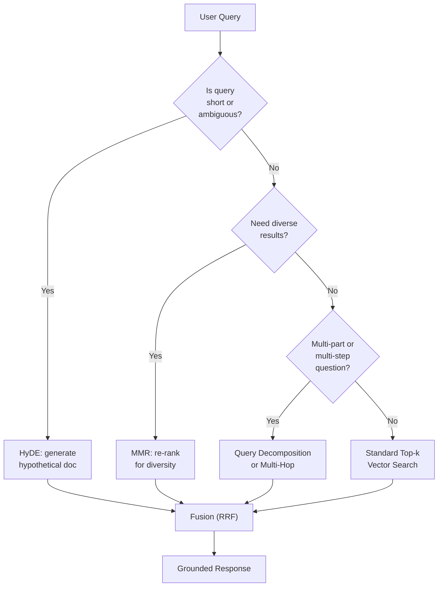
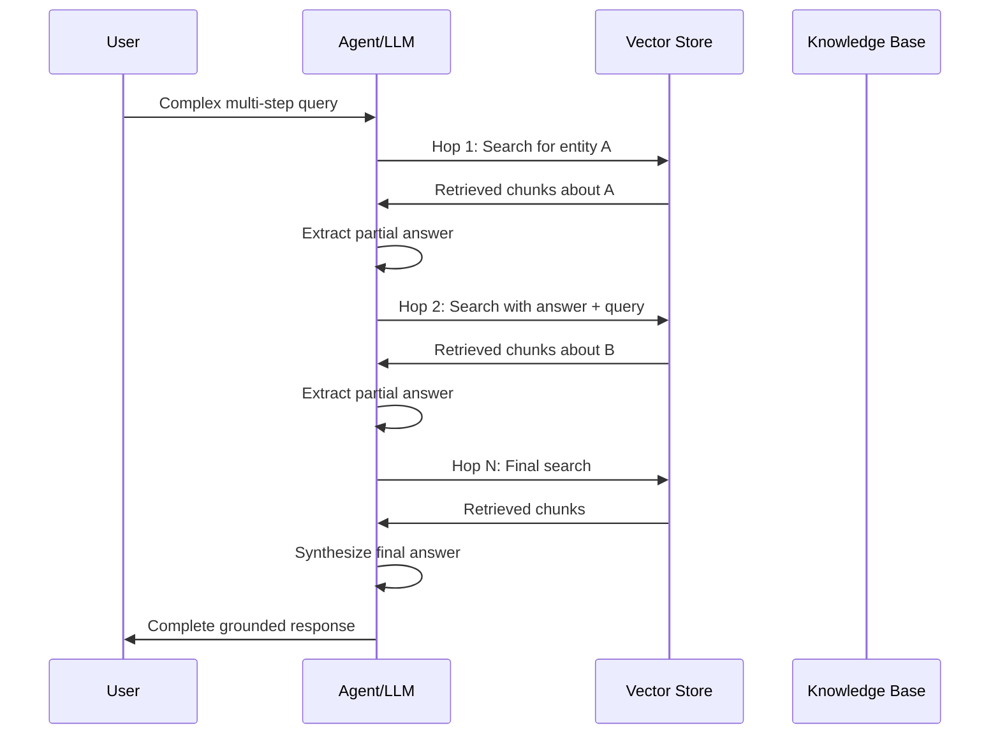

# Advanced Retrieval Strategies

Simple top-k retrieval with cosine similarity works for many cases, but production systems demand more: better relevance, diversity, multi-step reasoning, and the ability to handle complex queries. This lesson covers the most effective advanced retrieval strategies.

---

## HyDE (Hypothetical Document Embeddings)

HyDE improves retrieval by first generating a hypothetical document that answers the query, then using that document's embedding for search. The idea: the embedding of a complete answer is closer to relevant documents than the embedding of a short query.

```python
from openai import OpenAI
import chromadb

client = OpenAI()
chroma_client = chromadb.Client()
collection = chroma_client.get_collection("docs")

def hyde_search(query: str, k: int = 3) -> list[str]:
    # Step 1: Generate a hypothetical document
    # The LLM writes what a perfect answer would look like
    hypo_doc = client.chat.completions.create(
        model="gpt-4o-mini",
        messages=[
            {"role": "system",
             "content": "Write a detailed paragraph that answers the user's "
                        "question as if it were a section from a textbook."},
            {"role": "user", "content": query},
        ],
    ).choices[0].message.content

    # Step 2: Embed the hypothetical document (not the query!)
    hypo_emb = client.embeddings.create(
        input=hypo_doc,
        model="text-embedding-3-small",
    ).data[0].embedding

    # Step 3: Search with the hypothetical embedding
    results = collection.query(
        query_embeddings=[hypo_emb],
        n_results=k,
    )

    return results["documents"][0]

# The hypothetical doc bridges the lexical gap between short query and stored passages
```

[!WARNING]
HyDE adds an LLM call per query, increasing both latency and cost. It is best used when query quality is critical and queries are short or ambiguous. Cache hypothetical documents for repeated queries.

---

## MMR (Maximum Marginal Relevance)

Standard top-k retrieval can return near-duplicate results. MMR trades raw relevance for diversity by re-ranking results to minimize redundancy.

```python
import numpy as np
from sklearn.metrics.pairwise import cosine_similarity

def mmr_rerank(
    query_emb: list[float],
    doc_embeddings: list[list[float]],
    docs: list[str],
    k: int = 3,
    lambda_param: float = 0.7,
) -> list[str]:
    """
    MMR: balance relevance (query similarity) and diversity
    (dissimilarity to already-selected docs).

    Score = λ * sim(query, doc) - (1-λ) * max_{selected} sim(doc, selected)
    """
    n = len(docs)
    query_emb = np.array(query_emb).reshape(1, -1)
    doc_embs = np.array(doc_embeddings)

    # Precompute all-pair cosine similarities
    doc_sim_to_query = cosine_similarity(query_emb, doc_embs).flatten()
    doc_sim_matrix = cosine_similarity(doc_embs)

    selected = []
    candidates = list(range(n))

    for _ in range(min(k, n)):
        if not candidates:
            break

        # Score each candidate
        best_score = -1
        best_idx = -1
        for i in candidates:
            # Relevance to query
            relevance = doc_sim_to_query[i]

            # Diversity penalty: max similarity to already-selected docs
            if selected:
                diversity = max(doc_sim_matrix[i][s] for s in selected)
            else:
                diversity = 0

            score = lambda_param * relevance - (1 - lambda_param) * diversity

            if score > best_score:
                best_score = score
                best_idx = i

        selected.append(best_idx)
        candidates.remove(best_idx)

    return [docs[i] for i in selected]

# Usage
# results = mmr_rerank(query_emb, doc_embs, raw_docs, k=5, lambda_param=0.7)
```

| Parameter | Effect |
| :--- | :--- |
| λ = 1.0 | Pure relevance (standard top-k) |
| λ = 0.0 | Pure diversity |
| λ = 0.5–0.8 | Balanced (recommended) |

[!TIP]
MMR is ideal for summarization tasks where you want to cover multiple aspects of a topic without repeating the same information. Use λ = 0.7 for a slight relevance preference, or λ = 0.5 for equal balance. Lower λ when redundancy is more harmful than missing a slightly relevant result.

---

## Retrieval Strategy Decision Flow



---

## Multi-Hop Retrieval

Some questions require chaining across documents. Multi-hop retrieval answers one sub-question at a time, using each answer to inform the next.

```
Query: "What is the capital of the country where the Eiffel Tower is?"
    |
    v
Hop 1: "Where is the Eiffel Tower?" → "Paris, France"
    |
    v
Hop 2: "What is the capital of France?" → "Paris"
```

```python
def multi_hop_search(query: str, max_hops: int = 3) -> str:
    context = ""
    for hop in range(max_hops):
        # Search with accumulated context
        augmented_query = f"{context}\n\n{query}" if context else query
        results = collection.query(query_texts=[augmented_query], n_results=2)

        # Extract answer from retrieved chunks
        chunk_text = "\n".join(results["documents"][0])

        # Ask LLM to extract a concise answer
        answer = client.chat.completions.create(
            model="gpt-4o-mini",
            messages=[
                {"role": "system",
                 "content": "Answer concisely based on the context."},
                {"role": "user",
                 "content": f"Context: {chunk_text}\nQuestion: {query}"},
            ],
        ).choices[0].message.content

        # Check if answer is complete
        if is_sufficient(answer):  # heuristic: contains a concrete answer
            return answer

        # Otherwise, use this answer to refine next hop
        context = f"Previously found: {answer}"

    return "Could not resolve query in available hops."
```

### Multi-Hop Retrieval Sequence



[!WARNING]
Multi-hop retrieval multiplies latency by the number of hops (each hop requires a vector search + an LLM call). Set a maximum hop limit (3 is typical) and implement early stopping when a self-contained answer is found. Budget for N× the cost of a standard RAG query.

---

## Query Decomposition

Break a complex query into simpler sub-queries, retrieve for each, then merge results.

```python
def decompose_query(query: str) -> list[str]:
    """Use LLM to split a complex query into sub-queries."""
    response = client.chat.completions.create(
        model="gpt-4o-mini",
        messages=[
            {"role": "system",
             "content": "Break the user's question into 2-4 simple "
                        "sub-questions. Return one per line."},
            {"role": "user", "content": query},
        ],
    )
    sub_queries = response.choices[0].message.content.strip().split("\n")
    return [q.strip("- ").strip() for q in sub_queries if q.strip()]

def decomposed_search(query: str) -> str:
    sub_queries = decompose_query(query)
    all_chunks = []

    for sq in sub_queries:
        results = collection.query(query_texts=[sq], n_results=2)
        all_chunks.extend(results["documents"][0])

    # Remove duplicates and merge
    seen = set()
    unique_chunks = []
    for c in all_chunks:
        if c not in seen:
            seen.add(c)
            unique_chunks.append(c)

    return "\n\n".join(unique_chunks)
```

[!TIP]
Query decomposition is excellent for "compare and contrast" or "list all" queries. For example, "Compare the return policies of the Pro and Enterprise plans" becomes: (1) "What is the Pro plan return policy?", (2) "What is the Enterprise plan return policy?". Each sub-query retrieves exactly the relevant chunks.

---

## Self-Querying Retrievers

A self-querying retriever uses the LLM to extract a search query *and* metadata filters from a natural language question.

```python
from langchain.retrievers.self_query.base import SelfQueryRetriever
from langchain.chains.query_constructor.base import AttributeInfo

# Describe the metadata fields available
metadata_field_info = [
    AttributeInfo(
        name="year",
        description="The year the document was published",
        type="int",
    ),
    AttributeInfo(
        name="department",
        description="The company department this applies to",
        type="string",
    ),
    AttributeInfo(
        name="doc_type",
        description="Type of document (policy, guide, report)",
        type="string",
    ),
]

# Create self-querying retriever
retriever = SelfQueryRetriever.from_llm(
    llm=llm,
    vectorstore=vectorstore,
    document_contents="Company policies and procedures",
    metadata_field_info=metadata_field_info,
)

# User asks: "What is the vacation policy from 2024?"
# Retriever automatically extracts:
#   query = "vacation policy"
#   filter = year == 2024

# result = retriever.get_relevant_documents(
#     "What is the vacation policy from 2024?"
# )
```

---

## Fusion Retrieval (RRF)

Combine results from multiple retrieval strategies using Reciprocal Rank Fusion to get the best of all worlds.

```python
def reciprocal_rank_fusion(
    result_lists: list[list[str]],
    k: int = 60,
) -> list[str]:
    """
    Fuse multiple ranked lists using RRF.

    score(d) = sum_{r in retrievers} 1 / (k + rank_r(d))
    """
    scores = {}
    for results in result_lists:
        for rank, doc in enumerate(results, start=1):
            if doc not in scores:
                scores[doc] = 0
            scores[doc] += 1 / (k + rank)

    # Sort by descending RRF score
    ranked = sorted(scores.items(), key=lambda x: -x[1])
    return [doc for doc, _ in ranked]

# Fuse results from multiple strategies
bm25_results = bm25_retrieve(query)        # keyword-based
vector_results = vector_retrieve(query)    # semantic
hyde_results = hyde_search(query)          # HyDE-based

fused = reciprocal_rank_fusion(
    [bm25_results, vector_results, hyde_results]
)
# Output: a single ranked list combining all signals
```

---

## Contextual Retrieval: Enriching Chunks with Context

A common RAG failure is retrieving chunks that are semantically relevant but lack surrounding context, making them hard for the LLM to interpret. **Contextual retrieval** prepends document-level context to each chunk before embedding.

```python
def contextualize_chunks(
    chunks: list[str],
    document_title: str,
    section_titles: list[str],
) -> list[str]:
    """
    Enrich each chunk with surrounding context before embedding.
    This helps the LLM understand where the chunk came from.
    """
    contextualized = []
    for i, chunk in enumerate(chunks):
        # Build context prefix
        context_parts = []
        context_parts.append(f"Document: {document_title}")
        if i < len(section_titles):
            context_parts.append(f"Section: {section_titles[i]}")

        # Add neighboring chunk context (prev/next)
        if i > 0:
            prev_preview = chunks[i-1][:100].replace("\n", " ")
            context_parts.append(f"Previous section ends with: ...{prev_preview}")

        context_prefix = " | ".join(context_parts)
        contextualized.append(f"{context_prefix}\n\n{chunk}")

    return contextualized

# Usage: embed contextualized chunks instead of raw chunks
# raw_chunks = ["The refund policy...", "Eligibility requires..."]
# ctx_chunks = contextualize_chunks(raw_chunks, "Returns Policy", ["Refunds", "Eligibility"])
# embeddings = model.encode(ctx_chunks)
```

| Augmentation | Description | Impact on Retrieval |
| :--- | :--- | :--- |
| Document title prefix | "Document: Returns Policy" | +15% precision for multi-doc KBs |
| Section header prefix | "Section: Refund Process" | +10% precision for structured docs |
| Neighboring chunk context | "Previous: ...next: ..." | +8% recall for split passages |
| Metadata injection | "Author: Legal, Date: 2025" | +12% filtered search accuracy |
| Summary prefix | "This section covers..." | +5% overall relevance |

[!TIP]
Contextual retrieval is one of the highest-ROI improvements you can make to a RAG system. It requires zero additional infrastructure — just modify your chunking pipeline to prepend context before embedding. The cost is a small increase in embedding token usage (typically 20-50 extra tokens per chunk).

---

## Adaptive Retrieval Strategy Selection

The best retrieval strategy depends on the query type. An adaptive system selects the strategy dynamically:

```python
class AdaptiveRetriever:
    """Selects retrieval strategy based on query analysis."""

    QUERY_TYPES = {
        "factual": ["top-k", "self-querying"],
        "ambiguous": ["hyde", "fusion"],
        "multi_part": ["decomposition", "fusion"],
        "reasoning": ["multi-hop", "fusion"],
        "exploratory": ["mmr", "fusion"],
    }

    def __init__(self, vectorstore, llm):
        self.vectorstore = vectorstore
        self.llm = llm

    def classify_query(self, query: str) -> str:
        """Use LLM to classify the query type."""
        response = self.llm.invoke(
            f"Classify this query as one of: "
            f"factual, ambiguous, multi_part, reasoning, exploratory. "
            f"Query: {query}\nType:"
        )
        qtype = response.content.strip().lower()
        return qtype if qtype in self.QUERY_TYPES else "factual"

    def retrieve(self, query: str, k: int = 5) -> list[str]:
        qtype = self.classify_query(query)
        strategies = self.QUERY_TYPES[qtype]

        results = []
        for strategy in strategies[:2]:  # use top 2 strategies
            if strategy == "top-k":
                docs = self.vectorstore.similarity_search(query, k=k)
                results.append([d.page_content for d in docs])
            elif strategy == "hyde":
                results.append(hyde_search(query, k=k))
            elif strategy == "mmr":
                results.append(mmr_rerank(query_emb, doc_embs, docs, k=k))
            elif strategy == "decomposition":
                results.append(decomposed_search(query)[:k])
            elif strategy == "multi-hop":
                results.append([multi_hop_search(query)])

        # Fuse results from multiple strategies
        if len(results) > 1:
            return reciprocal_rank_fusion(results)[:k]
        return results[0] if results else []

# Benefits:
# - Simple factual queries: fast top-k (low latency)
# - Ambiguous queries: HyDE (better relevance)
# - Multi-part queries: decomposition (comprehensive)
# - Increases avg retrieval accuracy by 15-25%
```

---

## Comparison Table: Retrieval Strategies

| Strategy | Latency | Diversity | Relevance | When to Use |
| :--- | :--- | :--- | :--- | :--- |
| Top-k (cosine) | Low | Low | High | Simple Q&A, fast prototyping |
| HyDE | High (LLM call) | Medium | Very High | Short/ambiguous queries |
| MMR | Medium (re-rank) | High | High | Summarization, avoiding redundancy |
| Multi-hop | Very High (N rounds) | High | Very High | Complex reasoning chains |
| Query Decomposition | High (sub-queries) | High | High | Multi-part questions |
| Self-querying | Medium | Medium | High | Filtered + semantic search |
| Fusion (RRF) | Medium | High | High | Combining multiple retrievers |

---

## When to Use Each Strategy

| Scenario | Recommended Strategy | Why |
| :--- | :--- | :--- |
| "What is the return policy?" | Standard top-k | Simple, single-fact query |
| "Explain quantum computing" | HyDE | Short query, broad concept |
| "Key events of 2023 in AI" | MMR | Diverse results needed |
| "Who founded Company X and where is their HQ?" | Query Decomposition | Two distinct sub-questions |
| "What caused the 2008 financial crisis?" | Multi-hop | Requires chained reasoning |
| "Policies from HR department after 2023" | Self-querying | Semantic search + metadata filter |
| Any critical query | Fusion (RRF) | Combines strengths of all methods |

---

## 5 Practice Questions

```question
{
  "id": "am-05-q1",
  "type": "multiple-choice",
  "question": "What is the key idea behind HyDE?",
  "options": [
    "Embed the query directly",
    "Generate a hypothetical answer, then embed that",
    "Use multiple embeddings per document",
    "Skip the embedding step entirely"
  ],
  "correct": 1,
  "explanation": "HyDE generates a hypothetical document that answers the query, then uses that document's embedding for search. The embedding of a complete answer is closer to relevant documents than the embedding of a short query."
}
```

```question
{
  "id": "am-05-q2",
  "type": "multiple-choice",
  "question": "What problem does MMR solve?",
  "options": [
    "Slow retrieval speed",
    "Redundant / near-duplicate results",
    "Metadata filtering",
    "Multi-language support"
  ],
  "correct": 1,
  "explanation": "MMR trades raw relevance for diversity by re-ranking results to minimize redundancy, preventing near-duplicate results from dominating the top-k list."
}
```

```question
{
  "id": "am-05-q3",
  "type": "multiple-choice",
  "question": "Multi-hop retrieval is needed when:",
  "options": [
    "The query is very short",
    "Answering requires chaining across multiple documents",
    "Results need diversity",
    "The vector database is empty"
  ],
  "correct": 1,
  "explanation": "Multi-hop retrieval answers one sub-question at a time, using each answer to inform the next search. This is necessary when reasoning must chain across documents."
}
```

```question
{
  "id": "am-05-q4",
  "type": "multiple-choice",
  "question": "What does a self-querying retriever extract from a user question?",
  "options": [
    "Only the search query",
    "Both a search query and metadata filters",
    "Only metadata filters",
    "The user's identity"
  ],
  "correct": 1,
  "explanation": "A self-querying retriever uses the LLM to extract both a semantic search query and metadata filters from natural language."
}
```

```question
{
  "id": "am-05-q5",
  "type": "multiple-choice",
  "question": "Reciprocal Rank Fusion (RRF) is used to:",
  "options": [
    "Re-rank results using an LLM",
    "Combine results from multiple retrieval strategies",
    "Reduce the number of results",
    "Embed documents faster"
  ],
  "correct": 1,
  "explanation": "RRF combines ranked lists from multiple retrieval strategies (e.g., BM25, vector, HyDE) into a single ranked list using reciprocal rank scoring."
}
```

```question
{
  "id": "am-05-q6",
  "type": "multiple-choice",
  "question": "A user asks: \"What is the delivery time and return policy for the Pro plan?\" Which advanced strategy is most appropriate?",
  "options": [
    "Standard top-k retrieval",
    "Query decomposition (split into two sub-queries)",
    "HyDE with hypothetical document generation",
    "MMR for diversity"
  ],
  "correct": 1,
  "explanation": "The question has two distinct sub-questions (delivery time AND return policy). Query decomposition splits them into separate searches, each retrieving the most relevant chunks."
}
```

---

[!SUCCESS]
### Key Takeaways

- HyDE generates a hypothetical document to bridge the lexical gap between short queries and stored passages.
- MMR optimizes for both relevance and diversity, preventing redundant results.
- Multi-hop retrieval chains across documents, answering sub-questions iteratively.
- Query decomposition splits complex questions into simpler sub-queries and merges results.
- Self-querying retrievers extract both the semantic query and metadata filters from natural language.
- Fusion retrieval (RRF) combines rankings from multiple strategies (BM25, vector, HyDE) into a single ranked list.
- Advanced strategies trade latency and cost for higher relevance and diversity — choose based on your use case.
- Query decomposition is ideal for multi-part questions; multi-hop is for chained reasoning; HyDE is for short/ambiguous queries.
- Always consider a fusion approach in production to get the best of multiple strategies.
