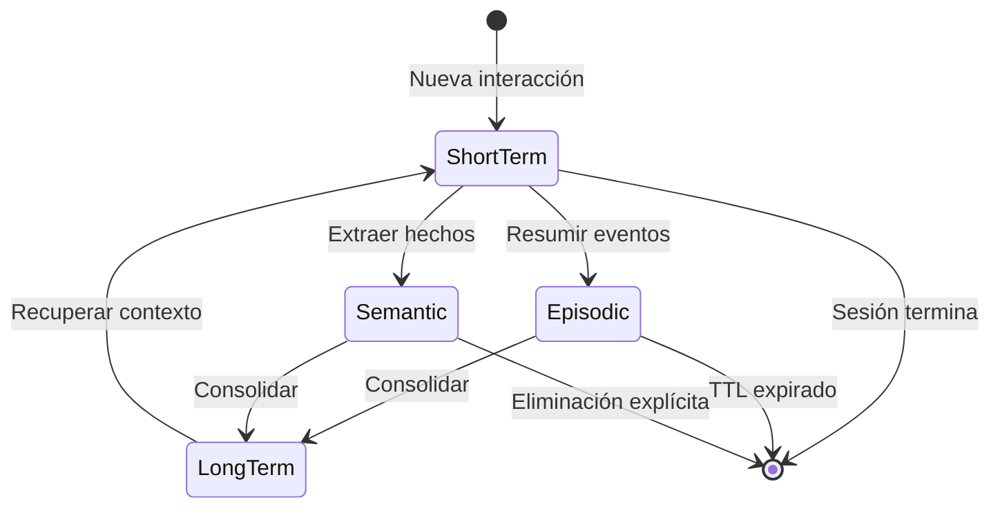
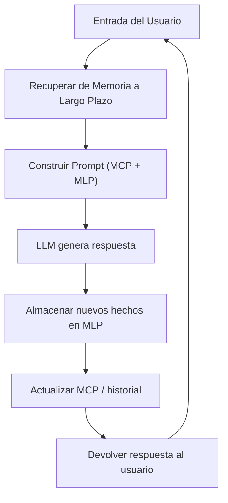
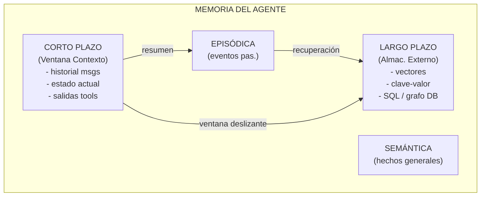

# Fundamentos de la Memoria de Agentes

La memoria es lo que separa un chatbot sin estado de un agente verdaderamente inteligente. Sin memoria, cada interacción comienza desde cero — el agente no puede aprender, personalizar ni mantener contexto entre turnos.

---

## Por Qué los Agentes Necesitan Memoria

Los LLMs modernos son inherentemente sin estado: procesan una única ventana de contexto y olvidan todo una vez que generan la respuesta. Los agentes, sin embargo, operan en múltiples pasos — llaman herramientas, revisitan conclusiones anteriores e interactúan con usuarios en sesiones largas.

La memoria permite:

- **Continuidad** — el agente recuerda lo dicho anteriormente
- **Personalización** — las preferencias del usuario persisten entre sesiones
- **Aprendizaje** — hechos extraídos de una interacción informan las siguientes
- **Coherencia** — las cadenas de razonamiento multi-paso se mantienen consistentes

[!WARNING]
Sin memoria explícita, un agente no puede distinguir entre "cuéntame sobre mi último pedido" y "cuéntame sobre tus capacidades". La ventana de contexto por sí sola es insuficiente para el conocimiento persistente.

---

## Memoria a Corto Plazo vs Largo Plazo

Los agentes, como los humanos, utilizan múltiples sistemas de memoria que operan en diferentes escalas de tiempo.

| Característica | Corto Plazo | Largo Plazo |
| :--- | :--- | :--- |
| Duración | Dentro de una conversación | Entre sesiones / persistente |
| Almacenamiento | En memoria (ventana de contexto) | Almacenamiento externo (BD, vectores) |
| Capacidad | Limitada (límite de tokens del LLM) | Virtualmente ilimitada |
| Recuperación | Directa (contexto completo) | Basada en consulta / similitud |
| Olvido | Automático (desbordamiento) | Eliminación explícita o TTL |
| Uso | Historial inmediato de la conversación | Perfil del usuario, hechos aprendidos |

[!NOTE]
La memoria a corto plazo en agentes es análoga a la memoria de trabajo humana — mantiene información temporalmente mientras el agente procesa la tarea actual. La diferencia clave es que la MCP del agente está limitada por tokens, no por capacidad cognitiva.

---

## Memoria Episódica vs Semántica

Otra distinción clave proviene de la ciencia cognitiva:

- **Memoria episódica** — almacena eventos específicos o interacciones pasadas ("el usuario preguntó sobre precios el martes")
- **Memoria semántica** — almacena conocimiento factual general ("el precio es $10/mes para el plan pro")

La memoria episódica ayuda al agente a recordar lo que pasó. La memoria semántica ayuda al agente a saber lo que es verdad.

[!TIP]
Al diseñar un agente, usa memoria episódica para depuración y pistas de auditoría (qué pasó cuándo), y memoria semántica para perfiles de usuario y bases de conocimiento (qué es verdad). Ambas se almacenan típicamente en el mismo banco vectorial pero etiquetadas con diferentes metadatos.

### Diagrama de Estado de los Tipos de Memoria



### Tabla Comparativa: Todos los Tipos de Memoria

| Tipo de Memoria | Alcance | Persistencia | Método de Recuperación | Ejemplo |
| :--- | :--- | :--- | :--- | :--- |
| Corto Plazo | Una sesión | Efímera | Directa (en contexto) | Últimos 10 mensajes |
| Largo Plazo | Entre sesiones | Persistente | Consulta / búsqueda por similitud | Color favorito del usuario |
| Episódica | Eventos específicos | Duradera | Recuerdo basado en tiempo | "Usuario hizo clic en comprar a las 14h" |
| Semántica | Hechos generales | Duradera | Búsqueda semántica | "Tasa de impuesto es 8.5%" |
| Operativa | Tarea actual | Volátil | Variables en memoria | "Paso 3 de 5 en el checkout" |

---

## Memoria en Bucles de Conversación

Un bucle típico de agente con memoria:



El ciclo ingiere la entrada del usuario, la aumenta con memorias recuperadas, genera una respuesta y luego persiste cualquier información nueva.

[!IMPORTANT]
El orden de las operaciones importa: la recuperación ocurre *antes* de la generación, no después. Si recuperas hechos después de generar una respuesta, el agente alucinará o dará respuestas inconsistentes. Siempre recupera el contexto primero, luego genera.

---

## Memoria Operativa en Agentes

La memoria operativa es el bloc de notas del agente — el espacio temporal donde los pasos intermedios de razonamiento, salidas de herramientas y resultados parciales viven durante un solo turno.

```python
class AgentWorkingMemory:
    """A simple working memory for tracking current task state."""

    def __init__(self):
        self.steps = []
        self.tool_outputs = {}
        self.current_goal = None

    def add_step(self, step: str, result: str):
        self.steps.append({"step": step, "result": result})

    def store_tool_output(self, tool_name: str, output: str):
        self.tool_outputs[tool_name] = output

    def get_context(self) -> str:
        lines = [f"Goal: {self.current_goal}"]
        for s in self.steps:
            lines.append(f"  {s['step']}: {s['result']}")
        return "\n".join(lines)

# Usage
wm = AgentWorkingMemory()
wm.current_goal = "Look up order history"
wm.add_step("search_orders", "Found 3 recent orders")
wm.add_step("format_response", "Prepared summary")
print(wm.get_context())
```

La memoria operativa no se persiste — se borra entre turnos o cuando la tarea se completa.

---

## Olvido y Ventanas de Contexto

Cada LLM tiene una ventana de contexto fija (4K, 8K, 32K, 128K tokens). Cuando la conversación supera este límite, el agente debe decidir qué olvidar.

Estrategias:

- **Ventana deslizante** — mantener los últimos N mensajes, descartar los más antiguos
- **Resumir** — condensar conversaciones anteriores en un resumen
- **Retención selectiva** — mantener hechos importantes, descartar relleno
- **Híbrido** — mantener un resumen + mensajes recientes + hechos recuperados

```python
from collections import deque

class SlidingWindowMemory:
    """Keep only the last N messages in context."""

    def __init__(self, max_messages: int = 10):
        self.messages = deque(maxlen=max_messages)

    def add_message(self, role: str, content: str):
        self.messages.append({"role": role, "content": content})

    def get_context(self) -> list[dict]:
        return list(self.messages)

# Example: sliding window keeps 5 most recent exchanges
sw = SlidingWindowMemory(max_messages=5)
sw.add_message("user", "Hello")
sw.add_message("assistant", "Hi! How can I help?")
sw.add_message("user", "What's the weather?")
sw.add_message("assistant", "It's sunny.")
sw.add_message("user", "Tell me about AI")
sw.add_message("assistant", "AI stands for...")
print(len(sw.get_context()))  # Output: 5 (oldest "Hello" was dropped)
```

[!WARNING]
Elegir qué olvidar es tan importante como elegir qué recordar. Una mala estrategia de olvido provoca que el agente pierda contexto crítico o exceda el presupuesto de tokens.

[!TIP]
Para sistemas de producción, usa un enfoque híbrido: mantén un resumen continuo de toda la conversación, más las últimas N mensajes brutos, más cualquier hecho de entidades recuperado de la memoria a largo plazo. Esto te da tanto precisión como recuperación.

---

## Pipeline de Consolidación de Memoria

La consolidación de memoria mueve información del almacenamiento de corto plazo al de largo plazo. Aquí hay un sistema básico de consolidación:

```python
import json
import time
from typing import Any

class MemoryConsolidator:
    """Consolidates short-term memories into long-term storage."""

    def __init__(self, ttl_seconds: int = 3600):
        self.short_term: list[dict] = []
        self.long_term: dict[str, Any] = {}
        self.ttl = ttl_seconds

    def observe(self, event: str, data: dict):
        """Record a short-term memory."""
        self.short_term.append({
            "event": event,
            "data": data,
            "timestamp": time.time(),
        })

    def consolidate(self):
        """Move memories from short-term to long-term."""
        now = time.time()
        still_fresh = []

        for mem in self.short_term:
            age = now - mem["timestamp"]
            if age < self.ttl:
                still_fresh.append(mem)
            else:
                key = mem["event"]
                if key not in self.long_term:
                    self.long_term[key] = []
                self.long_term[key].append(mem["data"])

        self.short_term = still_fresh

    def recall(self, event: str) -> list[dict]:
        """Retrieve consolidated memories for an event."""
        return self.long_term.get(event, [])

# Usage
mc = MemoryConsolidator(ttl_seconds=10)
mc.observe("user_login", {"user_id": 42, "time": "2025-01-15"})
mc.observe("page_view", {"page": "/pricing", "duration_ms": 3000})
time.sleep(1)
mc.consolidate()
print(mc.recall("user_login"))
```

---

## Diagrama Mermaid de la Arquitectura de Memoria del Agente



---

## Ventana de Contexto vs. Memoria — Distinción Clave

[!IMPORTANT]
La ventana de contexto NO es memoria — es almacenamiento temporal que se sobrescribe cada turno. La memoria verdadera requiere escribir y leer de una capa de persistencia externa. Nunca confundas la ventana de contexto con la memoria a largo plazo.

| Aspecto | Ventana de Contexto | Sistema de Memoria |
| :--- | :--- | :--- |
| Vida útil | Solicitud única | Persistente entre sesiones |
| Capacidad | Fija (4K-128K tokens) | Virtualmente ilimitada |
| Recuperación | Automática (todo el contenido) | Selectiva (basada en consulta) |
| Costo | Incluido en inferencia | Almacenamiento + recuperación adicionales |
| Persistencia | Volátil | Duradera (BD, archivo, vectores) |

---

## 7 Preguntas de Práctica

```question
{
  "id": "am-01-es-q1",
  "type": "multiple-choice",
  "question": "¿Por qué se considera que los LLM son sin estado?",
  "options": [
    "No pueden generar texto",
    "Procesan cada entrada de forma independiente",
    "Solo entienden un idioma",
    "No usan ventanas de contexto"
  ],
  "correct": 1,
  "explanation": "Los LLM son sin estado porque procesan cada entrada de forma independiente — no tienen un mecanismo incorporado para mantener contexto o memoria entre interacciones."
}
```

```question
{
  "id": "am-01-es-q2",
  "type": "multiple-choice",
  "question": "¿Qué tipo de memoria es mejor para almacenar \"el nombre del usuario\"?",
  "options": [
    "Episódica",
    "Semántica",
    "Corto Plazo",
    "Operativa"
  ],
  "correct": 1,
  "explanation": "La memoria semántica almacena conocimiento factual general, como el nombre de un usuario, siendo la mejor opción para este tipo de información persistente."
}
```

```question
{
  "id": "am-01-es-q3",
  "type": "multiple-choice",
  "question": "¿Qué ocurre cuando una conversación supera la ventana de contexto?",
  "options": [
    "El LLM falla",
    "Los mensajes antiguos se descartan o comprimen",
    "La ventana de contexto se expande automáticamente",
    "La sesión se termina"
  ],
  "correct": 1,
  "explanation": "Cuando se supera la ventana de contexto, los mensajes antiguos se descartan o comprimen para mantenerse dentro del límite de tokens."
}
```

```question
{
  "id": "am-01-es-q4",
  "type": "multiple-choice",
  "question": "¿Qué estrategia mantiene los mensajes más recientes y descarta los antiguos?",
  "options": [
    "Resumir",
    "Retención selectiva",
    "Ventana deslizante",
    "Híbrido"
  ],
  "correct": 2,
  "explanation": "Una ventana deslizante mantiene los últimos N mensajes y descarta los más antiguos a medida que llegan mensajes nuevos."
}
```

```question
{
  "id": "am-01-es-q5",
  "type": "multiple-choice",
  "question": "La memoria episódica difiere de la semántica en que la episódica:",
  "options": [
    "Almacena hechos generales",
    "Almacena eventos pasados específicos",
    "Siempre es persistente",
    "Nunca necesita recuperación"
  ],
  "correct": 1,
  "explanation": "La memoria episódica almacena eventos y experiencias pasadas específicas, mientras que la memoria semántica almacena conocimiento factual general."
}
```

```question
{
  "id": "am-01-es-q6",
  "type": "multiple-choice",
  "question": "Un agente pregunta \"¿Cuál es la capital de Francia?\" y la memoria devuelve \"París.\" Este es un ejemplo de qué tipo de memoria?",
  "options": [
    "Memoria episódica",
    "Memoria semántica",
    "Memoria operativa",
    "Memoria procedural"
  ],
  "correct": 1,
  "explanation": "El hecho de que París es la capital de Francia es conocimiento general, almacenado en la memoria semántica."
}
```

```question
{
  "id": "am-01-es-q7",
  "type": "multiple-choice",
  "question": "En un pipeline de consolidación de memoria, ¿qué desencadena el movimiento del corto plazo al largo plazo?",
  "options": [
    "Cada mensaje del usuario",
    "Expiración basada en tiempo o evento explícito de consolidación",
    "Solo cuando el agente se apaga",
    "Nunca — la memoria a corto plazo nunca va al largo plazo"
  ],
  "correct": 1,
  "explanation": "La consolidación se desencadena por TTL basado en tiempo o eventos explícitos como fin de sesión o alcanzar un límite de tokens."
}
```

---

[!SUCCESS]
### Conclusiones Clave

- Los agentes necesitan memoria para mantener continuidad, personalización, aprendizaje y coherencia.
- La memoria a corto plazo vive en la ventana de contexto; la de largo plazo requiere almacenamiento externo.
- La memoria episódica registra eventos específicos; la semántica almacena conocimiento factual general.
- La memoria operativa es el bloc de notas del agente para el estado de la tarea actual y no se persiste.
- La memoria se integra en un bucle: recuperar, aumentar, generar, persistir.
- Las ventanas de contexto imponen un límite estricto; las estrategias de olvido gestionan el exceso.
- La arquitectura combina almacenes de corto plazo, largo plazo, episódico y semántico.
- Elegir qué olvidar es tan crítico como elegir qué recordar.
- La consolidación de memoria mueve datos del corto plazo al largo plazo basada en TTL o desencadenantes explícitos.
