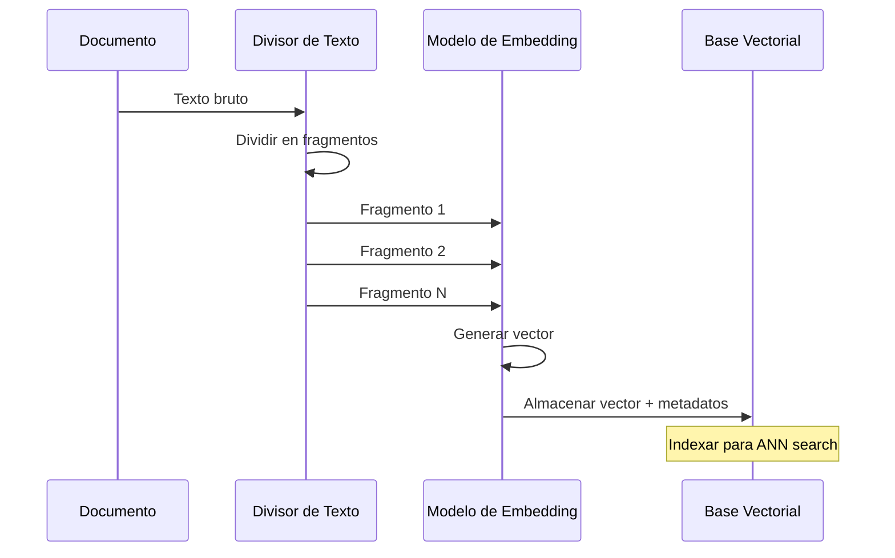

# Vectores, Embeddings y Arquitectura RAG

La Generación Aumentada por Recuperación (RAG) es el patrón dominante para fundamentar respuestas de LLMs en conocimiento externo. En su núcleo están los **embeddings** — representaciones numéricas del significado — y las **bases de datos vectoriales** que los indexan y buscan.

---

## ¿Qué Son los Embeddings?

Un embedding es un vector denso (lista de floats) que captura el significado semántico de un texto. Textos con significados similares se agrupan en el espacio vectorial.

```
"The cat sat on the mat"
        |
        v
[0.023, -0.145, 0.312, ..., 0.078]   ← vector de 384 dimensiones
        |
        v
"A dog slept on the rug"
        |
        v
[0.019, -0.138, 0.305, ..., 0.081]   ← cercano en el espacio vectorial
```

Los modelos de embedding (ej: `text-embedding-3-small`, `all-MiniLM-L6-v2`) mapean texto a un vector de tamaño fijo independientemente de la longitud de entrada.

[!NOTE]
Los modelos de embedding tienen un límite máximo de tokens de entrada (típicamente 512 tokens para modelos open-source, 8192 para `text-embedding-3-large` de OpenAI). Los documentos más largos que este límite deben dividirse en fragmentos antes de la incrustación — esta es la razón por la que la fragmentación es una parte crítica de cualquier pipeline RAG.

### Modelos de Embedding Comunes

| Modelo | Dimensiones | Máx Tokens | Costo | Mejor Para |
| :--- | :--- | :--- | :--- | :--- |
| `text-embedding-3-small` | 512-1536 | 8192 | $0.02/1K tokens | Uso general, sensible a costo |
| `text-embedding-3-large` | 256-3072 | 8192 | $0.13/1K tokens | Necesidades de alta precisión |
| `all-MiniLM-L6-v2` | 384 | 512 | Gratis (local) | Local/offline, prototipado |
| `intfloat/e5-large-v2` | 1024 | 512 | Gratis (local) | Open-source de alta calidad |
| `BAAI/bge-large-en-v1.5` | 1024 | 512 | Gratis (local) | Tareas de recuperación en inglés |

---

## Similitud por Coseno

La forma más común de comparar dos embeddings es la **similitud por coseno**:

```
similitud_coseno(A, B) = (A · B) / (||A|| * ||B||)
```

- Varía de -1 (significado opuesto) a 1 (significado idéntico)
- Valores por encima de 0.8 generalmente indican fuerte similitud semántica
- Utilizada por bases de datos vectoriales para clasificar resultados

[!WARNING]
La similitud por coseno asume que todas las dimensiones tienen el mismo peso. Si el modelo de embedding está sesgado o mal entrenado, las puntuaciones pueden no reflejar la relevancia semántica real. Siempre evalúa la calidad de la recuperación en tu dominio específico.

### Comparación de Métricas de Distancia

| Métrica | Rango | Caso de Uso | Velocidad |
| :--- | :--- | :--- | :--- |
| Similitud por coseno | [-1, 1] | Búsqueda semántica de texto | Rápida |
| Euclidiana (L2) | [0, ∞) | Embeddings de imagen, clustering | Rápida |
| Producto escalar | (-∞, ∞) | Vectores normalizados, eficiencia | Muy rápida |
| Manhattan (L1) | [0, ∞) | Vectores dispersos | Moderada |
| Hamming | [0, dim] | Embeddings binarios | Muy rápida |

---

## Pipeline de Generación de Embeddings

El proceso de embedding transforma texto bruto en vectores buscables:



---

## Fragmentación de Documentos

Los documentos brutos deben dividirse en fragmentos antes de la incrustación. La estrategia de fragmentación impacta directamente la calidad de la recuperación.

```python
from langchain.text_splitter import RecursiveCharacterTextSplitter

# Load a document
with open("report.md", "r") as f:
    text = f.read()

# Create a recursive text splitter
splitter = RecursiveCharacterTextSplitter(
    chunk_size=500,        # target characters per chunk
    chunk_overlap=50,      # overlap between chunks
    separators=["\n\n", "\n", ".", " "],  # priority order
    length_function=len,
)

chunks = splitter.split_text(text)
print(f"Split into {len(chunks)} chunks")
# Output: Split into 23 chunks
```

La superposición garantiza que las frases o ideas divididas entre fragmentos no se pierdan.

### Comparación de Estrategias de Fragmentación

| Estrategia | Unidad | Preserva Estructura | Superposición | Mejor Para |
| :--- | :--- | :--- | :--- | :--- |
| RecursiveCharacter | Caracteres (por separador) | Moderada | Sí | Texto general, mayoría de casos |
| Token | Tokens (consciente del modelo) | Baja | Sí | Fragmentos alineados al LLM |
| MarkdownHeader | Encabezados Markdown | Alta | No | Documentación, wikis |
| RecursiveJson | Claves JSON | Alta | No | Datos JSON estructurados |
| HTMLHeader | Etiquetas HTML (h1, h2, etc.) | Alta | No | Páginas web, docs HTML |
| Semántica | Límites de oración | Alta | No | Preservación de pasajes coherentes |

```python
from langchain.text_splitter import (
    TokenTextSplitter,
    MarkdownHeaderTextSplitter,
)

# Token-aware splitting (matches LLM tokenizers)
token_splitter = TokenTextSplitter(
    chunk_size=256,      # tokens, not characters
    chunk_overlap=50,
)

# Markdown-aware splitting (preserves header structure)
headers_to_split_on = [
    ("#", "Header 1"),
    ("##", "Header 2"),
]
markdown_splitter = MarkdownHeaderTextSplitter(
    headers_to_split_on=headers_to_split_on,
)

# Semantic chunking using sentence boundaries
from langchain.text_splitter import SentenceTransformersTokenTextSplitter

semantic_splitter = SentenceTransformersTokenTextSplitter(
    chunk_size=256,
    chunk_overlap=0,
    model_name="sentence-transformers/all-mpnet-base-v2",
)
```

---

## Bases de Datos Vectoriales

Las bases de datos vectoriales se especializan en almacenar vectores de embedding y realizar búsquedas rápidas del vecino más cercano.

| Característica | Chroma | Pinecone | Qdrant | Weaviate |
| :--- | :--- | :--- | :--- | :--- |
| Despliegue | Local / embebido | Nube / serverless | Autogestionado / nube | Autogestionado / nube |
| Código Abierto | Sí | No | Sí | Sí (desde 2024) |
| Filtrado | Filtros de metadatos | Namespace + metadatos | Filtros de payload | GraphQL + metadatos |
| Métricas de distancia | Coseno, L2, IP | Coseno, L2, IP | Coseno, L2, IP, Dot | Coseno, L2, IP, Dot |
| Nivel gratuito | Ilimitado local | 1 índice, limitado | 1GB clúster gratis | 1GB gratis (sandbox) |
| Soporte LangChain | Nativo | Nativo | Nativo | Nativo |
| Escalabilidad | Nodo único | Auto-scaling | Sharding horizontal | Sharding horizontal |

[!TIP]
Para prototipado y desarrollo local, Chroma es la mejor elección — se ejecuta embebido con cero infraestructura. Para producción a escala, Pinecone o Qdrant ofrecen auto-scaling gestionado. Qdrant es preferido si necesitas auto-hospedaje.

---

## Pipeline de Indexación

Un pipeline de indexación de producción transforma documentos brutos en un índice vectorial buscable:

```
Documentos Brutos (PDF, HTML, MD)
        |
        v
[ Extracción de Texto ]
        |
        v
[ Fragmentación (divisor) ]
        |
        v
[ Embedding (modelo) ]
        |
        v
[ Inserción en BD Vectorial ]
        |
        v
[ Índice de Metadatos ]
```

```python
import chromadb
from sentence_transformers import SentenceTransformer

# Initialize embedding model
model = SentenceTransformer("all-MiniLM-L6-v2")

# Initialize Chroma client
client = chromadb.Client()
collection = client.create_collection("my_docs")

# Generate embeddings for chunks
embeddings = model.encode(chunks).tolist()

# Add to vector store with metadata
collection.add(
    documents=chunks,
    embeddings=embeddings,
    metadatas=[{"source": "report.md", "chunk_id": i}
               for i in range(len(chunks))],
    ids=[f"chunk_{i}" for i in range(len(chunks))],
)
```

[!IMPORTANT]
Siempre almacena metadatos junto con los embeddings. Los metadatos permiten búsqueda filtrada (ej: "solo resultados de 2025"), rastreo a nivel de documento y actualizaciones incrementales. Sin metadatos, no puedes eliminar o actualizar documentos selectivamente.

---

## Flujo de Generación Aumentada por Recuperación

RAG conecta la recuperación con la generación en un solo pipeline.


```python
from openai import OpenAI
import chromadb

client = OpenAI()
chroma_client = chromadb.Client()
collection = chroma_client.get_collection("my_docs")

def rag_answer(query: str, k: int = 3) -> str:
    # 1. Embed the query (using OpenAI embeddings)
    query_emb = client.embeddings.create(
        input=query,
        model="text-embedding-3-small"
    ).data[0].embedding

    # 2. Retrieve top-k chunks
    results = collection.query(
        query_embeddings=[query_emb],
        n_results=k,
    )
    context = "\n\n".join(results["documents"][0])

    # 3. Generate with context
    response = client.chat.completions.create(
        model="gpt-4o-mini",
        messages=[
            {"role": "system",
             "content": "Answer using only the provided context."},
            {"role": "user",
             "content": f"Context:\n{context}\n\nQuestion: {query}"}
        ],
    )
    return response.choices[0].message.content

print(rag_answer("What is the return policy?"))
```

[!WARNING]
Un modo común de fallo de RAG es el exceso de contexto — poner demasiados fragmentos recuperados en el prompt, lo que diluye la relación señal-ruido. Recupera solo los top-k fragmentos más relevantes (k=3 a 5 es típico) y considera agregar un umbral de puntuación de relevancia para filtrar coincidencias de baja calidad.

---

## Recuperación con Filtros de Metadatos

Los sistemas RAG reales necesitan combinar búsqueda semántica con filtrado estructurado:

```python
def filtered_rag_answer(
    query: str,
    department: str | None = None,
    max_year: int | None = None,
    k: int = 3,
) -> str:
    # Build metadata filter
    where_filter = {}
    if department:
        where_filter["department"] = department
    if max_year:
        where_filter["year"] = {"$lte": max_year}

    # Embed query
    query_emb = client.embeddings.create(
        input=query,
        model="text-embedding-3-small"
    ).data[0].embedding

    # Retrieve with filter
    results = collection.query(
        query_embeddings=[query_emb],
        n_results=k,
        where=where_filter,
    )

    context = "\n\n".join(results["documents"][0])

    response = client.chat.completions.create(
        model="gpt-4o-mini",
        messages=[
            {"role": "system",
             "content": "Answer using only the provided context."},
            {"role": "user",
             "content": f"Context:\n{context}\n\nQuestion: {query}"}
        ],
    )
    return response.choices[0].message.content

# Example: query only engineering documents from 2025
# answer = filtered_rag_answer("API rate limits",
#                              department="engineering",
#                              max_year=2025)
```

[!TIP]
Los filtros de metadatos mejoran dramáticamente la precisión de la recuperación al reducir el espacio de búsqueda. Los campos de filtro comunes incluyen: documento de origen, rango de fechas, tipo de documento, departamento, autor e idioma. Diseña tu esquema de metadatos antes de construir el pipeline de ingesta.

---

## Búsqueda Híbrida: Vectorial + Palabras Clave

La búsqueda puramente vectorial puede perder coincidencias exactas. La búsqueda híbrida combina similitud vectorial con clasificación por palabras clave (BM25):

```python
def hybrid_search(query: str, k: int = 5, alpha: float = 0.5) -> list[str]:
    """
    Hybrid search combining vector and keyword scores.
    alpha=1.0: pure vector search
    alpha=0.0: pure keyword search
    """
    # Vector search scores
    query_emb = client.embeddings.create(
        input=query, model="text-embedding-3-small"
    ).data[0].embedding
    vector_results = collection.query(
        query_embeddings=[query_emb], n_results=k * 2
    )

    # Keyword search (simplified BM25-like scoring)
    query_terms = set(query.lower().split())
    keyword_scores = {}
    for i, doc in enumerate(chunks):
        doc_terms = set(doc.lower().split())
        overlap = query_terms & doc_terms
        if overlap:
            keyword_scores[i] = len(overlap) / (len(doc_terms) ** 0.5)

    # Normalize and combine scores
    # (In production, use a proper hybrid retriever like
    #  LangChain's EnsembleRetriever)
    combined_scores = {}
    # ... normalization and alpha-weighted combination ...

    return sorted(combined_scores, key=combined_scores.get, reverse=True)[:k]
```

---

## 6 Preguntas de Práctica

```question
{
  "id": "am-02-es-q1",
  "type": "multiple-choice",
  "question": "¿Qué es un embedding?",
  "options": [
    "Una versión comprimida del texto original",
    "Un vector denso que representa el significado semántico",
    "Una oración tokenizada",
    "Una consulta SQL"
  ],
  "correct": 1,
  "explanation": "Un embedding es un vector denso (lista de floats) que captura el significado semántico de un texto."
}
```

```question
{
  "id": "am-02-es-q2",
  "type": "multiple-choice",
  "question": "¿Qué métrica de similitud es más común en la búsqueda vectorial?",
  "options": [
    "Distancia euclidiana",
    "Distancia de Manhattan",
    "Similitud por coseno",
    "Similitud de Jaccard"
  ],
  "correct": 2,
  "explanation": "La similitud por coseno es la métrica más común para comparar embeddings, midiendo el ángulo entre dos vectores."
}
```

```question
{
  "id": "am-02-es-q3",
  "type": "multiple-choice",
  "question": "¿Por qué es necesaria la fragmentación de documentos en RAG?",
  "options": [
    "Para reducir el tamaño del archivo",
    "Para ajustar los documentos al límite de entrada del modelo de embedding",
    "Para cifrar el contenido",
    "Para convertir PDFs a texto"
  ],
  "correct": 1,
  "explanation": "Los documentos deben dividirse en fragmentos antes de la incrustación para que cada fragmento quepa dentro del límite de entrada del modelo de embedding."
}
```

```question
{
  "id": "am-02-es-q4",
  "type": "multiple-choice",
  "question": "¿Qué base de datos vectorial es de código abierto y se ejecuta localmente?",
  "options": [
    "Pinecone",
    "Chroma",
    "Weaviate",
    "Redis"
  ],
  "correct": 1,
  "explanation": "Chroma es una base de datos vectorial de código abierto que puede ejecutarse localmente o integrada en una aplicación."
}
```

```question
{
  "id": "am-02-es-q5",
  "type": "multiple-choice",
  "question": "En el flujo RAG, ¿qué ocurre antes de que el LLM genere una respuesta?",
  "options": [
    "La consulta se traduce a SQL",
    "Se recuperan fragmentos relevantes de la BD vectorial",
    "Se limpia la ventana de contexto",
    "La respuesta se almacena en caché"
  ],
  "correct": 1,
  "explanation": "En el flujo RAG, primero se recuperan fragmentos relevantes de la BD vectorial y luego se proporcionan como contexto al LLM para la generación."
}
```

```question
{
  "id": "am-02-es-q6",
  "type": "multiple-choice",
  "question": "Un agente de soporte sigue recuperando documentos irrelevantes de RRHH cuando los usuarios hacen preguntas técnicas. ¿Qué corrección probablemente más ayudaría?",
  "options": [
    "Cambiar a un modelo de embedding más pequeño",
    "Agregar un filtro de metadatos para departamento = 'ingeniería'",
    "Aumentar el tamaño del fragmento a 2000 caracteres",
    "Eliminar todos los metadatos de los documentos"
  ],
  "correct": 1,
  "explanation": "Agregar un filtro de metadatos restringe el espacio de búsqueda solo a documentos de ingeniería, evitando que documentos irrelevantes de RRHH aparezcan en los resultados."
}
```

---

[!SUCCESS]
### Conclusiones Clave

- Los embeddings mapean texto a vectores densos que codifican el significado semántico.
- La similitud por coseno mide el ángulo entre vectores; valores cercanos a 1 indican alta similitud.
- Las bases de datos vectoriales (Chroma, Pinecone, Qdrant) se especializan en búsqueda rápida de vecinos cercanos.
- La fragmentación de documentos con superposición es esencial para una recuperación de calidad.
- Un pipeline RAG incrusta una consulta, busca en la BD vectorial, recupera top-k fragmentos y los alimenta como contexto al LLM.
- El filtrado por metadatos y la superposición de fragmentos mejoran la precisión de la recuperación.
- La búsqueda híbrida combina métodos vectoriales y de palabras clave para mejor recuperación.
- La arquitectura RAG es agnóstica al modelo y funciona con cualquier combinación de embedding + LLM.
