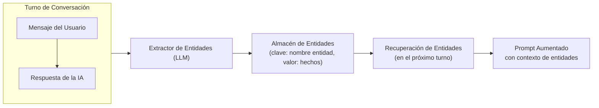
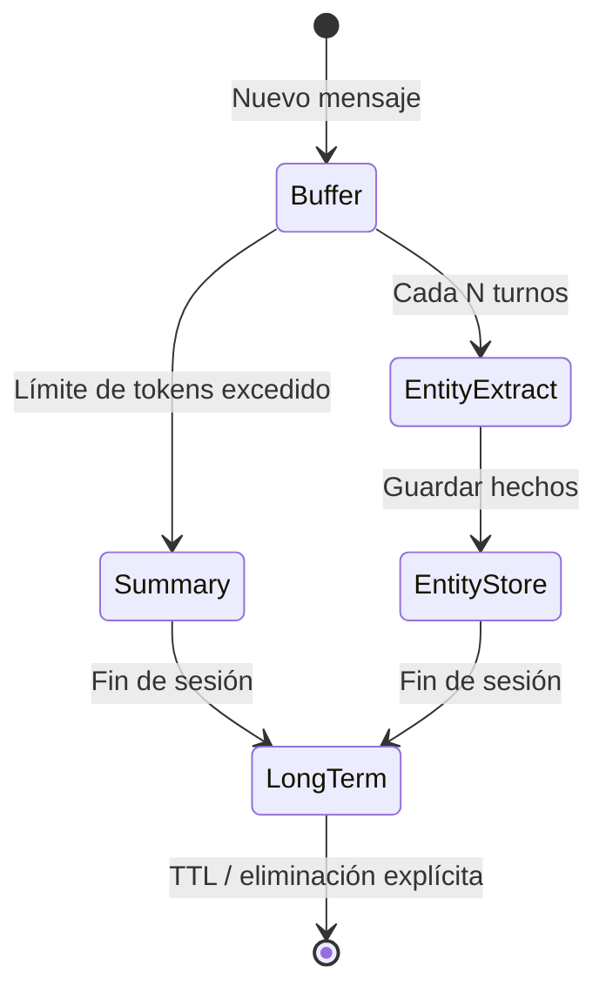
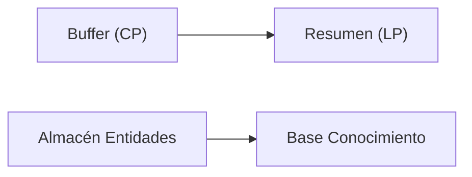

# Almacenamiento de Memoria, Resúmenes y Extracción de Entidades

LangChain proporciona varias clases de memoria integradas que ofrecen a los agentes diferentes formas de recordar. Elegir el tipo de memoria correcto — o combinarlos — determina qué tan bien tu agente recuerda y utiliza información pasada.

---

## ConversationBufferMemory

La memoria más simple: mantener una lista de todos los mensajes pasados en la conversación.

```python
from langchain.memory import ConversationBufferMemory
from langchain.schema import HumanMessage, AIMessage

# Create a buffer memory
memory = ConversationBufferMemory(
    return_messages=True,  # return list of Message objects
)

# Simulate a conversation
memory.chat_memory.add_user_message("Hi, I'm Alice.")
memory.chat_memory.add_ai_message("Hello Alice! How can I help?")
memory.chat_memory.add_user_message("What's the weather today?")

# Retrieve full history
history = memory.load_memory_variables({})
print(history["history"])
# Output: [HumanMessage(...), AIMessage(...), HumanMessage(...)]
```

[!WARNING]
`ConversationBufferMemory` crece sin límites. En conversaciones largas, excederá la ventana de contexto del LLM. Siempre combínalo con una estrategia de recorte o resumen en producción.

[!NOTE]
La memoria de buffer es puramente en memoria. Si tu servidor se reinicia, todo el historial se pierde. Usa un almacenamiento de respaldo persistente (Redis, SQL o basado en archivo) para implementaciones de producción que requieren continuidad de sesión.

---

## ConversationSummaryMemory

En lugar de almacenar cada mensaje, esta memoria resume periódicamente mensajes antiguos en una forma condensada.

```python
from langchain.memory import ConversationSummaryMemory
from langchain_openai import ChatOpenAI

llm = ChatOpenAI(model="gpt-4o-mini", temperature=0)

# Summary memory uses an LLM to compress history
memory = ConversationSummaryMemory(
    llm=llm,
    max_token_limit=200,  # trigger summarization above this
    return_messages=True,
)

memory.save_context(
    {"input": "My name is Bob and I work at Acme Corp."},
    {"output": "Nice to meet you Bob."},
)
memory.save_context(
    {"input": "I need help with the API key setup."},
    {"output": "Sure, let me walk you through it."},
)

# The summary will condense the above exchanges
summary = memory.load_memory_variables({})
print(summary["history"])
# Output: "Bob works at Acme Corp. and needs help with API key setup."
```

Compensación: los resúmenes ahorran tokens pero pierden detalles. Un resumen de una sesión de depuración podría omitir el mensaje de error exacto.

[!TIP]
Elige tu `max_token_limit` cuidadosamente. Un límite demasiado bajo activa la summarización con demasiada frecuencia (aumentando los costos del LLM). Un límite demasiado alto retrasa la summarización, permitiendo que el contexto crezca excesivamente. Comienza con 1000-2000 tokens y ajusta según la distribución de longitud de tus conversaciones.

---

## Memorias de Extracción de Entidades

Las memorias de entidades rastrean entidades específicas (personas, lugares, productos) mencionadas en una conversación y acumulan hechos sobre cada una.

```python
from langchain.memory import ConversationEntityMemory
from langchain_openai import ChatOpenAI

llm = ChatOpenAI(model="gpt-4o-mini", temperature=0)

memory = ConversationEntityMemory(llm=llm, return_messages=True)

# First turn — entity "Alice" is introduced
memory.save_context(
    {"input": "Alice is our lead engineer."},
    {"output": "Got it, Alice is the lead engineer."},
)

# Second turn — new fact about "Alice"
memory.save_context(
    {"input": "Alice prefers Python over Java."},
    {"output": "Noted, Alice prefers Python."},
)

# Retrieve stored facts about all entities
vars = memory.load_memory_variables({})
print(vars["entities"])
# Output: {'Alice': 'Alice is the lead engineer. Alice prefers Python over Java.'}
```

La memoria de entidades es poderosa para la personalización — un agente puede saludar a un usuario por su nombre y recordar sus preferencias sin preguntar de nuevo.

### Pipeline de Extracción de Entidades



[!IMPORTANT]
La memoria de entidades depende del LLM para identificar y extraer entidades correctamente. Si el LLM alucina entidades o atribuye hechos incorrectamente, la memoria acumulará errores. Siempre valida las entidades extraídas al usar este tipo de memoria en producción.

---

## Almacenes de Memoria Personalizados

Para sistemas de producción, a menudo necesitarás un almacenamiento personalizado. A continuación se muestra una memoria basada en Redis que persiste entre reinicios del servidor.

```python
import json
import redis
from langchain.memory import ChatMessageHistory
from langchain.schema import messages_from_dict, messages_to_dict

class RedisChatMessageHistory(ChatMessageHistory):
    """Persist conversation history in Redis."""

    def __init__(self, session_id: str,
                 redis_url: str = "redis://localhost:6379"):
        self.session_id = session_id
        self.redis_client = redis.from_url(redis_url)
        super().__init__()

    @property
    def key(self) -> str:
        return f"chat_history:{self.session_id}"

    def load_messages(self) -> list:
        data = self.redis_client.get(self.key)
        if data:
            return messages_from_dict(json.loads(data))
        return []

    def add_message(self, message) -> None:
        super().add_message(message)
        self._persist()

    def clear(self) -> None:
        self.redis_client.delete(self.key)
        super().clear()

    def _persist(self) -> None:
        serialized = messages_to_dict(self.messages)
        self.redis_client.set(self.key, json.dumps(serialized))
```

### Memoria Personalizada con SQLite

Para persistencia ligera sin Redis, usa SQLite:

```python
import sqlite3
import json
from datetime import datetime

class SQLiteMemory:
    """Persistent memory using SQLite — zero infrastructure needed."""

    def __init__(self, db_path: str = "agent_memory.db"):
        self.conn = sqlite3.connect(db_path)
        self.conn.execute("""
            CREATE TABLE IF NOT EXISTS memory (
                session_id TEXT,
                message_role TEXT,
                content TEXT,
                timestamp TEXT,
                PRIMARY KEY (session_id, timestamp)
            )
        """)
        self.conn.commit()

    def add_message(self, session_id: str, role: str, content: str):
        self.conn.execute(
            "INSERT INTO memory VALUES (?, ?, ?, ?)",
            (session_id, role, content, datetime.utcnow().isoformat()),
        )
        self.conn.commit()

    def get_history(self, session_id: str, limit: int = 50) -> list[dict]:
        cursor = self.conn.execute(
            "SELECT message_role, content FROM memory "
            "WHERE session_id = ? ORDER BY timestamp DESC LIMIT ?",
            (session_id, limit),
        )
        rows = cursor.fetchall()
        return [{"role": r[0], "content": r[1]} for r in reversed(rows)]

    def clear_session(self, session_id: str):
        self.conn.execute(
            "DELETE FROM memory WHERE session_id = ?",
            (session_id,),
        )
        self.conn.commit()
```

[!TIP]
SQLite es una excelente opción para agentes de proceso único y prototipado. Para sistemas distribuidos o de alto rendimiento, usa Redis (rápido, en memoria) o PostgreSQL (duradero, consultable). Tu elección de almacenamiento de respaldo debe coincidir con las necesidades de escalabilidad de tu aplicación.

---

## Enfoques Híbridos

Los agentes más robustos combinan múltiples tipos de memoria:

```python
from langchain.memory import (
    ConversationSummaryBufferMemory,
    ConversationEntityMemory,
)
from langchain.memory.combined import CombinedMemory
from langchain_openai import ChatOpenAI

llm = ChatOpenAI(model="gpt-4o-mini", temperature=0)

# Summary memory for conversation compression
summary_memory = ConversationSummaryBufferMemory(
    llm=llm,
    max_token_limit=500,
    memory_key="history",
    return_messages=True,
)

# Entity memory for tracking named entities
entity_memory = ConversationEntityMemory(
    llm=llm,
    memory_key="entities",
    return_messages=True,
)

# Combine them into one memory object
combined = CombinedMemory(
    memories=[summary_memory, entity_memory]
)
```

---

## Tabla Comparativa: Tipos de Memoria

| Tipo de Memoria | Almacenamiento | Coste Tokens | Nivel Detalle | Mejor Para | Persistencia |
| :--- | :--- | :--- | :--- | :--- | :--- |
| ConversationBuffer | Lista en memoria | Alto (todo) | Fidelidad total | Demos cortas, depuración | Volátil |
| ConversationSummary | Resumen vía LLM | Bajo (comprimido) | Condensado | Conversaciones largas | Volátil |
| ConversationSummaryBuffer | Buffer + disparador | Medio | Adaptativo | Chatbots producción | Volátil |
| ConversationEntity | Entidad → hechos | Bajo (por ent.) | Enfocado | Personalización, CRM | Volátil |
| Personalizado (Redis, SQL) | BD externo | Configurable | Configurable | Sistemas producción | Persistente |

---

## Consolidación de Memoria

La consolidación mueve información del almacenamiento de corto plazo al de largo plazo. Un cronograma típico:

1. **En cada turno** — añadir al buffer (corto plazo)
2. **Cada N turnos** — extraer entidades y actualizar almacén
3. **En el disparador de resumen** — comprimir buffer en memoria de resumen
4. **Al final de la sesión** — persistir hechos de entidades en base de conocimiento permanente





### Consolidación Automatizada con LangChain

```python
from langchain.memory import ConversationSummaryBufferMemory
from langchain_openai import ChatOpenAI

class AutoConsolidatingMemory:
    """Memory that automatically consolidates when thresholds are hit."""

    def __init__(self, llm, max_tokens: int = 1000):
        self.buffer = ConversationSummaryBufferMemory(
            llm=llm,
            max_token_limit=max_tokens,
            return_messages=True,
        )
        self.entity_store: dict[str, str] = {}
        self.turn_count = 0

    def save_context(self, inputs: dict, outputs: dict):
        self.turn_count += 1
        self.buffer.save_context(inputs, outputs)

        # Extract entities every 3 turns
        if self.turn_count % 3 == 0:
            self._extract_entities(inputs, outputs)

    def _extract_entities(self, inputs: dict, outputs: dict):
        """Simple entity extraction from input text."""
        import re
        combined = f"{inputs.get('input', '')} {outputs.get('output', '')}"
        # Pattern: "X is Y" or "X prefers Y"
        patterns = re.findall(
            r"(\w+) (?:is|prefers|works|likes) (\w+)",
            combined,
        )
        for entity, attr in patterns:
            if entity not in self.entity_store:
                self.entity_store[entity] = []
            self.entity_store[entity].append(attr)

    def load_memory(self) -> dict:
        return {
            "history": self.buffer.load_memory_variables({}),
            "entities": self.entity_store,
        }

# Usage
llm = ChatOpenAI(model="gpt-4o-mini", temperature=0)
memory = AutoConsolidatingMemory(llm=llm, max_tokens=1000)
memory.save_context({"input": "Hi, I'm Charlie"}, {"output": "Hello Charlie"})
memory.save_context({"input": "I like Python"}, {"output": "Great language"})
memory.save_context({"input": "My manager is Dana"}, {"output": "Good to know"})
print(memory.load_memory()["entities"])
# Output: {'Charlie': ['Python'], 'Dana': ['is']}
```

---

## Tabla Comparativa: Almacenes de Respaldo

| Almacén | Tipo | Persistencia | Velocidad | Caso de Uso |
| :--- | :--- | :--- | :--- | :--- |
| En memoria (lista Python) | RAM | Ninguna | Más rápida | Prototipado, turno único |
| Redis | Clave-valor | Configurable (RDB/AOF) | Muy rápida | Caché de sesión, pub/sub |
| SQLite | Relacional | Basado en archivo | Rápida | Agentes de proceso único |
| PostgreSQL | Relacional | Duradero | Moderada | Multiproceso, consultas complejas |
| Archivo (JSON/parquet) | Archivo plano | Duradero | Más lenta | Archivado, depuración |
| BD vectorial (Chroma) | BD vectorial | Duradero | Moderada | Búsqueda semántica (no chat) |

---

## 6 Preguntas de Práctica

```question
{
  "id": "am-03-es-q1",
  "type": "multiple-choice",
  "question": "¿Qué tipo de memoria almacena cada mensaje sin compresión?",
  "options": [
    "ConversationSummaryMemory",
    "ConversationBufferMemory",
    "ConversationEntityMemory",
    "CombinedMemory"
  ],
  "correct": 1,
  "explanation": "ConversationBufferMemory almacena cada mensaje completo sin compresión ni resumen."
}
```

```question
{
  "id": "am-03-es-q2",
  "type": "multiple-choice",
  "question": "¿Cuál es la principal compensación de ConversationSummaryMemory?",
  "options": [
    "Es lento de cargar",
    "Pierde detalles durante el resumen",
    "No puede almacenar entidades",
    "Requiere una base de datos"
  ],
  "correct": 1,
  "explanation": "ConversationSummaryMemory ahorra tokens comprimiendo el historial, pero esta compresión inevitablemente pierde algunos detalles."
}
```

```question
{
  "id": "am-03-es-q3",
  "type": "multiple-choice",
  "question": "ConversationEntityMemory es más adecuado para:",
  "options": [
    "Almacenar historial bruto de conversación",
    "Rastrear hechos sobre entidades nombradas",
    "Comprimir conversaciones largas",
    "Persistencia en Redis"
  ],
  "correct": 1,
  "explanation": "ConversationEntityMemory rastrea entidades específicas (personas, lugares, productos) y acumula hechos sobre cada una entre turnos."
}
```

```question
{
  "id": "am-03-es-q4",
  "type": "multiple-choice",
  "question": "¿Por qué usar CombinedMemory?",
  "options": [
    "Para reemplazar todos los otros tipos de memoria",
    "Para combinar múltiples estrategias de memoria en un agente",
    "Para acelerar el LLM",
    "Para reducir el uso de tokens a cero"
  ],
  "correct": 1,
  "explanation": "CombinedMemory permite que un agente use múltiples tipos de memoria (resumen, buffer y entidades) simultáneamente."
}
```

```question
{
  "id": "am-03-es-q5",
  "type": "multiple-choice",
  "question": "¿Qué hace la consolidación de memoria?",
  "options": [
    "Elimina memorias antiguas",
    "Mueve información del corto plazo al largo plazo",
    "Duplica todas las memorias",
    "Encripta el almacén de memoria"
  ],
  "correct": 1,
  "explanation": "La consolidación de memoria mueve periódicamente información del almacenamiento de corto plazo (buffer) a almacenes de largo plazo (resumen, base de conocimiento)."
}
```

```question
{
  "id": "am-03-es-q6",
  "type": "multiple-choice",
  "question": "Un agente chatbot necesita recordar preferencias del usuario después de reinicios del servidor. ¿Qué almacén de respaldo es la opción mínima viable?",
  "options": [
    "Lista Python en memoria",
    "Base de datos SQLite basada en archivo",
    "Un segundo LLM para regenerar preferencias",
    "Variables de entorno"
  ],
  "correct": 1,
  "explanation": "SQLite proporciona persistencia basada en archivo que sobrevive reinicios del servidor con cero infraestructura. El almacenamiento en memoria perdería todas las preferencias al reiniciar."
}
```

---

[!SUCCESS]
### Conclusiones Clave

- `ConversationBufferMemory` almacena historial bruto pero crece sin límites.
- `ConversationSummaryMemory` usa un LLM para comprimir el historial, ahorrando tokens a costa de detalles.
- `ConversationEntityMemory` extrae y rastrea hechos sobre entidades nombradas entre turnos.
- Los almacenes personalizados (Redis, SQL, archivos) permiten persistencia más allá de una sola sesión.
- La memoria combinada permite que un agente use resumen, buffer y entidades simultáneamente.
- La consolidación mueve periódicamente datos de corto plazo a almacenes de largo plazo.
- Elige tipos de memoria según el equilibrio entre coste de tokens, retención de detalles y requisitos de persistencia.
- SQLite es el almacén persistente de respaldo más simple para agentes de proceso único; Redis es mejor para sistemas distribuidos.
