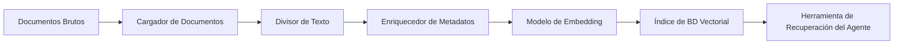
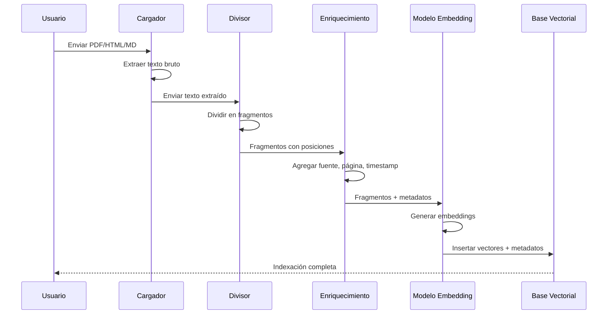

# Integración de Base de Conocimiento y Procesamiento de Documentos

Un agente es tan conocedor como los documentos a los que puede acceder. Construir un pipeline robusto de ingesta de documentos — desde archivos brutos hasta una base de conocimiento buscable — es una habilidad fundamental de ingeniería para agentes de producción.

---

## Ingesta de Documentos (PDF, HTML, Markdown)

Diferentes formatos requieren diferentes cargadores. LangChain proporciona cargadores para cada formato principal.

```python
from langchain_community.document_loaders import (
    PyPDFLoader,      # PDF files
    BSHTMLLoader,     # HTML pages
    TextLoader,       # Plain text / Markdown
    UnstructuredMarkdownLoader,  # Structured Markdown
)

# Load a PDF
pdf_loader = PyPDFLoader("contract.pdf")
pdf_docs = pdf_loader.load()
print(f"Loaded {len(pdf_docs)} pages from PDF")
# Output: Loaded 12 pages from PDF

# Load an HTML file
html_loader = BSHTMLLoader("page.html")
html_docs = html_loader.load()
print(f"Title: {html_docs[0].metadata.get('title', 'N/A')}")
# Output: Title: Product Documentation

# Load Markdown
md_loader = UnstructuredMarkdownLoader("readme.md")
md_docs = md_loader.load()
print(f"Loaded {len(md_docs)} Markdown documents")
```

[!WARNING]
La calidad de la extracción de PDF varía enormemente. Los PDFs escaneados requieren OCR (ej: `pytesseract` o Azure Document Intelligence). Siempre inspecciona el texto extraído antes de indexar.

### Pipeline de Ingesta de Documentos



---

## Procesamiento de Documentos: Secuencia Punto a Punto



[!IMPORTANT]
Siempre valida la salida de cada etapa del pipeline antes de pasar a la siguiente. Una falla común es que el cargador de documentos devuelva texto vacío o distorsionado, que luego se incrusta e indexa como si fuera significativo. Agrega verificaciones de validación: longitud del texto > 0, proporción de caracteres y detección de idioma.

---

## OCR para Documentos Escaneados

Los PDFs escaneados contienen imágenes de texto, no texto seleccionable. El OCR extrae el texto de las imágenes:

```python
# Example: using pytesseract for OCR on scanned PDFs
from pdf2image import convert_from_path
import pytesseract
from langchain.schema import Document

def ocr_pdf(filepath: str) -> list[Document]:
    """Extract text from a scanned PDF using OCR."""
    images = convert_from_path(filepath)
    documents = []

    for page_num, image in enumerate(images, start=1):
        # Run OCR on the page image
        text = pytesseract.image_to_string(image, lang="eng")

        if len(text.strip()) < 20:
            # Skip pages with insufficient text
            continue

        doc = Document(
            page_content=text,
            metadata={
                "source": filepath,
                "page": page_num,
                "ocr_method": "tesseract",
            },
        )
        documents.append(doc)

    return documents

# Usage
# docs = ocr_pdf("scanned_contract.pdf")
# print(f"Extracted {len(docs)} pages via OCR")
```

[!NOTE]
La precisión del OCR depende en gran medida de la calidad de la imagen. Para mejores resultados, escanea a 300 DPI o más, usa modo blanco y negro, y asegúrate de que el documento esté plano (no enrollado o doblado). Considera servicios comerciales de OCR (Azure Document Intelligence, Google Cloud Vision) para escaneos de baja calidad.

---

## Estrategias de División de Texto

El divisor elegido cambia drásticamente la calidad de la recuperación. A continuación se muestran las estrategias más comunes.

```python
from langchain.text_splitter import (
    RecursiveCharacterTextSplitter,
    TokenTextSplitter,
    MarkdownHeaderTextSplitter,
)

# Strategy 1: Recursive character splitting (general purpose)
recursive_splitter = RecursiveCharacterTextSplitter(
    chunk_size=1000,
    chunk_overlap=200,
    separators=["\n\n", "\n", ". ", " "],
)

# Strategy 2: Token-aware splitting (matches LLM tokenizers)
token_splitter = TokenTextSplitter(
    chunk_size=256,      # tokens, not characters
    chunk_overlap=50,
)

# Strategy 3: Markdown-aware splitting (preserves headers)
headers_to_split_on = [
    ("#", "Header 1"),
    ("##", "Header 2"),
    ("###", "Header 3"),
]
markdown_splitter = MarkdownHeaderTextSplitter(
    headers_to_split_on=headers_to_split_on,
)
```

| Estrategia | Unidad | Preserva Estructura | Superposición | Mejor Para |
| :--- | :--- | :--- | :--- | :--- |
| RecursiveCharacter | Caracteres | Moderada | Sí | Texto general |
| Token | Tokens | Baja | Sí | Fragmentos alineados al LLM |
| MarkdownHeader | Encabezados | Alta | No | Documentos, wikis |
| RecursiveJson | Claves JSON | Alta | No | Datos JSON estructurados |
| HTMLHeader | Etiquetas HTML | Alta | No | Páginas web |
| Semántica | Límites de oración | Alta | No | Preservación de pasajes coherentes |

---

## Extracción de Metadatos

Los metadatos transforman fragmentos en unidades filtrables y rastreables. Cada fragmento debe llevar suficiente contexto para identificar su origen.

```python
from langchain_community.document_loaders import PyPDFLoader
from langchain.text_splitter import RecursiveCharacterTextSplitter

loader = PyPDFLoader("annual-report.pdf")
docs = loader.load()

# Add custom metadata to each page
for i, doc in enumerate(docs):
    doc.metadata.update({
        "page_number": i + 1,
        "source": "annual-report.pdf",
        "year": "2025",
        "doc_type": "financial_report",
    })

# Split and preserve metadata
splitter = RecursiveCharacterTextSplitter(
    chunk_size=500, chunk_overlap=50,
)
chunks = splitter.split_documents(docs)

print(f"Total chunks: {len(chunks)}")
print(f"Sample metadata: {chunks[0].metadata}")
# Output: Total chunks: 47
#         Sample metadata: {'page_number': 1, 'source': 'annual-report.pdf',
#                           'year': '2025', 'doc_type': 'financial_report'}
```

[!TIP]
Un esquema de metadatos bien diseñado es tan importante como el propio embedding. Campos de metadatos comunes de alto valor: `source` (ruta del archivo o URL), `page_number`, `section_title`, `author`, `date_published`, `doc_type`, `language`, `content_hash`. Estos campos permiten filtrado potente y hacen que tu base de conocimiento sea auditables.

```python
def enrich_metadata(doc, source_path: str) -> dict:
    """Automatically extract metadata from document content."""
    import re
    metadata = {
        "source": source_path,
        "ingested_at": datetime.utcnow().isoformat(),
    }

    # Try to extract title from first heading
    lines = doc.page_content.split("\n")
    for line in lines[:10]:
        if line.startswith("# "):
            metadata["title"] = line.strip("# ")
            break

    # Detect language (simplified — use langdetect in production)
    if re.search(r"[¿¡áéíóúñ]", doc.page_content):
        metadata["language"] = "es"
    elif re.search(r"[àèìòùç]", doc.page_content):
        metadata["language"] = "pt"
    elif re.search(r"[äöüß]", doc.page_content):
        metadata["language"] = "de"
    else:
        metadata["language"] = "en"

    # Count tokens (approximate)
    metadata["estimated_tokens"] = len(doc.page_content.split()) * 1.3

    return metadata
```

---

## Indexación Incremental

Las bases de conocimiento reales nunca son estáticas. Llegan nuevos documentos, los antiguos se actualizan y las entradas obsoletas deben eliminarse.

```python
import hashlib
from datetime import datetime
import chromadb

client = chromadb.Client()
collection = client.get_or_create_collection("knowledge_base")

def index_document(filepath: str, content: str, metadata: dict) -> None:
    # Generate a content hash for deduplication
    content_hash = hashlib.sha256(content.encode()).hexdigest()

    # Check if this content already exists
    existing = collection.get(ids=[content_hash])
    if existing["ids"]:
        print(f"Skipping duplicate: {filepath}")
        return

    # Add timestamp for incremental sync
    metadata["indexed_at"] = datetime.utcnow().isoformat()
    metadata["content_hash"] = content_hash

    # Split, embed, and index
    chunks = splitter.split_text(content)
    # ... embed and add to collection ...

    print(f"Indexed {filepath} ({len(chunks)} chunks)")
```

[!WARNING]
Los hashes de contenido son excelentes para detección exacta de duplicados, pero fallan cuando un documento se actualiza. Un documento con incluso un carácter cambiado tendrá un hash completamente diferente. Para detección de actualizaciones, también rastrea marcas de tiempo de modificación de archivo o números de versión.

### Clasificación de Documentos por Estrategia de Procesamiento

| Tipo de Documento | Cargador | Preprocesamiento | Divisor | Tratamiento Especial |
| :--- | :--- | :--- | :--- | :--- |
| PDF basado en texto | PyPDFLoader | Ninguno | RecursiveCharacter | Texto seleccionable |
| PDF escaneado | PyPDFLoader + OCR | Imagen-a-texto | RecursiveCharacter | Verificación de calidad OCR |
| Página HTML | BSHTMLLoader | Eliminar tags/nav | HTMLHeader | Eliminación de pie de página |
| Documento Markdown | MarkdownHeader | Ninguno | MarkdownHeader | Preservación de encabezados |
| Datos JSON | JSONLoader | Validar JSON | RecursiveJson | Validación de esquema |
| CSV/Excel | CSVLoader | Analizar filas | RecursiveCharacter | Metadatos de columnas |
| Repositorio de código | TextLoader | Filtro .gitignore | Token | Detección de lenguaje |

---

## Actualización de Bases de Conocimiento

Los documentos cambian. Tu índice debe reflejar esos cambios sin una reconstrucción completa.

```python
def update_document(filepath: str, new_content: str) -> None:
    # Delete all chunks from this source
    collection.delete(where={"source": filepath})

    # Re-index with fresh content
    chunks = splitter.split_text(new_content)
    # ... embed and re-add ...

    print(f"Updated: {filepath}")

def delete_document(filepath: str) -> None:
    collection.delete(where={"source": filepath})
    print(f"Deleted: {filepath}")
```

[!NOTE]
El patrón eliminar-y-reindexar es simple y correcto, pero tiene una ventana donde el documento no está disponible. Para sistemas de alta disponibilidad, usa un enfoque de dos fases: indexa la nueva versión, luego intercambia atómicamente con la versión antigua.

```python
def update_document_atomic(filepath: str, new_content: str) -> None:
    """Atomic update: index new version, then remove old version."""
    # Generate a temporary group ID for the new chunks
    import uuid
    new_group_id = str(uuid.uuid4())

    # Index new content with temporary group
    chunks = splitter.split_text(new_content)
    new_ids = []
    for i, chunk in enumerate(chunks):
        chunk_id = f"{new_group_id}:{i}"
        new_ids.append(chunk_id)
        # ... embed and add with chunk_id ...

    # Now atomically remove old and keep new
    collection.delete(where={"source": filepath})
    print(f"Atomically updated: {filepath}")
```

---

## Conexión con Agentes

Una vez construida la base de conocimiento, conéctala a un agente a través de una herramienta de recuperación.

```python
from langchain.tools import tool
from langchain.agents import create_openai_functions_agent, AgentExecutor
from langchain_openai import ChatOpenAI
import chromadb

client = chromadb.Client()
collection = client.get_collection("knowledge_base")

@tool
def search_knowledge_base(query: str, k: int = 3) -> str:
    """Search the company knowledge base for relevant information."""
    results = collection.query(query_texts=[query], n_results=k)
    return "\n\n".join(results["documents"][0])

# Create an agent with the KB tool
llm = ChatOpenAI(model="gpt-4o-mini", temperature=0)
agent = create_openai_functions_agent(
    llm=llm,
    tools=[search_knowledge_base],
    prompt=...,  # your system prompt here
)
agent_executor = AgentExecutor(agent=agent, tools=[search_knowledge_base])

# Now the agent can answer from the knowledge base
# result = agent_executor.invoke({"input": "What is the vacation policy?"})
```

---

## Manejo de PII en la Ingesta de Documentos

[!WARNING]
Los documentos pueden contener información personal identificable (PII) como nombres, correos electrónicos, números de teléfono y números de tarjeta de crédito. Si tu base de conocimiento es utilizada por agentes que atienden a múltiples usuarios, la filtración de PII entre sesiones es un riesgo de privacidad y cumplimiento.

```python
import re

def sanitize_document(text: str) -> str:
    """Remove common PII patterns from document text."""
    # Email addresses
    text = re.sub(r'\b[\w\.-]+@[\w\.-]+\.\w+\b', '[EMAIL]', text)

    # Phone numbers (US format)
    text = re.sub(r'\b\d{3}[-.]?\d{3}[-.]?\d{4}\b', '[PHONE]', text)

    # Social Security Numbers
    text = re.sub(r'\b\d{3}-\d{2}-\d{4}\b', '[SSN]', text)

    # Credit card numbers (simplified)
    text = re.sub(r'\b(?:\d{4}[-\s]?){3}\d{4}\b', '[CC]', text)

    return text

# Apply before indexing
# cleaned_text = sanitize_document(raw_text)
```

---

## 6 Preguntas de Práctica

```question
{
  "id": "am-04-es-q1",
  "type": "multiple-choice",
  "question": "¿Qué cargador deberías usar para un PDF escaneado?",
  "options": [
    "PyPDFLoader solo",
    "PyPDFLoader con OCR (ej: pytesseract)",
    "TextLoader",
    "BSHTMLLoader"
  ],
  "correct": 1,
  "explanation": "Los PDFs escaneados requieren OCR (reconocimiento óptico de caracteres) porque el texto está incrustado en imágenes en lugar de texto seleccionable."
}
```

```question
{
  "id": "am-04-es-q2",
  "type": "multiple-choice",
  "question": "¿Cuál es el propósito de la superposición de fragmentos en la división de texto?",
  "options": [
    "Reducir el número de fragmentos",
    "Preservar contexto entre límites de fragmentos",
    "Acelerar la incrustación",
    "Cifrar el documento"
  ],
  "correct": 1,
  "explanation": "La superposición garantiza que las frases o ideas que de otro modo se dividirían entre fragmentos no se pierdan."
}
```

```question
{
  "id": "am-04-es-q3",
  "type": "multiple-choice",
  "question": "¿Por qué deben adjuntarse metadatos a cada fragmento?",
  "options": [
    "Es requerido por las bases de datos vectoriales",
    "Permite filtrado y trazabilidad",
    "Reduce el tamaño del almacenamiento",
    "Reemplaza la necesidad de embeddings"
  ],
  "correct": 1,
  "explanation": "Los metadatos transforman fragmentos en unidades filtrables y rastreables, permitiendo identificar el origen y contexto de cada fragmento."
}
```

```question
{
  "id": "am-04-es-q4",
  "type": "multiple-choice",
  "question": "En la indexación incremental, ¿cómo evitar entradas duplicadas?",
  "options": [
    "Verificando un hash de contenido antes de insertar",
    "Indexando todo cada vez",
    "Usando un tamaño de fragmento mayor",
    "Saltando metadatos"
  ],
  "correct": 0,
  "explanation": "Se genera un hash de contenido (ej: SHA-256) para cada documento y se verifica contra las entradas existentes para saltar duplicados."
}
```

```question
{
  "id": "am-04-es-q5",
  "type": "multiple-choice",
  "question": "¿Cómo actualizar un documento en la base de conocimiento?",
  "options": [
    "Añadir nuevos fragmentos sin eliminar los antiguos",
    "Eliminar todos los fragmentos de la fuente y re-indexar",
    "Sobrescribir el modelo de embedding",
    "Limpiar toda la colección"
  ],
  "correct": 1,
  "explanation": "Para actualizar un documento, se eliminan todos los fragmentos existentes de esa fuente y se re-indexa el nuevo contenido."
}
```

```question
{
  "id": "am-04-es-q6",
  "type": "multiple-choice",
  "question": "La base de conocimiento de un agente contiene documentos de RRHH con direcciones de correo electrónico de empleados. ¿Qué hacer antes de indexar?",
  "options": [
    "Nada — el agente necesita los correos para responder preguntas",
    "Sanitizar los documentos eliminando o enmascarando PII",
    "Indexar todo y agregar un filtro después",
    "Cambiar a un modelo de embedding diferente"
  ],
  "correct": 1,
  "explanation": "La PII en documentos puede filtrarse a usuarios no autorizados. Sanitiza los documentos eliminando o enmascarando PII antes de indexar para proteger la privacidad y mantener el cumplimiento."
}
```

---

[!SUCCESS]
### Conclusiones Clave

- Diferentes formatos (PDF, HTML, Markdown) requieren cargadores específicos.
- Los PDFs escaneados requieren procesamiento OCR antes de la extracción de texto.
- La estrategia de división de texto — recursiva, basada en tokens o consciente de estructura — impacta directamente la calidad de la recuperación.
- Los metadatos (fuente, página, timestamp, hash) hacen que los fragmentos sean filtrables y trazables.
- La indexación incremental usa hashes de contenido para saltar duplicados y evitar reconstrucciones completas.
- Actualizar un documento requiere eliminar fragmentos antiguos y re-indexar el nuevo contenido.
- La base de conocimiento se conecta al agente mediante una herramienta de recuperación que envuelve la búsqueda vectorial.
- El pipeline de ingesta es lineal: cargar, dividir, enriquecer metadatos, incrustar, indexar.
- La PII debe sanitizarse antes de la indexación para prevenir fugas de datos.
- Las actualizaciones atómicas previenen ventanas de indisponibilidad durante la re-indexación.
