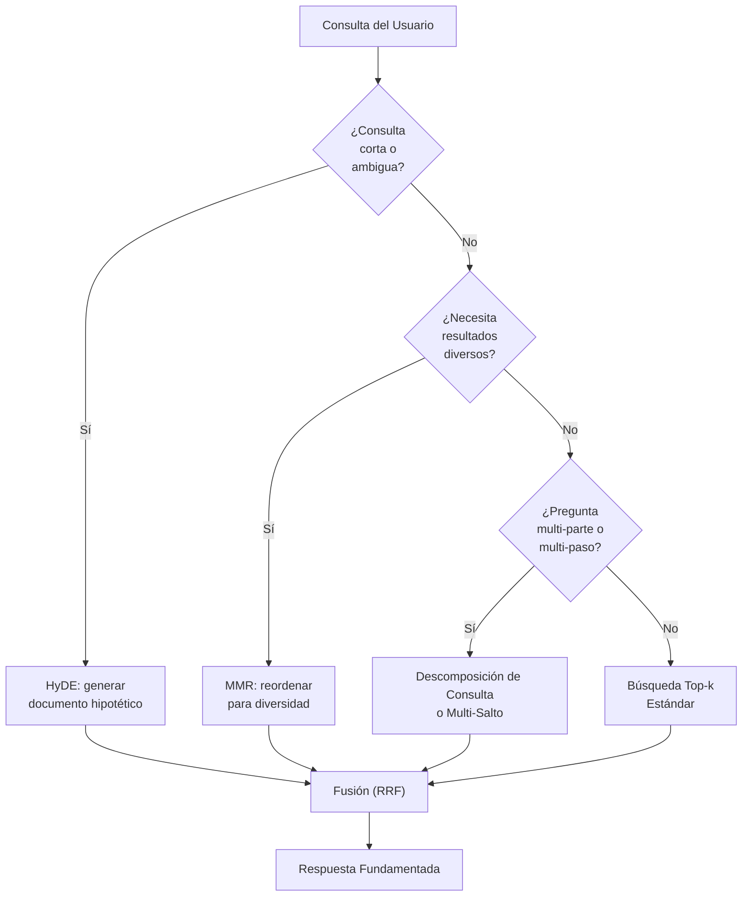
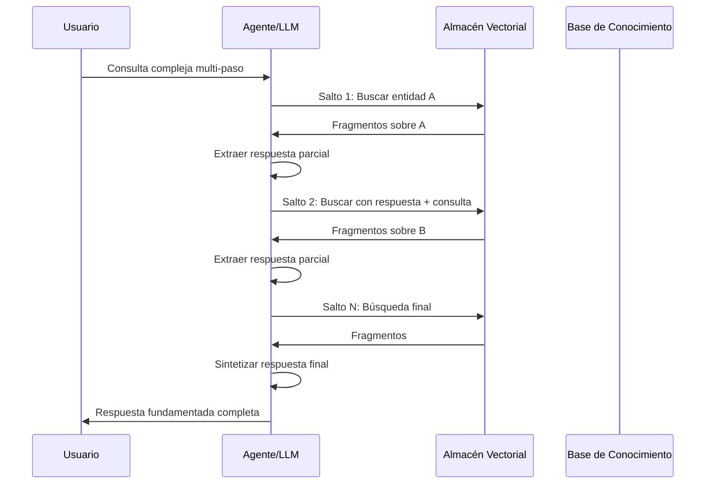

# Estrategias Avanzadas de Recuperación

La recuperación simple top-k con similitud por coseno funciona en muchos casos, pero los sistemas de producción exigen más: mejor relevancia, diversidad, razonamiento en múltiples pasos y la capacidad de manejar consultas complejas. Esta lección cubre las estrategias de recuperación avanzadas más efectivas.

---

## HyDE (Embeddings de Documentos Hipotéticos)

HyDE mejora la recuperación generando primero un documento hipotético que responde a la consulta y luego usando el embedding de ese documento para la búsqueda. La idea: el embedding de una respuesta completa está más cerca de documentos relevantes que el embedding de una consulta corta.

```python
from openai import OpenAI
import chromadb

client = OpenAI()
chroma_client = chromadb.Client()
collection = chroma_client.get_collection("docs")

def hyde_search(query: str, k: int = 3) -> list[str]:
    # Step 1: Generate a hypothetical document
    # The LLM writes what a perfect answer would look like
    hypo_doc = client.chat.completions.create(
        model="gpt-4o-mini",
        messages=[
            {"role": "system",
             "content": "Write a detailed paragraph that answers the user's "
                        "question as if it were a section from a textbook."},
            {"role": "user", "content": query},
        ],
    ).choices[0].message.content

    # Step 2: Embed the hypothetical document (not the query!)
    hypo_emb = client.embeddings.create(
        input=hypo_doc,
        model="text-embedding-3-small",
    ).data[0].embedding

    # Step 3: Search with the hypothetical embedding
    results = collection.query(
        query_embeddings=[hypo_emb],
        n_results=k,
    )

    return results["documents"][0]

# The hypothetical doc bridges the lexical gap between short query and stored passages
```

[!WARNING]
HyDE añade una llamada LLM por consulta, aumentando la latencia y el coste. Es mejor usarlo cuando la calidad de la consulta es crítica y las consultas son cortas o ambiguas. Almacena en caché documentos hipotéticos para consultas repetidas.

---

## MMR (Relevancia Marginal Máxima)

La recuperación top-k estándar puede devolver resultados casi duplicados. MMR intercambia relevancia pura por diversidad, reordenando resultados para minimizar la redundancia.

```python
import numpy as np
from sklearn.metrics.pairwise import cosine_similarity

def mmr_rerank(
    query_emb: list[float],
    doc_embeddings: list[list[float]],
    docs: list[str],
    k: int = 3,
    lambda_param: float = 0.7,
) -> list[str]:
    """
    MMR: balance relevance (query similarity) and diversity
    (dissimilarity to already-selected docs).

    Score = λ * sim(query, doc) - (1-λ) * max_{selected} sim(doc, selected)
    """
    n = len(docs)
    query_emb = np.array(query_emb).reshape(1, -1)
    doc_embs = np.array(doc_embeddings)

    # Precompute all-pair cosine similarities
    doc_sim_to_query = cosine_similarity(query_emb, doc_embs).flatten()
    doc_sim_matrix = cosine_similarity(doc_embs)

    selected = []
    candidates = list(range(n))

    for _ in range(min(k, n)):
        if not candidates:
            break

        # Score each candidate
        best_score = -1
        best_idx = -1
        for i in candidates:
            # Relevance to query
            relevance = doc_sim_to_query[i]

            # Diversity penalty: max similarity to already-selected docs
            if selected:
                diversity = max(doc_sim_matrix[i][s] for s in selected)
            else:
                diversity = 0

            score = lambda_param * relevance - (1 - lambda_param) * diversity

            if score > best_score:
                best_score = score
                best_idx = i

        selected.append(best_idx)
        candidates.remove(best_idx)

    return [docs[i] for i in selected]

# Usage
# results = mmr_rerank(query_emb, doc_embs, raw_docs, k=5, lambda_param=0.7)
```

| Parámetro | Efecto |
| :--- | :--- |
| λ = 1.0 | Relevancia pura (top-k estándar) |
| λ = 0.0 | Diversidad pura |
| λ = 0.5–0.8 | Equilibrado (recomendado) |

[!TIP]
MMR es ideal para tareas de resumen donde quieres cubrir múltiples aspectos de un tema sin repetir la misma información. Usa λ = 0.7 para una ligera preferencia por relevancia, o λ = 0.5 para equilibrio igual. Reduce λ cuando la redundancia es más dañina que perder un resultado ligeramente relevante.

---

## Flujo de Decisión de Estrategia de Recuperación



---

## Recuperación Multi-Salto

Algunas preguntas requieren encadenamiento entre documentos. La recuperación multi-salto responde una subpregunta a la vez, usando cada respuesta para informar la siguiente.

```
Query: "What is the capital of the country where the Eiffel Tower is?"
    |
    v
Hop 1: "Where is the Eiffel Tower?" → "Paris, France"
    |
    v
Hop 2: "What is the capital of France?" → "Paris"
```

```python
def multi_hop_search(query: str, max_hops: int = 3) -> str:
    context = ""
    for hop in range(max_hops):
        # Search with accumulated context
        augmented_query = f"{context}\n\n{query}" if context else query
        results = collection.query(query_texts=[augmented_query], n_results=2)

        # Extract answer from retrieved chunks
        chunk_text = "\n".join(results["documents"][0])

        # Ask LLM to extract a concise answer
        answer = client.chat.completions.create(
            model="gpt-4o-mini",
            messages=[
                {"role": "system",
                 "content": "Answer concisely based on the context."},
                {"role": "user",
                 "content": f"Context: {chunk_text}\nQuestion: {query}"},
            ],
        ).choices[0].message.content

        # Check if answer is complete
        if is_sufficient(answer):  # heuristic: contains a concrete answer
            return answer

        # Otherwise, use this answer to refine next hop
        context = f"Previously found: {answer}"

    return "Could not resolve query in available hops."
```

### Secuencia de Recuperación Multi-Salto



[!WARNING]
La recuperación multi-salto multiplica la latencia por el número de saltos (cada salto requiere una búsqueda vectorial + una llamada LLM). Establece un límite máximo de saltos (3 es típico) e implementa detención temprana cuando se encuentra una respuesta autónoma. Presupuesta N× el costo de una consulta RAG estándar.

---

## Descomposición de Consultas

Divide una consulta compleja en subconsultas más simples, recupera para cada una y luego fusiona los resultados.

```python
def decompose_query(query: str) -> list[str]:
    """Use LLM to split a complex query into sub-queries."""
    response = client.chat.completions.create(
        model="gpt-4o-mini",
        messages=[
            {"role": "system",
             "content": "Break the user's question into 2-4 simple "
                        "sub-questions. Return one per line."},
            {"role": "user", "content": query},
        ],
    )
    sub_queries = response.choices[0].message.content.strip().split("\n")
    return [q.strip("- ").strip() for q in sub_queries if q.strip()]

def decomposed_search(query: str) -> str:
    sub_queries = decompose_query(query)
    all_chunks = []

    for sq in sub_queries:
        results = collection.query(query_texts=[sq], n_results=2)
        all_chunks.extend(results["documents"][0])

    # Remove duplicates and merge
    seen = set()
    unique_chunks = []
    for c in all_chunks:
        if c not in seen:
            seen.add(c)
            unique_chunks.append(c)

    return "\n\n".join(unique_chunks)
```

[!TIP]
La descomposición de consultas es excelente para preguntas del tipo "compara y contrasta" o "lista todos". Por ejemplo, "Compara las políticas de devolución de los planes Pro y Enterprise" se convierte en: (1) "¿Cuál es la política de devolución del plan Pro?", (2) "¿Cuál es la política de devolución del plan Enterprise?". Cada subconsulta recupera exactamente los fragmentos relevantes.

---

## Recuperadores Auto-Consultantes

Un recuperador auto-consultante usa el LLM para extraer una consulta de búsqueda *y* filtros de metadatos a partir de una pregunta en lenguaje natural.

```python
from langchain.retrievers.self_query.base import SelfQueryRetriever
from langchain.chains.query_constructor.base import AttributeInfo

# Describe the metadata fields available
metadata_field_info = [
    AttributeInfo(
        name="year",
        description="The year the document was published",
        type="int",
    ),
    AttributeInfo(
        name="department",
        description="The company department this applies to",
        type="string",
    ),
    AttributeInfo(
        name="doc_type",
        description="Type of document (policy, guide, report)",
        type="string",
    ),
]

# Create self-querying retriever
retriever = SelfQueryRetriever.from_llm(
    llm=llm,
    vectorstore=vectorstore,
    document_contents="Company policies and procedures",
    metadata_field_info=metadata_field_info,
)

# User asks: "What is the vacation policy from 2024?"
# Retriever automatically extracts:
#   query = "vacation policy"
#   filter = year == 2024

# result = retriever.get_relevant_documents(
#     "What is the vacation policy from 2024?"
# )
```

---

## Fusión de Recuperación (RRF)

Combina resultados de múltiples estrategias de recuperación usando Fusión por Ranking Recíproco para obtener lo mejor de todos los mundos.

```python
def reciprocal_rank_fusion(
    result_lists: list[list[str]],
    k: int = 60,
) -> list[str]:
    """
    Fuse multiple ranked lists using RRF.

    score(d) = sum_{r in retrievers} 1 / (k + rank_r(d))
    """
    scores = {}
    for results in result_lists:
        for rank, doc in enumerate(results, start=1):
            if doc not in scores:
                scores[doc] = 0
            scores[doc] += 1 / (k + rank)

    # Sort by descending RRF score
    ranked = sorted(scores.items(), key=lambda x: -x[1])
    return [doc for doc, _ in ranked]

# Fuse results from multiple strategies
bm25_results = bm25_retrieve(query)        # keyword-based
vector_results = vector_retrieve(query)    # semantic
hyde_results = hyde_search(query)          # HyDE-based

fused = reciprocal_rank_fusion(
    [bm25_results, vector_results, hyde_results]
)
# Output: a single ranked list combining all signals
```

---

## Tabla Comparativa: Estrategias de Recuperación

| Estrategia | Latencia | Diversidad | Relevancia | Cuándo Usar |
| :--- | :--- | :--- | :--- | :--- |
| Top-k (coseno) | Baja | Baja | Alta | Q&A simple, prototipado |
| HyDE | Alta (llamada LLM) | Media | Muy Alta | Consultas cortas/ambiguas |
| MMR | Media (reorden.) | Alta | Alta | Resumir, evitar redundancia |
| Multi-salto | Muy Alta (N rondas) | Alta | Muy Alta | Cadenas razonamiento complejas |
| Descomposición | Alta (subconsultas) | Alta | Alta | Preguntas multi-parte |
| Auto-consulta | Media | Media | Alta | Búsqueda semántica + filtrada |
| Fusión (RRF) | Media | Alta | Alta | Combinar múltiples recuperadores |

---

## Cuándo Usar Cada Estrategia

| Escenario | Estrategia Recomendada | Porqué |
| :--- | :--- | :--- |
| "¿Cuál es la política de devolución?" | Top-k estándar | Consulta simple de hecho único |
| "Explica computación cuántica" | HyDE | Consulta corta, concepto amplio |
| "Eventos clave de 2023 en IA" | MMR | Resultados diversos necesarios |
| "¿Quién fundó la Empresa X y dónde está su sede?" | Descomposición | Dos subpreguntas distintas |
| "¿Qué causó la crisis financiera de 2008?" | Multi-salto | Requiere razonamiento encadenado |
| "Políticas de RRHH después de 2023" | Auto-consulta | Búsqueda semántica + filtro de metadatos |
| Cualquier consulta crítica | Fusión (RRF) | Combina fortalezas de todos los métodos |

---

## 6 Preguntas de Práctica

```question
{
  "id": "am-05-es-q1",
  "type": "multiple-choice",
  "question": "¿Cuál es la idea central de HyDE?",
  "options": [
    "Incrustar la consulta directamente",
    "Generar una respuesta hipotética e incrustarla",
    "Usar múltiples embeddings por documento",
    "Saltar el paso de incrustación por completo"
  ],
  "correct": 1,
  "explanation": "HyDE genera un documento hipotético que responde a la consulta, luego usa el embedding de ese documento para la búsqueda. El embedding de una respuesta completa está más cerca de documentos relevantes que el embedding de una consulta corta."
}
```

```question
{
  "id": "am-05-es-q2",
  "type": "multiple-choice",
  "question": "¿Qué problema resuelve MMR?",
  "options": [
    "Baja velocidad de recuperación",
    "Resultados redundantes / casi duplicados",
    "Filtrado de metadatos",
    "Soporte multi-idioma"
  ],
  "correct": 1,
  "explanation": "MMR intercambia relevancia pura por diversidad, reordenando resultados para minimizar redundancia, evitando que resultados casi duplicados dominen la lista top-k."
}
```

```question
{
  "id": "am-05-es-q3",
  "type": "multiple-choice",
  "question": "La recuperación multi-salto es necesaria cuando:",
  "options": [
    "La consulta es muy corta",
    "Responder requiere encadenar entre múltiples documentos",
    "Los resultados necesitan diversidad",
    "La BD vectorial está vacía"
  ],
  "correct": 1,
  "explanation": "La recuperación multi-salto responde una subpregunta a la vez, usando cada respuesta para informar la siguiente búsqueda. Esto es necesario cuando el razonamiento debe encadenarse entre documentos."
}
```

```question
{
  "id": "am-05-es-q4",
  "type": "multiple-choice",
  "question": "¿Qué extrae un recuperador auto-consultante de una pregunta del usuario?",
  "options": [
    "Solo la consulta de búsqueda",
    "Tanto una consulta de búsqueda como filtros de metadatos",
    "Solo filtros de metadatos",
    "La identidad del usuario"
  ],
  "correct": 1,
  "explanation": "Un recuperador auto-consultante usa el LLM para extraer tanto una consulta de búsqueda semántica como filtros de metadatos del lenguaje natural."
}
```

```question
{
  "id": "am-05-es-q5",
  "type": "multiple-choice",
  "question": "La Fusión por Ranking Recíproco (RRF) se usa para:",
  "options": [
    "Reordenar resultados usando un LLM",
    "Combinar resultados de múltiples estrategias de recuperación",
    "Reducir el número de resultados",
    "Incrustar documentos más rápido"
  ],
  "correct": 1,
  "explanation": "RRF combina listas clasificadas de múltiples estrategias de recuperación (ej: BM25, vectorial, HyDE) en una sola lista clasificada usando puntuación de clasificación recíproca."
}
```

```question
{
  "id": "am-05-es-q6",
  "type": "multiple-choice",
  "question": "Un usuario pregunta: \"¿Cuál es el plazo de entrega y la política de devolución del plan Pro?\" ¿Qué estrategia avanzada es más apropiada?",
  "options": [
    "Recuperación top-k estándar",
    "Descomposición de consultas (dividir en dos subconsultas)",
    "HyDE con generación de documento hipotético",
    "MMR para diversidad"
  ],
  "correct": 1,
  "explanation": "La pregunta tiene dos subpreguntas distintas (plazo de entrega Y política de devolución). La descomposición de consultas las divide en búsquedas separadas, cada una recuperando los fragmentos más relevantes."
}
```

---

[!SUCCESS]
### Conclusiones Clave

- HyDE genera un documento hipotético para llenar el vacío léxico entre consultas cortas y pasajes almacenados.
- MMR optimiza tanto relevancia como diversidad, previniendo resultados redundantes.
- La recuperación multi-salto encadena entre documentos, respondiendo subpreguntas iterativamente.
- La descomposición de consultas divide preguntas complejas en subconsultas simples y fusiona resultados.
- Los recuperadores auto-consultantes extraen tanto la consulta semántica como filtros de metadatos del lenguaje natural.
- La fusión de recuperación (RRF) combina rankings de múltiples estrategias (BM25, vectorial, HyDE) en una sola lista.
- Las estrategias avanzadas intercambian latencia y coste por mayor relevancia y diversidad — elige según tu caso de uso.
- La descomposición es ideal para preguntas multi-parte; multi-salto es para razonamiento encadenado; HyDE es para consultas cortas/ambiguas.
- Siempre considera un enfoque de fusión en producción para obtener lo mejor de múltiples estrategias.
