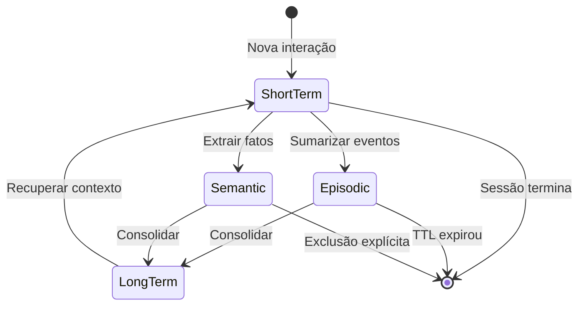
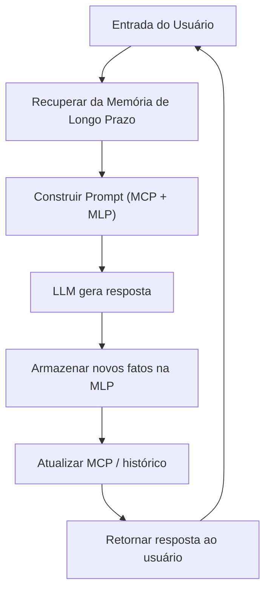
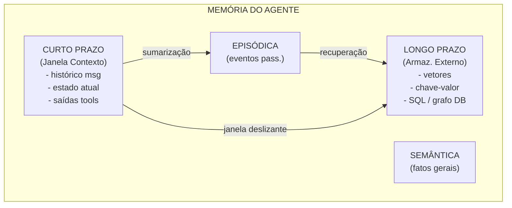

# Fundamentos da Memória de Agentes

A memória é o que separa um chatbot sem estado de um agente verdadeiramente inteligente. Sem memória, cada interação começa do zero — o agente não consegue aprender, personalizar ou manter contexto entre turnos.

---

## Por Que Agentes Precisam de Memória

LLMs modernos são sem estado por natureza: processam uma única janela de contexto e esquecem tudo após gerar a resposta. Agentes, no entanto, operam em múltiplas etapas — eles chamam ferramentas, revisitam conclusões anteriores e interagem com usuários em longas sessões.

A memória possibilita:

- **Continuidade** — o agente lembra o que foi dito antes
- **Personalização** — preferências do usuário persistem entre sessões
- **Aprendizado** — fatos extraídos de uma interação informam as seguintes
- **Coerência** — cadeias de raciocínio em várias etapas se mantêm consistentes

[!WARNING]
Sem memória explícita, um agente não consegue distinguir entre "conte-me sobre meu último pedido" e "conte-me sobre suas capacidades". A janela de contexto sozinha é insuficiente para conhecimento persistente.

---

## Memória de Curto Prazo vs Longo Prazo

Agentes, como humanos, usam múltiplos sistemas de memória que operam em diferentes escalas de tempo.

| Característica | Curto Prazo | Longo Prazo |
| :--- | :--- | :--- |
| Duração | Dentro de uma conversa | Entre sessões / persistente |
| Armazenamento | Em memória (janela de contexto) | Armazenamento externo (BD, vetores) |
| Capacidade | Limitada (limite de tokens do LLM) | Virtualmente ilimitada |
| Recuperação | Direta (contexto completo) | Baseada em consulta / similaridade |
| Esquecimento | Automático (estouro de contexto) | Exclusão explícita ou TTL |
| Uso | Histórico imediato da conversa | Perfil do usuário, fatos aprendidos |

[!NOTE]
A memória de curto prazo em agentes é análoga à memória de trabalho humana — ela mantém informações temporariamente enquanto o agente processa a tarefa atual. A diferença principal é que a MCP do agente é limitada por tokens, não por capacidade cognitiva.

---

## Memória Episódica vs Semântica

Outra distinção importante vem da ciência cognitiva:

- **Memória episódica** — armazena eventos específicos ou interações passadas ("o usuário perguntou sobre preços na terça")
- **Memória semântica** — armazena conhecimento factual geral ("o preço é R$10/mês para o plano pro")

A memória episódica ajuda o agente a lembrar o que aconteceu. A memória semântica ajuda o agente a saber o que é verdade.

[!TIP]
Ao projetar um agente, use memória episódica para depuração e trilhas de auditoria (o que aconteceu quando), e memória semântica para perfis de usuário e bases de conhecimento (o que é verdade). Ambas são tipicamente armazenadas no mesmo banco vetorial, mas marcadas com metadados diferentes.

### Diagrama de Estado dos Tipos de Memória



### Tabela Comparativa: Todos os Tipos de Memória

| Tipo de Memória | Escopo | Persistência | Método de Recuperação | Exemplo |
| :--- | :--- | :--- | :--- | :--- |
| Curto Prazo | Uma sessão | Efêmera | Direta (no contexto) | Últimas 10 mensagens |
| Longo Prazo | Entre sessões | Persistente | Consulta / busca por similaridade | Cor favorita do usuário |
| Episódica | Eventos específicos | Durável | Recordação baseada em tempo | "Usuário clicou em comprar às 14h" |
| Semântica | Fatos gerais | Durável | Busca semântica | "Taxa de imposto é 8,5%" |
| Operacional | Tarefa atual | Volátil | Variáveis em memória | "Passo 3 de 5 no checkout" |

---

## Memória em Loops de Conversação

Um loop típico de agente com memória:



O ciclo ingere a entrada do usuário, aumenta com memórias recuperadas, gera resposta e persiste novas informações.

[!IMPORTANT]
A ordem das operações importa: a recuperação acontece *antes* da geração, não depois. Se você recuperar fatos após gerar uma resposta, o agente alucinará ou dará respostas inconsistentes. Sempre recupere o contexto primeiro, depois gere.

---

## Memória Operacional em Agentes

A memória operacional é o rascunho do agente — o espaço temporário onde etapas intermediárias de raciocínio, saídas de ferramentas e resultados parciais vivem durante um único turno.

```python
class AgentWorkingMemory:
    """A simple working memory for tracking current task state."""

    def __init__(self):
        self.steps = []
        self.tool_outputs = {}
        self.current_goal = None

    def add_step(self, step: str, result: str):
        self.steps.append({"step": step, "result": result})

    def store_tool_output(self, tool_name: str, output: str):
        self.tool_outputs[tool_name] = output

    def get_context(self) -> str:
        lines = [f"Goal: {self.current_goal}"]
        for s in self.steps:
            lines.append(f"  {s['step']}: {s['result']}")
        return "\n".join(lines)

# Usage
wm = AgentWorkingMemory()
wm.current_goal = "Look up order history"
wm.add_step("search_orders", "Found 3 recent orders")
wm.add_step("format_response", "Prepared summary")
print(wm.get_context())
```

A memória operacional não é persistida — é limpa entre turnos ou quando a tarefa é concluída.

---

## Esquecimento e Janelas de Contexto

Todo LLM tem uma janela de contexto fixa (4K, 8K, 32K, 128K tokens). Quando a conversa excede esse limite, o agente deve decidir o que esquecer.

Estratégias:

- **Janela deslizante** — manter as últimas N mensagens, descartar as mais antigas
- **Sumarização** — condensar conversas anteriores em um resumo
- **Retenção seletiva** — manter fatos importantes, descartar preenchimento
- **Híbrido** — manter um resumo + mensagens recentes + fatos recuperados

```python
from collections import deque

class SlidingWindowMemory:
    """Keep only the last N messages in context."""

    def __init__(self, max_messages: int = 10):
        self.messages = deque(maxlen=max_messages)

    def add_message(self, role: str, content: str):
        self.messages.append({"role": role, "content": content})

    def get_context(self) -> list[dict]:
        return list(self.messages)

# Example: sliding window keeps 5 most recent exchanges
sw = SlidingWindowMemory(max_messages=5)
sw.add_message("user", "Hello")
sw.add_message("assistant", "Hi! How can I help?")
sw.add_message("user", "What's the weather?")
sw.add_message("assistant", "It's sunny.")
sw.add_message("user", "Tell me about AI")
sw.add_message("assistant", "AI stands for...")
print(len(sw.get_context()))  # Output: 5 (oldest "Hello" was dropped)
```

[!WARNING]
Escolher o que esquecer é tão importante quanto escolher o que lembrar. Uma estratégia ruim de esquecimento faz o agente perder contexto crítico ou estourar o orçamento de tokens.

[!TIP]
Para sistemas de produção, use uma abordagem híbrida: mantenha um resumo contínuo de toda a conversa, mais as últimas N mensagens brutas, mais quaisquer fatos de entidades recuperados da memória de longo prazo. Isso oferece tanto precisão quanto revocação.

---

## Pipeline de Consolidação de Memória

A consolidação de memória move informações do armazenamento de curto prazo para o de longo prazo. Aqui está um sistema básico de consolidação:

```python
import json
import time
from typing import Any

class MemoryConsolidator:
    """Consolidates short-term memories into long-term storage."""

    def __init__(self, ttl_seconds: int = 3600):
        self.short_term: list[dict] = []
        self.long_term: dict[str, Any] = {}
        self.ttl = ttl_seconds

    def observe(self, event: str, data: dict):
        """Record a short-term memory."""
        self.short_term.append({
            "event": event,
            "data": data,
            "timestamp": time.time(),
        })

    def consolidate(self):
        """Move memories from short-term to long-term."""
        now = time.time()
        still_fresh = []

        for mem in self.short_term:
            age = now - mem["timestamp"]
            if age < self.ttl:
                still_fresh.append(mem)
            else:
                key = mem["event"]
                if key not in self.long_term:
                    self.long_term[key] = []
                self.long_term[key].append(mem["data"])

        self.short_term = still_fresh

    def recall(self, event: str) -> list[dict]:
        """Retrieve consolidated memories for an event."""
        return self.long_term.get(event, [])

# Usage
mc = MemoryConsolidator(ttl_seconds=10)
mc.observe("user_login", {"user_id": 42, "time": "2025-01-15"})
mc.observe("page_view", {"page": "/pricing", "duration_ms": 3000})
time.sleep(1)
mc.consolidate()
print(mc.recall("user_login"))
```

---

## Diagrama Mermaid da Arquitetura de Memória do Agente



---

## Janela de Contexto vs. Memória — Distinção Fundamental

[!IMPORTANT]
A janela de contexto NÃO é memória — é armazenamento temporário que é sobrescrito a cada turno. Memória verdadeira requer escrita e leitura de uma camada de persistência externa. Nunca confunda a janela de contexto com memória de longo prazo.

| Aspecto | Janela de Contexto | Sistema de Memória |
| :--- | :--- | :--- |
| Vida útil | Requisição única | Persistente entre sessões |
| Capacidade | Fixa (4K-128K tokens) | Virtualmente ilimitada |
| Recuperação | Automática (todo conteúdo) | Seletiva (baseada em consulta) |
| Custo | Incluído na inferência | Armazenamento + recuperação adicionais |
| Persistência | Volátil | Durável (BD, arquivo, vetores) |

---

## 7 Perguntas de Prática

```question
{
  "id": "am-01-pt-q1",
  "type": "multiple-choice",
  "question": "Por que LLMs são considerados sem estado?",
  "options": [
    "Não conseguem gerar texto",
    "Processam cada entrada independentemente",
    "Só entendem um idioma",
    "Não usam janelas de contexto"
  ],
  "correct": 1,
  "explanation": "LLMs são sem estado porque processam cada entrada independentemente — não têm mecanismo interno para carregar contexto ou memória entre interações."
}
```

```question
{
  "id": "am-01-pt-q2",
  "type": "multiple-choice",
  "question": "Qual tipo de memória é melhor para armazenar \"o nome do usuário\"?",
  "options": [
    "Episódica",
    "Semântica",
    "Curto Prazo",
    "Operacional"
  ],
  "correct": 1,
  "explanation": "A memória semântica armazena conhecimento factual geral, como o nome de um usuário, sendo a melhor escolha para este tipo de informação persistente."
}
```

```question
{
  "id": "am-01-pt-q3",
  "type": "multiple-choice",
  "question": "O que acontece quando uma conversa excede a janela de contexto?",
  "options": [
    "O LLM falha",
    "Mensagens antigas são descartadas ou comprimidas",
    "A janela de contexto se expande automaticamente",
    "A sessão é encerrada"
  ],
  "correct": 1,
  "explanation": "Quando a janela de contexto é excedida, mensagens antigas são descartadas ou comprimidas para permanecer dentro do limite de tokens."
}
```

```question
{
  "id": "am-01-pt-q4",
  "type": "multiple-choice",
  "question": "Qual estratégia mantém as mensagens mais recentes e descarta as antigas?",
  "options": [
    "Sumarização",
    "Retenção seletiva",
    "Janela deslizante",
    "Híbrido"
  ],
  "correct": 2,
  "explanation": "Uma janela deslizante mantém as últimas N mensagens e descarta as mais antigas à medida que novas mensagens chegam."
}
```

```question
{
  "id": "am-01-pt-q5",
  "type": "multiple-choice",
  "question": "A memória episódica difere da semântica porque a episódica:",
  "options": [
    "Armazena fatos gerais",
    "Armazena eventos passados específicos",
    "É sempre persistente",
    "Nunca precisa de recuperação"
  ],
  "correct": 1,
  "explanation": "A memória episódica armazena eventos e experiências passadas específicas, enquanto a memória semântica armazena conhecimento factual geral."
}
```

```question
{
  "id": "am-01-pt-q6",
  "type": "multiple-choice",
  "question": "Um agente pergunta \"Qual é a capital da França?\" e a memória retorna \"Paris.\" Este é um exemplo de qual tipo de memória?",
  "options": [
    "Memória episódica",
    "Memória semântica",
    "Memória operacional",
    "Memória procedural"
  ],
  "correct": 1,
  "explanation": "O fato de que Paris é a capital da França é conhecimento geral, armazenado na memória semântica."
}
```

```question
{
  "id": "am-01-pt-q7",
  "type": "multiple-choice",
  "question": "Em um pipeline de consolidação de memória, o que aciona a movimentação do curto prazo para o longo prazo?",
  "options": [
    "Cada mensagem do usuário",
    "Expiração baseada em tempo ou evento explícito de consolidação",
    "Apenas quando o agente é desligado",
    "Nunca — a memória de curto prazo nunca vai para o longo prazo"
  ],
  "correct": 1,
  "explanation": "A consolidação é acionada por TTL baseado em tempo ou eventos explícitos como fim de sessão ou atingir um limite de tokens."
}
```

---

[!SUCCESS]
### Principais Conclusões

- Agentes precisam de memória para manter continuidade, personalização, aprendizado e coerência.
- A memória de curto prazo vive na janela de contexto; a de longo prazo requer armazenamento externo.
- A memória episódica registra eventos específicos; a semântica armazena conhecimento factual geral.
- A memória operacional é o rascunho do agente para estado da tarefa atual e não é persistida.
- A memória é integrada em um loop: recuperar, aumentar, gerar, persistir.
- Janelas de contexto impõem um limite rígido; estratégias de esquecimento gerenciam o excesso.
- A arquitetura combina armazenamentos de curto prazo, longo prazo, episódico e semântico.
- Escolher o que esquecer é tão crítico quanto escolher o que lembrar.
- A consolidação de memória move dados do curto prazo para o longo prazo baseada em TTL ou gatilhos explícitos.
