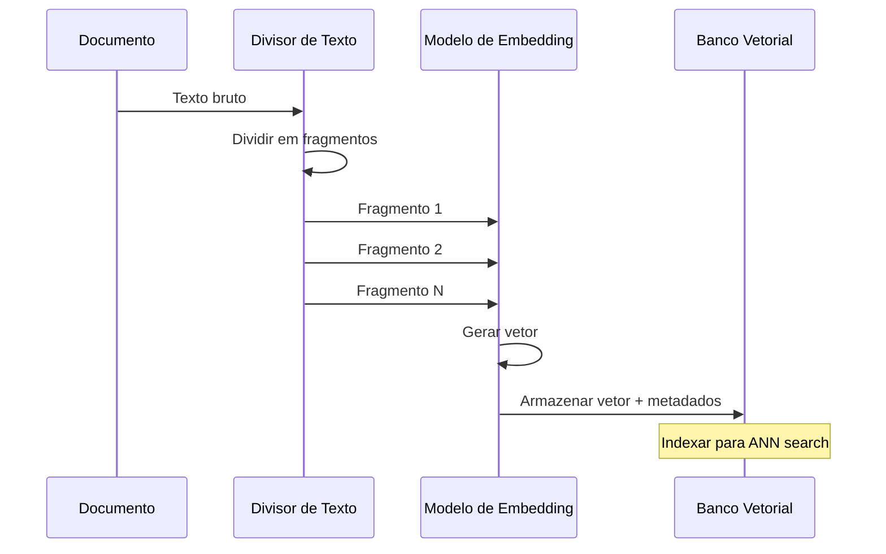

# Vetores, Embeddings e Arquitetura RAG

A Geração Aumentada por Recuperação (RAG) é o padrão dominante para fundamentar respostas de LLMs em conhecimento externo. Seu núcleo são os **embeddings** — representações numéricas de significado — e os **bancos de dados vetoriais** que os indexam e pesquisam.

---

## O Que São Embeddings?

Um embedding é um vetor denso (lista de floats) que captura o significado semântico de um texto. Textos com significados semelhantes se agrupam no espaço vetorial.

```
"The cat sat on the mat"
        |
        v
[0.023, -0.145, 0.312, ..., 0.078]   ← vetor de 384 dimensões
        |
        v
"A dog slept on the rug"
        |
        v
[0.019, -0.138, 0.305, ..., 0.081]   ← próximo no espaço vetorial
```

Modelos de embedding (ex: `text-embedding-3-small`, `all-MiniLM-L6-v2`) mapeiam texto para um vetor de tamanho fixo independentemente do tamanho da entrada.

[!NOTE]
Modelos de embedding têm um limite máximo de tokens de entrada (tipicamente 512 tokens para modelos open-source, 8192 para `text-embedding-3-large` da OpenAI). Documentos mais longos que este limite devem ser divididos em fragmentos antes da incorporação — esta é a razão pela qual a fragmentação é uma parte crítica de qualquer pipeline RAG.

### Modelos de Embedding Comuns

| Modelo | Dimensões | Máx Tokens | Custo | Melhor Para |
| :--- | :--- | :--- | :--- | :--- |
| `text-embedding-3-small` | 512-1536 | 8192 | $0.02/1K tokens | Uso geral, sensível a custo |
| `text-embedding-3-large` | 256-3072 | 8192 | $0.13/1K tokens | Necessidades de alta precisão |
| `all-MiniLM-L6-v2` | 384 | 512 | Grátis (local) | Local/offline, prototipagem |
| `intfloat/e5-large-v2` | 1024 | 512 | Grátis (local) | Open-source de alta qualidade |
| `BAAI/bge-large-en-v1.5` | 1024 | 512 | Grátis (local) | Tarefas de recuperação em inglês |

---

## Similaridade por Cosseno

A forma mais comum de comparar dois embeddings é a **similaridade por cosseno**:

```
similaridade_cosseno(A, B) = (A · B) / (||A|| * ||B||)
```

- Varia de -1 (significado oposto) a 1 (significado idêntico)
- Valores acima de 0,8 geralmente indicam forte similaridade semântica
- Usada por bancos de dados vetoriais para classificar resultados

[!WARNING]
A similaridade por cosseno assume que todas as dimensões têm o mesmo peso. Se o modelo de embedding for tendencioso ou mal treinado, as pontuações podem não refletir a relevância semântica real. Sempre avalie a qualidade da recuperação no seu domínio específico.

### Comparação de Métricas de Distância

| Métrica | Intervalo | Caso de Uso | Velocidade |
| :--- | :--- | :--- | :--- |
| Similaridade por cosseno | [-1, 1] | Busca semântica de texto | Rápida |
| Euclidiana (L2) | [0, ∞) | Embeddings de imagem, clustering | Rápida |
| Produto escalar | (-∞, ∞) | Vetores normalizados, eficiência | Muito rápida |
| Manhattan (L1) | [0, ∞) | Vetores esparsos | Moderada |
| Hamming | [0, dim] | Embeddings binários | Muito rápida |

---

## Pipeline de Geração de Embeddings

O processo de embedding transforma texto bruto em vetores pesquisáveis:



---

## Fragmentação de Documentos

Documentos brutos devem ser divididos em fragmentos antes da incorporação. A estratégia de fragmentação impacta diretamente a qualidade da recuperação.

```python
from langchain.text_splitter import RecursiveCharacterTextSplitter

# Load a document
with open("report.md", "r") as f:
    text = f.read()

# Create a recursive text splitter
splitter = RecursiveCharacterTextSplitter(
    chunk_size=500,        # target characters per chunk
    chunk_overlap=50,      # overlap between chunks
    separators=["\n\n", "\n", ".", " "],  # priority order
    length_function=len,
)

chunks = splitter.split_text(text)
print(f"Split into {len(chunks)} chunks")
# Output: Split into 23 chunks
```

A sobreposição garante que frases ou ideias divididas entre fragmentos não sejam perdidas.

### Comparação de Estratégias de Fragmentação

| Estratégia | Unidade | Preserva Estrutura | Sobreposição | Melhor Para |
| :--- | :--- | :--- | :--- | :--- |
| RecursiveCharacter | Caracteres (por separador) | Moderada | Sim | Texto geral, maioria dos casos |
| Token | Tokens (consciente do modelo) | Baixa | Sim | Fragmentos alinhados ao LLM |
| MarkdownHeader | Cabeçalhos Markdown | Alta | Não | Documentação, wikis |
| RecursiveJson | Chaves JSON | Alta | Não | Dados JSON estruturados |
| HTMLHeader | Tags HTML (h1, h2, etc.) | Alta | Não | Páginas web, docs HTML |
| Semântica | Limites de sentença | Alta | Não | Preservação de passagens coerentes |

```python
from langchain.text_splitter import (
    TokenTextSplitter,
    MarkdownHeaderTextSplitter,
)

# Token-aware splitting (matches LLM tokenizers)
token_splitter = TokenTextSplitter(
    chunk_size=256,      # tokens, not characters
    chunk_overlap=50,
)

# Markdown-aware splitting (preserves header structure)
headers_to_split_on = [
    ("#", "Header 1"),
    ("##", "Header 2"),
]
markdown_splitter = MarkdownHeaderTextSplitter(
    headers_to_split_on=headers_to_split_on,
)

# Semantic chunking using sentence boundaries
from langchain.text_splitter import SentenceTransformersTokenTextSplitter

semantic_splitter = SentenceTransformersTokenTextSplitter(
    chunk_size=256,
    chunk_overlap=0,
    model_name="sentence-transformers/all-mpnet-base-v2",
)
```

---

## Bancos de Dados Vetoriais

Bancos de dados vetoriais são especializados em armazenar vetores de embedding e realizar buscas rápidas por vizinhos mais próximos.

| Característica | Chroma | Pinecone | Qdrant | Weaviate |
| :--- | :--- | :--- | :--- | :--- |
| Implantação | Local / embutido | Nuvem / serverless | Auto-hospedado / nuvem | Auto-hospedado / nuvem |
| Código Aberto | Sim | Não | Sim | Sim (desde 2024) |
| Filtragem | Filtros de metadados | Namespace + metadados | Filtros de payload | GraphQL + metadados |
| Métricas de distância | Cosseno, L2, IP | Cosseno, L2, IP | Cosseno, L2, IP, Dot | Cosseno, L2, IP, Dot |
| Nível gratuito | Ilimitado local | 1 índice, limitado | 1GB cluster grátis | 1GB grátis (sandbox) |
| Suporte LangChain | Nativo | Nativo | Nativo | Nativo |
| Escalabilidade | Nó único | Auto-scaling | Sharding horizontal | Sharding horizontal |

[!TIP]
Para prototipagem e desenvolvimento local, Chroma é a melhor escolha — executa embutido com zero infraestrutura. Para produção em escala, Pinecone ou Qdrant oferecem auto-scaling gerenciado. Qdrant é preferido se você precisa de auto-hospedagem.

---

## Pipeline de Indexação

Um pipeline de indexação de produção transforma documentos brutos em um índice vetorial pesquisável:

```
Documentos Brutos (PDF, HTML, MD)
        |
        v
[ Extração de Texto ]
        |
        v
[ Fragmentação (divisor) ]
        |
        v
[ Embedding (modelo) ]
        |
        v
[ Inserção no BD Vetorial ]
        |
        v
[ Índice de Metadados ]
```

```python
import chromadb
from sentence_transformers import SentenceTransformer

# Initialize embedding model
model = SentenceTransformer("all-MiniLM-L6-v2")

# Initialize Chroma client
client = chromadb.Client()
collection = client.create_collection("my_docs")

# Generate embeddings for chunks
embeddings = model.encode(chunks).tolist()

# Add to vector store with metadata
collection.add(
    documents=chunks,
    embeddings=embeddings,
    metadatas=[{"source": "report.md", "chunk_id": i}
               for i in range(len(chunks))],
    ids=[f"chunk_{i}" for i in range(len(chunks))],
)
```

[!IMPORTANT]
Sempre armazene metadados junto com embeddings. Metadados permitem busca filtrada (ex: "apenas resultados de 2025"), rastreamento em nível de documento e atualizações incrementais. Sem metadados, você não pode excluir ou atualizar documentos seletivamente.

---

## Fluxo da Geração Aumentada por Recuperação

O RAG conecta a recuperação à geração em um único pipeline.


```python
from openai import OpenAI
import chromadb

client = OpenAI()
chroma_client = chromadb.Client()
collection = chroma_client.get_collection("my_docs")

def rag_answer(query: str, k: int = 3) -> str:
    # 1. Embed the query (using OpenAI embeddings)
    query_emb = client.embeddings.create(
        input=query,
        model="text-embedding-3-small"
    ).data[0].embedding

    # 2. Retrieve top-k chunks
    results = collection.query(
        query_embeddings=[query_emb],
        n_results=k,
    )
    context = "\n\n".join(results["documents"][0])

    # 3. Generate with context
    response = client.chat.completions.create(
        model="gpt-4o-mini",
        messages=[
            {"role": "system",
             "content": "Answer using only the provided context."},
            {"role": "user",
             "content": f"Context:\n{context}\n\nQuestion: {query}"}
        ],
    )
    return response.choices[0].message.content

print(rag_answer("What is the return policy?"))
```

[!WARNING]
Um modo comum de falha do RAG é o excesso de contexto — colocar muitos fragmentos recuperados no prompt, o que dilui a relação sinal-ruído. Recupere apenas os top-k fragmentos mais relevantes (k=3 a 5 é típico) e considere adicionar um limite de pontuação de relevância para filtrar correspondências de baixa qualidade.

---

## Recuperação com Filtros de Metadados

Sistemas RAG reais precisam combinar busca semântica com filtragem estruturada:

```python
def filtered_rag_answer(
    query: str,
    department: str | None = None,
    max_year: int | None = None,
    k: int = 3,
) -> str:
    # Build metadata filter
    where_filter = {}
    if department:
        where_filter["department"] = department
    if max_year:
        where_filter["year"] = {"$lte": max_year}

    # Embed query
    query_emb = client.embeddings.create(
        input=query,
        model="text-embedding-3-small"
    ).data[0].embedding

    # Retrieve with filter
    results = collection.query(
        query_embeddings=[query_emb],
        n_results=k,
        where=where_filter,
    )

    context = "\n\n".join(results["documents"][0])

    response = client.chat.completions.create(
        model="gpt-4o-mini",
        messages=[
            {"role": "system",
             "content": "Answer using only the provided context."},
            {"role": "user",
             "content": f"Context:\n{context}\n\nQuestion: {query}"}
        ],
    )
    return response.choices[0].message.content

# Example: query only engineering documents from 2025
# answer = filtered_rag_answer("API rate limits",
#                              department="engineering",
#                              max_year=2025)
```

[!TIP]
Filtros de metadados melhoram dramaticamente a precisão da recuperação ao reduzir o espaço de busca. Campos de filtro comuns incluem: documento de origem, intervalo de datas, tipo de documento, departamento, autor e idioma. Projete seu esquema de metadados antes de construir o pipeline de ingestão.

---

## Busca Híbrida: Vetorial + Palavras-chave

A busca puramente vetorial pode perder correspondências exatas. A busca híbrida combina similaridade vetorial com classificação por palavras-chave (BM25):

```python
def hybrid_search(query: str, k: int = 5, alpha: float = 0.5) -> list[str]:
    """
    Hybrid search combining vector and keyword scores.
    alpha=1.0: pure vector search
    alpha=0.0: pure keyword search
    """
    # Vector search scores
    query_emb = client.embeddings.create(
        input=query, model="text-embedding-3-small"
    ).data[0].embedding
    vector_results = collection.query(
        query_embeddings=[query_emb], n_results=k * 2
    )

    # Keyword search (simplified BM25-like scoring)
    query_terms = set(query.lower().split())
    keyword_scores = {}
    for i, doc in enumerate(chunks):
        doc_terms = set(doc.lower().split())
        overlap = query_terms & doc_terms
        if overlap:
            keyword_scores[i] = len(overlap) / (len(doc_terms) ** 0.5)

    # Normalize and combine scores
    # (In production, use a proper hybrid retriever like
    #  LangChain's EnsembleRetriever)
    combined_scores = {}
    # ... normalization and alpha-weighted combination ...

    return sorted(combined_scores, key=combined_scores.get, reverse=True)[:k]
```

---

## 6 Perguntas de Prática

```question
{
  "id": "am-02-pt-q1",
  "type": "multiple-choice",
  "question": "O que é um embedding?",
  "options": [
    "Uma versão comprimida do texto original",
    "Um vetor denso representando significado semântico",
    "Uma sentença tokenizada",
    "Uma consulta SQL"
  ],
  "correct": 1,
  "explanation": "Um embedding é um vetor denso (lista de floats) que captura o significado semântico de um texto."
}
```

```question
{
  "id": "am-02-pt-q2",
  "type": "multiple-choice",
  "question": "Qual métrica de similaridade é mais comum na busca vetorial?",
  "options": [
    "Distância euclidiana",
    "Distância de Manhattan",
    "Similaridade por cosseno",
    "Similaridade de Jaccard"
  ],
  "correct": 2,
  "explanation": "A similaridade por cosseno é a métrica mais comum para comparar embeddings, medindo o ângulo entre dois vetores."
}
```

```question
{
  "id": "am-02-pt-q3",
  "type": "multiple-choice",
  "question": "Por que a fragmentação de documentos é necessária no RAG?",
  "options": [
    "Para reduzir o tamanho do arquivo",
    "Para ajustar documentos ao limite de entrada do modelo de embedding",
    "Para criptografar o conteúdo",
    "Para converter PDFs em texto"
  ],
  "correct": 1,
  "explanation": "Os documentos devem ser divididos em fragmentos antes da incorporação para que cada fragmento caiba dentro do limite de entrada do modelo de embedding."
}
```

```question
{
  "id": "am-02-pt-q4",
  "type": "multiple-choice",
  "question": "Qual banco de dados vetorial é de código aberto e executa localmente?",
  "options": [
    "Pinecone",
    "Chroma",
    "Weaviate",
    "Redis"
  ],
  "correct": 1,
  "explanation": "Chroma é um banco de dados vetorial de código aberto que pode ser executado localmente ou embutido em uma aplicação."
}
```

```question
{
  "id": "am-02-pt-q5",
  "type": "multiple-choice",
  "question": "No fluxo RAG, o que acontece antes do LLM gerar uma resposta?",
  "options": [
    "A consulta é traduzida para SQL",
    "Fragmentos relevantes são recuperados do BD vetorial",
    "A janela de contexto é limpa",
    "A resposta é armazenada em cache"
  ],
  "correct": 1,
  "explanation": "No fluxo RAG, primeiro fragmentos relevantes são recuperados do BD vetorial e então fornecidos como contexto ao LLM para geração."
}
```

```question
{
  "id": "am-02-pt-q6",
  "type": "multiple-choice",
  "question": "Um agente de suporte continua recuperando documentos irrelevantes de RH quando usuários fazem perguntas técnicas. Qual correção provavelmente mais ajudaria?",
  "options": [
    "Mudar para um modelo de embedding menor",
    "Adicionar um filtro de metadados para departamento = 'engenharia'",
    "Aumentar o tamanho do fragmento para 2000 caracteres",
    "Remover todos os metadados dos documentos"
  ],
  "correct": 1,
  "explanation": "Adicionar um filtro de metadados restringe o espaço de busca apenas a documentos de engenharia, impedindo que documentos irrelevantes de RH apareçam nos resultados."
}
```

---

[!SUCCESS]
### Principais Conclusões

- Embeddings mapeiam texto para vetores densos que codificam significado semântico.
- Similaridade por cosseno mede o ângulo entre vetores; valores próximos a 1 indicam alta similaridade.
- Bancos de dados vetoriais (Chroma, Pinecone, Qdrant) são especializados em busca rápida de vizinhos próximos.
- Fragmentação de documentos com sobreposição é essencial para recuperação de qualidade.
- Um pipeline RAG incorpora uma consulta, busca no BD vetorial, recupera top-k fragmentos e os alimenta como contexto ao LLM.
- Filtragem por metadados e sobreposição de fragmentos melhoram a precisão da recuperação.
- Busca híbrida combina métodos vetoriais e de palavras-chave para melhor revocação.
- A arquitetura RAG é agnóstica ao modelo e funciona com qualquer combinação de embedding + LLM.
