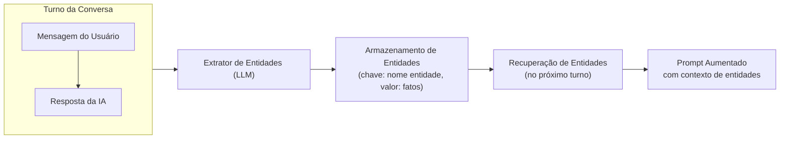
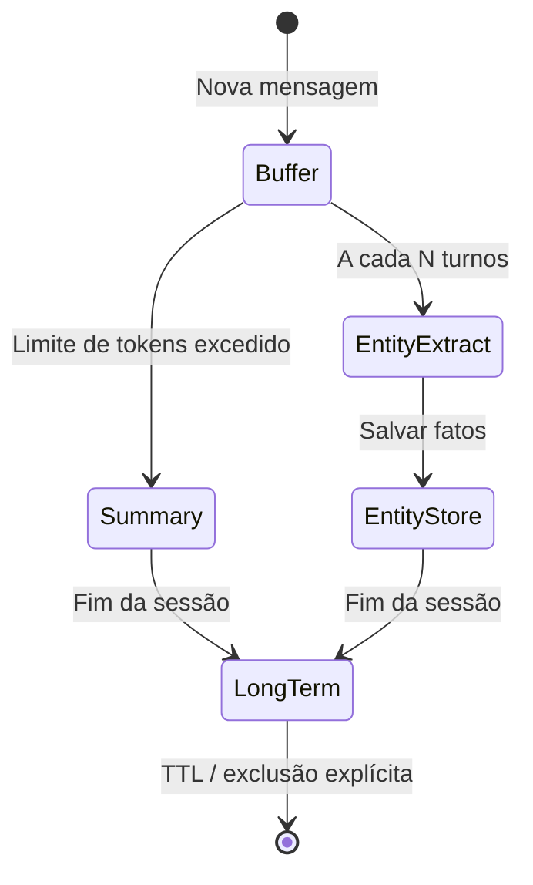
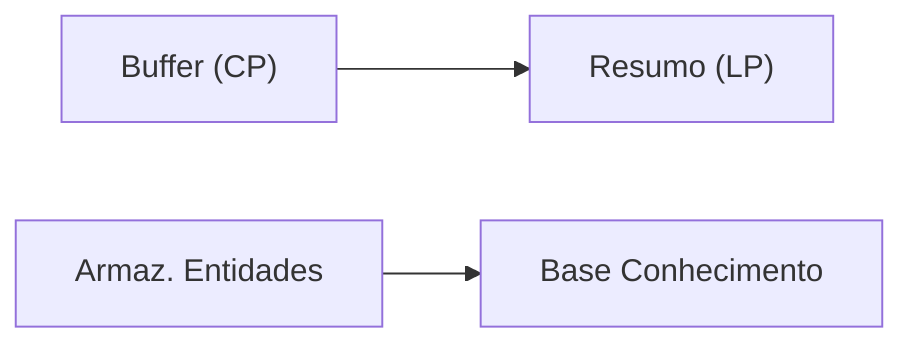

# Armazenamento de Memória, Resumos e Extração de Entidades

O LangChain fornece várias classes de memória integradas que oferecem aos agentes diferentes formas de lembrar. Escolher o tipo certo de memória — ou combiná-los — determina quão bem seu agente recorda e usa informações passadas.

---

## ConversationBufferMemory

A memória mais simples: manter uma lista de todas as mensagens passadas na conversa.

```python
from langchain.memory import ConversationBufferMemory
from langchain.schema import HumanMessage, AIMessage

# Create a buffer memory
memory = ConversationBufferMemory(
    return_messages=True,  # return list of Message objects
)

# Simulate a conversation
memory.chat_memory.add_user_message("Hi, I'm Alice.")
memory.chat_memory.add_ai_message("Hello Alice! How can I help?")
memory.chat_memory.add_user_message("What's the weather today?")

# Retrieve full history
history = memory.load_memory_variables({})
print(history["history"])
# Output: [HumanMessage(...), AIMessage(...), HumanMessage(...)]
```

[!WARNING]
O `ConversationBufferMemory` cresce sem limites. Em conversas longas, excederá a janela de contexto do LLM. Sempre combine com uma estratégia de corte ou sumarização em produção.

[!NOTE]
A memória de buffer é puramente em memória. Se seu servidor reiniciar, todo o histórico é perdido. Use um armazenamento de apoio persistente (Redis, SQL ou baseado em arquivo) para implantações de produção que exigem continuidade de sessão.

---

## ConversationSummaryMemory

Em vez de armazenar toda mensagem, esta memória resume periodicamente mensagens antigas em uma forma condensada.

```python
from langchain.memory import ConversationSummaryMemory
from langchain_openai import ChatOpenAI

llm = ChatOpenAI(model="gpt-4o-mini", temperature=0)

# Summary memory uses an LLM to compress history
memory = ConversationSummaryMemory(
    llm=llm,
    max_token_limit=200,  # trigger summarization above this
    return_messages=True,
)

memory.save_context(
    {"input": "My name is Bob and I work at Acme Corp."},
    {"output": "Nice to meet you Bob."},
)
memory.save_context(
    {"input": "I need help with the API key setup."},
    {"output": "Sure, let me walk you through it."},
)

# The summary will condense the above exchanges
summary = memory.load_memory_variables({})
print(summary["history"])
# Output: "Bob works at Acme Corp. and needs help with API key setup."
```

Compensação: resumos economizam tokens mas perdem detalhes. Um resumo de uma sessão de depuração pode omitir a mensagem de erro exata.

[!TIP]
Escolha seu `max_token_limit` cuidadosamente. Um limite muito baixo aciona a sumarização com frequência excessiva (aumentando custos do LLM). Um limite muito alto atrasa a sumarização, permitindo que o contexto cresça excessivamente. Comece com 1000-2000 tokens e ajuste com base na distribuição de comprimento das conversas.

---

## Memórias de Extração de Entidades

Memórias de entidades rastreiam entidades específicas (pessoas, lugares, produtos) mencionadas em uma conversa e acumulam fatos sobre cada uma.

```python
from langchain.memory import ConversationEntityMemory
from langchain_openai import ChatOpenAI

llm = ChatOpenAI(model="gpt-4o-mini", temperature=0)

memory = ConversationEntityMemory(llm=llm, return_messages=True)

# First turn — entity "Alice" is introduced
memory.save_context(
    {"input": "Alice is our lead engineer."},
    {"output": "Got it, Alice is the lead engineer."},
)

# Second turn — new fact about "Alice"
memory.save_context(
    {"input": "Alice prefers Python over Java."},
    {"output": "Noted, Alice prefers Python."},
)

# Retrieve stored facts about all entities
vars = memory.load_memory_variables({})
print(vars["entities"])
# Output: {'Alice': 'Alice is the lead engineer. Alice prefers Python over Java.'}
```

A memória de entidades é poderosa para personalização — um agente pode saudar um usuário pelo nome e lembrar suas preferências sem perguntar novamente.

### Pipeline de Extração de Entidades



[!IMPORTANT]
A memória de entidades depende do LLM para identificar e extrair entidades corretamente. Se o LLM alucinar entidades ou atribuir fatos incorretamente, a memória acumulará erros. Sempre valide entidades extraídas ao usar este tipo de memória em produção.

---

## Armazenamentos de Memória Personalizados

Para sistemas de produção, você geralmente precisará de um armazenamento personalizado. Abaixo está uma memória baseada em Redis que persiste entre reinicializações.

```python
import json
import redis
from langchain.memory import ChatMessageHistory
from langchain.schema import messages_from_dict, messages_to_dict

class RedisChatMessageHistory(ChatMessageHistory):
    """Persist conversation history in Redis."""

    def __init__(self, session_id: str,
                 redis_url: str = "redis://localhost:6379"):
        self.session_id = session_id
        self.redis_client = redis.from_url(redis_url)
        super().__init__()

    @property
    def key(self) -> str:
        return f"chat_history:{self.session_id}"

    def load_messages(self) -> list:
        data = self.redis_client.get(self.key)
        if data:
            return messages_from_dict(json.loads(data))
        return []

    def add_message(self, message) -> None:
        super().add_message(message)
        self._persist()

    def clear(self) -> None:
        self.redis_client.delete(self.key)
        super().clear()

    def _persist(self) -> None:
        serialized = messages_to_dict(self.messages)
        self.redis_client.set(self.key, json.dumps(serialized))
```

### Memória Personalizada com SQLite

Para persistência leve sem Redis, use SQLite:

```python
import sqlite3
import json
from datetime import datetime

class SQLiteMemory:
    """Persistent memory using SQLite — zero infrastructure needed."""

    def __init__(self, db_path: str = "agent_memory.db"):
        self.conn = sqlite3.connect(db_path)
        self.conn.execute("""
            CREATE TABLE IF NOT EXISTS memory (
                session_id TEXT,
                message_role TEXT,
                content TEXT,
                timestamp TEXT,
                PRIMARY KEY (session_id, timestamp)
            )
        """)
        self.conn.commit()

    def add_message(self, session_id: str, role: str, content: str):
        self.conn.execute(
            "INSERT INTO memory VALUES (?, ?, ?, ?)",
            (session_id, role, content, datetime.utcnow().isoformat()),
        )
        self.conn.commit()

    def get_history(self, session_id: str, limit: int = 50) -> list[dict]:
        cursor = self.conn.execute(
            "SELECT message_role, content FROM memory "
            "WHERE session_id = ? ORDER BY timestamp DESC LIMIT ?",
            (session_id, limit),
        )
        rows = cursor.fetchall()
        return [{"role": r[0], "content": r[1]} for r in reversed(rows)]

    def clear_session(self, session_id: str):
        self.conn.execute(
            "DELETE FROM memory WHERE session_id = ?",
            (session_id,),
        )
        self.conn.commit()
```

[!TIP]
SQLite é uma excelente escolha para agentes de processo único e prototipagem. Para sistemas distribuídos ou de alto throughput, use Redis (rápido, em memória) ou PostgreSQL (durável, consultável). Sua escolha de armazenamento de apoio deve corresponder às necessidades de escalabilidade da sua aplicação.

---

## Abordagens Híbridas

Os agentes mais robustos combinam múltiplos tipos de memória:

```python
from langchain.memory import (
    ConversationSummaryBufferMemory,
    ConversationEntityMemory,
)
from langchain.memory.combined import CombinedMemory
from langchain_openai import ChatOpenAI

llm = ChatOpenAI(model="gpt-4o-mini", temperature=0)

# Summary memory for conversation compression
summary_memory = ConversationSummaryBufferMemory(
    llm=llm,
    max_token_limit=500,
    memory_key="history",
    return_messages=True,
)

# Entity memory for tracking named entities
entity_memory = ConversationEntityMemory(
    llm=llm,
    memory_key="entities",
    return_messages=True,
)

# Combine them into one memory object
combined = CombinedMemory(
    memories=[summary_memory, entity_memory]
)
```

---

## Tabela Comparativa: Tipos de Memória

| Tipo de Memória | Armazenamento | Custo Tokens | Nível Detalhe | Melhor Para | Persistência |
| :--- | :--- | :--- | :--- | :--- | :--- |
| ConversationBuffer | Lista em memória | Alto (tudo) | Fidelidade total | Demos curtas, depuração | Volátil |
| ConversationSummary | Resumo via LLM | Baixo (comprimido) | Condensado | Conversas longas | Volátil |
| ConversationSummaryBuffer | Buffer + gatilho | Médio | Adaptativo | Chatbots produção | Volátil |
| ConversationEntity | Entidade → fatos | Baixo (por ent.) | Focado | Personalização, CRM | Volátil |
| Personalizado (Redis, SQL) | BD externo | Configurável | Configurável | Sistemas produção | Persistente |

---

## Consolidação de Memória

A consolidação move informações do armazenamento de curto prazo para o de longo prazo. Um cronograma típico:

1. **A cada turno** — anexar ao buffer (curto prazo)
2. **A cada N turnos** — extrair entidades e atualizar armazenamento
3. **No gatilho de resumo** — comprimir buffer em memória de resumo
4. **Ao final da sessão** — persistir fatos de entidades em base de conhecimento permanente





### Consolidação Automatizada com LangChain

```python
from langchain.memory import ConversationSummaryBufferMemory
from langchain_openai import ChatOpenAI

class AutoConsolidatingMemory:
    """Memory that automatically consolidates when thresholds are hit."""

    def __init__(self, llm, max_tokens: int = 1000):
        self.buffer = ConversationSummaryBufferMemory(
            llm=llm,
            max_token_limit=max_tokens,
            return_messages=True,
        )
        self.entity_store: dict[str, str] = {}
        self.turn_count = 0

    def save_context(self, inputs: dict, outputs: dict):
        self.turn_count += 1
        self.buffer.save_context(inputs, outputs)

        # Extract entities every 3 turns
        if self.turn_count % 3 == 0:
            self._extract_entities(inputs, outputs)

    def _extract_entities(self, inputs: dict, outputs: dict):
        """Simple entity extraction from input text."""
        import re
        combined = f"{inputs.get('input', '')} {outputs.get('output', '')}"
        # Pattern: "X is Y" or "X prefers Y"
        patterns = re.findall(
            r"(\w+) (?:is|prefers|works|likes) (\w+)",
            combined,
        )
        for entity, attr in patterns:
            if entity not in self.entity_store:
                self.entity_store[entity] = []
            self.entity_store[entity].append(attr)

    def load_memory(self) -> dict:
        return {
            "history": self.buffer.load_memory_variables({}),
            "entities": self.entity_store,
        }

# Usage
llm = ChatOpenAI(model="gpt-4o-mini", temperature=0)
memory = AutoConsolidatingMemory(llm=llm, max_tokens=1000)
memory.save_context({"input": "Hi, I'm Charlie"}, {"output": "Hello Charlie"})
memory.save_context({"input": "I like Python"}, {"output": "Great language"})
memory.save_context({"input": "My manager is Dana"}, {"output": "Good to know"})
print(memory.load_memory()["entities"])
# Output: {'Charlie': ['Python'], 'Dana': ['is']}
```

---

## Tabela Comparativa: Armazenamentos de Apoio

| Armazenamento | Tipo | Persistência | Velocidade | Caso de Uso |
| :--- | :--- | :--- | :--- | :--- |
| Em memória (lista Python) | RAM | Nenhuma | Mais rápida | Prototipagem, turno único |
| Redis | Chave-valor | Configurável (RDB/AOF) | Muito rápida | Cache de sessão, pub/sub |
| SQLite | Relacional | Baseado em arquivo | Rápida | Agentes de processo único |
| PostgreSQL | Relacional | Durável | Moderada | Multi-processo, consultas complexas |
| Arquivo (JSON/parquet) | Arquivo plano | Durável | Mais lenta | Arquivamento, depuração |
| Banco vetorial (Chroma) | BD vetorial | Durável | Moderada | Busca semântica (não chat) |

---

## 6 Perguntas de Prática

```question
{
  "id": "am-03-pt-q1",
  "type": "multiple-choice",
  "question": "Qual tipo de memória armazena toda mensagem sem compressão?",
  "options": [
    "ConversationSummaryMemory",
    "ConversationBufferMemory",
    "ConversationEntityMemory",
    "CombinedMemory"
  ],
  "correct": 1,
  "explanation": "ConversationBufferMemory armazena cada mensagem completa sem compressão ou sumarização."
}
```

```question
{
  "id": "am-03-pt-q2",
  "type": "multiple-choice",
  "question": "Qual é a principal compensação do ConversationSummaryMemory?",
  "options": [
    "É lento para carregar",
    "Perde detalhes durante a sumarização",
    "Não pode armazenar entidades",
    "Requer um banco de dados"
  ],
  "correct": 1,
  "explanation": "ConversationSummaryMemory economiza tokens comprimindo o histórico, mas esta compressão inevitavelmente perde alguns detalhes."
}
```

```question
{
  "id": "am-03-pt-q3",
  "type": "multiple-choice",
  "question": "ConversationEntityMemory é mais adequado para:",
  "options": [
    "Armazenar histórico bruto de conversa",
    "Rastrear fatos sobre entidades nomeadas",
    "Comprimir conversas longas",
    "Persistência em Redis"
  ],
  "correct": 1,
  "explanation": "ConversationEntityMemory rastreia entidades específicas (pessoas, lugares, produtos) e acumula fatos sobre cada uma entre turnos."
}
```

```question
{
  "id": "am-03-pt-q4",
  "type": "multiple-choice",
  "question": "Por que usar CombinedMemory?",
  "options": [
    "Para substituir todos os outros tipos de memória",
    "Para combinar múltiplas estratégias de memória em um agente",
    "Para acelerar o LLM",
    "Para reduzir o uso de tokens a zero"
  ],
  "correct": 1,
  "explanation": "CombinedMemory permite que um agente use múltiplos tipos de memória (resumo, buffer e entidades) simultaneamente."
}
```

```question
{
  "id": "am-03-pt-q5",
  "type": "multiple-choice",
  "question": "O que faz a consolidação de memória?",
  "options": [
    "Exclui memórias antigas",
    "Move informações do curto prazo para o longo prazo",
    "Duplica todas as memórias",
    "Criptografa o armazenamento de memória"
  ],
  "correct": 1,
  "explanation": "A consolidação de memória move periodicamente informações do armazenamento de curto prazo (buffer) para armazenamentos de longo prazo (resumo, base de conhecimento)."
}
```

```question
{
  "id": "am-03-pt-q6",
  "type": "multiple-choice",
  "question": "Um agente chatbot precisa lembrar preferências do usuário após reinicializações do servidor. Qual armazenamento de apoio é a escolha mínima viável?",
  "options": [
    "Lista Python em memória",
    "Banco de dados SQLite baseado em arquivo",
    "Um segundo LLM para regenerar preferências",
    "Variáveis de ambiente"
  ],
  "correct": 1,
  "explanation": "SQLite fornece persistência baseada em arquivo que sobrevive a reinicializações do servidor com zero infraestrutura. Armazenamento em memória perderia todas as preferências na reinicialização."
}
```

---

[!SUCCESS]
### Principais Conclusões

- `ConversationBufferMemory` armazena histórico bruto mas cresce sem limites.
- `ConversationSummaryMemory` usa um LLM para comprimir o histórico, economizando tokens ao custo de detalhes.
- `ConversationEntityMemory` extrai e rastreia fatos sobre entidades nomeadas entre turnos.
- Armazenamentos personalizados (Redis, SQL, arquivos) permitem persistência além de uma sessão.
- Memória combinada permite que um agente use resumo, buffer e entidades simultaneamente.
- A consolidação move periodicamente dados de curto prazo para armazenamentos de longo prazo.
- Escolha tipos de memória com base no equilíbrio entre custo de tokens, retenção de detalhes e requisitos de persistência.
- SQLite é o armazenamento persistente de apoio mais simples para agentes de processo único; Redis é melhor para sistemas distribuídos.
