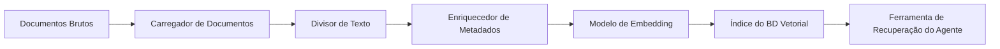
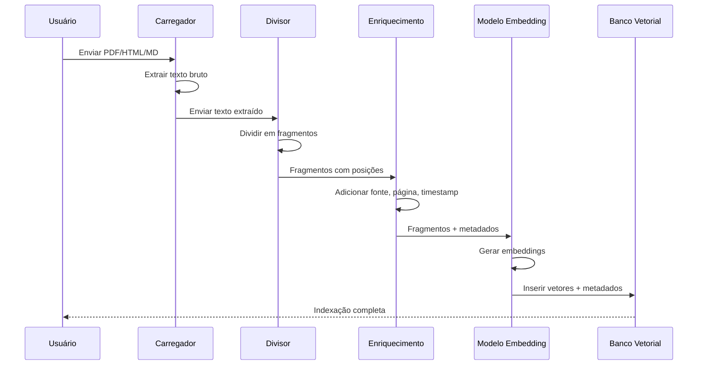

# Integração de Base de Conhecimento e Processamento de Documentos

Um agente é tão conhecedor quanto os documentos que pode acessar. Construir um pipeline robusto de ingestão de documentos — de arquivos brutos a uma base de conhecimento pesquisável — é uma habilidade fundamental de engenharia para agentes de produção.

---

## Ingestão de Documentos (PDF, HTML, Markdown)

Formatos diferentes exigem carregadores diferentes. O LangChain fornece carregadores para cada formato principal.

```python
from langchain_community.document_loaders import (
    PyPDFLoader,      # PDF files
    BSHTMLLoader,     # HTML pages
    TextLoader,       # Plain text / Markdown
    UnstructuredMarkdownLoader,  # Structured Markdown
)

# Load a PDF
pdf_loader = PyPDFLoader("contract.pdf")
pdf_docs = pdf_loader.load()
print(f"Loaded {len(pdf_docs)} pages from PDF")
# Output: Loaded 12 pages from PDF

# Load an HTML file
html_loader = BSHTMLLoader("page.html")
html_docs = html_loader.load()
print(f"Title: {html_docs[0].metadata.get('title', 'N/A')}")
# Output: Title: Product Documentation

# Load Markdown
md_loader = UnstructuredMarkdownLoader("readme.md")
md_docs = md_loader.load()
print(f"Loaded {len(md_docs)} Markdown documents")
```

[!WARNING]
A qualidade da extração de PDF varia muito. PDFs escaneados exigem OCR (ex: `pytesseract` ou Azure Document Intelligence). Sempre inspecione o texto extraído antes de indexar.

### Pipeline de Ingestão de Documentos



---

## Processamento de Documentos: Sequência Ponta a Ponta



[!IMPORTANT]
Sempre valide a saída de cada estágio do pipeline antes de passar para o próximo. Uma falha comum é o carregador de documentos retornar texto vazio ou distorcido, que é então incorporado e indexado como se fosse significativo. Adicione verificações de validação: comprimento do texto > 0, proporção de caracteres e detecção de idioma.

---

## OCR para Documentos Escaneados

PDFs escaneados contêm imagens de texto, não texto selecionável. OCR extrai o texto das imagens:

```python
# Example: using pytesseract for OCR on scanned PDFs
from pdf2image import convert_from_path
import pytesseract
from langchain.schema import Document

def ocr_pdf(filepath: str) -> list[Document]:
    """Extract text from a scanned PDF using OCR."""
    images = convert_from_path(filepath)
    documents = []

    for page_num, image in enumerate(images, start=1):
        # Run OCR on the page image
        text = pytesseract.image_to_string(image, lang="eng")

        if len(text.strip()) < 20:
            # Skip pages with insufficient text
            continue

        doc = Document(
            page_content=text,
            metadata={
                "source": filepath,
                "page": page_num,
                "ocr_method": "tesseract",
            },
        )
        documents.append(doc)

    return documents

# Usage
# docs = ocr_pdf("scanned_contract.pdf")
# print(f"Extracted {len(docs)} pages via OCR")
```

[!NOTE]
A precisão do OCR depende fortemente da qualidade da imagem. Para melhores resultados, digitalize a 300 DPI ou mais, use modo preto-e-branco e garanta que o documento esteja plano (não enrolado ou dobrado). Considere serviços comerciais de OCR (Azure Document Intelligence, Google Cloud Vision) para digitalizações de baixa qualidade.

---

## Estratégias de Divisão de Texto

O divisor escolhido altera drasticamente a qualidade da recuperação. Abaixo estão as estratégias mais comuns.

```python
from langchain.text_splitter import (
    RecursiveCharacterTextSplitter,
    TokenTextSplitter,
    MarkdownHeaderTextSplitter,
)

# Strategy 1: Recursive character splitting (general purpose)
recursive_splitter = RecursiveCharacterTextSplitter(
    chunk_size=1000,
    chunk_overlap=200,
    separators=["\n\n", "\n", ". ", " "],
)

# Strategy 2: Token-aware splitting (matches LLM tokenizers)
token_splitter = TokenTextSplitter(
    chunk_size=256,      # tokens, not characters
    chunk_overlap=50,
)

# Strategy 3: Markdown-aware splitting (preserves headers)
headers_to_split_on = [
    ("#", "Header 1"),
    ("##", "Header 2"),
    ("###", "Header 3"),
]
markdown_splitter = MarkdownHeaderTextSplitter(
    headers_to_split_on=headers_to_split_on,
)
```

| Estratégia | Unidade | Preserva Estrutura | Sobreposição | Melhor Para |
| :--- | :--- | :--- | :--- | :--- |
| RecursiveCharacter | Caracteres | Moderada | Sim | Texto geral |
| Token | Tokens | Baixa | Sim | Fragmentos alinhados ao LLM |
| MarkdownHeader | Cabeçalhos | Alta | Não | Documentos, wikis |
| RecursiveJson | Chaves JSON | Alta | Não | Dados JSON estruturados |
| HTMLHeader | Tags HTML | Alta | Não | Páginas web |
| Semântica | Limites de sentença | Alta | Não | Preservação de passagens coerentes |

---

## Extração de Metadados

Metadados transformam fragmentos em unidades filtráveis e rastreáveis. Cada fragmento deve carregar contexto suficiente para identificar sua origem.

```python
from langchain_community.document_loaders import PyPDFLoader
from langchain.text_splitter import RecursiveCharacterTextSplitter

loader = PyPDFLoader("annual-report.pdf")
docs = loader.load()

# Add custom metadata to each page
for i, doc in enumerate(docs):
    doc.metadata.update({
        "page_number": i + 1,
        "source": "annual-report.pdf",
        "year": "2025",
        "doc_type": "financial_report",
    })

# Split and preserve metadata
splitter = RecursiveCharacterTextSplitter(
    chunk_size=500, chunk_overlap=50,
)
chunks = splitter.split_documents(docs)

print(f"Total chunks: {len(chunks)}")
print(f"Sample metadata: {chunks[0].metadata}")
# Output: Total chunks: 47
#         Sample metadata: {'page_number': 1, 'source': 'annual-report.pdf',
#                           'year': '2025', 'doc_type': 'financial_report'}
```

[!TIP]
Um esquema de metadados bem projetado é tão importante quanto o próprio embedding. Campos de metadados comuns de alto valor: `source` (caminho do arquivo ou URL), `page_number`, `section_title`, `author`, `date_published`, `doc_type`, `language`, `content_hash`. Estes campos permitem filtragem poderosa e tornam sua base de conhecimento auditável.

```python
def enrich_metadata(doc, source_path: str) -> dict:
    """Automatically extract metadata from document content."""
    import re
    metadata = {
        "source": source_path,
        "ingested_at": datetime.utcnow().isoformat(),
    }

    # Try to extract title from first heading
    lines = doc.page_content.split("\n")
    for line in lines[:10]:
        if line.startswith("# "):
            metadata["title"] = line.strip("# ")
            break

    # Detect language (simplified — use langdetect in production)
    if re.search(r"[¿¡áéíóúñ]", doc.page_content):
        metadata["language"] = "es"
    elif re.search(r"[àèìòùç]", doc.page_content):
        metadata["language"] = "pt"
    elif re.search(r"[äöüß]", doc.page_content):
        metadata["language"] = "de"
    else:
        metadata["language"] = "en"

    # Count tokens (approximate)
    metadata["estimated_tokens"] = len(doc.page_content.split()) * 1.3

    return metadata
```

---

## Indexação Incremental

Bases de conhecimento reais nunca são estáticas. Novos documentos chegam, antigos são atualizados e entradas obsoletas devem ser removidas.

```python
import hashlib
from datetime import datetime
import chromadb

client = chromadb.Client()
collection = client.get_or_create_collection("knowledge_base")

def index_document(filepath: str, content: str, metadata: dict) -> None:
    # Generate a content hash for deduplication
    content_hash = hashlib.sha256(content.encode()).hexdigest()

    # Check if this content already exists
    existing = collection.get(ids=[content_hash])
    if existing["ids"]:
        print(f"Skipping duplicate: {filepath}")
        return

    # Add timestamp for incremental sync
    metadata["indexed_at"] = datetime.utcnow().isoformat()
    metadata["content_hash"] = content_hash

    # Split, embed, and index
    chunks = splitter.split_text(content)
    # ... embed and add to collection ...

    print(f"Indexed {filepath} ({len(chunks)} chunks)")
```

[!WARNING]
Hashes de conteúdo são ótimos para detecção exata de duplicatas, mas falham quando um documento é atualizado. Um documento com apenas um caractere alterado terá um hash completamente diferente. Para detecção de atualizações, também rastreie timestamps de modificação de arquivo ou números de versão.

### Classificação de Documentos por Estratégia de Processamento

| Tipo de Documento | Carregador | Pré-processamento | Divisor | Tratamento Especial |
| :--- | :--- | :--- | :--- | :--- |
| PDF baseado em texto | PyPDFLoader | Nenhum | RecursiveCharacter | Texto selecionável |
| PDF escaneado | PyPDFLoader + OCR | Imagem-para-texto | RecursiveCharacter | Verificação de qualidade OCR |
| Página HTML | BSHTMLLoader | Remover tags/nav | HTMLHeader | Remoção de rodapé |
| Documento Markdown | MarkdownHeader | Nenhum | MarkdownHeader | Preservação de cabeçalhos |
| Dados JSON | JSONLoader | Validar JSON | RecursiveJson | Validação de esquema |
| CSV/Excel | CSVLoader | Analisar linhas | RecursiveCharacter | Metadados de colunas |
| Repositório de código | TextLoader | Filtro .gitignore | Token | Detecção de linguagem |

---

## Atualização de Bases de Conhecimento

Documentos mudam. Seu índice deve refletir essas mudanças sem uma reconstrução completa.

```python
def update_document(filepath: str, new_content: str) -> None:
    # Delete all chunks from this source
    collection.delete(where={"source": filepath})

    # Re-index with fresh content
    chunks = splitter.split_text(new_content)
    # ... embed and re-add ...

    print(f"Updated: {filepath}")

def delete_document(filepath: str) -> None:
    collection.delete(where={"source": filepath})
    print(f"Deleted: {filepath}")
```

[!NOTE]
O padrão excluir-e-reindexar é simples e correto, mas tem uma janela onde o documento fica indisponível. Para sistemas de alta disponibilidade, use uma abordagem de duas fases: indexe a nova versão, depois troque atomicamente com a versão antiga.

```python
def update_document_atomic(filepath: str, new_content: str) -> None:
    """Atomic update: index new version, then remove old version."""
    # Generate a temporary group ID for the new chunks
    import uuid
    new_group_id = str(uuid.uuid4())

    # Index new content with temporary group
    chunks = splitter.split_text(new_content)
    new_ids = []
    for i, chunk in enumerate(chunks):
        chunk_id = f"{new_group_id}:{i}"
        new_ids.append(chunk_id)
        # ... embed and add with chunk_id ...

    # Now atomically remove old and keep new
    collection.delete(where={"source": filepath})
    print(f"Atomically updated: {filepath}")
```

---

## Conexão com Agentes

Após construir a base de conhecimento, conecte-a a um agente através de uma ferramenta de recuperação.

```python
from langchain.tools import tool
from langchain.agents import create_openai_functions_agent, AgentExecutor
from langchain_openai import ChatOpenAI
import chromadb

client = chromadb.Client()
collection = client.get_collection("knowledge_base")

@tool
def search_knowledge_base(query: str, k: int = 3) -> str:
    """Search the company knowledge base for relevant information."""
    results = collection.query(query_texts=[query], n_results=k)
    return "\n\n".join(results["documents"][0])

# Create an agent with the KB tool
llm = ChatOpenAI(model="gpt-4o-mini", temperature=0)
agent = create_openai_functions_agent(
    llm=llm,
    tools=[search_knowledge_base],
    prompt=...,  # your system prompt here
)
agent_executor = AgentExecutor(agent=agent, tools=[search_knowledge_base])

# Now the agent can answer from the knowledge base
# result = agent_executor.invoke({"input": "What is the vacation policy?"})
```

---

## Tratamento de PII na Ingestão de Documentos

[!WARNING]
Documentos podem conter informações pessoais identificáveis (PII) como nomes, emails, números de telefone e números de cartão de crédito. Se sua base de conhecimento for usada por agentes que atendem múltiplos usuários, o vazamento de PII entre sessões é um risco de privacidade e conformidade.

```python
import re

def sanitize_document(text: str) -> str:
    """Remove common PII patterns from document text."""
    # Email addresses
    text = re.sub(r'\b[\w\.-]+@[\w\.-]+\.\w+\b', '[EMAIL]', text)

    # Phone numbers (US format)
    text = re.sub(r'\b\d{3}[-.]?\d{3}[-.]?\d{4}\b', '[PHONE]', text)

    # Social Security Numbers
    text = re.sub(r'\b\d{3}-\d{2}-\d{4}\b', '[SSN]', text)

    # Credit card numbers (simplified)
    text = re.sub(r'\b(?:\d{4}[-\s]?){3}\d{4}\b', '[CC]', text)

    return text

# Apply before indexing
# cleaned_text = sanitize_document(raw_text)
```

---

## 6 Perguntas de Prática

```question
{
  "id": "am-04-pt-q1",
  "type": "multiple-choice",
  "question": "Qual carregador deve ser usado para um PDF escaneado?",
  "options": [
    "PyPDFLoader sozinho",
    "PyPDFLoader com OCR (ex: pytesseract)",
    "TextLoader",
    "BSHTMLLoader"
  ],
  "correct": 1,
  "explanation": "PDFs escaneados exigem OCR (reconhecimento óptico de caracteres) porque o texto está incorporado em imagens em vez de texto selecionável."
}
```

```question
{
  "id": "am-04-pt-q2",
  "type": "multiple-choice",
  "question": "Qual é o propósito da sobreposição de fragmentos na divisão de texto?",
  "options": [
    "Reduzir o número de fragmentos",
    "Preservar contexto entre limites de fragmentos",
    "Acelerar a incorporação",
    "Criptografar o documento"
  ],
  "correct": 1,
  "explanation": "A sobreposição garante que frases ou ideias que de outra forma seriam divididas entre fragmentos não sejam perdidas."
}
```

```question
{
  "id": "am-04-pt-q3",
  "type": "multiple-choice",
  "question": "Por que metadados devem ser anexados a cada fragmento?",
  "options": [
    "É exigido por bancos de dados vetoriais",
    "Permite filtragem e rastreabilidade",
    "Reduz o tamanho do armazenamento",
    "Substitui a necessidade de embeddings"
  ],
  "correct": 1,
  "explanation": "Metadados transformam fragmentos em unidades filtráveis e rastreáveis, permitindo identificar a origem e o contexto de cada fragmento."
}
```

```question
{
  "id": "am-04-pt-q4",
  "type": "multiple-choice",
  "question": "Na indexação incremental, como evitar entradas duplicadas?",
  "options": [
    "Verificando um hash de conteúdo antes de inserir",
    "Indexando tudo toda vez",
    "Usando um tamanho de fragmento maior",
    "Pulando metadados"
  ],
  "correct": 0,
  "explanation": "Um hash de conteúdo (ex: SHA-256) é gerado para cada documento e verificado contra entradas existentes para pular duplicatas."
}
```

```question
{
  "id": "am-04-pt-q5",
  "type": "multiple-choice",
  "question": "Como atualizar um documento na base de conhecimento?",
  "options": [
    "Anexar novos fragmentos sem remover os antigos",
    "Excluir todos os fragmentos da fonte e re-indexar",
    "Sobrescrever o modelo de embedding",
    "Limpar toda a coleção"
  ],
  "correct": 1,
  "explanation": "Para atualizar um documento, excluem-se todos os fragmentos existentes daquela fonte e re-indexa-se o novo conteúdo."
}
```

```question
{
  "id": "am-04-pt-q6",
  "type": "multiple-choice",
  "question": "A base de conhecimento de um agente contém documentos de RH com endereços de email de funcionários. O que fazer antes de indexar?",
  "options": [
    "Nada — o agente precisa dos emails para responder perguntas",
    "Sanitizar os documentos removendo ou mascarando PII",
    "Indexar tudo e adicionar um filtro depois",
    "Mudar para um modelo de embedding diferente"
  ],
  "correct": 1,
  "explanation": "PII em documentos pode vazar para usuários não autorizados. Sanitize documentos removendo ou mascarando PII antes de indexar para proteger a privacidade e manter a conformidade."
}
```

---

[!SUCCESS]
### Principais Conclusões

- Formatos diferentes (PDF, HTML, Markdown) exigem carregadores específicos.
- PDFs escaneados exigem processamento OCR antes da extração de texto.
- A estratégia de divisão de texto — recursiva, baseada em tokens ou consciente de estrutura — impacta diretamente a qualidade da recuperação.
- Metadados (fonte, página, timestamp, hash) tornam os fragmentos filtráveis e rastreáveis.
- A indexação incremental usa hashes de conteúdo para pular duplicatas e evitar reconstruções completas.
- Atualizar um documento requer excluir fragmentos antigos e re-indexar o novo conteúdo.
- A base de conhecimento é conectada ao agente por uma ferramenta de recuperação que encapsula a busca vetorial.
- O pipeline de ingestão é linear: carregar, dividir, enriquecer metadados, incorporar, indexar.
- PII deve ser sanitizada antes da indexação para prevenir vazamento de dados.
- Atualizações atômicas previnem janelas de indisponibilidade durante re-indexação.
