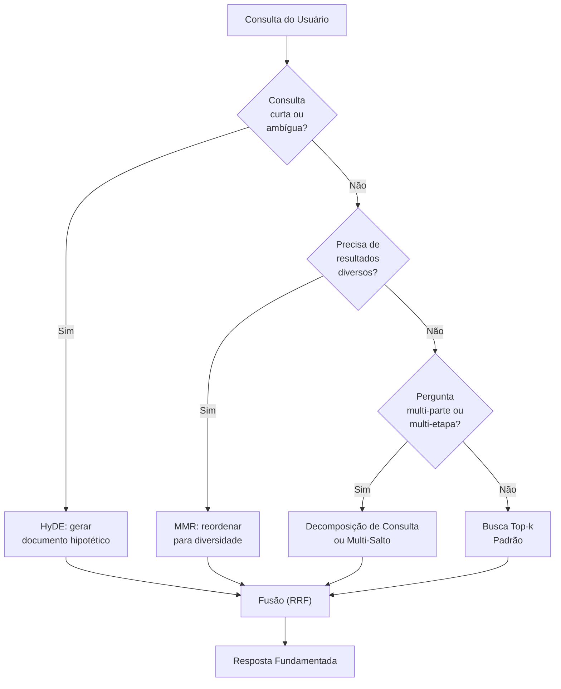
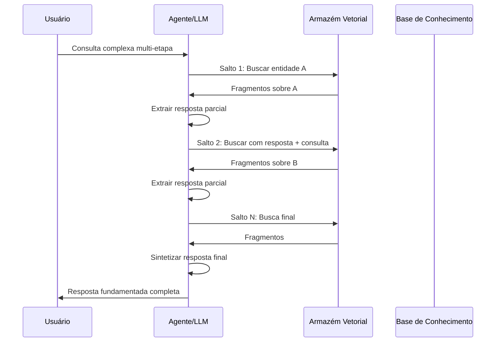

# Estratégias Avançadas de Recuperação

A recuperação simples top-k com similaridade por cosseno funciona em muitos casos, mas sistemas de produção exigem mais: melhor relevância, diversidade, raciocínio em múltiplas etapas e a capacidade de lidar com consultas complexas. Esta lição cobre as estratégias de recuperação avançadas mais eficazes.

---

## HyDE (Embeddings de Documentos Hipotéticos)

HyDE melhora a recuperação gerando primeiro um documento hipotético que responde à consulta e usando o embedding desse documento para a busca. A ideia: o embedding de uma resposta completa está mais próximo de documentos relevantes do que o embedding de uma consulta curta.

```python
from openai import OpenAI
import chromadb

client = OpenAI()
chroma_client = chromadb.Client()
collection = chroma_client.get_collection("docs")

def hyde_search(query: str, k: int = 3) -> list[str]:
    # Step 1: Generate a hypothetical document
    # The LLM writes what a perfect answer would look like
    hypo_doc = client.chat.completions.create(
        model="gpt-4o-mini",
        messages=[
            {"role": "system",
             "content": "Write a detailed paragraph that answers the user's "
                        "question as if it were a section from a textbook."},
            {"role": "user", "content": query},
        ],
    ).choices[0].message.content

    # Step 2: Embed the hypothetical document (not the query!)
    hypo_emb = client.embeddings.create(
        input=hypo_doc,
        model="text-embedding-3-small",
    ).data[0].embedding

    # Step 3: Search with the hypothetical embedding
    results = collection.query(
        query_embeddings=[hypo_emb],
        n_results=k,
    )

    return results["documents"][0]

# The hypothetical doc bridges the lexical gap between short query and stored passages
```

[!WARNING]
HyDE adiciona uma chamada LLM por consulta, aumentando latência e custo. É melhor usado quando a qualidade da consulta é crítica e as consultas são curtas ou ambíguas. Coloque em cache documentos hipotéticos para consultas repetidas.

---

## MMR (Relevância Marginal Máxima)

A recuperação top-k padrão pode retornar resultados quase duplicados. O MMR troca relevância pura por diversidade, reordenando resultados para minimizar redundância.

```python
import numpy as np
from sklearn.metrics.pairwise import cosine_similarity

def mmr_rerank(
    query_emb: list[float],
    doc_embeddings: list[list[float]],
    docs: list[str],
    k: int = 3,
    lambda_param: float = 0.7,
) -> list[str]:
    """
    MMR: balance relevance (query similarity) and diversity
    (dissimilarity to already-selected docs).

    Score = λ * sim(query, doc) - (1-λ) * max_{selected} sim(doc, selected)
    """
    n = len(docs)
    query_emb = np.array(query_emb).reshape(1, -1)
    doc_embs = np.array(doc_embeddings)

    # Precompute all-pair cosine similarities
    doc_sim_to_query = cosine_similarity(query_emb, doc_embs).flatten()
    doc_sim_matrix = cosine_similarity(doc_embs)

    selected = []
    candidates = list(range(n))

    for _ in range(min(k, n)):
        if not candidates:
            break

        # Score each candidate
        best_score = -1
        best_idx = -1
        for i in candidates:
            # Relevance to query
            relevance = doc_sim_to_query[i]

            # Diversity penalty: max similarity to already-selected docs
            if selected:
                diversity = max(doc_sim_matrix[i][s] for s in selected)
            else:
                diversity = 0

            score = lambda_param * relevance - (1 - lambda_param) * diversity

            if score > best_score:
                best_score = score
                best_idx = i

        selected.append(best_idx)
        candidates.remove(best_idx)

    return [docs[i] for i in selected]

# Usage
# results = mmr_rerank(query_emb, doc_embs, raw_docs, k=5, lambda_param=0.7)
```

| Parâmetro | Efeito |
| :--- | :--- |
| λ = 1.0 | Relevância pura (top-k padrão) |
| λ = 0.0 | Diversidade pura |
| λ = 0.5–0.8 | Equilibrado (recomendado) |

[!TIP]
MMR é ideal para tarefas de sumarização onde você quer cobrir múltiplos aspectos de um tópico sem repetir a mesma informação. Use λ = 0.7 para uma ligeira preferência por relevância, ou λ = 0.5 para equilíbrio igual. Reduza λ quando a redundância é mais prejudicial do que perder um resultado ligeiramente relevante.

---

## Fluxo de Decisão de Estratégia de Recuperação



---

## Recuperação Multi-Salto

Algumas perguntas exigem encadeamento entre documentos. A recuperação multi-salto responde uma subpergunta de cada vez, usando cada resposta para informar a seguinte.

```
Query: "What is the capital of the country where the Eiffel Tower is?"
    |
    v
Hop 1: "Where is the Eiffel Tower?" → "Paris, France"
    |
    v
Hop 2: "What is the capital of France?" → "Paris"
```

```python
def multi_hop_search(query: str, max_hops: int = 3) -> str:
    context = ""
    for hop in range(max_hops):
        # Search with accumulated context
        augmented_query = f"{context}\n\n{query}" if context else query
        results = collection.query(query_texts=[augmented_query], n_results=2)

        # Extract answer from retrieved chunks
        chunk_text = "\n".join(results["documents"][0])

        # Ask LLM to extract a concise answer
        answer = client.chat.completions.create(
            model="gpt-4o-mini",
            messages=[
                {"role": "system",
                 "content": "Answer concisely based on the context."},
                {"role": "user",
                 "content": f"Context: {chunk_text}\nQuestion: {query}"},
            ],
        ).choices[0].message.content

        # Check if answer is complete
        if is_sufficient(answer):  # heuristic: contains a concrete answer
            return answer

        # Otherwise, use this answer to refine next hop
        context = f"Previously found: {answer}"

    return "Could not resolve query in available hops."
```

### Sequência de Recuperação Multi-Salto



[!WARNING]
A recuperação multi-salto multiplica a latência pelo número de saltos (cada salto requer uma busca vetorial + uma chamada LLM). Defina um limite máximo de saltos (3 é típico) e implemente parada antecipada quando uma resposta autocontida for encontrada. Faça um orçamento para N× o custo de uma consulta RAG padrão.

---

## Decomposição de Consultas

Divida uma consulta complexa em subconsultas mais simples, recupere para cada uma e depois mescle os resultados.

```python
def decompose_query(query: str) -> list[str]:
    """Use LLM to split a complex query into sub-queries."""
    response = client.chat.completions.create(
        model="gpt-4o-mini",
        messages=[
            {"role": "system",
             "content": "Break the user's question into 2-4 simple "
                        "sub-questions. Return one per line."},
            {"role": "user", "content": query},
        ],
    )
    sub_queries = response.choices[0].message.content.strip().split("\n")
    return [q.strip("- ").strip() for q in sub_queries if q.strip()]

def decomposed_search(query: str) -> str:
    sub_queries = decompose_query(query)
    all_chunks = []

    for sq in sub_queries:
        results = collection.query(query_texts=[sq], n_results=2)
        all_chunks.extend(results["documents"][0])

    # Remove duplicates and merge
    seen = set()
    unique_chunks = []
    for c in all_chunks:
        if c not in seen:
            seen.add(c)
            unique_chunks.append(c)

    return "\n\n".join(unique_chunks)
```

[!TIP]
A decomposição de consultas é excelente para perguntas do tipo "compare e contraste" ou "liste todos". Por exemplo, "Compare as políticas de devolução dos planos Pro e Enterprise" torna-se: (1) "Qual é a política de devolução do plano Pro?", (2) "Qual é a política de devolução do plano Enterprise?". Cada subconsulta recupera exatamente os fragmentos relevantes.

---

## Recuperadores Auto-Consultantes

Um recuperador auto-consultante usa o LLM para extrair uma consulta de busca *e* filtros de metadados a partir de uma pergunta em linguagem natural.

```python
from langchain.retrievers.self_query.base import SelfQueryRetriever
from langchain.chains.query_constructor.base import AttributeInfo

# Describe the metadata fields available
metadata_field_info = [
    AttributeInfo(
        name="year",
        description="The year the document was published",
        type="int",
    ),
    AttributeInfo(
        name="department",
        description="The company department this applies to",
        type="string",
    ),
    AttributeInfo(
        name="doc_type",
        description="Type of document (policy, guide, report)",
        type="string",
    ),
]

# Create self-querying retriever
retriever = SelfQueryRetriever.from_llm(
    llm=llm,
    vectorstore=vectorstore,
    document_contents="Company policies and procedures",
    metadata_field_info=metadata_field_info,
)

# User asks: "What is the vacation policy from 2024?"
# Retriever automatically extracts:
#   query = "vacation policy"
#   filter = year == 2024

# result = retriever.get_relevant_documents(
#     "What is the vacation policy from 2024?"
# )
```

---

## Fusão de Recuperação (RRF)

Combine resultados de múltiplas estratégias de recuperação usando Fusão por Classificação Recíproca para obter o melhor de todos os mundos.

```python
def reciprocal_rank_fusion(
    result_lists: list[list[str]],
    k: int = 60,
) -> list[str]:
    """
    Fuse multiple ranked lists using RRF.

    score(d) = sum_{r in retrievers} 1 / (k + rank_r(d))
    """
    scores = {}
    for results in result_lists:
        for rank, doc in enumerate(results, start=1):
            if doc not in scores:
                scores[doc] = 0
            scores[doc] += 1 / (k + rank)

    # Sort by descending RRF score
    ranked = sorted(scores.items(), key=lambda x: -x[1])
    return [doc for doc, _ in ranked]

# Fuse results from multiple strategies
bm25_results = bm25_retrieve(query)        # keyword-based
vector_results = vector_retrieve(query)    # semantic
hyde_results = hyde_search(query)          # HyDE-based

fused = reciprocal_rank_fusion(
    [bm25_results, vector_results, hyde_results]
)
# Output: a single ranked list combining all signals
```

---

## Tabela Comparativa: Estratégias de Recuperação

| Estratégia | Latência | Diversidade | Relevância | Quando Usar |
| :--- | :--- | :--- | :--- | :--- |
| Top-k (cosseno) | Baixa | Baixa | Alta | Q&A simples, prototipagem |
| HyDE | Alta (chamada LLM) | Média | Muito Alta | Consultas curtas/ambíguas |
| MMR | Média (reordenar) | Alta | Alta | Sumarização, evitar redundância |
| Multi-salto | Muito Alta (N rodadas) | Alta | Muito Alta | Cadeias de raciocínio complexas |
| Decomposição | Alta (subconsultas) | Alta | Alta | Perguntas multi-parte |
| Auto-consulta | Média | Média | Alta | Busca semântica + filtrada |
| Fusão (RRF) | Média | Alta | Alta | Combinar múltiplos recuperadores |

---

## Quando Usar Cada Estratégia

| Cenário | Estratégia Recomendada | Porquê |
| :--- | :--- | :--- |
| "Qual é a política de devolução?" | Top-k padrão | Consulta simples de fato único |
| "Explique computação quântica" | HyDE | Consulta curta, conceito amplo |
| "Eventos principais de 2023 em IA" | MMR | Resultados diversos necessários |
| "Quem fundou a Empresa X e onde fica a sede?" | Decomposição | Duas subperguntas distintas |
| "O que causou a crise financeira de 2008?" | Multi-salto | Exige raciocínio encadeado |
| "Políticas do RH depois de 2023" | Auto-consulta | Busca semântica + filtro de metadados |
| Qualquer consulta crítica | Fusão (RRF) | Combina pontos fortes de todos os métodos |

---

## 6 Perguntas de Prática

```question
{
  "id": "am-05-pt-q1",
  "type": "multiple-choice",
  "question": "Qual é a ideia central do HyDE?",
  "options": [
    "Embedding da consulta diretamente",
    "Gerar uma resposta hipotética e incorporá-la",
    "Usar múltiplos embeddings por documento",
    "Pular a etapa de embedding completamente"
  ],
  "correct": 1,
  "explanation": "HyDE gera um documento hipotético que responde à consulta, então usa o embedding desse documento para busca. O embedding de uma resposta completa está mais próximo de documentos relevantes do que o embedding de uma consulta curta."
}
```

```question
{
  "id": "am-05-pt-q2",
  "type": "multiple-choice",
  "question": "Qual problema o MMR resolve?",
  "options": [
    "Baixa velocidade de recuperação",
    "Resultados redundantes / quase duplicados",
    "Filtragem de metadados",
    "Suporte a múltiplos idiomas"
  ],
  "correct": 1,
  "explanation": "MMR troca relevância pura por diversidade, reordenando resultados para minimizar redundância, evitando que resultados quase duplicados dominem a lista top-k."
}
```

```question
{
  "id": "am-05-pt-q3",
  "type": "multiple-choice",
  "question": "A recuperação multi-salto é necessária quando:",
  "options": [
    "A consulta é muito curta",
    "Responder exige encadeamento entre múltiplos documentos",
    "Os resultados precisam de diversidade",
    "O BD vetorial está vazio"
  ],
  "correct": 1,
  "explanation": "A recuperação multi-salto responde uma subpergunta de cada vez, usando cada resposta para informar a próxima busca. Isso é necessário quando o raciocínio deve encadear entre documentos."
}
```

```question
{
  "id": "am-05-pt-q4",
  "type": "multiple-choice",
  "question": "O que um recuperador auto-consultante extrai de uma pergunta do usuário?",
  "options": [
    "Apenas a consulta de busca",
    "Tanto uma consulta de busca quanto filtros de metadados",
    "Apenas filtros de metadados",
    "A identidade do usuário"
  ],
  "correct": 1,
  "explanation": "Um recuperador auto-consultante usa o LLM para extrair tanto uma consulta de busca semântica quanto filtros de metadados da linguagem natural."
}
```

```question
{
  "id": "am-05-pt-q5",
  "type": "multiple-choice",
  "question": "A Fusão por Classificação Recíproca (RRF) é usada para:",
  "options": [
    "Reordenar resultados usando um LLM",
    "Combinar resultados de múltiplas estratégias de recuperação",
    "Reduzir o número de resultados",
    "Incorporar documentos mais rápido"
  ],
  "correct": 1,
  "explanation": "RRF combina listas classificadas de múltiplas estratégias de recuperação (ex: BM25, vetorial, HyDE) em uma única lista classificada usando pontuação de classificação recíproca."
}
```

```question
{
  "id": "am-05-pt-q6",
  "type": "multiple-choice",
  "question": "Um usuário pergunta: \"Qual é o prazo de entrega e a política de devolução do plano Pro?\" Qual estratégia avançada é mais apropriada?",
  "options": [
    "Recuperação top-k padrão",
    "Decomposição de consultas (dividir em duas subconsultas)",
    "HyDE com geração de documento hipotético",
    "MMR para diversidade"
  ],
  "correct": 1,
  "explanation": "A pergunta tem duas subperguntas distintas (prazo de entrega E política de devolução). A decomposição de consultas as divide em buscas separadas, cada uma recuperando os fragmentos mais relevantes."
}
```

---

[!SUCCESS]
### Principais Conclusões

- HyDE gera um documento hipotético para preencher a lacuna lexical entre consultas curtas e passagens armazenadas.
- MMR otimiza tanto relevância quanto diversidade, prevenindo resultados redundantes.
- Recuperação multi-salto encadeia entre documentos, respondendo subperguntas iterativamente.
- Decomposição de consultas divide perguntas complexas em subconsultas simples e mescla resultados.
- Recuperadores auto-consultantes extraem tanto a consulta semântica quanto filtros de metadados da linguagem natural.
- Fusão de recuperação (RRF) combina classificações de múltiplas estratégias (BM25, vetorial, HyDE) em uma única lista.
- Estratégias avançadas trocam latência e custo por maior relevância e diversidade — escolha com base no seu caso de uso.
- Decomposição é ideal para perguntas multi-parte; multi-salto é para raciocínio encadeado; HyDE é para consultas curtas/ambíguas.
- Sempre considere uma abordagem de fusão em produção para obter o melhor de múltiplas estratégias.
