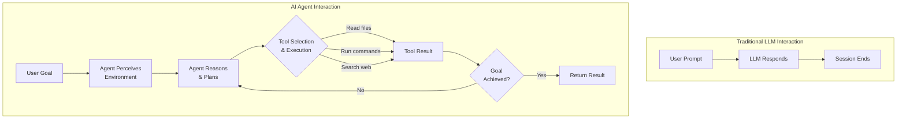
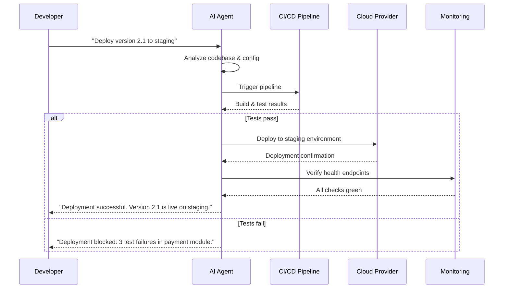
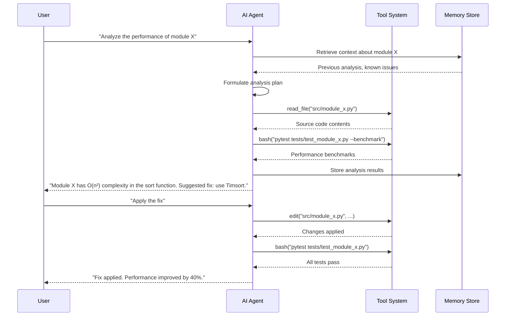

# Introduction to AI Agents

## What Are AI Agents?

AI agents are autonomous software systems that use large language models to perceive their environment, reason about goals, and take actions to accomplish tasks. Unlike simple chatbots that respond to individual prompts, agents maintain context, use tools, plan multi-step workflows, and learn from feedback.



> [!NOTE]
> An AI agent is not just an LLM with a system prompt. It's a loop: perceive → reason → act → observe → re-reason. This cycle is what distinguishes agents from simple chat completions.

---

## Core Capabilities of AI Agents

AI agents possess several distinct capabilities that set them apart from traditional language model interactions:

### 1. Tool Use

Agents can call external tools and APIs to interact with the world. This includes file operations, web searches, code execution, database queries, and more.

```python
import json

# Example: Agent tool registry
class ToolRegistry:
    def __init__(self):
        self.tools = {}

    def register(self, name, handler, description, parameters):
        self.tools[name] = {
            "handler": handler,
            "description": description,
            "parameters": parameters
        }

    def call(self, name, **kwargs):
        if name not in self.tools:
            raise ValueError(f"Tool '{name}' not found")
        return self.tools[name]["handler"](**kwargs)

registry = ToolRegistry()
registry.register(
    name="read_file",
    handler=lambda path: open(path).read(),
    description="Read contents of a file",
    parameters={"path": {"type": "string", "description": "File path"}}
)
registry.register(
    name="web_search",
    handler=lambda query: f"Results for: {query}",
    description="Search the web for information",
    parameters={"query": {"type": "string", "description": "Search query"}}
)

# Agent invokes tools dynamically
result = registry.call("read_file", path="config.json")
print(f"File contents: {result}")
```

### 2. Multi-Step Reasoning

Agents break complex goals into smaller sub-tasks, execute them sequentially, and adapt their plans based on intermediate results.

```json
{
  "agent_plan": {
    "goal": "Deploy the application to production",
    "steps": [
      {
        "step": 1,
        "action": "Run tests",
        "tool": "bash",
        "command": "pytest tests/",
        "expected": "All tests pass"
      },
      {
        "step": 2,
        "action": "Build artifacts",
        "tool": "bash",
        "command": "npm run build",
        "expected": "Build succeeds"
      },
      {
        "step": 3,
        "action": "Deploy to server",
        "tool": "bash",
        "command": "rsync -avz dist/ user@server:/var/www/",
        "conditional": "Only if steps 1 and 2 succeed"
      }
    ]
  }
}
```

### 3. Memory and Context Management

Agents maintain conversational memory, store facts, retrieve relevant context, and summarize long histories to stay within context windows.

```python
class AgentMemory:
    def __init__(self, max_tokens=8192):
        self.short_term = []
        self.long_term = {}
        self.max_tokens = max_tokens

    def add_interaction(self, role, content):
        self.short_term.append({"role": role, "content": content})
        if self._estimate_tokens() > self.max_tokens:
            self._summarize()

    def _estimate_tokens(self):
        return sum(len(m["content"].split()) for m in self.short_term)

    def _summarize(self):
        # Summarize oldest half of interactions
        mid = len(self.short_term) // 2
        old_content = " ".join(
            m["content"] for m in self.short_term[:mid]
        )
        summary = f"[Summary of earlier context: {old_content[:200]}...]"
        self.short_term = self.short_term[mid:]
        self.short_term.insert(0, {"role": "system", "content": summary})

    def recall(self, key):
        return self.long_term.get(key)

    def remember(self, key, value):
        self.long_term[key] = value

memory = AgentMemory()
memory.add_interaction("user", "My project is called 'Nova'. It's a web app.")
memory.add_interaction("assistant", "I'll help you build Nova.")
print(memory.recall("project_name"))  # None - not stored in long-term

# Store important facts long-term
memory.remember("project_name", "Nova")
memory.remember("tech_stack", ["Python", "React", "PostgreSQL"])
print(f"Project: {memory.recall('project_name')}")
```

> [!TIP]
> Use long-term memory for facts that persist across sessions (user preferences, project constants) and short-term memory for conversational context within a single session.

---

## Agent Autonomy Levels

Agents operate at different levels of autonomy depending on the use case and trust requirements:

| Level | Name | Description | Example |
|-------|------|-------------|---------|
| 0 | No autonomy | LLM generates text only, no tools | Chat completion |
| 1 | Tool-assisted | LLM can suggest tools but user approves | Copilot suggestions |
| 2 | Semi-autonomous | Agent executes tools but asks for confirmation on critical actions | Code review with human approval |
| 3 | Conditional autonomous | Agent executes freely within defined guardrails | CI/CD pipeline automation |
| 4 | Fully autonomous | Agent operates independently with self-defined goals | Long-running research agents |

```yaml
# Agent autonomy configuration
agent_config:
  name: "semi-autonomous-coder"
  autonomy_level: 2
  guardrails:
    - action: "write"
      requires_approval: true
      paths: ["src/**"]
    - action: "bash"
      requires_approval: true
      patterns: ["rm *", "sudo *", "> /dev/*"]
    - action: "read"
      requires_approval: false
    - action: "grep"
      requires_approval: false
  fallback:
    on_uncertainty: "ask_user"
    on_error: "stop_and_report"
```

> [!WARNING]
> Higher autonomy levels introduce risk. Always start at level 2 (semi-autonomous) when deploying new agents in production environments. Gradually increase autonomy as you validate the agent's behavior through rigorous testing.

---

## Real-World Use Cases

AI agents excel in scenarios that require multi-step reasoning, tool interaction, and adaptive planning:

### Code Generation and Refactoring

Agents can generate boilerplate code, refactor existing codebases, and maintain consistency across files.

```python
# Agent-driven code refactoring workflow
def refactor_function(source_code: str, target_style: str) -> str:
    """Agent analyzes code, plans refactoring, executes changes."""
    analysis = {
        "issues": [
            {"line": 15, "type": "long_function", "suggestion": "Split into helpers"},
            {"line": 42, "type": "magic_number", "suggestion": "Use constant"},
            {"line": 78, "type": "duplicate_code", "suggestion": "Extract method"}
        ],
        "complexity": "moderate",
        "estimated_effort": "15 minutes"
    }
    # Agent would iteratively apply changes
    refactored = source_code  # Transformation happens here
    return refactored
```

### Automated Testing

Agents create test suites, generate edge cases, and validate behavior.

```yaml
# Agent test generation plan
test_plan:
  source_file: "src/payment/processor.py"
  generated_tests:
    - file: "tests/test_payment_processor.py"
      test_cases:
        - name: "test_successful_payment"
          input: {"amount": 100, "currency": "USD"}
          expected: {"status": "success", "transaction_id": str}
        - name: "test_insufficient_funds"
          input: {"amount": 99999, "currency": "USD"}
          expected: {"status": "failed", "reason": "insufficient_funds"}
        - name: "test_invalid_currency"
          input: {"amount": 50, "currency": "XYZ"}
          expected: {"status": "error", "message": "Unsupported currency"}
      coverage_target: 85
```

### Documentation and Knowledge Management

Agents maintain documentation, answer questions about codebases, and generate API references.

### DevOps and Infrastructure

Agents manage deployments, monitor systems, and respond to incidents.



---

## Agent vs Traditional LLM: Comparison

| Aspect | Traditional LLM | AI Agent |
|--------|----------------|----------|
| **Interaction model** | Request-response | Goal-oriented loop |
| **State** | Stateless (per prompt) | Stateful (across steps) |
| **Tool use** | None (text only) | Dynamic tool invocation |
| **Planning** | None | Multi-step decomposition |
| **Memory** | Limited to context window | Structured memory systems |
| **Error recovery** | None | Retry, fallback, adaptation |
| **Autonomy** | None | Configurable autonomy levels |
| **Observability** | Prompt/response logs | Full action traces |

> [!SUCCESS]
> AI agents represent a paradigm shift from passive text generation to active task execution. By combining LLM reasoning with tool use, memory, and planning, agents can autonomously complete complex software engineering workflows that previously required human intervention.

---

## Agent Communication Patterns

Agents communicate with users, tools, and other agents through structured patterns:



> [!TIP]
| Design agents to communicate their reasoning process, not just results. This transparency builds trust and makes debugging easier when agents make mistakes.

---

## Practice Exercises

```question
{
  "id": "aa-01-q1",
  "type": "multiple-choice",
  "question": "What is the key difference between a traditional LLM interaction and an AI agent?",
  "options": [
    "AI agents use larger models than traditional LLMs",
    "AI agents operate in a perceive-reason-act loop rather than simple request-response",
    "AI agents can only be used for coding tasks",
    "Traditional LLMs cannot generate text"
  ],
  "correct": 1,
  "explanation": "AI agents operate in an autonomous loop: they perceive their environment, reason about goals, take actions using tools, observe results, and re-reason. Traditional LLMs only generate text responses to individual prompts without tool interaction or multi-step planning."
}
```

```question
{
  "id": "aa-01-q2",
  "type": "multiple-choice",
  "question": "At which autonomy level does an agent execute tools freely within defined guardrails without requiring human approval for routine actions?",
  "options": [
    "Level 1: Tool-assisted",
    "Level 2: Semi-autonomous",
    "Level 3: Conditional autonomous",
    "Level 4: Fully autonomous"
  ],
  "correct": 2,
  "explanation": "Level 3 (Conditional autonomous) allows the agent to execute freely within defined guardrails. Level 2 requires human approval for critical actions, while Level 4 gives the agent complete independence including self-defined goals."
}
```

```question
{
  "id": "aa-01-q3",
  "type": "multiple-choice",
  "question": "A development team wants an agent that can read files, search code, and suggest changes, but requires human approval before writing any file. Which autonomy level should they configure?",
  "options": [
    "Level 0: No autonomy",
    "Level 1: Tool-assisted",
    "Level 2: Semi-autonomous",
    "Level 3: Conditional autonomous"
  ],
  "correct": 2,
  "explanation": "Level 2 (Semi-autonomous) allows the agent to use tools like read and grep freely, but requires explicit human approval for write operations. This matches the team's requirement of read/search autonomy with write safeguards."
}
```

```question
{
  "id": "aa-01-q4",
  "type": "multiple-choice",
  "question": "In the context of agent memory, what is the primary purpose of the summarization mechanism?",
  "options": [
    "To encrypt sensitive conversation data",
    "To compress older context and stay within token limits",
    "To translate conversations between languages",
    "To delete all conversation history periodically"
  ],
  "correct": 1,
  "explanation": "Summarization compresses older portions of the conversation into a concise summary, allowing the agent to retain essential context while staying within the model's token limit. This is crucial because models have finite context windows."
}
```

```question
{
  "id": "aa-01-q5",
  "type": "multiple-choice",
  "question": "Which capability allows an AI agent to interact with external systems like databases, file systems, and web APIs?",
  "options": [
    "Multi-step reasoning",
    "Memory and context management",
    "Tool use",
    "Natural language understanding"
  ],
  "correct": 2,
  "explanation": "Tool use is the capability that enables agents to call external functions and APIs. Through a tool registry, agents can invoke operations like reading files, executing commands, searching the web, and querying databases."
}
```

```question
{
  "id": "aa-01-q6",
  "type": "multiple-choice",
  "question": "When an agent encounters an unexpected error during a multi-step plan, what should it do according to best practices?",
  "options": [
    "Ignore the error and continue with the next step",
    "Stop completely and delete all work done so far",
    "Analyze the error, attempt recovery or retry, and adapt the plan if needed",
    "Ask the user to complete the remaining steps manually"
  ],
  "correct": 2,
  "explanation": "Robust agents should analyze errors, attempt recovery strategies (retry with different parameters, use alternative approaches), and adapt their plans accordingly. This resilience is a key characteristic that distinguishes agents from simple scripts."
}
```

```question
{
  "id": "aa-01-q7",
  "type": "multiple-choice",
  "question": "What information should an agent store in long-term memory vs short-term memory?",
  "options": [
    "Everything goes to long-term memory",
    "Conversation flow goes to long-term, project facts go to short-term",
    "Project facts and user preferences go to long-term, conversation context goes to short-term",
    "There is no difference between long-term and short-term memory"
  ],
  "correct": 2,
  "explanation": "Long-term memory is for persistent facts like project names, user preferences, and technical decisions that should survive across sessions. Short-term memory holds conversational context within a single session and is subject to summarization when token limits are approached."
}
```

```question
{
  "id": "aa-01-q8",
  "type": "multiple-choice",
  "question": "A user asks an agent to 'improve the performance of the data processing pipeline.' The agent reads the code, identifies a slow algorithm, replaces it, tests it, and reports the improvement. This is an example of which agent characteristic?",
  "options": [
    "Single-turn response generation",
    "Multi-step reasoning with tool use and adaptive planning",
    "Database querying capability",
    "Model fine-tuning"
  ],
  "correct": 1,
  "explanation": "This scenario demonstrates multi-step reasoning: the agent decomposed the goal (read code → analyze → fix → test → report), used tools (read, edit, bash), and adapted its actions based on intermediate results. This is the hallmark of an AI agent compared to a simple LLM."
}
```

---

[!SUCCESS] **Key Takeaways**

- AI agents are autonomous systems that perceive, reason, act, and learn in a continuous loop
- Core agent capabilities include tool use, multi-step reasoning, and structured memory management
- Autonomy levels range from 0 (no autonomy) to 4 (fully autonomous), with most production agents operating at level 2 or 3
- Tool registries allow agents to interact with files, commands, APIs, and databases dynamically
- Memory systems combine short-term context with long-term persistent storage
- Agents excel at complex workflows: code generation, testing, documentation, and DevOps
- The perceive-reason-act loop fundamentally distinguishes agents from traditional chat-based LLMs
- Start with lower autonomy levels and increase gradually as agent behavior is validated
