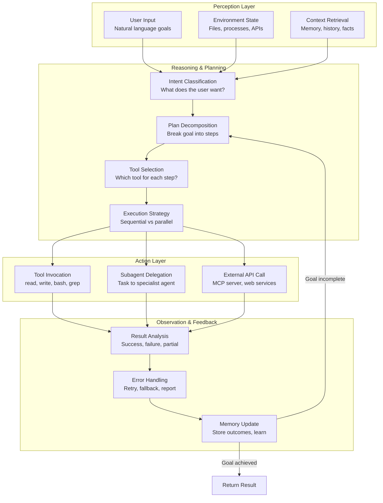
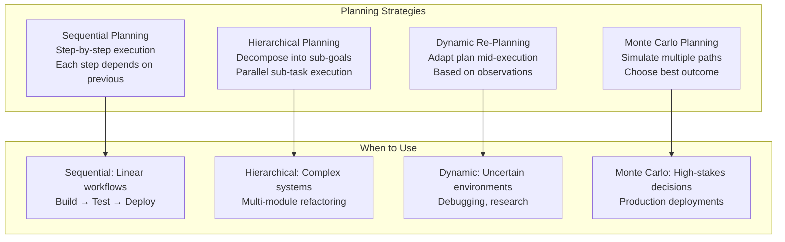
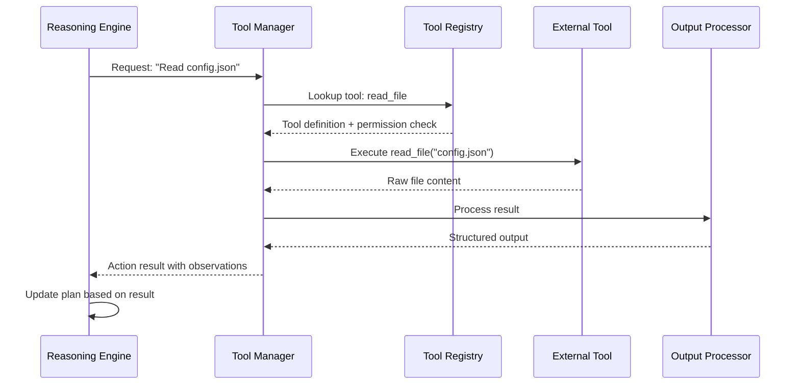

# Agent Architecture

## The Agent Loop

Every AI agent follows a fundamental loop: perceive the environment, reason about the current state, plan actions, execute them, observe results, and repeat. This architecture is what enables agents to autonomously complete complex tasks.



> [!NOTE]
> The agent loop is not necessarily linear. Modern agents use dynamic re-planning: if a step fails, the agent doesn't restart — it re-evaluates the plan from the current state and adapts.

---

## Perception Layer

The perception layer is how the agent receives information about its environment. It processes multiple input channels simultaneously.

```python
class PerceptionLayer:
    def __init__(self):
        self.channels = {}

    def register_channel(self, name, parser):
        self.channels[name] = parser

    def perceive(self, inputs):
        perception = {}
        for channel, data in inputs.items():
            if channel in self.channels:
                perception[channel] = self.channels[channel](data)
        return perception

    def parse_user_input(self, text):
        return {
            "raw": text,
            "intent": self._classify_intent(text),
            "entities": self._extract_entities(text),
            "urgency": self._detect_urgency(text)
        }

    def _classify_intent(self, text):
        intents = {
            "generate": ["create", "write", "implement", "build"],
            "analyze": ["analyze", "review", "check", "audit"],
            "modify": ["change", "update", "refactor", "fix"],
            "query": ["what", "how", "why", "where", "when"]
        }
        for intent, keywords in intents.items():
            if any(kw in text.lower() for kw in keywords):
                return intent
        return "unknown"

    def _extract_entities(self, text):
        # Extract file paths, function names, etc.
        import re
        files = re.findall(r'[\w./-]+\.\w+', text)
        return {"files": files}

    def _detect_urgency(self, text):
        urgent_markers = ["urgent", "asap", "critical", "immediately", "now"]
        return any(m in text.lower() for m in urgent_markers)

perceiver = PerceptionLayer()
result = perceiver.parse_user_input(
    "Urgent: refactor the auth module in src/auth.py to use JWT tokens"
)
print(f"Intent: {result['intent']}")
print(f"Files: {result['entities']['files']}")
print(f"Urgent: {result['urgency']}")
```

### Perception Channels

| Channel | Source | Data Type | Example |
|---------|--------|-----------|---------|
| User input | Natural language message | Text with intent/entities | "Find the bug in process.py" |
| File system | Project files | File contents, metadata | Source code, configs |
| Environment | OS, processes | System state, env vars | Running services, ports |
| Memory | Agent's storage | Past interactions, facts | Previous decisions |
| Tool output | Command results | stdout, stderr, exit codes | Test results, build logs |
| External APIs | Web services | JSON, XML, binary | GitHub issues, Slack |

> [!TIP]
> Design your perception layer to be extensible. As your agent grows, you'll want to add new input channels (Slack, email, monitoring alerts) without rewriting the core architecture.

---

## Reasoning Engine

The reasoning engine is the brain of the agent. It interprets perceptions, makes decisions, and formulates plans.

```python
class ReasoningEngine:
    def __init__(self, llm_client):
        self.llm = llm_client
        self.plan = []

    def analyze_state(self, perception, memory):
        prompt = f"""
        Current state: {perception}
        Available context: {memory.get_relevant(perception)}
        
        Analyze the situation and determine:
        1. What is the primary goal?
        2. What constraints exist?
        3. What tools are needed?
        4. What could go wrong?
        """
        return self.llm.complete(prompt)

    def decompose_goal(self, goal, available_tools):
        prompt = f"""
        Goal: {goal}
        Available tools: {list(available_tools.keys())}
        
        Break this goal into sequential steps.
        Each step must specify:
        - Action description
        - Tool to use
        - Expected outcome
        - Error recovery strategy
        """
        response = self.llm.complete(prompt)
        steps = self._parse_steps(response)
        self.plan = steps
        return steps

    def _parse_steps(self, llm_response):
        # Parse LLM response into structured steps
        steps = []
        for line in llm_response.split("\n"):
            if line.strip().startswith("- Step"):
                steps.append({"raw": line.strip()})
        return steps

    def select_tool(self, step, tool_registry):
        scores = {}
        for name, tool in tool_registry.items():
            relevance = self._compute_relevance(step, tool["description"])
            scores[name] = relevance
        return max(scores, key=scores.get)

    def _compute_relevance(self, step, description):
        # Simplified relevance scoring
        keywords = set(step.lower().split())
        desc_keywords = set(description.lower().split())
        overlap = keywords & desc_keywords
        return len(overlap) / max(len(keywords), 1)

engine = ReasoningEngine(llm_client=None)  # Would use real LLM
tools = {
    "read_file": {"description": "Read file contents from disk"},
    "bash": {"description": "Execute shell commands"},
    "web_search": {"description": "Search the internet"},
}
print(engine.select_tool("read the configuration file", tools))
```

---

## Planning Strategies

Agents use different planning strategies depending on the task complexity and requirements:



```yaml
# Sequential planning configuration
planning:
  strategy: sequential
  max_retries: 3
  stop_on_failure: true
  plan:
    - id: 1
      action: "lint"
      tool: "bash"
      command: "ruff check src/"
    - id: 2
      action: "type_check"
      tool: "bash"
      command: "mypy src/"
      depends_on: [1]
    - id: 3
      action: "test"
      tool: "bash"
      command: "pytest tests/"
      depends_on: [2]
    - id: 4
      action: "build"
      tool: "bash"
      command: "python -m build"
      depends_on: [3]
```

> [!WARNING]
> Sequential planning is simple but fragile. A failure in step 1 halts the entire pipeline. Always include error recovery strategies and consider parallel execution for independent steps.

### Dynamic Re-Planning in Action

```python
class DynamicPlanner:
    def __init__(self, llm):
        self.llm = llm
        self.execution_history = []

    def execute_plan(self, initial_goal, tools):
        current_goal = initial_goal
        current_plan = self._create_plan(current_goal)

        while not self._goal_achieved(current_goal):
            for step in current_plan:
                result = self._execute_step(step, tools)
                self.execution_history.append({
                    "step": step,
                    "result": result,
                    "success": result["status"] == "ok"
                })

                if result["status"] == "error":
                    # Dynamic re-planning
                    recovery = self._plan_recovery(step, result)
                    if recovery["strategy"] == "retry":
                        current_plan = self._adjust_plan(
                            current_plan, step, recovery
                        )
                    elif recovery["strategy"] == "alternative":
                        alternative = recovery["alternative_action"]
                        current_plan = self._replace_step(
                            current_plan, step, alternative
                        )
                    elif recovery["strategy"] == "abort":
                        return {"status": "failed", "at": step}

        return {"status": "success", "history": self.execution_history}

    def _create_plan(self, goal):
        return [{"id": 1, "action": f"Process: {goal}"}]

    def _execute_step(self, step, tools):
        # Simulated execution
        return {"status": "ok", "output": f"Executed {step['action']}"}

    def _goal_achieved(self, goal):
        return False

    def _plan_recovery(self, failed_step, error):
        return {"strategy": "retry", "max_attempts": 3}

    def _adjust_plan(self, plan, failed_step, recovery):
        return plan

    def _replace_step(self, plan, old_step, new_action):
        return plan

planner = DynamicPlanner(llm=None)
result = planner.execute_plan("Deploy application", {})
print(f"Execution status: {result['status']}")
```

---

## State Management

Agents must track state across the execution loop. State includes the current goal, completed steps, tool results, and accumulated context.

```json
{
  "agent_state": {
    "session_id": "sess_abc123",
    "status": "executing",
    "current_goal": "Refactor payment module",
    "plan": {
      "strategy": "hierarchical",
      "sub_goals": [
        {
          "id": "sg_1",
          "description": "Analyze current payment code",
          "status": "completed",
          "result": "Found 3 areas for improvement"
        },
        {
          "id": "sg_2",
          "description": "Implement error handling improvements",
          "status": "in_progress",
          "current_step": {
            "action": "edit",
            "file": "src/payment/processor.py",
            "target": "validate_amount function"
          }
        },
        {
          "id": "sg_3",
          "description": "Add test coverage for new error paths",
          "status": "pending",
          "dependencies": ["sg_2"]
        }
      ]
    },
    "memory": {
      "short_term": [
        {"role": "user", "content": "Refactor the payment module..."},
        {"role": "assistant", "content": "I'll analyze the current code first."}
      ],
      "working": {
        "current_file": "src/payment/processor.py",
        "last_function": "validate_amount",
        "changes_made": 2
      }
    },
    "tool_history": [
      {"tool": "grep", "pattern": "def validate", "result": "Found at line 142"},
      {"tool": "read", "file": "src/payment/processor.py", "lines": "140-180"}
    ]
  }
}
```

### State Machine for Agent Lifecycle

```python
from enum import Enum

class AgentState(Enum):
    IDLE = "idle"
    PERCEIVING = "perceiving"
    REASONING = "reasoning"
    PLANNING = "planning"
    EXECUTING = "executing"
    OBSERVING = "observing"
    ERROR = "error"
    COMPLETED = "completed"

class StateMachine:
    def __init__(self):
        self.state = AgentState.IDLE
        self.transitions = {
            AgentState.IDLE: [AgentState.PERCEIVING],
            AgentState.PERCEIVING: [AgentState.REASONING, AgentState.ERROR],
            AgentState.REASONING: [AgentState.PLANNING, AgentState.ERROR],
            AgentState.PLANNING: [AgentState.EXECUTING, AgentState.ERROR],
            AgentState.EXECUTING: [AgentState.OBSERVING, AgentState.ERROR],
            AgentState.OBSERVING: [AgentState.REASONING, AgentState.COMPLETED, AgentState.ERROR],
            AgentState.ERROR: [AgentState.IDLE, AgentState.REASONING],
            AgentState.COMPLETED: [AgentState.IDLE]
        }

    def transition_to(self, new_state):
        if new_state in self.transitions[self.state]:
            old = self.state
            self.state = new_state
            print(f"State: {old.value} → {new_state.value}")
            return True
        raise ValueError(f"Cannot transition from {self.state} to {new_state}")

    def reset(self):
        self.state = AgentState.IDLE

sm = StateMachine()
sm.transition_to(AgentState.PERCEIVING)
sm.transition_to(AgentState.REASONING)
sm.transition_to(AgentState.PLANNING)
sm.transition_to(AgentState.EXECUTING)
sm.transition_to(AgentState.OBSERVING)
sm.transition_to(AgentState.COMPLETED)
```

> [!TIP]
> Use a state machine to make agent behavior predictable and debuggable. Each state transition can be logged, monitored, and tested independently.

---

## Tool Integration Architecture

The tool integration layer connects the agent's reasoning to external actions. It manages discovery, invocation, and result processing.



```python
class ToolManager:
    def __init__(self, registry, permission_system):
        self.registry = registry
        self.permissions = permission_system
        self.execution_log = []

    async def execute(self, tool_name, params):
        # Check permissions first
        if not self.permissions.is_allowed(tool_name, params):
            return {
                "status": "denied",
                "tool": tool_name,
                "reason": "Permission denied"
            }

        # Validate parameters against schema
        tool_def = self.registry.get(tool_name)
        errors = self._validate_params(tool_def, params)
        if errors:
            return {"status": "error", "errors": errors}

        # Execute with timeout
        try:
            result = await self.registry.call(tool_name, **params)
            processed = self._process_output(result)
            self.execution_log.append({
                "tool": tool_name,
                "params": params,
                "result": processed,
                "timestamp": __import__('time').time()
            })
            return {"status": "success", "data": processed}
        except Exception as e:
            return {"status": "error", "error": str(e)}

    def _validate_params(self, tool_def, params):
        errors = []
        schema = tool_def.get("parameters", {})
        for key, spec in schema.items():
            if spec.get("required") and key not in params:
                errors.append(f"Missing required parameter: {key}")
        return errors

    def _process_output(self, output):
        if isinstance(output, str) and len(output) > 1000:
            return {
                "content": output[:1000] + "...[truncated]",
                "full_length": len(output)
            }
        return {"content": output}
```

---

## Architecture Comparison: Agent Frameworks

| Aspect | Simple Loop | Hierarchical | Event-Driven | Reactive |
|--------|-------------|--------------|--------------|----------|
| **Structure** | Linear perceive→reason→act | Sub-agents with managers | Pub/sub event bus | Stimulus-response |
| **State** | Single stack | Distributed | Shared event store | Minimal |
| **Scalability** | Limited | High | Very high | Moderate |
| **Error isolation** | Poor | Good | Excellent | Fair |
| **Use case** | Simple automation | Complex workflows | Real-time systems | Game AI |
| **Example** | Personal assistant | Multi-agent coding | Monitoring agent | Chatbot |

> [!SUCCESS]
| The agent loop (perceive → reason → plan → act → observe) is the universal pattern underlying all agent architectures. Master this loop, and you can implement any agent framework.

---

## Practice Exercises

```question
{
  "id": "aa-02-q1",
  "type": "multiple-choice",
  "question": "In the agent loop, after executing an action and observing the result, what happens if the goal is not yet achieved?",
  "options": [
    "The agent terminates immediately",
    "The agent returns to the reasoning/planning phase",
    "The agent repeats the same action indefinitely",
    "The agent waits for user input"
  ],
  "correct": 1,
  "explanation": "If the goal is not achieved after observation, the agent returns to the reasoning/planning phase to re-evaluate the situation and adjust its plan. This is the feedback loop that enables adaptive behavior."
}
```

```question
{
  "id": "aa-02-q2",
  "type": "multiple-choice",
  "question": "Which planning strategy is most appropriate for a linear workflow like build → test → deploy?",
  "options": [
    "Monte Carlo planning",
    "Hierarchical planning",
    "Sequential planning",
    "Reactive planning"
  ],
  "correct": 2,
  "explanation": "Sequential planning is ideal for linear workflows where each step depends on the previous one. Build must succeed before testing, and testing must pass before deployment."
}
```

```question
{
  "id": "aa-02-q3",
  "type": "multiple-choice",
  "question": "What is the purpose of the perception layer in an agent architecture?",
  "options": [
    "To execute shell commands",
    "To store long-term memories",
    "To receive and parse inputs from multiple channels",
    "To generate final responses to the user"
  ],
  "correct": 2,
  "explanation": "The perception layer is responsible for receiving inputs from various channels (user messages, file system, environment, APIs) and parsing them into structured data that the reasoning engine can process."
}
```

```question
{
  "id": "aa-02-q4",
  "type": "multiple-choice",
  "question": "When a step fails during sequential execution, what is the recommended recovery approach for a robust agent?",
  "options": [
    "Restart the entire plan from the beginning",
    "Ignore the failure and continue with the next step",
    "Analyze the error, retry or find an alternative approach, then adapt the plan",
    "Report to the user and stop all further execution"
  ],
  "correct": 2,
  "explanation": "A robust agent uses dynamic re-planning: it analyzes the error, attempts recovery (retry with modifications or alternative approach), and adapts the remaining plan accordingly. This resilience is essential for production agents."
}
```

```question
{
  "id": "aa-02-q5",
  "type": "multiple-choice",
  "question": "In the Tool Manager pattern, what check happens before a tool is executed?",
  "options": [
    "The tool is compiled from source",
    "Permissions are verified against the allow/deny rules",
    "The tool is downloaded from a remote registry",
    "The LLM model is fine-tuned for the specific tool"
  ],
  "correct": 1,
  "explanation": "The Tool Manager checks permissions before executing any tool. If the permission system denies the action based on configured allow/deny rules, the tool is not executed and a denial response is returned."
}
```

```question
{
  "id": "aa-02-q6",
  "type": "multiple-choice",
  "question": "An agent is debugging a complex issue and encounters unexpected results that invalidate its initial plan. Which planning strategy is best suited for this scenario?",
  "options": [
    "Sequential planning with no deviation",
    "Dynamic re-planning to adapt to new observations",
    "Monte Carlo simulation of all possible plans",
    "No planning - execute all actions simultaneously"
  ],
  "correct": 1,
  "explanation": "Dynamic re-planning allows the agent to adapt its plan based on new information discovered during execution. This is essential for debugging and research tasks where the path to the goal is uncertain."
}
```

```question
{
  "id": "aa-02-q7",
  "type": "multiple-choice",
  "question": "What is the benefit of using a state machine to manage agent lifecycle?",
  "options": [
    "It makes the agent run faster",
    "It eliminates the need for error handling",
    "It makes behavior predictable, logged, and testable",
    "It allows the agent to use multiple LLMs simultaneously"
  ],
  "correct": 2,
  "explanation": "A state machine makes agent behavior predictable and debuggable. Each state transition can be logged, monitored, and tested independently, making it easier to understand and fix issues in agent behavior."
}
```

```question
{
  "id": "aa-02-q8",
  "type": "multiple-choice",
  "question": "In a hierarchical planning architecture, what happens when a sub-goal fails?",
  "options": [
    "The entire top-level goal is abandoned",
    "Only the failed sub-goal's branch is affected; other branches continue",
    "All sub-goals are restarted from scratch",
    "The system automatically switches to a different LLM model"
  ],
  "correct": 1,
  "explanation": "In hierarchical planning, sub-goals are somewhat independent. If one sub-goal fails, the system can isolate the failure to that branch while other parallel sub-goals continue execution. The parent planner can then decide to retry, skip, or compensate for the failed sub-goal."
}
```

---

[!SUCCESS] **Key Takeaways**

- The agent loop (perceive → reason → plan → act → observe) is the universal pattern for all agent architectures
- The perception layer processes inputs from multiple channels: user messages, files, environment, APIs
- The reasoning engine interprets state and makes decisions, often delegating to LLMs for complex analysis
- Planning strategies include sequential, hierarchical, dynamic re-planning, and Monte Carlo approaches
- Dynamic re-planning enables agents to recover from failures and adapt to unexpected observations
- State machines make agent behavior predictable, logged, and testable
- Tool managers handle permission checks, parameter validation, execution, and output processing
- Different architectures (simple loop, hierarchical, event-driven) suit different use cases
