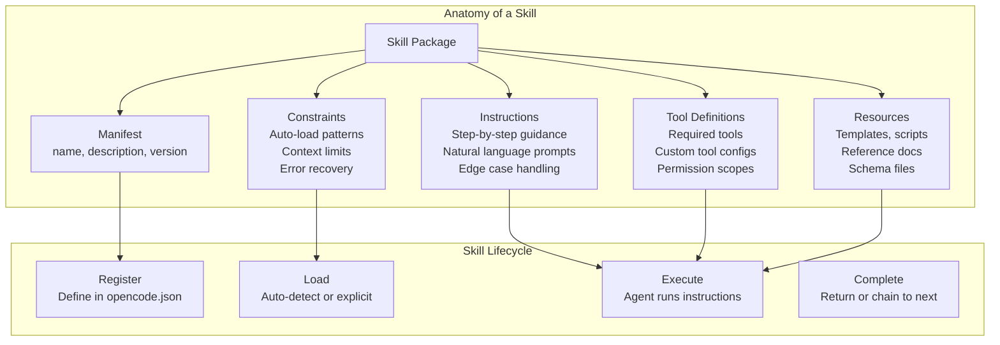
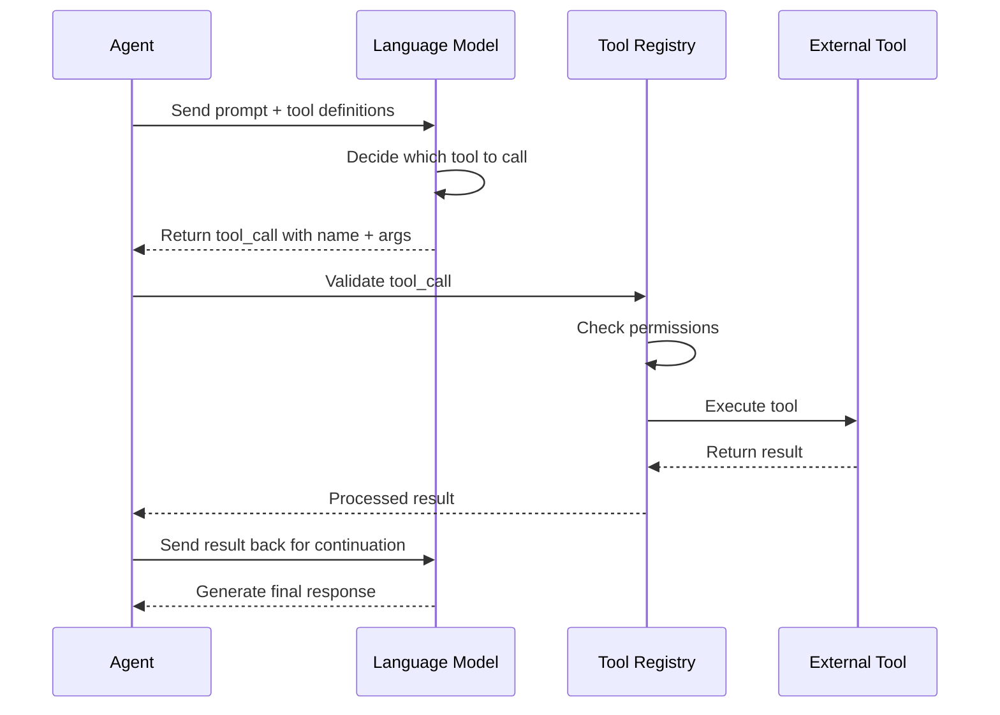

# Skills & Capabilities

## What Are Agent Skills?

Skills are reusable, composable units of capability that teach an AI agent how to perform specific tasks. Unlike monolithic agent prompts, skills are modular, testable, and can be shared across different agents. A skill encapsulates instructions, tool configurations, resources, and constraints needed to accomplish a well-defined task.



> [!NOTE]
> A skill is not the same as a plugin. Skills are instruction packages that guide agent behavior; plugins (MCP servers) are external processes that provide tools. Skills tell the agent *how* to use tools; plugins provide the tools themselves.

---

## Skill Manifest Definition

Every skill starts with a manifest file that declares its identity, capabilities, and loading behavior.

```yaml
# skills/code-reviewer/skill.yaml
name: code-reviewer
version: "1.2.0"
description: |
  Performs comprehensive code reviews focusing on security,
  performance, maintainability, and best practices.

author: "NUniversity"
license: "MIT"

instructions:
  - path: instructions/review-process.md
  - path: instructions/security-checklist.md
  - path: instructions/performance-guidelines.md

tools:
  required:
    - read
    - grep
    - glob
  optional:
    - bash
    - websearch

resources:
  - path: resources/owasp-top10.yaml
    description: OWASP Top 10 vulnerability reference
  - path: resources/style-guide.md
    description: Project-specific style guide

autoload:
  enabled: true
  matchPattern: "review|audit|inspect|check code"

constraints:
  maxTokens: 4096
  temperature: 0.3
  allowedTools:
    - read
    - grep
    - glob
  deniedTools:
    - write
    - edit

errorRecovery:
  onFailure: "report_and_stop"
  maxRetries: 2
```

> [!TIP]
| Use `matchPattern` for auto-loading to make skills feel magical. When a user says "review the auth module," the skill automatically activates without requiring the user to know about skill management.

---

## Skill Instructions

Instructions are the core of a skill. They provide step-by-step guidance that the agent follows to complete the task.

```markdown
<!-- skills/code-reviewer/instructions/review-process.md -->
# Code Review Process

## Step 1: Understand the Code
- Read the target file(s) using the `read` tool
- Identify all functions, classes, and their relationships
- Note the programming language and framework

## Step 2: Security Analysis
- Check for OWASP Top 10 vulnerabilities
  - SQL injection: look for raw SQL queries
  - XSS: check unescaped user input in templates
  - CSRF: verify token implementation
- Review authentication and authorization logic

## Step 3: Performance Assessment
- Identify O(n²) algorithms and suggest optimizations
- Check for unnecessary I/O operations
- Review database query patterns for N+1 problems

## Step 4: Code Quality
- Evaluate naming conventions and code organization
- Check error handling coverage
- Verify test coverage and test quality

## Step 5: Report Generation
- Summarize findings by severity (critical, major, minor)
- Provide specific line references for each issue
- Suggest concrete fixes with code examples
```

```python
# Skill instructions can also be programmatic
class CodeReviewSkill:
    def __init__(self, agent):
        self.agent = agent
        self.findings = []

    async def execute(self, target_path):
        # Step 1: Read and understand
        code = await self.agent.read(target_path)

        # Step 2: Analyze
        security_issues = self._check_security(code)
        perf_issues = self._check_performance(code)
        quality_issues = self._check_quality(code)

        # Step 3: Generate report
        report = self._generate_report(
            target_path,
            security_issues + perf_issues + quality_issues
        )
        return report

    def _check_security(self, code):
        issues = []
        if "execute(" in code or "eval(" in code:
            issues.append({
                "severity": "critical",
                "type": "code_injection",
                "description": "Use of dangerous functions"
            })
        if "SELECT" in code and "WHERE" not in code:
            issues.append({
                "severity": "critical",
                "type": "sql_injection",
                "description": "Unparameterized SQL query"
            })
        return issues

    def _check_performance(self, code):
        issues = []
        lines = code.split("\n")
        for i, line in enumerate(lines, 1):
            if "for" in line and "for" in lines[i:]:
                issues.append({
                    "severity": "major",
                    "type": "nested_loop",
                    "line": i,
                    "description": f"Nested loop detected at line {i}"
                })
        return issues

    def _check_quality(self, code):
        issues = []
        if len(code.split("\n")) > 500:
            issues.append({
                "severity": "minor",
                "type": "file_length",
                "description": "File exceeds 500 lines"
            })
        return issues

    def _generate_report(self, path, all_issues):
        return {
            "file": path,
            "total_issues": len(all_issues),
            "by_severity": {
                "critical": len([i for i in all_issues if i["severity"] == "critical"]),
                "major": len([i for i in all_issues if i["severity"] == "major"]),
                "minor": len([i for i in all_issues if i["severity"] == "minor"])
            },
            "issues": all_issues
        }
```

---

## Tool Use Patterns

Skills define which tools they need and how to use them. There are several patterns for tool use:

### 1. Direct Tool Invocation

The agent calls a tool directly with parameters.

```json
{
  "tool_call": {
    "name": "read",
    "arguments": {
      "filePath": "src/config.py"
    }
  }
}
```

### 2. Chained Tool Calls

The output of one tool feeds into the next.

```python
async def chained_analysis(agent, target_dir):
    # Chain: glob → read → grep → analyze
    files = await agent.glob(f"{target_dir}/**/*.py")
    results = []
    for file in files[:5]:  # Limit to 5 files
        content = await agent.read(file)
        matches = await agent.grep("TODO|FIXME|HACK", path=file)
        results.append({
            "file": file,
            "lines": len(content.split("\n")),
            "todos": len(matches)
        })
    return results
```

### 3. Conditional Tool Execution

Tools are selected based on the context.

```yaml
conditional_execution:
  - condition: "file_extension == '.py'"
    then:
      - tool: "bash"
        command: "ruff check {file}"
  - condition: "file_extension == '.js'"
    then:
      - tool: "bash"
        command: "eslint {file}"
  - condition: "file_extension == '.rs'"
    then:
      - tool: "bash"
        command: "cargo check"
```

### 4. Parallel Tool Execution

Independent tools run simultaneously for efficiency.

```python
import asyncio

async def parallel_code_analysis(agent, file_path):
    # Independent analyses run in parallel
    tasks = [
        agent.grep("security|vulnerability", path=file_path),
        agent.grep("TODO|FIXME", path=file_path),
        agent.bash(f"wc -l {file_path}"),
        agent.bash(f"ruff check {file_path}")
    ]
    results = await asyncio.gather(*tasks)
    return {
        "security_mentions": results[0],
        "todos": results[1],
        "line_count": results[2].strip(),
        "lint_errors": results[3]
    }
```

---

## Function Calling Protocol

Agents expose capabilities through a function calling protocol that defines how tools are described, invoked, and how results are returned.



```yaml
# Function calling schema definition
functions:
  read_file:
    description: "Read the contents of a file"
    parameters:
      type: object
      properties:
        path:
          type: string
          description: "Absolute path to the file"
        offset:
          type: integer
          description: "Line number to start from (0-indexed)"
        limit:
          type: integer
          description: "Maximum number of lines to return"
      required:
        - path
  search_code:
    description: "Search for a pattern in the codebase"
    parameters:
      type: object
      properties:
        pattern:
          type: string
          description: "Regex pattern to search for"
        include:
          type: string
          description: "File glob pattern (e.g., *.py)"
      required:
        - pattern
  execute_command:
    description: "Execute a shell command"
    parameters:
      type: object
      properties:
        command:
          type: string
          description: "Shell command to execute"
      required:
        - command
```

---

## Capability Registration

Agents register their capabilities so that both the agent system and other agents know what they can do.

```python
class CapabilityRegistry:
    def __init__(self):
        self.capabilities = {}

    def register(self, agent_id, capability):
        if agent_id not in self.capabilities:
            self.capabilities[agent_id] = []
        self.capabilities[agent_id].append(capability)

    def find_agents_with_capability(self, required_capability):
        matching = []
        for agent_id, caps in self.capabilities.items():
            for cap in caps:
                if cap.matches(required_capability):
                    matching.append((agent_id, cap))
        return matching

    def get_capability_schema(self, agent_id):
        return [c.to_dict() for c in self.capabilities.get(agent_id, [])]


class Capability:
    def __init__(self, name, description, input_schema, output_schema):
        self.name = name
        self.description = description
        self.input_schema = input_schema
        self.output_schema = output_schema

    def matches(self, query):
        keywords = query.lower().split()
        desc_words = self.description.lower().split()
        name_words = self.name.lower().split()
        all_words = set(desc_words + name_words)
        return any(k in all_words for k in keywords)

    def to_dict(self):
        return {
            "name": self.name,
            "description": self.description,
            "input_schema": self.input_schema,
            "output_schema": self.output_schema
        }


# Register capabilities for different agents
registry = CapabilityRegistry()

registry.register("code-agent", Capability(
    name="code_review",
    description="Review source code for bugs and vulnerabilities",
    input_schema={"file_path": "string"},
    output_schema={"issues": "array", "score": "number"}
))

registry.register("code-agent", Capability(
    name="code_generation",
    description="Generate new source code from specifications",
    input_schema={"spec": "string", "language": "string"},
    output_schema={"code": "string", "language": "string"}
))

registry.register("devops-agent", Capability(
    name="deployment",
    description="Deploy applications to environments",
    input_schema={"environment": "string", "version": "string"},
    output_schema={"status": "string", "url": "string"}
))

# Find agents that can review code
matches = registry.find_agents_with_capability("review code")
print(f"Agents that can review: {[m[0] for m in matches]}")
```

---

## Skill Composition Patterns

Skills can be composed together to handle complex workflows:

| Pattern | Description | Use Case |
|---------|-------------|----------|
| **Sequential** | Skill A → Skill B → Skill C | Build, test, deploy pipeline |
| **Parallel** | Skill A ├── Skill B ├── Skill C | Simultaneous linting, type-check, test |
| **Conditional** | If X then Skill A else Skill B | Production vs staging deployment |
| **Hierarchical** | Meta-skill orchestrates sub-skills | Full project setup |
| **Competitive** | Run A and B, pick best result | Code optimization strategies |

```yaml
# Sequential skill pipeline
workflow:
  name: "full-code-review"
  skills:
    - name: "lint-check"
      autoRun: true
    - name: "security-scan"
      dependsOn: ["lint-check"]
      condition: "lint-check.exit_code == 0"
    - name: "performance-review"
      dependsOn: ["lint-check"]
      parallel: true
    - name: "generate-report"
      dependsOn: ["security-scan", "performance-review"]
      combineStrategy: "merge"
```

> [!WARNING]
> When composing skills, be careful about dependency ordering. A security scan that depends on a lint check should not run in parallel. Always define explicit dependencies and use parallel execution only for truly independent skills.

---

## OpenCode Skill Configuration

In OpenCode, skills are configured in `opencode.json` and can reference YAML manifests.

```json
{
  "skills": {
    "code-reviewer": {
      "manifest": "skills/code-reviewer/skill.yaml",
      "autoLoad": true,
      "matchPattern": "review|audit|inspect"
    },
    "react-component": {
      "manifest": "skills/react-component/skill.yaml",
      "autoLoad": true,
      "matchPattern": "react component|jsx|component"
    },
    "database-migration": {
      "manifest": "skills/database-migration/skill.yaml",
      "autoLoad": false
    }
  },
  "agents": {
    "default": {
      "model": "gpt-4o",
      "description": "Primary coding assistant with all skills",
      "skills": ["code-reviewer", "react-component"]
    },
    "security-specialist": {
      "model": "claude-sonnet-4-20250514",
      "description": "Security-focused agent",
      "skills": ["code-reviewer"],
      "constraints": {
        "allowedTools": ["read", "grep", "glob"],
        "deniedTools": ["write", "edit", "bash"]
      }
    }
  }
}
```

> [!TIP]
> Load skills explicitly when you want an agent to specialize, and use auto-load with match patterns for general-purpose agents. This keeps your configuration clean and your agents focused.

---

## Testing Skills

Skills should be tested to ensure they produce correct and safe results.

```python
import pytest
from unittest.mock import AsyncMock

@pytest.mark.asyncio
async def test_code_review_skill():
    # Setup mock agent
    agent = AsyncMock()
    agent.read.return_value = """
def process(data):
    result = execute(data)  # Dangerous function
    return result
"""
    agent.grep.return_value = []

    # Execute skill
    skill = CodeReviewSkill(agent)
    report = await skill.execute("test.py")

    # Assertions
    assert report["total_issues"] > 0
    assert any(
        i["type"] == "code_injection"
        for i in report["issues"]
    )
    assert report["by_severity"]["critical"] >= 1


@pytest.mark.asyncio
async def test_skill_with_clean_code():
    agent = AsyncMock()
    agent.read.return_value = """
def process(data):
    result = safe_transform(data)
    return result
"""
    agent.grep.return_value = []

    skill = CodeReviewSkill(agent)
    report = await skill.execute("clean.py")
    assert report["total_issues"] == 0
```

---

## Skill Versioning and Distribution

Skills follow semantic versioning and can be distributed as packages.

```yaml
# skill-package.yaml
name: "@nuniversity/code-reviewer"
version: "1.2.0"
description: "AI-powered code review skill"
author: "NUniversity"

dependencies:
  skills:
    - name: "lint-base"
      version: ">=1.0.0"
  tools:
    - name: "read"
    - name: "grep"
    - name: "glob"

changelog:
  "1.2.0":
    - "Added performance analysis module"
    - "Improved error recovery strategies"
    - "Updated OWASP reference to 2024"
  "1.1.0":
    - "Added TypeScript support"
    - "Fixed false positive in SQL injection detection"
```

> [!SUCCESS]
> Skills are the fundamental building blocks of agent capabilities. Well-designed skills are modular, testable, versioned, and composable — turning an agent from a general-purpose assistant into a specialized expert.

---

## Practice Exercises

```question
{
  "id": "aa-03-q1",
  "type": "multiple-choice",
  "question": "What are the four core components of a skill package?",
  "options": [
    "Name, version, author, license",
    "Manifest, instructions, tool definitions, resources",
    "Code, tests, documentation, examples",
    "Model, prompt, temperature, max_tokens"
  ],
  "correct": 1,
  "explanation": "A skill package consists of: manifest (name, description, version), instructions (step-by-step guidance), tool definitions (required/optional tools with configs), and resources (templates, scripts, reference docs)."
}
```

```question
{
  "id": "aa-03-q2",
  "type": "multiple-choice",
  "question": "How does a skill's auto-load feature work in OpenCode?",
  "options": [
    "It loads all skills at startup regardless of context",
    "It matches user requests against the skill's matchPattern and activates automatically",
    "It requires the user to type the skill name explicitly",
    "It loads skills based on the current time of day"
  ],
  "correct": 1,
  "explanation": "Auto-load uses a `matchPattern` regex that is compared against user requests. When a match is found, the skill is automatically activated. For example, if a user says 'review this code' and the skill's pattern is 'review|audit', the skill loads automatically."
}
```

```question
{
  "id": "aa-03-q3",
  "type": "multiple-choice",
  "question": "What is the difference between a skill and a plugin (MCP server)?",
  "options": [
    "Skills are faster than plugins",
    "Skills are instruction packages that guide agent behavior; plugins provide external tools via processes",
    "Plugins are for JavaScript projects only",
    "There is no difference"
  ],
  "correct": 1,
  "explanation": "Skills are instruction packages that guide an agent on how to perform tasks. Plugins (MCP servers) are external processes that provide tool implementations. Skills tell the agent *how* to use tools; plugins provide the tools themselves."
}
```

```question
{
  "id": "aa-03-q4",
  "type": "multiple-choice",
  "question": "In parallel tool execution, what precondition must be met for tools to run simultaneously?",
  "options": [
    "They must use the same programming language",
    "They must be independent with no data dependencies",
    "They must all be read-only operations",
    "They must be registered in the same MCP server"
  ],
  "correct": 1,
  "explanation": "Parallel execution requires that the tools are truly independent with no data dependencies between them. If Tool B needs the output of Tool A, they must run sequentially. Always analyze dependencies before parallelizing."
}
```

```question
{
  "id": "aa-03-q5",
  "type": "multiple-choice",
  "question": "What is the purpose of the Capability Registry pattern?",
  "options": [
    "To store user preferences",
    "To register and discover what abilities different agents have",
    "To cache tool execution results",
    "To manage API keys and secrets"
  ],
  "correct": 1,
  "explanation": "The Capability Registry allows agents to register their abilities and other agents or the orchestrator to discover which agent can handle a specific task. This enables dynamic task routing in multi-agent systems."
}
```

```question
{
  "id": "aa-03-q6",
  "type": "multiple-choice",
  "question": "Which tool use pattern is demonstrated by: read file → search for patterns → analyze results?",
  "options": [
    "Direct tool invocation",
    "Chained tool calls",
    "Parallel tool execution",
    "Conditional tool execution"
  ],
  "correct": 1,
  "explanation": "This is chained tool calls: the output of `read` feeds into the `grep` operation, and the grep results feed into the analysis step. Each step depends on the previous one's output."
}
```

```question
{
  "id": "aa-03-q7",
  "type": "multiple-choice",
  "question": "A skill manifest lists `allowedTools: [read, grep, glob]` and `deniedTools: [write, edit]`. What happens when the agent tries to use the `bash` tool?",
  "options": [
    "bash is allowed because it's not explicitly denied",
    "bash is denied because allowedTools is a whitelist that implicitly denies all other tools",
    "bash is allowed because it's in the tool registry",
    "The behavior is undefined"
  ],
  "correct": 1,
  "explanation": "When `allowedTools` is specified, it acts as a whitelist. All tools not in the list are implicitly denied. The `deniedTools` field is redundant in this case, but confirms the intent. The agent can only use `read`, `grep`, and `glob`."
}
```

```question
{
  "id": "aa-03-q8",
  "type": "multiple-choice",
  "question": "Why should skills follow semantic versioning?",
  "options": [
    "To make the skill package larger",
    "To enable dependency management and communicate breaking changes",
    "To track how many times the skill has been used",
    "Semantic versioning only applies to software libraries, not skills"
  ],
  "correct": 1,
  "explanation": "Semantic versioning (MAJOR.MINOR.PATCH) enables proper dependency management. A major version bump indicates breaking changes, minor adds features, and patch fixes bugs. This is essential when skills depend on other skills or when multiple agents share skill packages."
}
```

---

[!SUCCESS] **Key Takeaways**

- Skills are modular instruction packages with manifests, instructions, tools, and resources
- Auto-load with match patterns enables context-aware skill activation
- Tool use patterns include direct invocation, chained calls, conditional, and parallel execution
- The function calling protocol standardizes how agents discover and invoke tools
- Capability registries enable dynamic agent discovery and task routing
- Skill composition patterns (sequential, parallel, conditional, hierarchical) handle complex workflows
- Skills should be tested independently with mock agents
- Semantic versioning enables proper dependency management and change communication
- Skills and plugins serve different purposes: instructions vs tool implementations
