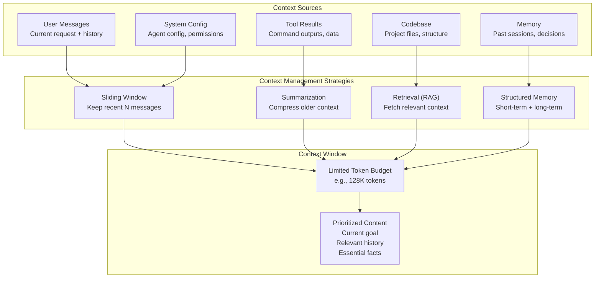
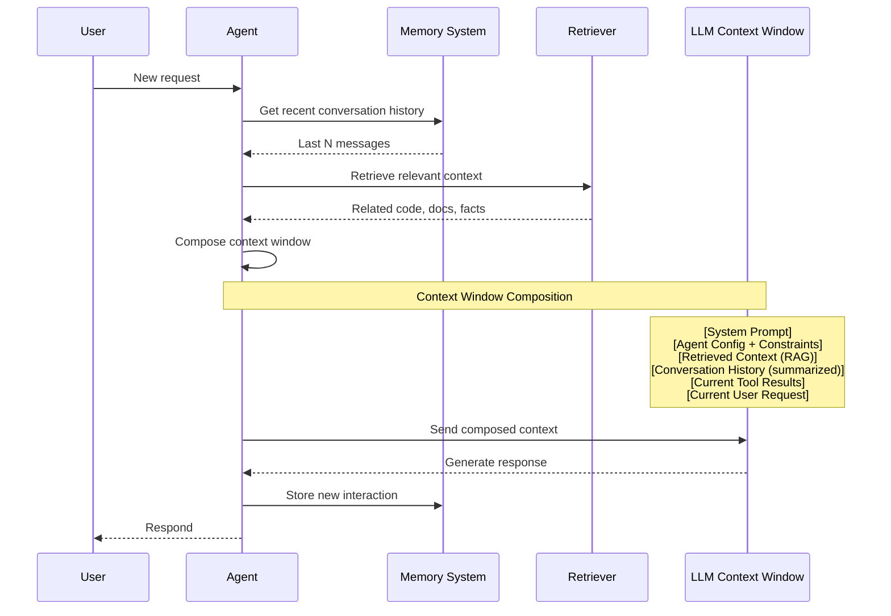

# Context Management

## The Context Challenge

AI agents face a fundamental constraint: limited context windows. Even the largest models (200K+ tokens) cannot hold an entire codebase, conversation history, and task instructions simultaneously. Effective context management is the difference between a capable agent and one that repeatedly loses track of important information.



> [!NOTE]
> Context management is not just about fitting things into a token budget. It's about making intelligent decisions about *what* to keep, *what* to compress, *what* to fetch on demand, and *what* to forget.

---

## Context Window Architecture

Understanding how different context types interact within the window is crucial for efficient agent design.



---

## Memory Systems

Effective agents use a tiered memory architecture to manage context efficiently:

```python
class TieredMemory:
    def __init__(self):
        # Ephemeral: current conversation turn
        self.working_memory = {}
        # Short-term: recent conversation (sliding window)
        self.short_term = []
        # Long-term: persistent facts across sessions
        self.long_term = {}
        # Semantic: indexed knowledge for retrieval
        self.semantic_store = []

    def add_to_working(self, key, value):
        self.working_memory[key] = value

    def get_working(self, key):
        return self.working_memory.get(key)

    def add_to_short_term(self, message, max_size=20):
        self.short_term.append(message)
        if len(self.short_term) > max_size:
            # Evict oldest messages
            self.short_term = self.short_term[-max_size:]

    def remember(self, key, value, importance=1.0):
        # High importance facts persist longer
        self.long_term[key] = {
            "value": value,
            "importance": importance,
            "timestamp": __import__('time').time()
        }

    def recall(self, key):
        entry = self.long_term.get(key)
        if entry:
            return entry["value"]
        return None

    def recall_by_relevance(self, query, top_k=3):
        # Simple keyword matching for semantic recall
        scores = []
        for key, entry in self.long_term.items():
            if query.lower() in key.lower():
                scores.append((entry["importance"], key, entry["value"]))
        scores.sort(reverse=True)
        return [(k, v) for _, k, v in scores[:top_k]]

    def store_semantic(self, text, metadata=None):
        self.semantic_store.append({
            "text": text,
            "metadata": metadata or {},
            "timestamp": __import__('time').time()
        })

    def summarize_and_archive(self):
        """Compress short-term memory into a summary for long-term storage."""
        if len(self.short_term) > 10:
            texts = [m["content"] for m in self.short_term[:5]]
            summary = " | ".join(texts)
            self.long_term["conversation_summary"] = {
                "value": summary[:500],
                "importance": 0.5,
                "timestamp": __import__('time').time()
            }
            # Keep only recent messages
            self.short_term = self.short_term[-5:]


memory = TieredMemory()

# Store project facts long-term
memory.remember("project_name", "Nova Platform", importance=1.0)
memory.remember("tech_stack", ["Python", "FastAPI", "React", "PostgreSQL"], importance=0.9)
memory.remember("deployment_env", "production", importance=0.8)

# Add conversation to short-term
memory.add_to_short_term({"role": "user", "content": "Fix the login bug"})
memory.add_to_short_term({"role": "assistant", "content": "Found the issue in auth.py"})

# Retrieve relevant facts
relevant = memory.recall_by_relevance("deploy")
print(f"Deployment context: {relevant}")

# Summarize when needed
memory.summarize_and_archive()
```

---

## Retrieval-Augmented Generation (RAG)

RAG enables agents to access large knowledge bases by fetching only the most relevant information at query time.

```python
class RAGSystem:
    def __init__(self):
        self.documents = []
        self.index = {}

    def add_document(self, doc_id, content, metadata=None):
        self.documents.append({
            "id": doc_id,
            "content": content,
            "metadata": metadata or {}
        })
        # Simple keyword indexing
        for word in content.lower().split():
            if word not in self.index:
                self.index[word] = []
            self.index[word].append(len(self.documents) - 1)

    def search(self, query, top_k=3):
        query_words = query.lower().split()
        scores = {}

        for q_word in query_words:
            for doc_idx in self.index.get(q_word, []):
                if doc_idx not in scores:
                    scores[doc_idx] = 0
                scores[doc_idx] += 1

        # Sort by relevance score
        ranked = sorted(scores.items(), key=lambda x: x[1], reverse=True)
        results = []
        for doc_idx, score in ranked[:top_k]:
            doc = self.documents[doc_idx]
            results.append({
                "id": doc["id"],
                "content": doc["content"][:500],  # Truncate for context
                "relevance": score / len(query_words),
                "metadata": doc["metadata"]
            })
        return results

    def build_context_prompt(self, query, max_tokens=2000):
        results = self.search(query)
        context_parts = []
        token_count = 0

        for r in results:
            snippet = f"[Source: {r['id']}]\n{r['content']}\n"
            snippet_tokens = len(snippet.split())
            if token_count + snippet_tokens > max_tokens:
                break
            context_parts.append(snippet)
            token_count += snippet_tokens

        return "\n---\n".join(context_parts)


# Build a RAG system for an agent
rag = RAGSystem()
rag.add_document(
    "auth-flow.md",
    "The authentication flow uses JWT tokens with 1-hour expiry. "
    "Refresh tokens are stored in HTTP-only cookies and have 7-day expiry. "
    "OAuth2 is supported for Google and GitHub providers.",
    {"type": "documentation", "module": "auth"}
)
rag.add_document(
    "api-endpoints.md",
    "POST /api/auth/login - Authenticate user\n"
    "POST /api/auth/refresh - Refresh access token\n"
    "POST /api/auth/logout - Invalidate session\n"
    "GET /api/auth/profile - Get user profile",
    {"type": "api", "module": "auth"}
)
rag.add_document(
    "db-schema.sql",
    "CREATE TABLE users (id UUID PRIMARY KEY, email VARCHAR UNIQUE, "
    "password_hash VARCHAR, created_at TIMESTAMP);\n"
    "CREATE TABLE sessions (id UUID PRIMARY KEY, user_id UUID REFERENCES users(id), "
    "token VARCHAR, expires_at TIMESTAMP);",
    {"type": "schema", "module": "database"}
)

context = rag.build_context_prompt("How does authentication work?")
print(context)
```

> [!WARNING]
> RAG is not magic. The quality of retrieval depends on the quality of your indexing strategy. Simple keyword search works for small codebases, but production systems need embeddings-based semantic search. Always validate that the retriever finds the *right* documents for common queries.

---

## Summarization Strategies

When context windows fill up, summarization compresses information while preserving key details.

```python
class SummarizationEngine:
    def __init__(self, llm_client):
        self.llm = llm_client

    def summarize_conversation(self, messages):
        """Summarize a conversation history into key points."""
        if len(messages) < 3:
            return messages  # Too short to summarize

        text = "\n".join(
            f"{m['role']}: {m['content']}" for m in messages
        )

        prompt = f"""
        Summarize the following conversation, preserving:
        1. All decisions made
        2. Key facts discovered
        3. Action items or next steps
        4. Technical details (file paths, function names, versions)

        Conversation:
        {text}

        Summary:
        """
        return self.llm.complete(prompt)

    def hierarchical_summary(self, sessions, max_levels=3):
        """Create a hierarchical summary of multiple sessions."""
        summaries = []

        for session in sessions:
            summary = self.summarize_conversation(session)
            summaries.append(summary)

        # If we have too many session summaries, summarize those too
        level = 1
        while len(summaries) > 5 and level < max_levels:
            batch_size = 3
            new_summaries = []
            for i in range(0, len(summaries), batch_size):
                batch = summaries[i:i + batch_size]
                combined = "\n".join(batch)
                meta_summary = self.llm.complete(
                    f"Summarize these session summaries:\n{combined}"
                )
                new_summaries.append(meta_summary)
            summaries = new_summaries
            level += 1

        return summaries

    def token_aware_truncation(self, text, max_tokens=4000):
        """Truncate text intelligently at token boundaries."""
        tokens = text.split()
        if len(tokens) <= max_tokens:
            return text

        # Keep beginning and end, summarize middle
        keep_start = max_tokens // 3
        keep_end = max_tokens // 3
        middle_start = text[:keep_start * 10]  # Approximate char→token
        middle_end = text[-keep_end * 10:]

        return f"{middle_start}\n\n...[{len(tokens) - keep_start - keep_end} tokens omitted]...\n\n{middle_end}"
```

```yaml
# Summarization configuration for an agent
summarization:
  strategy: hierarchical
  thresholds:
    short_term: 10  # Summarize when >10 messages
    session: 50      # Summarize when >50 messages per session
    total: 200       # Create meta-summary across sessions
  include_in_summary:
    - decisions_made
    - code_changes
    - error_patterns
    - user_preferences
  preserve_fields:
    - file_paths
    - function_names
    - version_numbers
    - api_endpoints
```

> [!TIP]
> Use hierarchical summarization for long-running agent sessions. Summarize at three levels: (1) individual conversation turns, (2) session-level summaries, (3) cross-session meta-summaries. This preserves critical information while maintaining a compact context.

---

## Context Prioritization

Not all context is equally important. Agents should prioritize what goes into the limited context window.

```python
class ContextPrioritizer:
    def __init__(self, max_tokens=128000):
        self.max_tokens = max_tokens
        self.priority_levels = {
            "critical": 5,
            "high": 4,
            "medium": 3,
            "low": 2,
            "background": 1
        }

    def prioritize(self, context_items):
        """Sort and filter context items by priority, fit within token budget."""
        # Assign priority scores
        scored = []
        for item in context_items:
            score = self._calculate_priority(item)
            tokens = len(item["content"].split())
            scored.append((score, tokens, item))

        # Sort by priority (descending)
        scored.sort(key=lambda x: x[0], reverse=True)

        # Fit within budget
        result = []
        used_tokens = 0

        # Always include system prompt and current request
        for item in context_items:
            if item["type"] in ("system_prompt", "current_request"):
                result.append(item)
                used_tokens += len(item["content"].split())

        # Add high priority items
        remaining = self.max_tokens - used_tokens
        for score, tokens, item in scored:
            if item["type"] in ("system_prompt", "current_request"):
                continue  # Already included
            if used_tokens + tokens <= self.max_tokens:
                result.append(item)
                used_tokens += tokens

        return result

    def _calculate_priority(self, item):
        base = self.priority_levels.get(item.get("priority", "medium"), 3)

        # Boost relevance to current task
        if item.get("relevance_to_current", 0) > 0.8:
            base += 1
        # Boost recent items
        if item.get("recency", 0) > 0.9:
            base += 1
        # Penalize very large items
        tokens = len(item["content"].split())
        if tokens > 10000:
            base -= 1

        return max(1, base)


prioritizer = ContextPrioritizer(max_tokens=8000)
context = [
    {"type": "system_prompt", "content": "You are a coding agent...", "priority": "critical"},
    {"type": "current_request", "content": "Fix the payment bug", "priority": "critical"},
    {"type": "file_content", "content": "def process(): ...", "priority": "high", "relevance_to_current": 0.9},
    {"type": "conversation_history", "content": "User: The payment fails...", "priority": "medium", "recency": 1.0},
    {"type": "project_readme", "content": "# Project...", "priority": "low"},
]
prioritized = prioritizer.prioritize(context)
print(f"Included {len(prioritized)} items in context window")
```

---

## Context Window Limits by Model

| Model Provider | Model | Context Window | Effective Budget |
|----------------|-------|---------------|-----------------|
| OpenAI | GPT-4o | 128K tokens | ~96K (after overhead) |
| OpenAI | GPT-4o-mini | 128K tokens | ~96K |
| Anthropic | Claude Sonnet 4 | 200K tokens | ~170K |
| Anthropic | Claude Opus 4 | 200K tokens | ~170K |
| Google | Gemini 1.5 Pro | 1M tokens | ~800K |
| Meta | Llama 3.1 70B | 128K tokens | ~100K |
| Mistral | Mixtral 8x22B | 64K tokens | ~48K |

> [!NOTE]
> The "Effective Budget" accounts for the tokens consumed by the model's internal processing (system prompts, tokenization overhead, response generation). A 128K window typically has about 96K tokens available for your content.

---

## Practical Context Management in OpenCode

OpenCode provides built-in context management through its agent configuration system:

```json
{
  "agents": {
    "default": {
      "model": "gpt-4o",
      "description": "General coding agent",
      "context": {
        "maxTokens": 128000,
        "summarizationThreshold": 80000,
        "memoryStrategy": "tiered",
        "shortTermLimit": 20,
        "longTermEnabled": true,
        "ragEnabled": true,
        "ragMaxDocs": 5,
        "prioritizeByRelevance": true
      }
    },
    "code-reviewer": {
      "model": "claude-sonnet-4-20250514",
      "description": "Code review specialist",
      "context": {
        "maxTokens": 200000,
        "summarizationThreshold": 150000,
        "focusOnCurrentChanges": true,
        "includeGitDiff": true
      }
    }
  }
}
```

```yaml
# context-management-strategy.yaml
strategy:
  name: "tiered-context"
  layers:
    working:
      label: "Working Memory"
      size: "2-3 turns"
      content: "Current task, immediate tool results"
      eviction: "FIFO"
    short_term:
      label: "Short-Term Memory"
      size: "15-20 turns"
      content: "Recent conversation, recent file reads"
      eviction: "Summarize and archive"
    long_term:
      label: "Long-Term Memory"
      size: "Unlimited (external)"
      content: "Project facts, decisions, user preferences"
      access: "On-demand retrieval"
    episodic:
      label: "Episodic Memory"
      size: "Compressed"
      content: "Key events, errors encountered, solutions found"
      access: "Similarity search"
```

---

## Common Context Management Pitfalls

| Pitfall | Symptom | Solution |
|---------|---------|----------|
| Context overflow | Agent loses track of early instructions | Implement sliding window + summarization |
| Stale context | Agent references outdated information | Add recency scoring in prioritization |
| Missing context | Agent asks for information it already has | Improve long-term memory recall |
| Token waste | Agent includes irrelevant file contents | Use RAG with precise queries |
| Memory explosion | Context grows unboundedly | Set hard limits with summarization triggers |
| Fact drift | Agent contradicts itself across sessions | Use persistent long-term memory store |

> [!WARNING]
> The most expensive mistake is losing critical information because of poor context management. An agent that forgets your project's tech stack or a key decision will produce inconsistent results. Always validate that your memory system preserves essential facts.

---

## Practice Exercises

```question
{
  "id": "aa-04-q1",
  "type": "multiple-choice",
  "question": "What is the primary purpose of a sliding window in context management?",
  "options": [
    "To encrypt conversation data",
    "To keep only the most recent N messages within the token budget",
    "To display messages in a different language",
    "To increase the model's context window size"
  ],
  "correct": 1,
  "explanation": "A sliding window keeps the most recent N messages and discards older ones. This ensures the agent always has the latest context available while staying within the token budget. Combined with summarization, it balances recency with completeness."
}
```

```question
{
  "id": "aa-04-q2",
  "type": "multiple-choice",
  "question": "In a tiered memory system, what type of information should be stored in long-term memory?",
  "options": [
    "The current user message being typed",
    "Every single tool output from the current session",
    "Persistent facts like project name, tech stack, and key decisions",
    "The raw output of every bash command executed"
  ],
  "correct": 2,
  "explanation": "Long-term memory stores persistent facts that should survive across sessions: project names, technology choices, architectural decisions, user preferences. Transient data like individual tool outputs belongs in working or short-term memory."
}
```

```question
{
  "id": "aa-04-q3",
  "type": "multiple-choice",
  "question": "What happens when an agent's context window exceeds the model's token limit?",
  "options": [
    "The model automatically increases its context window",
    "The oldest content is silently dropped or truncated",
    "The agent crashes and needs to be restarted",
    "The model charges double for the extra tokens"
  ],
  "correct": 1,
  "explanation": "When context exceeds the limit, the oldest or lowest-priority content is typically dropped or truncated. This is why explicit context management strategies (sliding windows, summarization, prioritization) are essential — they control *what* gets dropped rather than leaving it to chance."
}
```

```question
{
  "id": "aa-04-q4",
  "type": "multiple-choice",
  "question": "What is RAG (Retrieval-Augmented Generation) used for in agent context management?",
  "options": [
    "Randomly selecting context from any source",
    "Reversing the agent's decisions automatically",
    "Fetching only the most relevant documents for the current query",
    "Running garbage collection on memory"
  ],
  "correct": 2,
  "explanation": "RAG fetches only the most relevant information from a larger knowledge base based on the current query. Instead of loading all documents into context, it searches for and retrieves only what's needed, making efficient use of the limited context window."
}
```

```question
{
  "id": "aa-04-q5",
  "type": "multiple-choice",
  "question": "An agent has a 128K token limit and is using about 100K tokens for conversation history. What strategy should it use when the user sends a new, complex request?",
  "options": [
    "Reject the request and ask the user to start a new session",
    "Summarize the oldest conversation history to free up tokens",
    "Cancel all previous work and start fresh",
    "Increase the model's context window"
  ],
  "correct": 1,
  "explanation": "The agent should summarize the oldest portion of the conversation history to free up tokens for the new complex request. Summarization compresses information while preserving key facts, decisions, and context that remain relevant."
}
```

```question
{
  "id": "aa-04-q6",
  "type": "multiple-choice",
  "question": "What is the 'effective budget' of a 128K token context window?",
  "options": [
    "Exactly 128,000 tokens with no overhead",
    "Approximately 96,000 tokens after accounting for system overhead",
    "About 50,000 tokens",
    "256,000 tokens (double the stated limit)"
  ],
  "correct": 1,
  "explanation": "The effective budget is approximately 96K tokens out of 128K. The remaining tokens are consumed by system prompts, tokenization overhead, and the model's response generation. Always account for this overhead when designing context management strategies."
}
```

```question
{
  "id": "aa-04-q7",
  "type": "multiple-choice",
  "question": "What is the main risk of using only a sliding window without summarization?",
  "options": [
    "The window contains too many tokens",
    "Important information from earlier in the conversation is permanently lost",
    "The model runs slower",
    "Tool execution becomes sequential"
  ],
  "correct": 1,
  "explanation": "Without summarization, a pure sliding window permanently discards old messages. If an important decision or fact was mentioned earlier and fell out of the window, the agent loses access to it. Summarization preserves the essence of older context before it's evicted."
}
```

```question
{
  "id": "aa-04-q8",
  "type": "multiple-choice",
  "question": "In context prioritization, which items should always be included in the context window regardless of token budget?",
  "options": [
    "Conversation history from other sessions",
    "The system prompt and the current user request",
    "The entire project README file",
    "The output of every previous tool call"
  ],
  "correct": 1,
  "explanation": "The system prompt (agent instructions, constraints) and the current user request are critical for the agent to understand its role and the current task. These should always have the highest priority and be included regardless of token constraints."
}
```

---

[!SUCCESS] **Key Takeaways**

- Context management is about intelligent decisions on what to keep, compress, fetch, and forget
- Tiered memory (working, short-term, long-term, semantic) provides a scalable architecture
- RAG enables access to large knowledge bases without filling the context window
- Summarization strategies (linear, hierarchical, token-aware) compress information effectively
- Context prioritization ensures critical items always fit within the token budget
- Different models have different context limits; design for the effective budget
- OpenCode provides built-in context configuration for agents
- Without explicit management, context overflow silently degrades agent performance
- Common pitfalls include context overflow, stale context, missing context, and memory explosion
