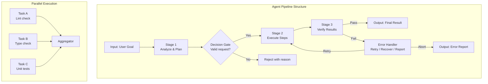
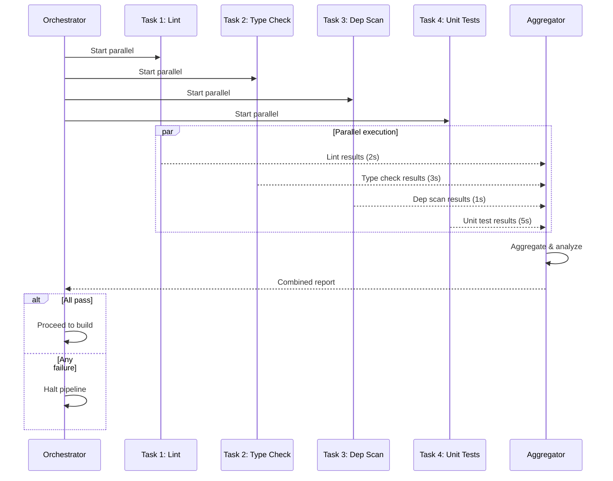

# Agent Pipelines

## What Are Agent Pipelines?

Agent pipelines are structured workflows that chain multiple operations — tool calls, skill executions, subagent delegations — into coordinated sequences. Pipelines transform an agent from a single-step assistant into a multi-step automation engine capable of complex software engineering workflows.



> [!NOTE]
> A pipeline is more than a sequence of steps. It includes decision gates, error handlers, parallel branches, aggregators, and state management. Think of it as a directed acyclic graph (DAG) of operations with smart routing.

---

## Pipeline Stage Design

Each pipeline stage has a clear purpose, input, output, and error behavior.

```python
from enum import Enum
from dataclasses import dataclass
from typing import Any, Callable, Optional

class StageStatus(Enum):
    PENDING = "pending"
    RUNNING = "running"
    SUCCESS = "success"
    FAILED = "failed"
    SKIPPED = "skipped"

@dataclass
class Stage:
    name: str
    action: Callable
    retry_count: int = 0
    max_retries: int = 3
    timeout: int = 60
    depends_on: list[str] = None

    def __post_init__(self):
        self.depends_on = self.depends_on or []


class Pipeline:
    def __init__(self, name: str):
        self.name = name
        self.stages: dict[str, Stage] = {}
        self.results: dict[str, Any] = {}
        self.statuses: dict[str, StageStatus] = {}
        self.context: dict[str, Any] = {}

    def add_stage(self, stage: Stage):
        self.stages[stage.name] = stage
        self.statuses[stage.name] = StageStatus.PENDING

    async def execute(self, initial_input: dict = None):
        if initial_input:
            self.context.update(initial_input)

        print(f"Pipeline '{self.name}' starting...")

        # Topological sort based on dependencies
        ordered_stages = self._topological_sort()

        for stage_name in ordered_stages:
            stage = self.stages[stage_name]

            # Check dependencies
            deps_met = all(
                self.statuses.get(dep) == StageStatus.SUCCESS
                for dep in stage.depends_on
            )
            if not deps_met:
                self.statuses[stage_name] = StageStatus.SKIPPED
                continue

            # Execute with retries
            self.statuses[stage_name] = StageStatus.RUNNING
            for attempt in range(stage.max_retries):
                try:
                    result = await self._execute_stage(stage, attempt)
                    self.results[stage_name] = result
                    self.statuses[stage_name] = StageStatus.SUCCESS
                    break
                except Exception as e:
                    if attempt < stage.max_retries - 1:
                        print(f"Stage '{stage_name}' failed (attempt {attempt+1}): {e}")
                    else:
                        self.results[stage_name] = {"error": str(e)}
                        self.statuses[stage_name] = StageStatus.FAILED

        return self._summarize()

    async def _execute_stage(self, stage: Stage, attempt: int):
        args = {dep: self.results.get(dep) for dep in stage.depends_on}
        args["context"] = self.context
        return await stage.action(**args)

    def _topological_sort(self) -> list[str]:
        visited = set()
        ordered = []

        def dfs(node):
            if node in visited:
                return
            visited.add(node)
            stage = self.stages.get(node)
            if stage:
                for dep in stage.depends_on:
                    if dep in self.stages:
                        dfs(dep)
                ordered.append(node)

        for name in self.stages:
            dfs(name)
        return ordered

    def _summarize(self) -> dict:
        return {
            "pipeline": self.name,
            "stages": {
                name: {
                    "status": self.statuses[name].value,
                    "result": self.results.get(name)
                }
                for name in self.stages
            }
        }
```

---

## Sequential Pipeline Example

A typical CI-like pipeline for code quality checks:

```python
async def lint_action(**kwargs):
    import asyncio
    await asyncio.sleep(0.1)
    return {"issues": 0, "output": "All clean"}

async def type_check_action(**kwargs):
    return {"errors": 0, "output": "Types correct"}

async def test_action(**kwargs):
    return {"passed": 42, "failed": 0, "coverage": 0.92}

async def build_action(**kwargs):
    return {"success": True, "artifact": "dist/app.zip"}

# Build pipeline
ci_pipeline = Pipeline("CI Pipeline")
ci_pipeline.add_stage(Stage("lint", lint_action))
ci_pipeline.add_stage(Stage("type_check", type_check_action, depends_on=["lint"]))
ci_pipeline.add_stage(Stage("test", test_action, depends_on=["type_check"]))
ci_pipeline.add_stage(Stage("build", build_action, depends_on=["test"]))

# Execute
import asyncio
result = asyncio.run(ci_pipeline.execute())
print(f"Pipeline status: {result}")
```

---

## Parallel Execution

Independent stages can run in parallel to reduce total execution time.



```python
import asyncio

class ParallelPipeline:
    def __init__(self):
        self.parallel_groups = []
        self.results = {}

    def add_group(self, name, tasks):
        self.parallel_groups.append({"name": name, "tasks": tasks})

    async def execute_all(self):
        for group in self.parallel_groups:
            print(f"Executing parallel group: {group['name']}")
            tasks = [self._run_task(name, fn) for name, fn in group["tasks"]]
            group_results = await asyncio.gather(*tasks, return_exceptions=True)

            for (name, _), result in zip(group["tasks"], group_results):
                self.results[name] = result
                if isinstance(result, Exception):
                    print(f"Task '{name}' failed: {result}")

        return self.results

    async def _run_task(self, name, fn):
        print(f"  Starting: {name}")
        result = await fn()
        print(f"  Completed: {name}")
        return result


async def lint():
    await asyncio.sleep(2)
    return {"status": "pass", "issues": 0}

async def type_check():
    await asyncio.sleep(3)
    return {"status": "pass", "errors": 0}

async def security_scan():
    await asyncio.sleep(1)
    return {"status": "pass", "vulnerabilities": 0}

async def unit_tests():
    await asyncio.sleep(5)
    return {"status": "pass", "passed": 50, "failed": 0}

# Build parallel pipeline
pipeline = ParallelPipeline()
pipeline.add_group("static_analysis", [
    ("lint", lint),
    ("type_check", type_check),
    ("security_scan", security_scan),
])
pipeline.add_group("testing", [
    ("unit_tests", unit_tests),
])

results = asyncio.run(pipeline.execute_all())
print(f"\nAll results: {results}")
```

> [!TIP]
> Parallel execution can dramatically reduce pipeline time, but only for *independent* stages. If stage B depends on stage A's output, they must run sequentially. Use dependency analysis to identify truly parallelizable work.

---

## Error Handling Strategies

Robust pipelines anticipate and handle failures gracefully.

```python
class ErrorHandler:
    def __init__(self, pipeline):
        self.pipeline = pipeline
        self.strategies = {
            "retry": self._retry,
            "skip": self._skip,
            "fallback": self._fallback,
            "abort": self._abort,
            "compensate": self._compensate
        }

    def handle(self, stage_name, error, strategy="retry"):
        handler = self.strategies.get(strategy, self._retry)
        return handler(stage_name, error)

    async def _retry(self, stage_name, error, max_retries=3):
        stage = self.pipeline.stages[stage_name]
        for attempt in range(max_retries):
            try:
                print(f"Retrying '{stage_name}' (attempt {attempt + 2})...")
                result = await self.pipeline._execute_stage(stage, attempt + 1)
                return {"status": "recovered", "result": result, "attempts": attempt + 2}
            except Exception as e:
                if attempt == max_retries - 1:
                    return {"status": "failed", "error": str(e)}
        return {"status": "failed", "error": str(error)}

    async def _skip(self, stage_name, error):
        print(f"Skipping '{stage_name}' due to: {error}")
        self.pipeline.statuses[stage_name] = StageStatus.SKIPPED
        return {"status": "skipped", "reason": str(error)}

    async def _fallback(self, stage_name, error, fallback_fn=None):
        print(f"Using fallback for '{stage_name}'")
        if fallback_fn:
            try:
                result = await fallback_fn()
                return {"status": "recovered", "result": result, "method": "fallback"}
            except Exception as e:
                return {"status": "failed", "error": str(e)}
        return {"status": "failed", "error": "No fallback available"}

    async def _abort(self, stage_name, error):
        print(f"Aborting pipeline at '{stage_name}': {error}")
        # Cancel all pending stages
        for name in self.pipeline.stages:
            if self.pipeline.statuses[name] == StageStatus.PENDING:
                self.pipeline.statuses[name] = StageStatus.SKIPPED
        return {"status": "aborted", "at": stage_name, "reason": str(error)}

    async def _compensate(self, stage_name, error, compensate_fn=None):
        print(f"Applying compensation for failed stage '{stage_name}'")
        if compensate_fn:
            await compensate_fn()
        return {"status": "compensated", "for": stage_name}
```

```yaml
# Pipeline error handling configuration
pipeline:
  name: "deploy-pipeline"
  error_strategy: "retry_then_abort"
  stages:
    - name: "run_tests"
      max_retries: 2
      on_failure: "retry"
    - name: "build"
      max_retries: 1
      on_failure: "retry"
    - name: "deploy_staging"
      on_failure: "abort"
      depends_on: ["run_tests", "build"]
    - name: "smoke_tests"
      max_retries: 3
      on_failure: "retry"
      depends_on: ["deploy_staging"]
    - name: "deploy_production"
      on_failure: "compensate"
      compensate_action: "rollback_staging"
      requires_approval: true
```

---

## Pipeline State and Observability

Every pipeline should expose its state for monitoring and debugging.

```json
{
  "pipeline_state": {
    "id": "pipe_1749382018",
    "name": "full-ci",
    "status": "running",
    "started_at": "2026-06-06T10:00:00Z",
    "estimated_completion": "2026-06-06T10:05:30Z",
    "stages": [
      {
        "name": "lint",
        "status": "success",
        "duration_ms": 2340,
        "output": {"issues": 0}
      },
      {
        "name": "type_check",
        "status": "success",
        "duration_ms": 3120,
        "output": {"errors": 0}
      },
      {
        "name": "test",
        "status": "running",
        "duration_ms": 4500,
        "progress": {
          "total": 50,
          "passed": 42,
          "failed": 0,
          "remaining": 8
        }
      },
      {
        "name": "build",
        "status": "pending",
        "depends_on": ["test"]
      }
    ],
    "context": {
      "branch": "feature/payment-fix",
      "commit": "a1b2c3d4",
      "trigger": "push"
    }
  }
}
```

```python
class PipelineObserver:
    def __init__(self):
        self.events = []

    def on_stage_start(self, stage_name):
        event = {
            "type": "stage_start",
            "stage": stage_name,
            "timestamp": __import__('time').time()
        }
        self.events.append(event)
        print(f"[{event['timestamp']:.2f}] Stage started: {stage_name}")

    def on_stage_end(self, stage_name, status, duration_ms):
        event = {
            "type": "stage_end",
            "stage": stage_name,
            "status": status,
            "duration_ms": duration_ms,
            "timestamp": __import__('time').time()
        }
        self.events.append(event)
        print(f"[{event['timestamp']:.2f}] Stage {stage_name}: {status} ({duration_ms}ms)")

    def on_error(self, stage_name, error, strategy):
        event = {
            "type": "error",
            "stage": stage_name,
            "error": str(error),
            "strategy": strategy,
            "timestamp": __import__('time').time()
        }
        self.events.append(event)
        print(f"[{event['timestamp']:.2f}] Error at {stage_name}: {error} → {strategy}")

    def get_report(self):
        return {
            "total_events": len(self.events),
            "errors": [e for e in self.events if e["type"] == "error"],
            "duration_ms": (
                self.events[-1]["timestamp"] - self.events[0]["timestamp"]
            ) * 1000 if len(self.events) > 1 else 0
        }
```

---

## Pipeline Composition Patterns

| Pattern | Description | Example |
|---------|-------------|---------|
| Linear | Sequential stages, one after another | Lint → Test → Build → Deploy |
| Fan-out | One stage triggers multiple parallel stages | Code change → [Lint, Test, Security] |
| Fan-in | Multiple parallel stages merge into one | [Lint, Test] → Report Generation |
| Conditional | Routing based on stage output | Tests pass → Deploy, Fail → Notify |
| Loop | Repeat stages until condition met | Fix lint errors → Re-lint → Repeat |
| Sub-pipeline | Nested pipeline as a stage | Deploy pipeline contains "health-check" sub-pipeline |

```yaml
# Complex pipeline composition
workflow:
  name: "release-workflow"
  version: "2.0"

  triggers:
    - event: "push"
      branches: ["main", "release/*"]
    - event: "pull_request"
      types: ["opened", "synchronize"]

  stages:
    - id: "validate"
      parallel:
        - id: "lint"
          tool: "bash"
          command: "ruff check src/"
        - id: "typecheck"
          tool: "bash"
          command: "mypy src/"
        - id: "security"
          tool: "bash"
          command: "bandit -r src/"

    - id: "test"
      depends_on: ["validate"]
      strategy: "matrix"
      matrix:
        python-version: ["3.11", "3.12"]
        os: ["ubuntu-latest", "windows-latest"]
      steps:
        - tool: "bash"
          command: "pytest tests/ --cov=src/"

    - id: "build"
      depends_on: ["test"]
      stages:
        - tool: "bash"
          command: "python -m build"
        - tool: "bash"
          command: "docker build -t app:latest ."

    - id: "deploy_staging"
      depends_on: ["build"]
      condition: "github.ref == 'refs/heads/main'"
      requires_approval: false
      stages:
        - tool: "bash"
          command: "kubectl apply -f k8s/staging/"

    - id: "deploy_production"
      depends_on: ["deploy_staging"]
      condition: "github.ref == 'refs/heads/release/*'"
      requires_approval: true
      stages:
        - tool: "bash"
          command: "kubectl apply -f k8s/production/"
```

> [!WARNING]
> Conditional stages with `requires_approval` should always be used for production deployments. An agent pipeline with full autonomy to deploy to production is a security and reliability risk. Always add a human-in-the-loop gate for destructive or high-risk operations.

---

## OpenCode Pipeline Configuration

OpenCode supports pipeline-like workflows through skill chaining and agent routing.

```json
{
  "pipelines": {
    "code-review-pipeline": {
      "description": "Full code review pipeline",
      "stages": [
        {
          "name": "lint-check",
          "tool": "bash",
          "command": "ruff check {file}",
          "on_failure": "report"
        },
        {
          "name": "security-scan",
          "tool": "bash",
          "command": "bandit -r {dir}",
          "on_failure": "block"
        },
        {
          "name": "generate-report",
          "skill": "report-generator",
          "inputs": ["lint-check", "security-scan"]
        }
      ]
    },
    "deploy-pipeline": {
      "description": "Production deployment pipeline",
      "stages": [
        {
          "name": "test",
          "tool": "bash",
          "command": "pytest tests/"
        },
        {
          "name": "build",
          "tool": "bash",
          "command": "npm run build",
          "depends_on": ["test"]
        },
        {
          "name": "deploy",
          "agent": "deploy-agent",
          "depends_on": ["build"],
          "requires_approval": true
        }
      ]
    }
  }
}
```

> [!TIP]
> In OpenCode, you can implement pipelines using skills with `depends_on` declarations or by creating a meta-skill that orchestrates sub-skills. The latter approach is more flexible for complex workflows.

---

## Practice Exercises

```question
{
  "id": "aa-05-q1",
  "type": "multiple-choice",
  "question": "What is the primary benefit of using parallel execution in an agent pipeline?",
  "options": [
    "It reduces the number of stages needed",
    "It reduces total execution time by running independent tasks simultaneously",
    "It eliminates the need for error handling",
    "It increases the quality of results"
  ],
  "correct": 1,
  "explanation": "Parallel execution reduces total wall-clock time by running independent tasks concurrently. Instead of waiting for Task A → Task B → Task C sequentially, independent tasks A, B, and C run at the same time."
}
```

```question
{
  "id": "aa-05-q2",
  "type": "multiple-choice",
  "question": "In the Pipeline class, what determines the execution order of stages?",
  "options": [
    "The order they were added to the pipeline",
    "Alphabetical order of stage names",
    "Topological sort based on dependency declarations",
    "Random order for load balancing"
  ],
  "correct": 2,
  "explanation": "The topological sort orders stages so that dependencies are executed before their dependents. Stage B that depends on Stage A will always run after A. Independent stages without cross-dependencies can be parallelized."
}
```

```question
{
  "id": "aa-05-q3",
  "type": "multiple-choice",
  "question": "Which error handling strategy should be used for a production deployment stage that fails?",
  "options": [
    "retry — keep trying until it succeeds",
    "skip — move on to the next stage",
    "abort — stop the pipeline immediately",
    "ignore — pretend it didn't happen"
  ],
  "correct": 2,
  "explanation": "A failed production deployment should abort the pipeline to prevent inconsistent state. Retrying indefinitely could make things worse. The pipeline should stop, report the error, and potentially trigger a rollback compensation."
}
```

```question
{
  "id": "aa-05-q4",
  "type": "multiple-choice",
  "question": "What is the purpose of a 'fan-in' pattern in pipeline composition?",
  "options": [
    "To split one task into many parallel tasks",
    "To merge multiple parallel task results into a single aggregation stage",
    "To loop stages until a condition is met",
    "To conditionally skip stages based on input"
  ],
  "correct": 1,
  "explanation": "Fan-in merges results from multiple parallel branches into a single aggregator stage. For example, lint, test, and security scan results all feed into a report generator that combines them."
}
```

```question
{
  "id": "aa-05-q5",
  "type": "multiple-choice",
  "question": "In the pipeline state JSON, what is the purpose of the 'context' field?",
  "options": [
    "To store the full content of every file read",
    "To track branch, commit, and trigger information for traceability",
    "To store user passwords and API keys",
    "To cache tool results for faster re-execution"
  ],
  "correct": 1,
  "explanation": "The context field stores metadata about the pipeline execution environment: branch name, commit hash, trigger event. This provides traceability and helps debug issues by showing exactly what state the pipeline was operating on."
}
```

```question
{
  "id": "aa-05-q6",
  "type": "multiple-choice",
  "question": "What happens to dependent stages when a stage fails and the error strategy is 'skip'?",
  "options": [
    "All stages continue normally",
    "Dependent stages are automatically skipped as well",
    "Only the failed stage is skipped, dependents run with partial results",
    "The pipeline restarts from the beginning"
  ],
  "correct": 1,
  "explanation": "When a stage is skipped due to failure, its dependents cannot run because their inputs are missing. The dependency resolution marks all dependent stages as skipped as well. This prevents downstream stages from executing with incomplete or incorrect inputs."
}
```

```question
{
  "id": "aa-05-q7",
  "type": "multiple-choice",
  "question": "Which pipeline pattern should be used when the same set of tests needs to run across multiple operating systems?",
  "options": [
    "Linear sequential execution",
    "Matrix strategy (multiple parallel configurations)",
    "Single-stage execution",
    "Loop pattern"
  ],
  "correct": 1,
  "explanation": "A matrix strategy runs the same stage across multiple configurations in parallel. For example, running 'pytest' on Ubuntu, Windows, and macOS simultaneously. Each combination (Python 3.11 + Ubuntu, Python 3.12 + Windows) is an independent parallel execution."
}
```

```question
{
  "id": "aa-05-q8",
  "type": "multiple-choice",
  "question": "What is the role of the Pipeline Observer pattern?",
  "options": [
    "To execute pipeline stages",
    "To provide observability by logging stage starts, ends, and errors",
    "To modify pipeline stages at runtime",
    "To compile pipeline definitions into executable code"
  ],
  "correct": 1,
  "explanation": "The Pipeline Observer provides observability by emitting events for stage starts, completions, and errors. This enables monitoring, debugging, and performance analysis of pipeline execution. It does not affect execution itself."
}
```

---

[!SUCCESS] **Key Takeaways**

- Agent pipelines transform single-step agents into multi-step automation engines
- Pipelines consist of stages with dependency resolution via topological sorting
- Parallel execution reduces time for independent tasks using asyncio.gather
- Error handling strategies include retry, skip, fallback, abort, and compensate
- Pipeline state and observers provide critical observability for debugging
- Composition patterns (linear, fan-out, fan-in, conditional, loop, sub-pipeline) handle complex workflows
- Conditional stages with human approval gates protect high-risk operations
- OpenCode supports pipeline-like workflows through skill chaining and agent routing
- Matrix strategies enable parallel execution across multiple configurations
