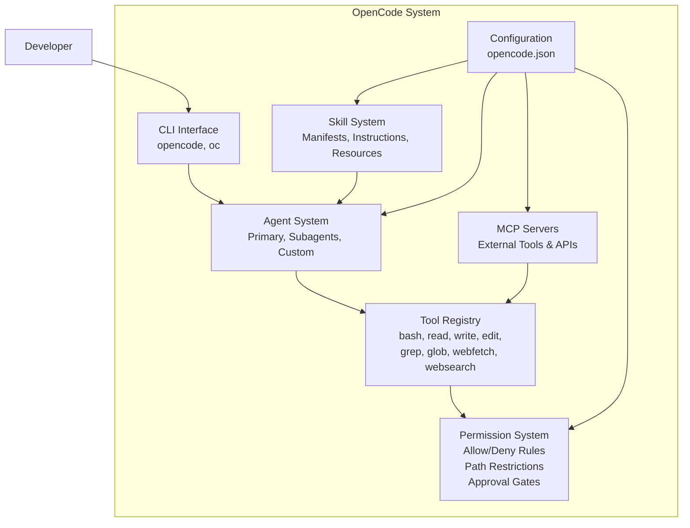
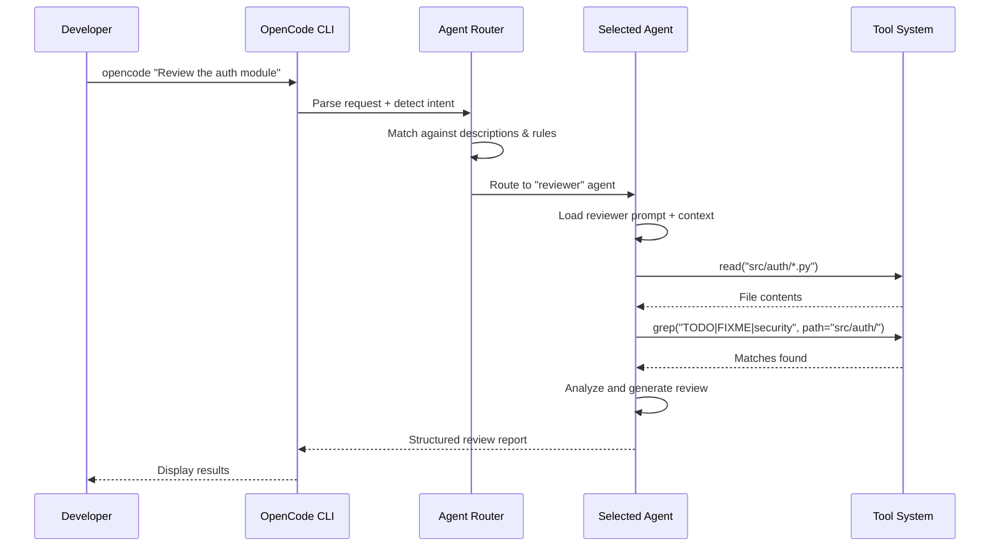

# OpenCode as Development Tool

## What is OpenCode?

OpenCode is an open-source CLI framework for AI-assisted software engineering. It provides a structured environment where AI agents interact with your codebase through a permission-controlled tool system, reusable skills, and the Model Context Protocol (MCP) for external integrations.



> [!NOTE]
> OpenCode can be installed globally via npm or pip and configured per-project using `opencode.json` at the project root or `.opencode/config.json`. The CLI command is `opencode` (or `oc` for short).

---

## Installation and Setup

```bash
npm install -g opencode-cli
pip install opencode-cli
opencode --version
opencode init
opencode
```

```json
{
  "name": "my-ai-powered-project",
  "version": "1.0.0",
  "scripts": {
    "dev": "opencode --agent developer",
    "review": "opencode --agent reviewer --task 'Review all new changes'",
    "deploy": "opencode --agent devops --task 'Deploy to staging'"
  },
  "opencode": {
    "configPath": ".opencode/config.json"
  }
}
```

> [!TIP]
> Use `opencode init` to generate a starter `opencode.json` with sensible defaults. It prompts for your preferred model provider and creates the basic agent structure.

---

## Core Configuration

```json
{
  "opencode": "1.0",
  "agents": {
    "default": {
      "model": "gpt-4o",
      "description": "General-purpose coding assistant",
      "prompt": "You are an expert software engineer. Always write clean, well-tested code."
    },
    "reviewer": {
      "model": "claude-sonnet-4-20250514",
      "description": "Code review and security audit specialist",
      "prompt": "You are a senior code reviewer. Focus on security, performance, and maintainability.",
      "constraints": {
        "allowedTools": ["read", "grep", "glob"],
        "deniedTools": ["write", "edit", "bash"]
      }
    },
    "architect": {
      "model": "gpt-4o",
      "description": "Software architecture and design specialist",
      "prompt": "You are a software architect. Focus on system design, patterns, and scalability.",
      "constraints": { "temperature": 0.4 }
    }
  },
  "permissions": [
    {
      "tool": "bash",
      "allow": ["npm *", "git *", "pip *", "python *", "pytest *"],
      "deny": ["rm -rf /", "sudo *", "chmod *"]
    },
    {
      "tool": "write",
      "allow": ["src/**", "tests/**", "docs/**"],
      "deny": [".env", "secrets/**", "node_modules/**"]
    },
    {
      "tool": "edit",
      "allow": ["src/**", "tests/**"],
      "deny": ["*.lock", "package-lock.json"]
    }
  ],
  "skills": {
    "code-reviewer": {
      "manifest": "skills/code-reviewer/skill.yaml",
      "autoLoad": true,
      "matchPattern": "review|audit|inspect|check"
    },
    "test-generator": {
      "manifest": "skills/test-generator/skill.yaml",
      "autoLoad": true,
      "matchPattern": "test|spec|coverage"
    }
  },
  "mcpServers": {
    "github": {
      "command": "node",
      "args": ["mcp-github-server.js"],
      "env": { "GITHUB_TOKEN": "${GITHUB_TOKEN}" }
    },
    "filesystem": {
      "command": "node",
      "args": ["mcp-server-fs.js", "/home/user/projects"]
    }
  },
  "agentRouting": {
    "mode": "auto",
    "defaultAgent": "default",
    "rules": [
      { "pattern": "security|vulnerability|CVE|OWASP", "agent": "reviewer" },
      { "pattern": "architecture|design|pattern|scalability", "agent": "architect" }
    ]
  }
}
```

---

## Agent Routing Workflow



> [!NOTE]
> Routing happens at the beginning of each request. Override routing with `--agent <name>` to force a specific agent, or `--skill <name>` to load a specific skill.

---

## Working with Skills

```yaml
# skills/react-component/skill.yaml
name: react-component
description: Generate React components with TypeScript, tests, and stories
version: "1.0.0"
instructions: |
  When asked to create a React component:
  1. Determine the component name and props interface
  2. Create src/components/{Name}/{Name}.tsx
  3. Create src/components/{Name}/{Name}.test.tsx
  4. Create src/components/{Name}/{Name}.stories.tsx
  5. Export from src/components/index.ts

  Follow these rules:
  - Use TypeScript with strict types
  - Include loading, empty, error, and edge case states
  - Follow existing component patterns
  - Add JSDoc comments for public APIs
tools:
  required:
    - read
    - write
    - glob
  optional:
    - bash
resources:
  - path: templates/component.tsx.hbs
  - path: templates/test.tsx.hbs
  - path: templates/story.tsx.hbs
autoload:
  enabled: true
  matchPattern: "create component|new component|react component"
```

```bash
opencode --skill react-component "Create a Button component with variants"
opencode --list-skills
opencode --skill-info react-component
```

> [!WARNING]
> Skills load automatically based on match patterns. If a pattern is too broad, the skill may activate in unintended contexts. Keep match patterns specific.

---

## Permission System in Practice

```json
{
  "permissions": [
    {
      "tool": "bash",
      "description": "Shell command execution",
      "allow": ["npm *", "git *", "pip *", "python *", "pytest *"],
      "deny": ["rm -rf /", "sudo *", "chmod 777 *"]
    },
    {
      "tool": "write",
      "allow": ["src/**/*.ts", "src/**/*.py", "tests/**/*.py", "docs/**/*.md"],
      "deny": [".env", "secrets/**", "node_modules/**", "*.key", "*.pem"]
    }
  ],
  "approvalGates": [
    {
      "description": "Production deployment gate",
      "condition": "command matches 'kubectl apply -f k8s/production/*'",
      "requireApprovalFrom": "user"
    }
  ]
}
```

> [!TIP]
> Start restrictive and expand gradually. Begin by denying all write/edit operations, then add write capabilities for specific file patterns as you validate agent behavior.

---

## MCP Server Integration

```javascript
// mcp-github-server.js
import { Server } from "@modelcontextprotocol/sdk/server/index.js";
import { StdioServerTransport } from "@modelcontextprotocol/sdk/server/stdio.js";
import { Octokit } from "@octokit/rest";

const server = new Server({
  name: "github-mcp-server",
  version: "1.0.0",
}, { capabilities: { tools: {} } });

const octokit = new Octokit({ auth: process.env.GITHUB_TOKEN });

server.setRequestHandler("tools/list", async () => ({
  tools: [
    {
      name: "create_issue",
      description: "Create a GitHub issue",
      inputSchema: {
        type: "object",
        properties: {
          title: { type: "string" },
          body: { type: "string" },
          labels: { type: "array", items: { type: "string" } }
        },
        required: ["title"]
      }
    },
    {
      name: "search_code",
      description: "Search code in repository",
      inputSchema: {
        type: "object",
        properties: {
          query: { type: "string" },
          repo: { type: "string" }
        },
        required: ["query"]
      }
    }
  ]
}));

server.setRequestHandler("tools/call", async (request) => {
  const { name, arguments: args } = request.params;
  switch (name) {
    case "create_issue": {
      const { data: issue } = await octokit.issues.create({
        owner: "my-org", repo: args.repo || "default",
        title: args.title, body: args.body, labels: args.labels
      });
      return { content: [{ type: "text", text: JSON.stringify(issue) }] };
    }
    case "search_code": {
      const { data: search } = await octokit.search.code({ q: args.query });
      return { content: [{ type: "text", text: JSON.stringify(search.items.slice(0, 5)) }] };
    }
    default:
      throw new Error("Unknown tool: " + name);
  }
});

const transport = new StdioServerTransport();
await server.connect(transport);
```

```json
{
  "mcpServers": {
    "github": {
      "command": "node",
      "args": ["mcp-github-server.js"],
      "env": { "GITHUB_TOKEN": "${GITHUB_TOKEN}" }
    },
    "postgres": {
      "command": "python",
      "args": ["mcp-postgres-server.py"],
      "env": { "DATABASE_URL": "${DATABASE_URL}" }
    }
  }
}
```

---

## CLI Usage Patterns

```bash
# Interactive mode
opencode

# Single command mode
opencode "Refactor the payment module to use async/await"

# Pipe input
cat requirements.txt | opencode "Generate a setup.py from this"

# File as context
opencode --file src/main.py "Review this file for bugs"

# Multi-file context
opencode --files src/*.py "Find unused imports"

# Agent selection
opencode --agent architect "Design database schema for multi-tenant app"

# Skill execution
opencode --skill code-reviewer "Review latest git diff"

# Debug mode
opencode --debug "Why is the build failing?"

# Output formats
opencode --format json "List all TODO comments" > todos.json
opencode --format markdown "Generate API documentation" > api-docs.md
```

> [!SUCCESS]
> OpenCode transforms your development workflow by providing a structured, secure, and extensible platform for AI-assisted software engineering.

---

## Best Practices for OpenCode

```yaml
best_practices:
  configuration:
    - Use .opencode/ directory instead of root opencode.json
    - Version control config but use env vars for secrets
    - Define specific agents for specific tasks
    - Use matchPattern on skills for auto-activation
    - Start restrictive and expand gradually

  agent_design:
    - Give agents clear, specific descriptions for accurate routing
    - Use temperature 0.2-0.4 for deterministic code tasks
    - Use temperature 0.7-0.9 for creative tasks
    - Define constraints properly
    - Use subagents for specialized subtasks

  skill_development:
    - Keep skills focused on single responsibilities
    - Include edge cases and error handling in instructions
    - Version skills with semantic versioning
    - Test skills independently with mock agents
    - Bundle templates and reference files as resources

  security:
    - Never store secrets in opencode.json
    - Use approval gates for destructive operations
    - Deny write access to configuration and lock files
    - Audit permission rules regularly
```

---

## Practice Exercises

```question
{
  "id": "aa-06-q1",
  "type": "multiple-choice",
  "question": "What are the two equivalent locations for OpenCode configuration?",
  "options": [
    "opencode.yaml and opencode.toml",
    "opencode.json (project root) and .opencode/config.json",
    "config/opencode.json and .config/opencode.json",
    "package.json and .env"
  ],
  "correct": 1,
  "explanation": "OpenCode configuration can be in opencode.json at the project root or .opencode/config.json. Both are equivalent."
}
```

```question
{
  "id": "aa-06-q2",
  "type": "multiple-choice",
  "question": "Which CLI flag forces a specific agent to handle a request?",
  "options": [
    "--force-agent",
    "--agent <name>",
    "--use <name>",
    "--target <name>"
  ],
  "correct": 1,
  "explanation": "The --agent <name> flag bypasses the routing system and forces the request to be handled by the specified agent."
}
```

```question
{
  "id": "aa-06-q3",
  "type": "multiple-choice",
  "question": "What is the purpose of approvalGates in OpenCode permissions?",
  "options": [
    "To log all agent actions",
    "To require human approval before executing specific high-risk operations",
    "To limit the number of API calls an agent can make",
    "To automatically approve all agent requests"
  ],
  "correct": 1,
  "explanation": "Approval gates require explicit human approval before specific high-risk operations execute, such as production deployments or database migrations."
}
```

```question
{
  "id": "aa-06-q4",
  "type": "multiple-choice",
  "question": "How does auto-loading work for skills in OpenCode?",
  "options": [
    "Skills load at startup regardless of context",
    "Skills load when user request matches the skill's matchPattern",
    "Skills must be explicitly loaded every time",
    "Skills auto-load based on the current directory name"
  ],
  "correct": 1,
  "explanation": "Auto-loading checks the user's request against each skill's matchPattern regex. When a match is found, the skill activates automatically."
}
```

```question
{
  "id": "aa-06-q5",
  "type": "multiple-choice",
  "question": "What happens when both allowedTools and deniedTools are specified for an agent?",
  "options": [
    "Both are applied, with deniedTools taking precedence",
    "allowedTools is ignored",
    "deniedTools is ignored",
    "Behavior is undefined; they should not be used together"
  ],
  "correct": 3,
  "explanation": "allowedTools and deniedTools are mutually exclusive patterns. Using both results in undefined behavior. Use one or the other."
}
```

```question
{
  "id": "aa-06-q6",
  "type": "multiple-choice",
  "question": "Which command initializes OpenCode in a new project?",
  "options": [
    "opencode start",
    "opencode init",
    "opencode setup",
    "opencode new"
  ],
  "correct": 1,
  "explanation": "opencode init generates a starter opencode.json file with sensible defaults."
}
```

```question
{
  "id": "aa-06-q7",
  "type": "multiple-choice",
  "question": "What is the recommended approach for handling secrets in OpenCode configuration?",
  "options": [
    "Store them directly in opencode.json for convenience",
    "Use environment variable references like ${GITHUB_TOKEN}",
    "Create a separate secrets.yaml file",
    "Hardcode them in agent prompts"
  ],
  "correct": 1,
  "explanation": "Use environment variable references like ${GITHUB_TOKEN} in opencode.json. The actual values are resolved from environment variables at runtime, keeping secrets out of version control."
}
```

```question
{
  "id": "aa-06-q8",
  "type": "multiple-choice",
  "question": "What protocol do MCP servers use to communicate with OpenCode?",
  "options": [
    "REST over HTTP",
    "gRPC",
    "JSON-RPC 2.0 over stdio or HTTP",
    "WebSocket"
  ],
  "correct": 2,
  "explanation": "MCP servers communicate via JSON-RPC 2.0 protocol over stdin/stdout (stdio transport) or HTTP. This standardized protocol enables tool discovery and invocation."
}
```

---

[!SUCCESS] **Key Takeaways**

- OpenCode is configured via opencode.json at project root or .opencode/config.json
- Agent routing uses description matching and rule patterns to dispatch tasks
- Skills auto-load when user requests match their matchPattern
- Permissions allow/deny specific tool operations with path patterns
- Approval gates add human-in-the-loop for high-risk operations
- MCP servers extend capabilities via JSON-RPC protocol
- Use --agent to force routing, --skill for explicit skill loading
- Environment variables keep secrets out of version-controlled config
- Start with restrictive permissions and expand gradually
- OpenCode transforms AI-assisted development with structured, secure agent workflows
