# Building Custom Agent Skills

## Skill Development Lifecycle

Building a custom skill follows a structured lifecycle from concept to deployment. Each phase ensures the skill is reliable, testable, and maintainable.

```mermaid
flowchart LR
    subgraph Design["Design Phase"]
        D1["Identify Task<br/>What should the skill do?"]
        D2["Define Interface<br/>Inputs, outputs, tools"]
        D3["Plan Resources<br/>Templates, refs, scripts"]
    end
    subgraph Implement["Implementation Phase"]
        I1["Write Manifest<br/>skill.yaml"]
        I2["Write Instructions<br/>Step-by-step guidance"]
        I3["Create Resources<br/>Template files, scripts"]
    end
    subgraph Test["Testing Phase"]
        T1["Unit Test<br/>Mock agent calls"]
        T2["Integration Test<br/>With real tools"]
        T3["Edge Cases<br/>Errors, empty states"]
    end
    subgraph Deploy["Deployment Phase"]
        DP1["Register in Config<br/>opencode.json"]
        DP2["Version & Publish<br/>Semantic versioning"]
        DP3["Monitor Usage<br/>Track activations"]
    end
    D1 --> D2 --> D3
    D3 --> I1 --> I2 --> I3
    I3 --> T1 --> T2 --> T3
    T3 --> DP1 --> DP2 --> DP3
    DP3 -->|"Feedback"| D1
```



> [!NOTE]
> The skill development lifecycle is iterative. Each deployment provides feedback that informs the next design iteration. Skills improve over time as edge cases are discovered and handled.

---

## Skill Manifest Structure

Every skill begins with a YAML manifest file that declares its identity, requirements, and behavior.

```yaml
# skills/api-client-generator/skill.yaml
name: api-client-generator
version: "1.0.0"
description: |
  Generates type-safe API client libraries from OpenAPI/Swagger
  specifications. Supports Python, TypeScript, and Go targets.

author: "NUniversity"
license: "MIT"

instructions:
  - path: instructions/generate-client.md
  - path: instructions/validate-spec.md
  - path: instructions/handle-errors.md

tools:
  required:
    - read
    - write
    - glob
  optional:
    - bash
    - websearch

resources:
  - path: templates/python-client.py.hbs
    description: Python client template
  - path: templates/typescript-client.ts.hbs
    description: TypeScript client template
  - path: schemas/openapi-v3.json
    description: OpenAPI 3.0 schema reference
  - path: configs/lint-rules.yaml
    description: Generated client linting rules

autoload:
  enabled: true
  matchPattern: "generate client|api client|openapi|swagger"

constraints:
  maxTokens: 8192
  temperature: 0.3

errorRecovery:
  onFailure: "report_and_stop"
  maxRetries: 2
```

> [!TIP]
> Declare tool requirements precisely. Mark tools as `required` only if the skill cannot function without them. Use `optional` for tools that enhance results but have fallback behavior. This prevents the skill from failing when optional tools are unavailable.

---

## Writing Effective Instructions

Instructions are the core of a skill. They must be clear, complete, and handle edge cases.

```markdown
<!-- skills/api-client-generator/instructions/generate-client.md -->
# Generate API Client

## Step 1: Read the OpenAPI Specification
- Use the `read` tool to load the OpenAPI/Swagger file
- Validate the specification structure:
  - Must have `openapi` or `swagger` version field
  - Must have `info.title` and `info.version`
  - Must have at least one `paths` entry
- If validation fails, report specific schema issues

## Step 2: Extract API Metadata
- Parse the `info` section for API name and version
- Identify the base URL from `servers` or `host` field
- Extract security schemes from `components.securitySchemes`

## Step 3: Generate Client Code
For each path and method in the specification:
  1. Generate the function signature with typed parameters
  2. Add request building logic (URL, headers, body)
  3. Add response parsing with error handling
  4. Generate comprehensive docstrings

## Step 4: Generate Supporting Types
- Generate request/response interfaces
- Generate enum types for string enums
- Generate error types for error responses

## Step 5: Generate Tests
- Create unit tests for each client method
- Mock the HTTP layer
- Test success and error response handling
- Test edge cases (empty responses, network errors)

## Step 6: Verify
- Run the linter on generated code
- Verify TypeScript compilation (or Python import)
- Report any generation issues
```

```python
# Programmatic skill implementation
import json
import os
from typing import Optional

class ApiClientGeneratorSkill:
    def __init__(self, agent):
        self.agent = agent
        self.language_handlers = {
            "python": self._generate_python,
            "typescript": self._generate_typescript,
            "go": self._generate_go,
        }

    async def execute(self, spec_path, language="python", output_dir="generated"):
        spec_content = await self.agent.read(spec_path)
        spec = json.loads(spec_content)

        errors = self._validate_spec(spec)
        if errors:
            return {"status": "error", "validation_errors": errors}

        os.makedirs(output_dir, exist_ok=True)
        handler = self.language_handlers.get(language)
        if not handler:
            return {"status": "error", "message": f"Unsupported language: {language}"}

        client_code = handler(spec, spec_path)
        client_path = os.path.join(output_dir, self._client_filename(language))
        await self.agent.write(client_path, client_code)

        test_code = self._generate_tests(spec, language)
        test_path = os.path.join(output_dir, self._test_filename(language))
        await self.agent.write(test_path, test_code)

        return {
            "status": "success",
            "client_file": client_path,
            "test_file": test_path,
            "endpoints_generated": len(spec.get("paths", {}))
        }

    def _validate_spec(self, spec):
        errors = []
        if "openapi" not in spec and "swagger" not in spec:
            errors.append("Missing version field (openapi or swagger)")
        if "info" not in spec:
            errors.append("Missing info section")
        elif "title" not in spec.get("info", {}):
            errors.append("Missing info.title")
        if "paths" not in spec or not spec["paths"]:
            errors.append("No paths defined")
        return errors

    def _generate_python(self, spec, spec_path):
        name = spec.get("info", {}).get("title", "ApiClient")
        lines = [
            f'"""Auto-generated client for {name}"""',
            "import requests",
            "from typing import Optional, Any, Dict",
            "",
            f"class {name.replace(' ', '')}Client:",
            f'    """Client for the {name} API."""',
            "    def __init__(self, base_url, api_key=None):",
            "        self.base_url = base_url.rstrip('/')",
            "        self.session = requests.Session()",
            "        if api_key:",
            '            self.session.headers["Authorization"] = f"Bearer {api_key}"',
            "",
        ]
        for path, methods in spec.get("paths", {}).items():
            for method in methods:
                func_name = self._path_to_function(method, path)
                lines.append(f"    def {func_name}(self):")
                lines.append(f'        """Call {method.upper()} {path}."""')
                lines.append(f'        url = f"{{self.base_url}}{path}"')
                lines.append(f"        response = self.session.{method}(url)")
                lines.append("        response.raise_for_status()")
                lines.append("        return response.json()")
                lines.append("")
        return "\n".join(lines)

    def _generate_typescript(self, spec, spec_path):
        name = spec.get("info", {}).get("title", "ApiClient")
        lines = [
            f"// Auto-generated client for {name}",
            "import axios, { AxiosInstance } from 'axios';",
            "",
            f"export class {name.replace(' ', '')}Client {{",
            "  private client: AxiosInstance;",
            "  constructor(baseURL: string, apiKey?: string) {",
            "    this.client = axios.create({ baseURL });",
            "    if (apiKey) {",
            "      this.client.defaults.headers.common['Authorization'] = `Bearer ${apiKey}`;",
            "    }",
            "  }",
            "",
        ]
        for path, methods in spec.get("paths", {}).items():
            for method in methods:
                func_name = self._path_to_function(method, path)
                lines.append(f"  async {func_name}(): Promise<any> {{")
                lines.append(f"    const response = await this.client.{method}('{path}');")
                lines.append("    return response.data;")
                lines.append("  }")
                lines.append("")
        lines.append("}")
        return "\n".join(lines)

    def _generate_go(self, spec, spec_path):
        name = spec.get("info", {}).get("title", "ApiClient")
        safe_name = name.replace(" ", "")
        lines = [
            f"// Package client provides auto-generated client for {name}",
            "package client",
            "",
            'import (',
            '    "net/http"',
            '    "encoding/json"',
            ")",
            "",
            f"type {safe_name}Client struct {{",
            "    baseURL string",
            "    httpClient *http.Client",
            "    apiKey string",
            "}",
            "",
            f"func New{safe_name}Client(baseURL string, apiKey string) *{safe_name}Client {{",
            f"    return &{safe_name}Client{{",
            "        baseURL: baseURL,",
            "        httpClient: &http.Client{},",
            "        apiKey: apiKey,",
            "    }",
            "}",
            "",
        ]
        for path, methods in spec.get("paths", {}).items():
            for method in methods:
                func_name = self._path_to_function(method, path)
                lines.append(f"func (c *{safe_name}Client) {func_name}() (map[string]interface{{}}, error) {{")
                lines.append(f'    url := c.baseURL + "{path}"')
                lines.append(f'    req, _ := http.NewRequest("{method.upper()}", url, nil)')
                lines.append('    req.Header.Set("Authorization", "Bearer " + c.apiKey)')
                lines.append("    resp, err := c.httpClient.Do(req)")
                lines.append("    if err != nil { return nil, err }")
                lines.append("    defer resp.Body.Close()")
                lines.append("    var result map[string]interface{}")
                lines.append("    json.NewDecoder(resp.Body).Decode(&result)")
                lines.append("    return result, nil")
                lines.append("}")
                lines.append("")
        return "\n".join(lines)

    def _generate_tests(self, spec, language):
        if language == "python":
            name = spec.get("info", {}).get("title", "ApiClient")
            safe = name.replace(" ", "")
            lines = [
                '"""Tests for auto-generated API client."""',
                "import pytest",
                f"from client import {safe}Client",
                "",
                "@pytest.fixture",
                "def client():",
                f'    return {safe}Client("https://api.example.com")',
                "",
            ]
            for path, methods in spec.get("paths", {}).items():
                for method in methods:
                    func_name = self._path_to_function(method, path)
                    lines.append(f"def test_{func_name}(client, requests_mock):")
                    url = f"https://api.example.com{path}"
                    lines.append(f'    requests_mock.{method}("{url}", json={{"status": "ok"}})')
                    lines.append(f"    result = client.{func_name}()")
                    lines.append('    assert result["status"] == "ok"')
                    lines.append("")
            return "\n".join(lines)
        return "# Tests not yet implemented for this language"

    def _path_to_function(self, method, path):
        parts = path.strip("/").replace("/", "_").replace("-", "_").replace("{", "").replace("}", "")
        return f"{method}_{parts}"

    def _client_filename(self, language):
        return {"python": "client.py", "typescript": "client.ts", "go": "client.go"}[language]

    def _test_filename(self, language):
        return {"python": "test_client.py", "typescript": "client.test.ts", "go": "client_test.go"}[language]
```

---

## Skill Resource Management

Skills can bundle resources like templates, reference files, and configuration.

```yaml
# skills/api-client-generator/resources/templates/python-client.py.hbs
\"\"\"
Auto-generated client for {{info.title}} v{{info.version}}
\"\"\"
import requests
from typing import Optional, Any, Dict, List

class {{info.title | replace(' ', '')}}Client:
    \"\"\"Client for the {{info.title}} API.\"\"\"

    def __init__(self, base_url, api_key=None):
        self.base_url = base_url.rstrip('/')
        self.session = requests.Session()
        self.session.headers.update({
            "Content-Type": "application/json",
            "Accept": "application/json",
        })
        if api_key:
            self.session.headers["Authorization"] = f"Bearer {api_key}"

    
    
    def {{method}}_{{path | to_snake}}(self, ...):
        \"\"\"{{methods[method].summary}}\"\"\"
        url = f"{self.base_url}{{path}}"
        response = self.session.{{method}}(url)
        response.raise_for_status()
        return response.json()
    
    
```

> [!TIP]
> Use Handlebars-style templates (`.hbs`) for generated code. They allow clean separation of template logic from the skill's Python code and make templates easier to maintain and customize.

---

## Testing Skills

Skills must be tested thoroughly before deployment.

```python
import pytest
import json
from unittest.mock import AsyncMock

@pytest.fixture
def mock_agent():
    agent = AsyncMock()
    agent.read.return_value = json.dumps({
        "openapi": "3.0.0",
        "info": {"title": "Test API", "version": "1.0.0"},
        "paths": {
            "/users": {"get": {"summary": "List users"}},
            "/users/{id}": {"get": {"summary": "Get user"}}
        }
    })
    return agent

@pytest.mark.asyncio
async def test_api_client_generator_python(mock_agent):
    skill = ApiClientGeneratorSkill(mock_agent)
    result = await skill.execute("spec.yaml", language="python")
    assert result["status"] == "success"
    assert result["endpoints_generated"] == 2

@pytest.mark.asyncio
async def test_invalid_spec_returns_errors(mock_agent):
    mock_agent.read.return_value = json.dumps({
        "openapi": "3.0.0"
    })
    skill = ApiClientGeneratorSkill(mock_agent)
    result = await skill.execute("invalid.yaml")
    assert result["status"] == "error"
    assert len(result["validation_errors"]) > 0

@pytest.mark.asyncio
async def test_unsupported_language(mock_agent):
    skill = ApiClientGeneratorSkill(mock_agent)
    result = await skill.execute("spec.yaml", language="rust")
    assert result["status"] == "error"
    assert "rust" in result["message"].lower()

@pytest.mark.asyncio
async def test_generated_code_structure(mock_agent):
    skill = ApiClientGeneratorSkill(mock_agent)
    result = await skill.execute("petstore.yaml", language="python")
    write_args = mock_agent.write.call_args_list[0][0]
    content = write_args[1]
    assert "class TestAPIClient:" in content
    assert "def get_users(self):" in content
```

---

## Skill Registration in OpenCode

```json
{
  "skills": {
    "api-client-generator": {
      "manifest": "skills/api-client-generator/skill.yaml",
      "autoLoad": true,
      "matchPattern": "api client|openapi|swagger|generate client"
    },
    "code-reviewer": {
      "manifest": "skills/code-reviewer/skill.yaml",
      "autoLoad": true,
      "matchPattern": "review|audit|inspect"
    },
    "database-migration": {
      "manifest": "skills/database-migration/skill.yaml",
      "autoLoad": false
    }
  },
  "agents": {
    "default": {
      "model": "gpt-4o",
      "description": "Primary coding assistant",
      "skills": ["api-client-generator", "code-reviewer"]
    }
  }
}
```

---

## Skill Design Patterns

| Pattern | Description | Best For |
|---------|-------------|----------|
| Single Purpose | One skill = one task | Linting, testing, generation |
| Pipeline | Chain of skills | Build -> Test -> Deploy |
| Template-Based | Uses templates for output | Code generation, scaffolding |
| Adaptive | Adjusts behavior based on context | Code review, debugging |
| Interactive | Requires user input at points | Deployment, configuration |
| Sub-Skill | Orchestrates other skills | Meta workflows |

> [!WARNING]
> Avoid creating a "God Skill" that tries to do everything. If a skill's instructions span more than 200 lines or it requires more than 5 tools, it should probably be split into smaller, focused skills that can be composed together.

---

## Skill Versioning Strategy

```yaml
# versioning-policy.yaml
versioning:
  strategy: "semantic"
  rules:
    major:
      - "Breaking changes to skill interface"
      - "Removed required tools"
      - "Changed output format"
    minor:
      - "Added new instructions or resources"
      - "Added optional tool support"
      - "Enhanced error recovery"
    patch:
      - "Fixed instruction typos"
      - "Improved example code"
      - "Updated resource references"
  compatibility:
    - "Skills with same major version are compatible"
    - "Minor version upgrades are backward compatible"
    - "Patch versions require no changes from consumers"
```

---

## Practice Exercises

```question
{
  "id": "aa-07-q1",
  "type": "multiple-choice",
  "question": "What are the three required components of a skill manifest?",
  "options": [
    "Name, version, and author",
    "Instructions, tools, and resources",
    "Name, instructions, and tools",
    "Manifest, code, and tests"
  ],
  "correct": 2,
  "explanation": "A skill manifest requires at minimum: name (unique identifier), instructions (step-by-step guidance), and tools (required/optional declarations). Resources are optional but recommended."
}
```

```question
{
  "id": "aa-07-q2",
  "type": "multiple-choice",
  "question": "When should a tool be marked as 'required' vs 'optional' in a skill manifest?",
  "options": [
    "Always mark all tools as required",
    "Required if the skill cannot function without it, optional if there is a fallback",
    "Only read tools can be required",
    "Tools that modify files should always be optional"
  ],
  "correct": 1,
  "explanation": "Mark tools as required only if the skill is non-functional without them. Use optional for tools that enhance results but have a fallback behavior if unavailable. This prevents skill failures when optional tools are not permitted."
}
```

```question
{
  "id": "aa-07-q3",
  "type": "multiple-choice",
  "question": "What is the purpose of the 'autoload' section in a skill manifest?",
  "options": [
    "To preload the skill into memory at startup",
    "To automatically activate the skill when user requests match matchPattern",
    "To load the skill's resources into the agent's context",
    "To automatically publish the skill to a registry"
  ],
  "correct": 1,
  "explanation": "The autoload section enables automatic skill activation when the user's request matches the matchPattern regex. This makes skills feel integrated into the agent's natural conversation flow."
}
```

```question
{
  "id": "aa-07-q4",
  "type": "multiple-choice",
  "question": "What testing pattern is recommended for custom skills?",
  "options": [
    "Only manual testing in production",
    "Unit tests with mock agents and integration tests with real tools",
    "No testing needed since skills are just instructions",
    "Load testing with thousands of concurrent users"
  ],
  "correct": 1,
  "explanation": "Skills should be tested with unit tests using mock agents (to test logic in isolation) and integration tests with real tools (to verify end-to-end behavior)."
}
```

```question
{
  "id": "aa-07-q5",
  "type": "multiple-choice",
  "question": "What is a 'God Skill' antipattern?",
  "options": [
    "A skill that uses multiple LLM models",
    "A skill that tries to handle too many responsibilities",
    "A skill with no error handling",
    "A skill that depends on other skills"
  ],
  "correct": 1,
  "explanation": "A God Skill tries to do everything, resulting in hundreds of lines of instructions and many tool requirements. These are hard to maintain, test, and debug. Skills should follow single responsibility principle."
}
```

```question
{
  "id": "aa-07-q6",
  "type": "multiple-choice",
  "question": "In the skill development lifecycle, what happens after the deployment phase?",
  "options": [
    "The skill is considered complete and never modified",
    "Usage monitoring provides feedback that informs the next design iteration",
    "The skill is automatically deleted after 30 days",
    "The developer must rewrite the skill from scratch"
  ],
  "correct": 1,
  "explanation": "The lifecycle is iterative. After deployment, monitoring usage and collecting feedback informs the next design iteration. Skills improve over time as edge cases are discovered."
}
```

```question
{
  "id": "aa-07-q7",
  "type": "multiple-choice",
  "question": "What file format is recommended for code generation templates bundled with skills?",
  "options": [
    "Plain text files",
    "Handlebars templates (.hbs)",
    "JSON templates",
    "PDF documents"
  ],
  "correct": 1,
  "explanation": "Handlebars templates (.hbs) provide clean separation between template logic and skill code. They are readable, maintainable, and widely supported for code generation tasks."
}
```

```question
{
  "id": "aa-07-q8",
  "type": "multiple-choice",
  "question": "What happens when a skill's matchPattern is too broad?",
  "options": [
    "The skill never activates",
    "The skill may activate in unintended contexts, consuming tokens",
    "The skill automatically narrows its pattern",
    "OpenCode throws an error at startup"
  ],
  "correct": 1,
  "explanation": "A broad matchPattern causes the skill to activate in unrelated conversations, consuming context tokens and potentially interfering with other skills. Keep match patterns specific to the skill's domain."
}
```

---

[!SUCCESS] **Key Takeaways**

- Skills follow a lifecycle: Design -> Implement -> Test -> Deploy -> Monitor -> Iterate
- Manifests declare identity, tools, resources, autoload patterns, and constraints
- Instructions are the core of a skill; they must be clear, complete, and handle edge cases
- Test skills with mock agents for unit tests and real tools for integration tests
- Avoid God Skills; follow single responsibility for composable, maintainable skills
- Use Handlebars templates for generated code in skills
- Register skills in opencode.json with autoload and matchPattern
- Use semantic versioning to communicate breaking changes in skills
- Monitor skill usage to inform iterative improvements
