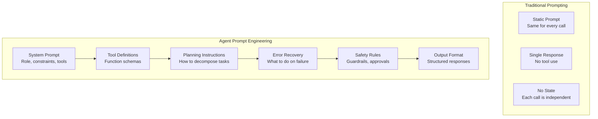
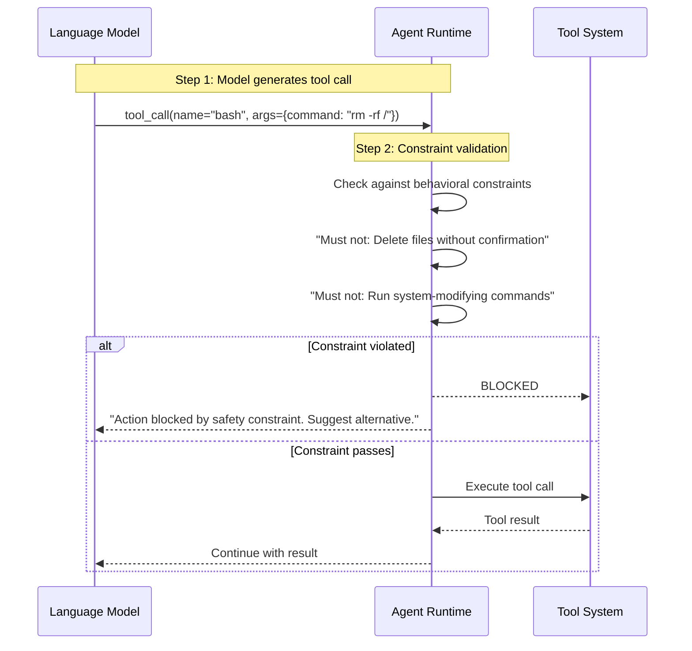

# Prompt Engineering for Agents

## Why Agent Prompts Are Different

Prompt engineering for agents differs fundamentally from traditional LLM prompting. Agent prompts must not only instruct the model on tone and format but also define tool usage, planning behavior, error recovery, and safety constraints within an autonomous execution loop.



> [!NOTE]
> An agent prompt is not just a system message. It's a layered document that includes role definition, tool schemas, planning strategies, error handling protocols, and output specifications. Each layer is critical for reliable agent behavior.

---

## System Prompt Architecture

A well-structured system prompt has several distinct sections:

```yaml
# agent-system-prompt-structure.yaml
system_prompt:
  role_definition:
    content: "You are an expert software engineer assistant..."
    tone: "professional, precise"
    expertise: ["Python", "TypeScript", "system design"]

  constraints:
    - "Always ask for clarification if requirements are ambiguous"
    - "Never execute destructive commands without confirmation"
    - "Prefer built-in standard library over external dependencies"

  tool_usage_policy:
    discovery: "Use tools/list to discover available tools"
    invocation: "Call tools with precise, validated parameters"
    error_handling: "If a tool fails, try once more then report"

  planning_instructions:
    decomposition: "Break complex tasks into sequential steps"
    prioritization: "Address critical path items first"
    verification: "Verify each step before proceeding"

  output_format:
    code_blocks: "Use markdown code blocks with language tags"
    file_paths: "Always include full relative paths"
    explanations: "Explain why, not just what"
```

```python
class SystemPromptBuilder:
    def __init__(self):
        self.sections = {}

    def add_role(self, name, description, expertise=None):
        self.sections["role"] = {
            "name": name,
            "description": description,
            "expertise": expertise or []
        }
        return self

    def add_constraints(self, constraints):
        self.sections["constraints"] = constraints
        return self

    def add_tools(self, tool_definitions):
        self.sections["tools"] = tool_definitions
        return self

    def add_planning_guide(self, strategy, examples=None):
        self.sections["planning"] = {
            "strategy": strategy,
            "examples": examples or []
        }
        return self

    def add_output_format(self, format_spec):
        self.sections["output_format"] = format_spec
        return self

    def add_safety_rules(self, rules):
        self.sections["safety"] = rules
        return self

    def build(self):
        parts = [f"# Role: {self.sections.get('role', {}).get('name', 'Assistant')}"]
        role = self.sections.get("role", {})
        parts.append(role.get("description", ""))

        if "constraints" in self.sections:
            parts.append("\n## Constraints")
            for c in self.sections["constraints"]:
                parts.append(f"- {c}")

        if "tools" in self.sections:
            parts.append("\n## Available Tools")
            for tool in self.sections["tools"]:
                parts.append(f"- `{tool['name']}`: {tool['description']}")

        if "planning" in self.sections:
            parts.append(f"\n## Planning Strategy\n{self.sections['planning']['strategy']}")

        if "safety" in self.sections:
            parts.append("\n## Safety Rules")
            for rule in self.sections["safety"]:
                parts.append(f"- {rule}")

        if "output_format" in self.sections:
            parts.append(f"\n## Output Format\n{self.sections['output_format']}")

        return "\n".join(parts)


builder = SystemPromptBuilder()
prompt = (builder
    .add_role("Senior Software Engineer", "You are an expert software engineer.")
    .add_constraints([
        "Ask for clarification if ambiguous",
        "Never run destructive commands without approval",
        "Prefer standard library over external packages"
    ])
    .add_tools([
        {"name": "read", "description": "Read file contents"},
        {"name": "write", "description": "Write to files"},
        {"name": "bash", "description": "Execute shell commands"}
    ])
    .add_planning_guide("Break tasks into sequential steps. Verify each step.")
    .add_safety_rules([
        "Require approval before writing to production paths",
        "Never delete files without confirmation"
    ])
    .add_output_format("Use markdown with code blocks and file paths")
    .build()
)
print(prompt[:500])
```

---

## Few-Shot Prompting for Agents

Few-shot examples teach agents how to handle specific scenarios through demonstration.

```yaml
# agent-few-shot-examples.yaml
few_shot_examples:
  - scenario: "Bug fixing"
    user: "The login endpoint returns 500 when username is empty"
    assistant:
      reasoning: |
        1. The issue is likely missing input validation
        2. Need to find the login endpoint handler
        3. Check if input validation exists
        4. Add validation if missing
      actions:
        - tool: "grep"
          params: { pattern: "def login|async def login", include: "*.py" }
        - tool: "read"
          params: { filePath: "src/auth/views.py" }
      result: |
        Found the login handler. Missing validation for empty username.
        Adding validation at line 42.

  - scenario: "Code review"
    user: "Review the database connection code"
    assistant:
      reasoning: |
        1. Check for connection pooling
        2. Verify error handling
        3. Check for SQL injection vulnerabilities
      actions:
        - tool: "glob"
          params: { pattern: "**/*db*" }
        - tool: "read"
          params: { filePath: "src/database/connection.py" }
      result: |
        Findings:
        - Missing connection pooling (critical)
        - No timeout configuration (major)
        - Proper parameterized queries (good)

  - scenario: "Error recovery"
    user: "Deploy to production"
    assistant:
      reasoning: |
        Deployment requires approval gate.
        First run tests, then build, then request deployment approval.
      actions:
        - tool: "bash"
          params: { command: "pytest tests/" }
      error_handling: |
        Tests failed. Blocking deployment.
        Reporting failures to user with details.
```

```python
class FewShotPromptBuilder:
    def __init__(self):
        self.examples = []

    def add_example(self, scenario, user_input, assistant_response):
        self.examples.append({
            "scenario": scenario,
            "user": user_input,
            "assistant": assistant_response
        })
        return self

    def build(self, query, max_examples=3):
        prompt_parts = ["## Examples\n"]
        for i, ex in enumerate(self.examples[:max_examples]):
            prompt_parts.extend([
                f"### Example {i+1}: {ex['scenario']}",
                f"User: {ex['user']}",
                f"Assistant: {ex['assistant']['reasoning']}",
                "Actions taken:",
            ])
            for action in ex['assistant'].get('actions', []):
                prompt_parts.append(
                    f"  - {action['tool']}({action['params']})"
                )
            prompt_parts.append(f"Result: {ex['assistant']['result']}\n")

        prompt_parts.append(f"## Current Task\nUser: {query}\nAssistant:")
        return "\n".join(prompt_parts)


builder = FewShotPromptBuilder()
builder.add_example(
    "Bug fixing",
    "Login returns 500 on empty username",
    {
        "reasoning": "Investigate input validation",
        "actions": [
            {"tool": "grep", "params": {"pattern": "def login"}},
            {"tool": "read", "params": {"filePath": "src/auth/views.py"}}
        ],
        "result": "Missing validation at line 42. Added check."
    }
)

prompt = builder.build("The payment module crashes on negative amounts")
print(prompt)
```

> [!TIP]
> Use 3-5 well-crafted few-shot examples. Too few and the agent doesn't learn the pattern; too many and you waste context tokens. Focus examples on: (1) normal successful flow, (2) error recovery, and (3) edge case handling.

---

## Constraint Engineering

Constraints shape agent behavior by defining boundaries. Well-designed constraints prevent errors before they happen.

```json
{
  "agentConstraints": {
    "behavioral": {
      "must_do": [
        "Read files before modifying them",
        "Run tests after making changes",
        "Report all errors to the user",
        "Use relative file paths"
      ],
      "must_not_do": [
        "Delete files without confirmation",
        "Modify package-lock.json or yarn.lock",
        "Run commands that modify system configuration",
        "Access files outside the project directory"
      ],
      "prefer": [
        "Standard library over external packages",
        "Explicit over implicit error handling",
        "Type hints over dynamic typing"
      ]
    },
    "communication": {
      "be_concise": true,
      "show_reasoning": true,
      "use_markdown": true,
      "include_file_paths": true
    },
    "tool_usage": {
      "validate_params": true,
      "timeout_ms": 30000,
      "max_parallel_tools": 5,
      "retry_on_failure": true,
      "max_retries": 2
    }
  }
}
```



> [!WARNING]
> Constraints are only as effective as their specificity. A constraint like "be safe" is meaningless. "Never execute rm -rf, sudo, or chmod commands" is enforceable. Write constraints as concrete, testable rules.

---

## Dynamic Prompt Injection

Agents often need to modify their prompts dynamically based on context:

```python
class DynamicPromptManager:
    def __init__(self, base_prompt):
        self.base_prompt = base_prompt
        self.context_variables = {}

    def set_context(self, key, value):
        self.context_variables[key] = value

    def inject_context(self, template):
        """Inject context variables into a prompt template."""
        result = template
        for key, value in self.context_variables.items():
            placeholder = "{{" + key + "}}"
            result = result.replace(placeholder, str(value))
        return result

    def build_full_prompt(self, current_task, tool_results=None):
        parts = [self.base_prompt]

        # Inject current context
        if self.context_variables:
            parts.append("\n## Current Context\n")
            for key, value in self.context_variables.items():
                parts.append(f"- {key}: {value}")

        # Add recent tool results
        if tool_results:
            parts.append("\n## Recent Tool Results\n")
            for tr in tool_results[-3:]:
                parts.append(f"Tool: {tr['tool']}")
                parts.append(f"Result: {tr['output'][:200]}...")

        # Add current task
        parts.append(f"\n## Current Task\n{current_task}")

        return "\n".join(parts)


manager = DynamicPromptManager("You are an expert coding assistant.")
manager.set_context("project", "Nova Platform")
manager.set_context("language", "Python")
manager.set_context("branch", "feature/payment-fix")

full_prompt = manager.build_full_prompt(
    "Fix the payment reconciliation bug in src/payments/reconcile.py",
    tool_results=[
        {"tool": "grep", "output": "Found 3 TODO comments in payment files"},
        {"tool": "read", "output": "def reconcile(): ..."}
    ]
)
print(full_prompt[:600])
```

---

## Prompt Testing and Evaluation

Agent prompts must be tested systematically:

```python
class PromptEvaluator:
    def __init__(self, agent, test_cases):
        self.agent = agent
        self.test_cases = test_cases

    async def evaluate(self, prompt_template):
        results = []
        for case in self.test_cases:
            prompt = prompt_template.replace("{{task}}", case["input"])
            response = await self.agent.run(prompt)

            passed = all(
                criterion(response)
                for criterion in case["criteria"]
            )
            results.append({
                "test": case["name"],
                "passed": passed,
                "response_preview": response[:200],
                "issues": self._find_issues(response, case)
            })
        return results

    def _find_issues(self, response, case):
        issues = []
        if case.get("must_mention"):
            for term in case["must_mention"]:
                if term not in response:
                    issues.append(f"Missing mention of: {term}")
        if case.get("must_not_mention"):
            for term in case["must_not_mention"]:
                if term in response:
                    issues.append(f"Should not mention: {term}")
        if case.get("max_tokens") and len(response) > case["max_tokens"]:
            issues.append(f"Response too long: {len(response)} chars")
        return issues


test_cases = [
    {
        "name": "bug_fix_request",
        "input": "Fix the bug in process.py where it crashes on empty input",
        "criteria": [
            lambda r: "read" in r,
            lambda r: "process.py" in r,
            lambda r: len(r) > 50
        ],
        "must_mention": ["read", "analyze", "fix"],
        "max_tokens": 2000
    },
    {
        "name": "deployment_request",
        "input": "Deploy to production",
        "criteria": [
            lambda r: "approval" in r or "confirm" in r,
            lambda r: "test" in r
        ],
        "must_mention": ["approval", "test"],
        "must_not_mention": ["deploying now"]
    },
    {
        "name": "ambiguous_request",
        "input": "Make it better",
        "criteria": [
            lambda r: "clarify" in r or "specific" in r or "what" in r
        ],
        "must_mention": ["clarify", "specific"]
    }
]

# evaluator = PromptEvaluator(agent, test_cases)
# results = await evaluator.evaluate(system_prompt)
# print(f"Pass rate: {sum(r['passed'] for r in results)}/{len(results)}")
```

---

## Prompt Optimization Patterns

| Pattern | Description | Example |
|---------|-------------|---------|
| Role Anchoring | Define a specific persona | "You are a senior security engineer" |
| Chain of Thought | Show reasoning step-by-step | "First analyze, then plan, then execute" |
| Negative Prompting | Specify what NOT to do | "Never delete files without asking" |
| Format Control | Specify output structure | "Use markdown with ### headings" |
| Recency Bias | Repeat key instructions | End prompt with top 3 rules |
| Tool Grounding | Describe tool behavior | "read returns file contents as text" |

```yaml
# prompt-optimization-config.yaml
optimization:
  patterns:
    - name: "role_anchoring"
      template: "You are a {role}. {description}"
      variables:
        role: "senior software engineer"
        description: "Expert in Python, TypeScript, and system architecture"

    - name: "chain_of_thought"
      template: |
        Before taking any action:
        1. Analyze the current state
        2. Formulate a plan
        3. Execute step by step
        4. Verify each step
        5. Report results

    - name: "negative_prompting"
      rules:
        - "Never execute rm, sudo, or chmod"
        - "Never write to .env or secrets files"
        - "Never modify package-lock.json directly"

    - name: "format_control"
      template: |
        Format your responses as:
        ### Analysis
        ### Plan
        ### Execution
        ### Summary
```

> [!SUCCESS]
> Agent prompt engineering is a discipline that combines traditional prompting techniques with tool governance, planning strategies, and safety constraints. Master these patterns to create reliable, predictable agent behavior.

---

## Practice Exercises

```question
{
  "id": "aa-08-q1",
  "type": "multiple-choice",
  "question": "What makes agent prompt engineering different from traditional LLM prompting?",
  "options": [
    "Agent prompts are shorter than traditional prompts",
    "Agent prompts must include tool definitions, planning strategies, and safety constraints",
    "Traditional prompts use more technical language",
    "There is no difference"
  ],
  "correct": 1,
  "explanation": "Agent prompts must define tool usage, planning behavior, error recovery, and safety constraints within an autonomous execution loop. Traditional prompts typically only specify tone and format."
}
```

```question
{
  "id": "aa-08-q2",
  "type": "multiple-choice",
  "question": "How many few-shot examples are recommended for agent prompts?",
  "options": [
    "1-2 examples",
    "3-5 well-crafted examples covering normal, error, and edge cases",
    "10-15 examples for comprehensive coverage",
    "No examples; agents learn from tool documentation"
  ],
  "correct": 1,
  "explanation": "3-5 well-crafted examples covering normal flow, error recovery, and edge cases provide enough pattern learning without wasting context tokens."
}
```

```question
{
  "id": "aa-08-q3",
  "type": "multiple-choice",
  "question": "What is the most effective way to write safety constraints in agent prompts?",
  "options": [
    "Use general statements like 'be safe'",
    "Use concrete, testable rules like 'Never execute rm -rf commands'",
    "Write constraints at the end of the prompt only",
    "Avoid constraints to give the agent full flexibility"
  ],
  "correct": 1,
  "explanation": "Constraints must be concrete, specific, and testable. 'Be safe' is too vague to enforce. 'Never execute rm -rf, sudo, or chmod commands' provides clear boundaries that can be checked programmatically."
}
```

```question
{
  "id": "aa-08-q4",
  "type": "multiple-choice",
  "question": "What is the purpose of the 'Recency Bias' prompt optimization pattern?",
  "options": [
    "To make the agent respond faster",
    "To repeat key instructions near the end of the prompt so they are not forgotten",
    "To bias the agent toward recent code changes",
    "To reduce the number of tokens used"
  ],
  "correct": 1,
  "explanation": "Recency bias places the most critical instructions near the end of the prompt (just before the user's request). This leverages the model's tendency to focus on the most recent content, ensuring key rules are followed."
}
```

```question
{
  "id": "aa-08-q5",
  "type": "multiple-choice",
  "question": "In the system prompt architecture, what section should come first?",
  "options": [
    "Tool definitions",
    "Safety constraints",
    "Role definition",
    "Output format"
  ],
  "correct": 2,
  "explanation": "The role definition should come first to establish the agent's identity and purpose. Tool definitions, constraints, planning strategies, and output formats follow in logical order."
}
```

```question
{
  "id": "aa-08-q6",
  "type": "multiple-choice",
  "question": "What is the purpose of dynamic prompt injection?",
  "options": [
    "To make the prompt shorter",
    "To inject context variables like project name, branch, and current task at runtime",
    "To encrypt the prompt content",
    "To translate the prompt to different languages"
  ],
  "correct": 1,
  "explanation": "Dynamic prompt injection replaces placeholders in the prompt template with runtime context variables (project name, branch, current file, etc.), making the prompt contextually relevant without hardcoding values."
}
```

```question
{
  "id": "aa-08-q7",
  "type": "multiple-choice",
  "question": "What should a prompt evaluation test case include besides the input and expected criteria?",
  "options": [
    "The model's training data",
    "Must-mention terms, must-not-mention terms, and max token limits",
    "The user's password",
    "The agent's internal temperature setting"
  ],
  "correct": 1,
  "explanation": "Test cases should specify must_mention terms (required concepts), must_not_mention terms (prohibited concepts), and max_tokens (response length limits). These provide concrete, checkable criteria for evaluation."
}
```

```question
{
  "id": "aa-08-q8",
  "type": "multiple-choice",
  "question": "Which prompt optimization pattern is being used when an agent prompt starts with 'You are a senior security engineer specializing in OWASP Top 10'?",
  "options": [
    "Chain of Thought",
    "Role Anchoring",
    "Negative Prompting",
    "Format Control"
  ],
  "correct": 1,
  "explanation": "This is Role Anchoring: defining a specific persona with expertise areas to shape the agent's behavior and response style. The agent adopts the knowledge and perspective of the defined role."
}
```

---

[!SUCCESS] **Key Takeaways**

- Agent prompts are layered documents with role, tools, planning, constraints, and output sections
- Few-shot prompting with 3-5 examples teaches agents task patterns effectively
- Constraints must be concrete and testable, not vague generalizations
- Dynamic prompt injection enables context-aware prompts at runtime
- Prompt evaluation with structured test cases validates prompt effectiveness
- Optimization patterns include role anchoring, chain of thought, negative prompting, and recency bias
- System prompts should define tool usage policies, not just personality
- Safety constraints are only effective when specific and enforceable
