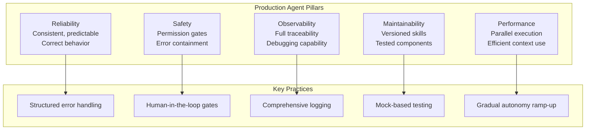
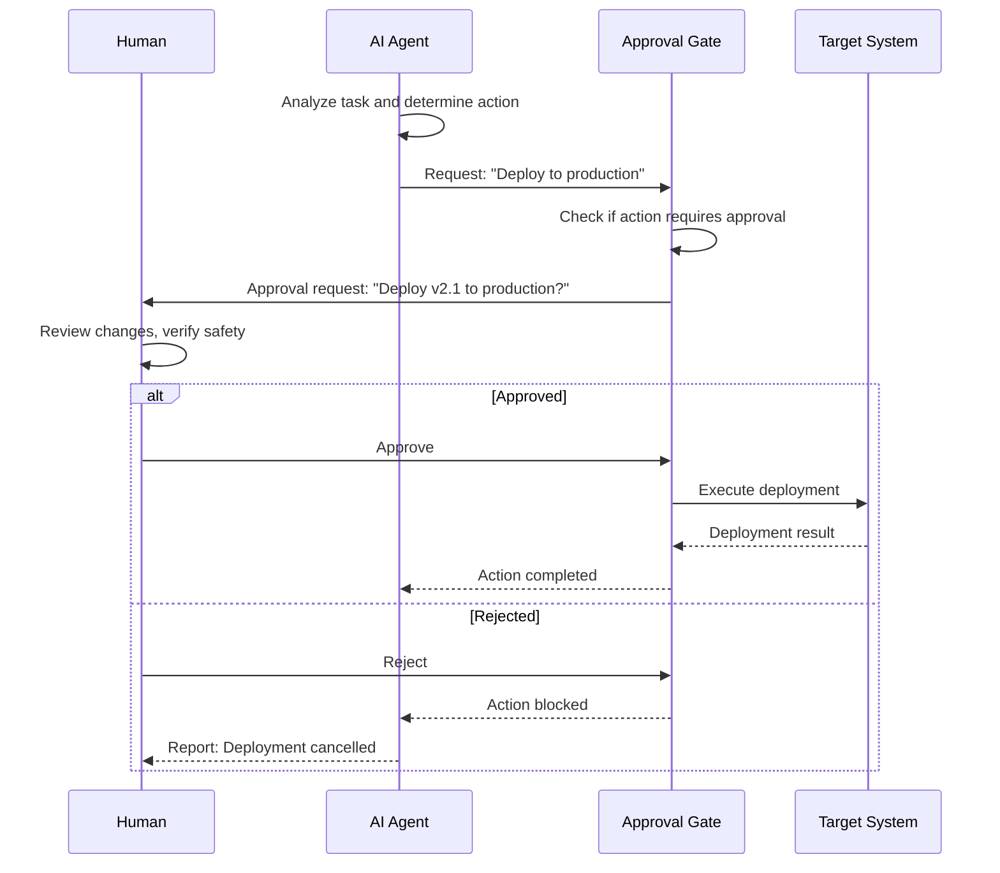

# Best Practices & Patterns

## Production Agent Design Principles

Building reliable production agents requires a systematic approach to design, testing, observability, and safety. These principles form the foundation of production-ready agent systems.



> [!NOTE]
> Production agents fail in ways that prototype agents don't. The difference between a demo and a deployment is how the system handles edge cases, errors, and unexpected inputs at scale.

---

## Reliability Patterns

### 1. Retry with Exponential Backoff

```python
import asyncio
import random

async def execute_with_retry(fn, max_retries=3, base_delay=1.0):
    """Execute a function with exponential backoff retry."""
    last_error = None
    for attempt in range(max_retries):
        try:
            return await fn()
        except Exception as e:
            last_error = e
            if attempt < max_retries - 1:
                delay = base_delay * (2 ** attempt) + random.uniform(0, 0.5)
                print(f"Attempt {attempt + 1} failed. Retrying in {delay:.1f}s...")
                await asyncio.sleep(delay)
    raise last_error
```

### 2. Circuit Breaker

```python
class CircuitBreaker:
    def __init__(self, failure_threshold=5, recovery_timeout=30):
        self.failure_threshold = failure_threshold
        self.recovery_timeout = recovery_timeout
        self.failure_count = 0
        self.last_failure_time = 0
        self.state = "closed"  # closed, open, half-open

    async def call(self, fn):
        if self.state == "open":
            if self._recovery_time_elapsed():
                self.state = "half-open"
            else:
                raise Exception("Circuit breaker is open")

        try:
            result = await fn()
            if self.state == "half-open":
                self.state = "closed"
                self.failure_count = 0
            return result
        except Exception as e:
            self.failure_count += 1
            self.last_failure_time = __import__('time').time()
            if self.failure_count >= self.failure_threshold:
                self.state = "open"
            raise e

    def _recovery_time_elapsed(self):
        return __import__('time').time() - self.last_failure_time > self.recovery_timeout
```

### 3. Timeout Wrapper

```python
import asyncio

async def with_timeout(fn, timeout_seconds=30):
    """Execute with a hard timeout."""
    try:
        return await asyncio.wait_for(fn(), timeout=timeout_seconds)
    except asyncio.TimeoutError:
        raise TimeoutError(f"Operation timed out after {timeout_seconds}s")
```

### 4. Fallback Chain

```python
class FallbackChain:
    def __init__(self, strategies):
        self.strategies = strategies

    async def execute(self):
        errors = []
        for name, fn in self.strategies:
            try:
                print(f"Trying strategy: {name}")
                return await fn()
            except Exception as e:
                errors.append(f"{name}: {e}")
                continue
        raise Exception(f"All strategies failed: {errors}")

# Example usage
fallback = FallbackChain([
    ("primary_api", lambda: call_api("primary")),
    ("secondary_api", lambda: call_api("secondary")),
    ("cache", lambda: load_from_cache()),
])
```

---

## Observability and Monitoring

Every agent action should be traceable for debugging and audit purposes.

```python
import json
import time

class AgentLogger:
    def __init__(self):
        self.events = []

    def log(self, event_type, data):
        entry = {
            "timestamp": time.time(),
            "type": event_type,
            "data": data
        }
        self.events.append(entry)
        print(f"[{event_type}] {json.dumps(data, default=str)[:200]}")

    def log_perception(self, input_data):
        self.log("perception", {"input": input_data[:200]})

    def log_reasoning(self, plan):
        self.log("reasoning", {"plan": plan})

    def log_tool_call(self, tool, params, result):
        self.log("tool_call", {
            "tool": tool,
            "params": params,
            "result_status": "success" if result.get("status") == "success" else "error",
            "result_preview": str(result)[:200]
        })

    def log_error(self, stage, error):
        self.log("error", {"stage": stage, "error": str(error)})

    def get_session_summary(self):
        errors = [e for e in self.events if e["type"] == "error"]
        tool_calls = [e for e in self.events if e["type"] == "tool_call"]
        return {
            "total_events": len(self.events),
            "errors": len(errors),
            "tool_calls": len(tool_calls),
            "duration": self.events[-1]["timestamp"] - self.events[0]["timestamp"] if len(self.events) > 1 else 0
        }

    def export_json(self, path):
        with open(path, "w") as f:
            json.dump(self.events, f, indent=2)


logger = AgentLogger()
logger.log_perception("Fix the login bug in auth.py")
logger.log_reasoning({"steps": ["Read auth.py", "Find login function", "Analyze bug"]})
logger.log_tool_call("read", {"filePath": "src/auth.py"}, {"status": "success", "lines": 150})
logger.log_error("testing", "Test failed: expected 200 got 500")
summary = logger.get_session_summary()
print(f"Session: {summary}")
```

```json
{
  "observability_config": {
    "logging": {
      "level": "debug",
      "include_tool_inputs": true,
      "include_tool_outputs": true,
      "max_output_length": 1000,
      "format": "json"
    },
    "tracing": {
      "enabled": true,
      "provider": "otel",
      "export_endpoint": "http://localhost:4318",
      "service_name": "agentic-ai"
    },
    "metrics": {
      "enabled": true,
      "prometheus": {
        "port": 9090,
        "path": "/metrics"
      }
    },
    "audit": {
      "enabled": true,
      "retain_days": 90,
      "include_approvals": true
    }
  }
}
```

---

## Human-in-the-Loop Patterns

HITL ensures humans maintain control over critical agent decisions.



```python
class ApprovalGate:
    def __init__(self, ask_user_fn):
        self.ask_user = ask_user_fn
        self.approval_history = []

    async def request_approval(self, action, details, context=None):
        request = {
            "action": action,
            "details": details,
            "context": context or {},
            "timestamp": __import__('time').time()
        }

        print(f"\n=== APPROVAL REQUIRED ===")
        print(f"Action: {action}")
        print(f"Details: {details}")
        print(f"========================\n")

        approved = await self.ask_user(action, details)

        self.approval_history.append({
            **request,
            "approved": approved,
            "response_time": __import__('time').time()
        })

        return approved

    def get_approval_summary(self):
        total = len(self.approval_history)
        approved = sum(1 for a in self.approval_history if a["approved"])
        return {
            "total_requests": total,
            "approved": approved,
            "rejected": total - approved,
            "approval_rate": approved / total if total > 0 else 0
        }


# Use cases that should require approval
APPROVAL_REQUIRED_ACTIONS = [
    "deploy_production",
    "delete_files",
    "modify_security_config",
    "database_migration",
    "modify_ci_cd",
    "add_ssh_keys",
    "modify_permissions"
]

class SafetyEnforcer:
    def __init__(self, approval_gate):
        self.gate = approval_gate

    async def check_action(self, action_type, action_details):
        if action_type in APPROVAL_REQUIRED_ACTIONS:
            return await self.gate.request_approval(action_type, action_details)
        return True  # Auto-approved

    async def execute_safe(self, action_type, action_fn, action_details=None):
        approved = await self.check_action(action_type, action_details)
        if not approved:
            return {"status": "blocked", "reason": "Approval denied"}

        try:
            result = await action_fn()
            return {"status": "success", "result": result}
        except Exception as e:
            return {"status": "error", "error": str(e)}
```

---

## Testing Strategies for Agents

| Test Level | What It Tests | Tools | Frequency |
|------------|---------------|-------|-----------|
| Unit | Individual skill logic | pytest, mock agents | Per commit |
| Integration | Tool interaction, permissions | Real tools in sandbox | Per PR |
| E2E | Full agent workflow | Staged environment | Per release |
| Stress | Performance under load | Load testing tools | Weekly |
| Edge Case | Unusual inputs, errors | Fuzzing, boundary testing | Per release |
| Regression | No behavior degradation | Snapshot comparisons | Per PR |

```python
import pytest
from unittest.mock import AsyncMock, patch

@pytest.mark.asyncio
async def test_agent_retry_on_failure():
    """Agent should retry failed tool calls."""
    mock_tool = AsyncMock(side_effect=[
        Exception("Network error"),
        Exception("Timeout"),
        {"status": "success", "data": "result"}
    ])

    with patch("agent.tool_registry.call", mock_tool):
        result = await execute_with_retry(
            lambda: agent.tool_registry.call("read", path="test.txt"),
            max_retries=3
        )
        assert result["status"] == "success"
        assert mock_tool.call_count == 3

@pytest.mark.asyncio
async def test_circuit_breaker_opens_after_threshold():
    """Circuit breaker should open after threshold failures."""
    breaker = CircuitBreaker(failure_threshold=3, recovery_timeout=60)
    failing_fn = AsyncMock(side_effect=Exception("Fail"))

    for i in range(3):
        with pytest.raises(Exception):
            await breaker.call(failing_fn)

    assert breaker.state == "open"

    with pytest.raises(Exception, match="Circuit breaker is open"):
        await breaker.call(failing_fn)

@pytest.mark.asyncio
async def test_approval_gate_blocks_unauthorized_actions():
    """Approval gate should block actions that require approval."""
    async def mock_ask(action, details):
        return False  # Always reject

    gate = ApprovalGate(mock_ask)
    enforcer = SafetyEnforcer(gate)

    result = await enforcer.execute_safe(
        "deploy_production",
        lambda: {"status": "deployed"},
        {"environment": "production", "version": "2.0"}
    )

    assert result["status"] == "blocked"

@pytest.mark.asyncio
async def test_fallback_chain_tries_all_strategies():
    """Fallback chain should try all strategies before failing."""
    strategies = [
        ("primary", AsyncMock(side_effect=Exception("Fail"))),
        ("secondary", AsyncMock(side_effect=Exception("Fail"))),
        ("cache", AsyncMock(return_value="cached_data")),
    ]
    chain = FallbackChain(strategies)
    result = await chain.execute()
    assert result == "cached_data"
```

---

## Production Deployment Checklist

```yaml
# deployment-checklist.yaml
deployment_checklist:
  pre_deployment:
    - All skills have unit tests with >80% coverage
    - Integration tests pass for all tool interactions
    - Permission rules reviewed and tested
    - Approval gates configured for all destructive actions
    - Error recovery paths tested for each stage
    - Context management strategy validated

  monitoring:
    - Agent logging configured with appropriate level
    - Error alerts set up for critical failures
    - Performance metrics being collected
    - Approval gate audit trail active
    - Session traceability implemented

  safety:
    - No tools with unrestricted permissions
    - Circuit breakers configured for external calls
    - Timeout values set for all tool operations
    - Human approval required for production changes
    - Rollback strategy documented and tested

  post_deployment:
    - Gradual rollout: 10% -> 50% -> 100%
    - A/B comparison with previous behavior
    - Error rate monitoring for first 24 hours
    - User feedback collection mechanism
    - Performance baseline comparison
```

> [!WARNING]
> Never deploy an agent to production without first testing its behavior in a staging environment with the same permission rules. Agents that behave perfectly in development can fail catastrophically in production due to differences in scale, timing, and data volume.

---

## Practice Exercises

```question
{
  "id": "aa-09-q1",
  "type": "multiple-choice",
  "question": "What is the purpose of a circuit breaker pattern in agent systems?",
  "options": [
    "To increase the speed of tool execution",
    "To prevent repeated calls to a failing service, allowing it time to recover",
    "To break the agent's response into smaller chunks",
    "To encrypt tool call parameters"
  ],
  "correct": 1,
  "explanation": "A circuit breaker monitors for failures and 'opens' the circuit after a threshold, preventing further calls to the failing service. After a recovery timeout, it allows limited traffic to test if the service has recovered."
}
```

```question
{
  "id": "aa-09-q2",
  "type": "multiple-choice",
  "question": "When should exponential backoff be used in agent systems?",
  "options": [
    "For all tool calls regardless of failure type",
    "For transient failures like network timeouts and rate limits",
    "Only for file read operations",
    "Exponential backoff is not recommended for agents"
  ],
  "correct": 1,
  "explanation": "Exponential backoff is appropriate for transient failures (network issues, rate limits, temporary service unavailability). It should not be used for permanent failures (invalid parameters, permission denied)."
}
```

```question
{
  "id": "aa-09-q3",
  "type": "multiple-choice",
  "question": "What actions should typically require human approval in an agent system?",
  "options": [
    "Reading files in the src directory",
    "Production deployments, file deletions, and security configuration changes",
    "Running linters and formatters",
    "Searching for TODO comments"
  ],
  "correct": 1,
  "explanation": "High-risk operations like production deployments, file deletions, security config changes, and database migrations should always require human approval. Read-only operations like searching and reading typically do not."
}
```

```question
{
  "id": "aa-09-q4",
  "type": "multiple-choice",
  "question": "What is the purpose of a fallback chain pattern?",
  "options": [
    "To execute all strategies simultaneously and pick the fastest",
    "To try alternative strategies in sequence when the primary fails",
    "To log all failed attempts for later analysis",
    "To cache successful results for future use"
  ],
  "correct": 1,
  "explanation": "A fallback chain tries strategies in order: primary first, and if it fails, tries secondary, then tertiary, etc. This provides resilience by having backup plans when the primary approach fails."
}
```

```question
{
  "id": "aa-09-q5",
  "type": "multiple-choice",
  "question": "What should an agent logger capture for each tool call?",
  "options": [
    "Only the tool name",
    "Tool name, parameters, result status, and a preview of the output",
    "Only error messages",
    "The full content of every file read"
  ],
  "correct": 1,
  "explanation": "A good agent log captures tool name, parameters, result status (success/error), and a preview of the output. Full output may be truncated to control log size. This enables debugging and audit trails."
}
```

```question
{
  "id": "aa-09-q6",
  "type": "multiple-choice",
  "question": "What is the recommended deployment strategy for agent systems?",
  "options": [
    "Deploy to all users simultaneously",
    "Gradual rollout: 10% -> 50% -> 100% with monitoring",
    "Deploy only to internal tools, never production",
    "Deploy at midnight when fewer users are active"
  ],
  "correct": 1,
  "explanation": "Gradual rollout with monitoring allows detecting issues early before they affect all users. Start with a small percentage, monitor error rates and behavior, then gradually increase."
}
```

```question
{
  "id": "aa-09-q7",
  "type": "multiple-choice",
  "question": "Which testing level should verify that an agent's permission rules are working correctly?",
  "options": [
    "Unit tests (mock level)",
    "Integration tests with real tools in a sandbox",
    "Load tests",
    "No testing needed for permissions"
  ],
  "correct": 1,
  "explanation": "Integration tests with real tools in a sandbox environment verify that permission rules actually block unauthorized actions and allow authorized ones. Mock tests cannot verify this because they bypass the permission system."
}
```

```question
{
  "id": "aa-09-q8",
  "type": "multiple-choice",
  "question": "What is the main risk of deploying an agent that only worked in development testing?",
  "options": [
    "It will be slower in production",
    "Differences in scale, data volume, and timing can cause unexpected failures",
    "It will use more tokens than expected",
    "The model will need to be fine-tuned again"
  ],
  "correct": 1,
  "explanation": "Development environments differ from production in scale, data volume, timing, network conditions, and tool availability. An agent that works perfectly in dev can fail catastrophically in production. Always test in a staging environment that mirrors production."
}
```

---

[!SUCCESS] **Key Takeaways**

- Production agents require reliability patterns: retry with backoff, circuit breakers, timeouts, fallback chains
- Observability through comprehensive logging is essential for debugging and audit
- Human-in-the-loop approval gates protect high-risk operations
- Testing spans unit, integration, E2E, stress, edge case, and regression levels
- Gradual rollout with monitoring is the safe deployment strategy
- Safety enforcement should check actions against a predefined list of high-risk operations
- Development testing is insufficient; staging environments must mirror production
- Agent logging should capture tool calls, reasoning, errors, and approval decisions
