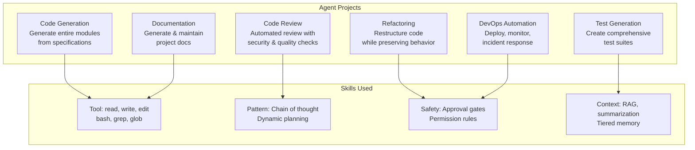
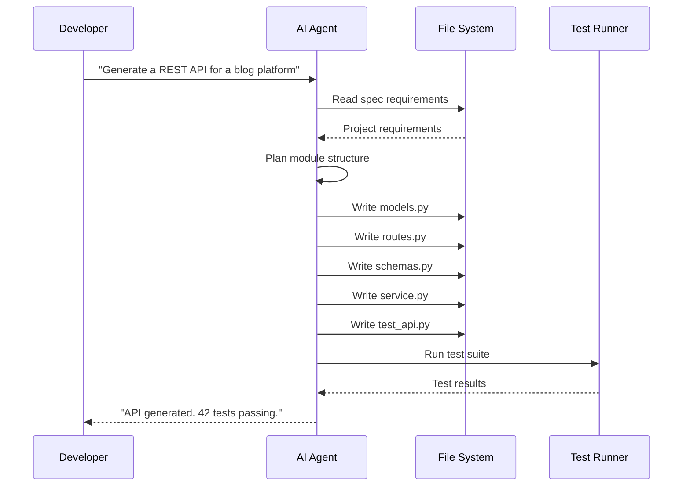

# Real-World Agent Projects

## Overview

This capstone lesson synthesizes everything you have learned into practical, real-world projects. Each project demonstrates how agentic AI techniques apply to common software engineering tasks.



> [!NOTE]
> These projects are designed to be run with OpenCode or any agent framework. Each project includes the configuration, skill definitions, and expected outputs needed for successful execution.

---

## Project 1: Automated Code Generation

Generate a complete REST API module from a specification using an agent.



```yaml
# project-configs/blog-api/skill.yaml
name: blog-api-generator
description: Generate a complete blog REST API from specifications
version: "1.0.0"
instructions:
  - path: instructions/generate-models.md
  - path: instructions/generate-routes.md
  - path: instructions/generate-tests.md
tools:
  required:
    - read
    - write
    - glob
    - bash
resources:
  - path: templates/fastapi-base.py.hbs
  - path: templates/sqlalchemy-model.py.hbs
  - path: templates/pytest-fixtures.py.hbs
autoload:
  enabled: false
```

```python
# Example: Agent generating a FastAPI blog module
GENERATED_MODULE = """
# models.py
from sqlalchemy import Column, Integer, String, Text, DateTime, ForeignKey
from sqlalchemy.sql import func
from database import Base

class User(Base):
    __tablename__ = "users"

    id = Column(Integer, primary_key=True, index=True)
    username = Column(String(50), unique=True, nullable=False)
    email = Column(String(120), unique=True, nullable=False)
    created_at = Column(DateTime(timezone=True), server_default=func.now())

class Post(Base):
    __tablename__ = "posts"

    id = Column(Integer, primary_key=True, index=True)
    title = Column(String(200), nullable=False)
    content = Column(Text, nullable=False)
    author_id = Column(Integer, ForeignKey("users.id"), nullable=False)
    created_at = Column(DateTime(timezone=True), server_default=func.now())
    updated_at = Column(DateTime(timezone=True), onupdate=func.now())

# schemas.py
from pydantic import BaseModel, EmailStr
from datetime import datetime
from typing import Optional

class UserCreate(BaseModel):
    username: str
    email: EmailStr

class UserResponse(BaseModel):
    id: int
    username: str
    email: str
    created_at: datetime

class PostCreate(BaseModel):
    title: str
    content: str

class PostResponse(BaseModel):
    id: int
    title: str
    content: str
    author_id: int
    created_at: datetime
    updated_at: Optional[datetime] = None

# routes.py
from fastapi import APIRouter, Depends, HTTPException, status
from sqlalchemy.orm import Session
from . import models, schemas
from .database import get_db

router = APIRouter(prefix="/api/v1", tags=["blog"])

@router.post("/users/", response_model=schemas.UserResponse, status_code=201)
def create_user(user: schemas.UserCreate, db: Session = Depends(get_db)):
    db_user = models.User(**user.model_dump())
    db.add(db_user)
    db.commit()
    db.refresh(db_user)
    return db_user

@router.get("/posts/", response_model=list[schemas.PostResponse])
def list_posts(skip: int = 0, limit: int = 10, db: Session = Depends(get_db)):
    return db.query(models.Post).offset(skip).limit(limit).all()

@router.post("/posts/", response_model=schemas.PostResponse, status_code=201)
def create_post(post: schemas.PostCreate, db: Session = Depends(get_db)):
    db_post = models.Post(**post.model_dump())
    db.add(db_post)
    db.commit()
    db.refresh(db_post)
    return db_post

@router.get("/posts/{post_id}", response_model=schemas.PostResponse)
def get_post(post_id: int, db: Session = Depends(get_db)):
    post = db.query(models.Post).filter(models.Post.id == post_id).first()
    if not post:
        raise HTTPException(status_code=404, detail="Post not found")
    return post
"""
```

---

## Project 2: Intelligent Code Review

An agent that reviews pull requests for bugs, security issues, and style violations.

```json
{
  "skills": {
    "pr-reviewer": {
      "manifest": "skills/pr-reviewer/skill.yaml",
      "autoLoad": true,
      "matchPattern": "review pull request|review PR|#\\d+"
    }
  },
  "agents": {
    "reviewer": {
      "model": "claude-sonnet-4-20250514",
      "description": "Code review specialist",
      "prompt": "You are a senior code reviewer. Review code for: security vulnerabilities, performance issues, maintainability problems, and style violations.",
      "constraints": {
        "allowedTools": ["read", "grep", "glob", "bash"],
        "deniedTools": ["write", "edit"]
      }
    }
  }
}
```

```python
class CodeReviewAgent:
    def __init__(self, agent):
        self.agent = agent
        self.findings = []

    async def review_pr(self, pr_number, repo_path):
        # Get the diff
        diff = await self.agent.bash(f"cd {repo_path} && git diff main...HEAD")
        changed_files = await self.agent.bash(
            f"cd {repo_path} && git diff --name-only main...HEAD"
        )

        files = changed_files.strip().split("\n")
        for file in files[:10]:
            if file.endswith((".py", ".ts", ".js", ".tsx", ".jsx")):
                content = await self.agent.read(f"{repo_path}/{file}")
                file_review = await self._review_file(file, content)
                self.findings.extend(file_review)

        return self._generate_report()

    async def _review_file(self, file_path, content):
        findings = []
        lines = content.split("\n")

        for i, line in enumerate(lines, 1):
            # Security checks
            if "eval(" in line or "exec(" in line:
                findings.append({
                    "severity": "critical",
                    "file": file_path,
                    "line": i,
                    "type": "code_injection",
                    "description": f"Dangerous function usage at line {i}"
                })

            # Performance checks
            if "for " in line and any(
                nested_line.strip().startswith("for ")
                for nested_line in lines[i:i+5]
            ):
                findings.append({
                    "severity": "major",
                    "file": file_path,
                    "line": i,
                    "type": "nested_loop",
                    "description": "Potential O(n^2) nested loop detected"
                })

            # Hardcoded secrets
            if "password" in line.lower() and "=" in line:
                findings.append({
                    "severity": "critical",
                    "file": file_path,
                    "line": i,
                    "type": "hardcoded_secret",
                    "description": "Possible hardcoded credential"
                })

            # TODO/FIXME tracking
            if "TODO" in line or "FIXME" in line:
                findings.append({
                    "severity": "info",
                    "file": file_path,
                    "line": i,
                    "type": "todo",
                    "description": line.strip()
                })

        return findings

    def _generate_report(self):
        by_severity = {}
        for f in self.findings:
            sev = f["severity"]
            if sev not in by_severity:
                by_severity[sev] = []
            by_severity[sev].append(f)

        report = [
            "# Code Review Report",
            f"**Total Findings**: {len(self.findings)}",
            "",
            "## Summary by Severity",
        ]
        for sev in ["critical", "major", "minor", "info"]:
            count = len(by_severity.get(sev, []))
            report.append(f"- **{sev.capitalize()}**: {count}")
        report.append("")

        for sev in ["critical", "major", "minor", "info"]:
            items = by_severity.get(sev, [])
            if items:
                report.append(f"## {sev.capitalize()} Issues")
                for item in items[:5]:
                    report.append(
                        f"- [{item['type']}] {item['file']}:{item['line']}"
                    )
                    report.append(f"  {item['description']}")
                report.append("")

        return "\n".join(report)
```

---

## Project 3: Automated Refactoring

An agent that safely restructures code while preserving behavior.

```python
class RefactoringAgent:
    def __init__(self, agent):
        self.agent = agent
        self.changes = []

    async def refactor(self, file_path, strategy):
        content = await self.agent.read(file_path)

        if strategy == "extract_function":
            result = await self._extract_function(content, file_path)
        elif strategy == "rename_variable":
            result = await self._rename_variable(content, file_path)
        elif strategy == "add_type_hints":
            result = await self._add_type_hints(content, file_path)
        else:
            return {"status": "error", "message": f"Unknown strategy: {strategy}"}

        return result

    async def _extract_function(self, content, file_path):
        lines = content.split("\n")
        # Find long functions (simplified heuristic)
        changes = []
        i = 0
        while i < len(lines):
            if lines[i].startswith("def ") and i + 30 < len(lines):
                # Function is long, suggest extraction
                func_name = lines[i][4:].split("(")[0]
                changes.append({
                    "type": "extract_function",
                    "function": func_name,
                    "start_line": i + 1,
                    "length": "30+ lines",
                    "suggestion": f"Extract helper functions from {func_name}"
                })
                i += 30
            i += 1

        return {"status": "analyzed", "changes": changes}

    async def _rename_variable(self, content, file_path):
        # Find poorly named variables
        import re
        lines = content.split("\n")
        changes = []
        bad_names = re.findall(r'\b([a-z]{1,2})\s*=', content)
        for name in set(bad_names):
            if name not in ["id", "ok", "no"]:
                changes.append({
                    "type": "rename_variable",
                    "old_name": name,
                    "suggestion": f"Rename '{name}' to a more descriptive name"
                })
        return {"status": "analyzed", "changes": changes}

    async def _add_type_hints(self, content, file_path):
        lines = content.split("\n")
        changes = []
        for i, line in enumerate(lines, 1):
            if line.startswith("def ") and "->" not in line:
                func = line[4:].split("(")[0]
                changes.append({
                    "type": "add_return_type",
                    "function": func,
                    "line": i,
                    "suggestion": f"Add return type hint to {func}"
                })
        return {"status": "analyzed", "changes": changes}
```

> [!TIP]
> When refactoring with agents, always use a version control system. Create a branch, apply changes incrementally, and run tests after each change. If a refactoring breaks tests, the agent can analyze the failure and self-correct.

---

## Project 4: Test Generation

An agent that creates comprehensive test suites from source code analysis.

```yaml
# skills/test-generator/skill.yaml
name: test-generator
description: Generate comprehensive test suites from source code analysis
version: "2.0.0"
instructions:
  - path: instructions/analyze-source.md
  - path: instructions/generate-tests.md
  - path: instructions/validate-tests.md
tools:
  required:
    - read
    - write
    - bash
  optional:
    - grep
resources:
  - path: templates/pytest-test.py.hbs
  - path: templates/jest-test.ts.hbs
autoload:
  enabled: true
  matchPattern: "generate tests|create tests|add test coverage"
```

```python
class TestGenerator:
    def __init__(self, agent):
        self.agent = agent

    async def generate_tests(self, source_path):
        content = await self.agent.read(source_path)
        tree = self._parse_functions(content)
        test_file = self._build_test_file(source_path, tree)
        test_path = source_path.replace("src/", "tests/").replace(".py", "_test.py")
        await self.agent.write(test_path, test_file)
        return {"test_file": test_path, "test_count": len(tree)}

    def _parse_functions(self, content):
        import ast
        tree = ast.parse(content)
        functions = []
        for node in ast.walk(tree):
            if isinstance(node, ast.FunctionDef):
                functions.append({
                    "name": node.name,
                    "args": [a.arg for a in node.args.args],
                    "decorators": [
                        d.id for d in node.decorator_list
                        if isinstance(d, ast.Name)
                    ]
                })
        return functions

    def _build_test_file(self, source_path, functions):
        module_name = source_path.split("/")[-1].replace(".py", "")
        lines = [
            f'"""Tests for {module_name} module."""',
            "import pytest",
            f"from {module_name} import (",
        ]
        for func in functions:
            lines.append(f"    {func['name']},")
        lines.append(")")
        lines.append("")

        for func in functions:
            lines.extend(self._generate_test_case(func))

        return "\n".join(lines)

    def _generate_test_case(self, func):
        name = func["name"]
        params = func["args"]

        test_cases = [
            f"def test_{name}_basic():",
            f'    """Test basic {name} functionality."""',
            f"    # TODO: Implement test for {name}",
            f"    # result = {name}({', '.join(params)})",
            f"    # assert result is not None",
            f"    pass",
            "",
            f"def test_{name}_edge_cases():",
            f'    """Test {name} with edge case inputs."""',
            f"    # TODO: Add edge case tests",
            f"    pass",
            "",
        ]
        return test_cases
```

---

## Project 5: Documentation Generation

```python
class DocGenerator:
    def __init__(self, agent):
        self.agent = agent

    async def generate_docs(self, project_root):
        files = await self.agent.glob(f"{project_root}/**/*.py")
        docs = []

        for file in files[:20]:
            content = await self.agent.read(file)
            module_doc = self._extract_module_doc(content)
            functions = self._parse_functions(content)

            doc_section = [
                f"## Module: {file}",
                "",
                module_doc or "No module documentation.",
                "",
                "### Functions",
                "",
            ]
            for func in functions:
                doc_section.extend([
                    f"#### `{func['name']}({', '.join(func['args'])})`",
                    "",
                    func["docstring"] or "No documentation.",
                    "",
                ])
            docs.append("\n".join(doc_section))

        return "# API Documentation\n\n" + "\n---\n".join(docs)

    def _extract_module_doc(self, content):
        import ast
        try:
            tree = ast.parse(content)
            return ast.get_docstring(tree)
        except SyntaxError:
            return None

    def _parse_functions(self, content):
        import ast
        try:
            tree = ast.parse(content)
            functions = []
            for node in ast.walk(tree):
                if isinstance(node, ast.FunctionDef) and not node.name.startswith("_"):
                    functions.append({
                        "name": node.name,
                        "args": [a.arg for a in node.args.args],
                        "docstring": ast.get_docstring(node)
                    })
            return functions
        except SyntaxError:
            return []
```

---

## Practice Exercises

```question
{
  "id": "aa-10-q1",
  "type": "multiple-choice",
  "question": "What is the recommended approach when an agent refactoring breaks existing tests?",
  "options": [
    "Delete the failing tests and continue",
    "The agent should analyze the failure, self-correct, and re-run",
    "Ignore the test failures and deploy anyway",
    "Disable all tests before refactoring"
  ],
  "correct": 1,
  "explanation": "When tests break, the agent should analyze the failure message, understand what went wrong, correct its approach, and re-run tests. This is the agent equivalent of TDD: make the tests pass again."
}
```

```question
{
  "id": "aa-10-q2",
  "type": "multiple-choice",
  "question": "In the code review project, what security issue does the agent check for?",
  "options": [
    "Code formatting consistency",
    "eval()/exec() usage, hardcoded secrets, and TODO tracking",
    "Test coverage percentage",
    "API response times"
  ],
  "correct": 1,
  "explanation": "The code review agent checks for dangerous functions (eval/exec), hardcoded credentials, nested loops (performance), and tracks TODO/FIXME comments. These represent security, performance, and maintainability concerns."
}
```

```question
{
  "id": "aa-10-q3",
  "type": "multiple-choice",
  "question": "What tool does the test generator use to parse source code and identify functions?",
  "options": [
    "Regular expressions",
    "Python's ast module (Abstract Syntax Tree)",
    "String splitting",
    "The grep tool"
  ],
  "correct": 1,
  "explanation": "The test generator uses Python's ast module to parse source code into an Abstract Syntax Tree, which allows reliable identification of functions, their parameters, and decorators without fragile regex parsing."
}
```

```question
{
  "id": "aa-10-q4",
  "type": "multiple-choice",
  "question": "What is the purpose of using a branch for agent-driven refactoring?",
  "options": [
    "To slow down the refactoring process",
    "To provide a safe rollback point if the refactoring goes wrong",
    "To make the refactoring run faster",
    "To avoid triggering CI/CD pipelines"
  ],
  "correct": 1,
  "explanation": "A branch provides a safe rollback point. If the agent's refactoring introduces issues, the branch can be discarded without affecting the main codebase. Each refactoring change can be committed incrementally."
}
```

```question
{
  "id": "aa-10-q5",
  "type": "multiple-choice",
  "question": "In the blog API generation project, what framework is used for the generated API?",
  "options": [
    "Django REST Framework",
    "FastAPI",
    "Flask",
    "Express.js"
  ],
  "correct": 1,
  "explanation": "The generated code uses FastAPI with SQLAlchemy for ORM, Pydantic for schemas, and pytest for testing. FastAPI was chosen for its automatic OpenAPI documentation and type safety."
}
```

```question
{
  "id": "aa-10-q6",
  "type": "multiple-choice",
  "question": "What file naming convention does the test generator use when creating test files?",
  "options": [
    "test_<module>.py",
    "<module>_test.py",
    "<module>.spec.py",
    "test_<module>_unittest.py"
  ],
  "correct": 0,
  "explanation": "The test generator uses the pytest convention: test_<module>.py. The source file src/module.py generates tests/test_module.py. This follows Python testing best practices."
}
```

```question
{
  "id": "aa-10-q7",
  "type": "multiple-choice",
  "question": "What information does the documentation generator extract from source code?",
  "options": [
    "Only function names",
    "Module docstrings, function signatures, and function docstrings",
    "Code comments and inline documentation",
    "Git commit history"
  ],
  "correct": 1,
  "explanation": "The documentation generator extracts module-level docstrings, function signatures (name and parameters), and function-level docstrings using Python's ast module."
}
```

```question
{
  "id": "aa-10-q8",
  "type": "multiple-choice",
  "question": "Why does the code review agent use 'deniedTools: [write, edit]'?",
  "options": [
    "To prevent the reviewer from modifying code, making it read-only",
    "Because write operations are not needed for review",
    "Both A and B: the agent should inspect, not modify",
    "To reduce token usage"
  ],
  "correct": 2,
  "explanation": "A code review agent should be read-only: it inspects code and reports findings but never modifies it. Denying write and edit tools ensures the reviewer cannot accidentally change code during review."
}
```

---

[!SUCCESS] **Key Takeaways**

- Real-world agent projects span code generation, review, refactoring, testing, and documentation
- Code generation agents create complete modules from specifications with models, routes, and tests
- Code review agents should be read-only, inspecting code for bugs, security issues, and style problems
- Refactoring agents should use version control branches for safe, reversible changes
- Test generation agents create comprehensive test suites by parsing source code structure
- Documentation agents extract module and function documentation from source code automatically
- Each project combines multiple skills: tool use, planning, context management, and safety patterns
- Real agents handle errors, adapt plans, and learn from intermediate results
- The capstone demonstrates the full power of agentic AI: autonomous, multi-step software engineering
