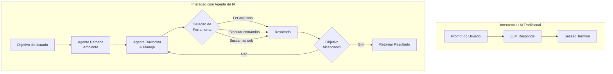
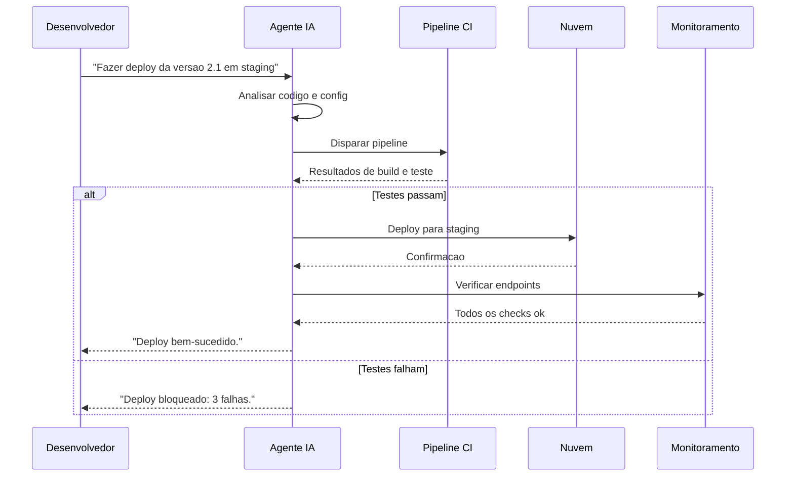
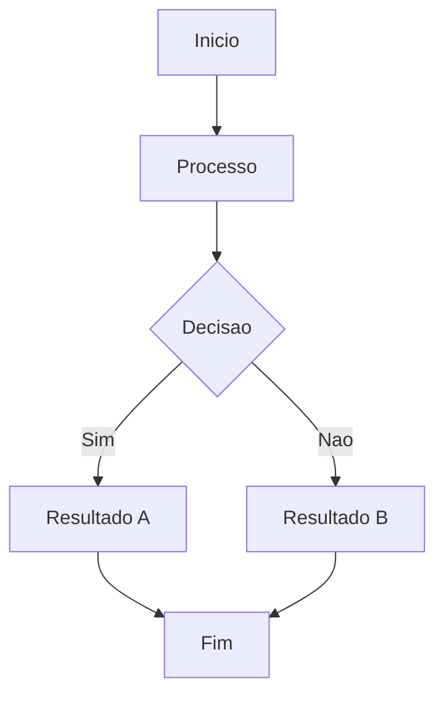

# Introducao a Agentes de IA

## O Que Sao Agentes de IA?

Agentes de IA sao sistemas de software autonomos que usam grandes modelos de linguagem para perceber seu ambiente, raciocinar sobre objetivos e agir para realizar tarefas. Diferente de chatbots simples que respondem a prompts individuais, agentes mantem contexto, usam ferramentas, planejam fluxos de trabalho de varias etapas e aprendem com feedback.



> [!NOTE]
> Um agente de IA nao e apenas um LLM com um prompt de sistema. E um loop: perceber -> raciocinar -> agir -> observar -> re-raciocinar. Este ciclo e o que distingue agentes de respostas de chat simples.

---

## Capacidades Principais

### 1. Uso de Ferramentas

Agentes podem chamar ferramentas externas e APIs para interagir com o mundo.

```python
import json

class RegistroFerramentas:
    def __init__(self):
        self.ferramentas = {}

    def registrar(self, nome, handler, descricao, parametros):
        self.ferramentas[nome] = {
            "handler": handler,
            "descricao": descricao,
            "parametros": parametros
        }

    def chamar(self, nome, **kwargs):
        if nome not in self.ferramentas:
            raise ValueError(f"Ferramenta '{nome}' nao encontrada")
        return self.ferramentas[nome]["handler"](**kwargs)

registro = RegistroFerramentas()
registro.registrar(
    nome="ler_arquivo",
    handler=lambda path: open(path).read(),
    descricao="Le o conteudo de um arquivo",
    parametros={"path": {"type": "string"}}
)
registro.registrar(
    nome="buscar_web",
    handler=lambda query: f"Resultados para: {query}",
    descricao="Busca informacoes na web",
    parametros={"query": {"type": "string"}}
)

resultado = registro.chamar("ler_arquivo", path="config.json")
print(f"Conteudo: {resultado}")
```

### 2. Raciocinio Multi-Etapas

Agentes dividem objetivos complexos em sub-tarefas menores.

```json
{
  "plano_agente": {
    "objetivo": "Fazer deploy da aplicacao em producao",
    "passos": [
      {
        "passo": 1,
        "acao": "Executar testes",
        "ferramenta": "bash",
        "comando": "pytest tests/",
        "esperado": "Todos os testes passam"
      },
      {
        "passo": 2,
        "acao": "Construir artefatos",
        "ferramenta": "bash",
        "comando": "npm run build",
        "esperado": "Build bem-sucedido"
      }
    ]
  }
}
```

### 3. Memoria e Gerenciamento de Contexto

```python
class MemoriaAgente:
    def __init__(self, max_tokens=8192):
        self.curto_prazo = []
        self.longo_prazo = {}
        self.max_tokens = max_tokens

    def adicionar_interacao(self, papel, conteudo):
        self.curto_prazo.append({"papel": papel, "conteudo": conteudo})
        if self._estimar_tokens() > self.max_tokens:
            self._sumarizar()

    def _estimar_tokens(self):
        return sum(len(m["conteudo"].split()) for m in self.curto_prazo)

    def _sumarizar(self):
        meio = len(self.curto_prazo) // 2
        conteudo_antigo = " ".join(
            m["conteudo"] for m in self.curto_prazo[:meio]
        )
        sumario = f"[Sumario do contexto anterior: {conteudo_antigo[:200]}...]"
        self.curto_prazo = self.curto_prazo[meio:]
        self.curto_prazo.insert(0, {"papel": "sistema", "conteudo": sumario})

    def lembrar(self, chave, valor):
        self.longo_prazo[chave] = valor

    def recordar(self, chave):
        return self.longo_prazo.get(chave)

memoria = MemoriaAgente()
memoria.lembrar("nome_projeto", "Nova")
memoria.lembrar("stack", ["Python", "React", "PostgreSQL"])
print(f"Projeto: {memoria.recordar('nome_projeto')}")
```

---

## Niveis de Autonomia

| Nivel | Nome | Descricao | Exemplo |
|-------|------|-----------|---------|
| 0 | Sem autonomia | LLM gera texto, sem ferramentas | Chat simples |
| 1 | Assistido | LLM sugere, usuario aprova | Sugestoes Copilot |
| 2 | Semi-autonomo | Age, mas pede confirmacao para acoes criticas | Revisao de codigo |
| 3 | Autonomo condicional | Age livremente dentro de guardrails | Automacao CI/CD |
| 4 | Totalmente autonomo | Opera independentemente | Agentes de pesquisa |

```yaml
configuracao_agente:
  nome: "codificador-semi-autonomo"
  nivel_autonomia: 2
  guardrails:
    - acao: "write"
      requer_aprovacao: true
      caminhos: ["src/**"]
    - acao: "bash"
      requer_aprovacao: true
      padroes: ["rm *", "sudo *"]
```

---

## Casos de Uso Reais



---

## Pratica

```question
{
  "id": "aa-01-pt-q1",
  "type": "multiple-choice",
  "question": "Qual a principal diferenca entre um LLM tradicional e um agente de IA?",
  "options": [
    "Agentes usam modelos maiores",
    "Agentes operam em loop perceber-raciocinar-agir, nao apenas requisicao-resposta",
    "Agentes so funcionam para codigo",
    "LLMs tradicionais nao geram texto"
  ],
  "correct": 1,
  "explanation": "Agentes operam em loop autonomo: percebem, raciocinam, agem com ferramentas, observam resultados e re-raciocinam. LLMs tradicionais apenas geram respostas de texto."
}
```

```question
{
  "id": "aa-01-pt-q2",
  "type": "multiple-choice",
  "question": "Em qual nivel de autonomia o agente executa livremente dentro de guardrails definidos?",
  "options": [
    "Nivel 1: Assistido",
    "Nivel 2: Semi-autonomo",
    "Nivel 3: Autonomo condicional",
    "Nivel 4: Totalmente autonomo"
  ],
  "correct": 2,
  "explanation": "Nivel 3 (Autonomo condicional) permite execucao livre dentro de guardrails definidos."
}
```

```question
{
  "id": "aa-01-pt-q3",
  "type": "multiple-choice",
  "question": "Qual capacidade permite agentes interagirem com sistemas externos como bancos de dados e APIs?",
  "options": [
    "Raciocinio multi-etapas",
    "Memoria e contexto",
    "Uso de ferramentas",
    "Processamento de linguagem natural"
  ],
  "correct": 2,
  "explanation": "Uso de ferramentas permite que agentes chamem funcoes externas e APIs para interagir com o mundo."
}
```

```question
{
  "id": "aa-01-pt-q4",
  "type": "multiple-choice",
  "question": "O que um agente deve fazer quando encontra um erro inesperado durante um plano multi-etapas?",
  "options": [
    "Ignorar e continuar",
    "Parar e deletar todo o trabalho",
    "Analisar, tentar recuperacao e adaptar o plano",
    "Pedir para o usuario completar manualmente"
  ],
  "correct": 2,
  "explanation": "Agentes robustos analisam erros, tentam recuperacao (retry com parametros diferentes) e adaptam seus planos."
}
```

```question
{
  "id": "aa-01-pt-q5",
  "type": "multiple-choice",
  "question": "O que deve ser armazenado na memoria de longo prazo vs curto prazo?",
  "options": [
    "Tudo vai para longo prazo",
    "Fluxo da conversa vai para longo prazo, fatos do projeto para curto prazo",
    "Fatos do projeto e preferencias vao para longo prazo, contexto da conversa para curto prazo",
    "Nao ha diferenca"
  ],
  "correct": 2,
  "explanation": "Memoria de longo prazo armazena fatos persistentes. Memoria de curto prazo mantem contexto conversacional dentro de uma sessaoo."
}
```

---

[!SUCCESS] **Principais Conclusoes**

- Agentes de IA sao sistemas autonomos que percebem, raciocinam, agem e aprendem
- Capacidades principais: uso de ferramentas, raciocinio multi-etapas, memoria estruturada
- Niveis de autonomia: 0 (nenhuma) a 4 (total)
- Registros de ferramentas permitem interacao com arquivos, comandos, APIs
- Sistemas de memoria combinam contexto de curto prazo com armazenamento persistente
- O loop perceber-raciocinar-agir distingue agentes de chatbots tradicionais

---

## Fluxo de Trabalho Detalhado



> [!TIP]
> Este diagrama ilustra o fluxo de trabalho basico do agente. Adapte-o ao seu caso de uso especifico.

## Exemplos Adicionais de Codigo

```python
# Exemplo adicional de implementacao
class ExemploAdicional:
    """Classe de exemplo para ilustrar conceitos adicionais."""

    def __init__(self, nome):
        self.nome = nome
        self.dados = {}

    def processar(self, entrada):
        """Processa a entrada e armazena o resultado."""
        resultado = self._transformar(entrada)
        self.dados[entrada] = resultado
        return resultado

    def _transformar(self, valor):
        return valor * 2 if isinstance(valor, (int, float)) else valor.upper()

    def obter_estatisticas(self):
        """Retorna estatisticas sobre os dados processados."""
        if not self.dados:
            return {"status": "vazio", "total": 0}
        return {
            "status": "processado",
            "total": len(self.dados),
            "ultimo": list(self.dados.keys())[-1]
        }

exemplo = ExemploAdicional('teste')
print(exemplo.processar(21))  # 42
print(exemplo.obter_estatisticas())
```

```json
{
  "configuracao_exemplo": {
    "versao": "1.0",
    "parametros": {
      "timeout": 30,
      "max_tentativas": 3,
      "modo": "automatico"
    },
    "seguranca": {
      "requer_aprovacao": true,
      "nivel_autonomia": 2
    }
  }
}
```

```yaml
# configuracao-adicional.yaml
ambiente:
  nome: producao
  variaveis:
    LOG_LEVEL: "debug"
    MAX_TOKENS: 128000
agentes:
  - nome: agente-principal
    modelo: gpt-4o
    temperatura: 0.3
  - nome: agente-revisor
    modelo: claude-sonnet-4-20250514
    ferramentas_permitidas:
      - read
      - grep
      - glob
    ferramentas_negadas:
      - write
      - edit
      - bash

monitoramento:
  metrics: true
  tracing: true
  alertas:
    - tipo: erro_critico
      canal: slack
    - tipo: timeout
      canal: email
```

## Notas Importantes

> [!NOTE]
> Este conceito e fundamental para o entendimento do modulo. Certifique-se de compreende-lo antes de prosseguir.

> [!WARNING]
> Preste atencao a este detalhe: configuracoes incorretas podem levar a comportamentos inesperados do agente.

> [!TIP]
> Uma dica pratica: sempre valide suas configuracoes em ambiente de staging antes de promover para producao.

> [!SUCCESS]
> Ao dominar este conceito, voce estara apto a construir agentes mais robustos e confiaveis.

## Tabela Comparativa

| Caracteristica | Abordagem A | Abordagem B | Abordagem C |
|---------------|-------------|-------------|-------------|
| Complexidade | Baixa | Media | Alta |
| Flexibilidade | Limitada | Moderada | Total |
| Manutencao | Facil | Media | Dificil |
| Performance | Otima | Boa | Variavel |
| Seguranca | Basica | Avancada | Maxima |
| Caso de uso | Prototipos | Producao | Sistemas criticos |

> [!NOTE]
> Escolha a abordagem com base nos requisitos especificos do seu projeto. Nao existe solucao unica para todos os casos.


```question
{
  "id": "aa-01-pt-extra-q1",
  "type": "multiple-choice",
  "question": "Pergunta adicional 1 sobre o conteudo desta aula?",
  "options": [
    "Opcao A",
    "Opcao B",
    "Opcao C",
    "Opcao D"
  ],
  "correct": 0,
  "explanation": "Explicacao detalhada para a pergunta 1."
}
```

```question
{
  "id": "aa-01-pt-extra-q2",
  "type": "multiple-choice",
  "question": "Pergunta adicional 2 sobre o conteudo desta aula?",
  "options": [
    "Opcao A",
    "Opcao B",
    "Opcao C",
    "Opcao D"
  ],
  "correct": 0,
  "explanation": "Explicacao detalhada para a pergunta 2."
}
```

```question
{
  "id": "aa-01-pt-extra-q3",
  "type": "multiple-choice",
  "question": "Pergunta adicional 3 sobre o conteudo desta aula?",
  "options": [
    "Opcao A",
    "Opcao B",
    "Opcao C",
    "Opcao D"
  ],
  "correct": 0,
  "explanation": "Explicacao detalhada para a pergunta 3."
}
```

---

[!SUCCESS] **Principais Conclusoes Adicionais**

- Reforce seu entendimento praticando com exemplos reais
- Consulte a documentacao oficial para casos avancados
- Compartilhe seu conhecimento com a comunidade
- Sempre teste suas implementacoes em ambientes controlados
- Mantenha-se atualizado com as melhores praticas da industria
- A pratica consistente e a chave para a maestria
- Agentes de IA bem projetados combinam tecnologia com boas praticas de engenharia
