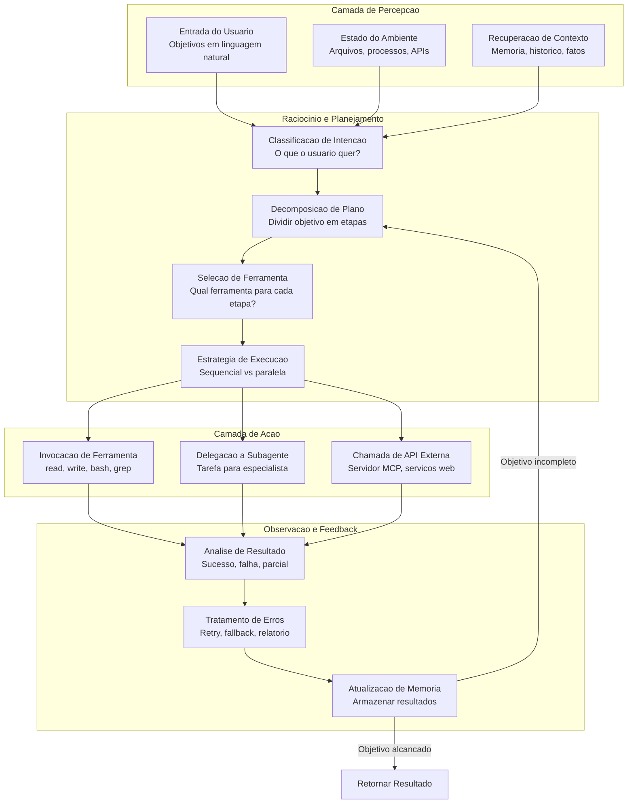
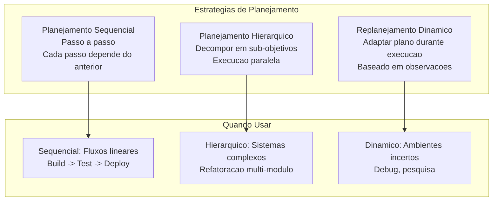
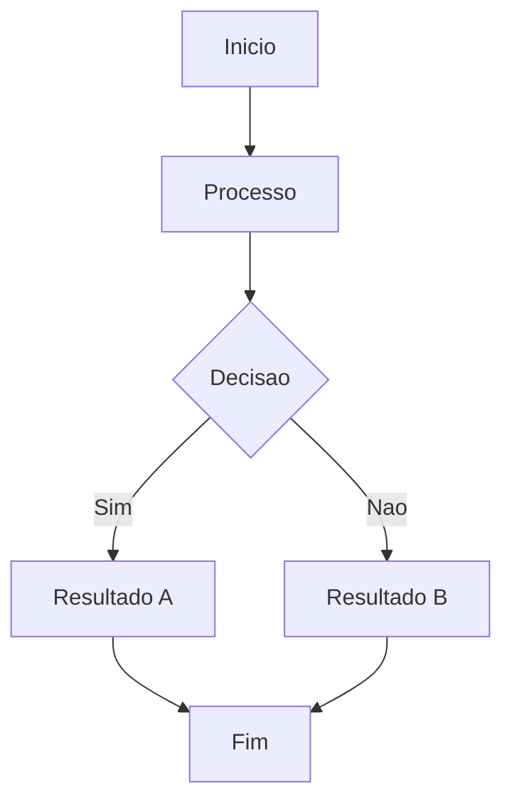

# Arquitetura de Agentes

## O Loop do Agente

Todo agente de IA segue um loop fundamental: perceber o ambiente, raciocinar sobre o estado atual, planejar acoes, executa-las, observar resultados e repetir.



> [!NOTE]
> O loop do agente nao e necessariamente linear. Agentes modernos usam replanejamento dinâmico: se uma etapa falha, o agente nao recomeca — ele reavalia o plano a partir do estado atual.

---

## Camada de Percepcao

```python
class CamadaPercepcao:
    def __init__(self):
        self.canais = {}

    def registrar_canal(self, nome, parser):
        self.canais[nome] = parser

    def perceber(self, entradas):
        percepcao = {}
        for canal, dados in entradas.items():
            if canal in self.canais:
                percepcao[canal] = self.canais[canal](dados)
        return percepcao

    def analisar_entrada_usuario(self, texto):
        return {
            "bruto": texto,
            "intencao": self._classificar_intencao(texto),
            "entidades": self._extrair_entidades(texto),
            "urgencia": self._detectar_urgencia(texto)
        }

    def _classificar_intencao(self, texto):
        intencoes = {
            "gerar": ["criar", "escrever", "implementar", "construir"],
            "analisar": ["analisar", "revisar", "verificar", "auditar"],
            "modificar": ["mudar", "atualizar", "refatorar", "corrigir"],
            "consultar": ["o que", "como", "por que", "onde"]
        }
        for intencao, keywords in intencoes.items():
            if any(k in texto.lower() for k in keywords):
                return intencao
        return "desconhecido"

    def _extrair_entidades(self, texto):
        import re
        arquivos = re.findall(r'[\w./-]+\.\w+', texto)
        return {"arquivos": arquivos}

    def _detectar_urgencia(self, texto):
        marcadores = ["urgente", "imediato", "critico", "agora", "importante"]
        return any(m in texto.lower() for m in marcadores)

percepcao = CamadaPercepcao()
resultado = percepcao.analisar_entrada_usuario(
    "Urgente: refatorar modulo auth em src/auth.py para usar JWT"
)
print(f"Intencao: {resultado['intencao']}")
print(f"Arquivos: {resultado['entidades']['arquivos']}")
```

### Canais de Percepcao

| Canal | Fonte | Tipo de Dado | Exemplo |
|-------|-------|-------------|---------|
| Entrada do usuario | Mensagem | Texto com intencao/entidades | "Encontre o bug" |
| Sistema de arquivos | Projeto | Conteudo, metadados | Codigo fonte |
| Ambiente | SO, processos | Estado do sistema | Servicos rodando |
| Memoria | Armazenamento | Interacoes passadas, fatos | Decisoes anteriores |
| Saida de ferramentas | Comandos | stdout, stderr, codigos | Logs de teste |

---

## Motor de Raciocinio

```python
class MotorRaciocinio:
    def __init__(self, cliente_llm):
        self.llm = cliente_llm
        self.plano = []

    def analisar_estado(self, percepcao, memoria):
        prompt = f"""
        Estado atual: {percepcao}
        Contexto disponivel: {memoria.recuperar_relevante(percepcao)}
        Analise a situacao e determine o objetivo principal,
        restricoes existentes, ferramentas necessarias e riscos.
        """
        return self.llm.completar(prompt)

    def decompor_objetivo(self, objetivo, ferramentas_disponiveis):
        prompt = f"""
        Objetivo: {objetivo}
        Ferramentas: {list(ferramentas_disponiveis.keys())}
        Divida em passos sequenciais. Cada passo deve ter:
        - Descricao da acao
        - Ferramenta a usar
        - Resultado esperado
        - Estrategia de recuperacao de erros
        """
        return self.llm.completar(prompt)

    def selecionar_ferramenta(self, passo, registro_ferramentas):
        scores = {}
        for nome, ferramenta in registro_ferramentas.items():
            relevancia = self._calcular_relevancia(passo, ferramenta["descricao"])
            scores[nome] = relevancia
        return max(scores, key=scores.get)

    def _calcular_relevancia(self, passo, descricao):
        keywords = set(passo.lower().split())
        desc_keywords = set(descricao.lower().split())
        overlap = keywords & desc_keywords
        return len(overlap) / max(len(keywords), 1)
```

---

## Estrategias de Planejamento



```yaml
planejamento:
  estrategia: sequencial
  max_tentativas: 3
  parar_ao_falhar: true
  plano:
    - id: 1
      acao: "lint"
      ferramenta: "bash"
      comando: "ruff check src/"
    - id: 2
      acao: "type_check"
      ferramenta: "bash"
      comando: "mypy src/"
      depende_de: [1]
    - id: 3
      acao: "test"
      ferramenta: "bash"
      comando: "pytest tests/"
      depende_de: [2]
```

---

## Gerenciamento de Estado

```json
{
  "estado_agente": {
    "session_id": "sess_abc123",
    "status": "executando",
    "objetivo_atual": "Refatorar modulo de pagamento",
    "plano": {
      "estrategia": "hierarquica",
      "sub_objetivos": [
        {
          "id": "sg_1",
          "descricao": "Analisar codigo atual",
          "status": "completo",
          "resultado": "3 areas para melhoria"
        },
        {
          "id": "sg_2",
          "descricao": "Implementar melhorias",
          "status": "em_progresso",
          "passo_atual": {
            "acao": "edit",
            "arquivo": "src/payment/processor.py"
          }
        }
      ]
    },
    "historico_ferramentas": [
      {"ferramenta": "grep", "padrao": "def validate", "resultado": "Linha 142"}
    ]
  }
}
```

---

## Pratica

```question
{
  "id": "aa-02-pt-q1",
  "type": "multiple-choice",
  "question": "No loop do agente, apos executar uma acao e observar o resultado, o que acontece se o objetivo ainda nao foi alcancado?",
  "options": [
    "O agente termina imediatamente",
    "O agente retorna a fase de raciocinio/planejamento",
    "O agente repete a mesma acao indefinidamente",
    "O agente espera entrada do usuario"
  ],
  "correct": 1,
  "explanation": "Se o objetivo nao foi alcancado, o agente retorna ao raciocinio/planejamento para reavaliar e ajustar o plano."
}
```

```question
{
  "id": "aa-02-pt-q2",
  "type": "multiple-choice",
  "question": "Qual estrategia de planejamento e mais adequada para um fluxo linear como build -> test -> deploy?",
  "options": [
    "Planejamento Monte Carlo",
    "Planejamento Hierarquico",
    "Planejamento Sequencial",
    "Planejamento Reativo"
  ],
  "correct": 2,
  "explanation": "Planejamento sequencial e ideal para fluxos lineares onde cada passo depende do anterior."
}
```

```question
{
  "id": "aa-02-pt-q3",
  "type": "multiple-choice",
  "question": "Qual o proposito da camada de percepcao na arquitetura do agente?",
  "options": [
    "Executar comandos shell",
    "Armazenar memorias de longo prazo",
    "Receber e analisar entradas de varios canais",
    "Gerar respostas finais para o usuario"
  ],
  "correct": 2,
  "explanation": "A camada de percepcao recebe entradas de varios canais (mensagens, arquivos, ambiente, APIs) e as analisa em dados estruturados."
}
```

```question
{
  "id": "aa-02-pt-q4",
  "type": "multiple-choice",
  "question": "Quando uma etapa falha durante execucao sequencial, qual abordagem de recuperacao e recomendada?",
  "options": [
    "Reiniciar todo o plano",
    "Ignorar e continuar",
    "Analisar erro, tentar novamente ou alternativa, adaptar plano",
    "Parar tudo e reportar"
  ],
  "correct": 2,
  "explanation": "Um agente robusto usa replanejamento dinamico: analisa o erro, tenta recuperacao e adapta o plano restante."
}
```

---

[!SUCCESS] **Principais Conclusoes**

- O loop do agente (perceber -> raciocinar -> planejar -> agir -> observar) e o padrao universal
- A camada de percepcao processa entradas de multiplos canais
- O motor de raciocinio interpreta estado e toma decisoes
- Estrategias de planejamento incluem sequencial, hierarquico e dinâmico
- Replanejamento dinamico permite recuperacao de falhas
- Maquinas de estado tornam o comportamento viavel de teste e debug

---

## Fluxo de Trabalho Detalhado



> [!TIP]
> Este diagrama ilustra o fluxo de trabalho basico do agente. Adapte-o ao seu caso de uso especifico.

## Exemplos Adicionais de Codigo

```python
# Exemplo adicional de implementacao
class ExemploAdicional:
    """Classe de exemplo para ilustrar conceitos adicionais."""

    def __init__(self, nome):
        self.nome = nome
        self.dados = {}

    def processar(self, entrada):
        """Processa a entrada e armazena o resultado."""
        resultado = self._transformar(entrada)
        self.dados[entrada] = resultado
        return resultado

    def _transformar(self, valor):
        return valor * 2 if isinstance(valor, (int, float)) else valor.upper()

    def obter_estatisticas(self):
        """Retorna estatisticas sobre os dados processados."""
        if not self.dados:
            return {"status": "vazio", "total": 0}
        return {
            "status": "processado",
            "total": len(self.dados),
            "ultimo": list(self.dados.keys())[-1]
        }

exemplo = ExemploAdicional('teste')
print(exemplo.processar(21))  # 42
print(exemplo.obter_estatisticas())
```

```json
{
  "configuracao_exemplo": {
    "versao": "1.0",
    "parametros": {
      "timeout": 30,
      "max_tentativas": 3,
      "modo": "automatico"
    },
    "seguranca": {
      "requer_aprovacao": true,
      "nivel_autonomia": 2
    }
  }
}
```

```yaml
# configuracao-adicional.yaml
ambiente:
  nome: producao
  variaveis:
    LOG_LEVEL: "debug"
    MAX_TOKENS: 128000
agentes:
  - nome: agente-principal
    modelo: gpt-4o
    temperatura: 0.3
  - nome: agente-revisor
    modelo: claude-sonnet-4-20250514
    ferramentas_permitidas:
      - read
      - grep
      - glob
    ferramentas_negadas:
      - write
      - edit
      - bash

monitoramento:
  metrics: true
  tracing: true
  alertas:
    - tipo: erro_critico
      canal: slack
    - tipo: timeout
      canal: email
```

## Notas Importantes

> [!NOTE]
> Este conceito e fundamental para o entendimento do modulo. Certifique-se de compreende-lo antes de prosseguir.

> [!WARNING]
> Preste atencao a este detalhe: configuracoes incorretas podem levar a comportamentos inesperados do agente.

> [!TIP]
> Uma dica pratica: sempre valide suas configuracoes em ambiente de staging antes de promover para producao.

> [!SUCCESS]
> Ao dominar este conceito, voce estara apto a construir agentes mais robustos e confiaveis.

## Tabela Comparativa

| Caracteristica | Abordagem A | Abordagem B | Abordagem C |
|---------------|-------------|-------------|-------------|
| Complexidade | Baixa | Media | Alta |
| Flexibilidade | Limitada | Moderada | Total |
| Manutencao | Facil | Media | Dificil |
| Performance | Otima | Boa | Variavel |
| Seguranca | Basica | Avancada | Maxima |
| Caso de uso | Prototipos | Producao | Sistemas criticos |

> [!NOTE]
> Escolha a abordagem com base nos requisitos especificos do seu projeto. Nao existe solucao unica para todos os casos.


```question
{
  "id": "aa-02-pt-extra-q1",
  "type": "multiple-choice",
  "question": "Pergunta adicional 1 sobre o conteudo desta aula?",
  "options": [
    "Opcao A",
    "Opcao B",
    "Opcao C",
    "Opcao D"
  ],
  "correct": 0,
  "explanation": "Explicacao detalhada para a pergunta 1."
}
```

```question
{
  "id": "aa-02-pt-extra-q2",
  "type": "multiple-choice",
  "question": "Pergunta adicional 2 sobre o conteudo desta aula?",
  "options": [
    "Opcao A",
    "Opcao B",
    "Opcao C",
    "Opcao D"
  ],
  "correct": 0,
  "explanation": "Explicacao detalhada para a pergunta 2."
}
```

```question
{
  "id": "aa-02-pt-extra-q3",
  "type": "multiple-choice",
  "question": "Pergunta adicional 3 sobre o conteudo desta aula?",
  "options": [
    "Opcao A",
    "Opcao B",
    "Opcao C",
    "Opcao D"
  ],
  "correct": 0,
  "explanation": "Explicacao detalhada para a pergunta 3."
}
```

---

[!SUCCESS] **Principais Conclusoes Adicionais**

- Reforce seu entendimento praticando com exemplos reais
- Consulte a documentacao oficial para casos avancados
- Compartilhe seu conhecimento com a comunidade
- Sempre teste suas implementacoes em ambientes controlados
- Mantenha-se atualizado com as melhores praticas da industria
- A pratica consistente e a chave para a maestria
- Agentes de IA bem projetados combinam tecnologia com boas praticas de engenharia
