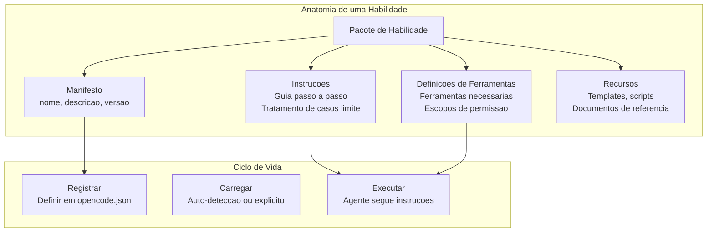
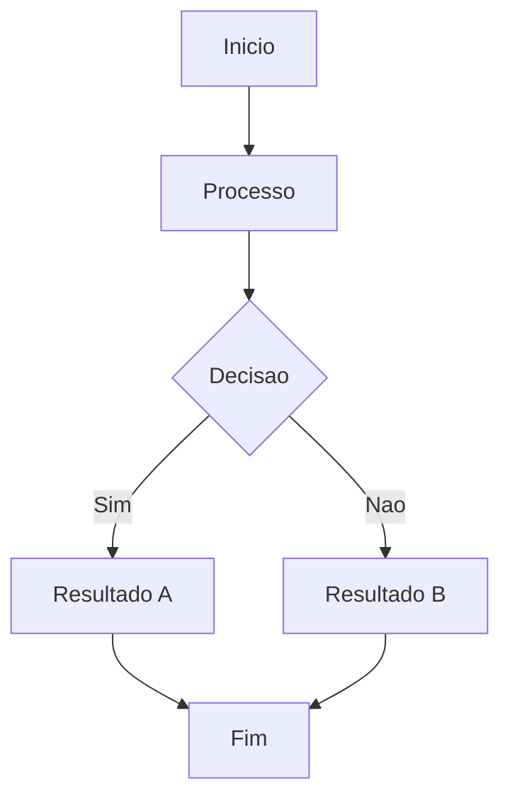

# Habilidades e Capacidades

## O Que Sao Habilidades de Agente?

Habilidades (skills) sao unidades reutilizaveis e composiveis de capacidade que ensinam um agente de IA a executar tarefas especificas. Diferente de prompts monoliticos, habilidades sao modulares, testaveis e podem ser compartilhadas entre diferentes agentes.



> [!NOTE]
> Uma habilidade nao e o mesmo que um plugin. Habilidades sao pacotes de instrucao; plugins (servidores MCP) sao processos externos que fornecem ferramentas.

---

## Definicao do Manifesto

```yaml
# skills/code-reviewer/skill.yaml
name: code-reviewer
version: "1.2.0"
description: |
  Realiza revisoes de codigo focando em seguranca,
  desempenho, manutencao e melhores praticas.

author: "NUniversity"
license: "MIT"

instructions:
  - path: instructions/processo-revisao.md
  - path: instructions/checklist-seguranca.md

tools:
  required:
    - read
    - grep
    - glob
  optional:
    - bash
    - websearch

resources:
  - path: resources/owasp-top10.yaml
    description: Referencia OWASP Top 10

autoload:
  enabled: true
  matchPattern: "revisar|auditar|inspecionar|verificar codigo"

constraints:
  maxTokens: 4096
  temperature: 0.3
  allowedTools:
    - read
    - grep
    - glob
```

> [!TIP]
> Use `matchPattern` para carregamento automatico. Quando o usuario diz "revisar modulo auth", a habilidade ativa automaticamente.

---

## Instrucoes de Habilidade

```python
class HabilidadeRevisaoCodigo:
    def __init__(self, agente):
        self.agente = agente
        self.descobertas = []

    async def executar(self, caminho_alvo):
        codigo = await self.agente.ler(caminho_alvo)
        problemas_seguranca = self._verificar_seguranca(codigo)
        problemas_perf = self._verificar_desempenho(codigo)
        problemas_qualidade = self._verificar_qualidade(codigo)

        relatorio = self._gerar_relatorio(
            caminho_alvo,
            problemas_seguranca + problemas_perf + problemas_qualidade
        )
        return relatorio

    def _verificar_seguranca(self, codigo):
        problemas = []
        if "execute(" in codigo or "eval(" in codigo:
            problemas.append({
                "severidade": "critico",
                "tipo": "injecao_codigo",
                "descricao": "Uso de funcoes perigosas"
            })
        if "SELECT" in codigo and "WHERE" not in codigo:
            problemas.append({
                "severidade": "critico",
                "tipo": "sql_injection",
                "descricao": "Query SQL sem parametrizacao"
            })
        return problemas

    def _verificar_desempenho(self, codigo):
        problemas = []
        linhas = codigo.split("\n")
        for i, linha in enumerate(linhas, 1):
            if "for" in linha and i < len(linhas) and "for" in linhas[i]:
                problemas.append({
                    "severidade": "grave",
                    "tipo": "loop_aninhado",
                    "linha": i
                })
        return problemas

    def _verificar_qualidade(self, codigo):
        problemas = []
        if len(codigo.split("\n")) > 500:
            problemas.append({
                "severidade": "leve",
                "tipo": "arquivo_longo",
                "descricao": "Arquivo excede 500 linhas"
            })
        return problemas

    def _gerar_relatorio(self, caminho, todos_problemas):
        return {
            "arquivo": caminho,
            "total_problemas": len(todos_problemas),
            "por_severidade": {
                "critico": len([p for p in todos_problemas if p["severidade"] == "critico"]),
                "grave": len([p for p in todos_problemas if p["severidade"] == "grave"]),
                "leve": len([p for p in todos_problemas if p["severidade"] == "leve"])
            },
            "problemas": todos_problemas
        }
```

---

## Padroes de Uso de Ferramentas

### 1. Invocacao Direta

```json
{
  "chamada_ferramenta": {
    "nome": "read",
    "argumentos": {"filePath": "src/config.py"}
  }
}
```

### 2. Chamadas Encadeadas

```python
async def analise_encadeada(agente, diretorio):
    arquivos = await agente.glob(f"{diretorio}/**/*.py")
    resultados = []
    for arquivo in arquivos[:5]:
        conteudo = await agente.ler(arquivo)
        correspondencias = await agente.grep("TODO|FIXME", path=arquivo)
        resultados.append({
            "arquivo": arquivo,
            "linhas": len(conteudo.split("\n")),
            "todos": len(correspondencias)
        })
    return resultados
```

### 3. Execucao Paralela

```python
import asyncio

async def analise_paralela(agente, caminho):
    tarefas = [
        agente.grep("security|vulnerability", path=caminho),
        agente.grep("TODO|FIXME", path=caminho),
        agente.bash(f"wc -l {caminho}"),
        agente.bash(f"ruff check {caminho}")
    ]
    resultados = await asyncio.gather(*tarefas)
    return {
        "mencoes_seguranca": resultados[0],
        "todos": resultados[1],
        "linhas": resultados[2].strip(),
        "erros_lint": resultados[3]
    }
```

---

## Registro de Capacidades

```python
class RegistroCapacidades:
    def __init__(self):
        self.capacidades = {}

    def registrar(self, agente_id, capacidade):
        if agente_id not in self.capacidades:
            self.capacidades[agente_id] = []
        self.capacidades[agente_id].append(capacidade)

    def encontrar_agentes_com_capacidade(self, capacidade_necessaria):
        correspondentes = []
        for agente_id, caps in self.capacidades.items():
            for cap in caps:
                if cap.corresponde(capacidade_necessaria):
                    correspondentes.append((agente_id, cap))
        return correspondentes


class Capacidade:
    def __init__(self, nome, descricao, schema_entrada, schema_saida):
        self.nome = nome
        self.descricao = descricao
        self.schema_entrada = schema_entrada
        self.schema_saida = schema_saida

    def corresponde(self, consulta):
        palavras = consulta.lower().split()
        desc = self.descricao.lower().split()
        nome = self.nome.lower().split()
        todas = set(desc + nome)
        return any(p in todas for p in palavras)

    def to_dict(self):
        return {
            "nome": self.nome,
            "descricao": self.descricao,
            "schema_entrada": self.schema_entrada,
            "schema_saida": self.schema_saida
        }


registro = RegistroCapacidades()
registro.registrar("agente-codigo", Capacidade(
    nome="revisao_codigo",
    descricao="Revisar codigo fonte para bugs e vulnerabilidades",
    schema_entrada={"caminho": "string"},
    schema_saida={"problemas": "array", "pontuacao": "number"}
))
registro.registrar("agente-devops", Capacidade(
    nome="deploy",
    descricao="Fazer deploy de aplicacoes em ambientes",
    schema_entrada={"ambiente": "string", "versao": "string"},
    schema_saida={"status": "string", "url": "string"}
))

correspondencias = registro.encontrar_agentes_com_capacidade("revisar codigo")
print(f"Agentes que podem revisar: {[c[0] for c in correspondencias]}")
```

---

## Pratica

```question
{
  "id": "aa-03-pt-q1",
  "type": "multiple-choice",
  "question": "Quais sao os quatro componentes principais de um pacote de habilidade?",
  "options": [
    "Nome, versao, autor, licenca",
    "Manifesto, instrucoes, definicoes de ferramentas, recursos",
    "Codigo, testes, documentacao, exemplos",
    "Modelo, prompt, temperatura, max_tokens"
  ],
  "correct": 1,
  "explanation": "Um pacote de habilidade consiste em: manifesto, instrucoes, definicoes de ferramentas e recursos."
}
```

```question
{
  "id": "aa-03-pt-q2",
  "type": "multiple-choice",
  "question": "Como funciona o carregamento automatico de habilidades no OpenCode?",
  "options": [
    "Carrega todas as habilidades na inicializacao",
    "Corresponde requisicoes do usuario contra o matchPattern da habilidade",
    "Requer que o usuario digite o nome da habilidade explicitamente",
    "Carrega baseado na hora do dia"
  ],
  "correct": 1,
  "explanation": "O carregamento automatico usa matchPattern que e comparado com as requisicoes do usuario. Quando ha correspondencia, a habilidade ativa automaticamente."
}
```

```question
{
  "id": "aa-03-pt-q3",
  "type": "multiple-choice",
  "question": "Qual a diferenca entre uma habilidade e um plugin (servidor MCP)?",
  "options": [
    "Habilidades sao mais rapidas",
    "Habilidades sao pacotes de instrucao; plugins sao processos externos que fornecem ferramentas",
    "Plugins sao apenas para JavaScript",
    "Nao ha diferenca"
  ],
  "correct": 1,
  "explanation": "Habilidades sao pacotes de instrucao que guiam o comportamento do agente. Plugins sao processos externos que implementam ferramentas."
}
```

---

[!SUCCESS] **Principais Conclusoes**

- Habilidades sao pacotes modulares com manifesto, instrucoes, ferramentas e recursos
- Auto-load com matchPattern permite ativacao sensivel ao contexto
- Padroes de uso incluem invocacao direta, encadeada, condicional e paralela
- Registros de capacidade permitem descoberta dinâmica de agentes
- Habilidades devem ser testadas independentemente com agentes mock
- Versionamento semantico permite gerenciamento de dependencias

---

## Fluxo de Trabalho Detalhado



> [!TIP]
> Este diagrama ilustra o fluxo de trabalho basico do agente. Adapte-o ao seu caso de uso especifico.

## Exemplos Adicionais de Codigo

```python
# Exemplo adicional de implementacao
class ExemploAdicional:
    """Classe de exemplo para ilustrar conceitos adicionais."""

    def __init__(self, nome):
        self.nome = nome
        self.dados = {}

    def processar(self, entrada):
        """Processa a entrada e armazena o resultado."""
        resultado = self._transformar(entrada)
        self.dados[entrada] = resultado
        return resultado

    def _transformar(self, valor):
        return valor * 2 if isinstance(valor, (int, float)) else valor.upper()

    def obter_estatisticas(self):
        """Retorna estatisticas sobre os dados processados."""
        if not self.dados:
            return {"status": "vazio", "total": 0}
        return {
            "status": "processado",
            "total": len(self.dados),
            "ultimo": list(self.dados.keys())[-1]
        }

exemplo = ExemploAdicional('teste')
print(exemplo.processar(21))  # 42
print(exemplo.obter_estatisticas())
```

```json
{
  "configuracao_exemplo": {
    "versao": "1.0",
    "parametros": {
      "timeout": 30,
      "max_tentativas": 3,
      "modo": "automatico"
    },
    "seguranca": {
      "requer_aprovacao": true,
      "nivel_autonomia": 2
    }
  }
}
```

```yaml
# configuracao-adicional.yaml
ambiente:
  nome: producao
  variaveis:
    LOG_LEVEL: "debug"
    MAX_TOKENS: 128000
agentes:
  - nome: agente-principal
    modelo: gpt-4o
    temperatura: 0.3
  - nome: agente-revisor
    modelo: claude-sonnet-4-20250514
    ferramentas_permitidas:
      - read
      - grep
      - glob
    ferramentas_negadas:
      - write
      - edit
      - bash

monitoramento:
  metrics: true
  tracing: true
  alertas:
    - tipo: erro_critico
      canal: slack
    - tipo: timeout
      canal: email
```

## Notas Importantes

> [!NOTE]
> Este conceito e fundamental para o entendimento do modulo. Certifique-se de compreende-lo antes de prosseguir.

> [!WARNING]
> Preste atencao a este detalhe: configuracoes incorretas podem levar a comportamentos inesperados do agente.

> [!TIP]
> Uma dica pratica: sempre valide suas configuracoes em ambiente de staging antes de promover para producao.

> [!SUCCESS]
> Ao dominar este conceito, voce estara apto a construir agentes mais robustos e confiaveis.

## Tabela Comparativa

| Caracteristica | Abordagem A | Abordagem B | Abordagem C |
|---------------|-------------|-------------|-------------|
| Complexidade | Baixa | Media | Alta |
| Flexibilidade | Limitada | Moderada | Total |
| Manutencao | Facil | Media | Dificil |
| Performance | Otima | Boa | Variavel |
| Seguranca | Basica | Avancada | Maxima |
| Caso de uso | Prototipos | Producao | Sistemas criticos |

> [!NOTE]
> Escolha a abordagem com base nos requisitos especificos do seu projeto. Nao existe solucao unica para todos os casos.


```question
{
  "id": "aa-03-pt-extra-q1",
  "type": "multiple-choice",
  "question": "Pergunta adicional 1 sobre o conteudo desta aula?",
  "options": [
    "Opcao A",
    "Opcao B",
    "Opcao C",
    "Opcao D"
  ],
  "correct": 0,
  "explanation": "Explicacao detalhada para a pergunta 1."
}
```

```question
{
  "id": "aa-03-pt-extra-q2",
  "type": "multiple-choice",
  "question": "Pergunta adicional 2 sobre o conteudo desta aula?",
  "options": [
    "Opcao A",
    "Opcao B",
    "Opcao C",
    "Opcao D"
  ],
  "correct": 0,
  "explanation": "Explicacao detalhada para a pergunta 2."
}
```

```question
{
  "id": "aa-03-pt-extra-q3",
  "type": "multiple-choice",
  "question": "Pergunta adicional 3 sobre o conteudo desta aula?",
  "options": [
    "Opcao A",
    "Opcao B",
    "Opcao C",
    "Opcao D"
  ],
  "correct": 0,
  "explanation": "Explicacao detalhada para a pergunta 3."
}
```

---

[!SUCCESS] **Principais Conclusoes Adicionais**

- Reforce seu entendimento praticando com exemplos reais
- Consulte a documentacao oficial para casos avancados
- Compartilhe seu conhecimento com a comunidade
- Sempre teste suas implementacoes em ambientes controlados
- Mantenha-se atualizado com as melhores praticas da industria
- A pratica consistente e a chave para a maestria
- Agentes de IA bem projetados combinam tecnologia com boas praticas de engenharia
