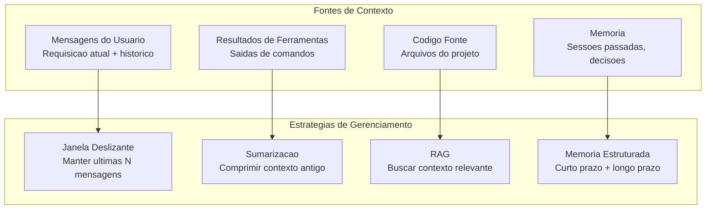
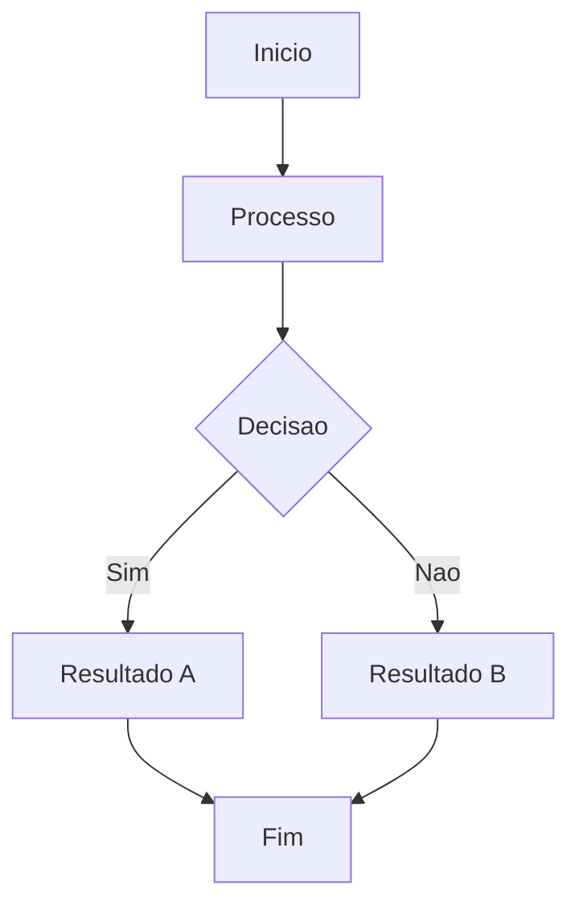

# Gerenciamento de Contexto

## O Desafio do Contexto

Agentes de IA enfrentam uma restricao fundamental: janelas de contexto limitadas. Mesmo os maiores modelos (200K+ tokens) nao podem conter um codigo fonte inteiro, historico de conversacao e instrucoes da tarefa simultaneamente.



> [!NOTE]
> Gerenciamento de contexto nao e apenas sobre caber no orcamento de tokens. E sobre decisoes inteligentes sobre o que manter, comprimir, buscar e esquecer.

---

## Sistemas de Memoria

```python
class MemoriaHierarquica:
    def __init__(self):
        self.memoria_trabalho = {}
        self.curto_prazo = []
        self.longo_prazo = {}
        self.armazenamento_semantico = []

    def adicionar_trabalho(self, chave, valor):
        self.memoria_trabalho[chave] = valor

    def obter_trabalho(self, chave):
        return self.memoria_trabalho.get(chave)

    def adicionar_curto_prazo(self, mensagem, max_tamanho=20):
        self.curto_prazo.append(mensagem)
        if len(self.curto_prazo) > max_tamanho:
            self.curto_prazo = self.curto_prazo[-max_tamanho:]

    def lembrar(self, chave, valor, importancia=1.0):
        self.longo_prazo[chave] = {
            "valor": valor,
            "importancia": importancia,
            "timestamp": __import__('time').time()
        }

    def recordar(self, chave):
        entrada = self.longo_prazo.get(chave)
        return entrada["valor"] if entrada else None

    def recordar_por_relevancia(self, consulta, top_k=3):
        scores = []
        for chave, entrada in self.longo_prazo.items():
            if consulta.lower() in chave.lower():
                scores.append((entrada["importancia"], chave, entrada["valor"]))
        scores.sort(reverse=True)
        return [(k, v) for _, k, v in scores[:top_k]]

    def sumarizar_e_arquivar(self):
        if len(self.curto_prazo) > 10:
            textos = [m["conteudo"] for m in self.curto_prazo[:5]]
            sumario = " | ".join(textos)
            self.longo_prazo["sumario_conversa"] = {
                "valor": sumario[:500],
                "importancia": 0.5,
                "timestamp": __import__('time').time()
            }
            self.curto_prazo = self.curto_prazo[-5:]


memoria = MemoriaHierarquica()
memoria.lembrar("nome_projeto", "Plataforma Nova", importancia=1.0)
memoria.lembrar("stack_tecnologica", ["Python", "FastAPI", "React"], importancia=0.9)
memoria.adicionar_curto_prazo({"papel": "usuario", "conteudo": "Corrigir bug de login"})
memoria.adicionar_curto_prazo({"papel": "assistente", "conteudo": "Encontrei o problema em auth.py"})
relevantes = memoria.recordar_por_relevancia("stack")
print(f"Stack tecnologica: {relevantes}")
```

---

## RAG (Geracao Aumentada por Recuperacao)

```python
class SistemaRAG:
    def __init__(self):
        self.documentos = []
        self.indice = {}

    def adicionar_documento(self, doc_id, conteudo, metadata=None):
        idx = len(self.documentos)
        self.documentos.append({
            "id": doc_id,
            "conteudo": conteudo,
            "metadata": metadata or {}
        })
        for palavra in conteudo.lower().split():
            if palavra not in self.indice:
                self.indice[palavra] = []
            self.indice[palavra].append(idx)

    def buscar(self, consulta, top_k=3):
        palavras_consulta = consulta.lower().split()
        scores = {}
        for q_palavra in palavras_consulta:
            for doc_idx in self.indice.get(q_palavra, []):
                if doc_idx not in scores:
                    scores[doc_idx] = 0
                scores[doc_idx] += 1

        ranked = sorted(scores.items(), key=lambda x: x[1], reverse=True)
        resultados = []
        for doc_idx, score in ranked[:top_k]:
            doc = self.documentos[doc_idx]
            resultados.append({
                "id": doc["id"],
                "conteudo": doc["conteudo"][:500],
                "relevancia": score / len(palavras_consulta),
                "metadata": doc["metadata"]
            })
        return resultados

    def construir_contexto(self, consulta, max_tokens=2000):
        resultados = self.buscar(consulta)
        partes = []
        contagem = 0
        for r in resultados:
            snippet = f"[Fonte: {r['id']}]\n{r['conteudo']}\n"
            tokens = len(snippet.split())
            if contagem + tokens > max_tokens:
                break
            partes.append(snippet)
            contagem += tokens
        return "\n---\n".join(partes)


rag = SistemaRAG()
rag.adicionar_documento(
    "auth-flow.md",
    "O fluxo de autenticacao usa tokens JWT com expiracao de 1 hora. "
    "Tokens de atualizacao sao armazenados em cookies HTTP-only."
)
rag.adicionar_documento(
    "api-endpoints.md",
    "POST /api/auth/login - Autenticar usuario\n"
    "POST /api/auth/refresh - Atualizar token\n"
    "GET /api/auth/profile - Obter perfil"
)
contexto = rag.construir_contexto("Como funciona a autenticacao?")
print(contexto)
```

---

## Estrategias de Sumarizacao

```yaml
sumarizacao:
  estrategia: hierarquica
  limiares:
    curto_prazo: 10
    sessao: 50
    total: 200
  incluir_no_sumario:
    - decisoes_tomadas
    - alteracoes_codigo
    - padroes_erro
    - preferencias_usuario
  campos_preservar:
    - caminhos_arquivos
    - nomes_funcoes
    - versoes
    - endpoints_api
```

---

## Limites de Janela de Contexto

| Modelo | Janela | Orcamento Efetivo |
|--------|--------|-------------------|
| GPT-4o | 128K tokens | ~96K |
| GPT-4o-mini | 128K tokens | ~96K |
| Claude Sonnet 4 | 200K tokens | ~170K |
| Claude Opus 4 | 200K tokens | ~170K |
| Gemini 1.5 Pro | 1M tokens | ~800K |

---

## Pratica

```question
{
  "id": "aa-04-pt-q1",
  "type": "multiple-choice",
  "question": "Qual o proposito principal de uma janela deslizante no gerenciamento de contexto?",
  "options": [
    "Criptografar dados da conversa",
    "Manter apenas as N mensagens mais recentes dentro do orcamento de tokens",
    "Traduzir mensagens para outro idioma",
    "Aumentar a janela de contexto do modelo"
  ],
  "correct": 1,
  "explanation": "Uma janela deslizante mantem as N mensagens mais recentes e descarta as mais antigas, garantindo que o contexto atual esteja sempre disponivel."
}
```

```question
{
  "id": "aa-04-pt-q2",
  "type": "multiple-choice",
  "question": "Em um sistema de memoria hierarquica, que tipo de informacao deve ser armazenada na memoria de longo prazo?",
  "options": [
    "A mensagem atual sendo digitada",
    "Cada saida de ferramenta da sessao atual",
    "Fatos persistentes como nome do projeto, stack e decisoes importantes",
    "A saida bruta de cada comando bash"
  ],
  "correct": 2,
  "explanation": "A memoria de longo prazo armazena fatos persistentes que devem sobreviver entre sessoes: nomes de projeto, escolhas tecnologicas, decisoes arquiteturais."
}
```

```question
{
  "id": "aa-04-pt-q3",
  "type": "multiple-choice",
  "question": "Para que serve RAG (Geracao Aumentada por Recuperacao) no gerenciamento de contexto?",
  "options": [
    "Selecionar contexto aleatoriamente",
    "Buscar apenas os documentos mais relevantes para a consulta atual",
    "Reverter decisoes do agente automaticamente",
    "Executar coleta de lixo na memoria"
  ],
  "correct": 1,
  "explanation": "RAG busca apenas a informacao mais relevante de uma base de conhecimento maior baseada na consulta atual, fazendo uso eficiente da janela de contexto limitada."
}
```

---

[!SUCCESS] **Principais Conclusoes**

- Gerenciamento de contexto requer decisoes sobre o que manter, comprimir, buscar e esquecer
- Memoria hierarquica (trabalho, curto prazo, longo prazo, semantico) fornece arquitetura escalavel
- RAG permite acesso a grandes bases de conhecimento sem encher a janela de contexto
- Sumarizacao comprime informacao preservando detalhes importantes
- Priorizacao de contexto garante que itens critics sempre caibam no orcamento de tokens
- Diferentes modelos tem limites diferentes; projete para o orcamento efetivo

---

## Fluxo de Trabalho Detalhado



> [!TIP]
> Este diagrama ilustra o fluxo de trabalho basico do agente. Adapte-o ao seu caso de uso especifico.

## Exemplos Adicionais de Codigo

```python
# Exemplo adicional de implementacao
class ExemploAdicional:
    """Classe de exemplo para ilustrar conceitos adicionais."""

    def __init__(self, nome):
        self.nome = nome
        self.dados = {}

    def processar(self, entrada):
        """Processa a entrada e armazena o resultado."""
        resultado = self._transformar(entrada)
        self.dados[entrada] = resultado
        return resultado

    def _transformar(self, valor):
        return valor * 2 if isinstance(valor, (int, float)) else valor.upper()

    def obter_estatisticas(self):
        """Retorna estatisticas sobre os dados processados."""
        if not self.dados:
            return {"status": "vazio", "total": 0}
        return {
            "status": "processado",
            "total": len(self.dados),
            "ultimo": list(self.dados.keys())[-1]
        }

exemplo = ExemploAdicional('teste')
print(exemplo.processar(21))  # 42
print(exemplo.obter_estatisticas())
```

```json
{
  "configuracao_exemplo": {
    "versao": "1.0",
    "parametros": {
      "timeout": 30,
      "max_tentativas": 3,
      "modo": "automatico"
    },
    "seguranca": {
      "requer_aprovacao": true,
      "nivel_autonomia": 2
    }
  }
}
```

```yaml
# configuracao-adicional.yaml
ambiente:
  nome: producao
  variaveis:
    LOG_LEVEL: "debug"
    MAX_TOKENS: 128000
agentes:
  - nome: agente-principal
    modelo: gpt-4o
    temperatura: 0.3
  - nome: agente-revisor
    modelo: claude-sonnet-4-20250514
    ferramentas_permitidas:
      - read
      - grep
      - glob
    ferramentas_negadas:
      - write
      - edit
      - bash

monitoramento:
  metrics: true
  tracing: true
  alertas:
    - tipo: erro_critico
      canal: slack
    - tipo: timeout
      canal: email
```

## Notas Importantes

> [!NOTE]
> Este conceito e fundamental para o entendimento do modulo. Certifique-se de compreende-lo antes de prosseguir.

> [!WARNING]
> Preste atencao a este detalhe: configuracoes incorretas podem levar a comportamentos inesperados do agente.

> [!TIP]
> Uma dica pratica: sempre valide suas configuracoes em ambiente de staging antes de promover para producao.

> [!SUCCESS]
> Ao dominar este conceito, voce estara apto a construir agentes mais robustos e confiaveis.

## Tabela Comparativa

| Caracteristica | Abordagem A | Abordagem B | Abordagem C |
|---------------|-------------|-------------|-------------|
| Complexidade | Baixa | Media | Alta |
| Flexibilidade | Limitada | Moderada | Total |
| Manutencao | Facil | Media | Dificil |
| Performance | Otima | Boa | Variavel |
| Seguranca | Basica | Avancada | Maxima |
| Caso de uso | Prototipos | Producao | Sistemas criticos |

> [!NOTE]
> Escolha a abordagem com base nos requisitos especificos do seu projeto. Nao existe solucao unica para todos os casos.


```question
{
  "id": "aa-04-pt-extra-q1",
  "type": "multiple-choice",
  "question": "Pergunta adicional 1 sobre o conteudo desta aula?",
  "options": [
    "Opcao A",
    "Opcao B",
    "Opcao C",
    "Opcao D"
  ],
  "correct": 0,
  "explanation": "Explicacao detalhada para a pergunta 1."
}
```

```question
{
  "id": "aa-04-pt-extra-q2",
  "type": "multiple-choice",
  "question": "Pergunta adicional 2 sobre o conteudo desta aula?",
  "options": [
    "Opcao A",
    "Opcao B",
    "Opcao C",
    "Opcao D"
  ],
  "correct": 0,
  "explanation": "Explicacao detalhada para a pergunta 2."
}
```

```question
{
  "id": "aa-04-pt-extra-q3",
  "type": "multiple-choice",
  "question": "Pergunta adicional 3 sobre o conteudo desta aula?",
  "options": [
    "Opcao A",
    "Opcao B",
    "Opcao C",
    "Opcao D"
  ],
  "correct": 0,
  "explanation": "Explicacao detalhada para a pergunta 3."
}
```

---

[!SUCCESS] **Principais Conclusoes Adicionais**

- Reforce seu entendimento praticando com exemplos reais
- Consulte a documentacao oficial para casos avancados
- Compartilhe seu conhecimento com a comunidade
- Sempre teste suas implementacoes em ambientes controlados
- Mantenha-se atualizado com as melhores praticas da industria
- A pratica consistente e a chave para a maestria
- Agentes de IA bem projetados combinam tecnologia com boas praticas de engenharia
