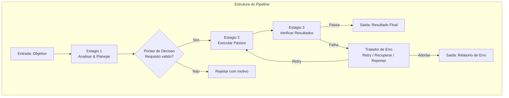
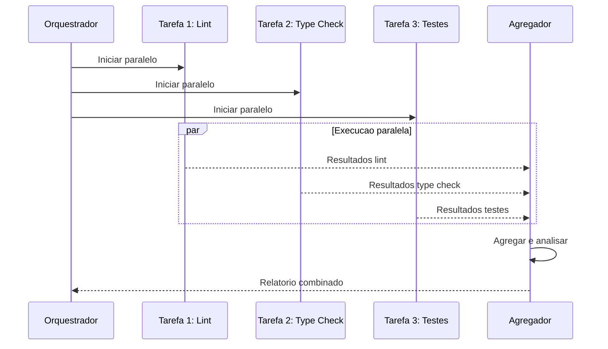
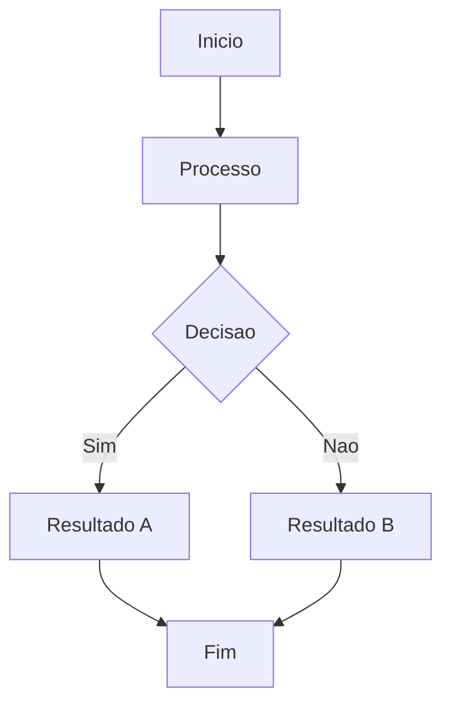

# Pipelines de Agentes

## O Que Sao Pipelines de Agentes?

Pipelines de agentes sao fluxos de trabalho estruturados que encadeiam multiplas operacoes — chamadas de ferramentas, execucoes de habilidades, delegacoes a subagentes — em sequencias coordenadas.



> [!NOTE]
> Um pipeline e mais que uma sequencia de passos. Inclui portoes de decisao, tratadores de erro, ramos paralelos, agregadores e gerenciamento de estado.

---

## Execucao Sequencial

```python
from enum import Enum
from dataclasses import dataclass
from typing import Any, Callable

class StatusEstagio(Enum):
    PENDENTE = "pendente"
    EXECUTANDO = "executando"
    SUCESSO = "sucesso"
    FALHA = "falha"
    PULADO = "pulado"

@dataclass
class Estagio:
    nome: str
    acao: Callable
    max_tentativas: int = 3
    depende_de: list[str] = None

    def __post_init__(self):
        self.depende_de = self.depende_de or []


class Pipeline:
    def __init__(self, nome):
        self.nome = nome
        self.estagios = {}
        self.resultados = {}
        self.status = {}
        self.contexto = {}

    def adicionar_estagio(self, estagio):
        self.estagios[estagio.nome] = estagio
        self.status[estagio.nome] = StatusEstagio.PENDENTE

    async def executar(self, entrada_inicial=None):
        if entrada_inicial:
            self.contexto.update(entrada_inicial)

        ordenados = self._ordenacao_topologica()

        for nome_estagio in ordenados:
            estagio = self.estagios[nome_estagio]
            dependencias_ok = all(
                self.status.get(dep) == StatusEstagio.SUCESSO
                for dep in estagio.depende_de
            )
            if not dependencias_ok:
                self.status[nome_estagio] = StatusEstagio.PULADO
                continue

            self.status[nome_estagio] = StatusEstagio.EXECUTANDO
            for tentativa in range(estagio.max_tentativas):
                try:
                    args = {dep: self.resultados.get(dep) for dep in estagio.depende_de}
                    args["contexto"] = self.contexto
                    resultado = await estagio.acao(**args)
                    self.resultados[nome_estagio] = resultado
                    self.status[nome_estagio] = StatusEstagio.SUCESSO
                    break
                except Exception as e:
                    if tentativa == estagio.max_tentativas - 1:
                        self.resultados[nome_estagio] = {"erro": str(e)}
                        self.status[nome_estagio] = StatusEstagio.FALHA

        return self._sumarizar()

    def _ordenacao_topologica(self):
        visitados = set()
        ordenados = []

        def dfs(no):
            if no in visitados:
                return
            visitados.add(no)
            estagio = self.estagios.get(no)
            if estagio:
                for dep in estagio.depende_de:
                    if dep in self.estagios:
                        dfs(dep)
                ordenados.append(no)

        for nome in self.estagios:
            dfs(nome)
        return ordenados

    def _sumarizar(self):
        return {
            "pipeline": self.nome,
            "estagios": {
                nome: {
                    "status": self.status[nome].value,
                    "resultado": self.resultados.get(nome)
                }
                for nome in self.estagios
            }
        }
```

---

## Execucao Paralela



```python
import asyncio

class PipelineParalelo:
    def __init__(self):
        self.grupos = []
        self.resultados = {}

    def adicionar_grupo(self, nome, tarefas):
        self.grupos.append({"nome": nome, "tarefas": tarefas})

    async def executar_todos(self):
        for grupo in self.grupos:
            tarefas = [
                self._executar_tarefa(nome, fn)
                for nome, fn in grupo["tarefas"]
            ]
            resultados = await asyncio.gather(*tarefas, return_exceptions=True)
            for (nome, _), resultado in zip(grupo["tarefas"], resultados):
                self.resultados[nome] = resultado
        return self.resultados

    async def _executar_tarefa(self, nome, fn):
        return await fn()
```

---

## Estrategias de Tratamento de Erros

```python
class TratadorErros:
    def __init__(self, pipeline):
        self.pipeline = pipeline
        self.estrategias = {
            "retry": self._retry,
            "pular": self._pular,
            "fallback": self._fallback,
            "abortar": self._abortar,
        }

    async def tratar(self, nome_estagio, erro, estrategia="retry"):
        handler = self.estrategias.get(estrategia, self._retry)
        return await handler(nome_estagio, erro)

    async def _retry(self, nome_estagio, erro, max_tentativas=3):
        estagio = self.pipeline.estagios[nome_estagio]
        for tentativa in range(max_tentativas):
            try:
                resultado = await self.pipeline._executar_estagio(estagio, tentativa)
                return {"status": "recuperado", "resultado": resultado}
            except Exception:
                if tentativa == max_tentativas - 1:
                    return {"status": "falha", "erro": str(erro)}
        return {"status": "falha", "erro": str(erro)}

    async def _pular(self, nome_estagio, erro):
        self.pipeline.status[nome_estagio] = StatusEstagio.PULADO
        return {"status": "pulado", "motivo": str(erro)}

    async def _fallback(self, nome_estagio, erro, fn_fallback=None):
        if fn_fallback:
            try:
                resultado = await fn_fallback()
                return {"status": "recuperado", "resultado": resultado, "metodo": "fallback"}
            except Exception as e:
                return {"status": "falha", "erro": str(e)}
        return {"status": "falha", "erro": "Sem fallback disponivel"}

    async def _abortar(self, nome_estagio, erro):
        for nome in self.pipeline.estagios:
            if self.pipeline.status[nome] == StatusEstagio.PENDENTE:
                self.pipeline.status[nome] = StatusEstagio.PULADO
        return {"status": "abortado", "em": nome_estagio, "motivo": str(erro)}
```

---

## Pratica

```question
{
  "id": "aa-05-pt-q1",
  "type": "multiple-choice",
  "question": "Qual o principal beneficio da execucao paralela em um pipeline de agente?",
  "options": [
    "Reduz o numero de estagios necessarios",
    "Reduz o tempo total de execucao executando tarefas independentes simultaneamente",
    "Elimina a necessidade de tratamento de erros",
    "Aumenta a qualidade dos resultados"
  ],
  "correct": 1,
  "explanation": "Execucao paralela reduz o tempo total executando tarefas independentes simultaneamente, em vez de sequencialmente."
}
```

```question
{
  "id": "aa-05-pt-q2",
  "type": "multiple-choice",
  "question": "Qual estrategia de tratamento de erros deve ser usada para um deploy em producao que falha?",
  "options": [
    "retry - tentar repetidamente",
    "pular - continuar para o proximo",
    "abortar - parar o pipeline imediatamente",
    "ignorar - fingir que nao aconteceu"
  ],
  "correct": 2,
  "explanation": "Um deploy em producao que falha deve abortar o pipeline para evitar estado inconsistente."
}
```

```question
{
  "id": "aa-05-pt-q3",
  "type": "multiple-choice",
  "question": "O que determina a ordem de execucao dos estagios em um pipeline?",
  "options": [
    "A ordem em que foram adicionados",
    "Ordem alfabetica",
    "Ordenacao topologica baseada em declaracoes de dependencia",
    "Ordem aleatoria"
  ],
  "correct": 2,
  "explanation": "A ordenacao topologica organiza estagios para que dependencias sejam executadas antes de seus dependentes."
}
```

---

[!SUCCESS] **Principais Conclusoes**

- Pipelines transformam agentes de passo unico em motores de automacao multi-etapas
- Execucao paralela reduz tempo para tarefas independentes
- Estrategias de erro incluem retry, pular, fallback, abortar e compensar
- Observabilidade atraves de logs e critical para debug
- Padroes de composicao incluem linear, fan-out, fan-in, condicional e loop
- Portoes de aprovacao humana protegem operacoes de alto risco

---

## Fluxo de Trabalho Detalhado



> [!TIP]
> Este diagrama ilustra o fluxo de trabalho basico do agente. Adapte-o ao seu caso de uso especifico.

## Exemplos Adicionais de Codigo

```python
# Exemplo adicional de implementacao
class ExemploAdicional:
    """Classe de exemplo para ilustrar conceitos adicionais."""

    def __init__(self, nome):
        self.nome = nome
        self.dados = {}

    def processar(self, entrada):
        """Processa a entrada e armazena o resultado."""
        resultado = self._transformar(entrada)
        self.dados[entrada] = resultado
        return resultado

    def _transformar(self, valor):
        return valor * 2 if isinstance(valor, (int, float)) else valor.upper()

    def obter_estatisticas(self):
        """Retorna estatisticas sobre os dados processados."""
        if not self.dados:
            return {"status": "vazio", "total": 0}
        return {
            "status": "processado",
            "total": len(self.dados),
            "ultimo": list(self.dados.keys())[-1]
        }

exemplo = ExemploAdicional('teste')
print(exemplo.processar(21))  # 42
print(exemplo.obter_estatisticas())
```

```json
{
  "configuracao_exemplo": {
    "versao": "1.0",
    "parametros": {
      "timeout": 30,
      "max_tentativas": 3,
      "modo": "automatico"
    },
    "seguranca": {
      "requer_aprovacao": true,
      "nivel_autonomia": 2
    }
  }
}
```

```yaml
# configuracao-adicional.yaml
ambiente:
  nome: producao
  variaveis:
    LOG_LEVEL: "debug"
    MAX_TOKENS: 128000
agentes:
  - nome: agente-principal
    modelo: gpt-4o
    temperatura: 0.3
  - nome: agente-revisor
    modelo: claude-sonnet-4-20250514
    ferramentas_permitidas:
      - read
      - grep
      - glob
    ferramentas_negadas:
      - write
      - edit
      - bash

monitoramento:
  metrics: true
  tracing: true
  alertas:
    - tipo: erro_critico
      canal: slack
    - tipo: timeout
      canal: email
```

## Notas Importantes

> [!NOTE]
> Este conceito e fundamental para o entendimento do modulo. Certifique-se de compreende-lo antes de prosseguir.

> [!WARNING]
> Preste atencao a este detalhe: configuracoes incorretas podem levar a comportamentos inesperados do agente.

> [!TIP]
> Uma dica pratica: sempre valide suas configuracoes em ambiente de staging antes de promover para producao.

> [!SUCCESS]
> Ao dominar este conceito, voce estara apto a construir agentes mais robustos e confiaveis.

## Tabela Comparativa

| Caracteristica | Abordagem A | Abordagem B | Abordagem C |
|---------------|-------------|-------------|-------------|
| Complexidade | Baixa | Media | Alta |
| Flexibilidade | Limitada | Moderada | Total |
| Manutencao | Facil | Media | Dificil |
| Performance | Otima | Boa | Variavel |
| Seguranca | Basica | Avancada | Maxima |
| Caso de uso | Prototipos | Producao | Sistemas criticos |

> [!NOTE]
> Escolha a abordagem com base nos requisitos especificos do seu projeto. Nao existe solucao unica para todos os casos.


```question
{
  "id": "aa-05-pt-extra-q1",
  "type": "multiple-choice",
  "question": "Pergunta adicional 1 sobre o conteudo desta aula?",
  "options": [
    "Opcao A",
    "Opcao B",
    "Opcao C",
    "Opcao D"
  ],
  "correct": 0,
  "explanation": "Explicacao detalhada para a pergunta 1."
}
```

```question
{
  "id": "aa-05-pt-extra-q2",
  "type": "multiple-choice",
  "question": "Pergunta adicional 2 sobre o conteudo desta aula?",
  "options": [
    "Opcao A",
    "Opcao B",
    "Opcao C",
    "Opcao D"
  ],
  "correct": 0,
  "explanation": "Explicacao detalhada para a pergunta 2."
}
```

```question
{
  "id": "aa-05-pt-extra-q3",
  "type": "multiple-choice",
  "question": "Pergunta adicional 3 sobre o conteudo desta aula?",
  "options": [
    "Opcao A",
    "Opcao B",
    "Opcao C",
    "Opcao D"
  ],
  "correct": 0,
  "explanation": "Explicacao detalhada para a pergunta 3."
}
```

---

[!SUCCESS] **Principais Conclusoes Adicionais**

- Reforce seu entendimento praticando com exemplos reais
- Consulte a documentacao oficial para casos avancados
- Compartilhe seu conhecimento com a comunidade
- Sempre teste suas implementacoes em ambientes controlados
- Mantenha-se atualizado com as melhores praticas da industria
- A pratica consistente e a chave para a maestria
- Agentes de IA bem projetados combinam tecnologia com boas praticas de engenharia
