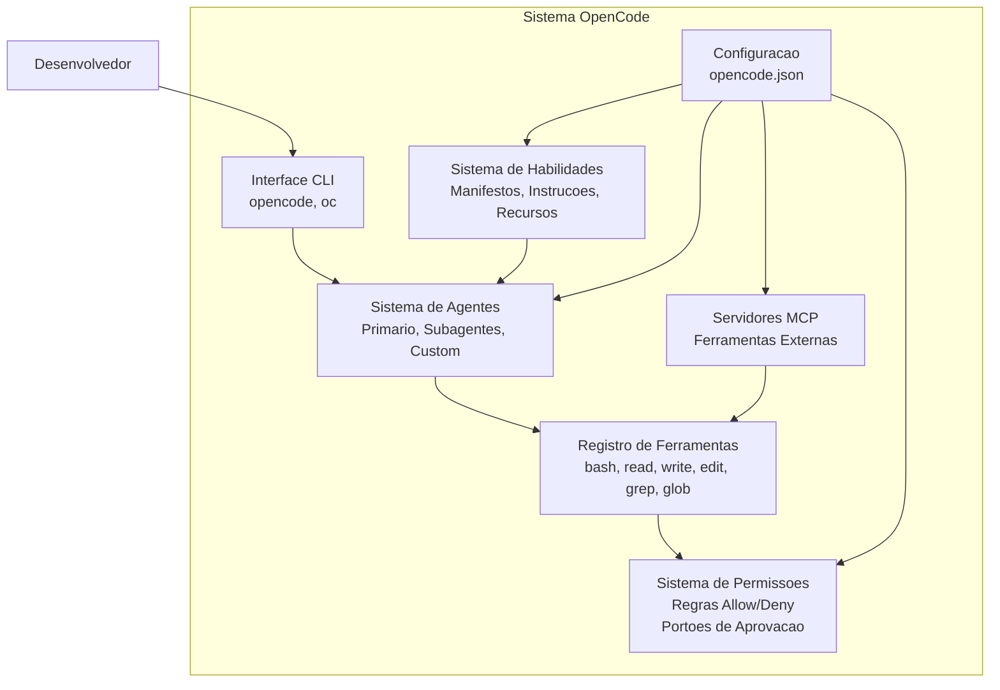
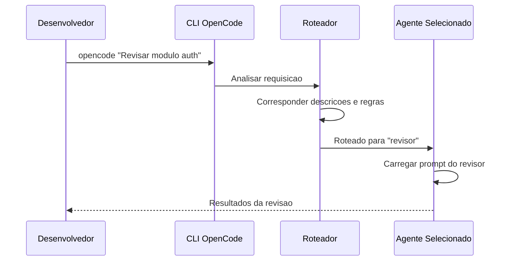
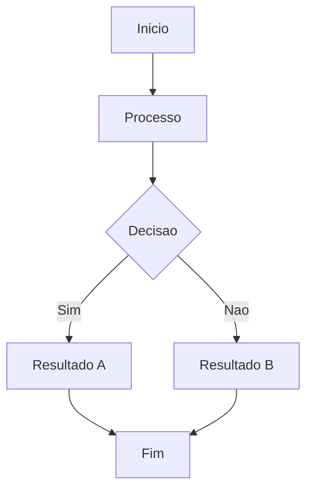

# OpenCode como Ferramenta de Desenvolvimento

## O que e OpenCode?

OpenCode e um framework CLI de codigo aberto para engenharia de software assistida por IA. Ele fornece um ambiente estruturado onde agentes de IA interagem com seu codigo atraves de um sistema de ferramentas controlado por permissoes, habilidades reutilizaveis e o Model Context Protocol (MCP).



> [!NOTE]
> OpenCode pode ser instalado globalmente via npm ou pip e configurado por projeto usando `opencode.json` na raiz ou `.opencode/config.json`.

---

## Instalacao e Configuracao

```bash
npm install -g opencode-cli
pip install opencode-cli
opencode --version
opencode init
opencode
```

```json
{
  "opencode": "1.0",
  "agents": {
    "default": {
      "model": "gpt-4o",
      "description": "Assistente de codificacao geral",
      "prompt": "Voce e um engenheiro de software especialista."
    },
    "revisor": {
      "model": "claude-sonnet-4-20250514",
      "description": "Especialista em revisao de codigo",
      "constraints": {
        "allowedTools": ["read", "grep", "glob"],
        "deniedTools": ["write", "edit", "bash"]
      }
    }
  },
  "permissions": [
    {
      "tool": "bash",
      "allow": ["npm *", "git *", "pip *", "python *", "pytest *"],
      "deny": ["rm -rf /", "sudo *", "chmod *"]
    },
    {
      "tool": "write",
      "allow": ["src/**", "tests/**", "docs/**"],
      "deny": [".env", "secrets/**"]
    }
  ],
  "skills": {
    "revisor-codigo": {
      "manifest": "skills/revisor-codigo/skill.yaml",
      "autoLoad": true,
      "matchPattern": "revisar|auditar|inspecionar"
    }
  },
  "mcpServers": {
    "github": {
      "command": "node",
      "args": ["mcp-github-server.js"],
      "env": { "GITHUB_TOKEN": "${GITHUB_TOKEN}" }
    }
  },
  "agentRouting": {
    "mode": "auto",
    "defaultAgent": "default",
    "rules": [
      { "pattern": "seguranca|vulnerabilidade|CVE", "agent": "revisor" }
    ]
  }
}
```

---

## Roteamento de Agentes



> [!TIP]
> Use `--agent <nome>` para forçar um agente especifico ou `--skill <nome>` para carregar uma habilidade especifica.

---

## Padroes de Uso do CLI

```bash
# Modo interativo
opencode

# Comando unico
opencode "Refatorar modulo de pagamento para usar async/await"

# Entrada por pipe
cat requirements.txt | opencode "Gerar setup.py a partir disto"

# Arquivo como contexto
opencode --file src/main.py "Revisar este arquivo"

# Multiplos arquivos
opencode --files src/*.py "Encontrar imports nao utilizados"

# Selecao de agente
opencode --agent arquiteto "Projetar schema de banco"

# Execucao de habilidade
opencode --skill revisor-codigo "Revisar ultimo git diff"

# Modo debug
opencode --debug "Por que o build esta falhando?"

# Formatos de saida
opencode --format json "Listar todos os TODOs" > todos.json
opencode --format markdown "Gerar documentacao API" > api-docs.md
```

> [!TIP]
> Use `--format json` para saida estruturada que pode ser processada por outras ferramentas. Use `--format markdown` para documentacao legivel.

---

## Integracao com Servidores MCP

Servidores MCP estendem as capacidades do OpenCode conectando-se a sistemas externos.

```javascript
// mcp-github-server.js
import { Server } from "@modelcontextprotocol/sdk/server/index.js";
import { StdioServerTransport } from "@modelcontextprotocol/sdk/server/stdio.js";

const server = new Server({
  name: "github-mcp-server",
  version: "1.0.0",
}, { capabilities: { tools: {} } });

server.setRequestHandler("tools/list", async () => ({
  tools: [
    {
      name: "create_issue",
      description: "Criar uma issue no GitHub",
      inputSchema: {
        type: "object",
        properties: {
          title: { type: "string", description: "Titulo da issue" },
          body: { type: "string", description: "Corpo da issue" }
        },
        required: ["title"]
      }
    }
  ]
}));

const transport = new StdioServerTransport();
await server.connect(transport);
```

```json
{
  "mcpServers": {
    "github": {
      "command": "node",
      "args": ["mcp-github-server.js"],
      "env": { "GITHUB_TOKEN": "${GITHUB_TOKEN}" }
    },
    "postgres": {
      "command": "python",
      "args": ["mcp-postgres-server.py"],
      "env": { "DATABASE_URL": "${DATABASE_URL}" }
    }
  }
}
```

---

## Melhores Praticas

```yaml
melhores_praticas:
  configuracao:
    - Use diretorio .opencode/ para raiz do projeto mais limpa
    - Versionamento de config com variaveis de ambiente para secrets
    - Defina agentes especificos para tarefas especificas
    - Use matchPattern em habilidades para ativacao automatica
    - Comece com permissoes restritivas e expanda gradualmente

  design_agentes:
    - De descricoes claras e especificas para roteamento preciso
    - Use temperatura 0.2-0.4 para tarefas deterministicas
    - Use temperatura 0.7-0.9 para tarefas criativas
    - Defina restricoes adequadamente
    - Use subagentes para subtarefas especializadas

  seguranca:
    - Nunca armazene secrets no opencode.json
    - Use portoes de aprovacao para operacoes destrutivas
    - Negue acesso de escrita a arquivos de configuracao
    - Audite regras de permissao regularmente
```

---

## Pratica

```question
{
  "id": "aa-06-pt-q1",
  "type": "multiple-choice",
  "question": "Quais sao os dois locais equivalentes para configuracao do OpenCode?",
  "options": [
    "opencode.yaml e opencode.toml",
    "opencode.json (raiz) e .opencode/config.json",
    "config/opencode.json e .config/opencode.json",
    "package.json e .env"
  ],
  "correct": 1,
  "explanation": "A configuracao pode estar em opencode.json na raiz ou .opencode/config.json."
}
```

```question
{
  "id": "aa-06-pt-q2",
  "type": "multiple-choice",
  "question": "Qual flag CLI forca um agente especifico a lidar com uma requisicao?",
  "options": [
    "--force-agent",
    "--agent <nome>",
    "--use <nome>",
    "--target <nome>"
  ],
  "correct": 1,
  "explanation": "A flag --agent <nome> bypassa o sistema de roteamento e forca o uso do agente especificado."
}
```

---

[!SUCCESS] **Principais Conclusoes**

- OpenCode e configurado via opencode.json ou .opencode/config.json
- Roteamento de agentes usa correspondencia de descricao e padroes
- Habilidades carregam automaticamente quando requisicoes correspondem ao matchPattern
- Permissoes permitem/negam operacoes especificas com padroes de caminho
- Portoes de aprovacao adicionam humano-no-loop para operacoes de risco
- Servidores MCP estendem capacidades via protocolo JSON-RPC

---

## Fluxo de Trabalho Detalhado



> [!TIP]
> Este diagrama ilustra o fluxo de trabalho basico do agente. Adapte-o ao seu caso de uso especifico.

## Exemplos Adicionais de Codigo

```python
# Exemplo adicional de implementacao
class ExemploAdicional:
    """Classe de exemplo para ilustrar conceitos adicionais."""

    def __init__(self, nome):
        self.nome = nome
        self.dados = {}

    def processar(self, entrada):
        """Processa a entrada e armazena o resultado."""
        resultado = self._transformar(entrada)
        self.dados[entrada] = resultado
        return resultado

    def _transformar(self, valor):
        return valor * 2 if isinstance(valor, (int, float)) else valor.upper()

    def obter_estatisticas(self):
        """Retorna estatisticas sobre os dados processados."""
        if not self.dados:
            return {"status": "vazio", "total": 0}
        return {
            "status": "processado",
            "total": len(self.dados),
            "ultimo": list(self.dados.keys())[-1]
        }

exemplo = ExemploAdicional('teste')
print(exemplo.processar(21))  # 42
print(exemplo.obter_estatisticas())
```

```json
{
  "configuracao_exemplo": {
    "versao": "1.0",
    "parametros": {
      "timeout": 30,
      "max_tentativas": 3,
      "modo": "automatico"
    },
    "seguranca": {
      "requer_aprovacao": true,
      "nivel_autonomia": 2
    }
  }
}
```

```yaml
# configuracao-adicional.yaml
ambiente:
  nome: producao
  variaveis:
    LOG_LEVEL: "debug"
    MAX_TOKENS: 128000
agentes:
  - nome: agente-principal
    modelo: gpt-4o
    temperatura: 0.3
  - nome: agente-revisor
    modelo: claude-sonnet-4-20250514
    ferramentas_permitidas:
      - read
      - grep
      - glob
    ferramentas_negadas:
      - write
      - edit
      - bash

monitoramento:
  metrics: true
  tracing: true
  alertas:
    - tipo: erro_critico
      canal: slack
    - tipo: timeout
      canal: email
```

## Notas Importantes

> [!NOTE]
> Este conceito e fundamental para o entendimento do modulo. Certifique-se de compreende-lo antes de prosseguir.

> [!WARNING]
> Preste atencao a este detalhe: configuracoes incorretas podem levar a comportamentos inesperados do agente.

> [!TIP]
> Uma dica pratica: sempre valide suas configuracoes em ambiente de staging antes de promover para producao.

> [!SUCCESS]
> Ao dominar este conceito, voce estara apto a construir agentes mais robustos e confiaveis.

## Tabela Comparativa

| Caracteristica | Abordagem A | Abordagem B | Abordagem C |
|---------------|-------------|-------------|-------------|
| Complexidade | Baixa | Media | Alta |
| Flexibilidade | Limitada | Moderada | Total |
| Manutencao | Facil | Media | Dificil |
| Performance | Otima | Boa | Variavel |
| Seguranca | Basica | Avancada | Maxima |
| Caso de uso | Prototipos | Producao | Sistemas criticos |

> [!NOTE]
> Escolha a abordagem com base nos requisitos especificos do seu projeto. Nao existe solucao unica para todos os casos.


```question
{
  "id": "aa-06-pt-extra-q1",
  "type": "multiple-choice",
  "question": "Pergunta adicional 1 sobre o conteudo desta aula?",
  "options": [
    "Opcao A",
    "Opcao B",
    "Opcao C",
    "Opcao D"
  ],
  "correct": 0,
  "explanation": "Explicacao detalhada para a pergunta 1."
}
```

```question
{
  "id": "aa-06-pt-extra-q2",
  "type": "multiple-choice",
  "question": "Pergunta adicional 2 sobre o conteudo desta aula?",
  "options": [
    "Opcao A",
    "Opcao B",
    "Opcao C",
    "Opcao D"
  ],
  "correct": 0,
  "explanation": "Explicacao detalhada para a pergunta 2."
}
```

```question
{
  "id": "aa-06-pt-extra-q3",
  "type": "multiple-choice",
  "question": "Pergunta adicional 3 sobre o conteudo desta aula?",
  "options": [
    "Opcao A",
    "Opcao B",
    "Opcao C",
    "Opcao D"
  ],
  "correct": 0,
  "explanation": "Explicacao detalhada para a pergunta 3."
}
```

---

[!SUCCESS] **Principais Conclusoes Adicionais**

- Reforce seu entendimento praticando com exemplos reais
- Consulte a documentacao oficial para casos avancados
- Compartilhe seu conhecimento com a comunidade
- Sempre teste suas implementacoes em ambientes controlados
- Mantenha-se atualizado com as melhores praticas da industria
- A pratica consistente e a chave para a maestria
- Agentes de IA bem projetados combinam tecnologia com boas praticas de engenharia
