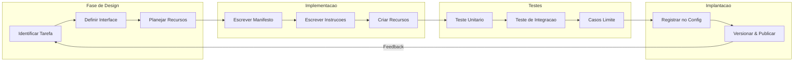
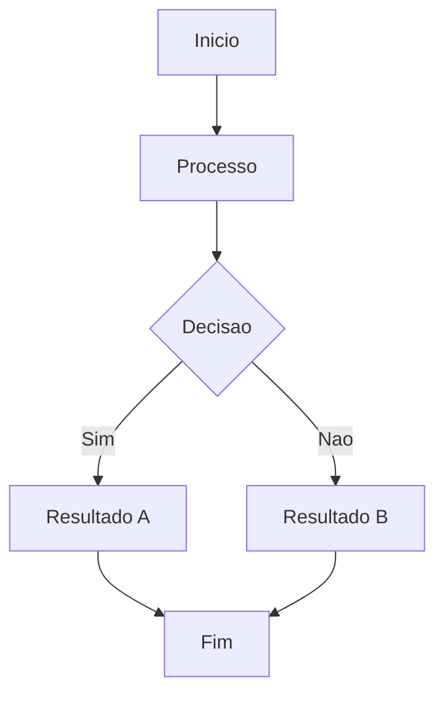

# Construindo Habilidades Personalizadas

## Ciclo de Vida de Desenvolvimento

Construir uma habilidade personalizada segue um ciclo de vida estruturado do conceito a implantacao.



> [!NOTE]
> O ciclo de vida e iterativo. Cada implantacao fornece feedback que informa a proxima iteracao de design.

---

## Estrutura do Manifesto

```yaml
# skills/gerador-api-client/skill.yaml
name: gerador-api-client
version: "1.0.0"
description: |
  Gera bibliotecas de cliente API type-safe a partir de
  especificacoes OpenAPI/Swagger.

author: "NUniversity"
license: "MIT"

instructions:
  - path: instructions/gerar-cliente.md

tools:
  required:
    - read
    - write
    - glob
  optional:
    - bash

resources:
  - path: templates/python-client.py.hbs

autoload:
  enabled: true
  matchPattern: "gerar cliente|api client|openapi|swagger"

constraints:
  maxTokens: 8192
  temperature: 0.3
```

> [!TIP]
> Declare ferramentas com precisao. Marque como `required` apenas se a habilidade nao funcionar sem elas. Use `optional` para ferramentas que melhoram resultados mas tem fallback.

---

## Implementacao Programatica

```python
import json
import os

class HabilidadeGeradorClienteAPI:
    def __init__(self, agente):
        self.agente = agente
        self.handlers_idioma = {
            "python": self._gerar_python,
            "typescript": self._gerar_typescript,
        }

    async def executar(self, caminho_spec, idioma="python", dir_saida="gerado"):
        conteudo = await self.agente.ler(caminho_spec)
        spec = json.loads(conteudo)

        erros = self._validar_spec(spec)
        if erros:
            return {"status": "erro", "erros_validacao": erros}

        os.makedirs(dir_saida, exist_ok=True)
        handler = self.handlers_idioma.get(idioma)
        if not handler:
            return {"status": "erro", "mensagem": f"Idioma nao suportado: {idioma}"}

        codigo = handler(spec, caminho_spec)
        caminho = os.path.join(dir_saida, self._nome_arquivo(idioma))
        await self.agente.escrever(caminho, codigo)

        return {
            "status": "sucesso",
            "arquivo": caminho,
            "endpoints_gerados": len(spec.get("paths", {}))
        }

    def _validar_spec(self, spec):
        erros = []
        if "openapi" not in spec and "swagger" not in spec:
            erros.append("Campo de versao ausente")
        if "info" not in spec:
            erros.append("Secao info ausente")
        if "paths" not in spec or not spec["paths"]:
            erros.append("Nenhum path definido")
        return erros

    def _gerar_python(self, spec, caminho):
        nome = spec.get("info", {}).get("title", "ApiClient")
        linhas = [
            '"""Cliente API gerado automaticamente"""',
            "import requests",
            "",
            f"class {nome.replace(' ', '')}Client:",
            f'    """Cliente para API {nome}."""',
            "    def __init__(self, base_url, api_key=None):",
            "        self.base_url = base_url.rstrip('/')",
            "        self.session = requests.Session()",
            "        if api_key:",
            '            self.session.headers["Authorization"] = f"Bearer {api_key}"',
            "",
        ]
        for path, methods in spec.get("paths", {}).items():
            for method in methods:
                func_name = self._caminho_para_funcao(method, path)
                linhas.append(f"    def {func_name}(self):")
                linhas.append(f'        url = f"{{self.base_url}}{path}"')
                linhas.append(f"        response = self.session.{method}(url)")
                linhas.append("        response.raise_for_status()")
                linhas.append("        return response.json()")
                linhas.append("")
        return "\n".join(linhas)

    def _gerar_typescript(self, spec, caminho):
        nome = spec.get("info", {}).get("title", "ApiClient")
        linhas = [
            f"// Cliente gerado automaticamente para {nome}",
            "import axios, { AxiosInstance } from 'axios';",
            "",
            f"export class {nome.replace(' ', '')}Client {{",
            "  private client: AxiosInstance;",
            "  constructor(baseURL: string, apiKey?: string) {",
            "    this.client = axios.create({ baseURL });",
            "    if (apiKey) {",
            "      this.client.defaults.headers.common['Authorization'] = `Bearer ${apiKey}`;",
            "    }",
            "  }",
            "",
        ]
        for path, methods in spec.get("paths", {}).items():
            for method in methods:
                func_name = self._caminho_para_funcao(method, path)
                linhas.append(f"  async {func_name}(): Promise<any> {{")
                linhas.append(f"    const response = await this.client.{method}('{path}');")
                linhas.append("    return response.data;")
                linhas.append("  }")
                linhas.append("")
        linhas.append("}")
        return "\n".join(linhas)

    def _caminho_para_funcao(self, method, path):
        partes = path.strip("/").replace("/", "_").replace("-", "_").replace("{", "").replace("}", "")
        return f"{method}_{partes}"

    def _nome_arquivo(self, idioma):
        return {"python": "client.py", "typescript": "client.ts"}[idioma]
```

---

## Testando Habilidades

```python
import pytest
import json
from unittest.mock import AsyncMock

@pytest.fixture
def agente_mock():
    agente = AsyncMock()
    agente.ler.return_value = json.dumps({
        "openapi": "3.0.0",
        "info": {"title": "API Teste", "version": "1.0.0"},
        "paths": {
            "/usuarios": {"get": {"summary": "Listar usuarios"}},
            "/usuarios/{id}": {"get": {"summary": "Obter usuario"}}
        }
    })
    return agente

@pytest.mark.asyncio
async def test_gerador_python(agente_mock):
    habilidade = HabilidadeGeradorClienteAPI(agente_mock)
    resultado = await habilidade.executar("spec.yaml", idioma="python")
    assert resultado["status"] == "sucesso"
    assert resultado["endpoints_gerados"] == 2

@pytest.mark.asyncio
async def test_gerador_typescript(agente_mock):
    habilidade = HabilidadeGeradorClienteAPI(agente_mock)
    resultado = await habilidade.executar("spec.yaml", idioma="typescript")
    assert resultado["status"] == "sucesso"

@pytest.mark.asyncio
async def test_spec_invalida(agente_mock):
    agente_mock.ler.return_value = json.dumps({"openapi": "3.0.0"})
    habilidade = HabilidadeGeradorClienteAPI(agente_mock)
    resultado = await habilidade.executar("invalida.yaml")
    assert resultado["status"] == "erro"
    assert len(resultado["erros_validacao"]) > 0

@pytest.mark.asyncio
async def test_idioma_nao_suportado(agente_mock):
    habilidade = HabilidadeGeradorClienteAPI(agente_mock)
    resultado = await habilidade.executar("spec.yaml", idioma="rust")
    assert resultado["status"] == "erro"
    assert "rust" in resultado["mensagem"].lower()
```

---

## Pratica

```question
{
  "id": "aa-07-pt-q1",
  "type": "multiple-choice",
  "question": "Quais sao os tres componentes obrigatorios de um manifesto de habilidade?",
  "options": [
    "Nome, versao e autor",
    "Instrucoes, ferramentas e recursos",
    "Nome, instrucoes e ferramentas",
    "Manifesto, codigo e testes"
  ],
  "correct": 2,
  "explanation": "Um manifesto requer: nome, instrucoes e ferramentas. Recursos sao opcionais."
}
```

```question
{
  "id": "aa-07-pt-q2",
  "type": "multiple-choice",
  "question": "Quando uma ferramenta deve ser marcada como 'required' vs 'optional'?",
  "options": [
    "Sempre marcar todas como required",
    "Required se a habilidade nao funciona sem ela, optional se ha fallback",
    "Apenas ferramentas de leitura podem ser required",
    "Ferramentas de escrita devem ser sempre optional"
  ],
  "correct": 1,
  "explanation": "Required apenas se a habilidade e nao funcional sem a ferramenta. Optional para ferramentas que melhoram resultados mas tem fallback."
}
```

---

[!SUCCESS] **Principais Conclusoes**

- Habilidades seguem ciclo: Design -> Implementacao -> Testes -> Implantacao -> Monitoramento
- Manifestos declaram identidade, ferramentas, recursos e padroes de carregamento
- Instrucoes sao o nucleo; devem ser claras e tratar casos limite
- Teste com agentes mock para testes unitarios e ferramentas reais para integracao
- Evite "Habilidades Deus"; siga responsabilidade unica
- Use templates Handlebars para codigo gerado em habilidades

---

## Fluxo de Trabalho Detalhado



> [!TIP]
> Este diagrama ilustra o fluxo de trabalho basico do agente. Adapte-o ao seu caso de uso especifico.

## Exemplos Adicionais de Codigo

```python
# Exemplo adicional de implementacao
class ExemploAdicional:
    """Classe de exemplo para ilustrar conceitos adicionais."""

    def __init__(self, nome):
        self.nome = nome
        self.dados = {}

    def processar(self, entrada):
        """Processa a entrada e armazena o resultado."""
        resultado = self._transformar(entrada)
        self.dados[entrada] = resultado
        return resultado

    def _transformar(self, valor):
        return valor * 2 if isinstance(valor, (int, float)) else valor.upper()

    def obter_estatisticas(self):
        """Retorna estatisticas sobre os dados processados."""
        if not self.dados:
            return {"status": "vazio", "total": 0}
        return {
            "status": "processado",
            "total": len(self.dados),
            "ultimo": list(self.dados.keys())[-1]
        }

exemplo = ExemploAdicional('teste')
print(exemplo.processar(21))  # 42
print(exemplo.obter_estatisticas())
```

```json
{
  "configuracao_exemplo": {
    "versao": "1.0",
    "parametros": {
      "timeout": 30,
      "max_tentativas": 3,
      "modo": "automatico"
    },
    "seguranca": {
      "requer_aprovacao": true,
      "nivel_autonomia": 2
    }
  }
}
```

```yaml
# configuracao-adicional.yaml
ambiente:
  nome: producao
  variaveis:
    LOG_LEVEL: "debug"
    MAX_TOKENS: 128000
agentes:
  - nome: agente-principal
    modelo: gpt-4o
    temperatura: 0.3
  - nome: agente-revisor
    modelo: claude-sonnet-4-20250514
    ferramentas_permitidas:
      - read
      - grep
      - glob
    ferramentas_negadas:
      - write
      - edit
      - bash

monitoramento:
  metrics: true
  tracing: true
  alertas:
    - tipo: erro_critico
      canal: slack
    - tipo: timeout
      canal: email
```

## Notas Importantes

> [!NOTE]
> Este conceito e fundamental para o entendimento do modulo. Certifique-se de compreende-lo antes de prosseguir.

> [!WARNING]
> Preste atencao a este detalhe: configuracoes incorretas podem levar a comportamentos inesperados do agente.

> [!TIP]
> Uma dica pratica: sempre valide suas configuracoes em ambiente de staging antes de promover para producao.

> [!SUCCESS]
> Ao dominar este conceito, voce estara apto a construir agentes mais robustos e confiaveis.

## Tabela Comparativa

| Caracteristica | Abordagem A | Abordagem B | Abordagem C |
|---------------|-------------|-------------|-------------|
| Complexidade | Baixa | Media | Alta |
| Flexibilidade | Limitada | Moderada | Total |
| Manutencao | Facil | Media | Dificil |
| Performance | Otima | Boa | Variavel |
| Seguranca | Basica | Avancada | Maxima |
| Caso de uso | Prototipos | Producao | Sistemas criticos |

> [!NOTE]
> Escolha a abordagem com base nos requisitos especificos do seu projeto. Nao existe solucao unica para todos os casos.


```question
{
  "id": "aa-07-pt-extra-q1",
  "type": "multiple-choice",
  "question": "Pergunta adicional 1 sobre o conteudo desta aula?",
  "options": [
    "Opcao A",
    "Opcao B",
    "Opcao C",
    "Opcao D"
  ],
  "correct": 0,
  "explanation": "Explicacao detalhada para a pergunta 1."
}
```

```question
{
  "id": "aa-07-pt-extra-q2",
  "type": "multiple-choice",
  "question": "Pergunta adicional 2 sobre o conteudo desta aula?",
  "options": [
    "Opcao A",
    "Opcao B",
    "Opcao C",
    "Opcao D"
  ],
  "correct": 0,
  "explanation": "Explicacao detalhada para a pergunta 2."
}
```

```question
{
  "id": "aa-07-pt-extra-q3",
  "type": "multiple-choice",
  "question": "Pergunta adicional 3 sobre o conteudo desta aula?",
  "options": [
    "Opcao A",
    "Opcao B",
    "Opcao C",
    "Opcao D"
  ],
  "correct": 0,
  "explanation": "Explicacao detalhada para a pergunta 3."
}
```

---

[!SUCCESS] **Principais Conclusoes Adicionais**

- Reforce seu entendimento praticando com exemplos reais
- Consulte a documentacao oficial para casos avancados
- Compartilhe seu conhecimento com a comunidade
- Sempre teste suas implementacoes em ambientes controlados
- Mantenha-se atualizado com as melhores praticas da industria
- A pratica consistente e a chave para a maestria
- Agentes de IA bem projetados combinam tecnologia com boas praticas de engenharia
