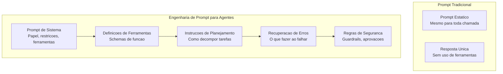
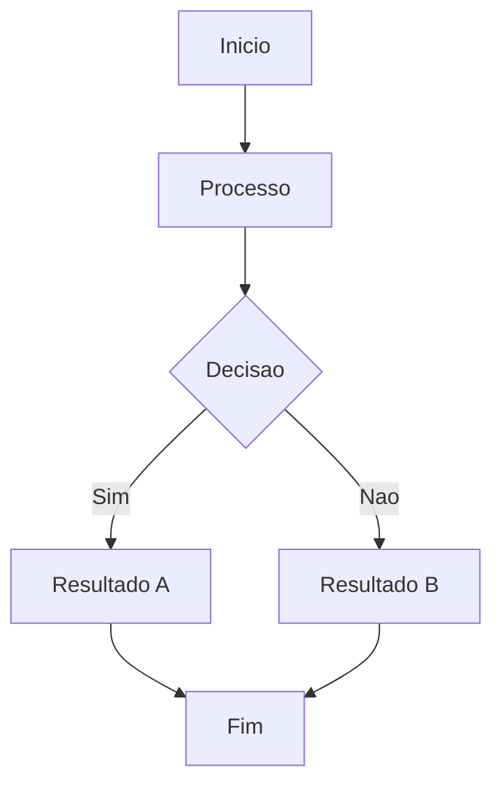

# Engenharia de Prompt para Agentes

## Por Que Prompts de Agente Sao Diferentes

A engenharia de prompt para agentes difere fundamentalmente da tradicional. Prompts de agente devem instruir o modelo sobre tom e formato, mas tambem definir uso de ferramentas, comportamento de planejamento, recuperacao de erros e restricoes de seguranca.



> [!NOTE]
> Um prompt de agente nao e apenas uma mensagem de sistema. E um documento em camadas que inclui definicao de papel, schemas de ferramentas, estrategias de planejamento e especificacoes de saida.

---

## Arquitetura do Prompt de Sistema

```yaml
prompt_sistema:
  definicao_papel:
    conteudo: "Voce e um engenheiro de software especialista..."
    tom: "profissional, preciso"
    especialidade: ["Python", "TypeScript", "arquitetura"]

  restricoes:
    - "Sempre peca esclarecimento se requisitos forem ambiguos"
    - "Nunca execute comandos destrutivos sem confirmacao"
    - "Prefira bibliotecas padrao sobre dependencias externas"

  politica_uso_ferramentas:
    descoberta: "Use tools/list para descobrir ferramentas"
    invocacao: "Chame ferramentas com parametros precisos"
    erros: "Se uma ferramenta falhar, tente mais uma vez e reporte"

  instrucoes_planejamento:
    decomposicao: "Divida tarefas complexas em passos sequenciais"
    verificacao: "Verifique cada passo antes de prosseguir"
```

```python
class ConstrutorPromptSistema:
    def __init__(self):
        self.secoes = {}

    def adicionar_papel(self, nome, descricao, especialidade=None):
        self.secoes["papel"] = {
            "nome": nome,
            "descricao": descricao,
            "especialidade": especialidade or []
        }
        return self

    def adicionar_restricoes(self, restricoes):
        self.secoes["restricoes"] = restricoes
        return self

    def adicionar_ferramentas(self, definicoes):
        self.secoes["ferramentas"] = definicoes
        return self

    def adicionar_regras_seguranca(self, regras):
        self.secoes["seguranca"] = regras
        return self

    def construir(self):
        partes = [f"# Papel: {self.secoes.get('papel', {}).get('nome', 'Assistente')}"]
        papel = self.secoes.get("papel", {})
        partes.append(papel.get("descricao", ""))

        if "restricoes" in self.secoes:
            partes.append("\n## Restricoes")
            for r in self.secoes["restricoes"]:
                partes.append(f"- {r}")

        if "ferramentas" in self.secoes:
            partes.append("\n## Ferramentas Disponiveis")
            for f in self.secoes["ferramentas"]:
                partes.append(f"- `{f['nome']}`: {f['descricao']}")

        if "seguranca" in self.secoes:
            partes.append("\n## Regras de Seguranca")
            for r in self.secoes["seguranca"]:
                partes.append(f"- {r}")

        return "\n".join(partes)


construtor = ConstrutorPromptSistema()
prompt = (construtor
    .adicionar_papel("Engenheiro Senior", "Voce e um engenheiro de software expert.")
    .adicionar_restricoes([
        "Peca esclarecimento se ambiguo",
        "Nunca execute comandos destrutivos sem aprovacao",
    ])
    .adicionar_ferramentas([
        {"nome": "read", "descricao": "Ler arquivos"},
        {"nome": "bash", "descricao": "Executar comandos"},
    ])
    .adicionar_regras_seguranca([
        "Requer aprovacao para escrever em caminhos de producao",
    ])
    .construir()
)
print(prompt[:500])
```

---

## Few-Shot para Agentes

```yaml
exemplos_few_shot:
  - cenario: "Correcao de bug"
    usuario: "Endpoint de login retorna 500 quando usuario esta vazio"
    assistente:
      raciocinio: |
        1. O problema e provavelmente validacao de entrada ausente
        2. Preciso encontrar o handler do endpoint de login
        3. Verificar se ha validacao de entrada
        4. Adicionar validacao se ausente
      acoes:
        - ferramenta: "grep"
          params: { padrao: "def login" }
        - ferramenta: "read"
          params: { caminho: "src/auth/views.py" }
      resultado: |
        Encontrado o handler. Validacao de usuario vazio ausente.
        Adicionando validacao na linha 42.

  - cenario: "Recuperacao de erro"
    usuario: "Fazer deploy em producao"
    assistente:
      raciocinio: |
        Deploy requer portao de aprovacao.
        Primeiro executar testes, depois build, entao solicitar aprovacao.
      acoes:
        - ferramenta: "bash"
          params: { comando: "pytest tests/" }
      tratamento_erro: |
        Testes falharam. Bloqueando deploy.
        Reportando falhas ao usuario.
```

---

## Otimizacao de Restricoes

```json
{
  "restricoes_agente": {
    "comportamental": {
      "deve_fazer": [
        "Ler arquivos antes de modificar",
        "Executar testes apos alteracoes",
        "Reportar todos os erros ao usuario"
      ],
      "nao_deve_fazer": [
        "Deletar arquivos sem confirmacao",
        "Modificar package-lock.json",
        "Acessar arquivos fora do diretorio do projeto"
      ]
    },
    "comunicacao": {
      "ser_concisa": true,
      "mostrar_raciocinio": true,
      "usar_markdown": true
    },
    "uso_ferramentas": {
      "validar_parametros": true,
      "timeout_ms": 30000,
      "max_paralelo": 5,
      "tentar_novamente": true
    }
  }
}
```

---

## Pratica

```question
{
  "id": "aa-08-pt-q1",
  "type": "multiple-choice",
  "question": "O que torna a engenharia de prompt para agentes diferente da tradicional?",
  "options": [
    "Prompts de agente sao mais curtos",
    "Devem incluir definicoes de ferramentas, estrategias de planejamento e restricoes de seguranca",
    "Prompts tradicionais usam linguagem mais tecnica",
    "Nao ha diferenca"
  ],
  "correct": 1,
  "explanation": "Prompts de agente devem definir uso de ferramentas, comportamento de planejamento e restricoes de seguranca em um loop de execucao autonomo."
}
```

```question
{
  "id": "aa-08-pt-q2",
  "type": "multiple-choice",
  "question": "Quantos exemplos few-shot sao recomendados para prompts de agente?",
  "options": [
    "1-2 exemplos",
    "3-5 exemplos bem elaborados cobrindo fluxo normal, erro e casos limite",
    "10-15 exemplos",
    "Nenhum; agentes aprendem com documentacao de ferramentas"
  ],
  "correct": 1,
  "explanation": "3-5 exemplos cobrindo fluxo normal, recuperacao de erro e casos limite fornecem aprendizado sem desperdicar tokens."
}
```

```question
{
  "id": "aa-08-pt-q3",
  "type": "multiple-choice",
  "question": "Qual a forma mais eficaz de escrever restricoes de seguranca em prompts de agente?",
  "options": [
    "Declaracoes gerais como 'seja seguro'",
    "Regras concretas e testaveis como 'Nunca execute comandos rm -rf'",
    "Escrever restricoes apenas no final do prompt",
    "Evitar restricoes para dar flexibilidade total"
  ],
  "correct": 1,
  "explanation": "Restricoes devem ser concretas, especificas e testaveis. 'Seja seguro' e vago demais. 'Nunca execute rm -rf' e um limite claro."
}
```

---

[!SUCCESS] **Principais Conclusoes**

- Prompts de agente sao documentos em camadas com papel, ferramentas, planejamento e restricoes
- Few-shot com 3-5 exemplos ensina padroes de tarefa eficazmente
- Restricoes devem ser concretas e testaveis, nao vagas
- Injecao dinamica de prompt permite contexto viavel em tempo de execucao
- Avaliacao de prompt com casos de teste validados verifica eficacia
- Padroes de otimizacao incluem ancoragem de papel, cadeia de pensamento e prompting negativo

---

## Fluxo de Trabalho Detalhado



> [!TIP]
> Este diagrama ilustra o fluxo de trabalho basico do agente. Adapte-o ao seu caso de uso especifico.

## Exemplos Adicionais de Codigo

```python
# Exemplo adicional de implementacao
class ExemploAdicional:
    """Classe de exemplo para ilustrar conceitos adicionais."""

    def __init__(self, nome):
        self.nome = nome
        self.dados = {}

    def processar(self, entrada):
        """Processa a entrada e armazena o resultado."""
        resultado = self._transformar(entrada)
        self.dados[entrada] = resultado
        return resultado

    def _transformar(self, valor):
        return valor * 2 if isinstance(valor, (int, float)) else valor.upper()

    def obter_estatisticas(self):
        """Retorna estatisticas sobre os dados processados."""
        if not self.dados:
            return {"status": "vazio", "total": 0}
        return {
            "status": "processado",
            "total": len(self.dados),
            "ultimo": list(self.dados.keys())[-1]
        }

exemplo = ExemploAdicional('teste')
print(exemplo.processar(21))  # 42
print(exemplo.obter_estatisticas())
```

```json
{
  "configuracao_exemplo": {
    "versao": "1.0",
    "parametros": {
      "timeout": 30,
      "max_tentativas": 3,
      "modo": "automatico"
    },
    "seguranca": {
      "requer_aprovacao": true,
      "nivel_autonomia": 2
    }
  }
}
```

```yaml
# configuracao-adicional.yaml
ambiente:
  nome: producao
  variaveis:
    LOG_LEVEL: "debug"
    MAX_TOKENS: 128000
agentes:
  - nome: agente-principal
    modelo: gpt-4o
    temperatura: 0.3
  - nome: agente-revisor
    modelo: claude-sonnet-4-20250514
    ferramentas_permitidas:
      - read
      - grep
      - glob
    ferramentas_negadas:
      - write
      - edit
      - bash

monitoramento:
  metrics: true
  tracing: true
  alertas:
    - tipo: erro_critico
      canal: slack
    - tipo: timeout
      canal: email
```

## Notas Importantes

> [!NOTE]
> Este conceito e fundamental para o entendimento do modulo. Certifique-se de compreende-lo antes de prosseguir.

> [!WARNING]
> Preste atencao a este detalhe: configuracoes incorretas podem levar a comportamentos inesperados do agente.

> [!TIP]
> Uma dica pratica: sempre valide suas configuracoes em ambiente de staging antes de promover para producao.

> [!SUCCESS]
> Ao dominar este conceito, voce estara apto a construir agentes mais robustos e confiaveis.

## Tabela Comparativa

| Caracteristica | Abordagem A | Abordagem B | Abordagem C |
|---------------|-------------|-------------|-------------|
| Complexidade | Baixa | Media | Alta |
| Flexibilidade | Limitada | Moderada | Total |
| Manutencao | Facil | Media | Dificil |
| Performance | Otima | Boa | Variavel |
| Seguranca | Basica | Avancada | Maxima |
| Caso de uso | Prototipos | Producao | Sistemas criticos |

> [!NOTE]
> Escolha a abordagem com base nos requisitos especificos do seu projeto. Nao existe solucao unica para todos os casos.


```question
{
  "id": "aa-08-pt-extra-q1",
  "type": "multiple-choice",
  "question": "Pergunta adicional 1 sobre o conteudo desta aula?",
  "options": [
    "Opcao A",
    "Opcao B",
    "Opcao C",
    "Opcao D"
  ],
  "correct": 0,
  "explanation": "Explicacao detalhada para a pergunta 1."
}
```

```question
{
  "id": "aa-08-pt-extra-q2",
  "type": "multiple-choice",
  "question": "Pergunta adicional 2 sobre o conteudo desta aula?",
  "options": [
    "Opcao A",
    "Opcao B",
    "Opcao C",
    "Opcao D"
  ],
  "correct": 0,
  "explanation": "Explicacao detalhada para a pergunta 2."
}
```

```question
{
  "id": "aa-08-pt-extra-q3",
  "type": "multiple-choice",
  "question": "Pergunta adicional 3 sobre o conteudo desta aula?",
  "options": [
    "Opcao A",
    "Opcao B",
    "Opcao C",
    "Opcao D"
  ],
  "correct": 0,
  "explanation": "Explicacao detalhada para a pergunta 3."
}
```

---

[!SUCCESS] **Principais Conclusoes Adicionais**

- Reforce seu entendimento praticando com exemplos reais
- Consulte a documentacao oficial para casos avancados
- Compartilhe seu conhecimento com a comunidade
- Sempre teste suas implementacoes em ambientes controlados
- Mantenha-se atualizado com as melhores praticas da industria
- A pratica consistente e a chave para a maestria
- Agentes de IA bem projetados combinam tecnologia com boas praticas de engenharia
