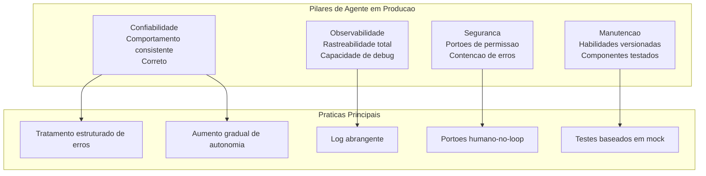
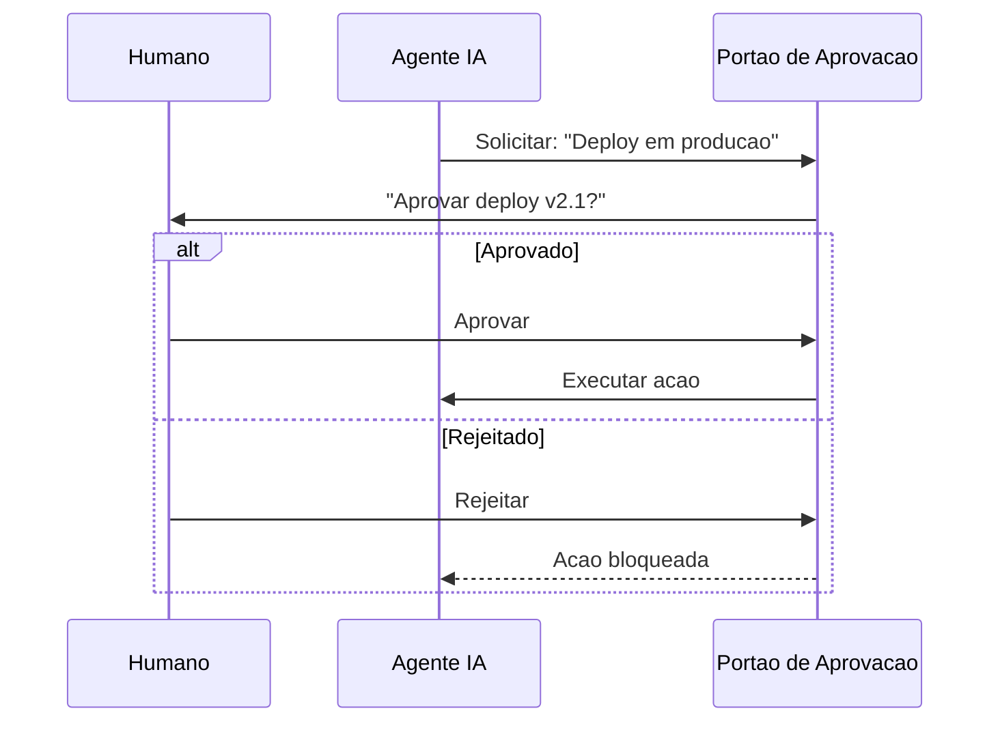
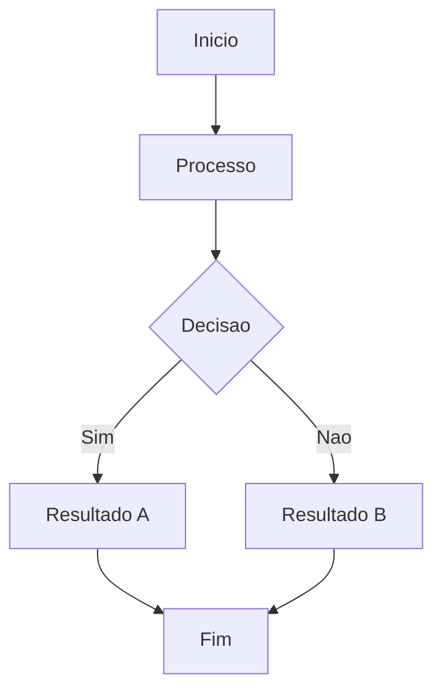

# Melhores Praticas e Padroes

## Principios de Design para Producao

Construir agentes de producao confiaveis requer uma abordagem sistematica para design, teste, observabilidade e seguranca.



> [!NOTE]
> Agentes de producao falham de maneiras que agentes de prototipo nao falham. A diferenca entre demonstracao e implantacao e como o sistema lida com casos limite, erros e entradas inesperadas.

---

## Padroes de Confiabilidade

### 1. Retry com Backoff Exponencial

```python
import asyncio
import random

async def executar_com_retry(fn, max_tentativas=3, delay_base=1.0):
    for tentativa in range(max_tentativas):
        try:
            return await fn()
        except Exception as e:
            if tentativa < max_tentativas - 1:
                delay = delay_base * (2 ** tentativa) + random.uniform(0, 0.5)
                await asyncio.sleep(delay)
            else:
                raise e
```

### 2. Circuit Breaker

```python
class CircuitBreaker:
    def __init__(self, limite_falhas=5, timeout_recuperacao=30):
        self.limite_falhas = limite_falhas
        self.timeout_recuperacao = timeout_recuperacao
        self.contagem_falhas = 0
        self.ultima_falha = 0
        self.estado = "fechado"

    async def chamar(self, fn):
        if self.estado == "aberto":
            if self._tempo_recuperacao_decorrido():
                self.estado = "meio-aberto"
            else:
                raise Exception("Circuit breaker esta aberto")

        try:
            resultado = await fn()
            if self.estado == "meio-aberto":
                self.estado = "fechado"
                self.contagem_falhas = 0
            return resultado
        except Exception as e:
            self.contagem_falhas += 1
            self.ultima_falha = __import__('time').time()
            if self.contagem_falhas >= self.limite_falhas:
                self.estado = "aberto"
            raise e

    def _tempo_recuperacao_decorrido(self):
        return __import__('time').time() - self.ultima_falha > self.timeout_recuperacao
```

### 3. Cadeia de Fallback

```python
class CadeiaFallback:
    def __init__(self, estrategias):
        self.estrategias = estrategias

    async def executar(self):
        erros = []
        for nome, fn in self.estrategias:
            try:
                return await fn()
            except Exception as e:
                erros.append(f"{nome}: {e}")
                continue
        raise Exception(f"Todas as estrategias falharam: {erros}")
```

---

## Observabilidade e Monitoramento

```python
import json
import time

 class LoggerAgente:
    def __init__(self):
        self.eventos = []

    def log(self, tipo, dados):
        entrada = {
            "timestamp": time.time(),
            "tipo": tipo,
            "dados": dados
        }
        self.eventos.append(entrada)

    def log_percepcao(self, entrada):
        self.log("percepcao", {"entrada": entrada[:200]})

    def log_chamada_ferramenta(self, ferramenta, params, resultado):
        self.log("chamada_ferramenta", {
            "ferramenta": ferramenta,
            "params": params,
            "status": "sucesso" if resultado.get("status") == "sucesso" else "erro"
        })

    def log_erro(self, estagio, erro):
        self.log("erro", {"estagio": estagio, "erro": str(erro)})

    def obter_sumario(self):
        erros = [e for e in self.eventos if e["tipo"] == "erro"]
        chamadas = [e for e in self.eventos if e["tipo"] == "chamada_ferramenta"]
        return {
            "total_eventos": len(self.eventos),
            "erros": len(erros),
            "chamadas_ferramenta": len(chamadas)
        }

    def exportar_json(self, caminho):
        with open(caminho, "w") as f:
            json.dump(self.eventos, f, indent=2)
```

---

## Humano-no-Loop



```python
class PortaoAprovacao:
    def __init__(self, funcao_perguntar):
        self.perguntar = funcao_perguntar
        self.historico = []

    async def solicitar_aprovacao(self, acao, detalhes):
        aprovado = await self.perguntar(acao, detalhes)
        self.historico.append({
            "acao": acao,
            "detalhes": detalhes,
            "aprovado": aprovado,
            "timestamp": __import__('time').time()
        })
        return aprovado


ACOES_REQUEREM_APROVACAO = [
    "deploy_producao",
    "deletar_arquivos",
    "modificar_config_seguranca",
    "migracao_banco",
]

class AplicadorSeguranca:
    def __init__(self, portao):
        self.portao = portao

    async def verificar_acao(self, tipo_acao, detalhes):
        if tipo_acao in ACOES_REQUEREM_APROVACAO:
            return await self.portao.solicitar_aprovacao(tipo_acao, detalhes)
        return True
```

---

## Estrategias de Teste

| Nivel | O Que Testa | Ferramentas |
|-------|-------------|-------------|
| Unitario | Logica individual | pytest, agentes mock |
| Integracao | Interacao ferramentas | Ferramentas reais em sandbox |
| E2E | Fluxo completo | Ambiente de staging |
| Estresse | Performance | Ferramentas de carga |
| Caso Limite | Entradas incomuns | Fuzzing |

```python
import pytest
from unittest.mock import AsyncMock

@pytest.mark.asyncio
async def test_retry_apos_falha():
    ferramenta_mock = AsyncMock(side_effect=[
        Exception("Erro de rede"),
        {"status": "sucesso", "dados": "resultado"}
    ])
    resultado = await executar_com_retry(
        lambda: ferramenta_mock(),
        max_tentativas=2
    )
    assert resultado["status"] == "sucesso"
    assert ferramenta_mock.call_count == 2

@pytest.mark.asyncio
async def test_circuit_breaker_abre_apos_limite():
    breaker = CircuitBreaker(limite_falhas=3, timeout_recuperacao=60)
    fn_falha = AsyncMock(side_effect=Exception("Falha"))

    for i in range(3):
        with pytest.raises(Exception):
            await breaker.chamar(fn_falha)

    assert breaker.estado == "aberto"
```

---

## Pratica

```question
{
  "id": "aa-09-pt-q1",
  "type": "multiple-choice",
  "question": "Qual o proposito do padrao circuit breaker em sistemas de agente?",
  "options": [
    "Aumentar velocidade de execucao",
    "Prevenir chamadas repetidas a um servico com falha",
    "Quebrar a resposta do agente em partes menores",
    "Criptografar parametros de chamada"
  ],
  "correct": 1,
  "explanation": "Circuit breaker monitora falhas e 'abre' o circuito apos um limite, prevenindo chamadas repetidas ao servico com falha."
}
```

```question
{
  "id": "aa-09-pt-q2",
  "type": "multiple-choice",
  "question": "Quando usar backoff exponencial em sistemas de agente?",
  "options": [
    "Para todas as chamadas de ferramenta",
    "Para falhas transientes como timeout de rede e limite de taxa",
    "Apenas para operacoes de leitura",
    "Backoff exponencial nao e recomendado"
  ],
  "correct": 1,
  "explanation": "Backoff exponencial e apropriado para falhas transientes. Nao deve ser usado para falhas permanentes."
}
```

```question
{
  "id": "aa-09-pt-q3",
  "type": "multiple-choice",
  "question": "Que acoes devem tipicamente requerer aprovacao humana?",
  "options": [
    "Ler arquivos no diretorio src",
    "Deploy em producao, delecao de arquivos, config de seguranca",
    "Executar linters e formatadores",
    "Buscar comentarios TODO"
  ],
  "correct": 1,
  "explanation": "Operacoes de alto risco como deploy em producao, delecao de arquivos e config de seguranca devem sempre requerer aprovacao humana."
}
```

---

[!SUCCESS] **Principais Conclusoes**

- Agentes de producao requerem padroes de confiabilidade: retry, circuit breaker, fallback
- Observabilidade via logs abrangentes e essencial para debug e auditoria
- Portoes de aprovacao humano-no-loop protegem operacoes de alto risco
- Testes abrangem unitario, integracao, E2E, estresse e caso limite
- Implantacao gradual com monitoramento e a estrategia segura
- Logging deve capturar chamadas de ferramenta, raciocinio, erros e aprovacoes

---

## Fluxo de Trabalho Detalhado



> [!TIP]
> Este diagrama ilustra o fluxo de trabalho basico do agente. Adapte-o ao seu caso de uso especifico.

## Exemplos Adicionais de Codigo

```python
# Exemplo adicional de implementacao
class ExemploAdicional:
    """Classe de exemplo para ilustrar conceitos adicionais."""

    def __init__(self, nome):
        self.nome = nome
        self.dados = {}

    def processar(self, entrada):
        """Processa a entrada e armazena o resultado."""
        resultado = self._transformar(entrada)
        self.dados[entrada] = resultado
        return resultado

    def _transformar(self, valor):
        return valor * 2 if isinstance(valor, (int, float)) else valor.upper()

    def obter_estatisticas(self):
        """Retorna estatisticas sobre os dados processados."""
        if not self.dados:
            return {"status": "vazio", "total": 0}
        return {
            "status": "processado",
            "total": len(self.dados),
            "ultimo": list(self.dados.keys())[-1]
        }

exemplo = ExemploAdicional('teste')
print(exemplo.processar(21))  # 42
print(exemplo.obter_estatisticas())
```

```json
{
  "configuracao_exemplo": {
    "versao": "1.0",
    "parametros": {
      "timeout": 30,
      "max_tentativas": 3,
      "modo": "automatico"
    },
    "seguranca": {
      "requer_aprovacao": true,
      "nivel_autonomia": 2
    }
  }
}
```

```yaml
# configuracao-adicional.yaml
ambiente:
  nome: producao
  variaveis:
    LOG_LEVEL: "debug"
    MAX_TOKENS: 128000
agentes:
  - nome: agente-principal
    modelo: gpt-4o
    temperatura: 0.3
  - nome: agente-revisor
    modelo: claude-sonnet-4-20250514
    ferramentas_permitidas:
      - read
      - grep
      - glob
    ferramentas_negadas:
      - write
      - edit
      - bash

monitoramento:
  metrics: true
  tracing: true
  alertas:
    - tipo: erro_critico
      canal: slack
    - tipo: timeout
      canal: email
```

## Notas Importantes

> [!NOTE]
> Este conceito e fundamental para o entendimento do modulo. Certifique-se de compreende-lo antes de prosseguir.

> [!WARNING]
> Preste atencao a este detalhe: configuracoes incorretas podem levar a comportamentos inesperados do agente.

> [!TIP]
> Uma dica pratica: sempre valide suas configuracoes em ambiente de staging antes de promover para producao.

> [!SUCCESS]
> Ao dominar este conceito, voce estara apto a construir agentes mais robustos e confiaveis.

## Tabela Comparativa

| Caracteristica | Abordagem A | Abordagem B | Abordagem C |
|---------------|-------------|-------------|-------------|
| Complexidade | Baixa | Media | Alta |
| Flexibilidade | Limitada | Moderada | Total |
| Manutencao | Facil | Media | Dificil |
| Performance | Otima | Boa | Variavel |
| Seguranca | Basica | Avancada | Maxima |
| Caso de uso | Prototipos | Producao | Sistemas criticos |

> [!NOTE]
> Escolha a abordagem com base nos requisitos especificos do seu projeto. Nao existe solucao unica para todos os casos.


```question
{
  "id": "aa-09-pt-extra-q1",
  "type": "multiple-choice",
  "question": "Pergunta adicional 1 sobre o conteudo desta aula?",
  "options": [
    "Opcao A",
    "Opcao B",
    "Opcao C",
    "Opcao D"
  ],
  "correct": 0,
  "explanation": "Explicacao detalhada para a pergunta 1."
}
```

```question
{
  "id": "aa-09-pt-extra-q2",
  "type": "multiple-choice",
  "question": "Pergunta adicional 2 sobre o conteudo desta aula?",
  "options": [
    "Opcao A",
    "Opcao B",
    "Opcao C",
    "Opcao D"
  ],
  "correct": 0,
  "explanation": "Explicacao detalhada para a pergunta 2."
}
```

```question
{
  "id": "aa-09-pt-extra-q3",
  "type": "multiple-choice",
  "question": "Pergunta adicional 3 sobre o conteudo desta aula?",
  "options": [
    "Opcao A",
    "Opcao B",
    "Opcao C",
    "Opcao D"
  ],
  "correct": 0,
  "explanation": "Explicacao detalhada para a pergunta 3."
}
```

---

[!SUCCESS] **Principais Conclusoes Adicionais**

- Reforce seu entendimento praticando com exemplos reais
- Consulte a documentacao oficial para casos avancados
- Compartilhe seu conhecimento com a comunidade
- Sempre teste suas implementacoes em ambientes controlados
- Mantenha-se atualizado com as melhores praticas da industria
- A pratica consistente e a chave para a maestria
- Agentes de IA bem projetados combinam tecnologia com boas praticas de engenharia
