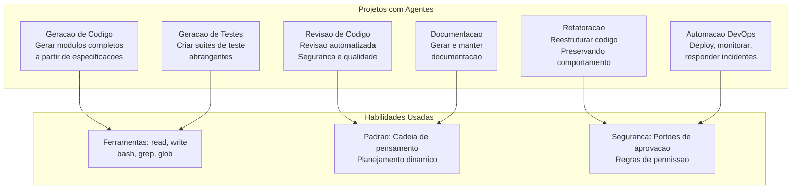
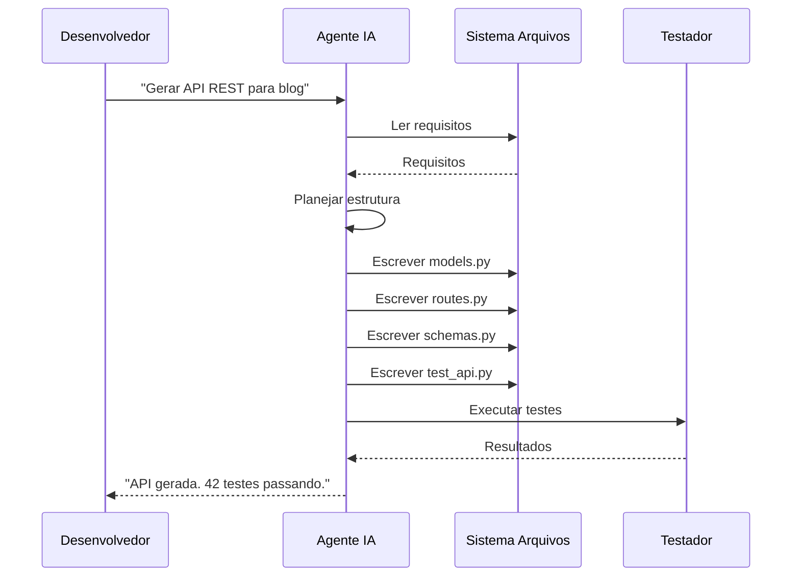
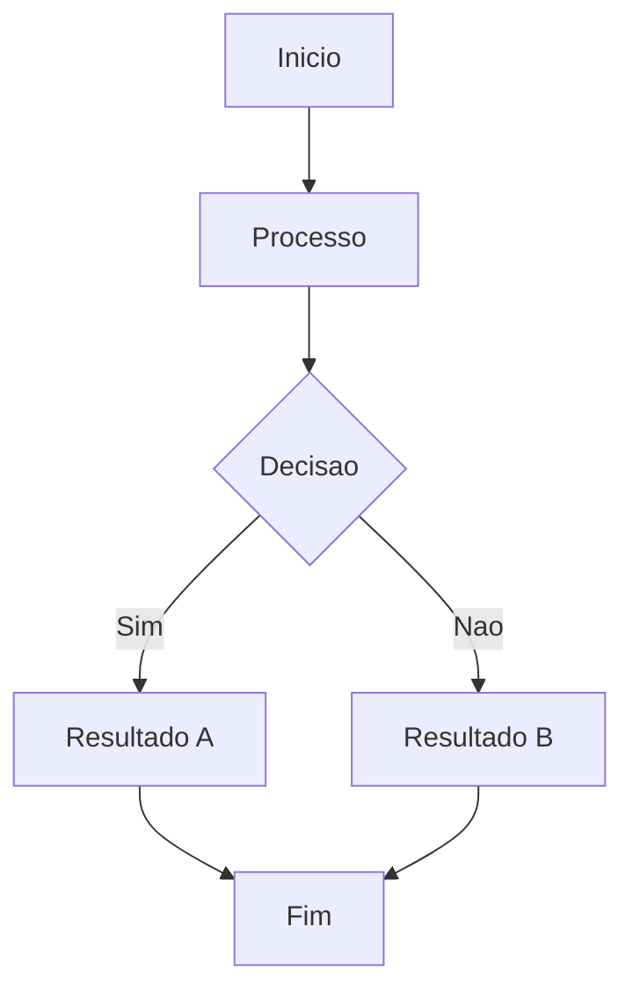

# Projetos Reais com Agentes

## Visao Geral

Esta aula de culminacao sintetiza tudo que voce aprendeu em projetos praticos e reais. Cada projeto demonstra como tecnicas de IA agentica se aplicam a tarefas comuns de engenharia de software.



> [!NOTE]
> Estes projetos sao projetados para serem executados com OpenCode ou qualquer framework de agente. Cada projeto inclui configuracao, definicoes de habilidade e saidas esperadas.

---

## Projeto 1: Geracao de Codigo

Gerar um modulo completo de API REST a partir de especificacoes.



```python
CODIGO_GERADO = """
# models.py
from sqlalchemy import Column, Integer, String, Text, DateTime, ForeignKey
from sqlalchemy.sql import func
from database import Base

class User(Base):
    __tablename__ = "users"
    id = Column(Integer, primary_key=True, index=True)
    username = Column(String(50), unique=True, nullable=False)
    email = Column(String(120), unique=True, nullable=False)
    created_at = Column(DateTime(timezone=True), server_default=func.now())

class Post(Base):
    __tablename__ = "posts"
    id = Column(Integer, primary_key=True, index=True)
    title = Column(String(200), nullable=False)
    content = Column(Text, nullable=False)
    author_id = Column(Integer, ForeignKey("users.id"), nullable=False)
    created_at = Column(DateTime(timezone=True), server_default=func.now())

# routes.py
from fastapi import APIRouter, Depends, HTTPException
from sqlalchemy.orm import Session
from . import models, schemas
from .database import get_db

router = APIRouter(prefix="/api/v1", tags=["blog"])

@router.get("/posts/", response_model=list[schemas.PostResponse])
def list_posts(skip: int = 0, limit: int = 10, db: Session = Depends(get_db)):
    return db.query(models.Post).offset(skip).limit(limit).all()

@router.post("/posts/", response_model=schemas.PostResponse, status_code=201)
def create_post(post: schemas.PostCreate, db: Session = Depends(get_db)):
    db_post = models.Post(**post.model_dump())
    db.add(db_post)
    db.commit()
    db.refresh(db_post)
    return db_post
"""
```

---

## Projeto 2: Revisao de Codigo Inteligente

```python
class AgenteRevisaoCodigo:
    def __init__(self, agente):
        self.agente = agente
        descobertas = []

    async def revisar_pr(self, numero_pr, caminho_repo):
        diff = await self.agente.bash(f"cd {caminho_repo} && git diff main...HEAD")
        arquivos = (await self.agente.bash(
            f"cd {caminho_repo} && git diff --name-only main...HEAD"
        )).strip().split("\n")

        for arquivo in arquivos[:10]:
            if arquivo.endswith((".py", ".ts", ".js", ".tsx")):
                conteudo = await self.agente.ler(f"{caminho_repo}/{arquivo}")
                revisao = await self._revisar_arquivo(arquivo, conteudo)
                self.descobertas.extend(revisao)

        return self._gerar_relatorio()

    async def _revisar_arquivo(self, caminho, conteudo):
        descobertas = []
        linhas = conteudo.split("\n")

        for i, linha in enumerate(linhas, 1):
            if "eval(" in linha or "exec(" in linha:
                descobertas.append({
                    "severidade": "critico",
                    "arquivo": caminho,
                    "linha": i,
                    "tipo": "injecao_codigo",
                    "descricao": "Funcao perigosa"
                })
            if "password" in linha.lower() and "=" in linha:
                descobertas.append({
                    "severidade": "critico",
                    "arquivo": caminho,
                    "linha": i,
                    "tipo": "secreto_hardcoded",
                    "descricao": "Possivel credencial hardcoded"
                })
            if "TODO" in linha or "FIXME" in linha:
                descobertas.append({
                    "severidade": "info",
                    "arquivo": caminho,
                    "linha": i,
                    "tipo": "todo",
                    "descricao": linha.strip()
                })

        return descobertas

    def _gerar_relatorio(self):
        por_severidade = {}
        for d in self.descobertas:
            sev = d["severidade"]
            if sev not in por_severidade:
                por_severidade[sev] = []
            por_severidade[sev].append(d)

        relatorio = [
            "# Relatorio de Revisao de Codigo",
            f"**Total de Descobertas**: {len(self.descobertas)}",
            "",
            "## Sumario por Severidade",
        ]
        for sev in ["critico", "grave", "leve", "info"]:
            count = len(por_severidade.get(sev, []))
            relatorio.append(f"- **{sev.capitalize()}**: {count}")

        return "\n".join(relatorio)
```

---

## Projeto 3: Refatoracao Automatica

```python
class AgenteRefatoracao:
    def __init__(self, agente):
        self.agente = agente
        self.alteracoes = []

    async def refatorar(self, caminho, estrategia):
        conteudo = await self.agente.ler(caminho)

        if estrategia == "extrair_funcao":
            return await self._extrair_funcao(conteudo, caminho)
        elif estrategia == "renomear_variavel":
            return await self._renomear_variavel(conteudo, caminho)
        elif estrategia == "adicionar_dicas_tipo":
            return await self._adicionar_dicas_tipo(conteudo, caminho)

        return {"status": "erro", "mensagem": f"Estrategia desconhecida: {estrategia}"}

    async def _extrair_funcao(self, conteudo, caminho):
        linhas = conteudo.split("\n")
        alteracoes = []
        for i, linha in enumerate(linhas):
            if linha.startswith("def ") and i + 30 < len(linhas):
                nome_func = linha[4:].split("(")[0]
                alteracoes.append({
                    "tipo": "extrair_funcao",
                    "funcao": nome_func,
                    "linha": i + 1,
                    "sugestao": f"Extrair helpers de {nome_func}"
                })
        return {"status": "analisado", "alteracoes": alteracoes}

    async def _renomear_variavel(self, conteudo, caminho):
        import re
        linhas = conteudo.split("\n")
        alteracoes = []
        nomes_ruins = re.findall(r'\b([a-z]{1,2})\s*=', conteudo)
        for nome in set(nomes_ruins):
            if nome not in ["id", "ok", "no"]:
                alteracoes.append({
                    "tipo": "renomear_variavel",
                    "nome_antigo": nome,
                    "sugestao": f"Renomear '{nome}' para algo descritivo"
                })
        return {"status": "analisado", "alteracoes": alteracoes}

    async def _adicionar_dicas_tipo(self, conteudo, caminho):
        linhas = conteudo.split("\n")
        alteracoes = []
        for i, linha in enumerate(linhas, 1):
            if linha.startswith("def ") and "->" not in linha:
                func = linha[4:].split("(")[0]
                alteracoes.append({
                    "tipo": "adicionar_tipo_retorno",
                    "funcao": func,
                    "linha": i
                })
        return {"status": "analisado", "alteracoes": alteracoes}
```

---

## Projeto 4: Geracao de Testes

```python
class GeradorTestes:
    def __init__(self, agente):
        self.agente = agente

    async def gerar_testes(self, caminho_fonte):
        conteudo = await self.agente.ler(caminho_fonte)
        funcoes = self._analisar_funcoes(conteudo)
        arquivo_teste = self._construir_arquivo_teste(caminho_fonte, funcoes)
        caminho_teste = caminho_fonte.replace("src/", "tests/").replace(".py", "_test.py")
        await self.agente.escrever(caminho_teste, arquivo_teste)
        return {"arquivo_teste": caminho_teste, "qtd_testes": len(funcoes)}

    def _analisar_funcoes(self, conteudo):
        import ast
        try:
            arvore = ast.parse(conteudo)
            funcoes = []
            for no in ast.walk(arvore):
                if isinstance(no, ast.FunctionDef):
                    funcoes.append({
                        "nome": no.name,
                        "args": [a.arg for a in no.args.args]
                    })
            return funcoes
        except SyntaxError:
            return []

    def _construir_arquivo_teste(self, caminho_fonte, funcoes):
        modulo = caminho_fonte.split("/")[-1].replace(".py", "")
        linhas = [
            f'"""Testes para modulo {modulo}."""',
            "import pytest",
            f"from {modulo} import (",
        ]
        for f in funcoes:
            linhas.append(f"    {f['nome']},")
        linhas.append(")")
        linhas.append("")

        for f in funcoes:
            linhas.extend([
                f"def test_{f['nome']}_basico():",
                f'    """Teste basico de {f["nome"]}."""',
                "    # TODO: Implementar teste",
                "    pass",
                "",
            ])

        return "\n".join(linhas)
```

---

## Pratica

```question
{
  "id": "aa-10-pt-q1",
  "type": "multiple-choice",
  "question": "Qual a abordagem recomendada quando um agente de refatoracao quebra testes existentes?",
  "options": [
    "Deletar os testes e continuar",
    "O agente deve analisar a falha, se autocorrigir e executar novamente",
    "Ignorar as falhas e fazer deploy",
    "Desabilitar todos os testes antes de refatorar"
  ],
  "correct": 1,
  "explanation": "O agente deve analisar a mensagem de falha, entender o que deu errado, corrigir e executar os testes novamente."
}
```

```question
{
  "id": "aa-10-pt-q2",
  "type": "multiple-choice",
  "question": "No projeto de revisao de codigo, quais problemas de seguranca o agente verifica?",
  "options": [
    "Formatacao de codigo",
    "Uso de eval()/exec(), secrets hardcoded e TODOs",
    "Cobertura de testes",
    "Tempo de resposta da API"
  ],
  "correct": 1,
  "explanation": "O agente verifica funcoes perigosas (eval/exec), credenciais hardcoded e rastreia comentarios TODO/FIXME."
}
```

```question
{
  "id": "aa-10-pt-q3",
  "type": "multiple-choice",
  "question": "Qual ferramenta o gerador de testes usa para analisar codigo fonte?",
  "options": [
    "Expressoes regulares",
    "Modulo ast do Python (Arvore Sintatica Abstrata)",
    "Divisao de strings",
    "Ferramenta grep"
  ],
  "correct": 1,
  "explanation": "O gerador de testes usa o modulo ast do Python para analisar o codigo fonte em uma Arvore Sintatica Abstrata."
}
```

```question
{
  "id": "aa-10-pt-q4",
  "type": "multiple-choice",
  "question": "Por que o agente de revisao de codigo usa 'deniedTools: [write, edit]'?",
  "options": [
    "Para evitar que o revisor modifique codigo",
    "Operacoes de escrita nao sao necessarias para revisao",
    "Ambas: o agente deve inspecionar, nao modificar",
    "Para reduzir uso de tokens"
  ],
  "correct": 2,
  "explanation": "Um revisor de codigo deve ser somente leitura: inspeciona e reporta, mas nunca modifica. Negar write e edit garante isso."
}
```

---

[!SUCCESS] **Principais Conclusoes**

- Projetos reais abrangem geracao, revisao, refatoracao, testes e documentacao
- Agentes de geracao criam modulos completos com modelos, rotas e testes
- Agentes de revisao devem ser somente leitura
- Refatoracao deve usar branches de versionamento para seguranca
- Geradores de teste criam suites analisando estrutura do codigo fonte
- Cada projeto combina ferramentas, planejamento, contexto e seguranca
- Agentes reais tratam erros, adaptam planos e aprendem com resultados
- A culminacao demonstra o poder da IA agentica: engenharia autonomo multi-etapas

---

## Fluxo de Trabalho Detalhado



> [!TIP]
> Este diagrama ilustra o fluxo de trabalho basico do agente. Adapte-o ao seu caso de uso especifico.

## Exemplos Adicionais de Codigo

```python
# Exemplo adicional de implementacao
class ExemploAdicional:
    """Classe de exemplo para ilustrar conceitos adicionais."""

    def __init__(self, nome):
        self.nome = nome
        self.dados = {}

    def processar(self, entrada):
        """Processa a entrada e armazena o resultado."""
        resultado = self._transformar(entrada)
        self.dados[entrada] = resultado
        return resultado

    def _transformar(self, valor):
        return valor * 2 if isinstance(valor, (int, float)) else valor.upper()

    def obter_estatisticas(self):
        """Retorna estatisticas sobre os dados processados."""
        if not self.dados:
            return {"status": "vazio", "total": 0}
        return {
            "status": "processado",
            "total": len(self.dados),
            "ultimo": list(self.dados.keys())[-1]
        }

exemplo = ExemploAdicional('teste')
print(exemplo.processar(21))  # 42
print(exemplo.obter_estatisticas())
```

```json
{
  "configuracao_exemplo": {
    "versao": "1.0",
    "parametros": {
      "timeout": 30,
      "max_tentativas": 3,
      "modo": "automatico"
    },
    "seguranca": {
      "requer_aprovacao": true,
      "nivel_autonomia": 2
    }
  }
}
```

```yaml
# configuracao-adicional.yaml
ambiente:
  nome: producao
  variaveis:
    LOG_LEVEL: "debug"
    MAX_TOKENS: 128000
agentes:
  - nome: agente-principal
    modelo: gpt-4o
    temperatura: 0.3
  - nome: agente-revisor
    modelo: claude-sonnet-4-20250514
    ferramentas_permitidas:
      - read
      - grep
      - glob
    ferramentas_negadas:
      - write
      - edit
      - bash

monitoramento:
  metrics: true
  tracing: true
  alertas:
    - tipo: erro_critico
      canal: slack
    - tipo: timeout
      canal: email
```

## Notas Importantes

> [!NOTE]
> Este conceito e fundamental para o entendimento do modulo. Certifique-se de compreende-lo antes de prosseguir.

> [!WARNING]
> Preste atencao a este detalhe: configuracoes incorretas podem levar a comportamentos inesperados do agente.

> [!TIP]
> Uma dica pratica: sempre valide suas configuracoes em ambiente de staging antes de promover para producao.

> [!SUCCESS]
> Ao dominar este conceito, voce estara apto a construir agentes mais robustos e confiaveis.

## Tabela Comparativa

| Caracteristica | Abordagem A | Abordagem B | Abordagem C |
|---------------|-------------|-------------|-------------|
| Complexidade | Baixa | Media | Alta |
| Flexibilidade | Limitada | Moderada | Total |
| Manutencao | Facil | Media | Dificil |
| Performance | Otima | Boa | Variavel |
| Seguranca | Basica | Avancada | Maxima |
| Caso de uso | Prototipos | Producao | Sistemas criticos |

> [!NOTE]
> Escolha a abordagem com base nos requisitos especificos do seu projeto. Nao existe solucao unica para todos os casos.


```question
{
  "id": "aa-10-pt-extra-q1",
  "type": "multiple-choice",
  "question": "Pergunta adicional 1 sobre o conteudo desta aula?",
  "options": [
    "Opcao A",
    "Opcao B",
    "Opcao C",
    "Opcao D"
  ],
  "correct": 0,
  "explanation": "Explicacao detalhada para a pergunta 1."
}
```

```question
{
  "id": "aa-10-pt-extra-q2",
  "type": "multiple-choice",
  "question": "Pergunta adicional 2 sobre o conteudo desta aula?",
  "options": [
    "Opcao A",
    "Opcao B",
    "Opcao C",
    "Opcao D"
  ],
  "correct": 0,
  "explanation": "Explicacao detalhada para a pergunta 2."
}
```

```question
{
  "id": "aa-10-pt-extra-q3",
  "type": "multiple-choice",
  "question": "Pergunta adicional 3 sobre o conteudo desta aula?",
  "options": [
    "Opcao A",
    "Opcao B",
    "Opcao C",
    "Opcao D"
  ],
  "correct": 0,
  "explanation": "Explicacao detalhada para a pergunta 3."
}
```

---

[!SUCCESS] **Principais Conclusoes Adicionais**

- Reforce seu entendimento praticando com exemplos reais
- Consulte a documentacao oficial para casos avancados
- Compartilhe seu conhecimento com a comunidade
- Sempre teste suas implementacoes em ambientes controlados
- Mantenha-se atualizado com as melhores praticas da industria
- A pratica consistente e a chave para a maestria
- Agentes de IA bem projetados combinam tecnologia com boas praticas de engenharia
