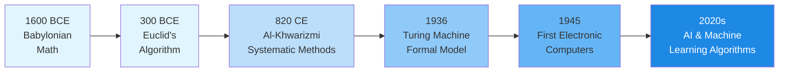
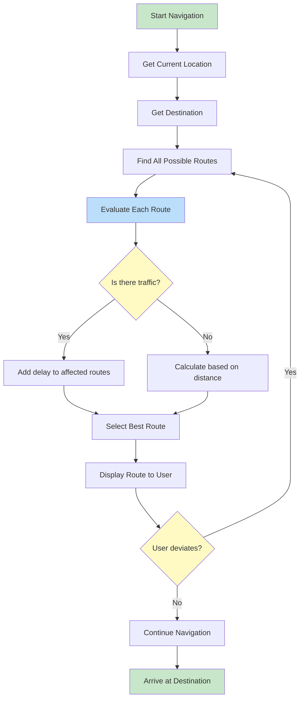
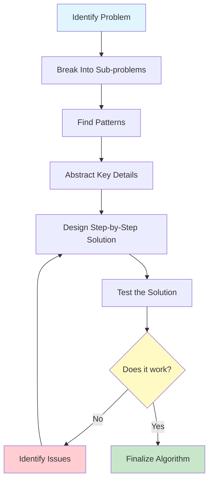

# What Are Algorithms?

Algorithms are everywhere. From the moment you wake up and check your phone to the routes your GPS calculates, algorithms silently shape our daily experiences. In this lesson, we will explore what algorithms truly are, where they came from, and how to think algorithmically.

## Defining Algorithms

An **algorithm** is a finite sequence of well-defined, step-by-step instructions designed to solve a specific problem or accomplish a particular task. Think of it as a recipe: it tells you exactly what to do, in what order, to achieve a desired outcome.

### Key Characteristics of Algorithms

| Characteristic | Description | Example |
|---|---|---|
| **Finite** | Must eventually terminate | A recipe has a limited number of steps |
| **Well-defined** | Each step is clear and unambiguous | "Add 2 cups of flour" not "Add some flour" |
| **Input** | Takes zero or more inputs | A sorting algorithm takes a list of numbers |
| **Output** | Produces at least one output | The sorted list of numbers |
| **Effective** | Each step can be performed in finite time | Basic arithmetic operations |

> [!NOTE]
> An algorithm is NOT a program. An algorithm is the conceptual idea or plan; a program is the implementation of that algorithm in a specific programming language.

## A Brief History of Algorithms

The concept of algorithms predates computers by thousands of years.

### Ancient Origins

The word "algorithm" comes from the name of the Persian mathematician **Muhammad ibn Musa al-Khwarizmi** (c. 780-850 CE). His work on solving equations introduced systematic methods that became known as "algorism" and eventually "algorithm."

However, algorithms existed long before this:

- **Babylonian mathematics** (c. 1600 BCE): Clay tablets show step-by-step procedures for solving quadratic equations
- **Euclid's algorithm** (c. 300 BCE): A method for finding the greatest common divisor of two numbers, still used today
- **Ancient Egyptian mathematics**: The Rhind Papyrus contains algorithms for multiplication and division

### The Modern Era



> [!TIP]
> Understanding the history of algorithms helps us appreciate that algorithmic thinking is a fundamental human skill, not just a modern computer science concept.

## Algorithms in Daily Life

You interact with algorithms constantly without realizing it. Let's examine some everyday examples.

### Morning Routine Algorithm

Consider your morning routine. It follows an algorithmic pattern:

```
ALGORITHM: Morning Routine
INPUT: You are asleep
OUTPUT: You are ready for the day

STEP 1: Wake up
STEP 2: IF alarm is ringing THEN
            Turn off alarm
        END IF
STEP 3: Get out of bed
STEP 4: Go to bathroom
STEP 5: Brush teeth
STEP 6: Take a shower
STEP 7: Get dressed
STEP 8: Eat breakfast
STEP 9: IF weather is cold THEN
            Wear a jacket
        ELSE
            Wear light clothing
        END IF
STEP 10: Leave for work/school
END ALGORITHM
```

### Navigation Algorithms

When you use GPS navigation, a sophisticated algorithm:

1. Identifies your current location
2. Determines your destination
3. Maps all possible routes
4. Evaluates each route based on distance, traffic, and time
5. Selects the optimal route
6. Recalculates if you deviate from the path



### Cooking as an Algorithm

Recipes are algorithms! They have:

- **Input**: Ingredients
- **Steps**: Clear, ordered instructions
- **Conditionals**: "If the dough is too sticky, add more flour"
- **Output**: A finished dish
- **Termination**: The recipe ends when the dish is complete

> [!WARNING]
> Not all step-by-step processes are good algorithms. A poor algorithm might have ambiguous steps, infinite loops, or missing conditions. Always ensure your algorithms are precise and complete.

## Algorithmic Thinking

**Algorithmic thinking** is a way of approaching problems that enables you to define clear, step-by-step solutions. It involves several key skills:

### Decomposition

Breaking a complex problem into smaller, manageable parts.

**Example**: Planning a party

```
PROBLEM: Plan a birthday party

DECOMPOSED INTO:
  - Create guest list
  - Choose a venue
  - Plan the menu
  - Order decorations
  - Arrange entertainment
  - Send invitations
  - Prepare the venue
  - Host the party
```

### Pattern Recognition

Identifying similarities or patterns within problems.

```
PATTERN: Making any hot beverage
  1. Boil water
  2. Prepare the base (tea bag, coffee grounds, cocoa powder)
  3. Combine water and base
  4. Add optional extras (milk, sugar, honey)
  5. Stir and serve
```

### Abstraction

Focusing on important information while ignoring irrelevant details.

When designing an algorithm to sort books in a library, you care about:
- Book titles or catalog numbers
- The order they should be in

You do NOT care about:
- The color of the book covers
- The weight of each book
- The author's biography

### Logical Reasoning

Developing step-by-step rules to solve the problem.



## Real-World Example: Finding a Book in a Library

Let's compare two approaches to finding a book:

### Approach 1: Random Search

```
ALGORITHM: Random Book Search
INPUT: Library with N books, target book title
OUTPUT: The target book (or not found)

STEP 1: Pick a random book from the shelf
STEP 2: Check if it is the target book
STEP 3: IF it is the target book THEN
            Return the book
        ELSE
            Go to STEP 1
        END IF
```

> [!WARNING]
> This algorithm could run forever if the book doesn't exist! It also has no way to track which books have already been checked.

### Approach 2: Systematic Search

```
ALGORITHM: Systematic Book Search
INPUT: Library with N books organized by category, target book title
OUTPUT: The target book (or confirmation it is not available)

STEP 1: Identify the category of the target book
STEP 2: Go to the correct category section
STEP 3: Start from the first book in that section
STEP 4: FOR each book in the section DO
            Check if the book matches the target
            IF it matches THEN
                Return the book and STOP
            END IF
        END FOR
STEP 5: Return "Book not found"
END ALGORITHM
```

| Aspect | Random Search | Systematic Search |
|---|---|---|
| **Guaranteed to find?** | No | Yes (if book exists) |
| **Guaranteed to finish?** | No | Yes |
| **Best case** | 1 check | 1 check |
| **Worst case** | Infinite | N checks |
| **Efficiency** | Very poor | Reasonable |

## Practice Exercises

### Exercise 1: Identify the Algorithm

Which of the following are algorithms? Explain why or why not.

1. A recipe for chocolate cake
2. The instructions on a shampoo bottle ("Lather, rinse, repeat")
3. A list of your favorite songs
4. Directions from your home to the nearest grocery store
5. The rules of a board game

### Exercise 2: Write a Daily Algorithm

Write an algorithm for one of the following tasks using pseudocode:

- Making a cup of tea or coffee
- Crossing a busy street safely
- Organizing your backpack for school

Include at least one conditional (IF/ELSE) statement.

### Exercise 3: Decomposition Practice

Break down the problem "Plan a week-long vacation" into at least 6 sub-problems. For each sub-problem, identify what the inputs and outputs would be.

### Exercise 4: Spot the Flaw

Find the problem(s) in this algorithm:

```
ALGORITHM: Cross the Street
STEP 1: Walk into the street
STEP 2: Cross to the other side
STEP 3: You have crossed the street
END ALGORITHM
```

Rewrite it to be safe and complete.

### Exercise 5: Pattern Recognition

Identify the common pattern in these tasks:

- Folding laundry
- Stacking dishes in a cupboard
- Organizing files in a filing cabinet

Write a generalized algorithm that captures this pattern.

## Summary

In this lesson, you learned:

- **What algorithms are**: Finite, well-defined sequences of steps to solve problems
- **The history**: From ancient Babylonian mathematics to modern AI
- **Daily life examples**: Morning routines, GPS navigation, cooking recipes
- **Algorithmic thinking**: Decomposition, pattern recognition, abstraction, and logical reasoning
- **Good vs. bad algorithms**: Systematic approaches beat random ones every time

> [!SUCCESS]
> You now understand that algorithms are not just for computers. They are fundamental tools for solving problems in an organized, efficient way. This mindset will serve you throughout this course and beyond.

## Key Terms

| Term | Definition |
|---|---|
| **Algorithm** | A finite sequence of well-defined instructions to solve a problem |
| **Algorithmic Thinking** | A problem-solving approach using step-by-step logical processes |
| **Decomposition** | Breaking complex problems into smaller parts |
| **Pattern Recognition** | Identifying similarities within and between problems |
| **Abstraction** | Focusing on essential details while ignoring irrelevant ones |
| **Pseudocode** | A plain-language description of algorithm steps |
