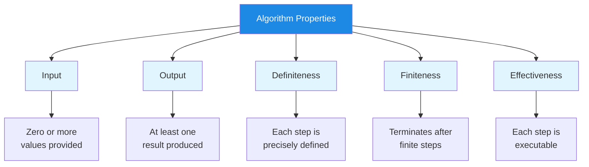
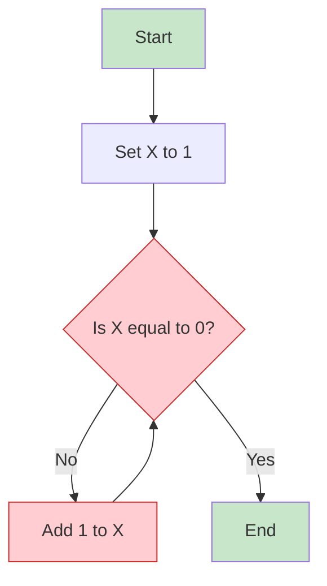
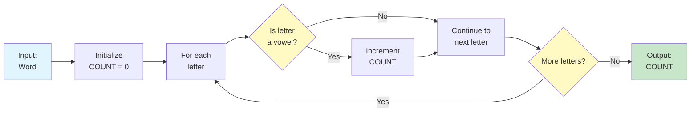

# Algorithm Properties

Not every set of instructions qualifies as an algorithm. For a procedure to be considered a true algorithm, it must satisfy five essential properties. Understanding these properties helps you design better algorithms and identify flawed ones.

## The Five Essential Properties

Every valid algorithm must have these five characteristics:

| Property | Question It Answers | Why It Matters |
|---|---|---|
| **Input** | What data does the algorithm start with? | Defines the scope and applicability |
| **Output** | What result does the algorithm produce? | Defines the purpose and success criteria |
| **Definiteness** | Is each step clear and unambiguous? | Ensures consistent execution |
| **Finiteness** | Will the algorithm eventually stop? | Prevents infinite loops |
| **Effectiveness** | Can each step actually be performed? | Ensures practical feasibility |



## Property 1: Input

An algorithm must have **zero or more inputs** -- values or data provided to the algorithm before it begins execution.

### Understanding Input

Inputs are the raw materials your algorithm works with. They can be:

- Numbers (e.g., a list of temperatures)
- Text (e.g., a paragraph to analyze)
- Objects (e.g., a deck of cards to shuffle)
- Nothing at all (some algorithms generate data without input)

### Examples

```
ALGORITHM: Add Two Numbers
INPUT: Two numbers, A and B
OUTPUT: The sum of A and B

STEP 1: Read number A
STEP 2: Read number B
STEP 3: Calculate SUM = A + B
STEP 4: Return SUM
END ALGORITHM
```

```
ALGORITHM: Generate First 10 Even Numbers
INPUT: None
OUTPUT: List of the first 10 even numbers

STEP 1: Create an empty list called EVEN_NUMBERS
STEP 2: Set COUNTER to 2
STEP 3: WHILE the list has fewer than 10 numbers DO
            Add COUNTER to EVEN_NUMBERS
            Set COUNTER to COUNTER + 2
        END WHILE
STEP 4: Return EVEN_NUMBERS
END ALGORITHM
```

> [!NOTE]
> An algorithm with zero inputs is still valid. For example, an algorithm that generates the Fibonacci sequence from scratch doesn't need external input.

## Property 2: Output

An algorithm must produce **at least one output** -- a result that has a specified relation to the inputs.

### Why Output Matters

The output is the entire reason the algorithm exists. Without output, the algorithm accomplishes nothing. The output should be:

- **Predictable**: Given the same input, the algorithm should produce the same output
- **Useful**: The output should solve the problem the algorithm was designed for
- **Well-defined**: You should know exactly what form the output will take

### Examples

```
ALGORITHM: Find Maximum
INPUT: A list of numbers
OUTPUT: The largest number in the list

STEP 1: Set MAX to the first number in the list
STEP 2: FOR each remaining number in the list DO
            IF the current number is greater than MAX THEN
                Set MAX to the current number
            END IF
        END FOR
STEP 3: Return MAX
END ALGORITHM
```

| Algorithm | Input | Output |
|---|---|---|
| Sort a list | [3, 1, 4, 1, 5] | [1, 1, 3, 4, 5] |
| Count words | "Hello world today" | 3 |
| Check prime | 7 | true |
| Reverse text | "hello" | "olleh" |

## Property 3: Definiteness

Each step of an algorithm must be **precisely defined** -- there should be no ambiguity about what to do at any point.

### The Problem with Ambiguity

Consider these two instructions:

| Ambiguous (Bad) | Definite (Good) |
|---|---|
| "Add some salt" | "Add 1 teaspoon of salt" |
| "Walk until you feel tired" | "Walk for 30 minutes" |
| "Pick a number" | "Pick the first number in the list" |
| "Make it look nice" | "Align all text to the left margin" |

### Example: Definite vs. Indefinite

```
BAD ALGORITHM: Make Coffee (Indefinite)
STEP 1: Get some coffee
STEP 2: Add water
STEP 3: Heat it up
STEP 4: Pour it
STEP 5: Add milk if you want
```

> [!WARNING]
> The bad algorithm above fails definiteness because: "some coffee" is vague, "water" has no quantity, "heat it up" has no temperature, and "if you want" makes the behavior inconsistent.

```
GOOD ALGORITHM: Make Coffee (Definite)
INPUT: Coffee grounds, water, milk (optional)
OUTPUT: A cup of coffee

STEP 1: Measure 2 tablespoons of coffee grounds
STEP 2: Place grounds in the filter
STEP 3: Measure 250 milliliters of water
STEP 4: Heat water to 95 degrees Celsius
STEP 5: Pour hot water over the grounds
STEP 6: Wait 4 minutes for brewing
STEP 7: IF milk is requested THEN
            Add 30 milliliters of milk
        END IF
STEP 8: Serve in a cup
END ALGORITHM
```

## Property 4: Finiteness

An algorithm must **terminate after a finite number of steps** -- it cannot run forever.

### Infinite Loops

The most common violation of finiteness is an infinite loop -- a loop that never ends because its termination condition is never met.



> [!WARNING]
> In the diagram above, X starts at 1 and keeps increasing. It will NEVER equal 0, so the algorithm runs forever! This violates the finiteness property.

### Ensuring Finiteness

To guarantee finiteness, every loop must have:

1. A **clear termination condition** that can be evaluated
2. A **guaranteed path** to reaching that condition
3. **Progress** toward the condition with each iteration

```
GOOD: Finite Loop
STEP 1: Set COUNTER to 10
STEP 2: WHILE COUNTER is greater than 0 DO
            Print COUNTER
            Set COUNTER to COUNTER - 1
        END WHILE
STEP 3: Print "Done!"
```

```
BAD: Potentially Infinite Loop
STEP 1: Set COUNTER to 10
STEP 2: WHILE COUNTER is not equal to 5 DO
            IF COUNTER is even THEN
                Set COUNTER to COUNTER - 2
            ELSE
                Set COUNTER to COUNTER + 2
            END IF
        END WHILE
```

> [!TIP]
> Trace through the bad example with a pencil and paper. Starting at 10: 10 -> 8 -> 6 -> 4 -> 2 -> 0 -> -2... It will never reach 5!

## Property 5: Effectiveness

Every step of an algorithm must be **basic enough to be carried out** -- in principle, by a person using only pencil and paper in a finite amount of time.

### What Makes a Step Effective?

An effective step is one that:

- Can be performed exactly as described
- Completes in a finite amount of time
- Does not require impossible or undefined operations

### Effective vs. Ineffective Steps

| Effective Step | Ineffective Step | Why It Fails |
|---|---|---|
| "Add 5 to X" | "Add all numbers in the universe" | Impossible to complete |
| "Divide X by 2" | "Divide X by 0" | Mathematically undefined |
| "Find the largest number in this list of 100" | "Find the largest prime number" | No largest prime exists |
| "Flip a coin" | "Predict tomorrow's lottery numbers" | Impossible to determine |

### Example

```
ALGORITHM: Calculate Average
INPUT: A list of N numbers
OUTPUT: The average (mean) of the numbers

STEP 1: Set SUM to 0
STEP 2: FOR each number in the list DO
            Add the number to SUM
        END FOR
STEP 3: IF N is greater than 0 THEN
            Set AVERAGE to SUM divided by N
            Return AVERAGE
        ELSE
            Return "Cannot calculate: empty list"
        END IF
END ALGORITHM
```

> [!NOTE]
> The check in Step 3 (IF N is greater than 0) ensures effectiveness by preventing division by zero, which would be an undefined operation.

## Complete Example: Checking All Properties

Let's analyze a complete algorithm against all five properties:

```
ALGORITHM: Count Vowels in a Word
INPUT: A word (string of letters)
OUTPUT: The number of vowels in the word

STEP 1: Set COUNT to 0
STEP 2: Set VOWELS to the list [a, e, i, o, u]
STEP 3: FOR each letter in the word DO
            FOR each vowel in VOWELS DO
                IF the letter equals the vowel THEN
                    Add 1 to COUNT
                END IF
            END FOR
        END FOR
STEP 4: Return COUNT
END ALGORITHM
```

### Property Analysis

| Property | Satisfied? | Explanation |
|---|---|---|
| **Input** | Yes | Takes a word as input |
| **Output** | Yes | Returns a number (count of vowels) |
| **Definiteness** | Yes | Every step is clear and unambiguous |
| **Finiteness** | Yes | The word has finite letters; loops will end |
| **Effectiveness** | Yes | Each step is a basic, doable operation |



## Practice Exercises

### Exercise 1: Property Identification

For each instruction below, identify which property (if any) it violates:

1. "Think of a number between 1 and 10, then keep adding 1 until you reach your favorite number"
2. "Calculate the result of dividing 10 by 0"
3. "Take a list of numbers and return the largest"
4. "Mix ingredients until it feels right"
5. "Start with 5, subtract 1 repeatedly until you reach 10"

### Exercise 2: Fix the Algorithm

The following algorithm violates one or more properties. Identify which ones and rewrite it correctly:

```
ALGORITHM: Find Average Temperature
INPUT: List of daily temperatures for a month
STEP 1: Add all temperatures together
STEP 2: Divide by the number of days
STEP 3: Return the result
```

### Exercise 3: Property Checklist

Write an algorithm for "Finding the longest word in a sentence." Then create a checklist verifying each of the five properties.

### Exercise 4: True or False

Determine whether each statement is true or false:

1. An algorithm must have at least one input.
2. An algorithm can have zero inputs.
3. An algorithm must produce exactly one output.
4. If an algorithm has a loop, it must always terminate.
5. "Guess the answer" is an effective step.

### Exercise 5: Design Challenge

Design an algorithm that satisfies all five properties for the following task:

**Task**: Given a list of student grades, determine if the class average is passing (60 or above).

Include:
- Clear input and output specification
- At least one conditional
- At least one loop
- All steps must be definite and effective

## Summary

In this lesson, you learned:

- **Input**: Algorithms need zero or more inputs to work with
- **Output**: Algorithms must produce at least one result
- **Definiteness**: Every step must be clear and unambiguous
- **Finiteness**: Algorithms must terminate after a finite number of steps
- **Effectiveness**: Each step must be practically executable

> [!SUCCESS]
> These five properties form the foundation for evaluating any algorithm. When you design your own algorithms, always check them against this checklist to ensure they are valid.

## Key Terms

| Term | Definition |
|---|---|
| **Input** | Data provided to an algorithm before execution begins |
| **Output** | The result produced by an algorithm after execution |
| **Definiteness** | Each step is precisely defined with no ambiguity |
| **Finiteness** | The algorithm terminates after a finite number of steps |
| **Effectiveness** | Each step can be carried out in finite time |
| **Infinite Loop** | A loop that never terminates, violating finiteness |
