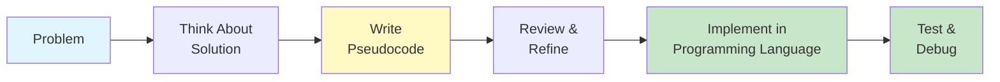
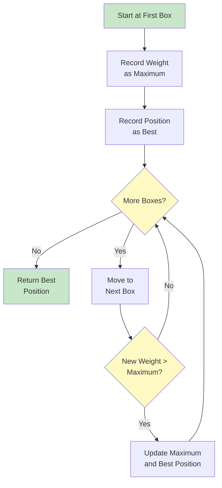
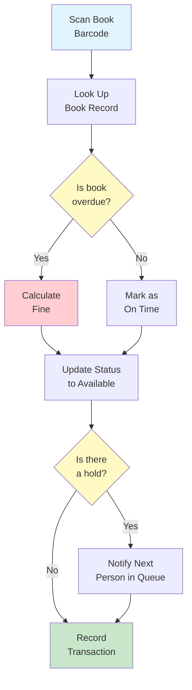

# Pseudocode & Natural Language

Before writing algorithms in any programming language, we express them in a human-readable format. Pseudocode and natural language descriptions allow us to focus on the logic of an algorithm without worrying about syntax rules of specific programming languages.

## What is Pseudocode?

**Pseudocode** is a plain-language description of the steps in an algorithm. It uses the structural conventions of programming languages but is intended for human reading rather than machine reading.

### Why Use Pseudocode?

| Benefit | Explanation |
|---|---|
| **Language-independent** | Anyone can read it regardless of programming background |
| **Focus on logic** | Concentrate on what the algorithm does, not how to write it in code |
| **Easy to modify** | Changes are simpler than rewriting actual code |
| **Communication tool** | Helps teams discuss algorithms before implementation |
| **Planning aid** | Forces you to think through the algorithm before coding |



> [!TIP]
> Think of pseudocode as the blueprint for a building. Architects don't start laying bricks -- they first create detailed plans. Pseudocode is your algorithm's blueprint.

## Pseudocode Conventions

While there is no single standard for pseudocode, following consistent conventions makes your algorithms easier to read and understand.

### Basic Structure

```
ALGORITHM: AlgorithmName
INPUT: Description of inputs
OUTPUT: Description of outputs

STEP 1: First instruction
STEP 2: Second instruction
...
STEP N: Final instruction

END ALGORITHM
```

### Variables and Assignment

Use clear, descriptive variable names. The assignment operation stores a value in a variable.

```
SET total TO 0
SET name TO "Maria"
SET counter TO counter + 1
SET result TO price multiplied by quantity
```

### Common Keywords

| Keyword | Purpose | Example |
|---|---|---|
| **SET** | Assign a value to a variable | `SET x TO 5` |
| **READ** | Get input from user | `READ age` |
| **PRINT** | Display output | `PRINT total` |
| **IF...THEN...ELSE** | Conditional execution | `IF x > 0 THEN PRINT "positive"` |
| **FOR...DO** | Repeat a known number of times | `FOR i FROM 1 TO 10 DO` |
| **WHILE...DO** | Repeat while condition is true | `WHILE x > 0 DO` |
| **REPEAT...UNTIL** | Repeat until condition is true | `REPEAT ... UNTIL x = 0` |

## Writing Algorithms in Natural Language

Natural language descriptions use everyday language to explain algorithm steps. This is the most accessible form of algorithm description.

### Example: Making a Sandwich

```
ALGORITHM: Make a Peanut Butter and Jelly Sandwich
INPUT: Bread slices, peanut butter, jelly, knife, plate
OUTPUT: A completed sandwich

STEP 1: Place two slices of bread on the plate
STEP 2: Using the knife, spread peanut butter on one slice
STEP 3: Using the knife (cleaned), spread jelly on the other slice
STEP 4: Press the two slices together with the spreads facing inward
STEP 5: IF the person wants it cut THEN
            Cut the sandwich diagonally in half
        END IF
STEP 6: Serve the sandwich
END ALGORITHM
```

### Example: Finding the Heaviest Box

```
ALGORITHM: Find the Heaviest Box
INPUT: A room with N boxes, each with a weight label
OUTPUT: The position of the heaviest box

STEP 1: Start at the first box
STEP 2: Remember its weight as the current maximum
STEP 3: Remember its position as the current best position
STEP 4: Move to the next box
STEP 5: Compare its weight to the current maximum
STEP 6: IF this box is heavier THEN
            Update the current maximum to this box's weight
            Update the best position to this box's position
        END IF
STEP 7: IF there are more boxes THEN
            Go to STEP 4
        END IF
STEP 8: Return the best position
END ALGORITHM
```



## Pseudocode Examples with Control Structures

### Sequential Execution

Steps execute one after another in order:

```
ALGORITHM: Calculate Rectangle Area
INPUT: Length and width of a rectangle
OUTPUT: The area of the rectangle

STEP 1: READ length
STEP 2: READ width
STEP 3: SET area TO length multiplied by width
STEP 4: PRINT area
END ALGORITHM
```

### Conditional Execution

Different paths based on conditions:

```
ALGORITHM: Grade Classification
INPUT: A student's numeric grade (0-100)
OUTPUT: The letter grade

STEP 1: READ score
STEP 2: IF score is greater than or equal to 90 THEN
            SET grade TO "A"
        ELSE IF score is greater than or equal to 80 THEN
            SET grade TO "B"
        ELSE IF score is greater than or equal to 70 THEN
            SET grade TO "C"
        ELSE IF score is greater than or equal to 60 THEN
            SET grade TO "D"
        ELSE
            SET grade TO "F"
        END IF
STEP 3: PRINT grade
END ALGORITHM
```

> [!NOTE]
> Notice how the conditions are checked in order. Once a condition is met, the remaining conditions are skipped. This is called "short-circuit evaluation."

### Loop Execution

Repeating actions multiple times:

```
ALGORITHM: Sum of Numbers from 1 to N
INPUT: A positive integer N
OUTPUT: The sum of all integers from 1 to N

STEP 1: READ N
STEP 2: SET total TO 0
STEP 3: FOR each number i FROM 1 TO N DO
            SET total TO total + i
        END FOR
STEP 4: PRINT total
END ALGORITHM
```

## Comparing Approaches: Natural Language vs. Structured Pseudocode

| Aspect | Natural Language | Structured Pseudocode |
|---|---|---|
| **Readability** | Very high for non-technical readers | High for anyone with basic logic skills |
| **Precision** | Can be ambiguous | More precise and structured |
| **Translation to code** | Requires interpretation | Easier to translate |
| **Best for** | Explaining concepts to beginners | Planning actual implementation |
| **Example** | "Keep going until you find it" | `WHILE not found DO` |

### Side-by-Side Comparison: Finding a Number

**Natural Language Version:**

```
ALGORITHM: Guess My Number (Natural Language)
I'm thinking of a number between 1 and 100. You need to find it.
Start by guessing the middle number. If my number is higher, 
guess the middle of the upper half. If my number is lower, 
guess the middle of the lower half. Keep doing this, narrowing 
down the range each time, until you guess correctly.
```

**Structured Pseudocode Version:**

```
ALGORITHM: Binary Search (Structured Pseudocode)
INPUT: A sorted list of numbers from 1 to 100, a target number
OUTPUT: The position of the target number

STEP 1: SET low TO 1
STEP 2: SET high TO 100
STEP 3: WHILE low is less than or equal to high DO
            SET guess TO (low + high) divided by 2, rounded down
            IF guess equals target THEN
                PRINT "Found at position " + guess
                STOP
            ELSE IF guess is less than target THEN
                SET low TO guess + 1
            ELSE
                SET high TO guess - 1
            END IF
        END WHILE
STEP 4: PRINT "Number not found"
END ALGORITHM
```

> [!TIP]
> The structured version is much more precise. Every variable is defined, every condition is explicit, and the termination condition is clear.

## Real-World Example: Library Book Return System

Let's design an algorithm for a library book return process:

```
ALGORITHM: Process Book Return
INPUT: Returned book with barcode, current date
OUTPUT: Updated book status, any fines calculated

STEP 1: SCAN the book barcode
STEP 2: LOOK UP the book record in the system
STEP 3: READ the due date from the book record
STEP 4: SET today TO the current date
STEP 5: IF today is after the due date THEN
            SET days_overdue TO today minus due date
            SET fine TO days_overdue multiplied by 0.50
            PRINT "Book is " + days_overdue + " days overdue"
            PRINT "Fine: $" + fine
        ELSE
            PRINT "Book returned on time"
            SET fine TO 0
        END IF
STEP 6: UPDATE book status to "available"
STEP 7: REMOVE any existing holds on the book
STEP 8: IF there is a hold on this book THEN
            NOTIFY the next person in the hold queue
            UPDATE book status to "reserved"
        END IF
STEP 9: RECORD the return transaction
END ALGORITHM
```



## Practice Exercises

### Exercise 1: Translate to Pseudocode

Write pseudocode for the following task:

**Task**: A teacher wants to calculate the average score of a class. She has a list of test scores. If the average is 70 or above, print "Class passed." Otherwise, print "Class needs improvement."

### Exercise 2: Identify the Problem

This pseudocode has issues. Find and fix them:

```
ALGORITHM: Count Down
STEP 1: SET x TO 10
STEP 2: WHILE x is not 0 DO
            PRINT x
        END WHILE
STEP 3: PRINT "Blast off!"
```

### Exercise 3: Write Your Own

Write pseudocode (using structured conventions) for:

**Task**: You are organizing books on a shelf. You have a list of book titles and their heights. Place the books on the shelf from shortest to tallest.

Include:
- Clear input and output
- At least one loop
- At least one conditional

### Exercise 4: Natural Language Description

Convert the following pseudocode into a natural language description that a non-technical person could understand:

```
ALGORITHM: Temperature Check
INPUT: Current temperature reading
STEP 1: IF temperature is below 0 THEN
            PRINT "Freezing"
        ELSE IF temperature is below 15 THEN
            PRINT "Cold"
        ELSE IF temperature is below 25 THEN
            PRINT "Warm"
        ELSE
            PRINT "Hot"
        END IF
END ALGORITHM
```

### Exercise 5: Algorithm Design Challenge

Design an algorithm in pseudocode for a real-world scenario:

**Scenario**: A parking lot has 50 spaces. Cars enter and leave throughout the day. Design an algorithm that:
- Tracks how many spaces are available
- When a car arrives, assigns a space if available
- When a car leaves, frees up that space
- Reports the number of available spaces when asked

## Summary

In this lesson, you learned:

- **What pseudocode is**: A human-readable way to describe algorithms
- **Why it matters**: It helps plan, communicate, and refine algorithms before coding
- **Conventions**: Standard keywords and structures for clarity
- **Natural language**: Describing algorithms in everyday language
- **Control structures**: Sequential, conditional, and loop execution patterns
- **Real-world application**: How pseudocode models actual business processes

> [!SUCCESS]
> Pseudocode is your bridge between thinking about a problem and implementing a solution. Master it, and you'll write better algorithms in any programming language.

## Key Terms

| Term | Definition |
|---|---|
| **Pseudocode** | A plain-language description of algorithm steps using programming-like structure |
| **Natural Language** | Everyday human language used to describe processes |
| **Variable** | A named storage location for a value |
| **Assignment** | The act of storing a value in a variable |
| **Conditional** | A structure that executes different code based on a condition |
| **Loop** | A structure that repeats a set of instructions |
| **Short-circuit Evaluation** | Stopping condition checks once a match is found |
