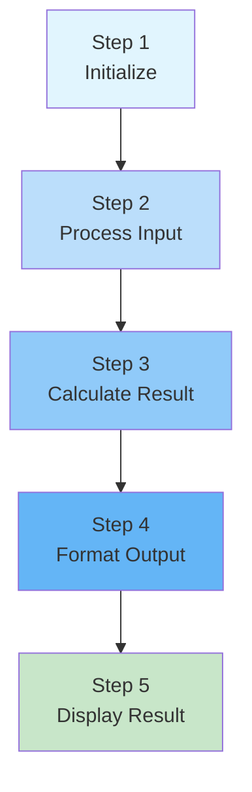
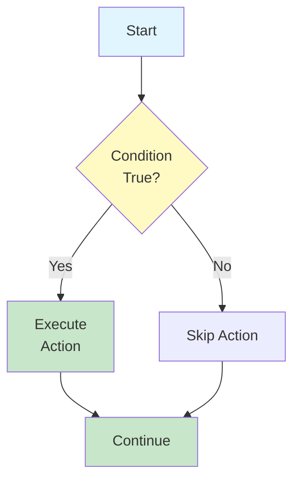
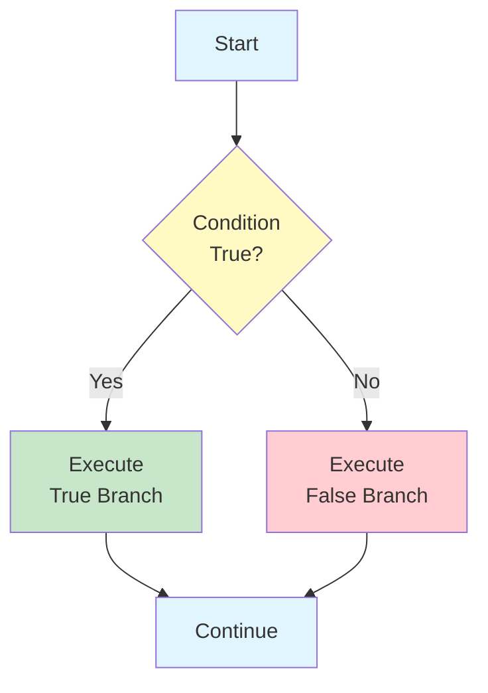
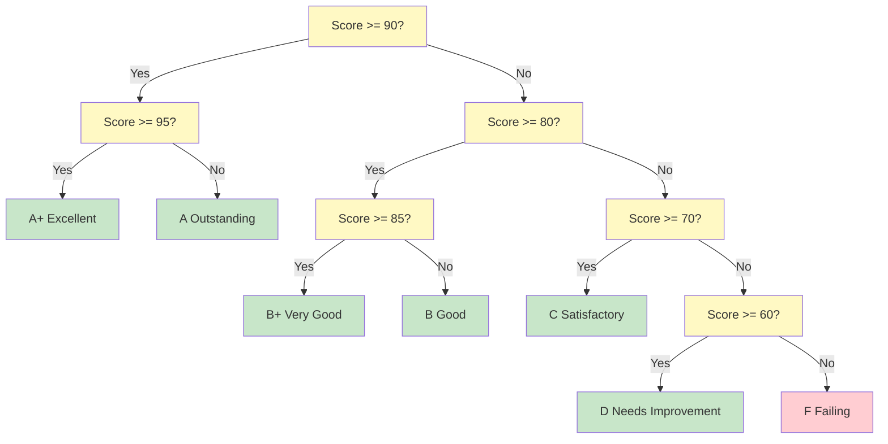
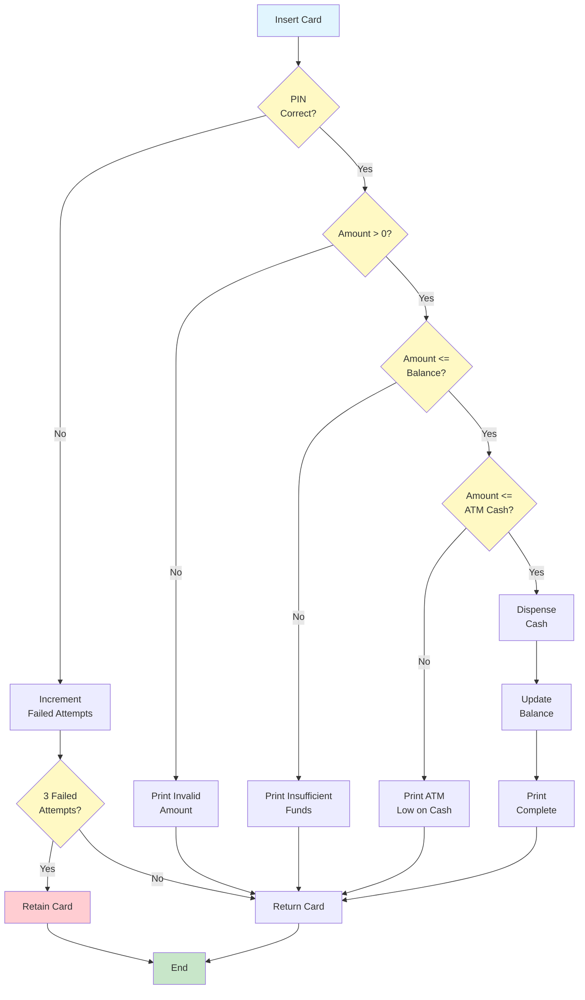
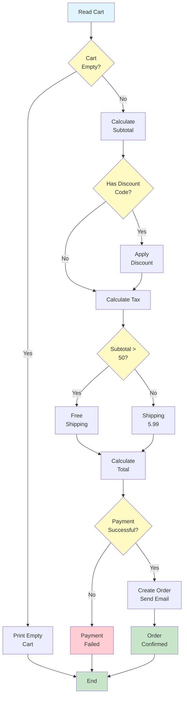

# Sequential & Conditional Logic

Algorithms are built on two fundamental concepts: doing things in order (sequential logic) and making choices (conditional logic). Understanding these concepts is essential for designing algorithms that can handle real-world complexity.

## Sequential Logic: Step-by-Step Execution

**Sequential logic** means executing instructions one after another in the order they appear. This is the simplest form of algorithmic control.

### How Sequential Execution Works

In sequential execution:
1. The algorithm starts at the first step
2. Each step is executed completely before moving to the next
3. The algorithm proceeds linearly from start to finish
4. No steps are skipped (unless a conditional says otherwise)



### Example: Converting Temperature

```
ALGORITHM: Convert Celsius to Fahrenheit
INPUT: Temperature in Celsius
OUTPUT: Temperature in Fahrenheit

STEP 1: READ celsius_temp
STEP 2: SET fahrenheit_temp TO (celsius_temp multiplied by 9/5) + 32
STEP 3: PRINT "The temperature is " + fahrenheit_temp + " degrees Fahrenheit"
END ALGORITHM
```

Each step depends on the previous one. You cannot calculate the Fahrenheit temperature (Step 2) before reading the Celsius temperature (Step 1).

### Real-World Sequential Example: ATM Withdrawal

```
ALGORITHM: ATM Cash Withdrawal
INPUT: Card, PIN, requested amount
OUTPUT: Cash dispensed or error message

STEP 1: INSERT card into ATM
STEP 2: ENTER PIN
STEP 3: VERIFY PIN matches card
STEP 4: SELECT "Withdraw Cash" option
STEP 5: ENTER requested amount
STEP 6: CHECK if account balance is sufficient
STEP 7: CHECK if ATM has enough cash
STEP 8: DISPENSE the requested amount
STEP 9: UPDATE account balance
STEP 10: PRINT receipt
STEP 11: RETURN card
END ALGORITHM
```

> [!NOTE]
> Notice that this algorithm is purely sequential. It does not handle what happens if the PIN is wrong or if the balance is insufficient. We need conditional logic for that -- which we'll cover next.

## Conditional Logic: Making Choices

**Conditional logic** allows an algorithm to make decisions based on conditions. Different paths are taken depending on whether certain conditions are true or false.

### The IF Statement

The most basic conditional structure:

```
IF condition is true THEN
    Execute these steps
END IF
```



### Example: Age Verification

```
ALGORITHM: Age Verification
INPUT: Person's age
OUTPUT: Access granted or denied

STEP 1: READ age
STEP 2: IF age is greater than or equal to 18 THEN
            PRINT "Access granted"
        END IF
STEP 3: IF age is less than 18 THEN
            PRINT "Access denied"
        END IF
END ALGORITHM
```

### The IF-ELSE Statement

A more efficient way to handle two mutually exclusive cases:

```
IF condition is true THEN
    Execute these steps (when true)
ELSE
    Execute these steps (when false)
END IF
```



### Improved Age Verification

```
ALGORITHM: Age Verification (Improved)
INPUT: Person's age
OUTPUT: Access decision

STEP 1: READ age
STEP 2: IF age is greater than or equal to 18 THEN
            PRINT "Access granted"
        ELSE
            PRINT "Access denied"
        END IF
END ALGORITHM
```

> [!TIP]
> The IF-ELSE version is better because it guarantees exactly one message is printed. The original version had two separate IF statements, which could theoretically both execute if there were a bug.

## Nested Conditionals: Decisions Within Decisions

Sometimes you need to make a decision inside another decision. This is called **nesting**.

### Example: Grading System with Distinctions

```
ALGORITHM: Detailed Grade Classification
INPUT: Student's score (0-100)
OUTPUT: Grade with distinction

STEP 1: READ score
STEP 2: IF score is greater than or equal to 90 THEN
            IF score is greater than or equal to 95 THEN
                PRINT "A+ (Excellent)"
            ELSE
                PRINT "A (Outstanding)"
            END IF
        ELSE IF score is greater than or equal to 80 THEN
            IF score is greater than or equal to 85 THEN
                PRINT "B+ (Very Good)"
            ELSE
                PRINT "B (Good)"
            END IF
        ELSE IF score is greater than or equal to 70 THEN
            PRINT "C (Satisfactory)"
        ELSE IF score is greater than or equal to 60 THEN
            PRINT "D (Needs Improvement)"
        ELSE
            PRINT "F (Failing)"
        END IF
END ALGORITHM
```

### Decision Trees

A **decision tree** is a visual representation of nested conditionals. Each node represents a decision, and each branch represents a possible outcome.



## Combining Sequential and Conditional Logic

Real algorithms combine both sequential and conditional logic. Let's build a more complete ATM algorithm:

```
ALGORITHM: Complete ATM Withdrawal
INPUT: Card, PIN, requested amount
OUTPUT: Cash or appropriate message

STEP 1: INSERT card
STEP 2: READ entered_pin
STEP 3: IF entered_pin matches card_pin THEN
            PRINT "PIN verified"
            SELECT "Withdraw Cash"
            READ amount
            
            IF amount is less than or equal to 0 THEN
                PRINT "Invalid amount"
            ELSE IF amount is less than or equal to account_balance THEN
                IF amount is less than or equal to atm_cash THEN
                    DISPENSE amount
                    SET account_balance TO account_balance - amount
                    PRINT "Transaction complete"
                    PRINT "New balance: " + account_balance
                ELSE
                    PRINT "ATM does not have enough cash"
                END IF
            ELSE
                PRINT "Insufficient funds"
                PRINT "Your balance: " + account_balance
            END IF
        ELSE
            PRINT "Incorrect PIN"
            INCREMENT failed_attempts
            IF failed_attempts equals 3 THEN
                RETAIN card
                PRINT "Card retained. Contact your bank."
            END IF
        END IF
STEP 4: RETURN card (if not retained)
END ALGORITHM
```



> [!WARNING]
> Notice how the algorithm handles multiple failure cases: wrong PIN, invalid amount, insufficient balance, and ATM running low on cash. Good algorithms anticipate and handle all possible scenarios.

## Comparison: Sequential vs. Conditional

| Aspect | Sequential Logic | Conditional Logic |
|---|---|---|
| **Execution** | Linear, one step after another | Branches based on conditions |
| **Flexibility** | Low -- always does the same thing | High -- adapts to different situations |
| **Complexity** | Simple to understand and trace | More complex, requires careful planning |
| **Use when** | Every situation is the same | Different situations need different responses |
| **Example** | Adding two numbers | Deciding if a number is positive or negative |

## Real-World Example: Online Shopping Checkout

Let's design an algorithm for an online shopping checkout process:

```
ALGORITHM: Online Shopping Checkout
INPUT: Cart items, user account, payment method
OUTPUT: Order confirmation or error

STEP 1: READ cart items
STEP 2: IF cart is empty THEN
            PRINT "Your cart is empty"
            STOP
        END IF
STEP 3: CALCULATE subtotal by adding all item prices
STEP 4: IF user has a discount code THEN
            APPLY discount to subtotal
        END IF
STEP 5: CALCULATE tax based on user location
STEP 6: CALCULATE shipping cost
        IF subtotal is greater than 50 THEN
            SET shipping TO 0 (free shipping)
        ELSE
            SET shipping TO 5.99
        END IF
STEP 7: CALCULATE total = subtotal + tax + shipping
STEP 8: PROCESS payment
        IF payment is successful THEN
            CREATE order with total
            SEND confirmation email
            UPDATE inventory
            PRINT "Order confirmed! Total: " + total
        ELSE
            PRINT "Payment failed. Please try again."
        END IF
END ALGORITHM
```



## Practice Exercises

### Exercise 1: Trace the Execution

Given the following algorithm, what is the output for each input?

```
ALGORITHM: Mystery
INPUT: A number x
STEP 1: IF x is greater than 0 THEN
            IF x is less than 10 THEN
                PRINT "Small positive"
            ELSE
                PRINT "Large positive"
            END IF
        ELSE IF x equals 0 THEN
            PRINT "Zero"
        ELSE
            PRINT "Negative"
        END IF
END ALGORITHM
```

What is printed for: x = 5, x = 15, x = 0, x = -3?

### Exercise 2: Design a Conditional Algorithm

Write an algorithm that determines the type of triangle based on three side lengths:

- **Equilateral**: All three sides are equal
- **Isosceles**: Exactly two sides are equal
- **Scalene**: No sides are equal

Include validation: if any side is zero or negative, print "Invalid triangle."

### Exercise 3: Decision Tree Drawing

Draw a decision tree (using Mermaid or on paper) for this scenario:

A restaurant recommendation algorithm that asks:
1. What cuisine? (Italian, Mexican, Asian)
2. What budget? (Low, Medium, High)
3. What atmosphere? (Casual, Formal)

Show how different combinations lead to different restaurant recommendations.

### Exercise 4: Fix the Logic

This algorithm has a logical error. Find and fix it:

```
ALGORITHM: Login System
INPUT: Username, password
STEP 1: IF username exists THEN
            PRINT "Welcome!"
        END IF
STEP 2: IF password is correct THEN
            GRANT access
        ELSE
            PRINT "Wrong password"
        END IF
END ALGORITHM
```

> [!WARNING]
> Hint: What happens if the username doesn't exist but the password check still runs?

### Exercise 5: Build a Complete Algorithm

Design an algorithm for a simple calculator that:
1. Reads two numbers and an operation (+, -, *, /)
2. Performs the operation
3. Handles division by zero
4. Prints the result

Use both sequential and conditional logic.

## Summary

In this lesson, you learned:

- **Sequential logic**: Executing steps in order, one after another
- **Conditional logic**: Making decisions using IF, ELSE, and nested conditions
- **Decision trees**: Visual representations of conditional logic
- **Combining both**: Real algorithms use sequential and conditional logic together
- **Error handling**: Good algorithms anticipate and handle all possible scenarios

> [!SUCCESS]
> Sequential and conditional logic form the backbone of all algorithms. Every complex algorithm you'll encounter is built from these two fundamental building blocks.

## Key Terms

| Term | Definition |
|---|---|
| **Sequential Logic** | Executing instructions in the order they appear |
| **Conditional Logic** | Making decisions based on whether conditions are true or false |
| **IF Statement** | Executes a block of code only if a condition is true |
| **IF-ELSE Statement** | Chooses between two blocks of code based on a condition |
| **Nested Conditional** | A conditional statement inside another conditional statement |
| **Decision Tree** | A visual diagram showing all possible decision paths |
| **Branch** | One possible path of execution in a conditional |
