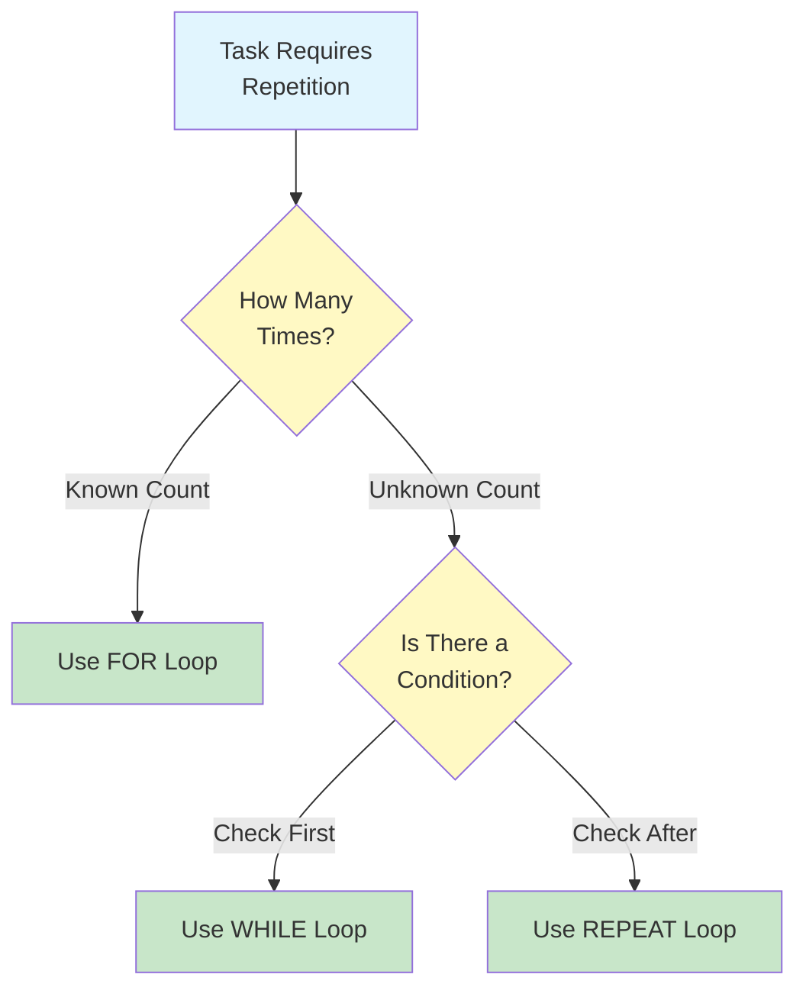
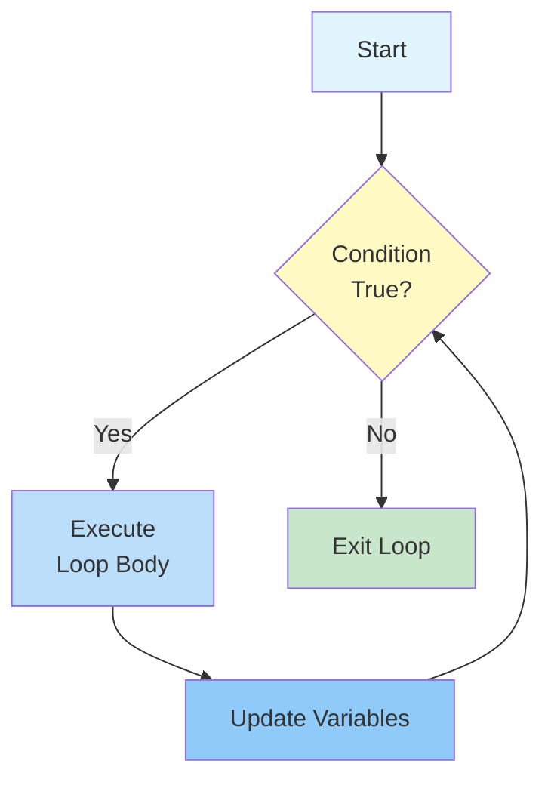
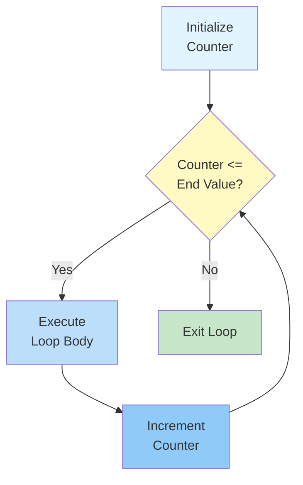
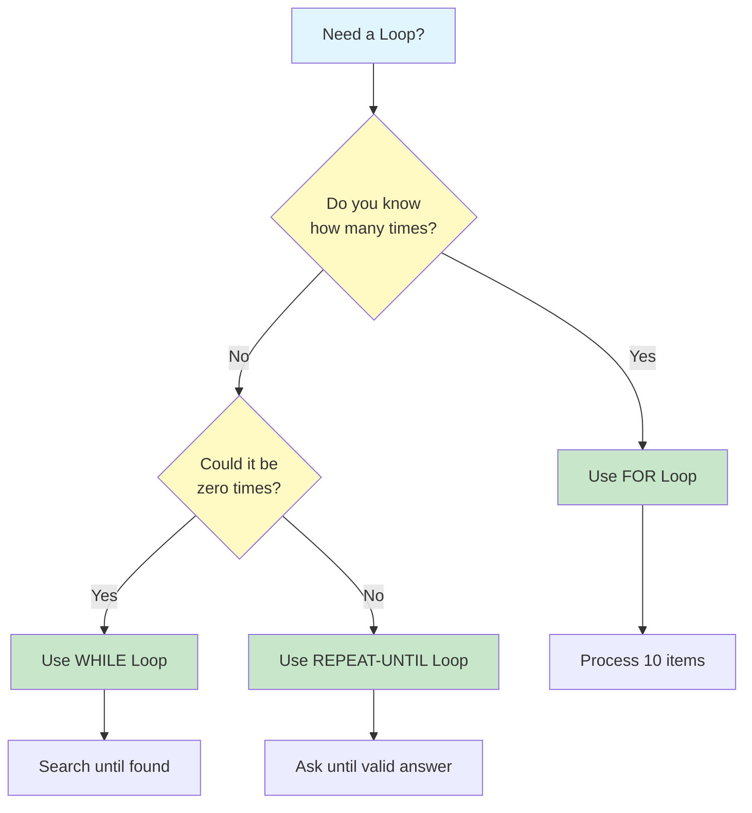
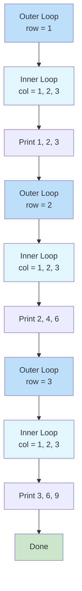
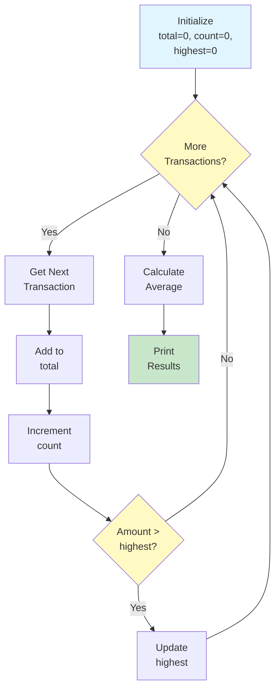

# Loops & Repetition

Many tasks require doing the same thing multiple times. Instead of writing the same steps over and over, algorithms use **loops** -- structures that repeat a set of instructions until a condition is met. Loops are one of the most powerful tools in algorithmic thinking.

## Why Loops Matter

Consider this task: print the numbers from 1 to 100.

**Without a loop** (tedious and error-prone):
```
PRINT 1
PRINT 2
PRINT 3
... (97 more lines)
PRINT 100
```

**With a loop** (elegant and maintainable):
```
SET counter TO 1
WHILE counter is less than or equal to 100 DO
    PRINT counter
    SET counter TO counter + 1
END WHILE
```

| Approach | Lines of Code | Easy to Change? | Error-Prone? |
|---|---|---|---|
| Without loop | 100 | No -- must edit each line | Yes -- easy to skip or duplicate |
| With loop | 4 | Yes -- change the limit | No -- logic is centralized |



## The WHILE Loop

A **WHILE loop** repeats a block of instructions as long as a condition remains true. The condition is checked **before** each iteration.

### Structure

```
WHILE condition is true DO
    Execute these steps
    (Make sure something changes to eventually end the loop)
END WHILE
```

### How It Works



### Example: Counting Down

```
ALGORITHM: Countdown
INPUT: Starting number
OUTPUT: Countdown sequence

STEP 1: READ start_number
STEP 2: SET current TO start_number
STEP 3: WHILE current is greater than 0 DO
            PRINT current
            SET current TO current - 1
        END WHILE
STEP 4: PRINT "Go!"
END ALGORITHM
```

**Trace with start_number = 3:**

| Iteration | current | Condition (current > 0) | Action |
|---|---|---|---|
| Before loop | 3 | -- | -- |
| 1 | 3 | true | Print 3, current becomes 2 |
| 2 | 2 | true | Print 2, current becomes 1 |
| 3 | 1 | true | Print 1, current becomes 0 |
| After loop | 0 | false | Exit loop, print "Go!" |

**Output:** 3, 2, 1, Go!

### Example: Finding a Number in a List

```
ALGORITHM: Linear Search
INPUT: A list of numbers, a target number to find
OUTPUT: Position of target, or "not found"

STEP 1: SET index TO 0
STEP 2: SET found TO false
STEP 3: WHILE index is less than length of list AND found is false DO
            IF list[index] equals target THEN
                SET found TO true
            ELSE
                SET index TO index + 1
            END IF
        END WHILE
STEP 4: IF found is true THEN
            PRINT "Found at position " + index
        ELSE
            PRINT "Not found"
        END IF
END ALGORITHM
```

> [!NOTE]
> Notice the compound condition in Step 3: `index < length AND found = false`. The loop stops if we reach the end of the list OR if we find the target. This prevents unnecessary searches.

## The FOR Loop

A **FOR loop** repeats a block of instructions a **known number of times**. It is ideal when you know exactly how many iterations you need.

### Structure

```
FOR variable FROM start_value TO end_value DO
    Execute these steps
END FOR
```

### How It Works



### Example: Multiplication Table

```
ALGORITHM: Multiplication Table
INPUT: A number
OUTPUT: Multiplication table for that number (1-10)

STEP 1: READ number
STEP 2: FOR multiplier FROM 1 TO 10 DO
            SET result TO number multiplied by multiplier
            PRINT number + " x " + multiplier + " = " + result
        END FOR
END ALGORITHM
```

**Output for number = 5:**
```
5 x 1 = 5
5 x 2 = 10
5 x 3 = 15
...
5 x 10 = 50
```

### Example: Summing a List

```
ALGORITHM: Sum of List
INPUT: A list of numbers
OUTPUT: The total sum

STEP 1: SET total TO 0
STEP 2: FOR each number in the list DO
            SET total TO total + number
        END FOR
STEP 3: PRINT total
END ALGORITHM
```

## Comparing WHILE and FOR Loops

| Aspect | WHILE Loop | FOR Loop |
|---|---|---|
| **When to use** | Unknown number of iterations | Known number of iterations |
| **Condition** | Checked before each iteration | Implicit (counter reaches end) |
| **Risk of infinite loop** | Higher (must ensure condition changes) | Lower (counter always advances) |
| **Flexibility** | More flexible | More structured |
| **Example** | "Keep searching until found" | "Process each item in the list" |

### When to Choose Which



## The REPEAT-UNTIL Loop

A **REPEAT-UNTIL loop** executes the body **at least once**, then checks the condition **after** each iteration. It repeats until the condition becomes true.

### Structure

```
REPEAT
    Execute these steps
UNTIL condition is true
```

### Key Difference from WHILE

| WHILE Loop | REPEAT-UNTIL Loop |
|---|---|
| Checks condition BEFORE executing | Checks condition AFTER executing |
| May execute zero times | Always executes at least once |
| Continues WHILE condition is true | Continues UNTIL condition is true |

### Example: Input Validation

```
ALGORITHM: Get Valid Age
INPUT: None (reads from user)
OUTPUT: A valid age (1-120)

STEP 1: REPEAT
            PRINT "Enter your age (1-120):"
            READ age
        UNTIL age is greater than or equal to 1 AND age is less than or equal to 120
STEP 2: PRINT "Valid age: " + age
END ALGORITHM
```

> [!TIP]
> REPEAT-UNTIL is perfect for input validation because you always need to ask at least once. A WHILE loop would require duplicating the input prompt before and inside the loop.

## Nested Loops: Loops Inside Loops

Loops can be placed inside other loops. This is called **nesting**. Each iteration of the outer loop triggers a complete run of the inner loop.

### Example: Multiplication Grid

```
ALGORITHM: Multiplication Grid
INPUT: Grid size N
OUTPUT: N x N multiplication grid

STEP 1: READ N
STEP 2: FOR row FROM 1 TO N DO
            FOR column FROM 1 TO N DO
                SET product TO row multiplied by column
                PRINT product with padding
            END FOR
            PRINT new line
        END FOR
END ALGORITHM
```

**Output for N = 3:**
```
1  2  3
2  4  6
3  6  9
```

### Visualizing Nested Loops



### How Many Times Does the Inner Loop Execute?

If the outer loop runs M times and the inner loop runs N times, the inner body executes **M x N** total times.

| Outer Loop | Inner Loop | Total Executions |
|---|---|---|
| 3 times | 3 times | 9 times |
| 10 times | 5 times | 50 times |
| 100 times | 100 times | 10,000 times |

> [!WARNING]
> Nested loops multiply the number of operations. A loop inside a loop inside a loop (triple nesting) with 100 iterations each would execute 1,000,000 times! Be careful with deeply nested loops.

## Loop Termination: Ensuring Loops End

Every loop must eventually terminate. Here are the key strategies:

### Strategy 1: Counter-Based Termination

```
SET counter TO 0
WHILE counter is less than 10 DO
    PRINT counter
    SET counter TO counter + 1
END WHILE
```

### Strategy 2: Sentinel Value

```
READ number
WHILE number is not equal to -1 DO
    PRINT "You entered: " + number
    READ number
END WHILE
PRINT "Goodbye!"
```

> [!NOTE]
> The value -1 is called a "sentinel" -- a special value that signals the end of input. The user must know to enter -1 to stop.

### Strategy 3: Flag-Based Termination

```
SET found TO false
SET index TO 0
WHILE found is false AND index is less than list_length DO
    IF list[index] equals target THEN
        SET found TO true
    ELSE
        SET index TO index + 1
    END IF
END WHILE
```

### Common Termination Mistakes

| Mistake | Problem | Fix |
|---|---|---|
| Forgetting to update the counter | Infinite loop | Add `counter = counter + 1` |
| Wrong comparison operator | Off-by-one error | Use `<=` instead of `<` (or vice versa) |
| Condition never becomes false | Infinite loop | Ensure the loop body changes the condition |
| Using `=` instead of `==` | Logic error | Use comparison, not assignment |

## Real-World Example: Processing Daily Sales

```
ALGORITHM: Process Daily Sales Report
INPUT: List of daily sales transactions
OUTPUT: Total sales, average sale, highest sale

STEP 1: SET total TO 0
STEP 2: SET count TO 0
STEP 3: SET highest TO 0
STEP 4: FOR each transaction in the sales list DO
            SET amount TO transaction amount
            SET total TO total + amount
            SET count TO count + 1
            IF amount is greater than highest THEN
                SET highest TO amount
            END IF
        END FOR
STEP 5: IF count is greater than 0 THEN
            SET average TO total divided by count
        ELSE
            SET average TO 0
        END IF
STEP 6: PRINT "Total Sales: " + total
STEP 7: PRINT "Number of Transactions: " + count
STEP 8: PRINT "Average Sale: " + average
STEP 9: PRINT "Highest Sale: " + highest
END ALGORITHM
```



## Practice Exercises

### Exercise 1: Trace the Loop

What is the output of this algorithm?

```
ALGORITHM: Mystery Loop
STEP 1: SET x TO 1
STEP 2: WHILE x is less than 20 DO
            SET x TO x multiplied by 2
            PRINT x
        END WHILE
END ALGORITHM
```

### Exercise 2: Write a FOR Loop

Write an algorithm using a FOR loop that:
- Reads a number N
- Prints all even numbers from 2 to N
- Counts how many even numbers were printed

### Exercise 3: Write a WHILE Loop

Write an algorithm using a WHILE loop that:
- Keeps asking the user for numbers
- Stops when the user enters 0
- Prints the sum of all entered numbers (excluding the 0)

### Exercise 4: Fix the Infinite Loop

This algorithm has an infinite loop. Fix it:

```
ALGORITHM: Count to 10
STEP 1: SET i TO 1
STEP 2: WHILE i is less than or equal to 10 DO
            PRINT i
        END WHILE
END ALGORITHM
```

### Exercise 5: Nested Loop Challenge

Write an algorithm that prints this pattern using nested loops:
```
*
**
***
****
*****
```

The algorithm should work for any size N (the example shows N = 5).

### Exercise 6: Real-World Design

Design an algorithm for a library that:
- Has a list of overdue books
- For each overdue book, calculates the fine (R$0.50 per day)
- Keeps a running total of all fines
- Prints a report with each book's fine and the total

## Summary

In this lesson, you learned:

- **WHILE loops**: Repeat while a condition is true (check before executing)
- **FOR loops**: Repeat a known number of times (structured iteration)
- **REPEAT-UNTIL loops**: Execute at least once, then check condition
- **Nested loops**: Loops inside loops for multi-dimensional tasks
- **Termination strategies**: Counters, sentinels, and flags
- **Common mistakes**: Infinite loops, off-by-one errors, and missing updates

> [!SUCCESS]
> Loops are the engine of algorithmic efficiency. They allow you to handle tasks of any size with a small amount of code. Master loops, and you can solve problems that would be impossible to write out step by step.

## Key Terms

| Term | Definition |
|---|---|
| **Loop** | A structure that repeats a set of instructions |
| **WHILE Loop** | Repeats while a condition is true (pre-check) |
| **FOR Loop** | Repeats a known number of times |
| **REPEAT-UNTIL Loop** | Executes at least once, repeats until condition is true (post-check) |
| **Iteration** | One complete execution of the loop body |
| **Nested Loop** | A loop placed inside another loop |
| **Sentinel Value** | A special value that signals the end of input |
| **Infinite Loop** | A loop that never terminates |
| **Off-by-one Error** | A common mistake where the loop runs one time too many or too few |
