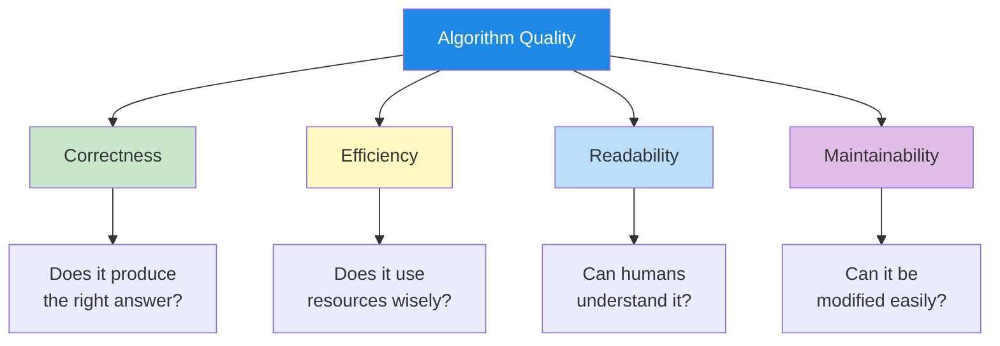
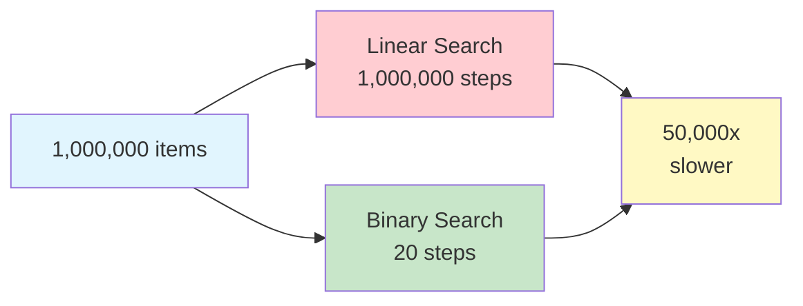
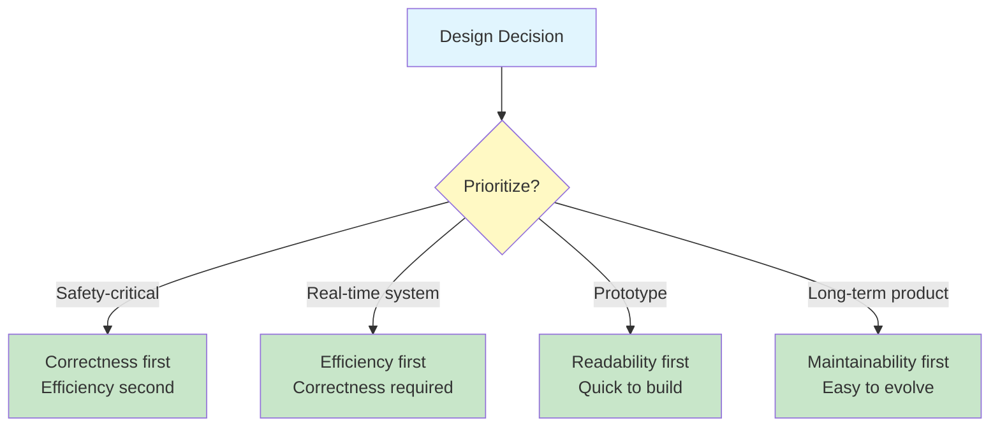

# Algorithm Quality Principles

Not all algorithms are created equal. Two algorithms can solve the same problem but differ dramatically in how well they do it. Understanding quality principles helps you design algorithms that are not just correct, but also efficient, readable, and maintainable.

## The Four Pillars of Algorithm Quality



| Pillar | Question | Why It Matters |
|---|---|---|
| **Correctness** | Does it produce the right answer for all valid inputs? | An incorrect algorithm is useless, no matter how fast |
| **Efficiency** | Does it use time and resources wisely? | Inefficient algorithms become unusable with large inputs |
| **Readability** | Can other people understand it? | Unreadable algorithms are hard to verify and trust |
| **Maintainability** | Can it be modified when requirements change? | Rigid algorithms become obsolete quickly |

## Correctness: Getting the Right Answer

**Correctness** means the algorithm produces the correct output for every valid input. This is the most fundamental quality -- without correctness, nothing else matters.

### How to Verify Correctness

1. **Trace with examples**: Run the algorithm by hand with known inputs and expected outputs
2. **Test edge cases**: Try unusual inputs (empty lists, single items, maximum values)
3. **Reason about it**: Prove to yourself that the algorithm must always work
4. **Compare with alternatives**: If two algorithms give different answers, at least one is wrong

### Example: Finding the Maximum

**Correct Version:**
```
ALGORITHM: Find Maximum (Correct)
INPUT: A non-empty list of numbers
OUTPUT: The largest number

STEP 1: SET max TO the first element of the list
STEP 2: FOR each remaining element in the list DO
            IF element is greater than max THEN
                SET max TO element
            END IF
        END FOR
STEP 3: RETURN max
END ALGORITHM
```

**Incorrect Version:**
```
ALGORITHM: Find Maximum (Incorrect)
INPUT: A list of numbers
OUTPUT: The largest number

STEP 1: SET max TO 0
STEP 2: FOR each element in the list DO
            IF element is greater than max THEN
                SET max TO element
            END IF
        END FOR
STEP 3: RETURN max
END ALGORITHM
```

> [!WARNING]
> The incorrect version fails when all numbers are negative! If the list is [-5, -3, -8], it would return 0 instead of -3. The correct version starts with the first element, ensuring the answer is always from the list.

### Testing with Edge Cases

| Test Case | Input | Expected Output | Correct Version | Incorrect Version |
|---|---|---|---|---|
| Normal | [3, 1, 4, 1, 5] | 5 | 5 | 5 |
| All negative | [-5, -3, -8] | -3 | -3 | 0 (WRONG) |
| Single element | [42] | 42 | 42 | 42 |
| All same | [7, 7, 7] | 7 | 7 | 7 |
| Empty list | [] | Error | Error | 0 (WRONG) |

## Efficiency: Using Resources Wisely

**Efficiency** measures how well an algorithm uses resources, primarily **time** (how many steps) and **space** (how much memory).

### Time Efficiency: Counting Steps

Consider two algorithms for finding a name in a phone book:

**Algorithm A: Linear Search**
```
ALGORITHM: Linear Search
INPUT: A list of names, a target name
OUTPUT: Position of target or "not found"

STEP 1: FOR each name in the list DO
            IF name equals target THEN
                RETURN position
            END IF
        END FOR
STEP 2: RETURN "not found"
END ALGORITHM
```

**Algorithm B: Binary Search** (requires sorted list)
```
ALGORITHM: Binary Search
INPUT: A sorted list of names, a target name
OUTPUT: Position of target or "not found"

STEP 1: SET low TO 0
STEP 2: SET high TO length of list - 1
STEP 3: WHILE low is less than or equal to high DO
            SET middle TO (low + high) divided by 2
            IF list[middle] equals target THEN
                RETURN middle
            ELSE IF list[middle] is less than target THEN
                SET low TO middle + 1
            ELSE
                SET high TO middle - 1
            END IF
        END WHILE
STEP 4: RETURN "not found"
END ALGORITHM
```

### Comparing Efficiency

| List Size | Linear Search (worst case) | Binary Search (worst case) |
|---|---|---|
| 10 items | 10 checks | 4 checks |
| 100 items | 100 checks | 7 checks |
| 1,000 items | 1,000 checks | 10 checks |
| 1,000,000 items | 1,000,000 checks | 20 checks |



> [!TIP]
> Binary search is dramatically faster for large lists because it eliminates half of the remaining options with each step. This is the power of efficient algorithm design.

### Space Efficiency: Memory Usage

Some algorithms need extra memory to work:

```
ALGORITHM: Reverse List (Uses Extra Space)
INPUT: A list of items
OUTPUT: A new list with items in reverse order

STEP 1: CREATE an empty list called reversed
STEP 2: FOR each item in the original list DO
            INSERT item at the beginning of reversed
        END FOR
STEP 3: RETURN reversed
END ALGORITHM
```

```
ALGORITHM: Reverse List (In Place)
INPUT: A list of items (modified directly)
OUTPUT: The same list, reversed

STEP 1: SET left TO 0
STEP 2: SET right TO length of list - 1
STEP 3: WHILE left is less than right DO
            SWAP the items at positions left and right
            SET left TO left + 1
            SET right TO right - 1
        END WHILE
STEP 4: RETURN the list
END ALGORITHM
```

| Approach | Extra Memory Needed | Modifies Original? |
|---|---|---|
| Extra space | Yes (a full copy) | No |
| In place | No (just two variables) | Yes |

## Readability: Making Algorithms Understandable

**Readability** measures how easily a human can understand an algorithm. A readable algorithm is easier to verify, debug, and teach to others.

### Principles of Readable Algorithms

| Principle | Bad Example | Good Example |
|---|---|---|
| **Descriptive names** | `SET x TO 0` | `SET total_score TO 0` |
| **Clear structure** | No indentation, run-on steps | Proper indentation, logical grouping |
| **Comments** | No explanation of why | Brief comments for complex logic |
| **Simple steps** | `SET result TO (a*b)+(c/d)-e*f` | Break into smaller, named steps |
| **Consistent style** | Mixed conventions | Uniform throughout |

### Example: Readable vs. Unreadable

**Unreadable:**
```
ALGORITHM: Calc
STEP 1: SET a TO 0
STEP 2: SET b TO 1
STEP 3: WHILE b < 100 DO
STEP 4: SET c TO a
STEP 5: SET a TO b
STEP 6: SET b TO c + b
STEP 7: PRINT a
STEP 8: END WHILE
```

**Readable:**
```
ALGORITHM: Fibonacci Sequence
INPUT: None
OUTPUT: Fibonacci numbers less than 100

STEP 1: SET previous TO 0
STEP 2: SET current TO 1
STEP 3: WHILE current is less than 100 DO
            PRINT current
            SET next_value TO previous + current
            SET previous TO current
            SET current TO next_value
        END WHILE
END ALGORITHM
```

> [!NOTE]
> Both algorithms produce the same output, but the readable version tells you what it does (Fibonacci sequence), uses meaningful variable names, and has clear structure.

## Maintainability: Adapting to Change

**Maintainability** measures how easily an algorithm can be modified when requirements change. A maintainable algorithm is modular, well-organized, and flexible.

### Designing for Maintainability

| Practice | Description | Benefit |
|---|---|---|
| **Modularity** | Break into smaller sub-algorithms | Easier to test and modify individual parts |
| **Parameterization** | Use variables instead of hard-coded values | Easy to change behavior without rewriting |
| **Documentation** | Explain the purpose and assumptions | Future maintainers understand the intent |
| **Separation of concerns** | Each part does one thing | Changes to one part don't break others |

### Example: Hard-coded vs. Parameterized

**Hard-coded (Poor Maintainability):**
```
ALGORITHM: Student Grade Check
INPUT: A student's score
OUTPUT: Pass or fail

STEP 1: IF score is greater than or equal to 60 THEN
            RETURN "Pass"
        ELSE
            RETURN "Fail"
        END IF
END ALGORITHM
```

> [!WARNING]
> What if the passing score changes to 70? You'd need to find and update every place where 60 appears. In a large system, this could be dozens of locations.

**Parameterized (Good Maintainability):**
```
ALGORITHM: Student Grade Check
INPUT: A student's score, passing_threshold
OUTPUT: Pass or fail

STEP 1: IF score is greater than or equal to passing_threshold THEN
            RETURN "Pass"
        ELSE
            RETURN "Fail"
        END IF
END ALGORITHM
```

> [!TIP]
> Now the passing score is a parameter. Change it once when calling the algorithm, and everything works. This is much easier to maintain.

## Balancing the Four Pillars

In practice, you sometimes need to trade off one quality for another:



| Scenario | Priority Order | Reason |
|---|---|---|
| Medical device software | Correctness > Efficiency > Readability > Maintainability | Lives depend on correct results |
| Video game rendering | Efficiency > Correctness > Readability > Maintainability | Must run at 60 frames per second |
| Student project | Readability > Correctness > Maintainability > Efficiency | Learning and grading matter most |
| Enterprise application | Maintainability > Readability > Correctness > Efficiency | Will be modified for years |

## Real-World Example: Evaluating a Sorting Algorithm

Let's evaluate a sorting algorithm against all four pillars:

```
ALGORITHM: Selection Sort
INPUT: A list of numbers
OUTPUT: The same list, sorted in ascending order

STEP 1: FOR each position i FROM 0 TO length - 2 DO
            SET min_index TO i
            FOR each position j FROM i + 1 TO length - 1 DO
                IF list[j] is less than list[min_index] THEN
                    SET min_index TO j
                END IF
            END FOR
            SWAP list[i] and list[min_index]
        END FOR
STEP 2: RETURN the sorted list
END ALGORITHM
```

### Quality Evaluation

| Pillar | Rating | Explanation |
|---|---|---|
| **Correctness** | Excellent | Always produces a correctly sorted list |
| **Efficiency** | Poor | Takes N x N steps for a list of N items |
| **Readability** | Good | Clear structure, easy to understand the approach |
| **Maintainability** | Good | Easy to modify (e.g., sort in descending order) |

```mermaid
flowchart TD
    A[Selection Sort\nQuality Assessment] --> B[Correctness:\nAlways correct]
    A --> C[Efficiency:\nO(n squared)\nSlow for large lists]
    A --> D[Readability:\nSimple concept\neasy to follow]
    A --> E[Maintainability:\nEasy to modify\nfor different orders]
    
    style A fill:#1e88e5,color:#fff
    style B fill:#c8e6c9
    style C fill:#ffcdd2
    style D fill:#c8e6c9
    style E fill:#c8e6c9
```

## Practice Exercises

### Exercise 1: Find the Bug

This algorithm is supposed to calculate the average of a list of numbers. Find the correctness bug:

```
ALGORITHM: Calculate Average
INPUT: A list of numbers
OUTPUT: The average

STEP 1: SET sum TO 0
STEP 2: FOR each number in the list DO
            SET sum TO sum + number
        END FOR
STEP 3: RETURN sum divided by 10
END ALGORITHM
```

### Exercise 2: Improve Readability

Rewrite this algorithm to be more readable:

```
ALGORITHM: X
STEP 1: SET a TO 0
STEP 2: SET b TO 0
STEP 3: FOR i FROM 0 TO 9 DO
STEP 4: IF list[i] > 50 THEN
STEP 5: SET a TO a + 1
STEP 6: ELSE
STEP 7: SET b TO b + 1
STEP 8: END IF
STEP 9: END FOR
STEP 10: PRINT a, b
```

### Exercise 3: Efficiency Comparison

You need to find a specific word in a dictionary. Compare two approaches:

- **Approach A**: Start at page 1 and check every word until you find it
- **Approach B**: Open to the middle, check if your word comes before or after, then repeat with the appropriate half

Which is more efficient? How many steps would each take for a 1,000-page dictionary?

### Exercise 4: Design for Maintainability

Rewrite this algorithm to be more maintainable:

```
ALGORITHM: Calculate Shipping Cost
INPUT: Package weight, destination country
STEP 1: IF weight is less than 1 AND country is "US" THEN
            RETURN 5.99
        END IF
STEP 2: IF weight is less than 1 AND country is "CA" THEN
            RETURN 8.99
        END IF
STEP 3: IF weight is greater than or equal to 1 AND weight is less than 5 AND country is "US" THEN
            RETURN 12.99
        END IF
... (continues with many more hard-coded combinations)
```

### Exercise 5: Quality Assessment

Evaluate the following algorithm for all four quality pillars. Give each pillar a rating (Excellent, Good, Fair, Poor) and explain:

```
ALGORITHM: Find Duplicates
INPUT: A list of numbers
OUTPUT: A list of numbers that appear more than once

STEP 1: CREATE empty list called duplicates
STEP 2: FOR each item in the list DO
            SET count TO 0
            FOR each other_item in the list DO
                IF item equals other_item THEN
                    SET count TO count + 1
                END IF
            END FOR
            IF count is greater than 1 AND item is not in duplicates THEN
                ADD item to duplicates
            END IF
        END FOR
STEP 3: RETURN duplicates
END ALGORITHM
```

## Summary

In this lesson, you learned:

- **Correctness**: The algorithm must produce the right answer for all valid inputs
- **Efficiency**: The algorithm should use time and resources wisely
- **Readability**: The algorithm should be easy for humans to understand
- **Maintainability**: The algorithm should be easy to modify when requirements change
- **Trade-offs**: Different scenarios prioritize different qualities

> [!SUCCESS]
> Quality algorithm design is about balance. The best algorithms are correct first, then optimized for the qualities that matter most in their specific context.

## Key Terms

| Term | Definition |
|---|---|
| **Correctness** | Producing the right output for every valid input |
| **Efficiency** | Using time and memory resources wisely |
| **Readability** | How easily humans can understand the algorithm |
| **Maintainability** | How easily the algorithm can be modified |
| **Edge Case** | An unusual input that tests the boundaries of the algorithm |
| **Linear Search** | Checking each item one by one (O(n) time) |
| **Binary Search** | Repeatedly halving the search space (O(log n) time) |
| **Parameterization** | Using variables instead of hard-coded values |
| **Modularity** | Breaking an algorithm into smaller, independent parts |
