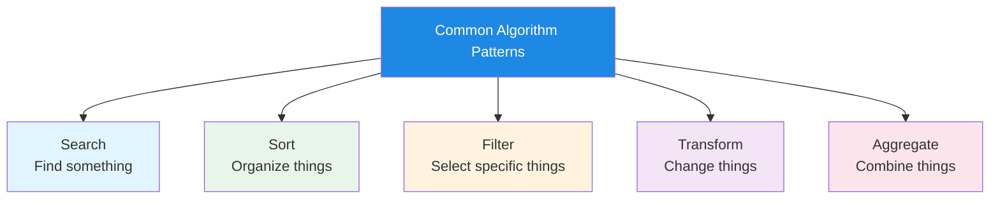
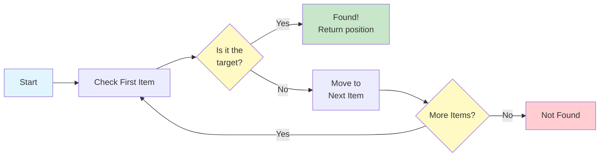
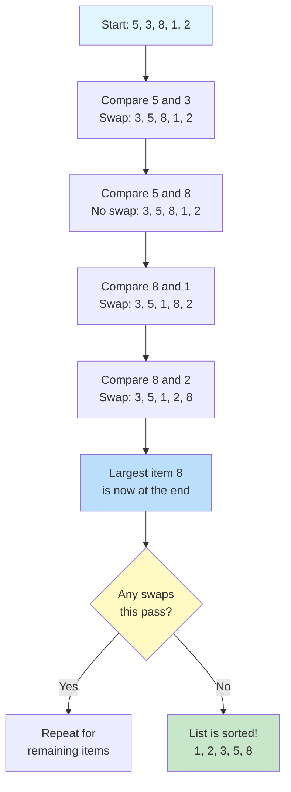
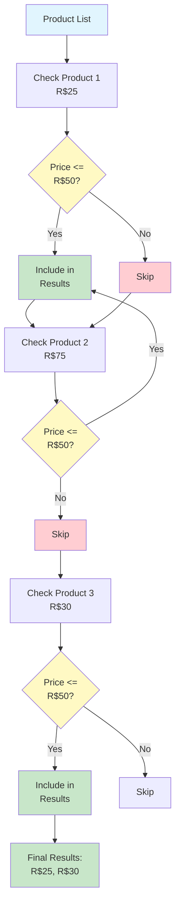
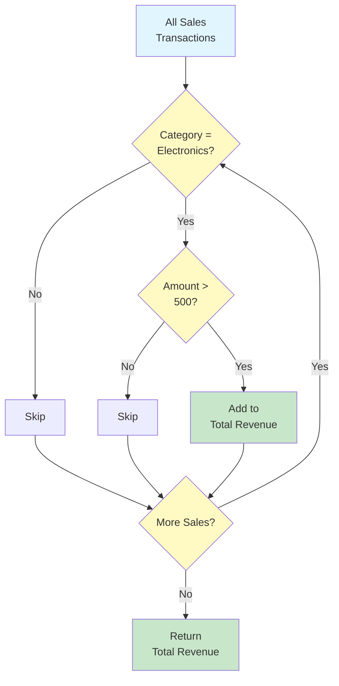
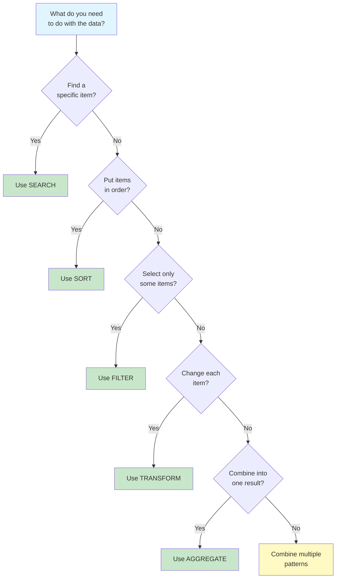

# Common Algorithm Patterns

Many problems share similar structures. By recognizing these patterns, you can apply proven algorithmic solutions instead of reinventing the wheel. This lesson covers the five most common algorithm patterns you'll encounter.

## The Five Common Patterns



| Pattern | What It Does | Real-World Example |
|---|---|---|
| **Search** | Finds a specific item in a collection | Looking up a contact in your phone |
| **Sort** | Arranges items in a specific order | Organizing books alphabetically |
| **Filter** | Selects items that meet a condition | Showing only unread emails |
| **Transform** | Changes each item in some way | Converting temperatures from C to F |
| **Aggregate** | Combines multiple items into a result | Calculating the total of a shopping cart |

## Pattern 1: Search

Search algorithms find a specific item (or determine it doesn't exist) within a collection of data.

### Linear Search

The simplest search -- check every item until you find what you're looking for.

```
ALGORITHM: Linear Search
INPUT: A collection of items, a target item to find
OUTPUT: The position of the target, or "not found"

STEP 1: SET index TO 0
STEP 2: WHILE index is less than the size of the collection DO
            IF collection[index] equals target THEN
                RETURN index
            END IF
            SET index TO index + 1
        END WHILE
STEP 3: RETURN "not found"
END ALGORITHM
```



### When to Use Linear Search

| Situation | Suitable? | Why |
|---|---|---|
| Small collection (under 50 items) | Yes | Fast enough, simple to implement |
| Unsorted data | Yes | Only option without sorting first |
| One-time search | Yes | No benefit from pre-sorting |
| Large collection, many searches | No | Binary search would be much faster |

### Binary Search

For sorted collections, binary search is dramatically faster. It works by repeatedly dividing the search space in half.

```
ALGORITHM: Binary Search
INPUT: A sorted collection, a target item
OUTPUT: The position of the target, or "not found"

STEP 1: SET low TO 0
STEP 2: SET high TO size of collection - 1
STEP 3: WHILE low is less than or equal to high DO
            SET middle TO (low + high) divided by 2
            IF collection[middle] equals target THEN
                RETURN middle
            ELSE IF collection[middle] is less than target THEN
                SET low TO middle + 1
            ELSE
                SET high TO middle - 1
            END IF
        END WHILE
STEP 4: RETURN "not found"
END ALGORITHM
```

**Example trace: Finding 7 in [1, 3, 5, 7, 9, 11, 13]**

| Step | low | high | middle | collection[middle] | Action |
|---|---|---|---|---|---|
| 1 | 0 | 6 | 3 | 7 | Found! Return 3 |

**Example trace: Finding 4 in [1, 3, 5, 7, 9, 11, 13]**

| Step | low | high | middle | collection[middle] | Action |
|---|---|---|---|---|---|
| 1 | 0 | 6 | 3 | 7 | 4 < 7, search left half |
| 2 | 0 | 2 | 1 | 3 | 4 > 3, search right half |
| 3 | 2 | 2 | 2 | 5 | 4 < 5, search left half |
| 4 | 2 | 1 | -- | -- | low > high, not found |

## Pattern 2: Sort

Sorting algorithms arrange items in a specific order (ascending, descending, alphabetical, etc.).

### Bubble Sort

Bubble sort repeatedly compares adjacent items and swaps them if they're in the wrong order.

```
ALGORITHM: Bubble Sort
INPUT: A list of numbers
OUTPUT: The same list, sorted in ascending order

STEP 1: SET n TO length of list
STEP 2: REPEAT
            SET swapped TO false
            FOR i FROM 0 TO n - 2 DO
                IF list[i] is greater than list[i + 1] THEN
                    SWAP list[i] and list[i + 1]
                    SET swapped TO true
                END IF
            END FOR
            SET n TO n - 1
        UNTIL swapped is false
END ALGORITHM
```



### How Bubble Sort Works (Visual Trace)

Starting list: [5, 3, 8, 1, 2]

**Pass 1:**
- Compare 5 and 3: swap -> [3, 5, 8, 1, 2]
- Compare 5 and 8: no swap -> [3, 5, 8, 1, 2]
- Compare 8 and 1: swap -> [3, 5, 1, 8, 2]
- Compare 8 and 2: swap -> [3, 5, 1, 2, **8**]
- 8 "bubbles" to the end

**Pass 2:**
- Compare 3 and 5: no swap -> [3, 5, 1, 2, 8]
- Compare 5 and 1: swap -> [3, 1, 5, 2, 8]
- Compare 5 and 2: swap -> [3, 1, 2, **5**, 8]
- 5 is now in position

**Pass 3:**
- Compare 3 and 1: swap -> [1, 3, 2, 5, 8]
- Compare 3 and 2: swap -> [1, 2, **3**, 5, 8]
- 3 is now in position

**Pass 4:**
- Compare 1 and 2: no swap -> [**1**, **2**, 3, 5, 8]
- No swaps needed -- list is sorted!

## Pattern 3: Filter

Filter algorithms select only the items that meet a specific condition, creating a smaller collection.

```
ALGORITHM: Filter
INPUT: A collection of items, a condition
OUTPUT: A new collection containing only items that meet the condition

STEP 1: CREATE an empty collection called result
STEP 2: FOR each item in the original collection DO
            IF item meets the condition THEN
                ADD item to result
            END IF
        END FOR
STEP 3: RETURN result
END ALGORITHM
```

### Real-World Example: Filtering Products

```
ALGORITHM: Filter Products by Price
INPUT: A list of products with prices, maximum price
OUTPUT: List of products at or below the maximum price

STEP 1: CREATE an empty list called affordable_products
STEP 2: FOR each product in the product list DO
            IF product price is less than or equal to maximum price THEN
                ADD product to affordable_products
            END IF
        END FOR
STEP 3: RETURN affordable_products
END ALGORITHM
```



### Common Filter Conditions

| Filter Type | Condition | Example |
|---|---|---|
| **Range** | Value is between two bounds | Age between 18 and 65 |
| **Equality** | Value matches exactly | Status equals "active" |
| **Threshold** | Value is above/below a point | Price under R$100 |
| **Pattern** | Value matches a pattern | Name starts with "A" |
| **Membership** | Value is in a set | Country is in [BR, US, CA] |

## Pattern 4: Transform

Transform algorithms apply a change to every item in a collection, producing a new collection with modified items.

```
ALGORITHM: Transform (Map)
INPUT: A collection of items, a transformation rule
OUTPUT: A new collection with transformed items

STEP 1: CREATE an empty collection called result
STEP 2: FOR each item in the original collection DO
            SET transformed_item TO apply transformation to item
            ADD transformed_item to result
        END FOR
STEP 3: RETURN result
END ALGORITHM
```

### Real-World Examples

**Example 1: Converting Temperatures**
```
ALGORITHM: Convert All Temperatures
INPUT: A list of temperatures in Celsius
OUTPUT: A list of temperatures in Fahrenheit

STEP 1: CREATE an empty list called fahrenheit_temps
STEP 2: FOR each temp_celsius in the input list DO
            SET temp_fahrenheit TO (temp_celsius * 9/5) + 32
            ADD temp_fahrenheit to fahrenheit_temps
        END FOR
STEP 3: RETURN fahrenheit_temps
END ALGORITHM
```

**Example 2: Formatting Names**
```
ALGORITHM: Format Full Names
INPUT: A list of people with first_name and last_name
OUTPUT: A list of full names in "Last, First" format

STEP 1: CREATE an empty list called formatted_names
STEP 2: FOR each person in the input list DO
            SET full_name TO person.last_name + ", " + person.first_name
            ADD full_name to formatted_names
        END FOR
STEP 3: RETURN formatted_names
END ALGORITHM
```

### Transform vs. Filter

| Aspect | Transform | Filter |
|---|---|---|
| **Output size** | Same as input | Same or smaller than input |
| **What changes** | The items themselves | Which items are included |
| **Every item processed?** | Yes | Yes (but some are discarded) |
| **Example** | Double every number | Keep only even numbers |

```mermaid
flowchart LR
    A[Input:\n1, 2, 3, 4, 5] --> B{Transform\nor Filter?}
    B -->|Transform\n(x2)| C[Output:\n2, 4, 6, 8, 10]
    B -->|Filter\n(even)| D[Output:\n2, 4]
    
    style A fill:#e1f5fe
    style C fill:#c8e6c9
    style D fill:#c8e6c9
    style B fill:#fff9c4
```

## Pattern 5: Aggregate

Aggregate algorithms combine multiple items into a single result. Common aggregations include sum, count, average, maximum, and minimum.

```
ALGORITHM: Aggregate
INPUT: A collection of items, an aggregation operation
OUTPUT: A single combined result

STEP 1: SET accumulator TO initial value (depends on operation)
STEP 2: FOR each item in the collection DO
            UPDATE accumulator by combining it with item
        END FOR
STEP 3: RETURN accumulator
END ALGORITHM
```

### Common Aggregation Operations

| Operation | Initial Value | Update Rule | Example Result |
|---|---|---|---|
| **Sum** | 0 | accumulator = accumulator + item | [1,2,3] -> 6 |
| **Product** | 1 | accumulator = accumulator * item | [1,2,3] -> 6 |
| **Count** | 0 | accumulator = accumulator + 1 | [a,b,c] -> 3 |
| **Maximum** | First item | accumulator = max(accumulator, item) | [1,5,3] -> 5 |
| **Minimum** | First item | accumulator = min(accumulator, item) | [1,5,3] -> 1 |

### Real-World Example: Shopping Cart Total

```
ALGORITHM: Calculate Cart Total
INPUT: A shopping cart with items and prices
OUTPUT: The total price

STEP 1: SET total TO 0
STEP 2: FOR each item in the cart DO
            SET item_total TO item price multiplied by item quantity
            SET total TO total + item_total
        END FOR
STEP 3: RETURN total
END ALGORITHM
```

### Combining Patterns

Real-world algorithms often combine multiple patterns:

```
ALGORITHM: Generate Sales Report
INPUT: A list of all sales transactions
OUTPUT: Total revenue from electronics over R$500

STEP 1: SET total_revenue TO 0
STEP 2: FOR each sale in the sales list DO
            IF sale category equals "Electronics" THEN
                IF sale amount is greater than 500 THEN
                    SET total_revenue TO total_revenue + sale amount
                END IF
            END IF
        END FOR
STEP 3: RETURN total_revenue
END ALGORITHM
```

This algorithm combines:
- **Filter**: Only electronics over R$500
- **Aggregate**: Sum of filtered amounts



## Pattern Selection Guide

When facing a new problem, use this guide to identify which pattern applies:



## Practice Exercises

### Exercise 1: Identify the Pattern

For each scenario, identify which pattern (or combination) applies:

1. Finding the tallest student in a class
2. Converting all prices from dollars to euros
3. Finding all students who scored above 90
4. Arranging books by publication date
5. Calculating the average temperature for the month
6. Finding a specific book by its ISBN, then updating its status

### Exercise 2: Write a Search Algorithm

Write an algorithm that searches for a student by name in a list of student records. Each record has a name and a grade. Return the student's grade if found, or "Student not found" if not.

### Exercise 3: Write a Filter + Transform

Write an algorithm that:
- Takes a list of numbers
- Filters out all negative numbers
- Transforms the remaining numbers by squaring them
- Returns the new list

### Exercise 4: Write an Aggregate Algorithm

Write an algorithm that finds both the maximum and minimum values in a single pass through a list of numbers.

### Exercise 5: Combine All Patterns

Design an algorithm for a library system that:
1. Searches for books by a specific author
2. Filters to only include books published after 2020
3. Transforms each book record to show only title and year
4. Aggregates to count how many matching books exist

## Summary

In this lesson, you learned:

- **Search**: Finding specific items (linear for unsorted, binary for sorted)
- **Sort**: Arranging items in order (bubble sort as a simple example)
- **Filter**: Selecting items that meet conditions
- **Transform**: Changing each item in a collection
- **Aggregate**: Combining multiple items into a single result
- **Combining patterns**: Real-world algorithms often use multiple patterns together

> [!SUCCESS]
> These five patterns are the building blocks of most algorithms you'll encounter. By recognizing which pattern applies to a problem, you can quickly design an effective solution.

## Key Terms

| Term | Definition |
|---|---|
| **Search** | Finding a specific item in a collection |
| **Linear Search** | Checking each item one by one |
| **Binary Search** | Repeatedly halving the search space in a sorted collection |
| **Sort** | Arranging items in a specific order |
| **Bubble Sort** | A simple sort that swaps adjacent out-of-order items |
| **Filter** | Selecting items that meet a condition |
| **Transform** | Applying a change to every item |
| **Aggregate** | Combining multiple items into a single result |
| **Accumulator** | A variable that builds up a result during aggregation |
