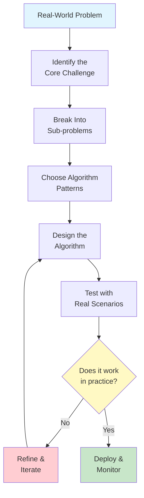
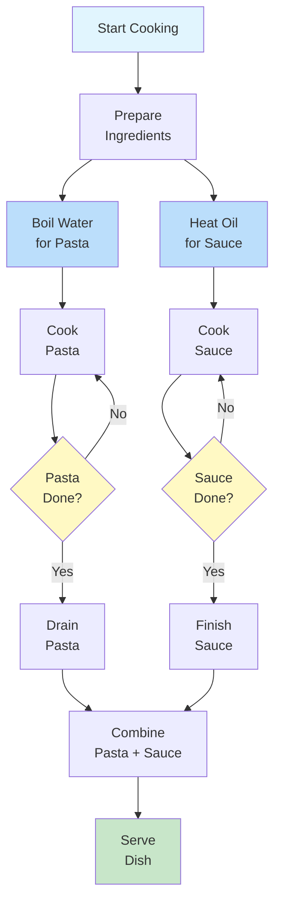
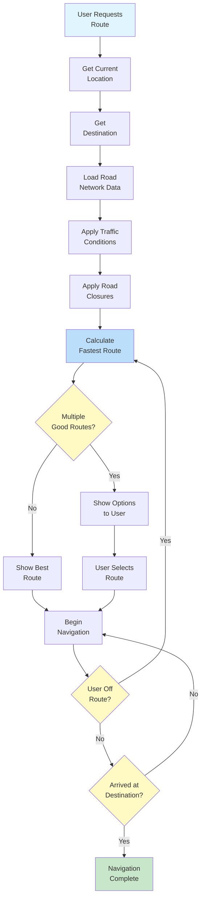
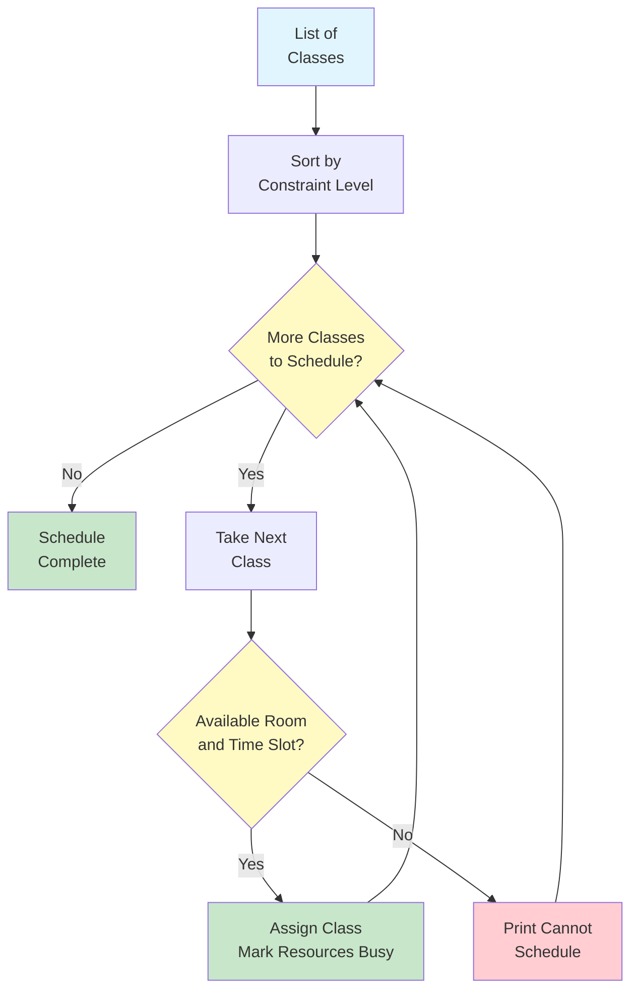
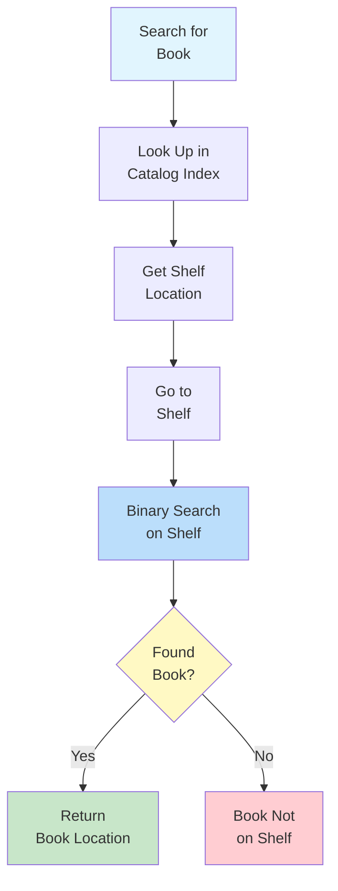
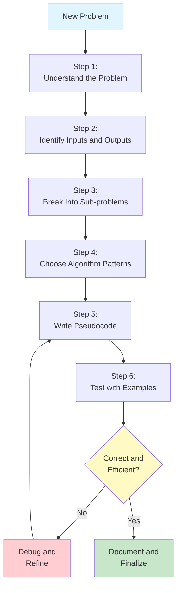

# Real-World Algorithm Design

Now that you understand the fundamentals of algorithms, it's time to see how they apply to real-world problems. This lesson walks through detailed case studies that demonstrate algorithmic thinking in everyday situations.

## Why Real-World Examples Matter

Abstract algorithm concepts become clear when applied to familiar situations. By studying real-world algorithms, you'll develop the ability to:

- **Recognize algorithmic patterns** in everyday problems
- **Design solutions** for practical challenges
- **Evaluate trade-offs** between different approaches
- **Communicate algorithms** to non-technical people



## Case Study 1: Recipe as an Algorithm

Cooking is one of the most relatable algorithmic processes. Let's analyze a recipe through an algorithmic lens.

### The Recipe Algorithm

```
ALGORITHM: Make Spaghetti Bolognese
INPUT: Ground beef, spaghetti, tomatoes, onion, garlic, olive oil, salt, pepper
OUTPUT: A plate of spaghetti bolognese

STEP 1: PREPARE the ingredients
            Chop 1 onion finely
            Mince 2 cloves of garlic
            Measure 500g ground beef
            Open 1 can of crushed tomatoes
STEP 2: BOIL water in a large pot
STEP 3: ADD salt to the water
STEP 4: WAIT until water reaches boiling point
STEP 5: ADD spaghetti to boiling water
STEP 6: SET timer TO 10 minutes
STEP 7: WHILE timer is greater than 0 DO
            STIR spaghetti occasionally
            IF timer equals 1 THEN
                TASTE a strand for doneness
            END IF
        END WHILE
STEP 8: DRAIN the spaghetti
STEP 9: HEAT olive oil in a pan
STEP 10: ADD onion and cook for 3 minutes
STEP 11: ADD garlic and cook for 1 minute
STEP 12: ADD ground beef
STEP 13: WHILE beef is not fully browned DO
            BREAK up meat with spoon
            STIR occasionally
        END WHILE
STEP 14: ADD crushed tomatoes
STEP 15: ADD salt and pepper to taste
STEP 16: SIMMER sauce for 15 minutes
STEP 17: COMBINE spaghetti and sauce on a plate
STEP 18: SERVE immediately
END ALGORITHM
```

### Algorithmic Analysis of the Recipe

| Algorithm Concept | In the Recipe |
|---|---|
| **Input** | Raw ingredients |
| **Output** | Finished dish |
| **Sequential steps** | Steps execute in order (prep, boil, cook sauce, combine) |
| **Conditional** | "IF timer equals 1 THEN taste for doneness" |
| **Loop** | "WHILE beef is not fully browned DO stir" |
| **Parallel execution** | Pasta and sauce can cook simultaneously |
| **Termination** | Recipe ends when dish is served |



> [!NOTE]
> Notice that steps 5-8 (pasta) and steps 9-16 (sauce) can happen in parallel. This is called **concurrent execution** -- two processes running at the same time. Good cooks manage both simultaneously to finish at the same time.

### What Makes a Good Recipe Algorithm?

| Quality | Good Recipe | Bad Recipe |
|---|---|---|
| **Definiteness** | "Bake at 180C for 25 minutes" | "Bake until done" |
| **Completeness** | Lists all ingredients with quantities | "Add seasoning to taste" |
| **Order** | Steps are numbered and sequential | Steps jump around randomly |
| **Error handling** | "If dough is too dry, add 1 tbsp water" | No troubleshooting guidance |
| **Termination** | "Cook for 10 minutes, then remove" | "Cook for a while" |

## Case Study 2: Navigation System Algorithm

GPS navigation is a sophisticated algorithmic system that finds optimal routes between locations.

### The Navigation Problem

```
PROBLEM: Find the best route from point A to point B

CONSTRAINTS:
  - Road network (which roads connect to which)
  - Distance of each road segment
  - Current traffic conditions
  - Speed limits
  - Road closures or construction

GOAL: Minimize travel time
```

### Simplified Navigation Algorithm

```
ALGORITHM: Find Fastest Route
INPUT: Starting location, destination, road network with traffic data
OUTPUT: Ordered list of road segments forming the route

STEP 1: CREATE a list of places to explore
STEP 2: ADD the starting location to the exploration list
STEP 3: SET travel_time[starting_location] TO 0
STEP 4: SET previous_location[starting_location] TO none
STEP 5: WHILE the exploration list is not empty DO
            SELECT the location with the smallest travel_time from the list
            REMOVE that location from the list
            
            FOR each road connected to this location DO
                SET new_time TO travel_time[current] + road travel time
                IF new_time is less than travel_time[destination_of_road] THEN
                    SET travel_time[destination_of_road] TO new_time
                    SET previous_location[destination_of_road] TO current location
                    ADD destination_of_road to exploration list
                END IF
            END FOR
        END WHILE
STEP 6: RECONSTRUCT the route by following previous_location from destination back to start
STEP 7: RETURN the route
END ALGORITHM
```

> [!TIP]
> This is a simplified version of **Dijkstra's algorithm**, one of the most famous algorithms in computer science. It finds the shortest path in a network by exploring outward from the starting point.

### How Navigation Handles Real-World Complexity



### Real-World Considerations

| Factor | How the Algorithm Handles It |
|---|---|
| **Traffic jams** | Increases travel time for affected road segments |
| **Road closures** | Removes those segments from the network |
| **User preferences** | Adds weights (avoid tolls, prefer highways) |
| **Real-time updates** | Recalculates when conditions change |
| **Multiple destinations** | Finds optimal order to visit all points |

## Case Study 3: Scheduling Algorithm

Scheduling is a classic algorithmic problem: how to assign limited resources (time, rooms, people) to tasks that need them.

### The Scheduling Problem

```
PROBLEM: Schedule classes for a school

RESOURCES:
  - 5 classrooms
  - 8 teachers
  - 6 time slots per day

CONSTRAINTS:
  - Each teacher can only teach one class at a time
  - Each classroom can only hold one class at a time
  - Some classes require specific rooms (lab, gym)
  - Some teachers have unavailable time slots
  - Each class must be scheduled exactly once

GOAL: Schedule all classes without conflicts
```

### Greedy Scheduling Algorithm

A **greedy algorithm** makes the best choice at each step without looking ahead.

```
ALGORITHM: Greedy Class Scheduler
INPUT: List of classes to schedule, available rooms, available time slots, teacher schedules
OUTPUT: A complete schedule or "cannot schedule all classes"

STEP 1: SORT classes by difficulty to schedule (most constrained first)
            Classes with specific room needs come first
            Classes with teachers who have few available slots come first
STEP 2: CREATE an empty schedule
STEP 3: FOR each class in the sorted list DO
            SET scheduled TO false
            FOR each available time slot DO
                FOR each available room DO
                    IF room is free at this time slot AND
                       teacher is available at this time slot AND
                       room meets class requirements THEN
                        ASSIGN class to this room at this time slot
                        MARK room as occupied at this time slot
                        MARK teacher as busy at this time slot
                        ADD assignment to schedule
                        SET scheduled TO true
                        BREAK out of all inner loops
                    END IF
                END FOR
                IF scheduled is true THEN
                    BREAK
                END IF
            END FOR
            IF scheduled is false THEN
                PRINT "Cannot schedule: " + class name
            END IF
        END FOR
STEP 4: RETURN the schedule
END ALGORITHM
```



### Scheduling Strategies Comparison

| Strategy | How It Works | Pros | Cons |
|---|---|---|---|
| **Greedy** | Schedule easiest classes first | Fast, simple | May fail to schedule all classes |
| **Most constrained first** | Schedule hardest classes first | Better success rate | More complex to implement |
| **Backtracking** | Try a schedule, undo if stuck | Finds solution if one exists | Very slow for large problems |
| **Random assignment** | Assign randomly, check conflicts | Very fast | Many conflicts, poor quality |

## Case Study 4: Library Book Organization

How does a library organize thousands of books so any book can be found quickly?

### The Organization Algorithm

```
ALGORITHM: Organize Library Books
INPUT: A collection of unsorted books with catalog numbers
OUTPUT: Books arranged on shelves in order

STEP 1: SORT all books by their catalog number
STEP 2: DIVIDE the sorted list into groups that fit on one shelf
STEP 3: FOR each shelf group DO
            LABEL the shelf with the range of catalog numbers
            PLACE books on the shelf in order
        END FOR
STEP 4: CREATE a catalog index mapping catalog numbers to shelf locations
END ALGORITHM
```

### The Search Algorithm (Using the Organization)

```
ALGORITHM: Find Book in Organized Library
INPUT: A book's catalog number, the catalog index
OUTPUT: The book's physical location

STEP 1: LOOK UP the catalog number in the index
STEP 2: READ the shelf location from the index
STEP 3: GO to that shelf
STEP 4: USE binary search on the shelf to find the exact book
            SET left TO first book on shelf
            SET right TO last book on shelf
            WHILE left is less than or equal to right DO
                SET middle TO the book in the middle
                IF middle catalog number equals target THEN
                    RETURN middle book's position
                ELSE IF middle catalog number is less than target THEN
                    SET left TO the book after middle
                ELSE
                    SET right TO the book before middle
                END IF
            END WHILE
STEP 5: RETURN "Book not on shelf"
END ALGORITHM
```



> [!NOTE]
> The library system combines multiple algorithm patterns: **sort** (organizing books), **search** (finding a specific book), and **aggregate** (the catalog index that summarizes locations).

## Designing Your Own Algorithm: A Framework

When faced with a new problem, follow this framework:



### Step-by-Step Example: Planning a Study Schedule

**Step 1: Understand the Problem**
You have 5 subjects to study, 3 days until exams, and limited hours each day. You need to allocate study time effectively.

**Step 2: Identify Inputs and Outputs**
- **Input**: List of subjects, difficulty of each, hours available per day, number of days
- **Output**: A day-by-day study schedule

**Step 3: Break Into Sub-problems**
- Prioritize subjects by difficulty
- Calculate total study hours needed
- Distribute hours across available days
- Ensure no day exceeds available hours

**Step 4: Choose Algorithm Patterns**
- **Sort**: Order subjects by difficulty (hardest first)
- **Aggregate**: Total hours needed
- **Filter**: Available time slots
- **Transform**: Convert hours into time blocks

**Step 5: Write Pseudocode**

```
ALGORITHM: Study Schedule Planner
INPUT: List of subjects with difficulty levels, hours available per day, number of days
OUTPUT: Day-by-day study schedule

STEP 1: SORT subjects by difficulty (hardest first)
STEP 2: FOR each subject DO
            SET hours_needed TO difficulty level multiplied by 2
        END FOR
STEP 3: SET total_hours_needed TO sum of all hours_needed
STEP 4: SET total_hours_available TO hours per day multiplied by number of days
STEP 5: IF total_hours_needed is greater than total_hours_available THEN
            PRINT "Warning: Not enough time to study all subjects thoroughly"
            PRINT "Focus on the hardest subjects first"
        END IF
STEP 6: CREATE an empty schedule
STEP 7: FOR each day FROM 1 TO number_of_days DO
            SET remaining_hours TO hours available per day
            FOR each subject in the sorted list DO
                IF remaining_hours is greater than 0 THEN
                    SET study_time TO minimum of 2 hours and remaining_hours
                    ADD subject to day's schedule with study_time hours
                    SET remaining_hours TO remaining_hours - study_time
                END IF
            END FOR
        END FOR
STEP 8: RETURN the schedule
END ALGORITHM
```

## Practice Exercises

### Exercise 1: Recipe Algorithm

Write an algorithm for making your favorite snack or meal. Include:
- Clear inputs (ingredients)
- At least one conditional (e.g., "if too salty, add sugar")
- At least one loop (e.g., "stir until smooth")
- A clear output

### Exercise 2: Daily Schedule Algorithm

Design an algorithm that plans your ideal daily schedule. Consider:
- Fixed commitments (work, classes)
- Flexible activities (exercise, reading, socializing)
- Constraints (sleep 8 hours, meals at regular times)
- Priorities (what's most important to fit in)

### Exercise 3: Shopping Algorithm

You need to buy groceries with a budget of R$200. Design an algorithm that:
- Takes a shopping list with estimated prices
- Stays within budget
- Prioritizes essential items
- Suggests what to remove if over budget

### Exercise 4: Analyze a Real Algorithm

Think of an app you use regularly (social media, music streaming, food delivery). Identify:
- What algorithmic patterns does it use?
- What inputs does it take?
- What outputs does it produce?
- What trade-offs does it make?

### Exercise 5: Design Challenge

Design an algorithm for a hospital emergency room triage system:
- Patients arrive with different severity levels
- Limited doctors and beds are available
- Critical patients must be seen immediately
- Less critical patients may need to wait

Include handling for:
- New patient arrival
- Doctor becoming available
- Patient condition worsening while waiting

## Summary

In this lesson, you learned:

- **Recipe algorithms**: Cooking follows algorithmic patterns with inputs, steps, conditionals, and loops
- **Navigation algorithms**: GPS uses graph-based pathfinding to find optimal routes
- **Scheduling algorithms**: Resource allocation requires careful constraint management
- **Organization algorithms**: Libraries combine sorting and searching for efficient retrieval
- **Design framework**: A systematic approach to designing algorithms for any problem

> [!SUCCESS]
> You now have the tools to recognize and design algorithms for real-world problems. Every complex system you encounter -- from traffic lights to social media feeds -- is built from the algorithmic principles you've learned in this course.

## Key Terms

| Term | Definition |
|---|---|
| **Case Study** | A detailed analysis of a real-world example |
| **Concurrent Execution** | Multiple processes running at the same time |
| **Dijkstra's Algorithm** | A famous algorithm for finding shortest paths in a network |
| **Greedy Algorithm** | An algorithm that makes the best local choice at each step |
| **Backtracking** | Trying a solution and undoing it if it doesn't work |
| **Constraint** | A limitation or requirement that must be satisfied |
| **Triage** | Sorting patients or tasks by urgency |
| **Resource Allocation** | Assigning limited resources to competing needs |
| **Design Framework** | A structured approach to solving problems systematically |
