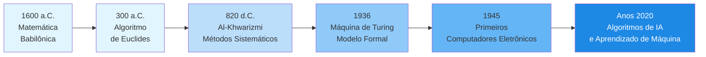
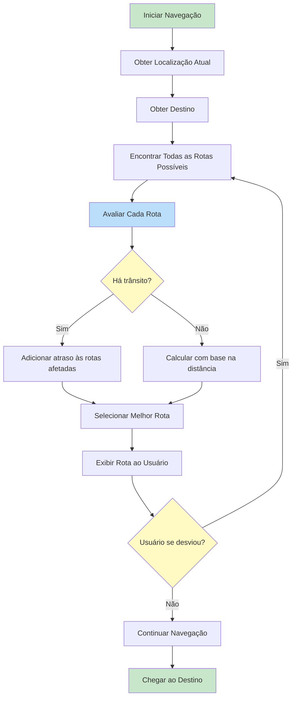
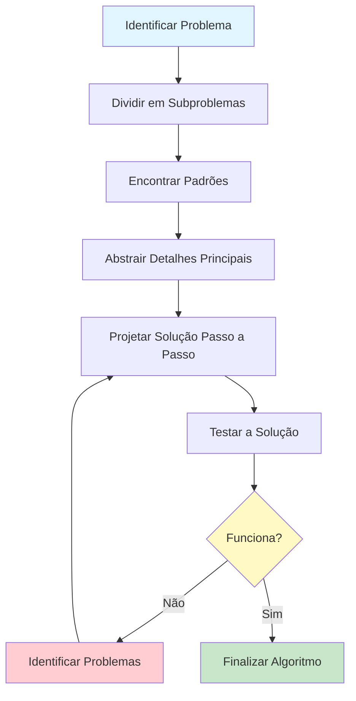

# O Que São Algoritmos?

Os algoritmos estão em toda parte. Desde o momento em que você acorda e verifica seu celular até as rotas que seu GPS calcula, os algoritmos moldam silenciosamente nossas experiências diárias. Nesta lição, exploraremos o que realmente são algoritmos, de onde vieram e como pensar de forma algorítmica.

## Definindo Algoritmos

Um **algoritmo** é uma sequência finita de instruções bem definidas, passo a passo, projetada para resolver um problema específico ou realizar uma tarefa particular. Pense nisso como uma receita: ela diz exatamente o que fazer, em que ordem, para alcançar um resultado desejado.

### Características Principais dos Algoritmos

| Característica | Descrição | Exemplo |
|---|---|---|
| **Finito** | Deve eventualmente terminar | Uma receita tem um número limitado de passos |
| **Bem definido** | Cada passo é claro e sem ambiguidade | "Adicione 2 xícaras de farinha" e não "Adicione um pouco de farinha" |
| **Entrada** | Recebe zero ou mais entradas | Um algoritmo de ordenação recebe uma lista de números |
| **Saída** | Produz pelo menos uma saída | A lista ordenada de números |
| **Efetivo** | Cada passo pode ser executado em tempo finito | Operações aritméticas básicas |

> [!NOTE]
> Um algoritmo NÃO é um programa. Um algoritmo é a ideia ou plano conceitual; um programa é a implementação desse algoritmo em uma linguagem de programação específica.

## Uma Breve História dos Algoritmos

O conceito de algoritmos é anterior aos computadores em milhares de anos.

### Origens Antigas

A palavra "algoritmo" vem do nome do matemático persa **Muhammad ibn Musa al-Khwarizmi** (c. 780-850 d.C.). Seu trabalho sobre resolução de equações introduziu métodos sistemáticos que se tornaram conhecidos como "algorismo" e eventualmente "algoritmo".

No entanto, algoritmos existiam muito antes disso:

- **Matemática babilônica** (c. 1600 a.C.): Tabletes de argila mostram procedimentos passo a passo para resolver equações quadráticas
- **Algoritmo de Euclides** (c. 300 a.C.): Um método para encontrar o maior divisor comum de dois números, ainda usado hoje
- **Matemática egípcia antiga**: O Papiro de Rhind contém algoritmos para multiplicação e divisão

### A Era Moderna



> [!TIP]
> Compreender a história dos algoritmos nos ajuda a apreciar que o pensamento algorítmico é uma habilidade humana fundamental, não apenas um conceito moderno de ciência da computação.

## Algoritmos no Dia a Dia

Você interage com algoritmos constantemente sem perceber. Vamos examinar alguns exemplos cotidianos.

### Algoritmo da Rotina Matinal

Considere sua rotina matinal. Ela segue um padrão algorítmico:

```
ALGORITMO: Rotina Matinal
ENTRADA: Você está dormindo
SAÍDA: Você está pronto para o dia

PASSO 1: Acordar
PASSO 2: SE o alarme estiver tocando ENTÃO
            Desligar o alarme
        FIM SE
PASSO 3: Sair da cama
PASSO 4: Ir ao banheiro
PASSO 5: Escovar os dentes
PASSO 6: Tomar banho
PASSO 7: Vestir-se
PASSO 8: Tomar café da manhã
PASSO 9: SE o tempo estiver frio ENTÃO
            Usar um casaco
        SENÃO
            Usar roupas leves
        FIM SE
PASSO 10: Sair para o trabalho/escola
FIM ALGORITMO
```

### Algoritmos de Navegação

Quando você usa navegação GPS, um algoritmo sofisticado:

1. Identifica sua localização atual
2. Determina seu destino
3. Mapeia todas as rotas possíveis
4. Avalia cada rota com base em distância, tráfego e tempo
5. Seleciona a rota ideal
6. Recalcula se você se desviar do caminho



### Cozinhar como um Algoritmo

Receitas são algoritmos! Elas possuem:

- **Entrada**: Ingredientes
- **Passos**: Instruções claras e ordenadas
- **Condicionais**: "Se a massa estiver muito pegajosa, adicione mais farinha"
- **Saída**: Um prato finalizado
- **Terminação**: A receita termina quando o prato está pronto

> [!WARNING]
> Nem todos os processos passo a passo são bons algoritmos. Um algoritmo ruim pode ter passos ambíguos, loops infinitos ou condições faltando. Sempre garanta que seus algoritmos sejam precisos e completos.

## Pensamento Algorítmico

**Pensamento algorítmico** é uma forma de abordar problemas que permite definir soluções claras e passo a passo. Envolve várias habilidades principais:

### Decomposição

Dividir um problema complexo em partes menores e gerenciáveis.

**Exemplo**: Planejar uma festa

```
PROBLEMA: Planejar uma festa de aniversário

DECOMPOSTO EM:
  - Criar lista de convidados
  - Escolher um local
  - Planejar o cardápio
  - Encomendar decorações
  - Organizar entretenimento
  - Enviar convites
  - Preparar o local
  - Realizar a festa
```

### Reconhecimento de Padrões

Identificar semelhanças ou padrões dentro de problemas.

```
PADRÃO: Fazer qualquer bebida quente
  1. Ferver água
  2. Preparar a base (saco de chá, pó de café, achocolatado)
  3. Combinar água e base
  4. Adicionar opcionais (leite, açúcar, mel)
  5. Mexer e servir
```

### Abstração

Focar nas informações importantes enquanto ignora detalhes irrelevantes.

Ao projetar um algoritmo para organizar livros em uma biblioteca, você se importa com:
- Títulos dos livros ou números de catálogo
- A ordem em que devem ficar

Você NÃO se importa com:
- A cor das capas dos livros
- O peso de cada livro
- A biografia do autor

### Raciocínio Lógico

Desenvolver regras passo a passo para resolver o problema.



## Exemplo do Mundo Real: Encontrar um Livro na Biblioteca

Vamos comparar duas abordagens para encontrar um livro:

### Abordagem 1: Busca Aleatória

```
ALGORITMO: Busca Aleatória de Livro
ENTRADA: Biblioteca com N livros, título do livro alvo
SAÍDA: O livro alvo (ou não encontrado)

PASSO 1: Pegar um livro aleatório da estante
PASSO 2: Verificar se é o livro alvo
PASSO 3: SE for o livro alvo ENTÃO
            Retornar o livro
        SENÃO
            Ir para o PASSO 1
        FIM SE
```

> [!WARNING]
> Este algoritmo pode rodar para sempre se o livro não existir! Também não há como rastrear quais livros já foram verificados.

### Abordagem 2: Busca Sistemática

```
ALGORITMO: Busca Sistemática de Livro
ENTRADA: Biblioteca com N livros organizados por categoria, título do livro alvo
SAÍDA: O livro alvo (ou confirmação de que não está disponível)

PASSO 1: Identificar a categoria do livro alvo
PASSO 2: Ir para a seção da categoria correta
PASSO 3: Começar do primeiro livro naquela seção
PASSO 4: PARA cada livro na seção FAÇA
            Verificar se o livro corresponde ao alvo
            SE corresponder ENTÃO
                Retornar o livro e PARAR
            FIM SE
        FIM PARA
PASSO 5: Retornar "Livro não encontrado"
FIM ALGORITMO
```

| Aspecto | Busca Aleatória | Busca Sistemática |
|---|---|---|
| **Garantia de encontrar?** | Não | Sim (se o livro existir) |
| **Garantia de terminar?** | Não | Sim |
| **Melhor caso** | 1 verificação | 1 verificação |
| **Pior caso** | Infinito | N verificações |
| **Eficiência** | Muito ruim | Razoável |

## Exercícios Práticos

### Exercício 1: Identifique o Algoritmo

Quais dos seguintes são algoritmos? Explique por quê ou por quê não.

1. Uma receita de bolo de chocolate
2. As instruções em um frasco de shampoo ("Ensaboe, enxágue, repita")
3. Uma lista de suas músicas favoritas
4. Direções de sua casa até o supermercado mais próximo
5. As regras de um jogo de tabuleiro

### Exercício 2: Escreva um Algoritmo Diário

Escreva um algoritmo para uma das seguintes tarefas usando pseudocódigo:

- Fazer uma xícara de chá ou café
- Atravessar uma rua movimentada com segurança
- Organizar sua mochila para a escola

Inclua pelo menos uma instrução condicional (SE/SENÃO).

### Exercício 3: Prática de Decomposição

Divida o problema "Planejar uma viagem de uma semana" em pelo menos 6 subproblemas. Para cada subproblema, identifique quais seriam as entradas e saídas.

### Exercício 4: Encontre o Erro

Encontre o(s) problema(s) neste algoritmo:

```
ALGORITMO: Atravessar a Rua
PASSO 1: Caminhar para a rua
PASSO 2: Atravessar para o outro lado
PASSO 3: Você atravessou a rua
FIM ALGORITMO
```

Reescreva-o para ser seguro e completo.

### Exercício 5: Reconhecimento de Padrões

Identifique o padrão comum nestas tarefas:

- Dobrar roupas
- Empilhar pratos em um armário
- Organizar arquivos em um arquivo de escritório

Escreva um algoritmo generalizado que capture esse padrão.

## Resumo

Nesta lição, você aprendeu:

- **O que são algoritmos**: Sequências finitas e bem definidas de passos para resolver problemas
- **A história**: Da matemática babilônica antiga à IA moderna
- **Exemplos do dia a dia**: Rotinas matinais, navegação GPS, receitas culinárias
- **Pensamento algorítmico**: Decomposição, reconhecimento de padrões, abstração e raciocínio lógico
- **Algoritmos bons vs. ruins**: Abordagens sistemáticas sempre vencem as aleatórias

> [!SUCCESS]
> Agora você entende que algoritmos não são apenas para computadores. Eles são ferramentas fundamentais para resolver problemas de forma organizada e eficiente. Essa mentalidade será útil durante todo este curso e além.

## Termos-Chave

| Termo | Definição |
|---|---|
| **Algoritmo** | Uma sequência finita de instruções bem definidas para resolver um problema |
| **Pensamento Algorítmico** | Uma abordagem de resolução de problemas usando processos lógicos passo a passo |
| **Decomposição** | Dividir problemas complexos em partes menores |
| **Reconhecimento de Padrões** | Identificar semelhanças dentro e entre problemas |
| **Abstração** | Focar nos detalhes essenciais enquanto ignora os irrelevantes |
| **Pseudocódigo** | Uma descrição em linguagem simples dos passos de um algoritmo |
