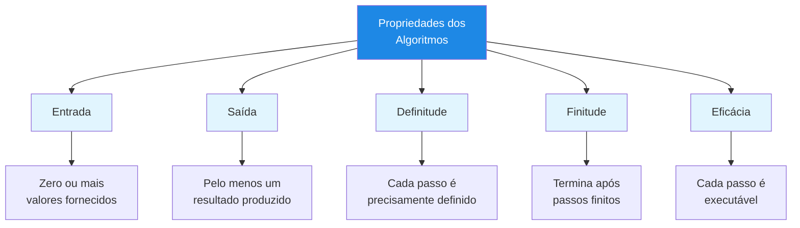
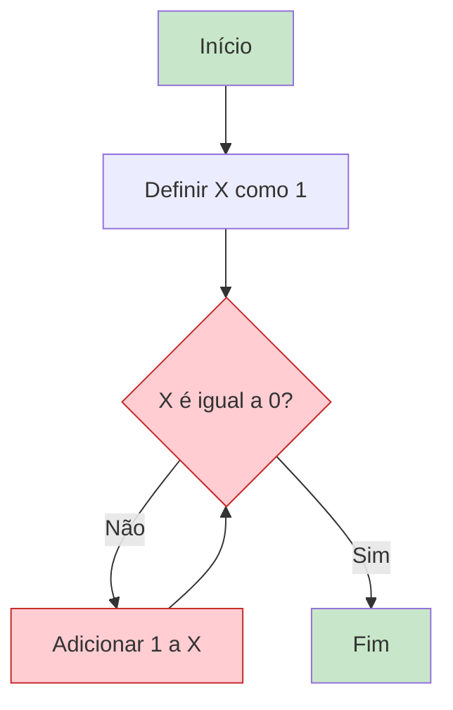
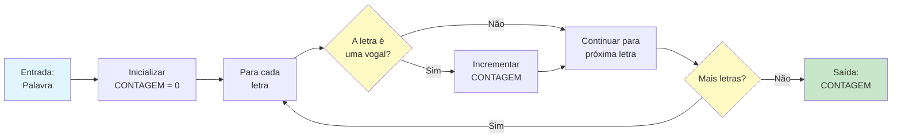

# Propriedades dos Algoritmos

Nem todo conjunto de instruções se qualifica como um algoritmo. Para que um procedimento seja considerado um verdadeiro algoritmo, ele deve satisfazer cinco propriedades essenciais. Compreender essas propriedades ajuda você a projetar algoritmos melhores e identificar os defeituosos.

## As Cinco Propriedades Essenciais

Todo algoritmo válido deve ter estas cinco características:

| Propriedade | Pergunta que Responde | Por que Importa |
|---|---|---|
| **Entrada** | Com quais dados o algoritmo começa? | Define o escopo e a aplicabilidade |
| **Saída** | Qual resultado o algoritmo produz? | Define o propósito e os critérios de sucesso |
| **Definitude** | Cada passo é claro e sem ambiguidade? | Garante execução consistente |
| **Finitude** | O algoritmo eventualmente para? | Previne loops infinitos |
| **Eficácia** | Cada passo pode realmente ser executado? | Garante viabilidade prática |



## Propriedade 1: Entrada

Um algoritmo deve ter **zero ou mais entradas** -- valores ou dados fornecidos ao algoritmo antes de iniciar sua execução.

### Compreendendo a Entrada

As entradas são as matérias-primas com as quais seu algoritmo trabalha. Elas podem ser:

- Números (ex.: uma lista de temperaturas)
- Texto (ex.: um parágrafo para analisar)
- Objetos (ex.: um baralho para embaralhar)
- Nada (alguns algoritmos geram dados sem entrada)

### Exemplos

```
ALGORITMO: Somar Dois Números
ENTRADA: Dois números, A e B
SAÍDA: A soma de A e B

PASSO 1: Ler o número A
PASSO 2: Ler o número B
PASSO 3: Calcular SOMA = A + B
PASSO 4: Retornar SOMA
FIM ALGORITMO
```

```
ALGORITMO: Gerar os Primeiros 10 Números Pares
ENTRADA: Nenhuma
SAÍDA: Lista dos primeiros 10 números pares

PASSO 1: Criar uma lista vazia chamada NUMEROS_PARES
PASSO 2: Definir CONTADOR como 2
PASSO 3: ENQUANTO a lista tiver menos de 10 números FAÇA
            Adicionar CONTADOR a NUMEROS_PARES
            Definir CONTADOR como CONTADOR + 2
        FIM ENQUANTO
PASSO 4: Retornar NUMEROS_PARES
FIM ALGORITMO
```

> [!NOTE]
> Um algoritmo com zero entradas ainda é válido. Por exemplo, um algoritmo que gera a sequência de Fibonacci do zero não precisa de entrada externa.

## Propriedade 2: Saída

Um algoritmo deve produzir **pelo menos uma saída** -- um resultado que tenha uma relação especificada com as entradas.

### Por que a Saída Importa

A saída é a razão de existir do algoritmo. Sem saída, o algoritmo não realiza nada. A saída deve ser:

- **Previsível**: Dada a mesma entrada, o algoritmo deve produzir a mesma saída
- **Útil**: A saída deve resolver o problema para o qual o algoritmo foi projetado
- **Bem definida**: Você deve saber exatamente qual forma a saída terá

### Exemplos

```
ALGORITMO: Encontrar o Máximo
ENTRADA: Uma lista de números
SAÍDA: O maior número na lista

PASSO 1: Definir MAX como o primeiro número na lista
PASSO 2: PARA cada número restante na lista FAÇA
            SE o número atual for maior que MAX ENTÃO
                Definir MAX como o número atual
            FIM SE
        FIM PARA
PASSO 3: Retornar MAX
FIM ALGORITMO
```

| Algoritmo | Entrada | Saída |
|---|---|---|
| Ordenar uma lista | [3, 1, 4, 1, 5] | [1, 1, 3, 4, 5] |
| Contar palavras | "Olá mundo hoje" | 3 |
| Verificar primo | 7 | verdadeiro |
| Inverter texto | "ola" | "alo" |

## Propriedade 3: Definitude

Cada passo de um algoritmo deve ser **precisamente definido** -- não deve haver ambiguidade sobre o que fazer em qualquer ponto.

### O Problema com Ambiguidade

Considere estas duas instruções:

| Ambíguo (Ruim) | Definido (Bom) |
|---|---|
| "Adicione um pouco de sal" | "Adicione 1 colher de chá de sal" |
| "Caminhe até se sentir cansado" | "Caminhe por 30 minutos" |
| "Escolha um número" | "Escolha o primeiro número na lista" |
| "Faça ficar bonito" | "Alinhe todo o texto à margem esquerda" |

### Exemplo: Definido vs. Indefinido

```
ALGORITMO RUIM: Fazer Café (Indefinido)
PASSO 1: Pegue um pouco de café
PASSO 2: Adicione água
PASSO 3: Aqueça
PASSO 4: Sirva
PASSO 5: Adicione leite se quiser
```

> [!WARNING]
> O algoritmo ruim acima falha na definitude porque: "um pouco de café" é vago, "água" não tem quantidade, "aqueça" não tem temperatura, e "se quiser" torna o comportamento inconsistente.

```
ALGORITMO BOM: Fazer Café (Definido)
ENTRADA: Pó de café, água, leite (opcional)
SAÍDA: Uma xícara de café

PASSO 1: Medir 2 colheres de sopa de pó de café
PASSO 2: Colocar o pó no filtro
PASSO 3: Medir 250 mililitros de água
PASSO 4: Aquecer a água a 95 graus Celsius
PASSO 5: Despejar água quente sobre o pó
PASSO 6: Aguardar 4 minutos para a infusão
PASSO 7: SE leite for solicitado ENTÃO
            Adicionar 30 mililitros de leite
        FIM SE
PASSO 8: Servir em uma xícara
FIM ALGORITMO
```

## Propriedade 4: Finitude

Um algoritmo deve **terminar após um número finito de passos** -- ele não pode rodar para sempre.

### Loops Infinitos

A violação mais comum da finitude é o loop infinito -- um loop que nunca termina porque sua condição de terminação nunca é alcançada.



> [!WARNING]
> No diagrama acima, X começa em 1 e continua aumentando. Ele NUNCA será igual a 0, então o algoritmo roda para sempre! Isso viola a propriedade de finitude.

### Garantindo a Finitude

Para garantir a finitude, todo loop deve ter:

1. Uma **condição de terminação clara** que pode ser avaliada
2. Um **caminho garantido** para alcançar essa condição
3. **Progresso** em direção à condição a cada iteração

```
BOM: Loop Finito
PASSO 1: Definir CONTADOR como 10
PASSO 2: ENQUANTO CONTADOR for maior que 0 FAÇA
            Imprimir CONTADOR
            Definir CONTADOR como CONTADOR - 1
        FIM ENQUANTO
PASSO 3: Imprimir "Feito!"
```

```
RUIM: Loop Potencialmente Infinito
PASSO 1: Definir CONTADOR como 10
PASSO 2: ENQUANTO CONTADOR não for igual a 5 FAÇA
            SE CONTADOR for par ENTÃO
                Definir CONTADOR como CONTADOR - 2
            SENÃO
                Definir CONTADOR como CONTADOR + 2
            FIM SE
        FIM ENQUANTO
```

> [!TIP]
> Percorra o exemplo ruim com lápis e papel. Começando em 10: 10 -> 8 -> 6 -> 4 -> 2 -> 0 -> -2... Ele nunca chegará a 5!

## Propriedade 5: Eficácia

Cada passo de um algoritmo deve ser **básico o suficiente para ser executado** -- em princípio, por uma pessoa usando apenas lápis e papel em uma quantidade finita de tempo.

### O que Torna um Passo Eficaz?

Um passo eficaz é aquele que:

- Pode ser executado exatamente como descrito
- Completa em uma quantidade finita de tempo
- Não requer operações impossíveis ou indefinidas

### Passos Eficazes vs. Ineficazes

| Passo Eficaz | Passo Ineficaz | Por que Falha |
|---|---|---|
| "Adicionar 5 a X" | "Somar todos os números do universo" | Impossível de completar |
| "Dividir X por 2" | "Dividir X por 0" | Matematicamente indefinido |
| "Encontrar o maior número nesta lista de 100" | "Encontrar o maior número primo" | Não existe maior primo |
| "Lançar uma moeda" | "Prever os números da loteria de amanhã" | Impossível de determinar |

### Exemplo

```
ALGORITMO: Calcular a Média
ENTRADA: Uma lista de N números
SAÍDA: A média aritmética dos números

PASSO 1: Definir SOMA como 0
PASSO 2: PARA cada número na lista FAÇA
            Adicionar o número à SOMA
        FIM PARA
PASSO 3: SE N for maior que 0 ENTÃO
            Definir MEDIA como SOMA dividida por N
            Retornar MEDIA
        SENÃO
            Retornar "Não é possível calcular: lista vazia"
        FIM SE
FIM ALGORITMO
```

> [!NOTE]
> A verificação no Passo 3 (SE N for maior que 0) garante a eficácia prevenindo a divisão por zero, que seria uma operação indefinida.

## Exemplo Completo: Verificando Todas as Propriedades

Vamos analisar um algoritmo completo em relação às cinco propriedades:

```
ALGORITMO: Contar Vogais em uma Palavra
ENTRADA: Uma palavra (sequência de letras)
SAÍDA: O número de vogais na palavra

PASSO 1: Definir CONTAGEM como 0
PASSO 2: Definir VOGAIS como a lista [a, e, i, o, u]
PASSO 3: PARA cada letra na palavra FAÇA
            PARA cada vogal em VOGAIS FAÇA
                SE a letra for igual à vogal ENTÃO
                    Adicionar 1 à CONTAGEM
                FIM SE
            FIM PARA
        FIM PARA
PASSO 4: Retornar CONTAGEM
FIM ALGORITMO
```

### Análise das Propriedades

| Propriedade | Satisfeita? | Explicação |
|---|---|---|
| **Entrada** | Sim | Recebe uma palavra como entrada |
| **Saída** | Sim | Retorna um número (contagem de vogais) |
| **Definitude** | Sim | Cada passo é claro e sem ambiguidade |
| **Finitude** | Sim | A palavra tem letras finitas; os loops terminarão |
| **Eficácia** | Sim | Cada passo é uma operação básica e realizável |



## Exercícios Práticos

### Exercício 1: Identificação de Propriedades

Para cada instrução abaixo, identifique qual propriedade (se houver) ela viola:

1. "Pense em um número entre 1 e 10, depois continue adicionando 1 até alcançar seu número favorito"
2. "Calcule o resultado de dividir 10 por 0"
3. "Pegue uma lista de números e retorne o maior"
4. "Misture os ingredientes até parecer certo"
5. "Comece com 5, subtraia 1 repetidamente até chegar a 10"

### Exercício 2: Corrija o Algoritmo

O seguinte algoritmo viola uma ou mais propriedades. Identifique quais e reescreva-o corretamente:

```
ALGORITMO: Encontrar Temperatura Média
ENTRADA: Lista de temperaturas diárias de um mês
PASSO 1: Somar todas as temperaturas
PASSO 2: Dividir pelo número de dias
PASSO 3: Retornar o resultado
```

### Exercício 3: Lista de Verificação de Propriedades

Escreva um algoritmo para "Encontrar a palavra mais longa em uma frase." Depois, crie uma lista verificando cada uma das cinco propriedades.

### Exercício 4: Verdadeiro ou Falso

Determine se cada afirmação é verdadeira ou falsa:

1. Um algoritmo deve ter pelo menos uma entrada.
2. Um algoritmo pode ter zero entradas.
3. Um algoritmo deve produzir exatamente uma saída.
4. Se um algoritmo tem um loop, ele deve sempre terminar.
5. "Adivinhe a resposta" é um passo eficaz.

### Exercício 5: Desafio de Design

Projete um algoritmo que satisfaça todas as cinco propriedades para a seguinte tarefa:

**Tarefa**: Dada uma lista de notas de alunos, determine se a média da classe é suficiente (60 ou acima).

Inclua:
- Especificação clara de entrada e saída
- Pelo menos uma condicional
- Pelo menos um loop
- Todos os passos devem ser definidos e eficazes

## Resumo

Nesta lição, você aprendeu:

- **Entrada**: Algoritmos precisam de zero ou mais entradas para trabalhar
- **Saída**: Algoritmos devem produzir pelo menos um resultado
- **Definitude**: Cada passo deve ser claro e sem ambiguidade
- **Finitude**: Algoritmos devem terminar após um número finito de passos
- **Eficácia**: Cada passo deve ser praticamente executável

> [!SUCCESS]
> Essas cinco propriedades formam a base para avaliar qualquer algoritmo. Quando você projetar seus próprios algoritmos, sempre verifique-os contra esta lista para garantir que sejam válidos.

## Termos-Chave

| Termo | Definição |
|---|---|
| **Entrada** | Dados fornecidos a um algoritmo antes da execução começar |
| **Saída** | O resultado produzido por um algoritmo após a execução |
| **Definitude** | Cada passo é precisamente definido sem ambiguidade |
| **Finitude** | O algoritmo termina após um número finito de passos |
| **Eficácia** | Cada passo pode ser executado em tempo finito |
| **Loop Infinito** | Um loop que nunca termina, violando a finitude |
