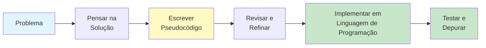
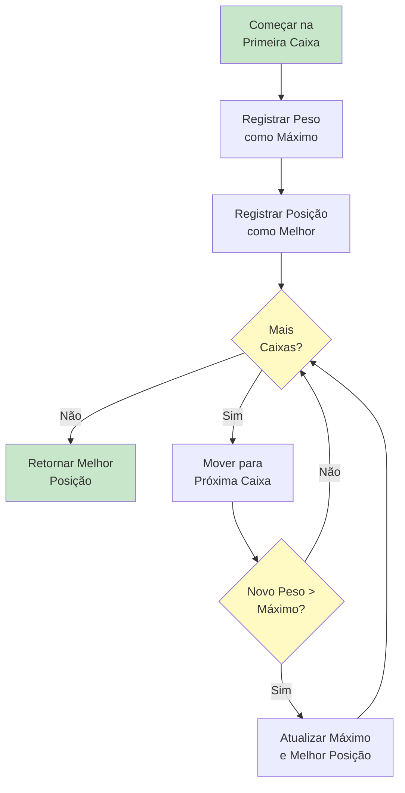
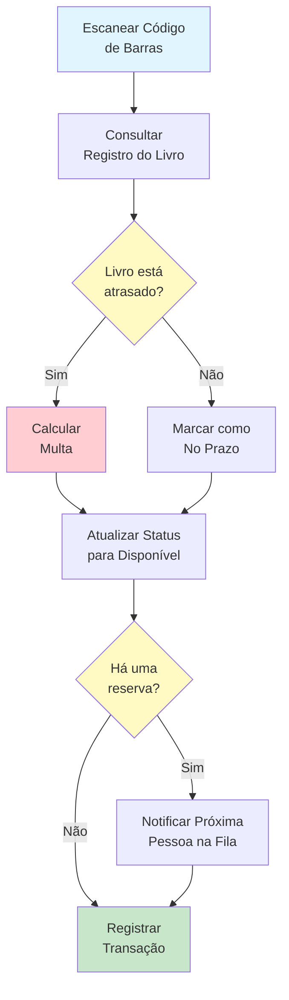

# Pseudocódigo e Linguagem Natural

Antes de escrever algoritmos em qualquer linguagem de programação, nós os expressamos em um formato legível por humanos. Pseudocódigo e descrições em linguagem natural nos permitem focar na lógica de um algoritmo sem nos preocuparmos com as regras de sintaxe de linguagens de programação específicas.

## O que é Pseudocódigo?

**Pseudocódigo** é uma descrição em linguagem simples dos passos de um algoritmo. Ele usa as convenções estruturais das linguagens de programação, mas é destinado à leitura humana e não à leitura de máquinas.

### Por que Usar Pseudocódigo?

| Benefício | Explicação |
|---|---|
| **Independente de linguagem** | Qualquer pessoa pode ler, independentemente da experiência em programação |
| **Foco na lógica** | Concentre-se no que o algoritmo faz, não em como escrevê-lo em código |
| **Fácil de modificar** | Mudanças são mais simples do que reescrever código real |
| **Ferramenta de comunicação** | Ajuda equipes a discutir algoritmos antes da implementação |
| **Auxílio de planejamento** | Força você a pensar no algoritmo antes de codificar |



> [!TIP]
> Pense no pseudocódigo como a planta de um prédio. Arquitetos não começam assentando tijolos -- eles primeiro criam planos detalhados. O pseudocódigo é a planta do seu algoritmo.

## Convenções de Pseudocódigo

Embora não exista um único padrão para pseudocódigo, seguir convenções consistentes torna seus algoritmos mais fáceis de ler e entender.

### Estrutura Básica

```
ALGORITMO: NomeDoAlgoritmo
ENTRADA: Descrição das entradas
SAÍDA: Descrição das saídas

PASSO 1: Primeira instrução
PASSO 2: Segunda instrução
...
PASSO N: Instrução final

FIM ALGORITMO
```

### Variáveis e Atribuição

Use nomes de variáveis claros e descritivos. A operação de atribuição armazena um valor em uma variável.

```
DEFINIR total COMO 0
DEFINIR nome COMO "Maria"
DEFINIR contador COMO contador + 1
DEFINIR resultado COMO preco multiplicado por quantidade
```

### Palavras-chave Comuns

| Palavra-chave | Propósito | Exemplo |
|---|---|---|
| **DEFINIR** | Atribuir um valor a uma variável | `DEFINIR x COMO 5` |
| **LER** | Obter entrada do usuário | `LER idade` |
| **IMPRIMIR** | Exibir saída | `IMPRIMIR total` |
| **SE...ENTÃO...SENÃO** | Execução condicional | `SE x > 0 ENTÃO IMPRIMIR "positivo"` |
| **PARA...FAÇA** | Repetir um número conhecido de vezes | `PARA i DE 1 ATÉ 10 FAÇA` |
| **ENQUANTO...FAÇA** | Repetir enquanto a condição for verdadeira | `ENQUANTO x > 0 FAÇA` |
| **REPITA...ATÉ** | Repetir até a condição ser verdadeira | `REPITA ... ATÉ x = 0` |

## Escrevendo Algoritmos em Linguagem Natural

Descrições em linguagem natural usam linguagem cotidiana para explicar os passos do algoritmo. Esta é a forma mais acessível de descrição de algoritmos.

### Exemplo: Fazer um Sanduíche

```
ALGORITMO: Fazer um Sanduíche de Manteiga de Amendoim com Geleia
ENTRADA: Fatias de pão, manteiga de amendoim, geleia, faca, prato
SAÍDA: Um sanduíche completo

PASSO 1: Colocar duas fatias de pão no prato
PASSO 2: Usando a faca, passar manteiga de amendoim em uma fatia
PASSO 3: Usando a faca (limpa), passar geleia na outra fatia
PASSO 4: Pressionar as duas fatias juntas com os recheios voltados para dentro
PASSO 5: SE a pessoa quiser cortado ENTÃO
            Cortar o sanduíche diagonalmente ao meio
        FIM SE
PASSO 6: Servir o sanduíche
FIM ALGORITMO
```

### Exemplo: Encontrar a Caixa Mais Pesada

```
ALGORITMO: Encontrar a Caixa Mais Pesada
ENTRADA: Uma sala com N caixas, cada uma com um rótulo de peso
SAÍDA: A posição da caixa mais pesada

PASSO 1: Começar na primeira caixa
PASSO 2: Lembrar seu peso como o máximo atual
PASSO 3: Lembrar sua posição como a melhor posição atual
PASSO 4: Mover para a próxima caixa
PASSO 5: Comparar seu peso com o máximo atual
PASSO 6: SE esta caixa for mais pesada ENTÃO
            Atualizar o máximo atual para o peso desta caixa
            Atualizar a melhor posição para a posição desta caixa
        FIM SE
PASSO 7: SE houver mais caixas ENTÃO
            Ir para o PASSO 4
        FIM SE
PASSO 8: Retornar a melhor posição
FIM ALGORITMO
```



## Exemplos de Pseudocódigo com Estruturas de Controle

### Execução Sequencial

Os passos executam um após o outro em ordem:

```
ALGORITMO: Calcular Área do Retângulo
ENTRADA: Comprimento e largura de um retângulo
SAÍDA: A área do retângulo

PASSO 1: LER comprimento
PASSO 2: LER largura
PASSO 3: DEFINIR area COMO comprimento multiplicado por largura
PASSO 4: IMPRIMIR area
FIM ALGORITMO
```

### Execução Condicional

Diferentes caminhos com base em condições:

```
ALGORITMO: Classificação de Nota
ENTRADA: Nota numérica de um aluno (0-100)
SAÍDA: A nota conceitual

PASSO 1: LER pontuacao
PASSO 2: SE pontuacao for maior ou igual a 90 ENTÃO
            DEFINIR nota COMO "A"
        SENÃO SE pontuacao for maior ou igual a 80 ENTÃO
            DEFINIR nota COMO "B"
        SENÃO SE pontuacao for maior ou igual a 70 ENTÃO
            DEFINIR nota COMO "C"
        SENÃO SE pontuacao for maior ou igual a 60 ENTÃO
            DEFINIR nota COMO "D"
        SENÃO
            DEFINIR nota COMO "F"
        FIM SE
PASSO 3: IMPRIMIR nota
FIM ALGORITMO
```

> [!NOTE]
> Observe como as condições são verificadas em ordem. Uma vez que uma condição é atendida, as condições restantes são ignoradas. Isso é chamado de "avaliação de curto-circuito."

### Execução em Loop

Repetindo ações várias vezes:

```
ALGORITMO: Soma dos Números de 1 a N
ENTRADA: Um número inteiro positivo N
SAÍDA: A soma de todos os inteiros de 1 a N

PASSO 1: LER N
PASSO 2: DEFINIR total COMO 0
PASSO 3: PARA cada número i DE 1 ATÉ N FAÇA
            DEFINIR total COMO total + i
        FIM PARA
PASSO 4: IMPRIMIR total
FIM ALGORITMO
```

## Comparando Abordagens: Linguagem Natural vs. Pseudocódigo Estruturado

| Aspecto | Linguagem Natural | Pseudocódigo Estruturado |
|---|---|---|
| **Legibilidade** | Muito alta para leitores não técnicos | Alta para qualquer pessoa com lógica básica |
| **Precisão** | Pode ser ambíguo | Mais preciso e estruturado |
| **Tradução para código** | Requer interpretação | Mais fácil de traduzir |
| **Melhor para** | Explicar conceitos para iniciantes | Planejar implementação real |
| **Exemplo** | "Continue até encontrar" | `ENQUANTO não encontrado FAÇA` |

### Comparação Lado a Lado: Encontrar um Número

**Versão em Linguagem Natural:**

```
ALGORITMO: Adivinhe Meu Número (Linguagem Natural)
Estou pensando em um número entre 1 e 100. Você precisa encontrá-lo.
Comece chutando o número do meio. Se meu número for maior, 
chute o meio da metade superior. Se meu número for menor, 
chute o meio da metade inferior. Continue fazendo isso, reduzindo 
o intervalo a cada vez, até acertar.
```

**Versão em Pseudocódigo Estruturado:**

```
ALGORITMO: Busca Binária (Pseudocódigo Estruturado)
ENTRADA: Uma lista ordenada de números de 1 a 100, um número alvo
SAÍDA: A posição do número alvo

PASSO 1: DEFINIR baixo COMO 1
PASSO 2: DEFINIR alto COMO 100
PASSO 3: ENQUANTO baixo for menor ou igual a alto FAÇA
            DEFINIR palpite COMO (baixo + alto) dividido por 2, arredondado para baixo
            SE palpite for igual ao alvo ENTÃO
                IMPRIMIR "Encontrado na posição " + palpite
                PARAR
            SENÃO SE palpite for menor que o alvo ENTÃO
                DEFINIR baixo COMO palpite + 1
            SENÃO
                DEFINIR alto COMO palpite - 1
            FIM SE
        FIM ENQUANTO
PASSO 4: IMPRIMIR "Número não encontrado"
FIM ALGORITMO
```

> [!TIP]
> A versão estruturada é muito mais precisa. Cada variável é definida, cada condição é explícita e a condição de terminação é clara.

## Exemplo do Mundo Real: Sistema de Devolução de Livros da Biblioteca

Vamos projetar um algoritmo para o processo de devolução de livros de uma biblioteca:

```
ALGORITMO: Processar Devolução de Livro
ENTRADA: Livro devolvido com código de barras, data atual
SAÍDA: Status atualizado do livro, multas calculadas

PASSO 1: ESCANEAR o código de barras do livro
PASSO 2: CONSULTAR o registro do livro no sistema
PASSO 3: LER a data de vencimento do registro do livro
PASSO 4: DEFINIR hoje COMO a data atual
PASSO 5: SE hoje for após a data de vencimento ENTÃO
            DEFINIR dias_atraso COMO hoje menos data de vencimento
            DEFINIR multa COMO dias_atraso multiplicado por 0,50
            IMPRIMIR "Livro está " + dias_atraso + " dias atrasado"
            IMPRIMIR "Multa: R$ " + multa
        SENÃO
            IMPRIMIR "Livro devolvido no prazo"
            DEFINIR multa COMO 0
        FIM SE
PASSO 6: ATUALIZAR status do livro para "disponível"
PASSO 7: REMOVER quaisquer reservas existentes no livro
PASSO 8: SE houver uma reserva neste livro ENTÃO
            NOTIFICAR a próxima pessoa na fila de reserva
            ATUALIZAR status do livro para "reservado"
        FIM SE
PASSO 9: REGISTRAR a transação de devolução
FIM ALGORITMO
```



## Exercícios Práticos

### Exercício 1: Traduzir para Pseudocódigo

Escreva pseudocódigo para a seguinte tarefa:

**Tarefa**: Um professor quer calcular a nota média de uma turma. Ele tem uma lista de notas de prova. Se a média for 70 ou acima, imprima "Turma aprovada." Caso contrário, imprima "Turma precisa melhorar."

### Exercício 2: Identifique o Problema

Este pseudocódigo tem problemas. Encontre e corrija-os:

```
ALGORITMO: Contagem Regressiva
PASSO 1: DEFINIR x COMO 10
PASSO 2: ENQUANTO x não for 0 FAÇA
            IMPRIMIR x
        FIM ENQUANTO
PASSO 3: IMPRIMIR "Decolar!"
```

### Exercício 3: Escreva o Seu

Escreva pseudocódigo (usando convenções estruturadas) para:

**Tarefa**: Você está organizando livros em uma estante. Você tem uma lista de títulos de livros e suas alturas. Coloque os livros na estante do mais baixo para o mais alto.

Inclua:
- Entrada e saída claras
- Pelo menos um loop
- Pelo menos uma condicional

### Exercício 4: Descrição em Linguagem Natural

Converta o seguinte pseudocódigo em uma descrição em linguagem natural que uma pessoa não técnica possa entender:

```
ALGORITMO: Verificação de Temperatura
ENTRADA: Leitura de temperatura atual
PASSO 1: SE temperatura for abaixo de 0 ENTÃO
            IMPRIMIR "Congelando"
        SENÃO SE temperatura for abaixo de 15 ENTÃO
            IMPRIMIR "Frio"
        SENÃO SE temperatura for abaixo de 25 ENTÃO
            IMPRIMIR "Agradável"
        SENÃO
            IMPRIMIR "Quente"
        FIM SE
FIM ALGORITMO
```

### Exercício 5: Desafio de Design de Algoritmo

Projete um algoritmo em pseudocódigo para um cenário do mundo real:

**Cenário**: Um estacionamento tem 50 vagas. Carros entram e saem ao longo do dia. Projete um algoritmo que:
- Rastreie quantas vagas estão disponíveis
- Quando um carro chega, atribui uma vaga se disponível
- Quando um carro sai, libera aquela vaga
- Informa o número de vagas disponíveis quando solicitado

## Resumo

Nesta lição, você aprendeu:

- **O que é pseudocódigo**: Uma forma legível por humanos de descrever algoritmos
- **Por que importa**: Ajuda a planejar, comunicar e refinar algoritmos antes de codificar
- **Convenções**: Palavras-chave e estruturas padrão para clareza
- **Linguagem natural**: Descrevendo algoritmos em linguagem cotidiana
- **Estruturas de controle**: Padrões de execução sequencial, condicional e em loop
- **Aplicação no mundo real**: Como o pseudocódigo modela processos de negócios reais

> [!SUCCESS]
> O pseudocódigo é sua ponte entre pensar sobre um problema e implementar uma solução. Domine-o, e você escreverá algoritmos melhores em qualquer linguagem de programação.

## Termos-Chave

| Termo | Definição |
|---|---|
| **Pseudocódigo** | Uma descrição em linguagem simples dos passos do algoritmo usando estrutura semelhante à programação |
| **Linguagem Natural** | Linguagem humana cotidiana usada para descrever processos |
| **Variável** | Um local de armazenamento nomeado para um valor |
| **Atribuição** | O ato de armazenar um valor em uma variável |
| **Condicional** | Uma estrutura que executa código diferente com base em uma condição |
| **Loop** | Uma estrutura que repete um conjunto de instruções |
| **Avaliação de Curto-Circuito** | Parar as verificações de condição uma vez que uma correspondência é encontrada |
